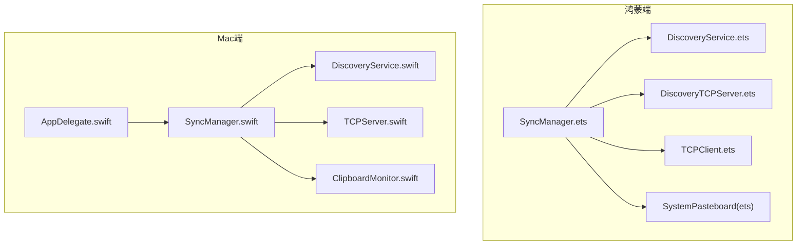
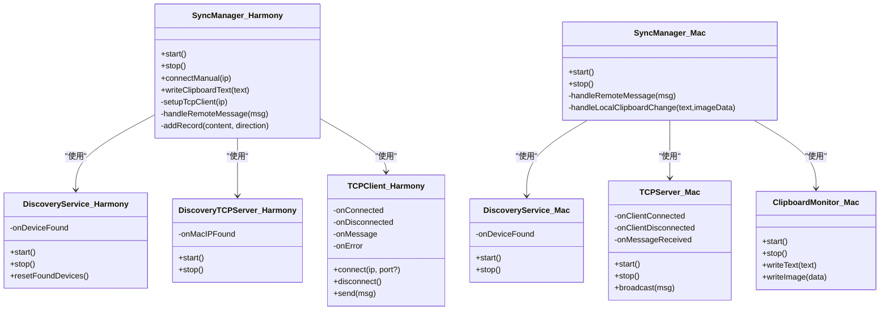
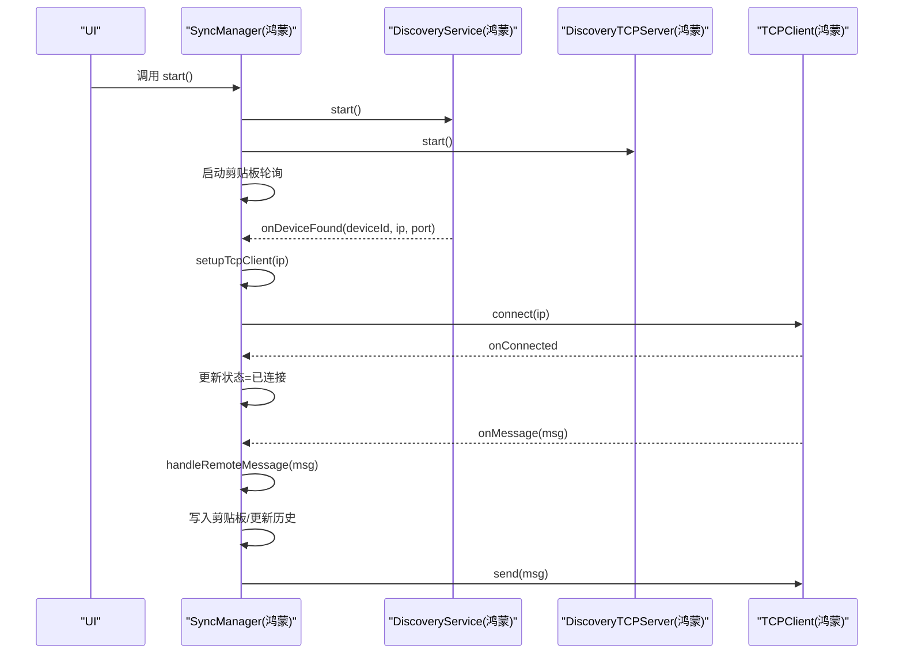
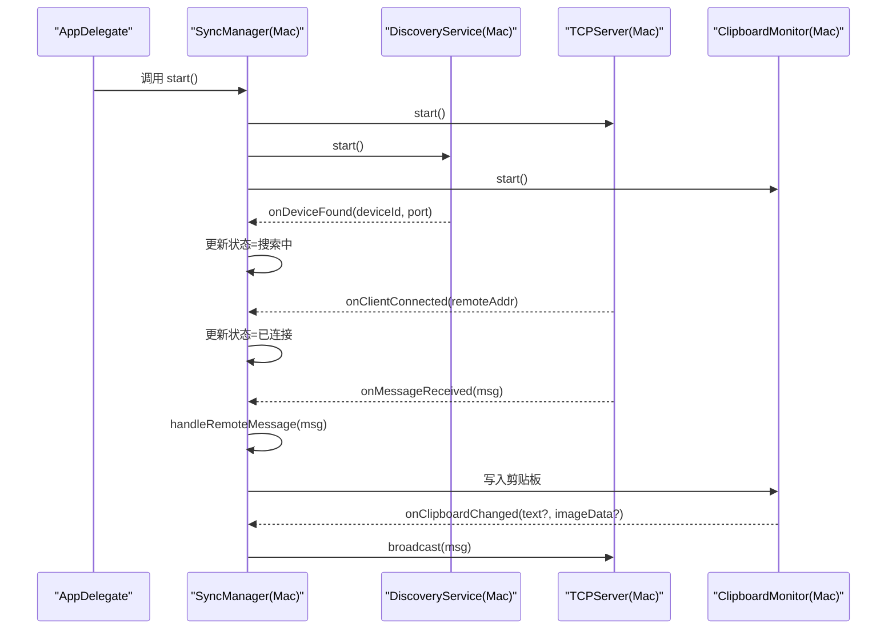
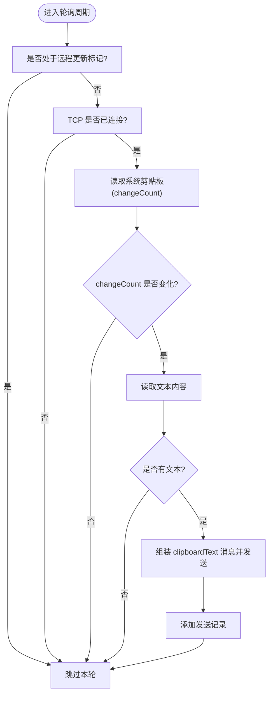

# API参考

<cite>
**本文引用的文件**
- [SyncManager.ets](file://ClipboardSync/harmony/entry/src/main/ets/model/SyncManager.ets)
- [Protocol.ets](file://ClipboardSync/harmony/entry/src/main/ets/common/Protocol.ets)
- [DiscoveryService.ets](file://ClipboardSync/harmony/entry/src/main/ets/common/DiscoveryService.ets)
- [DiscoveryTCPServer.ets](file://ClipboardSync/harmony/entry/src/main/ets/common/DiscoveryTCPServer.ets)
- [TCPClient.ets](file://ClipboardSync/harmony/entry/src/main/ets/common/TCPClient.ets)
- [SyncManager.swift](file://ClipboardSync/mac/ClipboardSync/SyncManager.swift)
- [Protocol.swift](file://ClipboardSync/mac/ClipboardSync/Protocol.swift)
- [DiscoveryService.swift](file://ClipboardSync/mac/ClipboardSync/DiscoveryService.swift)
- [TCPServer.swift](file://ClipboardSync/mac/ClipboardSync/TCPServer.swift)
- [ClipboardMonitor.swift](file://ClipboardSync/mac/ClipboardSync/ClipboardMonitor.swift)
- [AppDelegate.swift](file://ClipboardSync/mac/ClipboardSync/AppDelegate.swift)
- [PROJECT.md](file://ClipboardSync/PROJECT.md)
</cite>

## 目录
1. [简介](#简介)
2. [项目结构](#项目结构)
3. [核心组件](#核心组件)
4. [架构总览](#架构总览)
5. [详细组件分析](#详细组件分析)
6. [依赖关系分析](#依赖关系分析)
7. [性能考量](#性能考量)
8. [故障排查指南](#故障排查指南)
9. [结论](#结论)
10. [附录](#附录)

## 简介
本文件为 ClipboardSync 项目的完整 API 参考，覆盖 Mac 端与鸿蒙端的 SyncManager 实现对比，详述设备发现、TCP 通信、剪贴板操作、协议常量与消息结构，并提供错误处理与异常类型说明。文档同时给出关键流程的时序图与类图，帮助开发者快速理解与集成。

## 项目结构
项目采用“双端分离”的模块化组织方式：
- 鸿蒙端（ArkTS + ArkUI）：model 层的 SyncManager 协调 DiscoveryService、DiscoveryTCPServer、TCPClient 与系统剪贴板；common 层提供协议与网络组件。
- Mac 端（Swift + SwiftUI）：通过 SyncManager 协调 DiscoveryService、TCPServer、ClipboardMonitor，提供菜单栏 UI 与状态展示。



图表来源
- [SyncManager.ets:26-301](file://ClipboardSync/harmony/entry/src/main/ets/model/SyncManager.ets#L26-L301)
- [DiscoveryService.ets:10-161](file://ClipboardSync/harmony/entry/src/main/ets/common/DiscoveryService.ets#L10-L161)
- [DiscoveryTCPServer.ets:11-80](file://ClipboardSync/harmony/entry/src/main/ets/common/DiscoveryTCPServer.ets#L11-L80)
- [TCPClient.ets:11-181](file://ClipboardSync/harmony/entry/src/main/ets/common/TCPClient.ets#L11-L181)
- [SyncManager.swift:5-154](file://ClipboardSync/mac/ClipboardSync/SyncManager.swift#L5-L154)
- [DiscoveryService.swift:6-197](file://ClipboardSync/mac/ClipboardSync/DiscoveryService.swift#L6-L197)
- [TCPServer.swift:6-174](file://ClipboardSync/mac/ClipboardSync/TCPServer.swift#L6-L174)
- [ClipboardMonitor.swift:4-73](file://ClipboardSync/mac/ClipboardSync/ClipboardMonitor.swift#L4-L73)
- [AppDelegate.swift:4-46](file://ClipboardSync/mac/ClipboardSync/AppDelegate.swift#L4-L46)

章节来源
- [PROJECT.md:5-50](file://ClipboardSync/PROJECT.md#L5-L50)

## 核心组件
本节概述两端 SyncManager 的职责与差异：
- 鸿蒙端 SyncManager：负责启动 UDP 设备发现、TCP 发现服务、轮询系统剪贴板、发送/接收消息、维护状态与历史记录。
- Mac 端 SyncManager：负责启动 TCP 服务端、监听 UDP 广播、处理客户端连接与断开、广播消息、轮询系统剪贴板、写入剪贴板、维护状态与历史记录。

章节来源
- [SyncManager.ets:26-301](file://ClipboardSync/harmony/entry/src/main/ets/model/SyncManager.ets#L26-L301)
- [SyncManager.swift:5-154](file://ClipboardSync/mac/ClipboardSync/SyncManager.swift#L5-L154)

## 架构总览
系统采用“UDP 广播发现 + TCP 长连接传输”的双层架构。Mac 作为 TCP 服务端，鸿蒙作为 TCP 客户端；双方通过统一的协议常量与消息结构进行通信。

```mermaid
graph TB
subgraph "设备发现"
U1["UDP 广播(端口19876)"]
U2["UDP 广播(端口19876)"]
end
subgraph "TCP传输"
T1["TCP 服务端(端口19877)"]
T2["TCP 客户端(端口19877)"]
end
U1 --> T2
U2 --> T1
T1 <- --> T2
```

图表来源
- [PROJECT.md:52-62](file://ClipboardSync/PROJECT.md#L52-L62)
- [Protocol.ets:2-9](file://ClipboardSync/harmony/entry/src/main/ets/common/Protocol.ets#L2-L9)
- [Protocol.swift:4-17](file://ClipboardSync/mac/ClipboardSync/Protocol.swift#L4-L17)

## 详细组件分析

### SyncManager（鸿蒙端）
- 角色与职责
  - 协调设备发现、TCP 连接、剪贴板轮询与消息收发。
  - 维护状态（未连接/搜索中/已连接）、已连接设备 IP、同步历史、最后同步时间。
  - 提供状态变更回调，供 UI 层订阅。
- 关键属性
  - status: SyncStatus（枚举）
  - connectedDevice: string
  - history: SyncRecord[]
  - lastSyncTime: string
  - onStateChange?: () => void
  - discoveryLog: string
  - tcpLog: string
- 关键方法
  - start(): void —— 启动 UDP 发现、TCP 发现服务、剪贴板轮询。
  - stop(): void —— 停止所有服务，重置状态。
  - connectManual(ip: string): void —— 手动指定 Mac IP 进行连接。
  - writeClipboardText(text: string): void —— 写入系统剪贴板（内部处理远程更新标记）。
- 私有方法
  - handleDeviceFound(deviceId, ip, port): void
  - setupTcpClient(ip): void —— 断开旧连接、创建新 TCPClient、设置回调、延时连接。
  - handleRemoteMessage(msg): void —— 去重、根据消息类型写入剪贴板、更新历史与时间。
  - startClipboardPoll()/stopClipboardPoll(): void —— 周期性检查系统剪贴板。
  - checkClipboard()/readClipboard(): void —— 读取文本并发送，记录历史。
  - sendClipboardText(text): void —— 组装 SyncMessage 并通过 TCPClient 发送。
  - addRecord(content, direction): void —— 维护历史记录上限（50 条）。
- 事件回调
  - onConnected/onDisconnected/onMessage/onError（由 TCPClient 注入）
  - onDeviceFound（由 DiscoveryService 注入）

章节来源
- [SyncManager.ets:26-301](file://ClipboardSync/harmony/entry/src/main/ets/model/SyncManager.ets#L26-L301)

### SyncManager（Mac 端）
- 角色与职责
  - 作为 TCP 服务端，监听连接、广播消息、处理客户端断开。
  - 通过 DiscoveryService 监听 UDP 广播并触发 TCP 发现（连接到鸿蒙端的 DiscoveryTCPServer 端口）。
  - 通过 ClipboardMonitor 轮询系统剪贴板，写入文本或图片。
- 关键属性
  - status: SyncStatus（枚举）
  - connectedDevice: String?
  - lastSyncTime: Date?
  - syncHistory: [SyncRecord]
- 关键方法
  - start(): void —— 启动 TCP 服务端、UDP 发现、剪贴板监控。
  - stop(): void —— 停止服务端、发现、剪贴板监控。
  - handleRemoteMessage(msg): void —— 去重、根据消息类型写入剪贴板、更新历史与时间。
  - handleLocalClipboardChange(text:imageData): void —— 组装消息并通过广播发送。
- 私有方法
  - setupCallbacks(): void —— 设置各模块回调。
  - addRecord(content, direction): void —— 维护历史记录上限（50 条）。

章节来源
- [SyncManager.swift:5-154](file://ClipboardSync/mac/ClipboardSync/SyncManager.swift#L5-L154)

### 协议常量与消息结构（Protocol）
- 协议常量（两端共享）
  - 广播端口：19876
  - 数据传输端口：19877
  - TCP 发现端口：19878
  - 广播间隔：3 秒
  - 剪贴板轮询间隔：0.5 秒
  - 设备 ID：由平台生成（鸿蒙端随机，Mac 端主机名或随机）
- 消息类型（MessageType）
  - clipboardText：文本剪贴板
  - clipboardImage：图片剪贴板（Base64 字符串）
  - ping/pong：心跳探测
- 消息结构（SyncMessage）
  - type: MessageType
  - content: string（文本或 Base64 图片）
  - timestamp: number（秒）
  - deviceId: string
  - mimeType?: string（可选，如 text/plain、image/png）

章节来源
- [Protocol.ets:2-27](file://ClipboardSync/harmony/entry/src/main/ets/common/Protocol.ets#L2-L27)
- [Protocol.swift:4-43](file://ClipboardSync/mac/ClipboardSync/Protocol.swift#L4-L43)

### 设备发现 API（DiscoveryService）
- 鸿蒙端 DiscoveryService（UDP 广播）
  - 方法
    - start(): Promise<void> —— 创建 UDP Socket、绑定广播端口、启用广播、定时发送广播。
    - stop(): void —— 清理定时器、解绑、关闭 Socket。
    - resetFoundDevices(): void —— 重置已发现设备列表，允许重新发现同一设备。
  - 回调
    - onDeviceFound?: (deviceId: string, ip: string, port: number) => void
  - 内部逻辑要点
    - 广播消息为 SyncMessage，type 为 ping。
    - 对同一设备进行去重，避免重复回调。
    - 收到 Mac 广播后回调通知上层（端口固定为数据传输端口）。
- Mac 端 DiscoveryService（BSD Socket + NWConnection）
  - 方法
    - start(): void —— 启动 BSD UDP 监听与广播定时器。
    - stop(): void —— 停止定时器、关闭监听套接字。
  - 回调
    - onDeviceFound?: ((String, UInt16) -> Void)?
  - 内部逻辑要点
    - 监听广播，解析消息，过滤自身设备 ID。
    - 对新设备进行去重，回调通知。
    - 对新设备发起一次 TCP 连接（DiscoveryTCPServer 端口），用于让鸿蒙端获取 Mac 的 IP。
    - 使用独立队列避免阻塞主循环。

章节来源
- [DiscoveryService.ets:10-161](file://ClipboardSync/harmony/entry/src/main/ets/common/DiscoveryService.ets#L10-L161)
- [DiscoveryService.swift:6-197](file://ClipboardSync/mac/ClipboardSync/DiscoveryService.swift#L6-L197)

### TCP 通信 API（TCPServer 与 TCPClient）
- 鸿蒙端 TCPClient
  - 属性
    - connected: boolean
  - 方法
    - connect(ip: string, port?: number): void —— 建立 TCP 连接（默认端口为数据传输端口）。
    - disconnect(): void —— 主动断开并清理资源。
    - send(msg: SyncMessage): boolean —— 发送 JSON + 换行分隔的消息。
  - 回调
    - onConnected?: () => void
    - onDisconnected?: () => void
    - onMessage?: (msg: SyncMessage) => void
    - onError?: (err: string) => void
  - 内部机制
    - 使用换行符处理粘包，逐行解析 JSON。
    - 连接断开或错误时自动重连（5 秒间隔）。
- Mac 端 TCPServer
  - 属性
    - connectedCount: Int
  - 方法
    - start(): void —— 创建 NWListener，开始监听端口。
    - stop(): void —— 取消监听与所有连接，清空缓冲。
    - broadcast(message: SyncMessage): void —— 对所有连接广播消息（以换行结尾）。
  - 回调
    - onClientConnected?: ((String) -> Void)?
    - onClientDisconnected?: (() -> Void)?
    - onMessageReceived?: ((SyncMessage) -> Void)?

章节来源
- [TCPClient.ets:11-181](file://ClipboardSync/harmony/entry/src/main/ets/common/TCPClient.ets#L11-L181)
- [TCPServer.swift:6-174](file://ClipboardSync/mac/ClipboardSync/TCPServer.swift#L6-L174)

### 剪贴板操作 API
- 鸿蒙端
  - 读取：通过系统剪贴板轮询，检测 changeCount 变化后读取文本，必要时读取图片数据。
  - 写入：writeClipboardText(text: string): void —— 写入文本，内部设置远程更新标记避免回环。
- Mac 端
  - 读取：ClipboardMonitor 轮询 NSPasteboard，优先读取文本，其次读取图片并转换为 PNG Data。
  - 写入：writeText(text: String) / writeImage(imageData: Data) —— 写入文本或图片，更新 changeCount。

章节来源
- [SyncManager.ets:202-283](file://ClipboardSync/harmony/entry/src/main/ets/model/SyncManager.ets#L202-L283)
- [ClipboardMonitor.swift:4-73](file://ClipboardSync/mac/ClipboardSync/ClipboardMonitor.swift#L4-L73)

### 错误处理与异常类型
- 鸿蒙端
  - TCP 连接错误与业务错误：使用 BusinessError（来自 BasicServicesKit）作为错误回调参数类型。
  - 常见问题
    - socket.close() 异步导致“Operation in progress”错误：需先断开旧连接，延迟后再建立新连接。
    - socket.SocketErrorInfo 在 API 23 中不可用：改用 BusinessError。
- Mac 端
  - NWListener 默认监听 IPv6：不影响连接，但 lsof 显示可能误导。
  - BSD Socket 错误码：bind/sendto 等系统调用失败时打印 errno 便于定位。

章节来源
- [PROJECT.md:102-131](file://ClipboardSync/PROJECT.md#L102-L131)
- [TCPClient.ets:83-90](file://ClipboardSync/harmony/entry/src/main/ets/common/TCPClient.ets#L83-L90)
- [DiscoveryService.swift:52-56](file://ClipboardSync/mac/ClipboardSync/DiscoveryService.swift#L52-L56)

## 依赖关系分析



图表来源
- [SyncManager.ets:26-301](file://ClipboardSync/harmony/entry/src/main/ets/model/SyncManager.ets#L26-L301)
- [DiscoveryService.ets:10-161](file://ClipboardSync/harmony/entry/src/main/ets/common/DiscoveryService.ets#L10-L161)
- [DiscoveryTCPServer.ets:11-80](file://ClipboardSync/harmony/entry/src/main/ets/common/DiscoveryTCPServer.ets#L11-L80)
- [TCPClient.ets:11-181](file://ClipboardSync/harmony/entry/src/main/ets/common/TCPClient.ets#L11-L181)
- [SyncManager.swift:5-154](file://ClipboardSync/mac/ClipboardSync/SyncManager.swift#L5-L154)
- [DiscoveryService.swift:6-197](file://ClipboardSync/mac/ClipboardSync/DiscoveryService.swift#L6-L197)
- [TCPServer.swift:6-174](file://ClipboardSync/mac/ClipboardSync/TCPServer.swift#L6-L174)
- [ClipboardMonitor.swift:4-73](file://ClipboardSync/mac/ClipboardSync/ClipboardMonitor.swift#L4-L73)

## 性能考量
- 轮询策略
  - 剪贴板轮询间隔：0.5 秒（鸿蒙端）与 0.5 秒（Mac 端），兼顾实时性与 CPU 占用。
  - 广播间隔：3 秒，平衡发现灵敏度与网络负载。
- 粘包处理
  - 采用换行符分隔消息，两端均实现缓冲拼接与逐行解析，避免丢包与重复处理。
- 去重与回环防护
  - 通过消息时间戳判断，避免写入剪贴板后触发监听回环。

## 故障排查指南
- 鸿蒙端连接失败（Operation in progress）
  - 现象：connect 抛错，提示操作进行中。
  - 原因：旧 socket 未完全关闭。
  - 处理：先断开旧连接，延迟 500ms 再建立新连接。
- 鸿蒙端 socket.SocketErrorInfo 不可用
  - 现象：编译报错找不到类型。
  - 处理：使用 BusinessError 替代。
- Mac 端 NWListener 监听 IPv6
  - 现象：lsof 显示 IPv6，但实际可正常连接。
  - 处理：属系统行为，无需改动。
- Mac 端菜单栏图标未显示
  - 现象：应用启动后无 Dock 图标，但状态栏无图标。
  - 处理：确保在 AppDelegate 中设置激活策略为 accessory，并正确创建状态项。

章节来源
- [PROJECT.md:102-131](file://ClipboardSync/PROJECT.md#L102-L131)
- [AppDelegate.swift:32-35](file://ClipboardSync/mac/ClipboardSync/AppDelegate.swift#L32-L35)

## 结论
本项目通过统一的协议与清晰的模块划分，在 Mac 与鸿蒙之间实现了可靠的剪贴板同步。两端的 SyncManager 各司其职：Mac 端作为服务端稳定承载，鸿蒙端作为客户端灵活接入。建议后续完善 UDP 自动发现与图片同步能力，进一步提升用户体验与稳定性。

## 附录

### API 一览与使用示例路径
- 鸿蒙端 SyncManager
  - start(): 启动发现与轮询。[路径:72-98](file://ClipboardSync/harmony/entry/src/main/ets/model/SyncManager.ets#L72-L98)
  - stop(): 停止所有服务。[路径:100-108](file://ClipboardSync/harmony/entry/src/main/ets/model/SyncManager.ets#L100-L108)
  - connectManual(ip): 手动连接指定 IP。[路径:111-117](file://ClipboardSync/harmony/entry/src/main/ets/model/SyncManager.ets#L111-L117)
  - writeClipboardText(text): 写入系统剪贴板。[路径:273-283](file://ClipboardSync/harmony/entry/src/main/ets/model/SyncManager.ets#L273-L283)
- Mac 端 SyncManager
  - start(): 启动服务端、发现与剪贴板监控。[路径:40-53](file://ClipboardSync/mac/ClipboardSync/SyncManager.swift#L40-L53)
  - stop(): 停止服务端、发现与剪贴板监控。[路径:47-53](file://ClipboardSync/mac/ClipboardSync/SyncManager.swift#L47-L53)
- 设备发现
  - DiscoveryService（鸿蒙）：start/stop/resetFoundDevices/onDeviceFound。[路径:25-85](file://ClipboardSync/harmony/entry/src/main/ets/common/DiscoveryService.ets#L25-L85)
  - DiscoveryService（Mac）：start/stop/onDeviceFound。[路径:15-29](file://ClipboardSync/mac/ClipboardSync/DiscoveryService.swift#L15-L29)
- TCP 通信
  - TCPClient（鸿蒙）：connect/disconnect/send/onConnected/onDisconnected/onMessage/onError。[路径:30-58](file://ClipboardSync/harmony/entry/src/main/ets/common/TCPClient.ets#L30-L58)
  - TCPServer（Mac）：start/stop/broadcast/onClientConnected/onClientDisconnected/onMessageReceived。[路径:23-67](file://ClipboardSync/mac/ClipboardSync/TCPServer.swift#L23-L67)
- 剪贴板
  - 鸿蒙：readClipboard/writeClipboardText。[路径:235-283](file://ClipboardSync/harmony/entry/src/main/ets/model/SyncManager.ets#L235-L283)
  - Mac：ClipboardMonitor.start/stop/writeText/writeImage。[路径:16-48](file://ClipboardSync/mac/ClipboardSync/ClipboardMonitor.swift#L16-L48)

### 时序图：连接与消息收发（鸿蒙端）


图表来源
- [SyncManager.ets:72-174](file://ClipboardSync/harmony/entry/src/main/ets/model/SyncManager.ets#L72-L174)
- [TCPClient.ets:60-113](file://ClipboardSync/harmony/entry/src/main/ets/common/TCPClient.ets#L60-L113)

### 时序图：连接与消息收发（Mac 端）


图表来源
- [AppDelegate.swift:9-10](file://ClipboardSync/mac/ClipboardSync/AppDelegate.swift#L9-L10)
- [SyncManager.swift:40-93](file://ClipboardSync/mac/ClipboardSync/SyncManager.swift#L40-L93)
- [TCPServer.swift:75-97](file://ClipboardSync/mac/ClipboardSync/TCPServer.swift#L75-L97)

### 流程图：剪贴板轮询与发送（鸿蒙端）


图表来源
- [SyncManager.ets:202-252](file://ClipboardSync/harmony/entry/src/main/ets/model/SyncManager.ets#L202-L252)