# Mac端应用详解

<cite>
**本文档引用的文件**
- [ClipboardSyncApp.swift](file://ClipboardSync/mac/ClipboardSync/ClipboardSyncApp.swift)
- [AppDelegate.swift](file://ClipboardSync/mac/ClipboardSync/AppDelegate.swift)
- [MainView.swift](file://ClipboardSync/mac/ClipboardSync/MainView.swift)
- [SyncManager.swift](file://ClipboardSync/mac/ClipboardSync/SyncManager.swift)
- [DiscoveryService.swift](file://ClipboardSync/mac/ClipboardSync/DiscoveryService.swift)
- [TCPServer.swift](file://ClipboardSync/mac/ClipboardSync/TCPServer.swift)
- [ClipboardMonitor.swift](file://ClipboardSync/mac/ClipboardSync/ClipboardMonitor.swift)
- [Protocol.swift](file://ClipboardSync/mac/ClipboardSync/Protocol.swift)
- [Package.swift](file://ClipboardSync/mac/Package.swift)
- [Info.plist](file://ClipboardSync/mac/ClipboardSync/Info.plist)
</cite>

## 目录
1. [简介](#简介)
2. [项目结构](#项目结构)
3. [核心组件](#核心组件)
4. [架构概览](#架构概览)
5. [详细组件分析](#详细组件分析)
6. [依赖关系分析](#依赖关系分析)
7. [性能考虑](#性能考虑)
8. [故障排除指南](#故障排除指南)
9. [结论](#结论)

## 简介

这是一个基于SwiftUI开发的Mac端剪贴板同步应用，实现了与Harmony设备之间的双向剪贴板同步功能。应用采用模块化架构设计，通过UDP广播发现设备，建立TCP连接进行数据传输，并通过NSPasteboard轮询监听剪贴板变化。

## 项目结构

项目采用清晰的模块化组织结构，主要包含以下目录和文件：

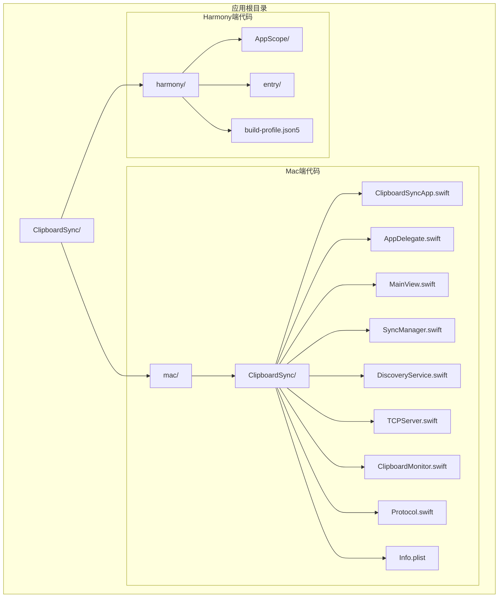

**图表来源**
- [Package.swift:1-18](file://ClipboardSync/mac/Package.swift#L1-L18)
- [ClipboardSyncApp.swift:1-12](file://ClipboardSync/mac/ClipboardSync/ClipboardSyncApp.swift#L1-L12)

**章节来源**
- [Package.swift:1-18](file://ClipboardSync/mac/Package.swift#L1-L18)
- [Info.plist:1-32](file://ClipboardSync/mac/ClipboardSync/Info.plist#L1-L32)

## 核心组件

应用采用MVVM架构模式，主要由以下核心组件构成：

### 应用入口层
- **ClipboardSyncApp**: SwiftUI应用主入口，负责应用生命周期管理
- **AppDelegate**: macOS应用委托，管理菜单栏图标和popover弹窗

### 视图层
- **MainView**: SwiftUI界面视图，展示同步状态、设备信息和历史记录

### 协调管理层
- **SyncManager**: 总协调器，统一管理各个子模块的启动、停止和状态同步

### 通信层
- **DiscoveryService**: UDP广播发现服务，实现局域网设备发现
- **TCPServer**: TCP服务端，处理客户端连接和消息传输
- **ClipboardMonitor**: 剪贴板监听器，轮询监控剪贴板变化

### 协议层
- **Protocol**: 通信协议定义，包含消息格式和端口配置

**章节来源**
- [ClipboardSyncApp.swift:1-12](file://ClipboardSync/mac/ClipboardSync/ClipboardSyncApp.swift#L1-L12)
- [AppDelegate.swift:1-46](file://ClipboardSync/mac/ClipboardSync/AppDelegate.swift#L1-L46)
- [MainView.swift:1-209](file://ClipboardSync/mac/ClipboardSync/MainView.swift#L1-L209)
- [SyncManager.swift:1-154](file://ClipboardSync/mac/ClipboardSync/SyncManager.swift#L1-L154)

## 架构概览

应用采用分层架构设计，各层职责明确，耦合度低：

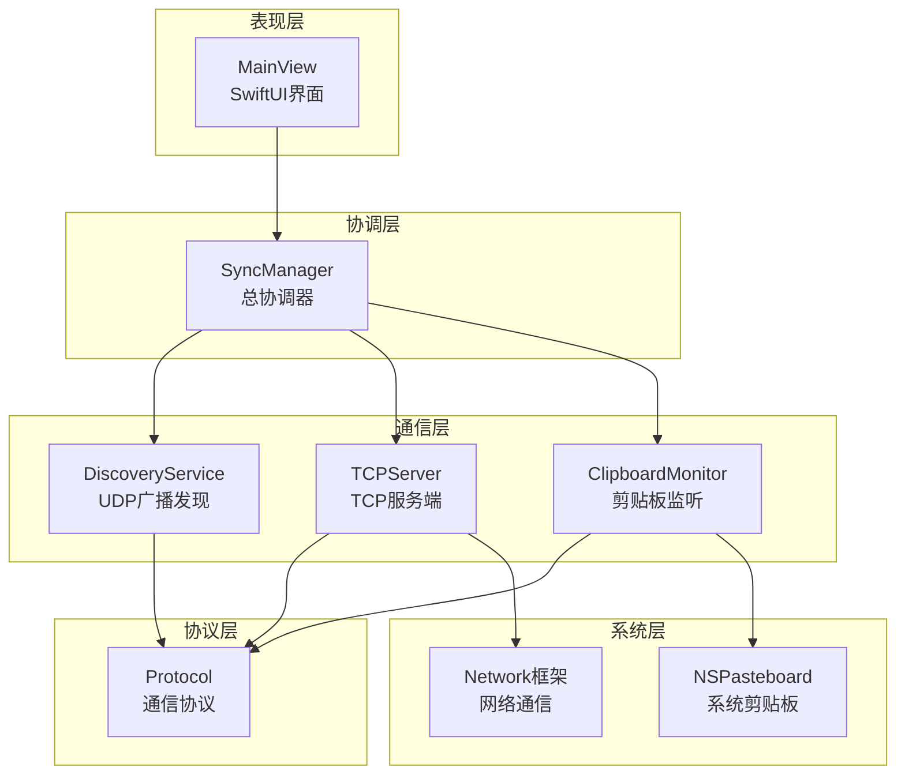

**图表来源**
- [SyncManager.swift:4-154](file://ClipboardSync/mac/ClipboardSync/SyncManager.swift#L4-L154)
- [DiscoveryService.swift:4-197](file://ClipboardSync/mac/ClipboardSync/DiscoveryService.swift#L4-L197)
- [TCPServer.swift:4-174](file://ClipboardSync/mac/ClipboardSync/TCPServer.swift#L4-L174)
- [ClipboardMonitor.swift:3-73](file://ClipboardSync/mac/ClipboardSync/ClipboardMonitor.swift#L3-L73)

## 详细组件分析

### ClipboardSyncApp 应用入口

应用入口采用SwiftUI的@main装饰器，创建了应用程序的主入口点：

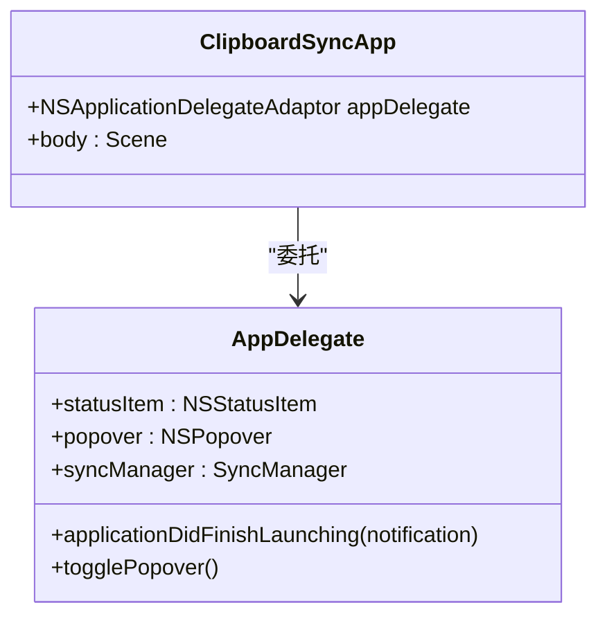

**图表来源**
- [ClipboardSyncApp.swift:3-12](file://ClipboardSync/mac/ClipboardSync/ClipboardSyncApp.swift#L3-L12)
- [AppDelegate.swift:4-46](file://ClipboardSync/mac/ClipboardSync/AppDelegate.swift#L4-L46)

应用启动流程：
1. 初始化AppDelegate委托
2. 配置设置场景
3. 在应用启动时初始化SyncManager并开始运行

**章节来源**
- [ClipboardSyncApp.swift:1-12](file://ClipboardSync/mac/ClipboardSync/ClipboardSyncApp.swift#L1-L12)
- [AppDelegate.swift:9-35](file://ClipboardSync/mac/ClipboardSync/AppDelegate.swift#L9-L35)

### AppDelegate 菜单栏管理

AppDelegate负责管理菜单栏图标和popover弹窗：

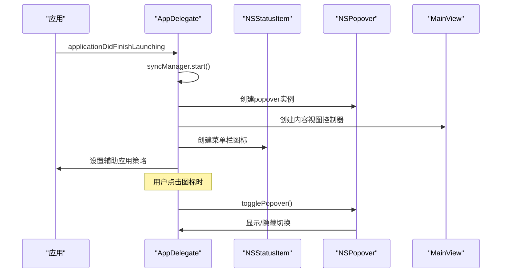

**图表来源**
- [AppDelegate.swift:9-46](file://ClipboardSync/mac/ClipboardSync/AppDelegate.swift#L9-L46)
- [MainView.swift:3-21](file://ClipboardSync/mac/ClipboardSync/MainView.swift#L3-L21)

关键特性：
- 菜单栏图标使用系统符号"clipboard"
- popover尺寸固定为340x440像素
- 支持Transient行为，点击外部自动关闭
- 设置为辅助应用，不显示在Dock中

**章节来源**
- [AppDelegate.swift:12-35](file://ClipboardSync/mac/ClipboardSync/AppDelegate.swift#L12-L35)
- [AppDelegate.swift:37-45](file://ClipboardSync/mac/ClipboardSync/AppDelegate.swift#L37-L45)

### MainView SwiftUI界面

MainView采用SwiftUI构建响应式界面：

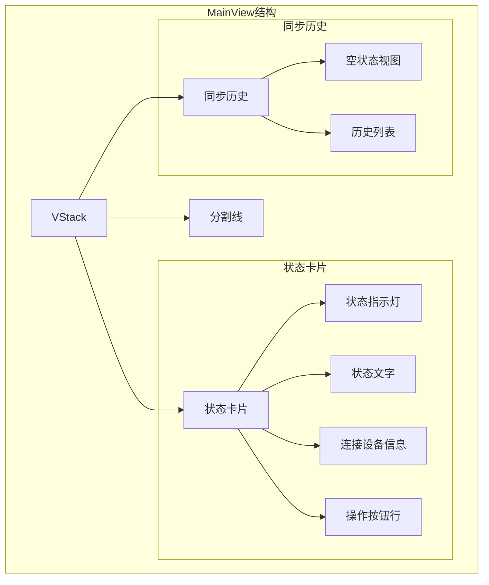

**图表来源**
- [MainView.swift:6-21](file://ClipboardSync/mac/ClipboardSync/MainView.swift#L6-L21)
- [MainView.swift:25-125](file://ClipboardSync/mac/ClipboardSync/MainView.swift#L25-L125)
- [MainView.swift:137-207](file://ClipboardSync/mac/ClipboardSync/MainView.swift#L137-L207)

界面元素：
- **状态指示灯**: 绿色表示已连接，橙色表示搜索中，灰色表示未连接
- **设备信息**: 显示当前连接的设备名称
- **操作按钮**: 刷新和断开连接按钮
- **历史记录**: 最多显示50条同步记录

**章节来源**
- [MainView.swift:25-133](file://ClipboardSync/mac/ClipboardSync/MainView.swift#L25-L133)
- [MainView.swift:137-207](file://ClipboardSync/mac/ClipboardSync/MainView.swift#L137-L207)

### SyncManager 总协调器

SyncManager是整个应用的核心协调器，负责管理各个子模块：

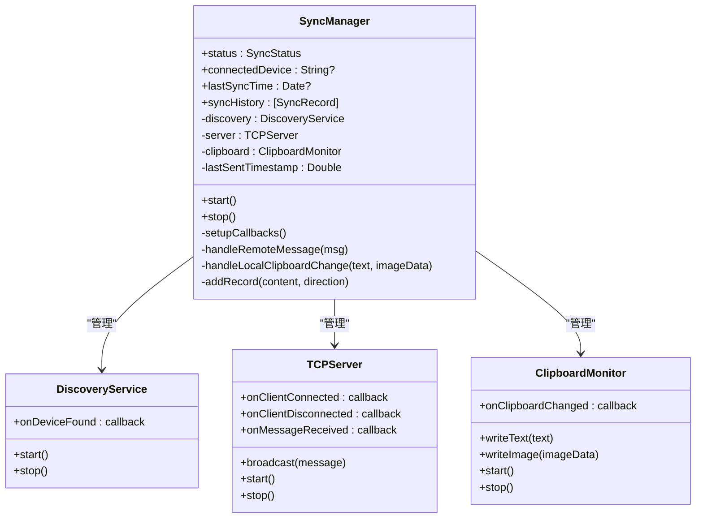

**图表来源**
- [SyncManager.swift:4-154](file://ClipboardSync/mac/ClipboardSync/SyncManager.swift#L4-L154)
- [DiscoveryService.swift:6-29](file://ClipboardSync/mac/ClipboardSync/DiscoveryService.swift#L6-L29)
- [TCPServer.swift:6-58](file://ClipboardSync/mac/ClipboardSync/TCPServer.swift#L6-L58)
- [ClipboardMonitor.swift:4-48](file://ClipboardSync/mac/ClipboardSync/ClipboardMonitor.swift#L4-L48)

核心功能：
- **状态管理**: 维护连接状态、设备信息和同步历史
- **模块协调**: 统一启动/停止所有子模块
- **消息处理**: 处理远程消息和本地剪贴板变化
- **去重机制**: 防止消息回环和重复同步

**章节来源**
- [SyncManager.swift:36-53](file://ClipboardSync/mac/ClipboardSync/SyncManager.swift#L36-L53)
- [SyncManager.swift:55-93](file://ClipboardSync/mac/ClipboardSync/SyncManager.swift#L55-L93)
- [SyncManager.swift:95-152](file://ClipboardSync/mac/ClipboardSync/SyncManager.swift#L95-L152)

### DiscoveryService UDP广播发现

DiscoveryService实现基于UDP广播的设备发现机制：

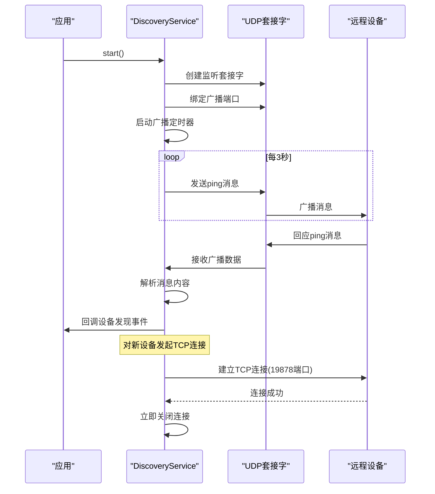

**图表来源**
- [DiscoveryService.swift:15-146](file://ClipboardSync/mac/ClipboardSync/DiscoveryService.swift#L15-L146)
- [DiscoveryService.swift:151-180](file://ClipboardSync/mac/ClipboardSync/DiscoveryService.swift#L151-L180)

技术特点：
- **BSD Socket**: 使用底层socket API实现UDP通信
- **去重机制**: 避免重复发现同一设备
- **TCP配合**: 通过TCP连接获取远程设备IP地址
- **异步处理**: 使用DispatchQueue处理网络I/O

**章节来源**
- [DiscoveryService.swift:33-76](file://ClipboardSync/mac/ClipboardSync/DiscoveryService.swift#L33-L76)
- [DiscoveryService.swift:104-146](file://ClipboardSync/mac/ClipboardSync/DiscoveryService.swift#L104-L146)
- [DiscoveryService.swift:151-180](file://ClipboardSync/mac/ClipboardSync/DiscoveryService.swift#L151-L180)

### TCPServer TCP服务端

TCPServer实现基于Network框架的TCP服务端：

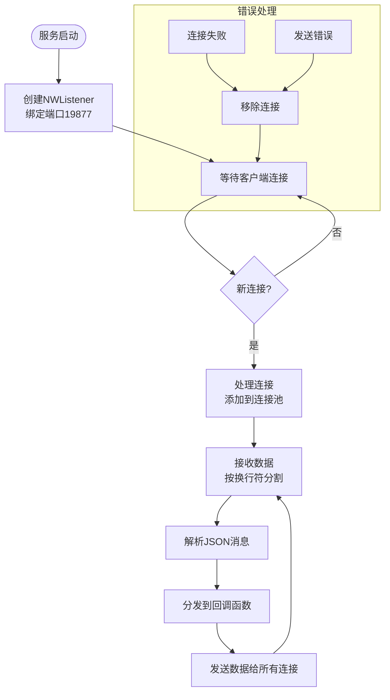

**图表来源**
- [TCPServer.swift:23-51](file://ClipboardSync/mac/ClipboardSync/TCPServer.swift#L23-L51)
- [TCPServer.swift:75-97](file://ClipboardSync/mac/ClipboardSync/TCPServer.swift#L75-L97)
- [TCPServer.swift:129-148](file://ClipboardSync/mac/ClipboardSync/TCPServer.swift#L129-L148)

核心特性：
- **粘包处理**: 使用缓冲区和换行符分割消息
- **多连接管理**: 支持同时连接多个客户端
- **消息广播**: 自动将消息广播给所有连接的客户端
- **状态监控**: 实时跟踪连接数量和状态

**章节来源**
- [TCPServer.swift:19-21](file://ClipboardSync/mac/ClipboardSync/TCPServer.swift#L19-L21)
- [TCPServer.swift:60-67](file://ClipboardSync/mac/ClipboardSync/TCPServer.swift#L60-L67)
- [TCPServer.swift:129-148](file://ClipboardSync/mac/ClipboardSync/TCPServer.swift#L129-L148)

### ClipboardMonitor 剪贴板监听

ClipboardMonitor实现基于定时器的剪贴板轮询监听：

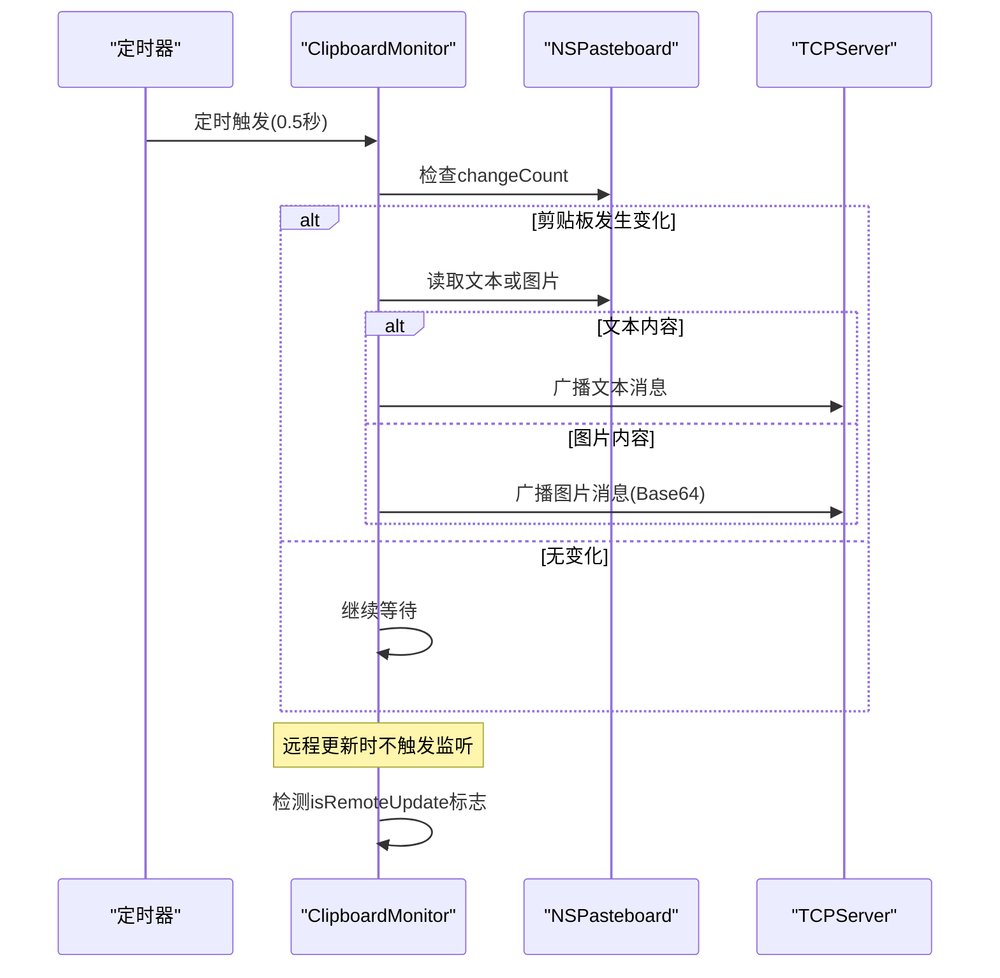

**图表来源**
- [ClipboardMonitor.swift:16-23](file://ClipboardSync/mac/ClipboardSync/ClipboardMonitor.swift#L16-L23)
- [ClipboardMonitor.swift:50-71](file://ClipboardSync/mac/ClipboardSync/ClipboardMonitor.swift#L50-L71)

实现细节：
- **轮询机制**: 每0.5秒检查一次剪贴板变化
- **内容检测**: 优先检测文本，其次检测图片
- **远程更新保护**: 避免处理来自远程设备的更新
- **格式转换**: 图片自动转换为PNG格式

**章节来源**
- [ClipboardMonitor.swift:16-28](file://ClipboardSync/mac/ClipboardSync/ClipboardMonitor.swift#L16-L28)
- [ClipboardMonitor.swift:30-48](file://ClipboardSync/mac/ClipboardSync/ClipboardMonitor.swift#L30-L48)
- [ClipboardMonitor.swift:50-71](file://ClipboardSync/mac/ClipboardSync/ClipboardMonitor.swift#L50-L71)

### Protocol 通信协议

Protocol定义了应用的通信协议和消息格式：

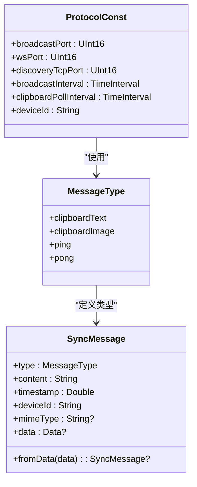

**图表来源**
- [Protocol.swift:4-17](file://ClipboardSync/mac/ClipboardSync/Protocol.swift#L4-L17)
- [Protocol.swift:19-25](file://ClipboardSync/mac/ClipboardSync/Protocol.swift#L19-L25)
- [Protocol.swift:27-42](file://ClipboardSync/mac/ClipboardSync/Protocol.swift#L27-L42)

协议规范：
- **端口分配**: 广播端口19876，数据端口19877，发现端口19878
- **消息类型**: 文本、图片、ping、pong四种类型
- **时间戳**: 使用Unix时间戳防止消息回环
- **设备标识**: 自动生成唯一的设备ID

**章节来源**
- [Protocol.swift:4-17](file://ClipboardSync/mac/ClipboardSync/Protocol.swift#L4-L17)
- [Protocol.swift:19-42](file://ClipboardSync/mac/ClipboardSync/Protocol.swift#L19-L42)

## 依赖关系分析

应用的依赖关系呈现清晰的层次结构：

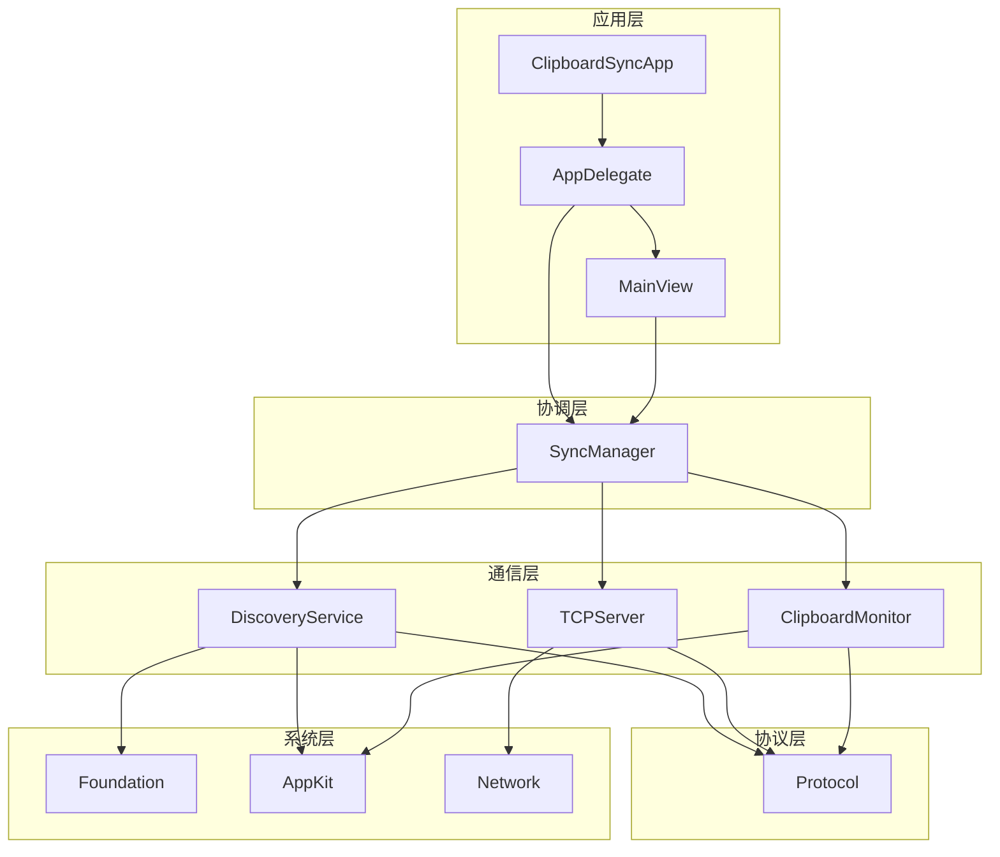

**图表来源**
- [SyncManager.swift:11-13](file://ClipboardSync/mac/ClipboardSync/SyncManager.swift#L11-L13)
- [DiscoveryService.swift:1-2](file://ClipboardSync/mac/ClipboardSync/DiscoveryService.swift#L1-L2)
- [TCPServer.swift:1-2](file://ClipboardSync/mac/ClipboardSync/TCPServer.swift#L1-L2)
- [ClipboardMonitor.swift:1](file://ClipboardSync/mac/ClipboardSync/ClipboardMonitor.swift#L1-L1)

**章节来源**
- [SyncManager.swift:11-13](file://ClipboardSync/mac/ClipboardSync/SyncManager.swift#L11-L13)
- [DiscoveryService.swift:1-2](file://ClipboardSync/mac/ClipboardSync/DiscoveryService.swift#L1-L2)
- [TCPServer.swift:1-2](file://ClipboardSync/mac/ClipboardSync/TCPServer.swift#L1-L2)
- [ClipboardMonitor.swift:1](file://ClipboardSync/mac/ClipboardSync/ClipboardMonitor.swift#L1-L1)

## 性能考虑

### 内存管理
- **弱引用**: 所有回调都使用weak self避免循环引用
- **定时器清理**: 停止时及时清理定时器资源
- **连接池管理**: 及时移除断开的连接

### 网络优化
- **批量处理**: TCP粘包处理减少网络开销
- **去重机制**: 防止消息重复处理
- **异步I/O**: 使用DispatchQueue避免阻塞主线程

### 剪贴板优化
- **轮询间隔**: 0.5秒的轮询频率平衡响应性和CPU占用
- **内容优先级**: 先检测文本再检测图片，提高效率
- **格式转换**: 图片自动转换为PNG，保证兼容性

### 线程安全
- **主线程更新**: 所有UI更新都在主线程执行
- **队列隔离**: 不同模块使用独立的DispatchQueue
- **状态同步**: 使用@Published属性自动通知观察者

## 故障排除指南

### 应用无法启动
**症状**: 应用启动后无菜单栏图标
**排查步骤**:
1. 检查Info.plist中的LSUIElement设置
2. 验证应用是否具有必要的权限
3. 查看控制台日志中的错误信息

**章节来源**
- [Info.plist:23-24](file://ClipboardSync/mac/ClipboardSync/Info.plist#L23-L24)

### 设备发现失败
**症状**: 无法发现其他设备
**排查步骤**:
1. 检查防火墙设置是否允许UDP广播
2. 验证广播端口19876是否被占用
3. 确认网络连接正常
4. 查看控制台输出的UDP绑定错误

**章节来源**
- [DiscoveryService.swift:52-56](file://ClipboardSync/mac/ClipboardSync/DiscoveryService.swift#L52-L56)

### 连接建立问题
**症状**: TCP连接失败或频繁断开
**排查步骤**:
1. 检查数据端口19877是否开放
2. 验证Network框架权限
3. 查看连接状态更新日志
4. 确认客户端版本兼容性

**章节来源**
- [TCPServer.swift:35-44](file://ClipboardSync/mac/ClipboardSync/TCPServer.swift#L35-L44)

### 剪贴板同步异常
**症状**: 剪贴板内容不同步或重复同步
**排查步骤**:
1. 检查轮询间隔设置(0.5秒)
2. 验证isRemoteUpdate标志位
3. 查看消息时间戳去重逻辑
4. 确认消息格式正确

**章节来源**
- [ClipboardMonitor.swift:50-52](file://ClipboardSync/mac/ClipboardSync/ClipboardMonitor.swift#L50-L52)
- [SyncManager.swift:96-98](file://ClipboardSync/mac/ClipboardSync/SyncManager.swift#L96-L98)

### 性能问题
**症状**: CPU占用过高或响应延迟
**解决方案**:
1. 调整轮询间隔参数
2. 优化消息处理逻辑
3. 检查是否有内存泄漏
4. 考虑使用更高效的网络库

## 结论

这个Mac端剪贴板同步应用展现了良好的架构设计和实现质量。通过模块化的设计，各组件职责明确，耦合度低，便于维护和扩展。应用采用了成熟的SwiftUI界面框架和Network框架，确保了良好的用户体验和性能表现。

主要优势：
- **架构清晰**: 分层设计使代码结构易于理解
- **功能完整**: 实现了从设备发现到数据传输的完整流程
- **性能优化**: 采用多种优化策略提升应用性能
- **错误处理**: 完善的错误处理和故障恢复机制

改进建议：
- 可以考虑实现更智能的连接管理策略
- 增加更多的配置选项和用户自定义功能
- 考虑支持更多类型的剪贴板内容
- 添加详细的日志记录和调试功能