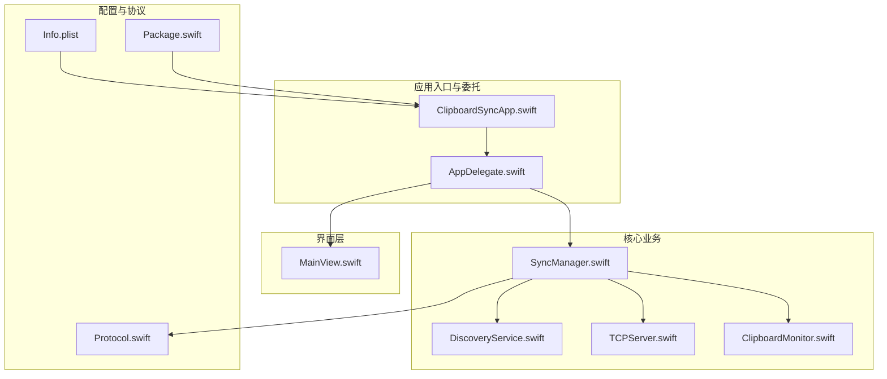
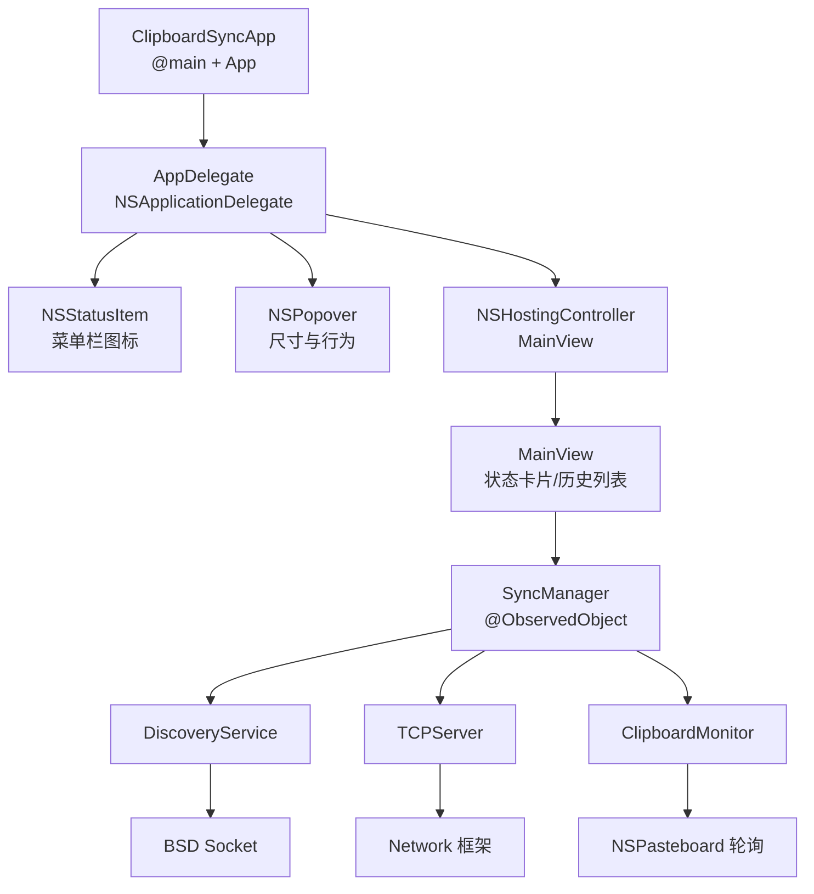
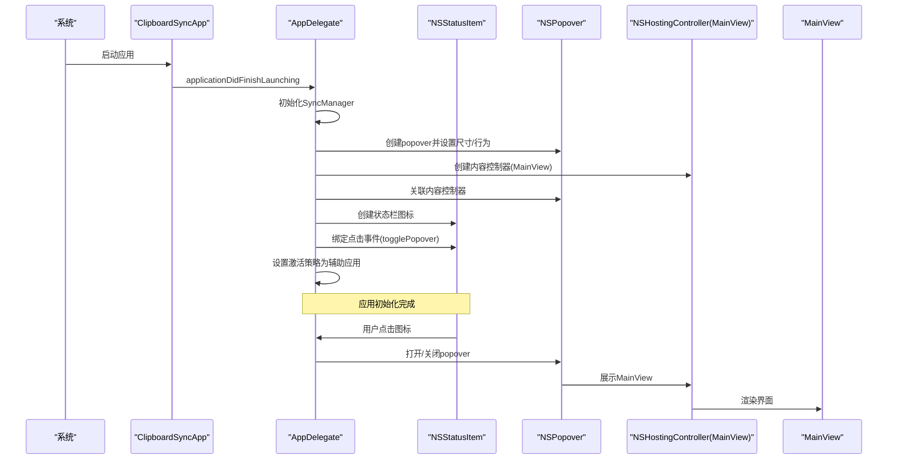
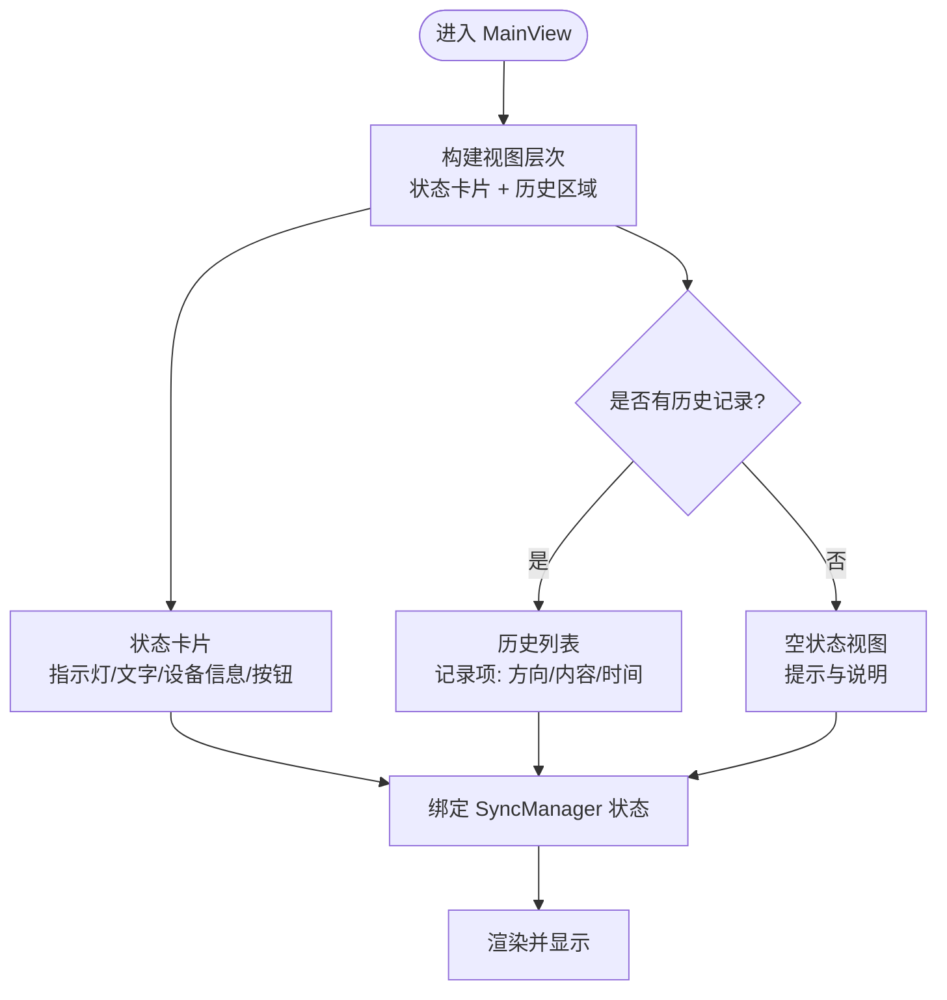
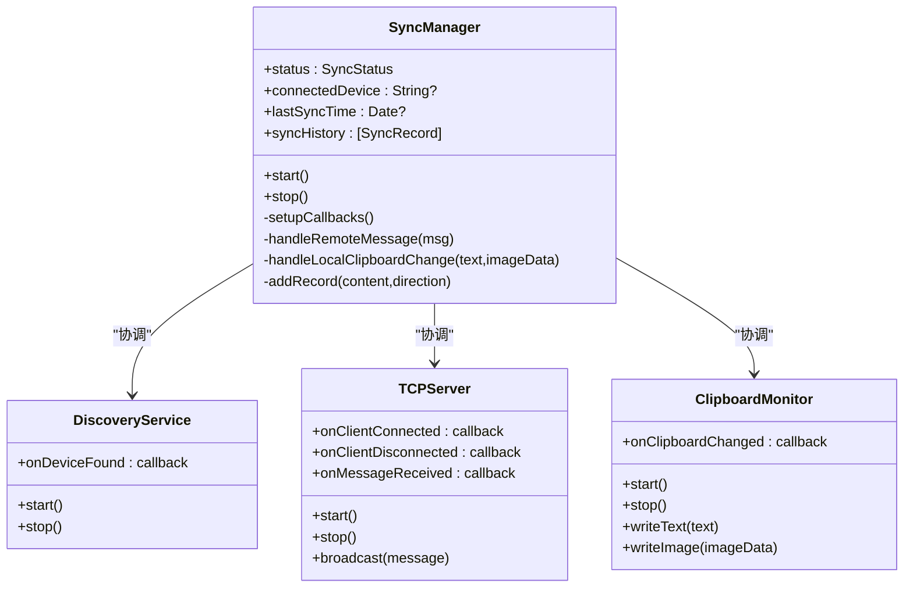
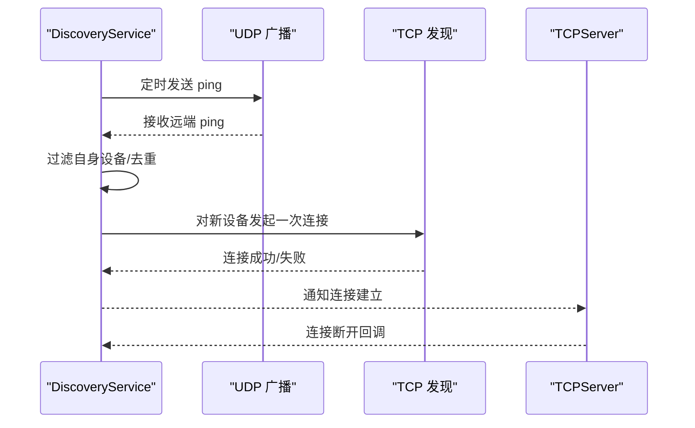
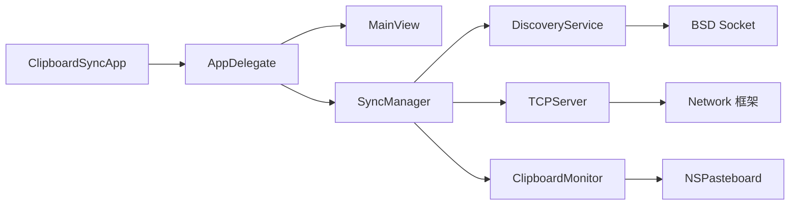
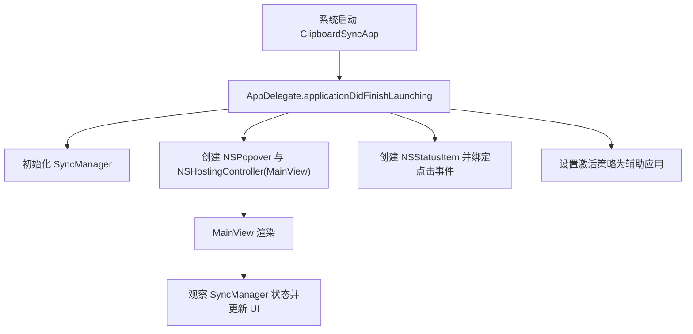

# 应用架构

<cite>
**本文引用的文件**
- [ClipboardSyncApp.swift](file://ClipboardSync/mac/ClipboardSync/ClipboardSyncApp.swift)
- [AppDelegate.swift](file://ClipboardSync/mac/ClipboardSync/AppDelegate.swift)
- [MainView.swift](file://ClipboardSync/mac/ClipboardSync/MainView.swift)
- [SyncManager.swift](file://ClipboardSync/mac/ClipboardSync/SyncManager.swift)
- [Protocol.swift](file://ClipboardSync/mac/ClipboardSync/Protocol.swift)
- [DiscoveryService.swift](file://ClipboardSync/mac/ClipboardSync/DiscoveryService.swift)
- [TCPServer.swift](file://ClipboardSync/mac/ClipboardSync/TCPServer.swift)
- [ClipboardMonitor.swift](file://ClipboardSync/mac/ClipboardSync/ClipboardMonitor.swift)
- [Info.plist](file://ClipboardSync/mac/ClipboardSync/Info.plist)
- [Package.swift](file://ClipboardSync/mac/Package.swift)
</cite>

## 目录
1. [简介](#简介)
2. [项目结构](#项目结构)
3. [核心组件](#核心组件)
4. [架构总览](#架构总览)
5. [详细组件分析](#详细组件分析)
6. [依赖关系分析](#依赖关系分析)
7. [性能考量](#性能考量)
8. [故障排查指南](#故障排查指南)
9. [结论](#结论)
10. [附录](#附录)

## 简介
本文件面向Mac端应用架构，围绕SwiftUI应用入口与菜单栏集成方案进行系统性解析。重点覆盖：
- 应用入口与生命周期：@main装饰器与App协议的应用启动流程
- 菜单栏集成：NSApplicationDelegateAdaptor的使用、NSStatusItem与NSPopover的创建与管理
- 界面层：MainView的SwiftUI视图结构、状态绑定与交互处理
- 数据流与状态持久化：应用状态通过ObservableObject与@Published实现的响应式更新
- 启动流程图与组件间通信示例：展示从应用启动到界面呈现的关键路径

## 项目结构
该工程采用“功能模块化+SwiftUI界面”的组织方式，核心代码位于 ClipboardSync/mac/ClipboardSync 目录下，主要文件如下：
- 应用入口与委托：ClipboardSyncApp.swift、AppDelegate.swift
- 界面层：MainView.swift
- 核心业务：SyncManager.swift、DiscoveryService.swift、TCPServer.swift、ClipboardMonitor.swift
- 协议与配置：Protocol.swift、Info.plist、Package.swift

图表来源
- [ClipboardSyncApp.swift:1-12](file://ClipboardSync/mac/ClipboardSync/ClipboardSyncApp.swift#L1-L12)
- [AppDelegate.swift:1-46](file://ClipboardSync/mac/ClipboardSync/AppDelegate.swift#L1-L46)
- [MainView.swift:1-209](file://ClipboardSync/mac/ClipboardSync/MainView.swift#L1-L209)
- [SyncManager.swift:1-154](file://ClipboardSync/mac/ClipboardSync/SyncManager.swift#L1-L154)
- [DiscoveryService.swift:1-197](file://ClipboardSync/mac/ClipboardSync/DiscoveryService.swift#L1-L197)
- [TCPServer.swift:1-174](file://ClipboardSync/mac/ClipboardSync/TCPServer.swift#L1-L174)
- [ClipboardMonitor.swift:1-73](file://ClipboardSync/mac/ClipboardSync/ClipboardMonitor.swift#L1-L73)
- [Protocol.swift:1-43](file://ClipboardSync/mac/ClipboardSync/Protocol.swift#L1-L43)
- [Info.plist:1-32](file://ClipboardSync/mac/ClipboardSync/Info.plist#L1-L32)
- [Package.swift:1-18](file://ClipboardSync/mac/Package.swift#L1-L18)

章节来源
- [ClipboardSyncApp.swift:1-12](file://ClipboardSync/mac/ClipboardSync/ClipboardSyncApp.swift#L1-L12)
- [AppDelegate.swift:1-46](file://ClipboardSync/mac/ClipboardSync/AppDelegate.swift#L1-L46)
- [MainView.swift:1-209](file://ClipboardSync/mac/ClipboardSync/MainView.swift#L1-L209)
- [SyncManager.swift:1-154](file://ClipboardSync/mac/ClipboardSync/SyncManager.swift#L1-L154)
- [DiscoveryService.swift:1-197](file://ClipboardSync/mac/ClipboardSync/DiscoveryService.swift#L1-L197)
- [TCPServer.swift:1-174](file://ClipboardSync/mac/ClipboardSync/TCPServer.swift#L1-L174)
- [ClipboardMonitor.swift:1-73](file://ClipboardSync/mac/ClipboardSync/ClipboardMonitor.swift#L1-L73)
- [Protocol.swift:1-43](file://ClipboardSync/mac/ClipboardSync/Protocol.swift#L1-L43)
- [Info.plist:1-32](file://ClipboardSync/mac/ClipboardSync/Info.plist#L1-L32)
- [Package.swift:1-18](file://ClipboardSync/mac/Package.swift#L1-L18)

## 核心组件
- 应用入口与生命周期
  - @main装饰器标记应用入口，ClipboardSyncApp遵循App协议，定义Settings场景并注入AppDelegate
  - AppDelegate实现NSApplicationDelegate，负责应用启动后的初始化、菜单栏图标与popover创建、以及激活策略设置
- 界面层
  - MainView基于SwiftUI，使用@ObservedObject绑定SyncManager，构建状态卡片、空状态与同步历史列表
- 核心业务
  - SyncManager协调DiscoveryService、TCPServer、ClipboardMonitor，维护状态与历史记录，并通过@Published实现响应式更新
  - DiscoveryService使用BSD Socket与NWConnection实现UDP广播与TCP发现
  - TCPServer使用Network框架监听端口，处理连接与消息收发
  - ClipboardMonitor通过定时轮询检测剪贴板变化，支持文本与图片
- 配置与协议
  - Protocol定义端口、心跳间隔、设备ID等常量与消息结构
  - Info.plist启用LSUIElement使应用以辅助应用运行，不显示Dock图标；允许本地网络
  - Package.swift声明平台版本与可执行目标

章节来源
- [ClipboardSyncApp.swift:3-12](file://ClipboardSync/mac/ClipboardSync/ClipboardSyncApp.swift#L3-L12)
- [AppDelegate.swift:4-46](file://ClipboardSync/mac/ClipboardSync/AppDelegate.swift#L4-L46)
- [MainView.swift:3-225](file://ClipboardSync/mac/ClipboardSync/MainView.swift#L3-L225)
- [SyncManager.swift:4-154](file://ClipboardSync/mac/ClipboardSync/SyncManager.swift#L4-L154)
- [DiscoveryService.swift:4-197](file://ClipboardSync/mac/ClipboardSync/DiscoveryService.swift#L4-L197)
- [TCPServer.swift:4-174](file://ClipboardSync/mac/ClipboardSync/TCPServer.swift#L4-L174)
- [ClipboardMonitor.swift:3-73](file://ClipboardSync/mac/ClipboardSync/ClipboardMonitor.swift#L3-L73)
- [Protocol.swift:3-43](file://ClipboardSync/mac/ClipboardSync/Protocol.swift#L3-L43)
- [Info.plist:21-29](file://ClipboardSync/mac/ClipboardSync/Info.plist#L21-L29)
- [Package.swift:4-17](file://ClipboardSync/mac/Package.swift#L4-L17)

## 架构总览
应用采用“菜单栏辅助应用 + SwiftUI界面 + 响应式状态管理”的架构。应用启动后，AppDelegate负责创建NSStatusItem与NSPopover，并将MainView作为内容控制器嵌入。SyncManager作为核心状态中心，通过@Published暴露状态给MainView，同时协调底层网络与剪贴板模块。

图表来源
- [ClipboardSyncApp.swift:3-12](file://ClipboardSync/mac/ClipboardSync/ClipboardSyncApp.swift#L3-L12)
- [AppDelegate.swift:9-35](file://ClipboardSync/mac/ClipboardSync/AppDelegate.swift#L9-L35)
- [MainView.swift:3-225](file://ClipboardSync/mac/ClipboardSync/MainView.swift#L3-L225)
- [SyncManager.swift:4-154](file://ClipboardSync/mac/ClipboardSync/SyncManager.swift#L4-L154)
- [DiscoveryService.swift:6-197](file://ClipboardSync/mac/ClipboardSync/DiscoveryService.swift#L6-L197)
- [TCPServer.swift:6-174](file://ClipboardSync/mac/ClipboardSync/TCPServer.swift#L6-L174)
- [ClipboardMonitor.swift:4-73](file://ClipboardSync/mac/ClipboardSync/ClipboardMonitor.swift#L4-L73)

## 详细组件分析

### 应用入口与生命周期（ClipboardSyncApp.swift）
- @main装饰器：标记应用主入口，系统调用时自动实例化ClipboardSyncApp
- App协议：定义body返回的Scene集合，当前返回Settings场景并注入AppDelegate
- 生命周期要点：应用启动由系统调度，具体初始化逻辑在AppDelegate.applicationDidFinishLaunching中执行

章节来源
- [ClipboardSyncApp.swift:3-12](file://ClipboardSync/mac/ClipboardSync/ClipboardSyncApp.swift#L3-L12)

### 菜单栏集成与AppDelegate（AppDelegate.swift）
- NSApplicationDelegateAdaptor：在ClipboardSyncApp中注入AppDelegate，使App能访问NSApplicationDelegate方法
- NSStatusItem：创建系统状态栏图标，设置图像与点击事件
- NSPopover：创建弹出窗口，设置尺寸、行为与内容控制器（MainView）
- 激活策略：设置为辅助应用（LSUIElement），确保应用不显示Dock图标
- 弹窗切换：togglePopover根据当前状态打开或关闭popover

图表来源
- [AppDelegate.swift:9-35](file://ClipboardSync/mac/ClipboardSync/AppDelegate.swift#L9-L35)
- [AppDelegate.swift:37-45](file://ClipboardSync/mac/ClipboardSync/AppDelegate.swift#L37-L45)

章节来源
- [AppDelegate.swift:4-46](file://ClipboardSync/mac/ClipboardSync/AppDelegate.swift#L4-L46)

### 界面层设计（MainView.swift）
- 视图层次：VStack包裹状态卡片与历史区域，使用Divider分隔
- 状态卡片：包含状态指示灯、状态文字、连接设备信息与操作按钮（刷新/断开）
- 空状态：当无历史记录时显示提示与说明
- 同步历史：使用List展示记录，包含方向图标、内容、时间等字段
- 响应式绑定：@ObservedObject绑定SyncManager，随状态变化自动刷新
- 交互处理：按钮触发SyncManager的start/stop，刷新最近同步时间

图表来源
- [MainView.swift:6-225](file://ClipboardSync/mac/ClipboardSync/MainView.swift#L6-L225)

章节来源
- [MainView.swift:3-225](file://ClipboardSync/mac/ClipboardSync/MainView.swift#L3-L225)

### 核心业务与状态管理（SyncManager.swift）
- 角色定位：协调DiscoveryService、TCPServer、ClipboardMonitor，统一管理应用状态与历史记录
- 状态模型：SyncStatus枚举（未连接/搜索设备中/已连接），SyncRecord结构体（内容、时间、方向）
- 响应式更新：@Published暴露status、connectedDevice、lastSyncTime、syncHistory
- 回调链路：DiscoveryService.onDeviceFound、TCPServer.onClientConnected/Disconnected/onMessageReceived、ClipboardMonitor.onClipboardChanged
- 去重与回环控制：通过lastSentTimestamp避免消息回环
- 历史上限：最多保留50条记录，超出则截断

图表来源
- [SyncManager.swift:4-154](file://ClipboardSync/mac/ClipboardSync/SyncManager.swift#L4-L154)
- [DiscoveryService.swift:6-197](file://ClipboardSync/mac/ClipboardSync/DiscoveryService.swift#L6-L197)
- [TCPServer.swift:6-174](file://ClipboardSync/mac/ClipboardSync/TCPServer.swift#L6-L174)
- [ClipboardMonitor.swift:4-73](file://ClipboardSync/mac/ClipboardSync/ClipboardMonitor.swift#L4-L73)

章节来源
- [SyncManager.swift:4-154](file://ClipboardSync/mac/ClipboardSync/SyncManager.swift#L4-L154)

### 网络与发现（DiscoveryService.swift、TCPServer.swift）
- DiscoveryService
  - UDP广播：定时发送ping消息，监听广播并过滤自身设备，回调新设备信息
  - TCP发现：对新设备发起一次短连接，用于让远端获取本机IP
  - 去重：使用foundDevices与tcpDiscoveryDone避免重复回调与重复连接
- TCPServer
  - 监听端口：使用NWListener接受连接，维护连接列表与缓冲区
  - 消息帧：以换行符分隔JSON消息，处理粘包问题
  - 广播：对所有连接发送消息
  - 状态回调：连接/断开/消息到达回调

图表来源
- [DiscoveryService.swift:15-100](file://ClipboardSync/mac/ClipboardSync/DiscoveryService.swift#L15-L100)
- [DiscoveryService.swift:150-180](file://ClipboardSync/mac/ClipboardSync/DiscoveryService.swift#L150-L180)
- [TCPServer.swift:23-51](file://ClipboardSync/mac/ClipboardSync/TCPServer.swift#L23-L51)
- [TCPServer.swift:75-97](file://ClipboardSync/mac/ClipboardSync/TCPServer.swift#L75-L97)

章节来源
- [DiscoveryService.swift:6-197](file://ClipboardSync/mac/ClipboardSync/DiscoveryService.swift#L6-L197)
- [TCPServer.swift:6-174](file://ClipboardSync/mac/ClipboardSync/TCPServer.swift#L6-L174)

### 剪贴板监控（ClipboardMonitor.swift）
- 轮询策略：定时检查NSPasteboard.changeCount，避免频繁读取
- 多媒体支持：优先读取文本，其次尝试读取图片并转换为PNG数据
- 远端写入保护：通过isRemoteUpdate标志避免循环写入

章节来源
- [ClipboardMonitor.swift:3-73](file://ClipboardSync/mac/ClipboardSync/ClipboardMonitor.swift#L3-L73)

### 协议与配置（Protocol.swift、Info.plist、Package.swift）
- 协议常量：端口、广播间隔、剪贴板轮询间隔、设备ID
- 消息类型：文本、图片、心跳
- Info.plist：LSUIElement=true、允许本地网络
- Package.swift：声明macOS 13+平台与可执行目标

章节来源
- [Protocol.swift:3-43](file://ClipboardSync/mac/ClipboardSync/Protocol.swift#L3-L43)
- [Info.plist:21-29](file://ClipboardSync/mac/ClipboardSync/Info.plist#L21-L29)
- [Package.swift:4-17](file://ClipboardSync/mac/Package.swift#L4-L17)

## 依赖关系分析
- 组件耦合
  - AppDelegate强依赖SyncManager与MainView，负责UI容器与激活策略
  - SyncManager弱依赖各子模块，通过回调解耦
  - DiscoveryService与TCPServer分别独立运行，通过SyncManager桥接
- 外部依赖
  - AppKit：NSStatusItem、NSPopover、NSHostingController、NSPasteboard
  - SwiftUI：@main、@ObservedObject、View
  - Network：NWListener、NWConnection、NWParameters
  - Foundation：Timer、DispatchQueue、Codable

图表来源
- [ClipboardSyncApp.swift:3-12](file://ClipboardSync/mac/ClipboardSync/ClipboardSyncApp.swift#L3-L12)
- [AppDelegate.swift:9-35](file://ClipboardSync/mac/ClipboardSync/AppDelegate.swift#L9-L35)
- [SyncManager.swift:4-154](file://ClipboardSync/mac/ClipboardSync/SyncManager.swift#L4-L154)
- [DiscoveryService.swift:6-197](file://ClipboardSync/mac/ClipboardSync/DiscoveryService.swift#L6-L197)
- [TCPServer.swift:6-174](file://ClipboardSync/mac/ClipboardSync/TCPServer.swift#L6-L174)
- [ClipboardMonitor.swift:4-73](file://ClipboardSync/mac/ClipboardSync/ClipboardMonitor.swift#L4-L73)

## 性能考量
- 轮询与定时器
  - 剪贴板轮询间隔较短，需注意CPU占用；可在空闲时降低频率或使用更高效的监听机制
- 粘包处理
  - TCPServer按换行符拆分消息，建议增加最大消息长度限制与超时清理
- 历史记录上限
  - 限制历史数量可减少内存占用，建议在UI侧懒加载或虚拟化列表
- 线程与回调
  - 所有回调均切换至主线程更新UI，避免并发问题；注意避免在回调中执行耗时操作

## 故障排查指南
- 菜单栏图标不显示
  - 检查Info.plist中LSUIElement是否为true，以及AppDelegate是否正确设置激活策略
- 弹窗无法打开
  - 确认NSStatusItem按钮存在且action已绑定togglePopover
- 无法发现设备
  - 检查UDP广播端口与防火墙设置，确认DiscoveryService.start与广播定时器正常
- 连接不稳定
  - 查看TCPServer状态回调与连接计数，确认粘包处理与缓冲区清理逻辑
- 剪贴板不同步
  - 检查ClipboardMonitor轮询间隔与isRemoteUpdate标志，避免循环写入

章节来源
- [Info.plist:21-29](file://ClipboardSync/mac/ClipboardSync/Info.plist#L21-L29)
- [AppDelegate.swift:21-35](file://ClipboardSync/mac/ClipboardSync/AppDelegate.swift#L21-L35)
- [DiscoveryService.swift:15-112](file://ClipboardSync/mac/ClipboardSync/DiscoveryService.swift#L15-L112)
- [TCPServer.swift:23-51](file://ClipboardSync/mac/ClipboardSync/TCPServer.swift#L23-L51)
- [ClipboardMonitor.swift:16-73](file://ClipboardSync/mac/ClipboardSync/ClipboardMonitor.swift#L16-L73)

## 结论
该应用以SwiftUI为核心界面层，结合AppKit实现菜单栏集成与辅助应用特性，通过SyncManager统一管理状态与业务流程。整体架构清晰、职责分离明确，具备良好的扩展性与可维护性。建议在后续迭代中进一步优化轮询策略、增强错误恢复能力，并完善日志与诊断工具。

## 附录
- 启动流程图（概念性）
