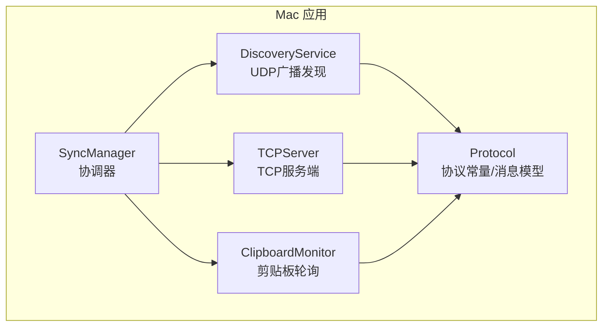
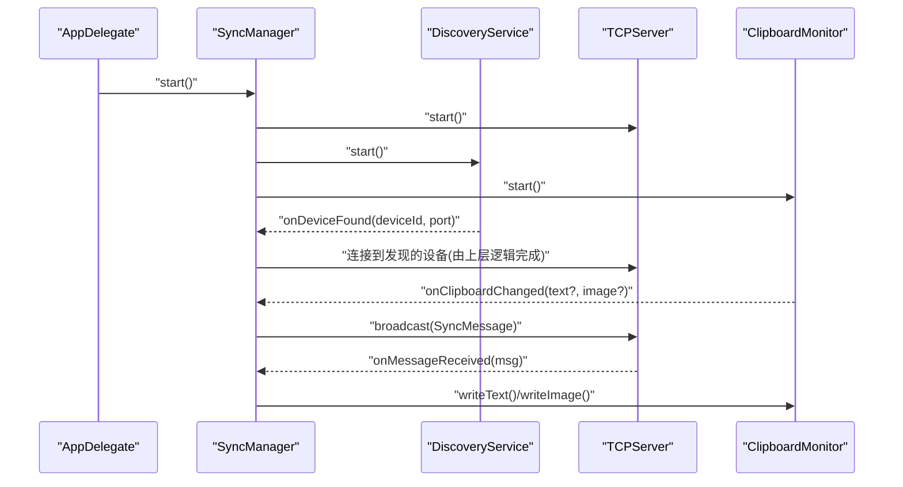
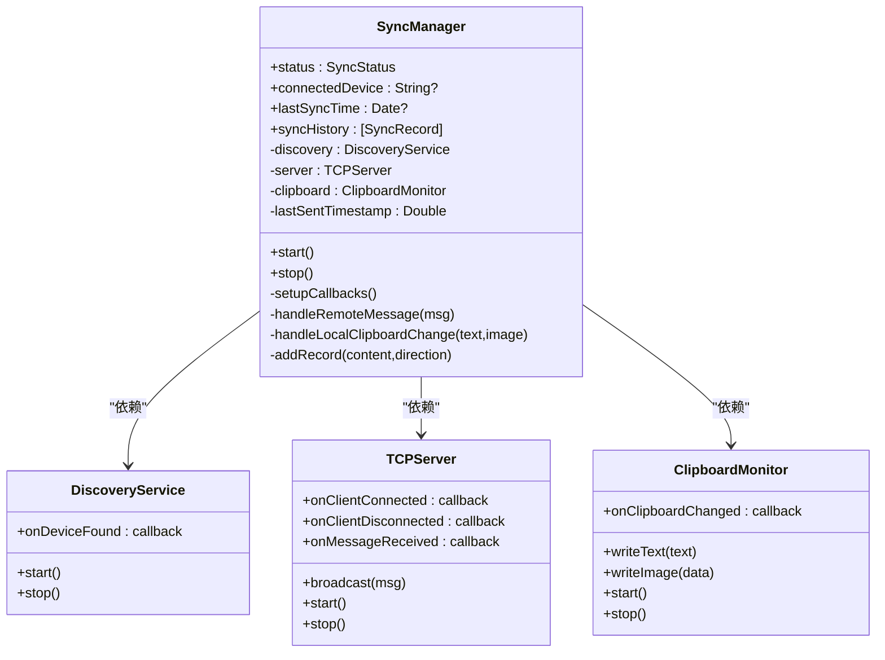
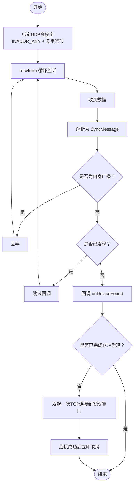
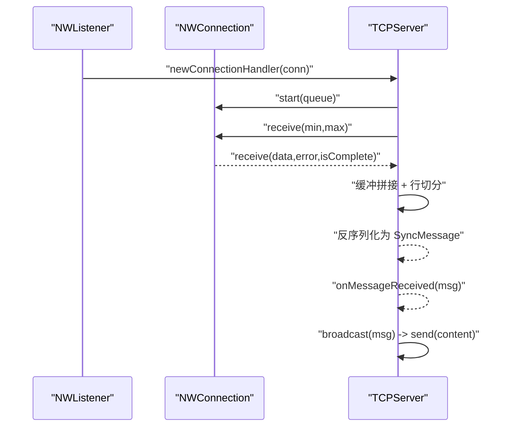
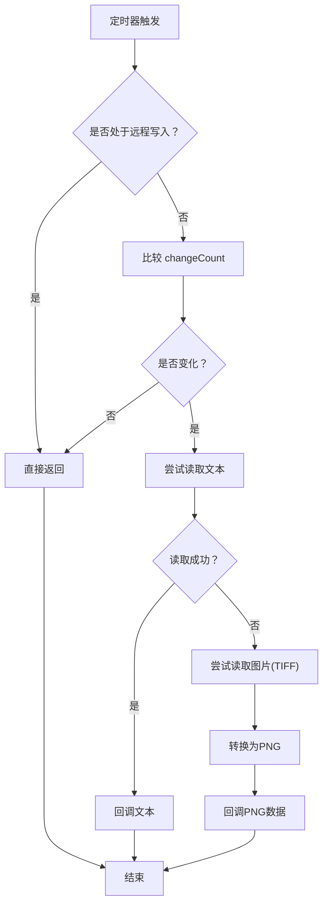
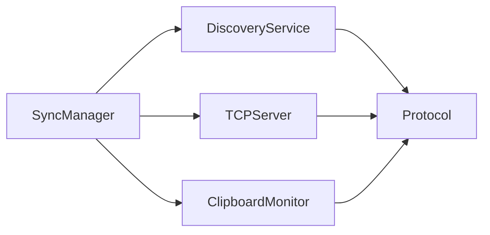

# 核心同步模块

<cite>
**本文引用的文件**
- [SyncManager.swift](file://ClipboardSync/mac/ClipboardSync/SyncManager.swift)
- [DiscoveryService.swift](file://ClipboardSync/mac/ClipboardSync/DiscoveryService.swift)
- [TCPServer.swift](file://ClipboardSync/mac/ClipboardSync/TCPServer.swift)
- [ClipboardMonitor.swift](file://ClipboardSync/mac/ClipboardSync/ClipboardMonitor.swift)
- [Protocol.swift](file://ClipboardSync/mac/ClipboardSync/Protocol.swift)
- [AppDelegate.swift](file://ClipboardSync/mac/ClipboardSync/AppDelegate.swift)
- [Package.swift](file://ClipboardSync/mac/Package.swift)
- [Info.plist](file://ClipboardSync/mac/ClipboardSync/Info.plist)
</cite>

## 目录
1. [简介](#简介)
2. [项目结构](#项目结构)
3. [核心组件](#核心组件)
4. [架构总览](#架构总览)
5. [详细组件分析](#详细组件分析)
6. [依赖关系分析](#依赖关系分析)
7. [性能考量](#性能考量)
8. [故障排查指南](#故障排查指南)
9. [结论](#结论)
10. [附录](#附录)

## 简介
本文件面向Mac端核心同步模块的技术文档，聚焦以下关键点：
- SyncManager.swift 作为总协调器的设计与实现，涵盖设备发现协调、TCP连接生命周期管理、剪贴板事件处理、去重防环机制。
- DiscoveryService.swift 的UDP广播发现算法，包括端口选择、消息格式、超时与网络适配处理。
- TCPServer.swift 的TCP服务端实现，包括连接接受、消息解析、并发处理与错误恢复。
- ClipboardMonitor.swift 的NSPasteboard轮询机制，包括监听策略、变化检测、性能优化与权限处理。
- 模块间协作流程与时序图、数据流向示例。
- 调试技巧与性能调优建议。

## 项目结构
Mac端核心同步模块位于 ClipboardSync/mac/ClipboardSync 目录下，采用“按职责分层”的组织方式：
- 协调层：SyncManager.swift
- 发现层：DiscoveryService.swift
- 传输层：TCPServer.swift
- 监听层：ClipboardMonitor.swift
- 协议与常量：Protocol.swift
- 应用入口与系统集成：AppDelegate.swift、Info.plist、Package.swift

图表来源
- [SyncManager.swift:1-154](file://ClipboardSync/mac/ClipboardSync/SyncManager.swift#L1-L154)
- [DiscoveryService.swift:1-197](file://ClipboardSync/mac/ClipboardSync/DiscoveryService.swift#L1-L197)
- [TCPServer.swift:1-174](file://ClipboardSync/mac/ClipboardSync/TCPServer.swift#L1-L174)
- [ClipboardMonitor.swift:1-73](file://ClipboardSync/mac/ClipboardSync/ClipboardMonitor.swift#L1-L73)
- [Protocol.swift:1-43](file://ClipboardSync/mac/ClipboardSync/Protocol.swift#L1-L43)

章节来源
- [SyncManager.swift:1-154](file://ClipboardSync/mac/ClipboardSync/SyncManager.swift#L1-L154)
- [DiscoveryService.swift:1-197](file://ClipboardSync/mac/ClipboardSync/DiscoveryService.swift#L1-L197)
- [TCPServer.swift:1-174](file://ClipboardSync/mac/ClipboardSync/TCPServer.swift#L1-L174)
- [ClipboardMonitor.swift:1-73](file://ClipboardSync/mac/ClipboardSync/ClipboardMonitor.swift#L1-L73)
- [Protocol.swift:1-43](file://ClipboardSync/mac/ClipboardSync/Protocol.swift#L1-L43)
- [AppDelegate.swift:1-46](file://ClipboardSync/mac/ClipboardSync/AppDelegate.swift#L1-L46)
- [Package.swift:1-18](file://ClipboardSync/mac/Package.swift#L1-L18)
- [Info.plist:1-32](file://ClipboardSync/mac/ClipboardSync/Info.plist#L1-L32)

## 核心组件
- 协调器（SyncManager）：统一启动/停止子模块；维护状态机；处理去重与历史记录；桥接发现、传输与剪贴板事件。
- 发现服务（DiscoveryService）：基于BSD Socket的UDP广播监听与发送；过滤自身；对新设备发起一次性的TCP发现连接；去重控制。
- 传输服务（TCPServer）：基于Network框架的NWListener/NWConnection；按行帧化JSON消息；粘包缓冲；并发接收与错误恢复。
- 剪贴板监控（ClipboardMonitor）：定时轮询NSPasteboard；区分文本与图片；远程写入标记避免回环；回调本地变更。
- 协议常量（Protocol）：定义端口、周期、消息类型与消息体结构；提供序列化/反序列化工具方法。

章节来源
- [SyncManager.swift:4-154](file://ClipboardSync/mac/ClipboardSync/SyncManager.swift#L4-L154)
- [DiscoveryService.swift:4-197](file://ClipboardSync/mac/ClipboardSync/DiscoveryService.swift#L4-L197)
- [TCPServer.swift:4-174](file://ClipboardSync/mac/ClipboardSync/TCPServer.swift#L4-L174)
- [ClipboardMonitor.swift:3-73](file://ClipboardSync/mac/ClipboardSync/ClipboardMonitor.swift#L3-L73)
- [Protocol.swift:3-43](file://ClipboardSync/mac/ClipboardSync/Protocol.swift#L3-L43)

## 架构总览
整体工作流：
- 应用启动后，AppDelegate 初始化 SyncManager 并启动。
- SyncManager 启动 DiscoveryService（UDP广播）、TCPServer（监听）、ClipboardMonitor（轮询）。
- DiscoveryService 通过UDP广播“ping”消息，收到同网段其他设备的“ping”后，过滤自身并去重，回调发现事件；同时对新设备发起一次TCP连接以传递Mac端IP（发现端口）。
- TCPServer 接受来自鸿蒙端的连接，按行帧化JSON消息进行解析，回调上层；支持广播给所有连接。
- ClipboardMonitor 轮询NSPasteboard，检测到本地变化后，构造消息并通过TCPServer广播；同时写入剪贴板时设置远程写入标记，避免回环。
- SyncManager 统一处理去重（基于时间戳）、记录同步历史、维护状态机。

图表来源
- [AppDelegate.swift:9-10](file://ClipboardSync/mac/ClipboardSync/AppDelegate.swift#L9-L10)
- [SyncManager.swift:40-93](file://ClipboardSync/mac/ClipboardSync/SyncManager.swift#L40-L93)
- [DiscoveryService.swift:15-29](file://ClipboardSync/mac/ClipboardSync/DiscoveryService.swift#L15-L29)
- [TCPServer.swift:23-51](file://ClipboardSync/mac/ClipboardSync/TCPServer.swift#L23-L51)
- [ClipboardMonitor.swift:16-28](file://ClipboardSync/mac/ClipboardSync/ClipboardMonitor.swift#L16-L28)

## 详细组件分析

### SyncManager.swift：总协调器
- 角色与职责
  - 统一生命周期管理：start/stop 启停发现、传输与剪贴板。
  - 状态机：disconnected/discovering/connected 三态，反映UDP发现与TCP连接状态。
  - 事件桥接：将发现、连接、断开、消息接收、本地剪贴板变化整合为统一接口。
  - 去重与历史：基于时间戳去重，限制历史记录数量。
- 关键实现要点
  - 回调注册：在setupCallbacks中绑定各子模块回调，确保主线程更新UI。
  - 去重防环：lastSentTimestamp 记录最近发送时间戳，收到消息时比较阈值，避免回环。
  - 广播策略：本地变更时构造消息，通过TCPServer.broadcast广播；远端消息到达时写入剪贴板并记录历史。
  - 状态联动：TCP连接建立触发connected，无连接且无其他活动时回到discovering。
- 性能与健壮性
  - 使用弱引用避免循环引用。
  - 主线程异步更新状态与历史，避免UI阻塞。
  - 历史记录上限控制，防止内存膨胀。

图表来源
- [SyncManager.swift:4-154](file://ClipboardSync/mac/ClipboardSync/SyncManager.swift#L4-L154)
- [DiscoveryService.swift:6-29](file://ClipboardSync/mac/ClipboardSync/DiscoveryService.swift#L6-L29)
- [TCPServer.swift:6-58](file://ClipboardSync/mac/ClipboardSync/TCPServer.swift#L6-L58)
- [ClipboardMonitor.swift:4-48](file://ClipboardSync/mac/ClipboardSync/ClipboardMonitor.swift#L4-L48)

章节来源
- [SyncManager.swift:4-154](file://ClipboardSync/mac/ClipboardSync/SyncManager.swift#L4-L154)

### DiscoveryService.swift：UDP广播发现算法
- 端口选择与用途
  - 广播端口：用于UDP广播“ping”，便于同网段发现。
  - 发现端口：用于一次性TCP连接，向鸿蒙端传递Mac端IP。
  - 数据端口：用于实际的数据传输（由TCPServer负责）。
- 消息格式
  - 使用 SyncMessage 结构，包含类型、内容、时间戳、设备ID与可选MIME类型；序列化为JSON字节流。
- 超时与网络适配
  - 发送周期：按广播间隔定时发送“ping”。
  - 监听线程：在独立队列中持续recvfrom，避免阻塞主线程。
  - 去重策略：Set 记录已发现设备与已完成TCP发现的设备，避免重复触发。
- 网络适配
  - 使用BSD Socket绑定INADDR_ANY，支持多网卡场景。
  - 使用SO_REUSEADDR/SO_REUSEPORT提升端口复用能力。
  - 发送端启用SO_BROADCAST，允许向广播地址发送。
- TCP发现连接
  - 对新设备发起一次TCP连接至发现端口，连接成功即刻取消，仅用于传递IP信息。

图表来源
- [DiscoveryService.swift:33-100](file://ClipboardSync/mac/ClipboardSync/DiscoveryService.swift#L33-L100)
- [DiscoveryService.swift:104-146](file://ClipboardSync/mac/ClipboardSync/DiscoveryService.swift#L104-L146)
- [DiscoveryService.swift:150-180](file://ClipboardSync/mac/ClipboardSync/DiscoveryService.swift#L150-L180)

章节来源
- [DiscoveryService.swift:4-197](file://ClipboardSync/mac/ClipboardSync/DiscoveryService.swift#L4-L197)
- [Protocol.swift:5-17](file://ClipboardSync/mac/ClipboardSync/Protocol.swift#L5-L17)

### TCPServer.swift：TCP服务端实现
- 连接接受
  - 使用 NWListener 在指定端口监听；新连接进入后加入连接列表，初始化每连接缓冲。
  - 连接状态回调：ready 时触发 onClientConnected；failed/cancelled 时移除连接。
- 消息解析
  - 按行帧化：每条消息以换行符结尾；接收端维护每个连接的缓冲，按“\n”切分完整消息。
  - 反序列化：将行文本解码为 SyncMessage，派发到上层回调。
- 并发处理
  - 所有网络操作在独立队列执行，避免阻塞主线程。
  - 每个连接独立缓冲，避免交叉污染。
- 错误恢复
  - 接收错误或连接断开时移除连接，释放资源。
  - 发送错误同样触发连接移除，保证一致性。
- 数据广播
  - broadcast 将消息序列化并追加换行符，逐连接发送。

图表来源
- [TCPServer.swift:75-127](file://ClipboardSync/mac/ClipboardSync/TCPServer.swift#L75-L127)
- [TCPServer.swift:129-148](file://ClipboardSync/mac/ClipboardSync/TCPServer.swift#L129-L148)
- [TCPServer.swift:150-157](file://ClipboardSync/mac/ClipboardSync/TCPServer.swift#L150-L157)

章节来源
- [TCPServer.swift:4-174](file://ClipboardSync/mac/ClipboardSync/TCPServer.swift#L4-L174)

### ClipboardMonitor.swift：NSPasteboard轮询机制
- 监听策略
  - 周期性定时器轮询，间隔由协议常量控制。
  - 通过 changeCount 判断是否有变化，避免无效读取。
- 变化检测
  - 优先尝试读取文本；若失败再尝试读取图片（TIFF -> PNG）。
  - 成功读取后回调上层，携带文本或PNG数据。
- 性能优化
  - 仅在变化时读取，减少CPU占用。
  - 图片转换在必要时进行，避免不必要的编码。
- 权限处理与回环防护
  - isRemoteUpdate 标志位：远程写入时置位，轮询期间直接返回，避免回环。
  - 写入剪贴板时临时置位，写入完成后复位，确保本地写入不被忽略。

图表来源
- [ClipboardMonitor.swift:50-71](file://ClipboardSync/mac/ClipboardSync/ClipboardMonitor.swift#L50-L71)
- [ClipboardMonitor.swift:30-48](file://ClipboardSync/mac/ClipboardSync/ClipboardMonitor.swift#L30-L48)

章节来源
- [ClipboardMonitor.swift:3-73](file://ClipboardSync/mac/ClipboardSync/ClipboardMonitor.swift#L3-L73)
- [Protocol.swift:13-14](file://ClipboardSync/mac/ClipboardSync/Protocol.swift#L13-L14)

## 依赖关系分析
- 模块耦合
  - SyncManager 高内聚地协调 DiscoveryService、TCPServer、ClipboardMonitor，形成清晰的单点入口。
  - 各模块之间通过回调与广播进行松耦合交互，避免直接互相依赖。
- 外部依赖
  - Network 框架：用于TCP连接与监听。
  - Foundation：JSON编解码、时间戳、端口封装。
  - AppKit：NSPasteboard与定时器。
- 端口与协议
  - 广播端口：用于UDP发现。
  - 数据端口：用于TCP数据传输。
  - 发现端口：用于一次性TCP传递IP。

图表来源
- [SyncManager.swift:11-13](file://ClipboardSync/mac/ClipboardSync/SyncManager.swift#L11-L13)
- [DiscoveryService.swift:6-13](file://ClipboardSync/mac/ClipboardSync/DiscoveryService.swift#L6-L13)
- [TCPServer.swift:6-17](file://ClipboardSync/mac/ClipboardSync/TCPServer.swift#L6-L17)
- [ClipboardMonitor.swift:4-9](file://ClipboardSync/mac/ClipboardSync/ClipboardMonitor.swift#L4-L9)
- [Protocol.swift:3-43](file://ClipboardSync/mac/ClipboardSync/Protocol.swift#L3-L43)

章节来源
- [SyncManager.swift:11-13](file://ClipboardSync/mac/ClipboardSync/SyncManager.swift#L11-L13)
- [DiscoveryService.swift:6-13](file://ClipboardSync/mac/ClipboardSync/DiscoveryService.swift#L6-L13)
- [TCPServer.swift:6-17](file://ClipboardSync/mac/ClipboardSync/TCPServer.swift#L6-L17)
- [ClipboardMonitor.swift:4-9](file://ClipboardSync/mac/ClipboardSync/ClipboardMonitor.swift#L4-L9)
- [Protocol.swift:3-43](file://ClipboardSync/mac/ClipboardSync/Protocol.swift#L3-L43)

## 性能考量
- 轮询与并发
  - 剪贴板轮询间隔较短（毫秒级），需确保在后台任务中运行，避免影响前台交互。
  - TCP接收与发送均在独立队列，避免阻塞主线程。
- 内存与缓冲
  - 每连接缓冲按行累积，注意长消息可能导致内存增长；建议在极端情况下增加最大长度限制与清理策略。
  - 历史记录上限控制，避免无限增长。
- 网络与I/O
  - UDP广播频率适中，避免过于频繁导致网络拥塞。
  - TCP粘包处理按行切分，确保消息边界清晰。
- 资源释放
  - 连接断开与停止时及时 cancel 与清理，防止句柄泄漏。

## 故障排查指南
- 无法发现设备
  - 检查广播端口是否被占用，确认防火墙/安全软件放行UDP广播。
  - 确认不同设备的设备ID不冲突，避免被过滤。
- 无法建立TCP连接
  - 检查数据端口是否开放，确认网络可达。
  - 查看连接状态回调日志，定位失败原因。
- 剪贴板回环
  - 确认远程写入时 isRemoteUpdate 标志正确设置与复位。
  - 检查去重时间戳是否单调递增。
- 日志与调试
  - 各模块均有打印输出，可在控制台查看状态与错误信息。
  - AppDelegate 设置为辅助应用，可通过菜单栏托盘访问UI。

章节来源
- [DiscoveryService.swift:33-76](file://ClipboardSync/mac/ClipboardSync/DiscoveryService.swift#L33-L76)
- [TCPServer.swift:75-97](file://ClipboardSync/mac/ClipboardSync/TCPServer.swift#L75-L97)
- [ClipboardMonitor.swift:50-71](file://ClipboardSync/mac/ClipboardSync/ClipboardMonitor.swift#L50-L71)
- [AppDelegate.swift:32-34](file://ClipboardSync/mac/ClipboardSync/AppDelegate.swift#L32-L34)

## 结论
该核心同步模块以 SyncManager 为中心，通过 DiscoveryService、TCPServer、ClipboardMonitor 三大子模块协同工作，实现了跨平台剪贴板同步的关键能力。其设计遵循“高内聚、低耦合”的原则，具备良好的可维护性与扩展性。通过合理的去重机制、并发处理与错误恢复策略，能够在复杂网络环境下稳定运行。建议在生产环境中进一步完善日志分级、异常上报与资源回收策略，以提升可观测性与可靠性。

## 附录
- 系统要求与打包
  - 最低系统版本：macOS 13
  - 应用类型：可执行程序
  - LSUIElement：启用辅助应用模式，隐藏Dock图标
  - 允许本地网络：NSAllowsLocalNetworking

章节来源
- [Package.swift:6](file://ClipboardSync/mac/Package.swift#L6)
- [Info.plist:21-29](file://ClipboardSync/mac/ClipboardSync/Info.plist#L21-L29)