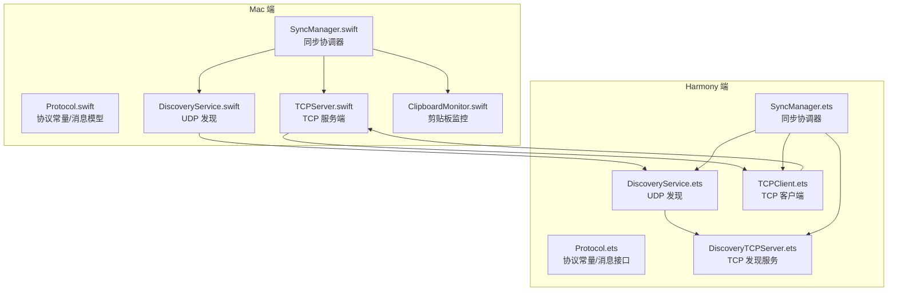
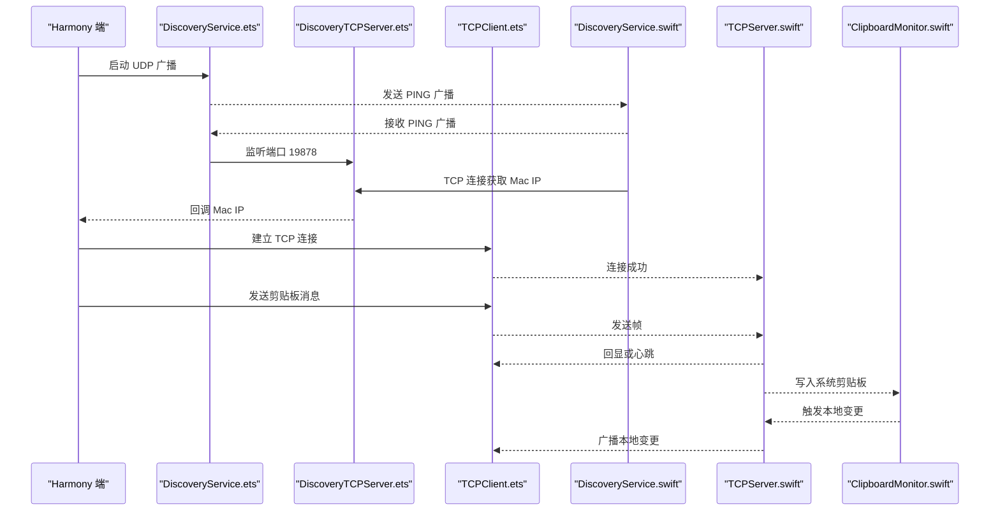
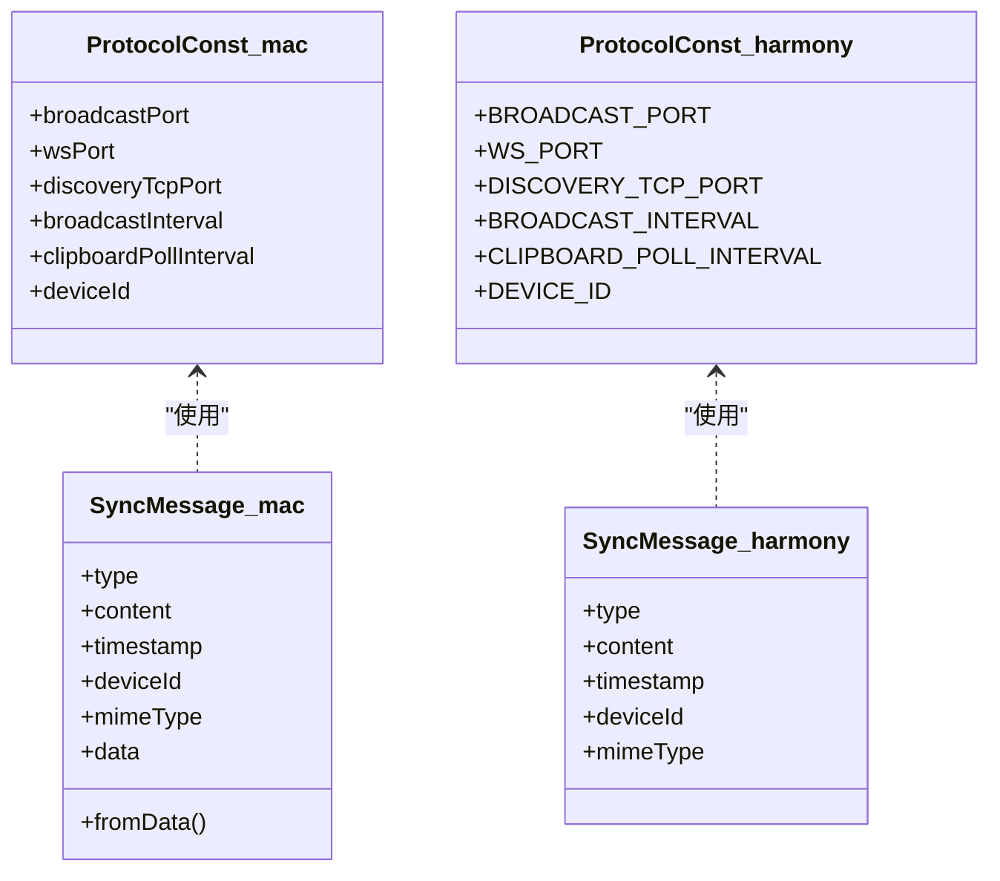
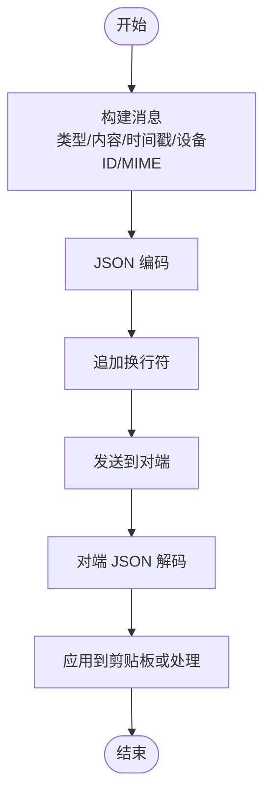

# 通信协议

<cite>
**本文引用的文件**
- [Protocol.swift](file://ClipboardSync/mac/ClipboardSync/Protocol.swift)
- [SyncManager.swift](file://ClipboardSync/mac/ClipboardSync/SyncManager.swift)
- [TCPServer.swift](file://ClipboardSync/mac/ClipboardSync/TCPServer.swift)
- [DiscoveryService.swift](file://ClipboardSync/mac/ClipboardSync/DiscoveryService.swift)
- [ClipboardMonitor.swift](file://ClipboardSync/mac/ClipboardSync/ClipboardMonitor.swift)
- [TCPClient.ets](file://ClipboardSync/harmony/entry/src/main/ets/common/TCPClient.ets)
- [Protocol.ets](file://ClipboardSync/harmony/entry/src/main/ets/common/Protocol.ets)
- [SyncManager.ets](file://ClipboardSync/harmony/entry/src/main/ets/model/SyncManager.ets)
- [DiscoveryService.ets](file://ClipboardSync/harmony/entry/src/main/ets/common/DiscoveryService.ets)
- [DiscoveryTCPServer.ets](file://ClipboardSync/harmony/entry/src/main/ets/common/DiscoveryTCPServer.ets)
</cite>

## 目录
1. [简介](#简介)
2. [项目结构](#项目结构)
3. [核心组件](#核心组件)
4. [架构总览](#架构总览)
5. [详细组件分析](#详细组件分析)
6. [依赖关系分析](#依赖关系分析)
7. [性能与可靠性](#性能与可靠性)
8. [故障排查指南](#故障排查指南)
9. [结论](#结论)
10. [附录：协议规范与扩展指南](#附录协议规范与扩展指南)

## 简介
本文件为 Mac 端与 Harmony 端之间的剪贴板同步通信协议的权威规范文档。内容覆盖协议常量、消息类型、消息格式、序列化与反序列化、错误处理与重连策略、网络安全与数据完整性、以及协议扩展与版本兼容性建议。文档同时提供关键流程的时序图与架构图，帮助开发者快速理解与实现。

## 项目结构
本仓库采用跨平台多语言实现：
- Mac 端（Swift）：负责 TCP 服务端、剪贴板监控、设备发现与消息编解码。
- Harmony 端（ArkTS）：负责设备发现、TCP 客户端、消息编解码与剪贴板写入。

图表来源
- [Protocol.swift:1-43](file://ClipboardSync/mac/ClipboardSync/Protocol.swift#L1-L43)
- [SyncManager.swift:1-154](file://ClipboardSync/mac/ClipboardSync/SyncManager.swift#L1-L154)
- [TCPServer.swift:1-174](file://ClipboardSync/mac/ClipboardSync/TCPServer.swift#L1-L174)
- [DiscoveryService.swift:1-197](file://ClipboardSync/mac/ClipboardSync/DiscoveryService.swift#L1-L197)
- [ClipboardMonitor.swift:1-73](file://ClipboardSync/mac/ClipboardSync/ClipboardMonitor.swift#L1-L73)
- [Protocol.ets:1-27](file://ClipboardSync/harmony/entry/src/main/ets/common/Protocol.ets#L1-L27)
- [SyncManager.ets:1-301](file://ClipboardSync/harmony/entry/src/main/ets/model/SyncManager.ets#L1-L301)
- [DiscoveryService.ets:1-161](file://ClipboardSync/harmony/entry/src/main/ets/common/DiscoveryService.ets#L1-L161)
- [DiscoveryTCPServer.ets:1-80](file://ClipboardSync/harmony/entry/src/main/ets/common/DiscoveryTCPServer.ets#L1-L80)
- [TCPClient.ets:1-181](file://ClipboardSync/harmony/entry/src/main/ets/common/TCPClient.ets#L1-L181)

章节来源
- [Protocol.swift:1-43](file://ClipboardSync/mac/ClipboardSync/Protocol.swift#L1-L43)
- [Protocol.ets:1-27](file://ClipboardSync/harmony/entry/src/main/ets/common/Protocol.ets#L1-L27)

## 核心组件
- 协议常量与消息模型
  - Mac 端与 Harmony 端共享协议常量与消息结构，确保两端一致的端口、时间戳与消息体格式。
  - 消息类型包括文本剪贴板、图片剪贴板、心跳探测与响应。
- 同步协调器
  - Mac 端：负责启动 TCP 服务、设备发现、剪贴板轮询与消息分发。
  - Harmony 端：负责设备发现、TCP 连接建立、消息收发与剪贴板写入。
- 传输层
  - TCP 使用换行符分隔的 JSON 消息帧；UDP 用于设备发现与 IP 获取。
- 错误处理与重连
  - TCP 客户端具备自动重连与错误回调；设备发现支持去重与重置。

章节来源
- [SyncManager.swift:1-154](file://ClipboardSync/mac/ClipboardSync/SyncManager.swift#L1-L154)
- [SyncManager.ets:1-301](file://ClipboardSync/harmony/entry/src/main/ets/model/SyncManager.ets#L1-L301)
- [TCPServer.swift:1-174](file://ClipboardSync/mac/ClipboardSync/TCPServer.swift#L1-L174)
- [TCPClient.ets:1-181](file://ClipboardSync/harmony/entry/src/main/ets/common/TCPClient.ets#L1-L181)

## 架构总览
下图展示端到端的协议交互：Harmony 通过 UDP 广播发现 Mac，随后通过 TCP 连接进行剪贴板数据传输；Mac 侧负责接收、去重与写入系统剪贴板。

图表来源
- [DiscoveryService.ets:1-161](file://ClipboardSync/harmony/entry/src/main/ets/common/DiscoveryService.ets#L1-L161)
- [DiscoveryTCPServer.ets:1-80](file://ClipboardSync/harmony/entry/src/main/ets/common/DiscoveryTCPServer.ets#L1-L80)
- [TCPClient.ets:1-181](file://ClipboardSync/harmony/entry/src/main/ets/common/TCPClient.ets#L1-L181)
- [DiscoveryService.swift:1-197](file://ClipboardSync/mac/ClipboardSync/DiscoveryService.swift#L1-L197)
- [TCPServer.swift:1-174](file://ClipboardSync/mac/ClipboardSync/TCPServer.swift#L1-L174)
- [ClipboardMonitor.swift:1-73](file://ClipboardSync/mac/ClipboardSync/ClipboardMonitor.swift#L1-L73)

## 详细组件分析

### 协议常量与消息模型
- 端口分配
  - 广播端口：用于设备发现与心跳广播。
  - 数据端口：用于剪贴板数据传输。
  - 发现 TCP 端口：用于从 Mac 端获取 IP 地址。
- 时间戳与去重
  - 消息携带时间戳，用于去重与顺序判断。
- 设备标识
  - 每端生成唯一设备 ID，便于识别与过滤自播。
- 消息类型
  - 文本剪贴板、图片剪贴板、心跳探测、心跳响应。
- 消息体字段
  - 类型、内容、时间戳、设备 ID、可选 MIME 类型。

章节来源
- [Protocol.swift:1-43](file://ClipboardSync/mac/ClipboardSync/Protocol.swift#L1-L43)
- [Protocol.ets:1-27](file://ClipboardSync/harmony/entry/src/main/ets/common/Protocol.ets#L1-L27)

### 消息格式与编解码
- 序列化
  - 使用 JSON 编码消息对象，每条消息以换行符结尾。
- 反序列化
  - 两端均使用 JSON 解码；Mac 侧 Swift 使用 JSONEncoder/JSONDecoder，Harmony 侧 ArkTS 使用 JSON.parse。
- 负载数据
  - 文本直接作为字符串；图片以 Base64 字符串承载。

章节来源
- [TCPServer.swift:60-67](file://ClipboardSync/mac/ClipboardSync/TCPServer.swift#L60-L67)
- [TCPServer.swift:142-147](file://ClipboardSync/mac/ClipboardSync/TCPServer.swift#L142-L147)
- [TCPClient.ets:44-58](file://ClipboardSync/harmony/entry/src/main/ets/common/TCPClient.ets#L44-L58)
- [TCPClient.ets:135-142](file://ClipboardSync/harmony/entry/src/main/ets/common/TCPClient.ets#L135-L142)

### 设备发现与连接建立
- UDP 广播
  - Harmony 端周期性发送 PING 广播；Mac 端监听并回调新设备。
- TCP 发现
  - Mac 端通过监听端口 19878，从连接中提取远端 IP，用于后续 TCP 数据连接。
- 连接建立
  - Harmony 端根据发现结果建立 TCP 连接；Mac 端接受连接并进入数据传输状态。

章节来源
- [DiscoveryService.ets:87-95](file://ClipboardSync/harmony/entry/src/main/ets/common/DiscoveryService.ets#L87-L95)
- [DiscoveryService.ets:97-124](file://ClipboardSync/harmony/entry/src/main/ets/common/DiscoveryService.ets#L97-L124)
- [DiscoveryService.swift:104-112](file://ClipboardSync/mac/ClipboardSync/DiscoveryService.swift#L104-L112)
- [DiscoveryService.swift:114-146](file://ClipboardSync/mac/ClipboardSync/DiscoveryService.swift#L114-L146)
- [DiscoveryTCPServer.ets:18-49](file://ClipboardSync/harmony/entry/src/main/ets/common/DiscoveryTCPServer.ets#L18-L49)
- [DiscoveryTCPServer.ets:61-78](file://ClipboardSync/harmony/entry/src/main/ets/common/DiscoveryTCPServer.ets#L61-L78)

### 数据传输与去重
- 去重策略
  - 两端均比较时间戳，丢弃早于或等于上次发送时间戳的消息，防止回环。
- 数据同步
  - Mac 端轮询系统剪贴板，Harmony 端轮询系统剪贴板；任一端变更均通过 TCP 广播。

章节来源
- [SyncManager.swift:95-115](file://ClipboardSync/mac/ClipboardSync/SyncManager.swift#L95-L115)
- [SyncManager.ets:178-198](file://ClipboardSync/harmony/entry/src/main/ets/model/SyncManager.ets#L178-L198)

### 错误处理与重连策略
- TCP 客户端错误
  - 连接失败或断开时触发重连计时器，5 秒后自动重连。
- 设备发现重置
  - 断开后重置发现去重列表，允许重新发现同一设备并触发重连。
- 传输错误
  - 发送/接收错误时移除连接并触发回调，保持状态一致性。

章节来源
- [TCPClient.ets:148-157](file://ClipboardSync/harmony/entry/src/main/ets/common/TCPClient.ets#L148-L157)
- [TCPClient.ets:159-173](file://ClipboardSync/harmony/entry/src/main/ets/common/TCPClient.ets#L159-L173)
- [SyncManager.ets:150-157](file://ClipboardSync/harmony/entry/src/main/ets/model/SyncManager.ets#L150-L157)
- [TCPServer.swift:150-157](file://ClipboardSync/mac/ClipboardSync/TCPServer.swift#L150-L157)

### 网络安全与数据完整性
- 安全性
  - 当前实现未包含加密与签名，建议在生产环境引入 TLS/DTLS 与消息签名。
- 完整性
  - 使用 JSON 消息与换行帧边界，配合去重时间戳降低重复与乱序影响。
- 防抖与节流
  - 轮询间隔与广播间隔控制网络负载，避免过度占用带宽。

章节来源
- [Protocol.swift:11-16](file://ClipboardSync/mac/ClipboardSync/Protocol.swift#L11-L16)
- [Protocol.ets:6-8](file://ClipboardSync/harmony/entry/src/main/ets/common/Protocol.ets#L6-L8)

## 依赖关系分析
- 协议层
  - 两端共享协议常量与消息结构，保证互操作性。
- 控制层
  - Mac 端由 SyncManager 协调 TCP 服务、发现与剪贴板；Harmony 端由 SyncManager 协调发现、TCP 客户端与剪贴板。
- 传输层
  - TCP 服务端与客户端基于原生网络库实现，UDP 发现分别使用 BSD Socket 与 ArkTS Socket。

图表来源
- [Protocol.swift:1-43](file://ClipboardSync/mac/ClipboardSync/Protocol.swift#L1-L43)
- [Protocol.ets:1-27](file://ClipboardSync/harmony/entry/src/main/ets/common/Protocol.ets#L1-L27)

章节来源
- [SyncManager.swift:1-154](file://ClipboardSync/mac/ClipboardSync/SyncManager.swift#L1-L154)
- [SyncManager.ets:1-301](file://ClipboardSync/harmony/entry/src/main/ets/model/SyncManager.ets#L1-L301)

## 性能与可靠性
- 负载控制
  - 轮询间隔与广播间隔可调，平衡实时性与能耗。
- 粘包处理
  - TCP 采用换行符分隔帧，配合缓冲区拼接与逐帧解析，避免粘包与半包问题。
- 连接稳定性
  - 自动重连与状态回调，提升弱网环境下的可用性。

章节来源
- [TCPServer.swift:12-14](file://ClipboardSync/mac/ClipboardSync/TCPServer.swift#L12-L14)
- [TCPServer.swift:129-148](file://ClipboardSync/mac/ClipboardSync/TCPServer.swift#L129-L148)
- [TCPClient.ets:115-146](file://ClipboardSync/harmony/entry/src/main/ets/common/TCPClient.ets#L115-L146)

## 故障排查指南
- 无法发现设备
  - 检查 UDP 广播端口是否正确、防火墙是否放行、设备是否在同一子网。
- 连接频繁断开
  - 查看 TCP 错误码与重连日志，确认网络波动与超时设置。
- 消息重复或丢失
  - 核对时间戳去重逻辑与消息边界，确保每条消息以换行符结尾。
- 图片同步异常
  - 确认图片编码为 Base64，且 MIME 类型正确。

章节来源
- [TCPClient.ets:148-157](file://ClipboardSync/harmony/entry/src/main/ets/common/TCPClient.ets#L148-L157)
- [TCPServer.swift:150-157](file://ClipboardSync/mac/ClipboardSync/TCPServer.swift#L150-L157)
- [SyncManager.swift:95-115](file://ClipboardSync/mac/ClipboardSync/SyncManager.swift#L95-L115)

## 结论
本协议以简洁的 JSON 帧与明确的去重策略实现了跨端剪贴板同步，具备良好的可维护性与扩展性。建议在生产环境中增强安全与完整性保障，并持续评估性能参数以适配不同网络场景。

## 附录：协议规范与扩展指南

### 协议常量与端口
- 广播端口：用于设备发现与心跳广播。
- 数据端口：用于剪贴板数据传输。
- 发现 TCP 端口：用于从 Mac 端获取 IP 地址。
- 广播间隔与剪贴板轮询间隔：用于控制网络负载与实时性。

章节来源
- [Protocol.swift:5-16](file://ClipboardSync/mac/ClipboardSync/Protocol.swift#L5-L16)
- [Protocol.ets:2-9](file://ClipboardSync/harmony/entry/src/main/ets/common/Protocol.ets#L2-L9)

### 消息类型与字段
- 消息类型：文本剪贴板、图片剪贴板、心跳探测、心跳响应。
- 字段：类型、内容、时间戳、设备 ID、可选 MIME 类型。

章节来源
- [Protocol.swift:19-33](file://ClipboardSync/mac/ClipboardSync/Protocol.swift#L19-L33)
- [Protocol.ets:11-26](file://ClipboardSync/harmony/entry/src/main/ets/common/Protocol.ets#L11-L26)

### 消息格式与序列化
- 每条消息以换行符结尾，使用 JSON 编码。
- 文本直接承载；图片以 Base64 字符串承载。

章节来源
- [TCPServer.swift:60-67](file://ClipboardSync/mac/ClipboardSync/TCPServer.swift#L60-L67)
- [TCPClient.ets:44-58](file://ClipboardSync/harmony/entry/src/main/ets/common/TCPClient.ets#L44-L58)

### 错误码与异常处理
- TCP 错误码：通过回调返回错误信息，触发自动重连。
- 设备发现错误：UDP 绑定失败、广播发送失败等，需检查网络配置。

章节来源
- [TCPClient.ets:83-90](file://ClipboardSync/harmony/entry/src/main/ets/common/TCPClient.ets#L83-L90)
- [TCPClient.ets:106-112](file://ClipboardSync/harmony/entry/src/main/ets/common/TCPClient.ets#L106-L112)

### 重连策略与超时管理
- 重连间隔：5 秒。
- 超时：TCP 连接超时设置为 10 秒。
- 状态回调：连接/断开/错误均触发状态更新。

章节来源
- [TCPClient.ets:99-112](file://ClipboardSync/harmony/entry/src/main/ets/common/TCPClient.ets#L99-L112)
- [TCPClient.ets:148-157](file://ClipboardSync/harmony/entry/src/main/ets/common/TCPClient.ets#L148-L157)

### 协议扩展指南
- 新增消息类型
  - 在两端的协议常量与消息类型中新增枚举值，并在编解码处增加对应分支。
- 新增字段
  - 在消息结构中新增可选字段，保持向后兼容（默认值与空值处理）。
- 新增端口
  - 在协议常量中新增端口，确保两端一致。

章节来源
- [Protocol.swift:19-33](file://ClipboardSync/mac/ClipboardSync/Protocol.swift#L19-L33)
- [Protocol.ets:11-26](file://ClipboardSync/harmony/entry/src/main/ets/common/Protocol.ets#L11-L26)

### 版本升级与兼容性
- 向后兼容
  - 新增字段应为可选，旧版本忽略未知字段。
- 迁移策略
  - 通过广播或心跳协商版本，逐步切换至新版本。
- 安全加固
  - 引入 TLS/DTLS 与消息签名，确保传输安全与来源校验。

章节来源
- [Protocol.swift:19-33](file://ClipboardSync/mac/ClipboardSync/Protocol.swift#L19-L33)
- [Protocol.ets:11-26](file://ClipboardSync/harmony/entry/src/main/ets/common/Protocol.ets#L11-L26)

### 完整消息示例与交互流程
- 文本消息
  - 类型：文本剪贴板
  - 内容：纯文本
  - 时间戳：当前时间
  - 设备 ID：发送方设备 ID
- 图片消息
  - 类型：图片剪贴板
  - 内容：Base64 编码的图片数据
  - MIME 类型：图像类型
- 心跳消息
  - 类型：心跳探测/响应
  - 内容：固定字符串
  - 时间戳：心跳时间

图表来源
- [TCPServer.swift:60-67](file://ClipboardSync/mac/ClipboardSync/TCPServer.swift#L60-L67)
- [TCPClient.ets:44-58](file://ClipboardSync/harmony/entry/src/main/ets/common/TCPClient.ets#L44-L58)