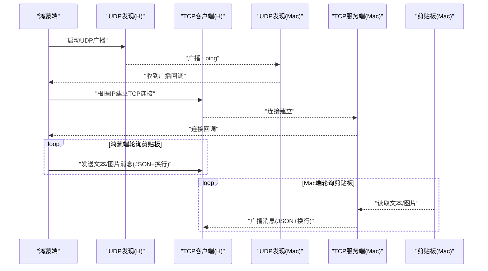
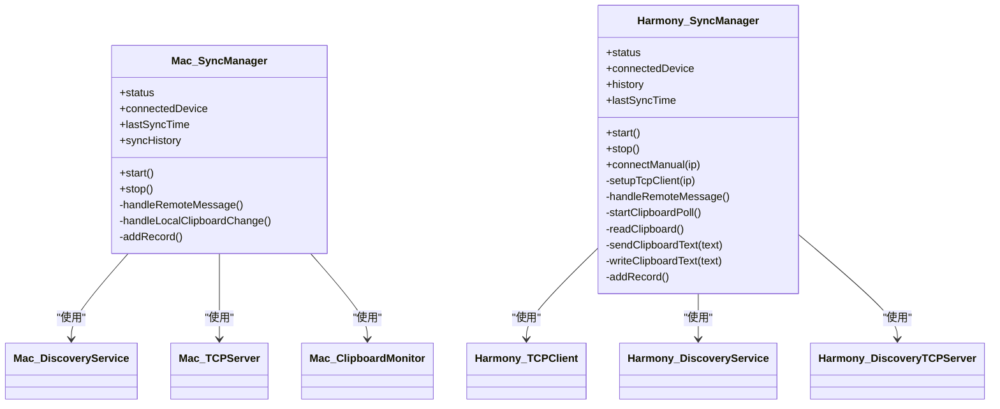
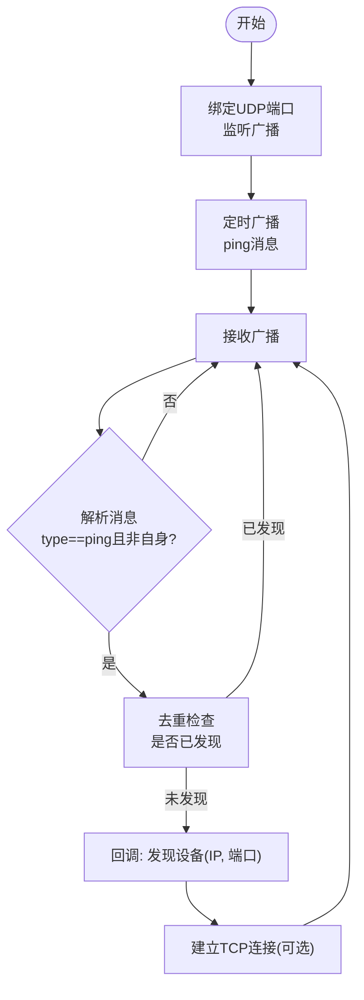
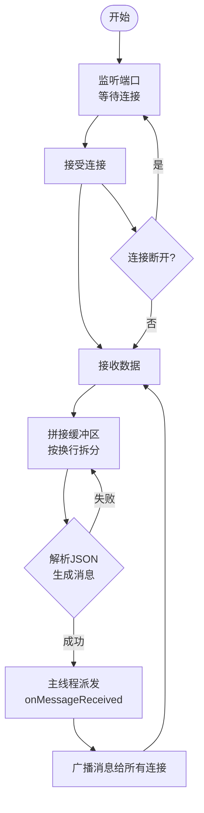
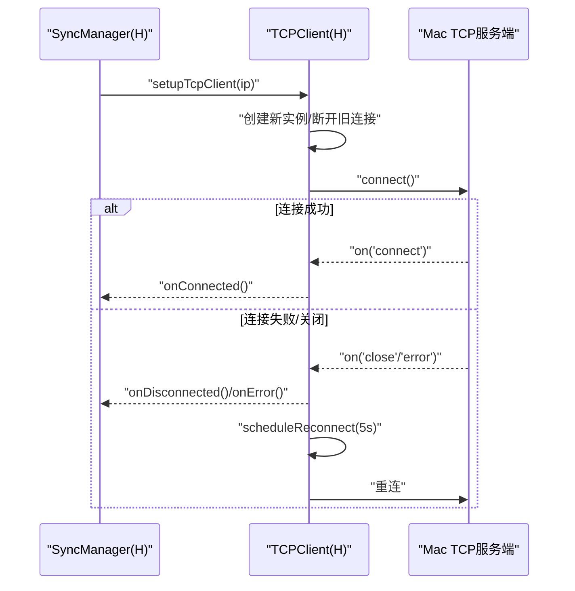
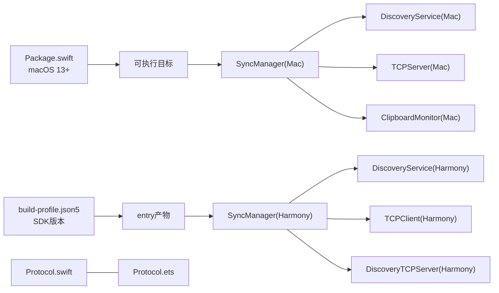

# 开发指南

<cite>
**本文引用的文件**
- [ClipboardSync/PROJECT.md](file://ClipboardSync/PROJECT.md)
- [ClipboardSync/mac/Package.swift](file://ClipboardSync/mac/Package.swift)
- [ClipboardSync/harmony/build-profile.json5](file://ClipboardSync/harmony/build-profile.json5)
- [ClipboardSync/harmony/oh-package.json5](file://ClipboardSync/harmony/oh-package.json5)
- [ClipboardSync/mac/ClipboardSync/Protocol.swift](file://ClipboardSync/mac/ClipboardSync/Protocol.swift)
- [ClipboardSync/harmony/entry/src/main/ets/common/Protocol.ets](file://ClipboardSync/harmony/entry/src/main/ets/common/Protocol.ets)
- [ClipboardSync/mac/ClipboardSync/SyncManager.swift](file://ClipboardSync/mac/ClipboardSync/SyncManager.swift)
- [ClipboardSync/harmony/entry/src/main/ets/model/SyncManager.ets](file://ClipboardSync/harmony/entry/src/main/ets/model/SyncManager.ets)
- [ClipboardSync/mac/ClipboardSync/DiscoveryService.swift](file://ClipboardSync/mac/ClipboardSync/DiscoveryService.swift)
- [ClipboardSync/mac/ClipboardSync/TCPServer.swift](file://ClipboardSync/mac/ClipboardSync/TCPServer.swift)
- [ClipboardSync/mac/ClipboardSync/ClipboardMonitor.swift](file://ClipboardSync/mac/ClipboardSync/ClipboardMonitor.swift)
- [ClipboardSync/harmony/entry/src/main/ets/common/TCPClient.ets](file://ClipboardSync/harmony/entry/src/main/ets/common/TCPClient.ets)
- [ClipboardSync/harmony/entry/src/main/ets/common/DiscoveryService.ets](file://ClipboardSync/harmony/entry/src/main/ets/common/DiscoveryService.ets)
- [ClipboardSync/harmony/entry/src/main/ets/common/DiscoveryTCPServer.ets](file://ClipboardSync/harmony/entry/src/main/ets/common/DiscoveryTCPServer.ets)
</cite>

## 目录
1. [简介](#简介)
2. [项目结构](#项目结构)
3. [核心组件](#核心组件)
4. [架构总览](#架构总览)
5. [详细组件分析](#详细组件分析)
6. [依赖关系分析](#依赖关系分析)
7. [性能考虑](#性能考虑)
8. [调试与排错指南](#调试与排错指南)
9. [测试策略](#测试策略)
10. [版本管理与分支策略](#版本管理与分支策略)
11. [代码规范与最佳实践](#代码规范与最佳实践)
12. [贡献指南与社区参与](#贡献指南与社区参与)
13. [结论](#结论)

## 简介
本项目提供 Mac 与鸿蒙手机之间的局域网剪贴板实时同步能力，采用 UDP 广播进行设备发现、TCP 长连接进行消息传输，消息以换行分隔的 JSON 表示。项目同时包含 Swift/SwiftUI 的 Mac 端与 ArkTS/ArkUI 的鸿蒙端，双方共享通信协议定义。

## 项目结构
- Mac 端（Swift + SwiftUI）
  - 构建与产品定义：Package.swift
  - 应用入口与 UI：ClipboardSyncApp.swift、MainView.swift、AppDelegate.swift
  - 协调器与模块：SyncManager.swift、ClipboardMonitor.swift、DiscoveryService.swift、TCPServer.swift、Protocol.swift
- 鸿蒙端（ArkTS + ArkUI）
  - 构建与产品配置：build-profile.json5、oh-package.json5
  - 协调器与模块：model/SyncManager.ets、common/TCPClient.ets、common/DiscoveryService.ets、common/DiscoveryTCPServer.ets、common/Protocol.ets
- 文档与运行说明：PROJECT.md

```mermaid
graph TB
subgraph "Mac 端"
M_App["应用入口<br/>ClipboardSyncApp.swift"]
M_View["主视图<br/>MainView.swift"]
M_AppD["应用委托<br/>AppDelegate.swift"]
M_SM["协调器<br/>SyncManager.swift"]
M_CB["剪贴板监听<br/>ClipboardMonitor.swift"]
M_Disc["UDP发现<br/>DiscoveryService.swift"]
M_TCP["TCP服务端<br/>TCPServer.swift"]
M_Prot["协议常量/消息<br/>Protocol.swift"]
end
subgraph "鸿蒙端"
H_SM["协调器<br/>SyncManager.ets"]
H_TCP["TCP客户端<br/>TCPClient.ets"]
H_Disc["UDP发现<br/>DiscoveryService.ets"]
H_DiscTCP["TCP发现服务<br/>DiscoveryTCPServer.ets"]
H_Prot["协议常量/消息<br/>Protocol.ets"]
end
M_Disc --> M_TCP
M_TCP <- --> H_TCP
H_Disc --> H_SM
H_DiscTCP --> H_SM
M_SM --> M_TCP
M_SM --> M_CB
H_SM --> H_TCP
H_SM --> H_Disc
H_SM --> H_DiscTCP
M_Prot --- H_Prot
```

图表来源
- [ClipboardSync/mac/ClipboardSync/Protocol.swift:1-43](file://ClipboardSync/mac/ClipboardSync/Protocol.swift#L1-L43)
- [ClipboardSync/harmony/entry/src/main/ets/common/Protocol.ets:1-27](file://ClipboardSync/harmony/entry/src/main/ets/common/Protocol.ets#L1-L27)
- [ClipboardSync/mac/ClipboardSync/SyncManager.swift:1-154](file://ClipboardSync/mac/ClipboardSync/SyncManager.swift#L1-L154)
- [ClipboardSync/harmony/entry/src/main/ets/model/SyncManager.ets:1-301](file://ClipboardSync/harmony/entry/src/main/ets/model/SyncManager.ets#L1-L301)
- [ClipboardSync/mac/ClipboardSync/DiscoveryService.swift:1-197](file://ClipboardSync/mac/ClipboardSync/DiscoveryService.swift#L1-L197)
- [ClipboardSync/mac/ClipboardSync/TCPServer.swift:1-174](file://ClipboardSync/mac/ClipboardSync/TCPServer.swift#L1-L174)
- [ClipboardSync/mac/ClipboardSync/ClipboardMonitor.swift:1-73](file://ClipboardSync/mac/ClipboardSync/ClipboardMonitor.swift#L1-L73)
- [ClipboardSync/harmony/entry/src/main/ets/common/TCPClient.ets:1-181](file://ClipboardSync/harmony/entry/src/main/ets/common/TCPClient.ets#L1-L181)
- [ClipboardSync/harmony/entry/src/main/ets/common/DiscoveryService.ets:1-161](file://ClipboardSync/harmony/entry/src/main/ets/common/DiscoveryService.ets#L1-L161)
- [ClipboardSync/harmony/entry/src/main/ets/common/DiscoveryTCPServer.ets:1-80](file://ClipboardSync/harmony/entry/src/main/ets/common/DiscoveryTCPServer.ets#L1-L80)

章节来源
- [ClipboardSync/PROJECT.md:1-170](file://ClipboardSync/PROJECT.md#L1-L170)

## 核心组件
- 协调器（Mac：SyncManager.swift；鸿蒙：SyncManager.ets）
  - 职责：统一管理设备发现、TCP 连接、剪贴板监听与消息转发；维护状态、历史记录与去重逻辑。
  - 关键行为：启动/停止子模块；处理远端消息与本地剪贴板变更；记录同步历史。
- 设备发现（Mac：DiscoveryService.swift；鸿蒙：DiscoveryService.ets）
  - 职责：通过 UDP 广播与监听实现设备发现；过滤自身设备；去重回调。
  - 鸿蒙端额外提供 TCP 发现服务（DiscoveryTCPServer.ets），用于 Mac 主动连接时获取 Mac 的局域网 IP。
- 传输层（Mac：TCPServer.swift；鸿蒙：TCPClient.ets）
  - 职责：基于换行分隔的 JSON 消息进行可靠传输；处理粘包、缓冲与重连。
- 剪贴板（Mac：ClipboardMonitor.swift；鸿蒙：pasteboard API）
  - 职责：轮询检测剪贴板变化；读取文本与图片；写入剪贴板并避免回环。

章节来源
- [ClipboardSync/mac/ClipboardSync/SyncManager.swift:1-154](file://ClipboardSync/mac/ClipboardSync/SyncManager.swift#L1-L154)
- [ClipboardSync/harmony/entry/src/main/ets/model/SyncManager.ets:1-301](file://ClipboardSync/harmony/entry/src/main/ets/model/SyncManager.ets#L1-L301)
- [ClipboardSync/mac/ClipboardSync/DiscoveryService.swift:1-197](file://ClipboardSync/mac/ClipboardSync/DiscoveryService.swift#L1-L197)
- [ClipboardSync/harmony/entry/src/main/ets/common/DiscoveryService.ets:1-161](file://ClipboardSync/harmony/entry/src/main/ets/common/DiscoveryService.ets#L1-L161)
- [ClipboardSync/harmony/entry/src/main/ets/common/DiscoveryTCPServer.ets:1-80](file://ClipboardSync/harmony/entry/src/main/ets/common/DiscoveryTCPServer.ets#L1-L80)
- [ClipboardSync/mac/ClipboardSync/TCPServer.swift:1-174](file://ClipboardSync/mac/ClipboardSync/TCPServer.swift#L1-L174)
- [ClipboardSync/harmony/entry/src/main/ets/common/TCPClient.ets:1-181](file://ClipboardSync/harmony/entry/src/main/ets/common/TCPClient.ets#L1-L181)
- [ClipboardSync/mac/ClipboardSync/ClipboardMonitor.swift:1-73](file://ClipboardSync/mac/ClipboardSync/ClipboardMonitor.swift#L1-L73)

## 架构总览
- 通信分层
  - 设备发现：UDP 广播（端口 19876），双方互相宣告在线。
  - 数据传输：TCP 长连接（端口 19877），消息以换行分隔的 JSON。
  - 发现辅助：TCP 端口 19878 由 Mac 监听，用于鸿蒙端从连接中获取 Mac 的 IP。
- 角色分工
  - Mac 端：TCP 服务端，负责监听连接、接收消息、向所有连接广播；同时轮询剪贴板并向远端发送。
  - 鸿蒙端：TCP 客户端，负责连接 Mac、接收消息、轮询系统剪贴板并向 Mac 发送。



图表来源
- [ClipboardSync/PROJECT.md:52-63](file://ClipboardSync/PROJECT.md#L52-L63)
- [ClipboardSync/mac/ClipboardSync/DiscoveryService.swift:1-197](file://ClipboardSync/mac/ClipboardSync/DiscoveryService.swift#L1-L197)
- [ClipboardSync/harmony/entry/src/main/ets/common/DiscoveryService.ets:1-161](file://ClipboardSync/harmony/entry/src/main/ets/common/DiscoveryService.ets#L1-L161)
- [ClipboardSync/mac/ClipboardSync/TCPServer.swift:1-174](file://ClipboardSync/mac/ClipboardSync/TCPServer.swift#L1-L174)
- [ClipboardSync/harmony/entry/src/main/ets/common/TCPClient.ets:1-181](file://ClipboardSync/harmony/entry/src/main/ets/common/TCPClient.ets#L1-L181)
- [ClipboardSync/mac/ClipboardSync/ClipboardMonitor.swift:1-73](file://ClipboardSync/mac/ClipboardSync/ClipboardMonitor.swift#L1-L73)

## 详细组件分析

### 协调器类关系（Mac 与 鸿蒙）


图表来源
- [ClipboardSync/mac/ClipboardSync/SyncManager.swift:1-154](file://ClipboardSync/mac/ClipboardSync/SyncManager.swift#L1-L154)
- [ClipboardSync/harmony/entry/src/main/ets/model/SyncManager.ets:1-301](file://ClipboardSync/harmony/entry/src/main/ets/model/SyncManager.ets#L1-L301)
- [ClipboardSync/mac/ClipboardSync/DiscoveryService.swift:1-197](file://ClipboardSync/mac/ClipboardSync/DiscoveryService.swift#L1-L197)
- [ClipboardSync/mac/ClipboardSync/TCPServer.swift:1-174](file://ClipboardSync/mac/ClipboardSync/TCPServer.swift#L1-L174)
- [ClipboardSync/mac/ClipboardSync/ClipboardMonitor.swift:1-73](file://ClipboardSync/mac/ClipboardSync/ClipboardMonitor.swift#L1-L73)
- [ClipboardSync/harmony/entry/src/main/ets/common/TCPClient.ets:1-181](file://ClipboardSync/harmony/entry/src/main/ets/common/TCPClient.ets#L1-L181)
- [ClipboardSync/harmony/entry/src/main/ets/common/DiscoveryService.ets:1-161](file://ClipboardSync/harmony/entry/src/main/ets/common/DiscoveryService.ets#L1-L161)
- [ClipboardSync/harmony/entry/src/main/ets/common/DiscoveryTCPServer.ets:1-80](file://ClipboardSync/harmony/entry/src/main/ets/common/DiscoveryTCPServer.ets#L1-L80)

章节来源
- [ClipboardSync/mac/ClipboardSync/SyncManager.swift:1-154](file://ClipboardSync/mac/ClipboardSync/SyncManager.swift#L1-L154)
- [ClipboardSync/harmony/entry/src/main/ets/model/SyncManager.ets:1-301](file://ClipboardSync/harmony/entry/src/main/ets/model/SyncManager.ets#L1-L301)

### UDP 发现流程（鸿蒙端）


图表来源
- [ClipboardSync/harmony/entry/src/main/ets/common/DiscoveryService.ets:1-161](file://ClipboardSync/harmony/entry/src/main/ets/common/DiscoveryService.ets#L1-L161)

章节来源
- [ClipboardSync/harmony/entry/src/main/ets/common/DiscoveryService.ets:1-161](file://ClipboardSync/harmony/entry/src/main/ets/common/DiscoveryService.ets#L1-L161)

### TCP 消息处理（Mac 服务端）


图表来源
- [ClipboardSync/mac/ClipboardSync/TCPServer.swift:1-174](file://ClipboardSync/mac/ClipboardSync/TCPServer.swift#L1-L174)

章节来源
- [ClipboardSync/mac/ClipboardSync/TCPServer.swift:1-174](file://ClipboardSync/mac/ClipboardSync/TCPServer.swift#L1-L174)

### TCP 连接与重连（鸿蒙端）


图表来源
- [ClipboardSync/harmony/entry/src/main/ets/model/SyncManager.ets:129-174](file://ClipboardSync/harmony/entry/src/main/ets/model/SyncManager.ets#L129-L174)
- [ClipboardSync/harmony/entry/src/main/ets/common/TCPClient.ets:1-181](file://ClipboardSync/harmony/entry/src/main/ets/common/TCPClient.ets#L1-L181)

章节来源
- [ClipboardSync/harmony/entry/src/main/ets/model/SyncManager.ets:129-174](file://ClipboardSync/harmony/entry/src/main/ets/model/SyncManager.ets#L129-L174)
- [ClipboardSync/harmony/entry/src/main/ets/common/TCPClient.ets:1-181](file://ClipboardSync/harmony/entry/src/main/ets/common/TCPClient.ets#L1-L181)

## 依赖关系分析
- 构建与产品配置
  - Mac：SPM 包定义，目标为可执行程序，平台要求 macOS 13+
  - 鸿蒙：构建配置指定 compileSdkVersion、targetSdkVersion 等
- 协议一致性
  - Mac 与鸿蒙共享协议常量与消息结构，确保两端解析一致
- 组件耦合
  - 协调器对底层模块（发现、传输、剪贴板）呈现统一接口，降低耦合度
  - 传输层通过换行分隔 JSON 简化粘包处理，提升稳定性



图表来源
- [ClipboardSync/mac/Package.swift:1-18](file://ClipboardSync/mac/Package.swift#L1-L18)
- [ClipboardSync/harmony/build-profile.json5:1-43](file://ClipboardSync/harmony/build-profile.json5#L1-L43)
- [ClipboardSync/harmony/oh-package.json5:1-10](file://ClipboardSync/harmony/oh-package.json5#L1-L10)
- [ClipboardSync/mac/ClipboardSync/Protocol.swift:1-43](file://ClipboardSync/mac/ClipboardSync/Protocol.swift#L1-L43)
- [ClipboardSync/harmony/entry/src/main/ets/common/Protocol.ets:1-27](file://ClipboardSync/harmony/entry/src/main/ets/common/Protocol.ets#L1-L27)
- [ClipboardSync/mac/ClipboardSync/SyncManager.swift:1-154](file://ClipboardSync/mac/ClipboardSync/SyncManager.swift#L1-L154)
- [ClipboardSync/harmony/entry/src/main/ets/model/SyncManager.ets:1-301](file://ClipboardSync/harmony/entry/src/main/ets/model/SyncManager.ets#L1-L301)

章节来源
- [ClipboardSync/mac/Package.swift:1-18](file://ClipboardSync/mac/Package.swift#L1-L18)
- [ClipboardSync/harmony/build-profile.json5:1-43](file://ClipboardSync/harmony/build-profile.json5#L1-L43)
- [ClipboardSync/harmony/oh-package.json5:1-10](file://ClipboardSync/harmony/oh-package.json5#L1-L10)

## 性能考虑
- 轮询频率
  - 剪贴板轮询间隔与广播间隔均设置为毫秒级，兼顾实时性与 CPU 占用。
- 粘包处理
  - 基于换行符的帧边界简化解析，减少内存拷贝与异常路径。
- 去重与回环防护
  - 基于时间戳去重，避免写入剪贴板触发监听回环。
- 连接健壮性
  - 鸿蒙端 TCP 客户端具备自动重连与错误回调，提升弱网场景可用性。
- 图片传输
  - Mac 端支持 PNG 编码，建议后续在鸿蒙端实现解码写入，减少跨端转换成本。

章节来源
- [ClipboardSync/mac/ClipboardSync/Protocol.swift:11-16](file://ClipboardSync/mac/ClipboardSync/Protocol.swift#L11-L16)
- [ClipboardSync/harmony/entry/src/main/ets/common/Protocol.ets:6-8](file://ClipboardSync/harmony/entry/src/main/ets/common/Protocol.ets#L6-L8)
- [ClipboardSync/mac/ClipboardSync/TCPServer.swift:12-14](file://ClipboardSync/mac/ClipboardSync/TCPServer.swift#L12-L14)
- [ClipboardSync/harmony/entry/src/main/ets/common/TCPClient.ets:148-157](file://ClipboardSync/harmony/entry/src/main/ets/common/TCPClient.ets#L148-L157)
- [ClipboardSync/mac/ClipboardSync/SyncManager.swift:96-97](file://ClipboardSync/mac/ClipboardSync/SyncManager.swift#L96-L97)
- [ClipboardSync/harmony/entry/src/main/ets/model/SyncManager.ets:178-181](file://ClipboardSync/harmony/entry/src/main/ets/model/SyncManager.ets#L178-L181)

## 调试与排错指南
- 常见问题与解决方案
  - 鸿蒙端 TCP 连接“Operation in progress”
    - 由于 socket.close() 异步，旧 socket 未完全释放导致新连接被拒绝。解决：先断开旧连接，延迟后再创建新实例并连接。
  - 鸿蒙端 socket.SocketErrorInfo 不存在
    - 使用 BusinessError 作为错误回调参数类型。
  - Mac 端 build-profile.json5 SDK 版本类型错误
    - compileSdkVersion 与 compatibleSdkVersion 必须为字符串，如 "6.1.0(23)"。
  - Mac 端 SyncManager.start() 未在启动时调用
    - 在 AppDelegate.applicationDidFinishLaunching 中直接调用，避免仅在 UI 出现时才启动。
  - Mac 端 NWListener 默认监听 IPv6
    - lsof 显示为 IPv6 不影响连接，属系统双栈行为。
- 日志与诊断
  - 各模块均输出详细日志，便于定位广播、连接、消息收发与错误。
- 网络抓包
  - 使用抓包工具观察 UDP 广播（端口 19876）、TCP 连接（端口 19877/19878）与消息帧边界。

章节来源
- [ClipboardSync/PROJECT.md:102-131](file://ClipboardSync/PROJECT.md#L102-L131)
- [ClipboardSync/harmony/entry/src/main/ets/model/SyncManager.ets:129-174](file://ClipboardSync/harmony/entry/src/main/ets/model/SyncManager.ets#L129-L174)
- [ClipboardSync/harmony/entry/src/main/ets/common/TCPClient.ets:83-90](file://ClipboardSync/harmony/entry/src/main/ets/common/TCPClient.ets#L83-L90)
- [ClipboardSync/harmony/build-profile.json5:22-25](file://ClipboardSync/harmony/build-profile.json5#L22-L25)
- [ClipboardSync/mac/ClipboardSync/SyncManager.swift:40-45](file://ClipboardSync/mac/ClipboardSync/SyncManager.swift#L40-L45)

## 测试策略
- 单元测试
  - 对消息序列化/反序列化、去重判断、缓冲拼接等纯函数逻辑进行断言。
- 集成测试
  - 启动 Mac 与鸿蒙端，验证 UDP 广播发现、TCP 连接、文本与图片同步、历史记录展示。
- 用户验收测试
  - 在真实局域网环境下，验证跨端剪贴板一致性、断线重连、回环防护与性能表现。

[本节为通用测试指导，不直接分析具体文件，故无章节来源]

## 版本管理与分支策略
- Git 工作流
  - 建议采用功能分支开发，合并前进行代码评审与集成测试。
- 分支命名
  - feature/功能点、fix/缺陷修复、hotfix/紧急修复、chore/日常维护。
- 发布管理
  - 使用语义化版本号，变更重要功能或破坏性修改时提升主版本号；每次发布打 Tag 并附带变更摘要。

[本节为通用流程指导，不直接分析具体文件，故无章节来源]

## 代码规范与最佳实践
- 命名约定
  - 类型与常量：ProtocolConst、MessageType、SyncMessage；变量与函数使用清晰语义。
- 代码组织
  - 按职责划分模块：发现、传输、剪贴板、协调器；公共协议独立文件。
- 注释规范
  - 关键流程与边界条件添加注释；对外接口与错误处理明确说明。
- 错误处理
  - 对网络与系统调用捕获异常并记录日志；必要时触发重连或状态变更。
- 并发与线程
  - UI 更新统一切换至主线程；网络与系统调用使用专用队列隔离。

章节来源
- [ClipboardSync/mac/ClipboardSync/Protocol.swift:1-43](file://ClipboardSync/mac/ClipboardSync/Protocol.swift#L1-L43)
- [ClipboardSync/harmony/entry/src/main/ets/common/Protocol.ets:1-27](file://ClipboardSync/harmony/entry/src/main/ets/common/Protocol.ets#L1-L27)
- [ClipboardSync/mac/ClipboardSync/TCPServer.swift:35-48](file://ClipboardSync/mac/ClipboardSync/TCPServer.swift#L35-L48)
- [ClipboardSync/harmony/entry/src/main/ets/common/TCPClient.ets:64-90](file://ClipboardSync/harmony/entry/src/main/ets/common/TCPClient.ets#L64-L90)

## 贡献指南与社区参与
- 提交规范
  - 提交信息清晰描述变更目的与影响范围；附带测试结果或复现步骤。
- 代码评审
  - 关注安全性、性能与可维护性；确保协议一致性与错误处理完备。
- 社区参与
  - 按项目现状为自用项目，不上架发布；欢迎 Issue 与 PR，但不承诺维护时间表。

章节来源
- [ClipboardSync/PROJECT.md:1-3](file://ClipboardSync/PROJECT.md#L1-L3)

## 结论
本项目通过简洁稳定的 UDP/TCP 协议实现跨端剪贴板同步，两端共享协议定义，协调器统一对接发现、传输与剪贴板模块。遵循本文档的开发、调试、测试与规范建议，可高效迭代功能并保障质量。