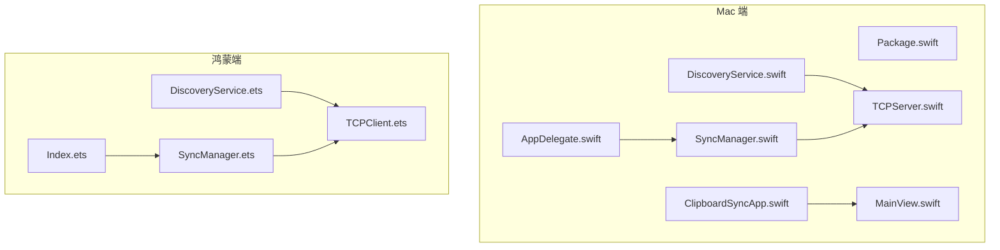
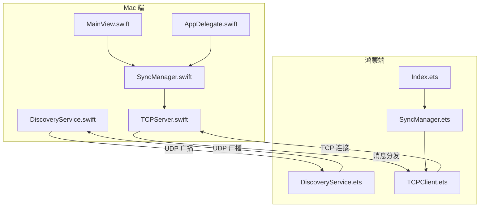
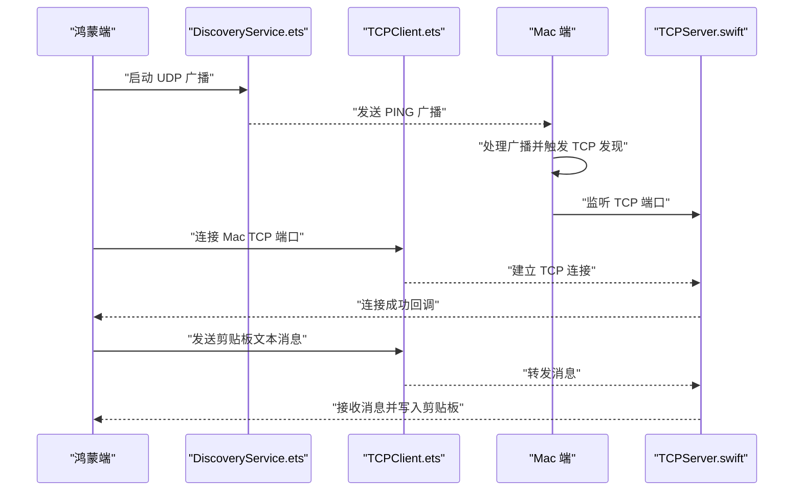
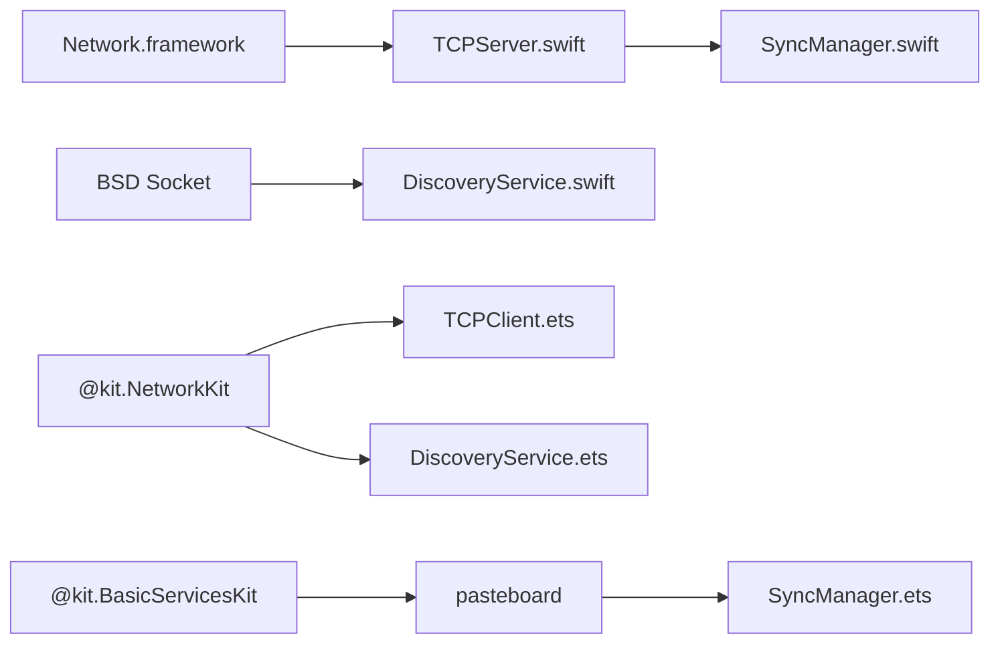

# 快速开始

<cite>
**本文引用的文件**
- [Package.swift](file://ClipboardSync/mac/Package.swift)
- [PROJECT.md](file://ClipboardSync/PROJECT.md)
- [Protocol.swift](file://ClipboardSync/mac/ClipboardSync/Protocol.swift)
- [SyncManager.ets](file://ClipboardSync/harmony/entry/src/main/ets/model/SyncManager.ets)
- [DiscoveryService.ets](file://ClipboardSync/harmony/entry/src/main/ets/common/DiscoveryService.ets)
- [TCPClient.ets](file://ClipboardSync/harmony/entry/src/main/ets/common/TCPClient.ets)
- [DiscoveryService.swift](file://ClipboardSync/mac/ClipboardSync/DiscoveryService.swift)
- [TCPServer.swift](file://ClipboardSync/mac/ClipboardSync/TCPServer.swift)
- [AppDelegate.swift](file://ClipboardSync/mac/ClipboardSync/AppDelegate.swift)
- [MainView.swift](file://ClipboardSync/mac/ClipboardSync/MainView.swift)
- [Index.ets](file://ClipboardSync/harmony/entry/src/main/ets/pages/Index.ets)
- [kill_clipboard_sync.sh](file://ClipboardSync/mac/kill_clipboard_sync.sh)
</cite>

## 目录
1. [简介](#简介)
2. [项目结构](#项目结构)
3. [核心组件](#核心组件)
4. [架构总览](#架构总览)
5. [详细组件分析](#详细组件分析)
6. [依赖关系分析](#依赖关系分析)
7. [性能注意事项](#性能注意事项)
8. [故障排查指南](#故障排查指南)
9. [结论](#结论)
10. [附录](#附录)

## 简介
ClipboardSync 是一款局域网内 Mac 与鸿蒙手机之间的剪贴板实时同步工具。它通过 UDP 广播进行设备发现，随后通过 TCP 长连接进行文本同步，并具备去重防回环、同步历史记录等功能。项目同时提供 Mac 端 Swift/SwiftUI 应用与鸿蒙端 ArkTS/ArkUI 应用，便于在两个平台间无缝使用。

## 项目结构
项目采用“端到端分离”的组织方式，分别在 mac 与 harmony 目录下维护各自平台的源码与构建配置。Mac 端使用 Swift Package Manager（SPM）管理依赖与构建；鸿蒙端使用 DevEco Studio 的工程体系与构建脚本。

图表来源
- [Package.swift:1-18](file://ClipboardSync/mac/Package.swift#L1-L18)
- [AppDelegate.swift:1-46](file://ClipboardSync/mac/ClipboardSync/AppDelegate.swift#L1-L46)
- [MainView.swift:1-209](file://ClipboardSync/mac/ClipboardSync/MainView.swift#L1-L209)
- [DiscoveryService.swift:1-197](file://ClipboardSync/mac/ClipboardSync/DiscoveryService.swift#L1-L197)
- [TCPServer.swift:1-174](file://ClipboardSync/mac/ClipboardSync/TCPServer.swift#L1-L174)
- [SyncManager.ets:1-301](file://ClipboardSync/harmony/entry/src/main/ets/model/SyncManager.ets#L1-L301)
- [DiscoveryService.ets:1-161](file://ClipboardSync/harmony/entry/src/main/ets/common/DiscoveryService.ets#L1-L161)
- [TCPClient.ets:1-181](file://ClipboardSync/harmony/entry/src/main/ets/common/TCPClient.ets#L1-L181)
- [Index.ets:1-226](file://ClipboardSync/harmony/entry/src/main/ets/pages/Index.ets#L1-L226)

章节来源
- [PROJECT.md:5-50](file://ClipboardSync/PROJECT.md#L5-L50)

## 核心组件
- 通信协议与端口
  - UDP 广播端口：用于设备发现
  - TCP 数据端口：用于文本同步
  - TCP 发现端口：Mac 通过该端口告知鸿蒙端其局域网 IP
- Mac 端组件
  - DiscoveryService.swift：基于 BSD Socket 的 UDP 广播监听与发送
  - TCPServer.swift：基于 Network.framework 的 TCP 服务端，负责接收与分发消息
  - SyncManager.swift：协调剪贴板轮询、消息发送与历史记录
  - MainView.swift：菜单栏弹窗的 SwiftUI 视图
  - AppDelegate.swift：应用生命周期与菜单栏图标初始化
- 鸿蒙端组件
  - DiscoveryService.ets：基于 @kit.NetworkKit 的 UDP 广播与监听
  - TCPClient.ets：基于 @kit.NetworkKit 的 TCP 客户端，负责连接与消息收发
  - SyncManager.ets：协调设备发现、TCP 连接、剪贴板读取与历史记录
  - Index.ets：主页面 UI，包含状态卡片、手动连接与历史记录展示

章节来源
- [Protocol.swift:1-43](file://ClipboardSync/mac/ClipboardSync/Protocol.swift#L1-L43)
- [DiscoveryService.swift:1-197](file://ClipboardSync/mac/ClipboardSync/DiscoveryService.swift#L1-L197)
- [TCPServer.swift:1-174](file://ClipboardSync/mac/ClipboardSync/TCPServer.swift#L1-L174)
- [SyncManager.ets:1-301](file://ClipboardSync/harmony/entry/src/main/ets/model/SyncManager.ets#L1-L301)
- [DiscoveryService.ets:1-161](file://ClipboardSync/harmony/entry/src/main/ets/common/DiscoveryService.ets#L1-L161)
- [TCPClient.ets:1-181](file://ClipboardSync/harmony/entry/src/main/ets/common/TCPClient.ets#L1-L181)
- [MainView.swift:1-209](file://ClipboardSync/mac/ClipboardSync/MainView.swift#L1-L209)
- [AppDelegate.swift:1-46](file://ClipboardSync/mac/ClipboardSync/AppDelegate.swift#L1-L46)
- [Index.ets:1-226](file://ClipboardSync/harmony/entry/src/main/ets/pages/Index.ets#L1-L226)

## 架构总览
系统采用“Mac 为服务端、鸿蒙为客户端”的连接模式。设备发现阶段通过 UDP 广播实现，随后由鸿蒙端主动发起 TCP 连接。消息以 JSON 行分隔的方式传输，两端均具备去重与历史记录能力。

图表来源
- [DiscoveryService.swift:1-197](file://ClipboardSync/mac/ClipboardSync/DiscoveryService.swift#L1-L197)
- [TCPServer.swift:1-174](file://ClipboardSync/mac/ClipboardSync/TCPServer.swift#L1-L174)
- [SyncManager.ets:1-301](file://ClipboardSync/harmony/entry/src/main/ets/model/SyncManager.ets#L1-L301)
- [DiscoveryService.ets:1-161](file://ClipboardSync/harmony/entry/src/main/ets/common/DiscoveryService.ets#L1-L161)
- [TCPClient.ets:1-181](file://ClipboardSync/harmony/entry/src/main/ets/common/TCPClient.ets#L1-L181)
- [MainView.swift:1-209](file://ClipboardSync/mac/ClipboardSync/MainView.swift#L1-L209)
- [AppDelegate.swift:1-46](file://ClipboardSync/mac/ClipboardSync/AppDelegate.swift#L1-L46)
- [Index.ets:1-226](file://ClipboardSync/harmony/entry/src/main/ets/pages/Index.ets#L1-L226)

## 详细组件分析

### Mac 端运行与安装
- 环境要求
  - macOS 平台，Swift 5.9+，Xcode 命令行工具
  - Swift Package Manager（SPM）支持
- 安装与运行步骤
  - 进入 Mac 端目录并构建运行
  - 应用以菜单栏图标形式运行，无 Dock 图标
  - 应用启动后自动开始服务，无需手动操作
- 常见问题
  - 若需要重启服务，可使用提供的脚本一键杀进程并重新运行

章节来源
- [Package.swift:1-18](file://ClipboardSync/mac/Package.swift#L1-L18)
- [PROJECT.md:64-77](file://ClipboardSync/PROJECT.md#L64-L77)
- [kill_clipboard_sync.sh:1-24](file://ClipboardSync/mac/kill_clipboard_sync.sh#L1-L24)
- [AppDelegate.swift:1-46](file://ClipboardSync/mac/ClipboardSync/AppDelegate.swift#L1-L46)

### 鸿蒙端开发环境与运行
- 环境要求
  - DevEco Studio 6.1+
  - HarmonyOS SDK API 23（6.1.0）
- 运行步骤
  - 使用 DevEco Studio 打开工程目录
  - 连接真机，编译安装并运行
  - 在主界面手动输入 Mac 的局域网 IP 地址并点击连接
- 常见问题
  - TCP 连接报错：需确保旧连接完全释放后再建立新连接
  - socket.SocketErrorInfo 不存在：使用 BusinessError 替代

章节来源
- [PROJECT.md:78-89](file://ClipboardSync/PROJECT.md#L78-L89)
- [PROJECT.md:102-121](file://ClipboardSync/PROJECT.md#L102-L121)
- [SyncManager.ets:129-174](file://ClipboardSync/harmony/entry/src/main/ets/model/SyncManager.ets#L129-L174)
- [TCPClient.ets:83-112](file://ClipboardSync/harmony/entry/src/main/ets/common/TCPClient.ets#L83-L112)

### 获取 Mac 局域网 IP
- 方法
  - 在终端执行相应命令以获取当前网络接口的局域网 IP
- 使用场景
  - 鸿蒙端手动连接时输入 Mac 的 IP 地址

章节来源
- [PROJECT.md:84-88](file://ClipboardSync/PROJECT.md#L84-L88)

### 基本使用教程
- 建立连接
  - 鸿蒙端自动搜索 Mac 设备；若自动发现失败，可在主界面手动输入 Mac 的局域网 IP 并连接
- 验证同步功能
  - 在任一端复制文本，另一端应自动同步到剪贴板
- 查看同步历史记录
  - 两端 UI 均显示最近 50 条同步记录，包含内容、方向与时间

章节来源
- [Index.ets:1-226](file://ClipboardSync/harmony/entry/src/main/ets/pages/Index.ets#L1-L226)
- [MainView.swift:1-209](file://ClipboardSync/mac/ClipboardSync/MainView.swift#L1-L209)
- [SyncManager.ets:285-299](file://ClipboardSync/harmony/entry/src/main/ets/model/SyncManager.ets#L285-L299)

### 通信流程（序列图）

图表来源
- [DiscoveryService.ets:25-95](file://ClipboardSync/harmony/entry/src/main/ets/common/DiscoveryService.ets#L25-L95)
- [TCPClient.ets:30-113](file://ClipboardSync/harmony/entry/src/main/ets/common/TCPClient.ets#L30-L113)
- [DiscoveryService.swift:150-180](file://ClipboardSync/mac/ClipboardSync/DiscoveryService.swift#L150-L180)
- [TCPServer.swift:23-51](file://ClipboardSync/mac/ClipboardSync/TCPServer.swift#L23-L51)

## 依赖关系分析
- Mac 端
  - 使用 Network.framework 提供的 NWListener/NWConnection 实现 TCP 服务端与连接管理
  - 使用 BSD Socket 实现 UDP 广播监听与发送
  - 通过 SwiftUI 与 NSStatusItem 提供菜单栏 UI
- 鸿蒙端
  - 使用 @kit.NetworkKit 的 UDPSocket/TCPSocket 实现网络层
  - 使用 @kit.BasicServicesKit 的 pasteboard 读写剪贴板
  - 使用 ArkTS/ArkUI 构建页面与状态管理

图表来源
- [TCPServer.swift:1-174](file://ClipboardSync/mac/ClipboardSync/TCPServer.swift#L1-L174)
- [DiscoveryService.swift:1-197](file://ClipboardSync/mac/ClipboardSync/DiscoveryService.swift#L1-L197)
- [TCPClient.ets:1-181](file://ClipboardSync/harmony/entry/src/main/ets/common/TCPClient.ets#L1-L181)
- [DiscoveryService.ets:1-161](file://ClipboardSync/harmony/entry/src/main/ets/common/DiscoveryService.ets#L1-L161)
- [SyncManager.ets:1-301](file://ClipboardSync/harmony/entry/src/main/ets/model/SyncManager.ets#L1-L301)

## 性能注意事项
- 轮询间隔
  - 鸿蒙端剪贴板轮询间隔较短，建议在空闲时适当增大以降低 CPU 占用
- TCP 粘包处理
  - 两端均采用换行符分隔消息，注意缓冲区拼接与边界处理
- 连接稳定性
  - 断线重连策略与去重逻辑有助于减少无效重连与回环

[本节为通用指导，不涉及具体文件分析]

## 故障排查指南
- 鸿蒙端 TCP 连接报错
  - 现象：连接时报错提示操作进行中
  - 原因：socket.close() 为异步，旧连接未完全释放
  - 解决：先断开旧连接，延迟一段时间后再建立新连接
- 鸿蒙端 socket.SocketErrorInfo 不存在
  - 现象：编译时报错找不到类型
  - 原因：API 23 中 socket 模块未导出该类型
  - 解决：使用 BusinessError 作为错误回调参数类型
- Mac 端 build-profile.json5 SDK 版本类型错误
  - 现象：构建失败
  - 原因：版本号必须为字符串类型
  - 解决：使用字符串格式的版本号
- Mac 端 SyncManager.start() 未在启动时调用
  - 现象：首次启动未自动开始
  - 原因：仅在 UI 出现时才启动
  - 解决：在应用生命周期中直接调用启动方法
- Mac 端 NWListener 默认监听 IPv6
  - 现象：lsof 显示为 IPv6，可能造成误解
  - 原因：默认支持双栈，实际不影响连接
  - 解决：忽略显示差异，关注连接状态

章节来源
- [PROJECT.md:102-127](file://ClipboardSync/PROJECT.md#L102-L127)

## 结论
ClipboardSync 提供了简洁高效的跨端剪贴板同步能力。通过明确的设备发现与 TCP 连接流程，以及完善的去重与历史记录机制，能够在日常工作中提升跨设备协作效率。建议在实际使用中优先尝试自动发现，若失败则使用手动连接方式，并根据设备性能调整轮询与重连策略。

[本节为总结性内容，不涉及具体文件分析]

## 附录

### 端口与协议
- UDP 广播端口：用于设备发现
- TCP 数据端口：用于文本同步
- TCP 发现端口：Mac 通过该端口告知鸿蒙端其局域网 IP

章节来源
- [Protocol.swift:1-43](file://ClipboardSync/mac/ClipboardSync/Protocol.swift#L1-L43)

### Mac 端运行命令
- 进入目录并构建运行
- 应用自动启动，菜单栏可见图标

章节来源
- [PROJECT.md:68-72](file://ClipboardSync/PROJECT.md#L68-L72)
- [kill_clipboard_sync.sh:22-24](file://ClipboardSync/mac/kill_clipboard_sync.sh#L22-L24)

### 鸿蒙端运行步骤
- 使用 DevEco Studio 打开工程
- 连接真机并安装运行
- 在主界面手动输入 Mac 的局域网 IP 并连接

章节来源
- [PROJECT.md:78-83](file://ClipboardSync/PROJECT.md#L78-L83)

### 获取 Mac 局域网 IP
- 在终端执行相应命令以获取当前网络接口的局域网 IP

章节来源
- [PROJECT.md:84-88](file://ClipboardSync/PROJECT.md#L84-L88)