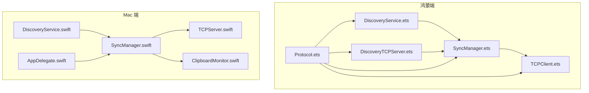
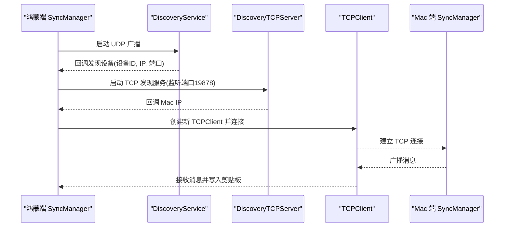
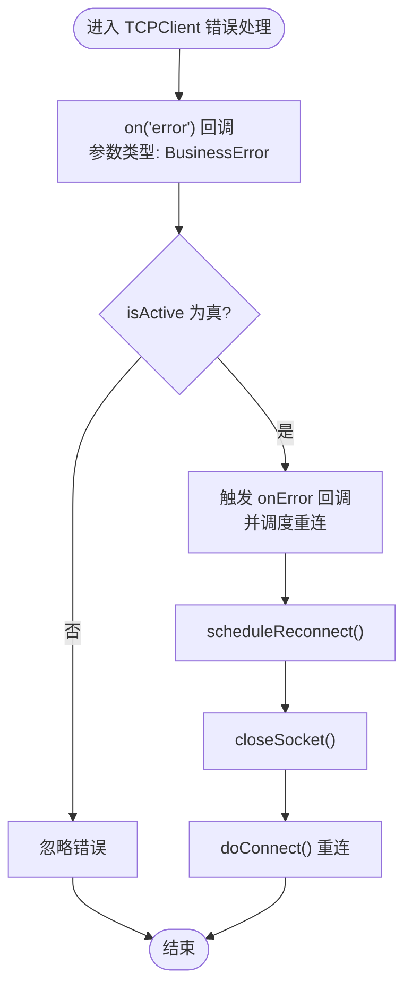
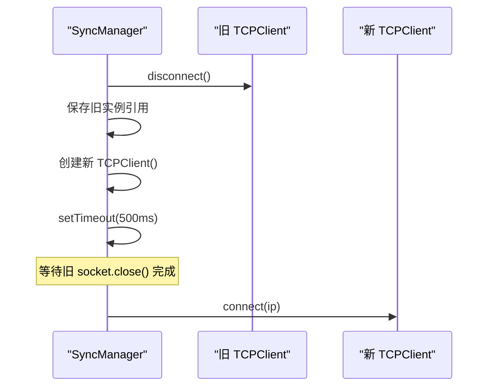
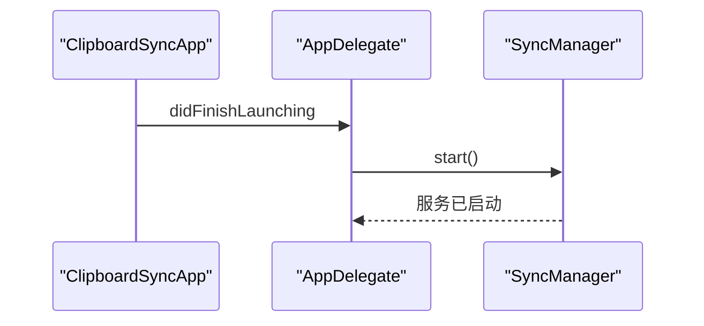
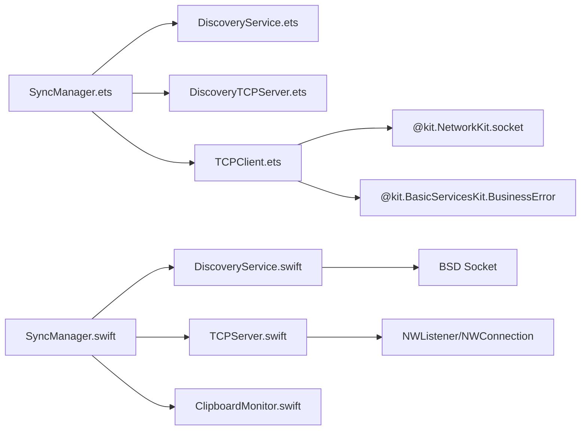

# 故障排除

<cite>
**本文引用的文件**
- [SyncManager.ets](file://ClipboardSync/harmony/entry/src/main/ets/model/SyncManager.ets)
- [TCPClient.ets](file://ClipboardSync/harmony/entry/src/main/ets/common/TCPClient.ets)
- [DiscoveryService.ets](file://ClipboardSync/harmony/entry/src/main/ets/common/DiscoveryService.ets)
- [DiscoveryTCPServer.ets](file://ClipboardSync/harmony/entry/src/main/ets/common/DiscoveryTCPServer.ets)
- [Protocol.ets](file://ClipboardSync/harmony/entry/src/main/ets/common/Protocol.ets)
- [build-profile.json5（鸿蒙）](file://ClipboardSync/harmony/entry/build-profile.json5)
- [SyncManager.swift](file://ClipboardSync/mac/ClipboardSync/SyncManager.swift)
- [TCPServer.swift](file://ClipboardSync/mac/ClipboardSync/TCPServer.swift)
- [DiscoveryService.swift](file://ClipboardSync/mac/ClipboardSync/DiscoveryService.swift)
- [ClipboardMonitor.swift](file://ClipboardSync/mac/ClipboardSync/ClipboardMonitor.swift)
- [AppDelegate.swift](file://ClipboardSync/mac/ClipboardSync/AppDelegate.swift)
- [Package.swift](file://ClipboardSync/mac/Package.swift)
- [PROJECT.md](file://ClipboardSync/PROJECT.md)
</cite>

## 目录
1. [简介](#简介)
2. [项目结构](#项目结构)
3. [核心组件](#核心组件)
4. [架构总览](#架构总览)
5. [详细组件分析](#详细组件分析)
6. [依赖关系分析](#依赖关系分析)
7. [性能考虑](#性能考虑)
8. [故障排除指南](#故障排除指南)
9. [结论](#结论)
10. [附录](#附录)

## 简介
本指南聚焦于项目中的已知问题与踩坑记录，提供系统的问题诊断与解决方法。覆盖以下主题：
- 鸿蒙端 TCP 连接“Operation in progress”错误的根本原因与修复策略（含 socket.close() 异步处理）
- 鸿蒙端 socket.SocketErrorInfo 不存在问题及使用 BusinessError 的替代方案
- Mac 端 build-profile.json5 中 SDK 版本类型错误的修复
- Mac 端 SyncManager.start() 未在启动时调用的问题与解决策略
- 网络连接问题排查（防火墙、IP 地址、端口占用等）
- 剪贴板权限与 API 使用注意事项
- 日志分析与调试工具使用
- 预防性措施与最佳实践

## 项目结构
项目由 Mac 端（Swift + SwiftUI）与鸿蒙端（ArkTS + ArkUI）组成，采用 UDP 广播进行设备发现，TCP 长连接进行文本同步，辅以图片同步能力（框架已具备，鸿蒙端接收尚未实现）。Mac 端服务端默认在应用启动时自动运行，鸿蒙端通过手动输入 IP 或 UDP 广播触发自动连接。

**图表来源**
- [SyncManager.ets:1-301](file://ClipboardSync/harmony/entry/src/main/ets/model/SyncManager.ets#L1-301)
- [TCPClient.ets:1-181](file://ClipboardSync/harmony/entry/src/main/ets/common/TCPClient.ets#L1-181)
- [DiscoveryService.ets:1-161](file://ClipboardSync/harmony/entry/src/main/ets/common/DiscoveryService.ets#L1-161)
- [DiscoveryTCPServer.ets:1-80](file://ClipboardSync/harmony/entry/src/main/ets/common/DiscoveryTCPServer.ets#L1-80)
- [Protocol.ets:1-27](file://ClipboardSync/harmony/entry/src/main/ets/common/Protocol.ets#L1-27)
- [SyncManager.swift:1-154](file://ClipboardSync/mac/ClipboardSync/SyncManager.swift#L1-154)
- [TCPServer.swift:1-174](file://ClipboardSync/mac/ClipboardSync/TCPServer.swift#L1-174)
- [DiscoveryService.swift:1-197](file://ClipboardSync/mac/ClipboardSync/DiscoveryService.swift#L1-197)
- [ClipboardMonitor.swift:1-73](file://ClipboardSync/mac/ClipboardSync/ClipboardMonitor.swift#L1-73)
- [AppDelegate.swift:1-46](file://ClipboardSync/mac/ClipboardSync/AppDelegate.swift#L1-46)

**章节来源**
- [PROJECT.md:1-170](file://ClipboardSync/PROJECT.md#L1-L170)

## 核心组件
- 鸿蒙端
  - SyncManager：协调设备发现、TCP 连接、剪贴板轮询与消息收发
  - TCPClient：封装 socket.TCPSocket，负责连接、收发、错误与重连
  - DiscoveryService：UDP 广播发现，过滤重复设备
  - DiscoveryTCPServer：监听端口 19878，从连接中提取 Mac IP
  - Protocol：统一的协议常量与消息结构
- Mac 端
  - SyncManager：协调发现、服务端、剪贴板监听
  - TCPServer：NWListener + NWConnection，处理粘包与广播
  - DiscoveryService：BSD Socket 实现广播与 TCP 发现
  - ClipboardMonitor：轮询 NSPasteboard，支持文本与图片
  - AppDelegate：应用生命周期入口，确保服务在启动时运行

**章节来源**
- [SyncManager.ets:1-301](file://ClipboardSync/harmony/entry/src/main/ets/model/SyncManager.ets#L1-301)
- [TCPClient.ets:1-181](file://ClipboardSync/harmony/entry/src/main/ets/common/TCPClient.ets#L1-181)
- [DiscoveryService.ets:1-161](file://ClipboardSync/harmony/entry/src/main/ets/common/DiscoveryService.ets#L1-161)
- [DiscoveryTCPServer.ets:1-80](file://ClipboardSync/harmony/entry/src/main/ets/common/DiscoveryTCPServer.ets#L1-80)
- [Protocol.ets:1-27](file://ClipboardSync/harmony/entry/src/main/ets/common/Protocol.ets#L1-27)
- [SyncManager.swift:1-154](file://ClipboardSync/mac/ClipboardSync/SyncManager.swift#L1-154)
- [TCPServer.swift:1-174](file://ClipboardSync/mac/ClipboardSync/TCPServer.swift#L1-174)
- [DiscoveryService.swift:1-197](file://ClipboardSync/mac/ClipboardSync/DiscoveryService.swift#L1-197)
- [ClipboardMonitor.swift:1-73](file://ClipboardSync/mac/ClipboardSync/ClipboardMonitor.swift#L1-73)
- [AppDelegate.swift:1-46](file://ClipboardSync/mac/ClipboardSync/AppDelegate.swift#L1-46)

## 架构总览
- 设备发现：双方定时广播 PING，收到后记录设备并触发连接
- 数据传输：TCP 长连接，消息以换行分隔，自动处理粘包
- 去重机制：消息携带时间戳，避免写入剪贴板后触发监听回环
- 连接角色：Mac 为服务端，鸿蒙为客户端

**图表来源**
- [SyncManager.ets:72-98](file://ClipboardSync/harmony/entry/src/main/ets/model/SyncManager.ets#L72-98)
- [DiscoveryService.ets:25-70](file://ClipboardSync/harmony/entry/src/main/ets/common/DiscoveryService.ets#L25-70)
- [DiscoveryTCPServer.ets:18-49](file://ClipboardSync/harmony/entry/src/main/ets/common/DiscoveryTCPServer.ets#L18-49)
- [TCPClient.ets:30-113](file://ClipboardSync/harmony/entry/src/main/ets/common/TCPClient.ets#L30-113)
- [SyncManager.swift:40-53](file://ClipboardSync/mac/ClipboardSync/SyncManager.swift#L40-53)

## 详细组件分析

### 鸿蒙端 TCPClient 错误处理与 BusinessError 替代
- 问题背景：API 23 中 socket 模块未导出 SocketErrorInfo，错误回调参数类型应使用 BusinessError
- 解决方案：在 TCPClient 的 error 事件回调中使用 BusinessError，并在 connect/send 的 Promise catch 中同样捕获 BusinessError
- 影响范围：所有 socket 事件回调与连接/发送 API

**图表来源**
- [TCPClient.ets:83-112](file://ClipboardSync/harmony/entry/src/main/ets/common/TCPClient.ets#L83-112)

**章节来源**
- [TCPClient.ets:1-181](file://ClipboardSync/harmony/entry/src/main/ets/common/TCPClient.ets#L1-L181)

### 鸿蒙端 TCP 连接“Operation in progress”错误与 socket.close() 异步处理
- 问题背景：socket.close() 为异步操作，若旧 socket 未完全关闭即创建新连接，系统返回“Operation in progress”
- 解决方案：在 SyncManager.setupTcpClient 中先断开旧 TCPClient，保留旧实例引用，延迟 500ms 后再创建新实例并连接
- 影响范围：连接切换、断线重连、频繁重连场景

**图表来源**
- [SyncManager.ets:129-174](file://ClipboardSync/harmony/entry/src/main/ets/model/SyncManager.ets#L129-174)

**章节来源**
- [SyncManager.ets:129-174](file://ClipboardSync/harmony/entry/src/main/ets/model/SyncManager.ets#L129-174)

### Mac 端 SyncManager.start() 未在启动时调用
- 问题背景：最初仅在 UI 出现时调用，导致用户需点击菜单栏图标才触发启动
- 解决方案：在 AppDelegate.applicationDidFinishLaunching 中直接调用 syncManager.start()

**图表来源**
- [AppDelegate.swift:9-10](file://ClipboardSync/mac/ClipboardSync/AppDelegate.swift#L9-10)
- [SyncManager.swift:40-45](file://ClipboardSync/mac/ClipboardSync/SyncManager.swift#L40-45)

**章节来源**
- [AppDelegate.swift:1-46](file://ClipboardSync/mac/ClipboardSync/AppDelegate.swift#L1-46)
- [SyncManager.swift:1-154](file://ClipboardSync/mac/ClipboardSync/SyncManager.swift#L1-154)

### Mac 端 build-profile.json5 SDK 版本类型错误
- 问题背景：compileSdkVersion 与 compatibleSdkVersion 必须为字符串类型，不能是数字
- 解决方案：将版本号改为字符串形式，例如 "6.1.0(23)"

**章节来源**
- [PROJECT.md:116-121](file://ClipboardSync/PROJECT.md#L116-L121)

## 依赖关系分析
- 鸿蒙端
  - SyncManager 依赖 DiscoveryService、DiscoveryTCPServer、TCPClient、Protocol
  - TCPClient 依赖 NetworkKit.socket 与 BasicServicesKit.BusinessError
- Mac 端
  - SyncManager 依赖 DiscoveryService、TCPServer、ClipboardMonitor
  - TCPServer 使用 NWListener/NWConnection，DiscoveryService 使用 BSD Socket

**图表来源**
- [SyncManager.ets:26-30](file://ClipboardSync/harmony/entry/src/main/ets/model/SyncManager.ets#L26-30)
- [TCPClient.ets:1-5](file://ClipboardSync/harmony/entry/src/main/ets/common/TCPClient.ets#L1-L5)
- [DiscoveryService.ets:1-5](file://ClipboardSync/harmony/entry/src/main/ets/common/DiscoveryService.ets#L1-L5)
- [DiscoveryTCPServer.ets:1-4](file://ClipboardSync/harmony/entry/src/main/ets/common/DiscoveryTCPServer.ets#L1-L4)
- [SyncManager.swift:5-14](file://ClipboardSync/mac/ClipboardSync/SyncManager.swift#L5-L14)
- [TCPServer.swift:1-3](file://ClipboardSync/mac/ClipboardSync/TCPServer.swift#L1-L3)
- [DiscoveryService.swift:1-3](file://ClipboardSync/mac/ClipboardSync/DiscoveryService.swift#L1-L3)

**章节来源**
- [SyncManager.ets:1-301](file://ClipboardSync/harmony/entry/src/main/ets/model/SyncManager.ets#L1-301)
- [TCPClient.ets:1-181](file://ClipboardSync/harmony/entry/src/main/ets/common/TCPClient.ets#L1-181)
- [DiscoveryService.ets:1-161](file://ClipboardSync/harmony/entry/src/main/ets/common/DiscoveryService.ets#L1-161)
- [DiscoveryTCPServer.ets:1-80](file://ClipboardSync/harmony/entry/src/main/ets/common/DiscoveryTCPServer.ets#L1-80)
- [SyncManager.swift:1-154](file://ClipboardSync/mac/ClipboardSync/SyncManager.swift#L1-154)
- [TCPServer.swift:1-174](file://ClipboardSync/mac/ClipboardSync/TCPServer.swift#L1-174)
- [DiscoveryService.swift:1-197](file://ClipboardSync/mac/ClipboardSync/DiscoveryService.swift#L1-197)

## 性能考虑
- 轮询间隔：剪贴板轮询与 UDP 广播间隔已按协议常量配置，避免过于频繁导致资源消耗
- 粘包处理：两端均采用换行符分隔消息并缓冲处理，减少解析开销
- 断线重连：连接失败后延时重连，降低瞬时重试压力

[本节为通用指导，无需列出章节来源]

## 故障排除指南

### 一、鸿蒙端 TCP 连接“Operation in progress”错误
- 症状
  - 连接报错码 2301115（Operation in progress）
  - 连接频繁断开或无法建立
- 根因
  - socket.close() 为异步操作，旧 socket 未完全释放即创建新连接
- 诊断步骤
  - 查看 SyncManager.setupTcpClient 的连接切换逻辑
  - 确认是否在 disconnect() 后立即创建新实例并连接
  - 观察是否有 500ms 延迟后再 connect()
- 解决方案
  - 保留旧实例引用并在 500ms 后再创建新实例并连接
  - 在异常分支中清理旧实例引用，避免内存泄漏
- 预防措施
  - 统一在连接切换时使用“断开旧连接 → 延迟 → 创建新实例 → 连接”的流程
  - 对外暴露连接状态与错误回调，便于 UI 层感知

**章节来源**
- [SyncManager.ets:129-174](file://ClipboardSync/harmony/entry/src/main/ets/model/SyncManager.ets#L129-174)
- [TCPClient.ets:37-42](file://ClipboardSync/harmony/entry/src/main/ets/common/TCPClient.ets#L37-42)

### 二、鸿蒙端 socket.SocketErrorInfo 不存在
- 症状
  - 编译时报错：找不到 socket.SocketErrorInfo 类型
- 根因
  - API 23 中 NetworkKit.socket 未导出该类型
- 诊断步骤
  - 检查 TCPClient 与 DiscoveryService 的 error 事件回调参数类型
  - 确认是否使用 BusinessError
- 解决方案
  - 将错误回调参数类型替换为 BusinessError
  - 在 connect()/send() 的 Promise catch 中同样使用 BusinessError
- 预防措施
  - 在接入新 API 时，优先查看官方文档与变更说明，避免依赖未导出类型

**章节来源**
- [TCPClient.ets:1-5](file://ClipboardSync/harmony/entry/src/main/ets/common/TCPClient.ets#L1-L5)
- [TCPClient.ets:83-112](file://ClipboardSync/harmony/entry/src/main/ets/common/TCPClient.ets#L83-112)
- [DiscoveryService.ets:36-38](file://ClipboardSync/harmony/entry/src/main/ets/common/DiscoveryService.ets#L36-38)

### 三、Mac 端 build-profile.json5 SDK 版本类型错误
- 症状
  - 构建失败或警告：SDK 版本类型不匹配
- 根因
  - compileSdkVersion 与 compatibleSdkVersion 必须为字符串，不能是数字
- 诊断步骤
  - 检查 build-profile.json5 中的 SDK 版本字段
- 解决方案
  - 将版本号改为字符串，如 "6.1.0(23)"
- 预防措施
  - 在升级 SDK 时同步更新配置文件字段类型

**章节来源**
- [PROJECT.md:116-121](file://ClipboardSync/PROJECT.md#L116-L121)

### 四、Mac 端 SyncManager.start() 未在启动时调用
- 症状
  - 应用启动后需要手动点击菜单栏图标才开始服务
- 根因
  - 启动时未调用 start()
- 诊断步骤
  - 检查 AppDelegate.applicationDidFinishLaunching 是否调用
  - 确认 UI 出现时是否再次调用（避免重复）
- 解决方案
  - 在 didFinishLaunching 中直接调用 syncManager.start()
- 预防措施
  - 将“应用启动即运行”的逻辑放在 AppDelegate 生命周期钩子中

**章节来源**
- [AppDelegate.swift:9-10](file://ClipboardSync/mac/ClipboardSync/AppDelegate.swift#L9-10)
- [SyncManager.swift:40-45](file://ClipboardSync/mac/ClipboardSync/SyncManager.swift#L40-45)

### 五、网络连接问题排查
- 防火墙设置
  - 确认系统防火墙未拦截应用进程
  - 检查应用是否被系统策略限制网络访问
- IP 地址配置
  - 确认 Mac 与鸿蒙设备在同一局域网
  - 使用命令查询 Mac 的局域网 IP（如 en0）
- 端口占用
  - 端口：UDP 19876、TCP 19877、TCP 19878
  - 使用 lsof/netstat 检查端口占用情况
- 协议一致性
  - 确认两端 Protocol 常量一致（端口、心跳间隔等）

**章节来源**
- [Protocol.ets:2-9](file://ClipboardSync/harmony/entry/src/main/ets/common/Protocol.ets#L2-L9)
- [DiscoveryService.swift:104-112](file://ClipboardSync/mac/ClipboardSync/DiscoveryService.swift#L104-L112)
- [TCPServer.swift:23-51](file://ClipboardSync/mac/ClipboardSync/TCPServer.swift#L23-L51)

### 六、剪贴板权限与 API 使用注意事项
- Mac 端
  - NSPasteboard 读写需注意 isRemoteUpdate 标志，避免写入触发监听回环
  - 图片同步需将 TIFF 转 PNG，确保兼容性
- 鸿蒙端
  - 使用 SystemPasteboard 的同步接口，注意异常捕获
  - 写入后及时更新 changeCount，避免轮询检测失效

**章节来源**
- [ClipboardMonitor.swift:30-48](file://ClipboardSync/mac/ClipboardSync/ClipboardMonitor.swift#L30-48)
- [SyncManager.ets:273-283](file://ClipboardSync/harmony/entry/src/main/ets/model/SyncManager.ets#L273-283)

### 七、日志分析与调试工具使用
- 日志位置
  - 鸿蒙端：console.info/error 输出
  - Mac 端：print 输出
- 关键日志点
  - UDP 广播发送/接收
  - TCP 连接建立/断开/错误
  - 消息收发与去重判断
- 调试建议
  - 使用 DevEco Studio 与 Xcode 的日志面板查看输出
  - 结合 lsof/netstat 检查端口状态
  - 使用抓包工具验证 UDP 广播与 TCP 消息格式

**章节来源**
- [DiscoveryService.ets:119-123](file://ClipboardSync/harmony/entry/src/main/ets/common/DiscoveryService.ets#L119-123)
- [TCPClient.ets:106-112](file://ClipboardSync/harmony/entry/src/main/ets/common/TCPClient.ets#L106-112)
- [TCPServer.swift:109-127](file://ClipboardSync/mac/ClipboardSync/TCPServer.swift#L109-127)

### 八、预防性措施与最佳实践
- 连接管理
  - 统一使用“断开旧连接 → 延迟 → 创建新实例 → 连接”的流程
  - 对外暴露连接状态与错误回调，便于 UI 与日志联动
- 错误处理
  - 使用 BusinessError 统一处理 socket 错误
  - 对关键 API（connect/send）添加 Promise catch
- 配置校验
  - 构建配置中的 SDK 版本必须为字符串
  - 端口与协议常量保持两端一致
- 启动流程
  - Mac 端在 didFinishLaunching 中启动服务，避免用户交互前置
- 去重与幂等
  - 通过时间戳去重，避免写入剪贴板触发回环
  - 轮询间隔与粘包处理需稳定可靠

**章节来源**
- [SyncManager.ets:129-174](file://ClipboardSync/harmony/entry/src/main/ets/model/SyncManager.ets#L129-174)
- [TCPClient.ets:1-5](file://ClipboardSync/harmony/entry/src/main/ets/common/TCPClient.ets#L1-L5)
- [PROJECT.md:102-127](file://ClipboardSync/PROJECT.md#L102-L127)

## 结论
本指南围绕项目中的关键问题提供了系统性的诊断与修复路径，涵盖网络层、平台 API、构建配置与启动流程等方面。遵循本文的预防性措施与最佳实践，可显著降低故障发生概率并提升系统的稳定性与可维护性。

## 附录
- 相关文件清单
  - 鸿蒙端：SyncManager.ets、TCPClient.ets、DiscoveryService.ets、DiscoveryTCPServer.ets、Protocol.ets、build-profile.json5
  - Mac 端：SyncManager.swift、TCPServer.swift、DiscoveryService.swift、ClipboardMonitor.swift、AppDelegate.swift、Package.swift、build-profile.json5
- 参考文档：PROJECT.md