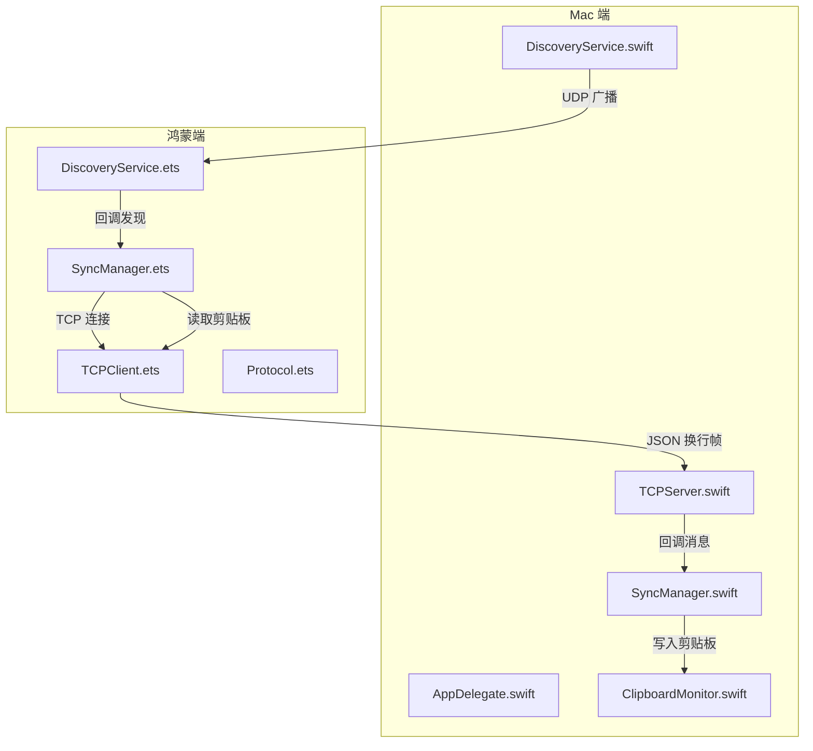
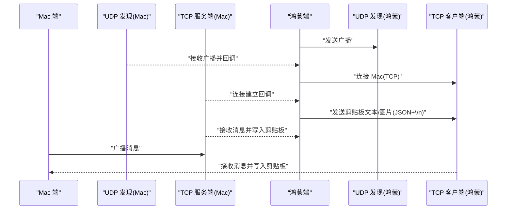
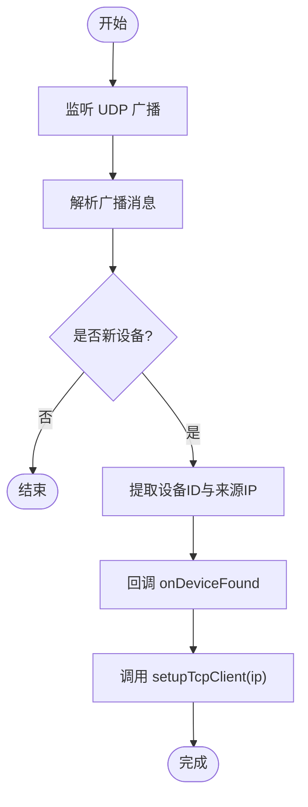
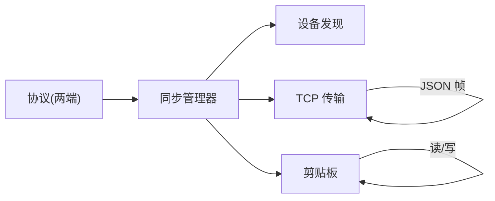

# 未来路线图

<cite>
**本文引用的文件**
- [PROJECT.md](file://ClipboardSync/PROJECT.md)
- [Package.swift](file://ClipboardSync/mac/Package.swift)
- [build-profile.json5](file://ClipboardSync/harmony/build-profile.json5)
- [kill_clipboard_sync.sh](file://ClipboardSync/mac/kill_clipboard_sync.sh)
- [kill_clipboard_sync.sh](file://kill_clipboard_sync.sh)
- [DiscoveryService.swift](file://ClipboardSync/mac/ClipboardSync/DiscoveryService.swift)
- [DiscoveryService.ets](file://ClipboardSync/harmony/entry/src/main/ets/common/DiscoveryService.ets)
- [SyncManager.swift](file://ClipboardSync/mac/ClipboardSync/SyncManager.swift)
- [SyncManager.ets](file://ClipboardSync/harmony/entry/src/main/ets/model/SyncManager.ets)
- [Protocol.swift](file://ClipboardSync/mac/ClipboardSync/Protocol.swift)
- [Protocol.ets](file://ClipboardSync/harmony/entry/src/main/ets/common/Protocol.ets)
- [TCPServer.swift](file://ClipboardSync/mac/ClipboardSync/TCPServer.swift)
- [TCPClient.ets](file://ClipboardSync/harmony/entry/src/main/ets/common/TCPClient.ets)
- [ClipboardMonitor.swift](file://ClipboardSync/mac/ClipboardSync/ClipboardMonitor.swift)
- [AppDelegate.swift](file://ClipboardSync/mac/ClipboardSync/AppDelegate.swift)
</cite>

## 目录
1. [引言](#引言)
2. [项目结构](#项目结构)
3. [核心组件](#核心组件)
4. [架构总览](#架构总览)
5. [详细组件分析](#详细组件分析)
6. [依赖关系分析](#依赖关系分析)
7. [性能考量](#性能考量)
8. [故障排查指南](#故障排查指南)
9. [结论](#结论)
10. [附录](#附录)

## 引言
本路线图面向 ClipboardSync 项目下一阶段的发展目标，围绕 P0-P2 优先级清单，系统梳理必须修复的功能（尤其是 UDP 自动发现连接）、体验优化计划（图片剪贴板同步、菜单栏状态图标、开机自启、后台保活等）、安全与扩展方向（端到端加密、跨 WiFi/广域网支持、多设备支持）、技术债务与重构计划、社区贡献与开源策略、版本发布与里程碑、风险评估与应对策略，以及项目的长期愿景与发展方向。

## 项目结构
项目采用“双端同构协议”的架构设计：Mac 端（Swift + SwiftUI）与鸿蒙端（ArkTS + ArkUI）共享通信协议常量与消息结构，分别实现各自的设备发现、TCP 传输与剪贴板监听模块。构建与运行方式如下：
- Mac 端：SPM 可执行目标，菜单栏运行，无 Dock 图标，应用生命周期在启动时自动初始化并启动同步。
- 鸿蒙端：DevEco Studio 6.1+ 工程，入口 Ability 与 UI 页面分离，模块内含协议、发现、TCP 客户端与同步管理器。

图表来源
- [AppDelegate.swift:1-46](file://ClipboardSync/mac/ClipboardSync/AppDelegate.swift#L1-L46)
- [SyncManager.swift:1-154](file://ClipboardSync/mac/ClipboardSync/SyncManager.swift#L1-L154)
- [DiscoveryService.swift:1-197](file://ClipboardSync/mac/ClipboardSync/DiscoveryService.swift#L1-L197)
- [TCPServer.swift:1-174](file://ClipboardSync/mac/ClipboardSync/TCPServer.swift#L1-L174)
- [ClipboardMonitor.swift:1-73](file://ClipboardSync/mac/ClipboardSync/ClipboardMonitor.swift#L1-L73)
- [SyncManager.ets:1-301](file://ClipboardSync/harmony/entry/src/main/ets/model/SyncManager.ets#L1-L301)
- [DiscoveryService.ets:1-161](file://ClipboardSync/harmony/entry/src/main/ets/common/DiscoveryService.ets#L1-L161)
- [TCPClient.ets:1-181](file://ClipboardSync/harmony/entry/src/main/ets/common/TCPClient.ets#L1-L181)
- [Protocol.ets:1-27](file://ClipboardSync/harmony/entry/src/main/ets/common/Protocol.ets#L1-L27)

章节来源
- [PROJECT.md:5-50](file://ClipboardSync/PROJECT.md#L5-L50)
- [Package.swift:1-18](file://ClipboardSync/mac/Package.swift#L1-L18)
- [build-profile.json5:1-43](file://ClipboardSync/harmony/build-profile.json5#L1-L43)

## 核心组件
- 通信协议与消息模型：Mac 与鸿蒙端共享协议常量与消息结构，统一使用 JSON + 换行分隔的帧格式，包含文本与图片两类剪贴板消息，以及心跳探测。
- 设备发现：双方均实现 UDP 广播与监听，Mac 端额外提供一次短连接的“发现 TCP”通道，用于告知鸿蒙端本机 IP。
- 同步管理器：负责状态机、历史记录、去重防回环、本地与远端消息处理、剪贴板读写与轮询。
- 传输层：Mac 端为 TCP 服务端（Network.framework），鸿蒙端为 TCP 客户端（NetworkKit.socket），均具备粘包处理与断线重连。
- 剪贴板接口：Mac 使用 NSPasteboard，鸿蒙使用 BasicServicesKit 系统剪贴板。

章节来源
- [Protocol.swift:1-43](file://ClipboardSync/mac/ClipboardSync/Protocol.swift#L1-L43)
- [Protocol.ets:1-27](file://ClipboardSync/harmony/entry/src/main/ets/common/Protocol.ets#L1-L27)
- [SyncManager.swift:1-154](file://ClipboardSync/mac/ClipboardSync/SyncManager.swift#L1-L154)
- [SyncManager.ets:1-301](file://ClipboardSync/harmony/entry/src/main/ets/model/SyncManager.ets#L1-L301)
- [TCPServer.swift:1-174](file://ClipboardSync/mac/ClipboardSync/TCPServer.swift#L1-L174)
- [TCPClient.ets:1-181](file://ClipboardSync/harmony/entry/src/main/ets/common/TCPClient.ets#L1-L181)
- [ClipboardMonitor.swift:1-73](file://ClipboardSync/mac/ClipboardSync/ClipboardMonitor.swift#L1-L73)

## 架构总览
下图展示了端到端的数据流与控制流：UDP 发现建立 TCP 连接，随后进行剪贴板消息的双向同步；两端均具备去重与回环防护。

图表来源
- [DiscoveryService.swift:1-197](file://ClipboardSync/mac/ClipboardSync/DiscoveryService.swift#L1-L197)
- [DiscoveryService.ets:1-161](file://ClipboardSync/harmony/entry/src/main/ets/common/DiscoveryService.ets#L1-L161)
- [TCPServer.swift:1-174](file://ClipboardSync/mac/ClipboardSync/TCPServer.swift#L1-L174)
- [TCPClient.ets:1-181](file://ClipboardSync/harmony/entry/src/main/ets/common/TCPClient.ets#L1-L181)
- [SyncManager.swift:1-154](file://ClipboardSync/mac/ClipboardSync/SyncManager.swift#L1-L154)
- [SyncManager.ets:1-301](file://ClipboardSync/harmony/entry/src/main/ets/model/SyncManager.ets#L1-L301)

## 详细组件分析

### UDP 自动发现连接（P0 必须修复）
现状与问题
- 鸿蒙端 DiscoveryService 能正确解析 Mac 的广播并回调发现事件，但当前未从回调中提取 Mac 的 IP 并自动发起 TCP 连接。
- Mac 端 DiscoveryService 已具备“发现设备后发起一次短连接”的能力，但当前回调仅传递设备 ID 与端口，未将 Mac 的真实 IP 传递给鸿蒙端。

修复建议
- 鸿蒙端：在 DiscoveryService.ets 的 onDeviceFound 回调中，确保能稳定获取到 Mac 的 IP 与端口，然后调用 SyncManager.setupTcpClient(ip)。
- Mac 端：在 DiscoveryService.swift 的 handleBroadcastData 中，当检测到新设备且未完成 TCP 发现阶段时，应通过一次短连接将本机 IP 传递给鸿蒙端，或由鸿蒙端通过 DiscoveryTCPServer 获取。

图表来源
- [DiscoveryService.ets:126-161](file://ClipboardSync/harmony/entry/src/main/ets/common/DiscoveryService.ets#L126-L161)
- [SyncManager.ets:129-174](file://ClipboardSync/harmony/entry/src/main/ets/model/SyncManager.ets#L129-L174)
- [DiscoveryService.swift:78-100](file://ClipboardSync/mac/ClipboardSync/DiscoveryService.swift#L78-L100)

章节来源
- [PROJECT.md:134-137](file://ClipboardSync/PROJECT.md#L134-L137)
- [DiscoveryService.ets:1-161](file://ClipboardSync/harmony/entry/src/main/ets/common/DiscoveryService.ets#L1-L161)
- [DiscoveryService.swift:1-197](file://ClipboardSync/mac/ClipboardSync/DiscoveryService.swift#L1-L197)
- [SyncManager.ets:1-301](file://ClipboardSync/harmony/entry/src/main/ets/model/SyncManager.ets#L1-L301)

### 图片剪贴板同步（P1 体验优化）
现状与问题
- Mac 端已支持图片读取与发送（PNG Base64），但未在 UI 中展示图片预览或提示。
- 鸿蒙端已接收图片消息，但尚未实现写入系统剪贴板与 UI 展示。

开发计划
- 鸿蒙端：在 handleRemoteMessage 中识别图片消息，调用系统剪贴板写入，并在 UI 历史列表中显示图片占位或缩略图。
- Mac 端：在 UI 中区分图片与文本，提供“查看图片”或“复制图片”等交互。

章节来源
- [PROJECT.md:140](file://ClipboardSync/PROJECT.md#L140)
- [SyncManager.swift:95-115](file://ClipboardSync/mac/ClipboardSync/SyncManager.swift#L95-L115)
- [SyncManager.ets:178-198](file://ClipboardSync/harmony/entry/src/main/ets/model/SyncManager.ets#L178-L198)

### 菜单栏状态图标（P1 体验优化）
现状与问题
- 菜单栏图标当前固定为剪贴板符号，未根据连接状态切换颜色或样式。

开发计划
- 根据 SyncStatus（未连接/搜索中/已连接）动态设置 NSImage，例如使用不同颜色或叠加指示点。
- 在弹出面板中显示连接设备名、最后同步时间与历史记录。

章节来源
- [PROJECT.md:141](file://ClipboardSync/PROJECT.md#L141)
- [AppDelegate.swift:1-46](file://ClipboardSync/mac/ClipboardSync/AppDelegate.swift#L1-L46)
- [SyncManager.swift:18-22](file://ClipboardSync/mac/ClipboardSync/SyncManager.swift#L18-L22)

### Mac 端开机自启（P1 体验优化）
现状与问题
- 应用为辅助应用（LSUIElement=true），但未注册 LaunchAgent 或登录项。

开发计划
- 生成 LaunchAgent plist，随系统启动自动运行应用。
- 在首次启动时引导用户授权，或在设置面板中提供一键开关。

章节来源
- [PROJECT.md:142](file://ClipboardSync/PROJECT.md#L142)
- [Package.swift:1-18](file://ClipboardSync/mac/Package.swift#L1-L18)

### 鸿蒙端后台保活（P1 体验优化）
现状与问题
- 当应用进入后台或被系统回收时，剪贴板轮询与网络连接可能中断。

开发计划
- 申请连续任务（ContinuousTask，backgroundModes: dataTransfer），在后台维持网络与轮询。
- 若系统限制严格，提供“通知提醒用户打开应用”或“前台服务”降级方案。

章节来源
- [PROJECT.md:143](file://ClipboardSync/PROJECT.md#L143)
- [SyncManager.ets:202-233](file://ClipboardSync/harmony/entry/src/main/ets/model/SyncManager.ets#L202-L233)

### 连接状态持久化（P1 体验优化）
现状与问题
- 每次启动需要手动输入 Mac IP，或依赖 UDP 自动发现。

开发计划
- 在本地存储上次连接的 Mac IP，启动时优先尝试自动连接。
- 若 UDP 不可用，回退到手动输入 IP 的模式。

章节来源
- [PROJECT.md:144](file://ClipboardSync/PROJECT.md#L144)
- [SyncManager.ets:110-117](file://ClipboardSync/harmony/entry/src/main/ets/model/SyncManager.ets#L110-L117)

### 端到端加密（P2 安全与扩展）
现状与问题
- 当前传输未加密，明文 JSON 通过 TCP 传输。

开发计划
- 配对阶段：交换公钥（如基于设备指纹的简单握手），协商对称密钥。
- 加密传输：使用 AES-256-GCM 对 JSON 内容加密，附加认证标签。
- 证书与密钥管理：本地安全存储，定期轮换。

章节来源
- [PROJECT.md:148](file://ClipboardSync/PROJECT.md#L148)
- [Protocol.swift:27-42](file://ClipboardSync/mac/ClipboardSync/Protocol.swift#L27-L42)
- [Protocol.ets:19-26](file://ClipboardSync/harmony/entry/src/main/ets/common/Protocol.ets#L19-L26)

### 跨 WiFi/广域网支持（P2 安全与扩展）
现状与问题
- 仅支持局域网直连，无法跨网段或 NAT 穿透。

开发计划
- 部署中继服务器：两端通过 WebSocket 连接中继，中继负责转发消息。
- NAT 穿透：可选 STUN/TURN 或中继回退路径。
- 安全：中继侧同样支持端到端加密。

章节来源
- [PROJECT.md:149](file://ClipboardSync/PROJECT.md#L149)

### 多设备支持（P2 安全与扩展）
现状与问题
- Mac 端当前仅维护一个 TCP 连接，无法同时服务多台鸿蒙设备。

开发计划
- Mac 端：维护设备连接池，按设备 ID 分发消息与去重。
- 鸿蒙端：支持选择设备、断线重连与设备切换。
- 广播与发现：为每个设备独立记录发现状态，避免互相干扰。

章节来源
- [PROJECT.md:150](file://ClipboardSync/PROJECT.md#L150)
- [TCPServer.swift:69-71](file://ClipboardSync/mac/ClipboardSync/TCPServer.swift#L69-L71)

### 大文件传输优化（P2 安全与扩展）
现状与问题
- 图片与大文本一次性传输，可能造成单帧过大。

开发计划
- 分片传输：将大内容切分为小块，携带序号与校验，接收端重组。
- 流式处理：边接收边写入剪贴板，降低内存峰值。
- 超时与重传：为分片增加超时与重传机制。

章节来源
- [PROJECT.md:151](file://ClipboardSync/PROJECT.md#L151)

### 鸿蒙端后台同步降级方案（P2 安全与扩展）
现状与问题
- 系统冻结导致后台保活失效。

开发计划
- 通知触发：推送“剪贴板有更新，请打开应用查看”。
- 前台服务：在受限场景下仅进行必要同步，减少资源占用。
- 用户引导：在设置中提示后台权限与电池优化白名单。

章节来源
- [PROJECT.md:152](file://ClipboardSync/PROJECT.md#L152)

## 依赖关系分析
- 协议一致性：两端共享协议常量与消息结构，保证互通。
- 控制耦合：SyncManager 作为协调者，依赖发现、传输与剪贴板模块。
- 网络耦合：TCP 两端分别承担客户端/服务端职责，UDP 仅用于发现。
- 外部依赖：Mac 使用 Network.framework 与 NSPasteboard；鸿蒙使用 NetworkKit 与 BasicServicesKit。

图表来源
- [Protocol.swift:1-43](file://ClipboardSync/mac/ClipboardSync/Protocol.swift#L1-L43)
- [Protocol.ets:1-27](file://ClipboardSync/harmony/entry/src/main/ets/common/Protocol.ets#L1-L27)
- [SyncManager.swift:1-154](file://ClipboardSync/mac/ClipboardSync/SyncManager.swift#L1-L154)
- [SyncManager.ets:1-301](file://ClipboardSync/harmony/entry/src/main/ets/model/SyncManager.ets#L1-L301)

章节来源
- [Protocol.swift:1-43](file://ClipboardSync/mac/ClipboardSync/Protocol.swift#L1-L43)
- [Protocol.ets:1-27](file://ClipboardSync/harmony/entry/src/main/ets/common/Protocol.ets#L1-L27)
- [SyncManager.swift:1-154](file://ClipboardSync/mac/ClipboardSync/SyncManager.swift#L1-L154)
- [SyncManager.ets:1-301](file://ClipboardSync/harmony/entry/src/main/ets/model/SyncManager.ets#L1-L301)

## 性能考量
- UDP 广播频率：当前 3 秒一次，可在移动设备上适度降低以节省电量。
- TCP 粘包处理：两端均采用换行分隔，注意异常断开后的缓冲区清理。
- 剪贴板轮询：Mac 为 0.5 秒，鸿蒙为 0.5 秒，建议在后台或低频场景下调大间隔。
- 图片传输：PNG 编码与 Base64 增加开销，建议在 UI 层做懒加载与缓存。
- 断线重连：指数退避与抖动，避免风暴重连。

## 故障排查指南
常见问题与定位要点
- 鸿蒙端 TCP 连接报错：检查旧 socket 是否完全关闭（已通过延迟与实例替换规避）。
- 鸿蒙端 socket 错误类型缺失：使用 BusinessError 替代 SocketErrorInfo。
- Mac 端 SDK 版本类型错误：确保 compileSdkVersion 与 compatibleSdkVersion 为字符串。
- Mac 端 SyncManager 未在启动时调用：已在 AppDelegate 中修正。
- Mac 端 NWListener 默认监听 IPv6：属正常行为，不影响连接。

章节来源
- [PROJECT.md:102-131](file://ClipboardSync/PROJECT.md#L102-L131)
- [kill_clipboard_sync.sh:1-24](file://ClipboardSync/mac/kill_clipboard_sync.sh#L1-L24)
- [kill_clipboard_sync.sh:1-24](file://kill_clipboard_sync.sh#L1-L24)

## 结论
本路线图明确了下一阶段的关键目标：优先修复 UDP 自动发现连接，补齐图片同步与 UI 体验，强化安全与扩展能力，并逐步引入后台保活与多设备支持。建议采用“迭代式增量交付”，以 P0 为首要目标，P1/P2 按资源与反馈节奏推进，持续优化性能与稳定性。

## 附录

### 版本发布与里程碑建议
- V0.1：修复 UDP 自动发现连接，完成图片接收与写入，完善菜单栏状态图标。
- V0.2：实现开机自启、后台保活与连接状态持久化，补充历史记录 UI。
- V0.3：引入端到端加密与跨网段中继方案，支持多设备连接。
- V0.4：大文件分片传输与性能优化，完善通知与降级策略。
- V1.0：稳定版发布，提供完整文档与迁移指南。

### 风险评估与应对策略
- 技术挑战
  - UDP 自动发现不稳定：加强去重与重试，提供手动输入 IP 回退。
  - 鸿蒙后台限制：采用连续任务与通知触发，必要时提供前台服务。
  - 网络穿透困难：优先中继方案，辅以 NAT 穿透。
- 应对策略
  - 增加诊断日志与状态面板，便于用户自助排查。
  - 提供设置页与帮助文档，引导用户开启必要权限。
  - 采用渐进增强与向后兼容，避免破坏既有功能。

### 社区贡献与开源计划
- 开源策略：项目为自用工具，暂不上架发布。欢迎社区反馈与 PR，遵循统一协议与测试规范。
- 贡献方式：Issue 报告问题与需求，PR 提交修复与特性，保持代码风格一致。
- 行为准则：尊重、包容、协作，共同推动项目演进。