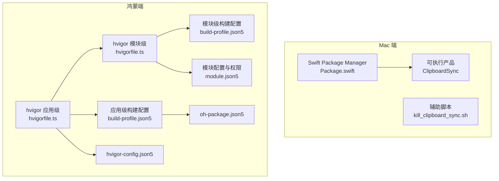
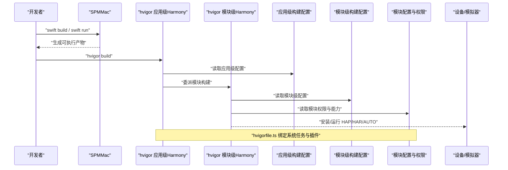
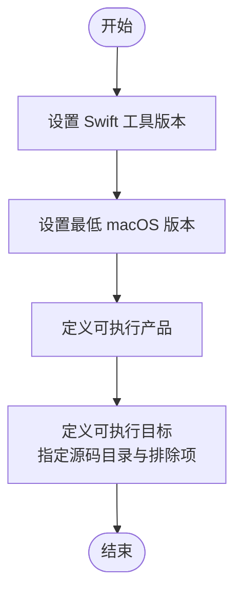
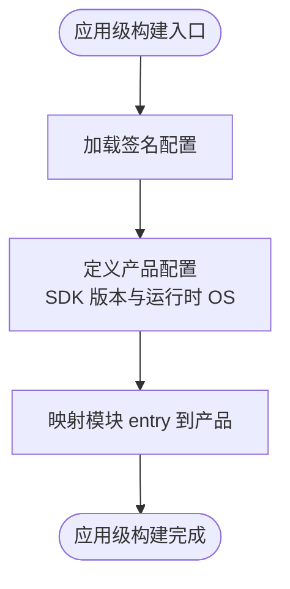
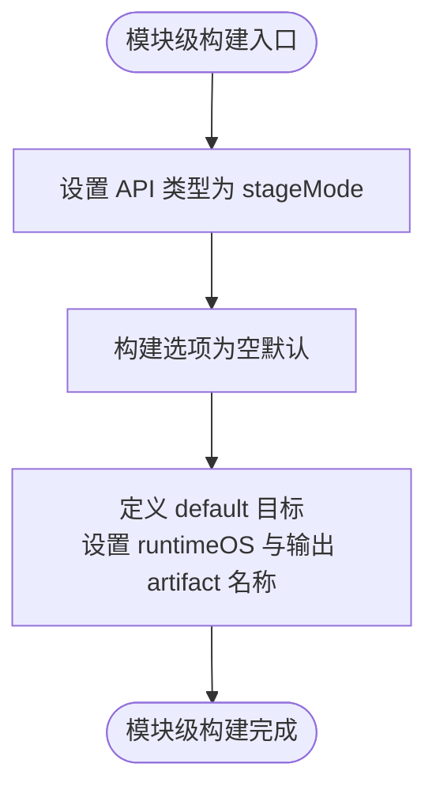
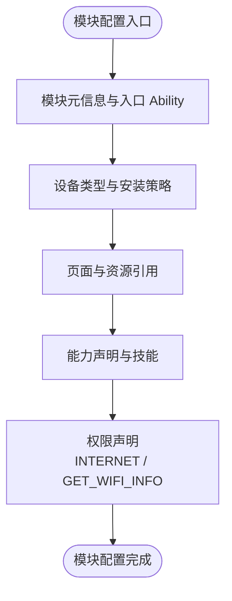
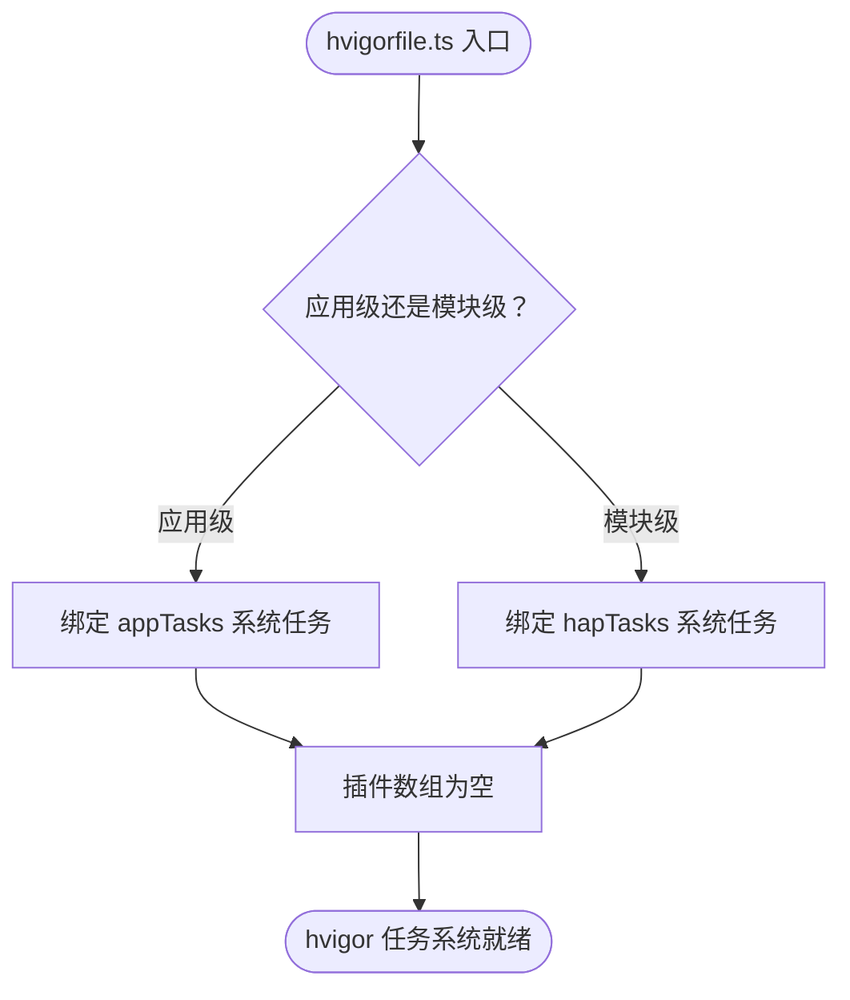
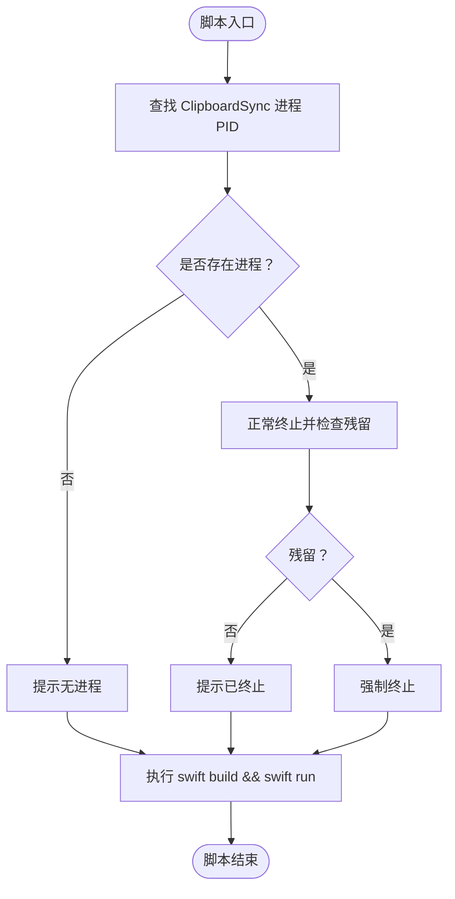
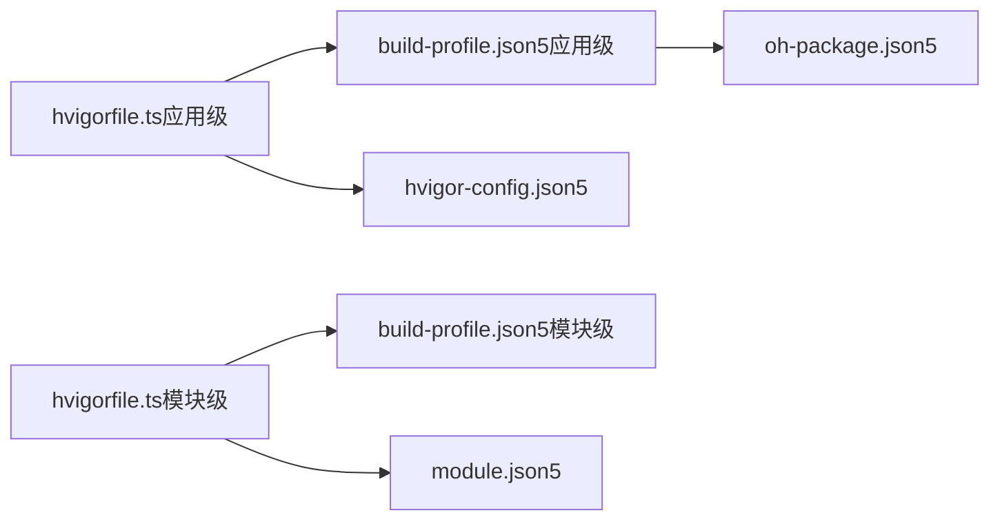

# 构建与部署

<cite>
**本文引用的文件**
- [Package.swift](file://ClipboardSync/mac/Package.swift)
- [kill_clipboard_sync.sh](file://ClipboardSync/mac/kill_clipboard_sync.sh)
- [build-profile.json5（应用级）](file://ClipboardSync/harmony/build-profile.json5)
- [hvigorfile.ts（应用级）](file://ClipboardSync/harmony/hvigorfile.ts)
- [build-profile.json5（模块级）](file://ClipboardSync/harmony/entry/build-profile.json5)
- [hvigorfile.ts（模块级）](file://ClipboardSync/harmony/entry/hvigorfile.ts)
- [module.json5](file://ClipboardSync/harmony/entry/src/main/module.json5)
- [oh-package.json5（应用级）](file://ClipboardSync/harmony/oh-package.json5)
- [hvigor-config.json5](file://ClipboardSync/harmony/hvigor/hvigor-config.json5)
- [PROJECT.md](file://ClipboardSync/PROJECT.md)
</cite>

## 目录
1. [简介](#简介)
2. [项目结构](#项目结构)
3. [核心组件](#核心组件)
4. [架构总览](#架构总览)
5. [详细组件分析](#详细组件分析)
6. [依赖关系分析](#依赖关系分析)
7. [性能考虑](#性能考虑)
8. [故障排查指南](#故障排查指南)
9. [结论](#结论)
10. [附录](#附录)

## 简介
本指南面向 Mac 端 Swift Package Manager 与鸿蒙端构建配置，涵盖依赖管理、构建设置、产品配置、模块权限声明、构建流程（清理、编译、打包、安装）、调试与发布差异、常见问题排查以及持续集成与自动化部署建议。目标是帮助开发者快速理解并稳定地完成本地构建与部署。

## 项目结构
项目采用“双端分离”的结构：
- Mac 端：Swift + SwiftUI，使用 Swift Package Manager（SPM）进行依赖与构建管理。
- 鸿蒙端：ArkTS + ArkUI，使用 HUAWEI DevEco Studio 6.1+，基于 hvigor 构建系统与 build-profile.json5、module.json5 等配置文件。

图表来源
- [Package.swift:1-18](file://ClipboardSync/mac/Package.swift#L1-L18)
- [kill_clipboard_sync.sh:1-24](file://ClipboardSync/mac/kill_clipboard_sync.sh#L1-L24)
- [hvigorfile.ts（应用级）:1-6](file://ClipboardSync/harmony/hvigorfile.ts#L1-L6)
- [build-profile.json5（应用级）:1-43](file://ClipboardSync/harmony/build-profile.json5#L1-L43)
- [hvigorfile.ts（模块级）:1-6](file://ClipboardSync/harmony/entry/hvigorfile.ts#L1-L6)
- [build-profile.json5（模块级）:1-14](file://ClipboardSync/harmony/entry/build-profile.json5#L1-L14)
- [module.json5:1-39](file://ClipboardSync/harmony/entry/src/main/module.json5#L1-L39)
- [oh-package.json5（应用级）:1-10](file://ClipboardSync/harmony/oh-package.json5#L1-L10)
- [hvigor-config.json5:1-5](file://ClipboardSync/harmony/hvigor/hvigor-config.json5#L1-L5)

章节来源
- [PROJECT.md:1-50](file://ClipboardSync/PROJECT.md#L1-L50)

## 核心组件
- Mac 端 SPM 配置：定义工具版本、平台要求、产品与目标、排除项等。
- 鸿蒙端应用级配置：签名配置、SDK 版本、产品配置、模块映射。
- 鸿蒙端模块级配置：API 类型、构建目标、输出产物名称。
- 模块权限声明：网络访问与 Wi-Fi 信息权限。
- hvigor 构建脚本：应用级与模块级任务系统绑定。
- 辅助脚本：Mac 端一键停止旧进程并重新运行。

章节来源
- [Package.swift:1-18](file://ClipboardSync/mac/Package.swift#L1-L18)
- [build-profile.json5（应用级）:1-43](file://ClipboardSync/harmony/build-profile.json5#L1-L43)
- [build-profile.json5（模块级）:1-14](file://ClipboardSync/harmony/entry/build-profile.json5#L1-L14)
- [module.json5:1-39](file://ClipboardSync/harmony/entry/src/main/module.json5#L1-L39)
- [hvigorfile.ts（应用级）:1-6](file://ClipboardSync/harmony/hvigorfile.ts#L1-L6)
- [hvigorfile.ts（模块级）:1-6](file://ClipboardSync/harmony/entry/hvigorfile.ts#L1-L6)
- [kill_clipboard_sync.sh:1-24](file://ClipboardSync/mac/kill_clipboard_sync.sh#L1-L24)

## 架构总览
下图展示从配置到产物的关键路径与职责分工。

图表来源
- [hvigorfile.ts（应用级）:1-6](file://ClipboardSync/harmony/hvigorfile.ts#L1-L6)
- [hvigorfile.ts（模块级）:1-6](file://ClipboardSync/harmony/entry/hvigorfile.ts#L1-L6)
- [build-profile.json5（应用级）:1-43](file://ClipboardSync/harmony/build-profile.json5#L1-L43)
- [build-profile.json5（模块级）:1-14](file://ClipboardSync/harmony/entry/build-profile.json5#L1-L14)
- [module.json5:1-39](file://ClipboardSync/harmony/entry/src/main/module.json5#L1-L39)

## 详细组件分析

### Mac 端：Swift Package Manager 配置
- 工具版本：明确使用 Swift 5.9 工具链。
- 平台要求：macOS 13+。
- 产品与目标：
  - 产品为可执行程序，命名为 ClipboardSync。
  - 目标为可执行目标，源码位于 ClipboardSync/ 目录，排除 Info.plist。
- 依赖管理：当前仓库未声明额外依赖，若后续引入第三方库，可在 targets 下添加依赖或在 products 中声明库产品。

图表来源
- [Package.swift:1-18](file://ClipboardSync/mac/Package.swift#L1-L18)

章节来源
- [Package.swift:1-18](file://ClipboardSync/mac/Package.swift#L1-L18)

### 鸿蒙端：应用级构建配置（build-profile.json5）
- 签名配置：包含默认签名材料（证书、别名、密码、签名算法、存储文件与密码）。
- 产品配置：定义默认产品，指定编译 SDK、兼容 SDK、运行时 OS 与目标 SDK 版本。
- 模块映射：将模块 entry 的构建产物应用到默认产品。

图表来源
- [build-profile.json5（应用级）:1-43](file://ClipboardSync/harmony/build-profile.json5#L1-L43)

章节来源
- [build-profile.json5（应用级）:1-43](file://ClipboardSync/harmony/build-profile.json5#L1-L43)

### 鸿蒙端：模块级构建配置（build-profile.json5）
- API 类型：stageMode。
- 构建选项：空对象，表示使用默认构建行为。
- 目标与输出：定义 default 目标，指定运行时 OS 与输出 artifact 名称。

图表来源
- [build-profile.json5（模块级）:1-14](file://ClipboardSync/harmony/entry/build-profile.json5#L1-L14)

章节来源
- [build-profile.json5（模块级）:1-14](file://ClipboardSync/harmony/entry/build-profile.json5#L1-L14)

### 鸿蒙端：模块权限与能力声明（module.json5）
- 模块元信息：模块名为 entry，类型为 entry，入口 Ability 为 EntryAbility。
- 设备类型：phone、tablet、2in1。
- 安装与页面：交付安装、非免安装、页面资源引用。
- 能力声明：包含 EntryAbility，含技能（home 入口）、图标、标签、启动窗口等。
- 权限声明：INTERNET 与 GET_WIFI_INFO 权限。

图表来源
- [module.json5:1-39](file://ClipboardSync/harmony/entry/src/main/module.json5#L1-L39)

章节来源
- [module.json5:1-39](file://ClipboardSync/harmony/entry/src/main/module.json5#L1-L39)

### 鸿蒙端：hvigor 构建脚本（hvigorfile.ts）
- 应用级：导入 appTasks，绑定系统任务，插件数组为空。
- 模块级：导入 hapTasks，绑定系统任务，插件数组为空。

图表来源
- [hvigorfile.ts（应用级）:1-6](file://ClipboardSync/harmony/hvigorfile.ts#L1-L6)
- [hvigorfile.ts（模块级）:1-6](file://ClipboardSync/harmony/entry/hvigorfile.ts#L1-L6)

章节来源
- [hvigorfile.ts（应用级）:1-6](file://ClipboardSync/harmony/hvigorfile.ts#L1-L6)
- [hvigorfile.ts（模块级）:1-6](file://ClipboardSync/harmony/entry/hvigorfile.ts#L1-L6)

### 鸿蒙端：oh-package.json5 与 hvigor-config.json5
- oh-package.json5：模型版本、名称、版本、描述、作者、许可证、依赖等基础元信息。
- hvigor-config.json5：模型版本与依赖配置（当前为空）。

章节来源
- [oh-package.json5（应用级）:1-10](file://ClipboardSync/harmony/oh-package.json5#L1-L10)
- [hvigor-config.json5:1-5](file://ClipboardSync/harmony/hvigor/hvigor-config.json5#L1-L5)

### Mac 端：辅助脚本（kill_clipboard_sync.sh）
- 功能：查找并终止所有 ClipboardSync 进程，检查残留后强制终止。
- 行为：最后执行 swift build 与 swift run，便于本地快速重启。

图表来源
- [kill_clipboard_sync.sh:1-24](file://ClipboardSync/mac/kill_clipboard_sync.sh#L1-L24)

章节来源
- [kill_clipboard_sync.sh:1-24](file://ClipboardSync/mac/kill_clipboard_sync.sh#L1-L24)

## 依赖关系分析
- Mac 端：SPM 仅管理自身可执行目标与源码组织，不涉及外部依赖。
- 鸿蒙端：hvigorfile.ts 将系统任务绑定到应用级与模块级；应用级 build-profile.json5 决定 SDK 版本与签名；模块级 build-profile.json5 决定目标与输出；module.json5 决定模块能力与权限；oh-package.json5 提供应用元信息；hvigor-config.json5 提供 hvigor 依赖配置。

图表来源
- [hvigorfile.ts（应用级）:1-6](file://ClipboardSync/harmony/hvigorfile.ts#L1-L6)
- [build-profile.json5（应用级）:1-43](file://ClipboardSync/harmony/build-profile.json5#L1-L43)
- [hvigorfile.ts（模块级）:1-6](file://ClipboardSync/harmony/entry/hvigorfile.ts#L1-L6)
- [build-profile.json5（模块级）:1-14](file://ClipboardSync/harmony/entry/build-profile.json5#L1-L14)
- [module.json5:1-39](file://ClipboardSync/harmony/entry/src/main/module.json5#L1-L39)
- [oh-package.json5（应用级）:1-10](file://ClipboardSync/harmony/oh-package.json5#L1-L10)
- [hvigor-config.json5:1-5](file://ClipboardSync/harmony/hvigor/hvigor-config.json5#L1-L5)

## 性能考虑
- 鸿蒙端 SDK 版本与兼容性：确保编译 SDK、兼容 SDK、目标 SDK 一致且为字符串类型，避免类型错误导致的构建失败。
- 模块输出命名：合理设置 artifact 名称，便于后续打包与分发。
- 权限最小化：仅声明必要权限（如网络与 Wi-Fi 信息），减少安全风险与运行时开销。
- hvigor 插件：当前插件数组为空，若需要自定义构建流程，可在 hvigorfile.ts 中扩展插件。

## 故障排查指南
- 鸿蒙端 SDK 版本类型错误
  - 症状：编译报错或构建失败。
  - 原因：compileSdkVersion 与 compatibleSdkVersion 必须为字符串类型。
  - 解决：使用形如 "6.1.0(23)" 的字符串值。
  - 参考：[PROJECT.md:116-121](file://ClipboardSync/PROJECT.md#L116-L121)

- 鸿蒙端 TCP 连接异常
  - 症状：Operation in progress 错误。
  - 原因：socket.close() 异步，旧 socket 未完全关闭即创建新连接。
  - 解决：断开旧客户端后再延迟创建新实例并连接。
  - 参考：[PROJECT.md:104-108](file://ClipboardSync/PROJECT.md#L104-L108)

- 鸿蒙端 socket.SocketErrorInfo 缺失
  - 症状：编译错误，找不到 SocketErrorInfo。
  - 原因：API 23 中 socket 模块未导出该类型。
  - 解决：改用 BusinessError（来自 @kit.BasicServicesKit）。
  - 参考：[PROJECT.md:110-114](file://ClipboardSync/PROJECT.md#L110-L114)

- Mac 端 SyncManager 未在启动时调用
  - 症状：应用启动后未自动开始同步。
  - 原因：仅在 UI 出现时调用，未在启动阶段初始化。
  - 解决：在 AppDelegate.applicationDidFinishLaunching 中直接调用。
  - 参考：[PROJECT.md:122-126](file://ClipboardSync/PROJECT.md#L122-L126)

- Mac 端 NWListener 默认监听 IPv6
  - 症状：lsof 显示为 IPv6，可能误导排查。
  - 说明：macOS 的 NWListener 监听 IPv6 时支持双栈，不影响连接。
  - 参考：[PROJECT.md:128-131](file://ClipboardSync/PROJECT.md#L128-L131)

- Mac 端进程残留
  - 建议：使用 kill_clipboard_sync.sh 清理残留进程后重新运行。
  - 参考：[kill_clipboard_sync.sh:1-24](file://ClipboardSync/mac/kill_clipboard_sync.sh#L1-L24)

章节来源
- [PROJECT.md:102-131](file://ClipboardSync/PROJECT.md#L102-L131)
- [kill_clipboard_sync.sh:1-24](file://ClipboardSync/mac/kill_clipboard_sync.sh#L1-L24)

## 结论
本指南梳理了 Mac 端 SPM 与鸿蒙端 hvigor 的关键配置与构建流程，并结合项目文档中的常见问题提供了针对性的排查建议。遵循本文档的配置与流程，可稳定完成本地构建与部署。

## 附录

### Mac 端构建与运行流程
- 进入 Mac 目录，执行构建与运行命令。
- 参考：[PROJECT.md:66-77](file://ClipboardSync/PROJECT.md#L66-L77)

章节来源
- [PROJECT.md:66-77](file://ClipboardSync/PROJECT.md#L66-L77)

### 鸿蒙端构建与安装流程
- 使用 DevEco Studio 6.1+ 打开 harmony 目录，连接真机，编译安装运行。
- 参考：[PROJECT.md:78-83](file://ClipboardSync/PROJECT.md#L78-L83)

章节来源
- [PROJECT.md:78-83](file://ClipboardSync/PROJECT.md#L78-L83)

### 调试与发布配置差异
- 调试：应用级签名配置指向调试密钥与证书，适合本地联调。
- 发布：应替换为正式签名材料与证书，确保产品签名合规。
- 参考：[build-profile.json5（应用级）:1-43](file://ClipboardSync/harmony/build-profile.json5#L1-L43)

章节来源
- [build-profile.json5（应用级）:1-43](file://ClipboardSync/harmony/build-profile.json5#L1-L43)

### 持续集成与自动化部署建议
- Mac 端：在 CI 环境中安装 Swift 5.9+，执行 swift build 与测试命令，产出可执行文件用于分发或集成测试。
- 鸿蒙端：在 CI 环境中安装 DevEco Studio 6.1+，使用 hvigor 命令进行构建与打包，结合签名配置生成发布包。
- 权限与签名：在 CI 中妥善管理证书与密钥，避免泄露；使用受控的签名配置文件。
- 自动化脚本：可复用 kill_clipboard_sync.sh 的思路，在 CI 中清理残留进程并执行构建与运行。