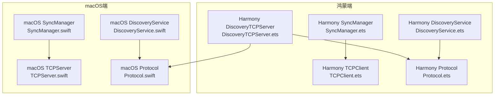
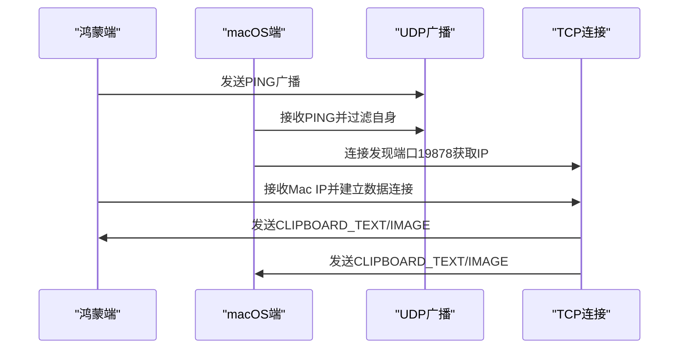
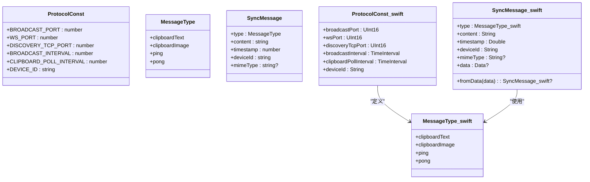
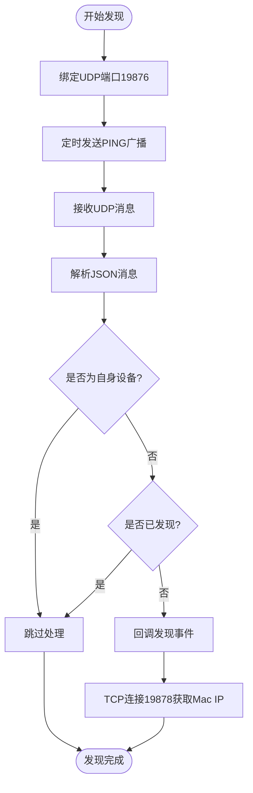
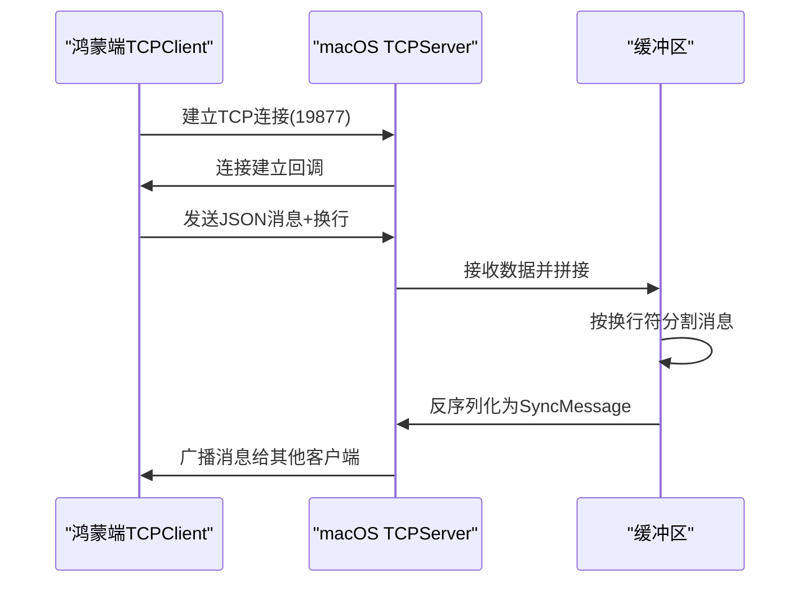
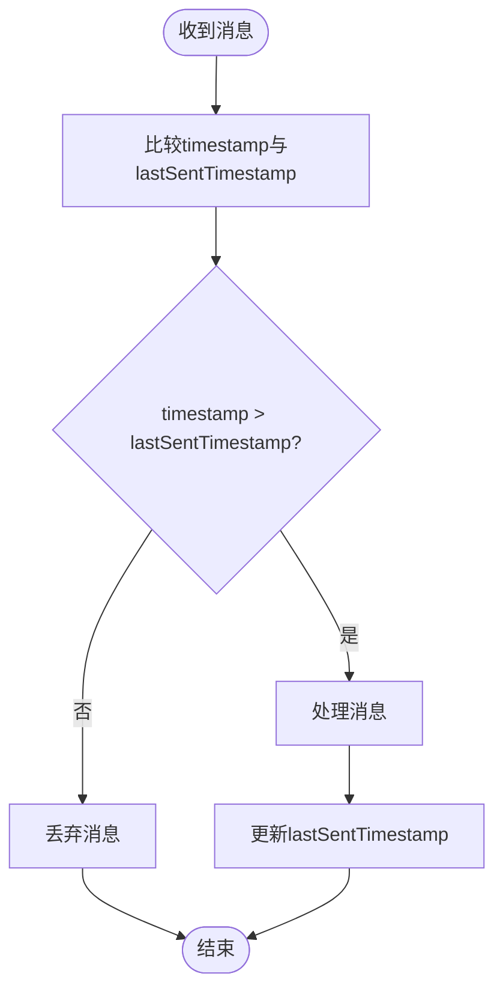
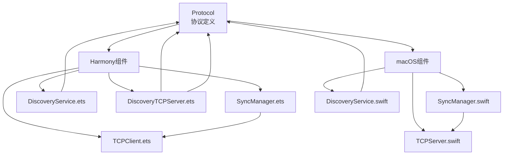

# 通信协议规范

<cite>
**本文档引用的文件**
- [Protocol.ets](file://ClipboardSync/harmony/entry/src/main/ets/common/Protocol.ets)
- [Protocol.swift](file://ClipboardSync/mac/ClipboardSync/Protocol.swift)
- [DiscoveryService.ets](file://ClipboardSync/harmony/entry/src/main/ets/common/DiscoveryService.ets)
- [DiscoveryService.swift](file://ClipboardSync/mac/ClipboardSync/DiscoveryService.swift)
- [TCPClient.ets](file://ClipboardSync/harmony/entry/src/main/ets/common/TCPClient.ets)
- [TCPServer.swift](file://ClipboardSync/mac/ClipboardSync/TCPServer.swift)
- [SyncManager.ets](file://ClipboardSync/harmony/entry/src/main/ets/model/SyncManager.ets)
- [SyncManager.swift](file://ClipboardSync/mac/ClipboardSync/SyncManager.swift)
- [DiscoveryTCPServer.ets](file://ClipboardSync/harmony/entry/src/main/ets/common/DiscoveryTCPServer.ets)
</cite>

## 目录
1. [简介](#简介)
2. [项目结构](#项目结构)
3. [核心组件](#核心组件)
4. [架构总览](#架构总览)
5. [详细组件分析](#详细组件分析)
6. [依赖关系分析](#依赖关系分析)
7. [性能考虑](#性能考虑)
8. [故障排除指南](#故障排除指南)
9. [结论](#结论)
10. [附录](#附录)

## 简介
本规范文档基于两端共享的Protocol实现，详细说明通信协议的消息格式、端口分配、去重防环机制、序列化与反序列化实现，并提供协议版本兼容性说明与扩展指南。协议采用JSON作为消息载体，通过UDP广播进行设备发现，通过TCP进行可靠的数据传输。

## 项目结构
项目采用跨平台架构，两端分别实现相同的协议接口：
- 鸿蒙端（ArkTS）：位于 `ClipboardSync/harmony/entry/src/main/ets/`
- macOS端（Swift）：位于 `ClipboardSync/mac/ClipboardSync/`

**图表来源**
- [SyncManager.ets:26-301](file://ClipboardSync/harmony/entry/src/main/ets/model/SyncManager.ets#L26-L301)
- [SyncManager.swift:5-154](file://ClipboardSync/mac/ClipboardSync/SyncManager.swift#L5-L154)
- [DiscoveryService.ets:10-161](file://ClipboardSync/harmony/entry/src/main/ets/common/DiscoveryService.ets#L10-L161)
- [DiscoveryService.swift:6-197](file://ClipboardSync/mac/ClipboardSync/DiscoveryService.swift#L6-L197)
- [TCPClient.ets:11-181](file://ClipboardSync/harmony/entry/src/main/ets/common/TCPClient.ets#L11-L181)
- [TCPServer.swift:6-174](file://ClipboardSync/mac/ClipboardSync/TCPServer.swift#L6-L174)
- [DiscoveryTCPServer.ets:11-80](file://ClipboardSync/harmony/entry/src/main/ets/common/DiscoveryTCPServer.ets#L11-L80)
- [Protocol.ets:1-27](file://ClipboardSync/harmony/entry/src/main/ets/common/Protocol.ets#L1-L27)
- [Protocol.swift:3-43](file://ClipboardSync/mac/ClipboardSync/Protocol.swift#L3-L43)

**章节来源**
- [SyncManager.ets:26-301](file://ClipboardSync/harmony/entry/src/main/ets/model/SyncManager.ets#L26-L301)
- [SyncManager.swift:5-154](file://ClipboardSync/mac/ClipboardSync/SyncManager.swift#L5-L154)

## 核心组件
本协议的核心由以下组件构成：
- 协议常量与消息类型定义：两端共享的Protocol实现，定义端口、设备ID、消息类型枚举及消息结构体
- 设备发现服务：通过UDP广播实现设备发现，两端均实现
- TCP传输层：两端分别实现客户端与服务端，负责可靠数据传输
- 同步管理器：协调设备发现、连接建立、剪贴板监控与消息收发

**章节来源**
- [Protocol.ets:1-27](file://ClipboardSync/harmony/entry/src/main/ets/common/Protocol.ets#L1-L27)
- [Protocol.swift:3-43](file://ClipboardSync/mac/ClipboardSync/Protocol.swift#L3-L43)

## 架构总览
协议采用“发现-连接-传输”的三层架构：
- 发现阶段：两端通过UDP广播交换设备ID，实现局域网内设备发现
- 连接阶段：建立TCP连接，解决UDP广播在某些网络环境下的可达性问题
- 传输阶段：通过TCP可靠传输剪贴板内容，支持文本与图片

**图表来源**
- [DiscoveryService.ets:97-124](file://ClipboardSync/harmony/entry/src/main/ets/common/DiscoveryService.ets#L97-L124)
- [DiscoveryService.swift:104-146](file://ClipboardSync/mac/ClipboardSync/DiscoveryService.swift#L104-L146)
- [DiscoveryTCPServer.ets:61-78](file://ClipboardSync/harmony/entry/src/main/ets/common/DiscoveryTCPServer.ets#L61-L78)
- [TCPClient.ets:30-58](file://ClipboardSync/harmony/entry/src/main/ets/common/TCPClient.ets#L30-L58)
- [TCPServer.swift:75-97](file://ClipboardSync/mac/ClipboardSync/TCPServer.swift#L75-L97)

## 详细组件分析

### 协议常量与消息格式
两端共享的协议常量与消息结构定义如下：
- 端口分配：
  - 广播端口：19876（用于设备发现）
  - 数据传输端口：19877（用于剪贴板数据传输）
  - 发现TCP端口：19878（用于Mac向鸿蒙端暴露IP）
- 设备ID：两端各自生成唯一设备标识
- 消息类型：
  - clipboardText：剪贴板文本
  - clipboardImage：剪贴板图片
  - ping：设备发现探测
  - pong：设备发现响应
- 消息结构：
  - type：消息类型
  - content：消息内容（文本或Base64图片）
  - timestamp：时间戳（秒级）
  - deviceId：发送方设备ID
  - mimeType：可选的媒体类型（text/plain或image/png）

**图表来源**
- [Protocol.ets:2-27](file://ClipboardSync/harmony/entry/src/main/ets/common/Protocol.ets#L2-L27)
- [Protocol.swift:4-43](file://ClipboardSync/mac/ClipboardSync/Protocol.swift#L4-L43)

**章节来源**
- [Protocol.ets:1-27](file://ClipboardSync/harmony/entry/src/main/ets/common/Protocol.ets#L1-L27)
- [Protocol.swift:3-43](file://ClipboardSync/mac/ClipboardSync/Protocol.swift#L3-L43)

### 设备发现机制
设备发现通过UDP广播实现，两端均实现：
- 发送PING广播：周期性发送包含设备ID的PING消息
- 接收处理：解析JSON消息，过滤自身设备，去重回调
- TCP发现：Mac端通过连接19878端口向鸿蒙端暴露其IP地址

**图表来源**
- [DiscoveryService.ets:25-161](file://ClipboardSync/harmony/entry/src/main/ets/common/DiscoveryService.ets#L25-L161)
- [DiscoveryService.swift:15-100](file://ClipboardSync/mac/ClipboardSync/DiscoveryService.swift#L15-L100)
- [DiscoveryTCPServer.ets:18-78](file://ClipboardSync/harmony/entry/src/main/ets/common/DiscoveryTCPServer.ets#L18-L78)

**章节来源**
- [DiscoveryService.ets:10-161](file://ClipboardSync/harmony/entry/src/main/ets/common/DiscoveryService.ets#L10-L161)
- [DiscoveryService.swift:6-197](file://ClipboardSync/mac/ClipboardSync/DiscoveryService.swift#L6-L197)
- [DiscoveryTCPServer.ets:11-80](file://ClipboardSync/harmony/entry/src/main/ets/common/DiscoveryTCPServer.ets#L11-L80)

### TCP传输机制
数据传输通过TCP实现，两端分别承担客户端与服务端角色：
- 鸿蒙端：TCP客户端，连接macOS端服务端
- macOS端：TCP服务端，监听数据端口并广播消息
- 消息帧格式：每条JSON消息以换行符结尾，解决TCP粘包问题

**图表来源**
- [TCPClient.ets:30-146](file://ClipboardSync/harmony/entry/src/main/ets/common/TCPClient.ets#L30-L146)
- [TCPServer.swift:60-148](file://ClipboardSync/mac/ClipboardSync/TCPServer.swift#L60-L148)

**章节来源**
- [TCPClient.ets:11-181](file://ClipboardSync/harmony/entry/src/main/ets/common/TCPClient.ets#L11-L181)
- [TCPServer.swift:6-174](file://ClipboardSync/mac/ClipboardSync/TCPServer.swift#L6-L174)

### 去重防环机制
协议通过时间戳实现去重防环：
- 发送端：每次发送前生成当前时间戳，记录为lastSentTimestamp
- 接收端：收到消息后与本地lastSentTimestamp比较，若<=则丢弃
- 作用：防止消息回环传播，确保消息只被处理一次

**图表来源**
- [SyncManager.ets:178-198](file://ClipboardSync/harmony/entry/src/main/ets/model/SyncManager.ets#L178-L198)
- [SyncManager.swift:95-115](file://ClipboardSync/mac/ClipboardSync/SyncManager.swift#L95-L115)

**章节来源**
- [SyncManager.ets:178-198](file://ClipboardSync/harmony/entry/src/main/ets/model/SyncManager.ets#L178-L198)
- [SyncManager.swift:95-115](file://ClipboardSync/mac/ClipboardSync/SyncManager.swift#L95-L115)

### 序列化与反序列化
两端均采用JSON进行消息序列化：
- 鸿蒙端：使用JSON.stringify发送，JSON.parse接收
- macOS端：使用JSONEncoder/JSONDecoder进行编码解码
- Swift端还提供了便捷方法fromData进行解码

**章节来源**
- [TCPClient.ets:44-58](file://ClipboardSync/harmony/entry/src/main/ets/common/TCPClient.ets#L44-L58)
- [TCPServer.swift:60-67](file://ClipboardSync/mac/ClipboardSync/TCPServer.swift#L60-L67)
- [Protocol.swift:35-42](file://ClipboardSync/mac/ClipboardSync/Protocol.swift#L35-L42)

## 依赖关系分析
协议组件之间的依赖关系如下：

**图表来源**
- [SyncManager.ets:26-301](file://ClipboardSync/harmony/entry/src/main/ets/model/SyncManager.ets#L26-L301)
- [SyncManager.swift:5-154](file://ClipboardSync/mac/ClipboardSync/SyncManager.swift#L5-L154)
- [Protocol.ets:1-27](file://ClipboardSync/harmony/entry/src/main/ets/common/Protocol.ets#L1-L27)
- [Protocol.swift:3-43](file://ClipboardSync/mac/ClipboardSync/Protocol.swift#L3-L43)

**章节来源**
- [SyncManager.ets:26-301](file://ClipboardSync/harmony/entry/src/main/ets/model/SyncManager.ets#L26-L301)
- [SyncManager.swift:5-154](file://ClipboardSync/mac/ClipboardSync/SyncManager.swift#L5-L154)

## 性能考虑
- 广播频率：两端均设置3秒广播间隔，平衡发现速度与网络负载
- 轮询间隔：剪贴板轮询间隔为0.5秒，避免频繁读取系统资源
- TCP粘包处理：通过换行符分帧，减少内存拷贝与解析开销
- 去重优化：基于时间戳的快速比较，避免复杂哈希计算

## 故障排除指南
常见问题与解决方案：
- 连接失败：检查端口是否被占用，确认防火墙设置
- 发现不到设备：验证UDP广播权限，检查网络路由配置
- 消息重复：确认两端时间戳同步，检查去重逻辑
- 图片传输异常：验证Base64编码完整性，检查mimeType设置

**章节来源**
- [TCPClient.ets:74-90](file://ClipboardSync/harmony/entry/src/main/ets/common/TCPClient.ets#L74-L90)
- [TCPServer.swift:151-156](file://ClipboardSync/mac/ClipboardSync/TCPServer.swift#L151-L156)

## 结论
本协议通过标准化的消息格式、明确的端口分配和完善的去重机制，实现了跨平台的剪贴板同步功能。两端在保持协议一致性的同时，针对平台特性进行了优化，确保了协议的可靠性与可维护性。

## 附录

### 端口分配说明
- 19876：UDP广播端口，用于设备发现
- 19877：TCP数据传输端口，用于剪贴板数据同步
- 19878：TCP发现端口，用于Mac向鸿蒙端暴露IP

### 协议版本兼容性
- 两端共享同一Protocol定义，确保消息格式一致
- Swift端使用Codable协议，鸿蒙端使用JSON标准库
- 版本升级时需保持消息字段向后兼容

### 协议扩展指南
新增消息类型的步骤：
1. 在MessageType中添加新类型
2. 在SyncMessage中添加对应字段
3. 在两端实现序列化/反序列化逻辑
4. 更新去重与处理逻辑
5. 测试兼容性与向后兼容性

**章节来源**
- [Protocol.ets:11-26](file://ClipboardSync/harmony/entry/src/main/ets/common/Protocol.ets#L11-L26)
- [Protocol.swift:19-34](file://ClipboardSync/mac/ClipboardSync/Protocol.swift#L19-L34)