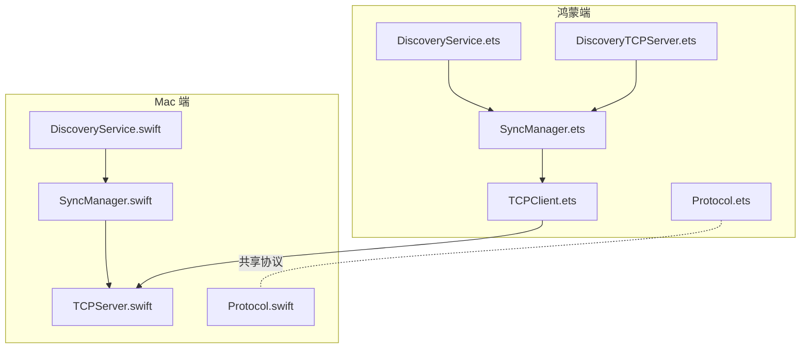
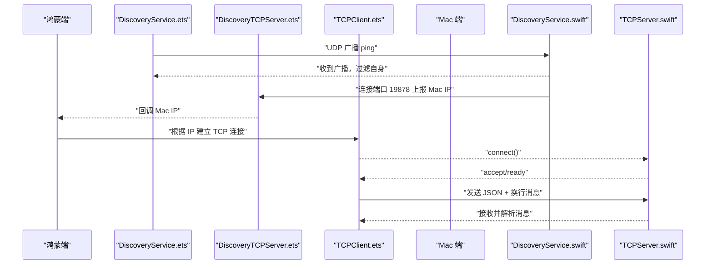
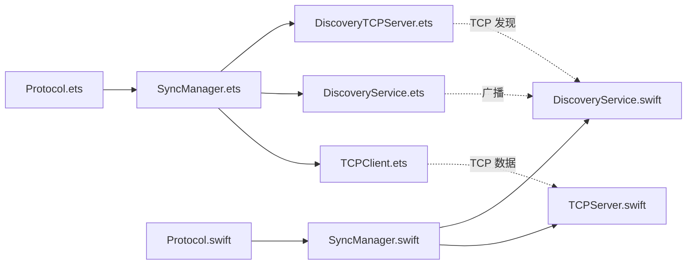

# 已知问题

<cite>
**本文引用的文件**
- [TCPClient.ets](file://ClipboardSync/harmony/entry/src/main/ets/common/TCPClient.ets)
- [DiscoveryTCPServer.ets](file://ClipboardSync/harmony/entry/src/main/ets/common/DiscoveryTCPServer.ets)
- [SyncManager.ets](file://ClipboardSync/harmony/entry/src/main/ets/model/SyncManager.ets)
- [DiscoveryService.ets](file://ClipboardSync/harmony/entry/src/main/ets/common/DiscoveryService.ets)
- [Protocol.ets](file://ClipboardSync/harmony/entry/src/main/ets/common/Protocol.ets)
- [TCPServer.swift](file://ClipboardSync/mac/ClipboardSync/TCPServer.swift)
- [SyncManager.swift](file://ClipboardSync/mac/ClipboardSync/SyncManager.swift)
- [DiscoveryService.swift](file://ClipboardSync/mac/ClipboardSync/DiscoveryService.swift)
- [Protocol.swift](file://ClipboardSync/mac/ClipboardSync/Protocol.swift)
- [build-profile.json5（鸿蒙）](file://ClipboardSync/harmony/entry/build-profile.json5)
- [Info.plist（Mac）](file://ClipboardSync/mac/ClipboardSync/Info.plist)
- [PROJECT.md](file://ClipboardSync/PROJECT.md)
</cite>

## 目录
1. [简介](#简介)
2. [项目结构](#项目结构)
3. [核心组件](#核心组件)
4. [架构总览](#架构总览)
5. [详细问题分析](#详细问题分析)
6. [依赖关系分析](#依赖关系分析)
7. [性能考量](#性能考量)
8. [故障排查指南](#故障排查指南)
9. [结论](#结论)
10. [附录](#附录)

## 简介
本文件汇总 ClipboardSync 项目在开发与集成过程中遇到的已知问题，并提供根本原因、影响范围、解决方法、预防措施、严重程度分级（P0/P1/P2）、优先级安排、临时方案与长期修复计划，以及面向开发者的排查思路与方法。内容基于仓库现有源码与文档进行整理。

## 项目结构
项目采用“Mac 端 Swift + 鸿蒙端 ArkTS”的双端架构，通过 UDP 广播进行设备发现，随后建立 TCP 长连接进行文本同步；图片同步具备基础框架，尚未实现完整闭环。

图表来源
- [SyncManager.ets:26-301](file://ClipboardSync/harmony/entry/src/main/ets/model/SyncManager.ets#L26-L301)
- [TCPClient.ets:11-181](file://ClipboardSync/harmony/entry/src/main/ets/common/TCPClient.ets#L11-L181)
- [DiscoveryService.ets:10-161](file://ClipboardSync/harmony/entry/src/main/ets/common/DiscoveryService.ets#L10-L161)
- [DiscoveryTCPServer.ets:11-80](file://ClipboardSync/harmony/entry/src/main/ets/common/DiscoveryTCPServer.ets#L11-L80)
- [Protocol.ets:1-27](file://ClipboardSync/harmony/entry/src/main/ets/common/Protocol.ets#L1-L27)
- [SyncManager.swift:5-154](file://ClipboardSync/mac/ClipboardSync/SyncManager.swift#L5-L154)
- [DiscoveryService.swift:6-197](file://ClipboardSync/mac/ClipboardSync/DiscoveryService.swift#L6-L197)
- [TCPServer.swift:6-174](file://ClipboardSync/mac/ClipboardSync/TCPServer.swift#L6-L174)
- [Protocol.swift:3-43](file://ClipboardSync/mac/ClipboardSync/Protocol.swift#L3-L43)

章节来源
- [PROJECT.md:5-50](file://ClipboardSync/PROJECT.md#L5-L50)

## 核心组件
- 鸿蒙端
  - 设备发现（UDP 广播）：DiscoveryService.ets
  - TCP 客户端：TCPClient.ets
  - 发现 TCP 服务端（被动获取 Mac IP）：DiscoveryTCPServer.ets
  - 协调器：SyncManager.ets
  - 协议常量与消息结构：Protocol.ets
- Mac 端
  - 设备发现（BSD Socket + NWUDP）：DiscoveryService.swift
  - TCP 服务端（NWListener）：TCPServer.swift
  - 协调器：SyncManager.swift
  - 协议常量与消息结构：Protocol.swift
- 配置
  - 鸿蒙构建配置：build-profile.json5（鸿蒙）
  - Mac 应用清单：Info.plist（Mac）

章节来源
- [SyncManager.ets:26-301](file://ClipboardSync/harmony/entry/src/main/ets/model/SyncManager.ets#L26-L301)
- [TCPClient.ets:11-181](file://ClipboardSync/harmony/entry/src/main/ets/common/TCPClient.ets#L11-L181)
- [DiscoveryService.ets:10-161](file://ClipboardSync/harmony/entry/src/main/ets/common/DiscoveryService.ets#L10-L161)
- [DiscoveryTCPServer.ets:11-80](file://ClipboardSync/harmony/entry/src/main/ets/common/DiscoveryTCPServer.ets#L11-L80)
- [Protocol.ets:1-27](file://ClipboardSync/harmony/entry/src/main/ets/common/Protocol.ets#L1-L27)
- [SyncManager.swift:5-154](file://ClipboardSync/mac/ClipboardSync/SyncManager.swift#L5-L154)
- [DiscoveryService.swift:6-197](file://ClipboardSync/mac/ClipboardSync/DiscoveryService.swift#L6-L197)
- [TCPServer.swift:6-174](file://ClipboardSync/mac/ClipboardSync/TCPServer.swift#L6-L174)
- [Protocol.swift:3-43](file://ClipboardSync/mac/ClipboardSync/Protocol.swift#L3-L43)
- [build-profile.json5（鸿蒙）:1-14](file://ClipboardSync/harmony/entry/build-profile.json5#L1-L14)
- [Info.plist（Mac）:1-32](file://ClipboardSync/mac/ClipboardSync/Info.plist#L1-L32)

## 架构总览
- 通信层
  - 设备发现：UDP 广播端口 19876，双方周期性发送 ping 广播，互相感知在线状态。
  - 数据传输：TCP 端口 19877，鸿蒙端主动连接 Mac 端，消息以 JSON + 换行分隔，按行解析。
  - 发现 TCP：端口 19878，Mac 通过该端口向鸿蒙上报其 IP，解决 UDP 无法从 Mac 到达鸿蒙的问题。
- 去重与回环防护：消息携带时间戳，接收端仅处理大于 lastSentTimestamp 的消息，避免写入剪贴板后触发监听回环。
- 状态与历史：两端均维护状态、连接目标、最近同步时间与历史记录。

图表来源
- [DiscoveryService.ets:25-161](file://ClipboardSync/harmony/entry/src/main/ets/common/DiscoveryService.ets#L25-L161)
- [DiscoveryTCPServer.ets:18-79](file://ClipboardSync/harmony/entry/src/main/ets/common/DiscoveryTCPServer.ets#L18-L79)
- [TCPClient.ets:30-113](file://ClipboardSync/harmony/entry/src/main/ets/common/TCPClient.ets#L30-L113)
- [DiscoveryService.swift:33-100](file://ClipboardSync/mac/ClipboardSync/DiscoveryService.swift#L33-L100)
- [TCPServer.swift:23-51](file://ClipboardSync/mac/ClipboardSync/TCPServer.swift#L23-L51)

## 详细问题分析

### 问题一：鸿蒙端 TCP 连接“Operation in progress”（代码错误码 2301115）
- 严重程度：P0
- 影响范围：连接建立阶段频繁失败，导致无法建立数据通道，文本同步中断。
- 根本原因：socket.close() 是异步操作，旧 socket 尚未完全释放，新连接即刻发起，系统拒绝。
- 具体定位
  - 鸿蒙端 TCP 客户端在断开旧连接后立即创建新实例并尝试 connect，未等待旧 socket 完全关闭。
  - 代码路径参考：[TCPClient.ets:37-42](file://ClipboardSync/harmony/entry/src/main/ets/common/TCPClient.ets#L37-L42)、[SyncManager.ets:129-174](file://ClipboardSync/harmony/entry/src/main/ets/model/SyncManager.ets#L129-L174)
- 解决方案
  - 在断开旧连接后，延迟一段时间（例如 500ms）再创建新实例并发起连接，确保旧 socket 生命周期结束。
  - 已在协调器中实现：先 disconnect() 旧实例，保留旧实例引用，延迟 500ms 后再 connect() 新实例。
- 临时方案
  - 手动降低重连频率，或在 UI 层增加“稍后再试”按钮，避免快速重试。
- 长期修复计划
  - 在 TCPClient 内部引入连接状态机与队列，统一串行化 connect/close 操作，避免竞态。
  - 引入连接超时与幂等判断，避免重复创建实例。
- 预防措施
  - 在断开流程中显式设置“正在关闭”标志位，禁止在关闭期间发起新连接。
  - 对外暴露“可连接”状态查询，UI 层根据状态禁用/启用连接按钮。
- 优先级安排：P0（必须立即修复）

章节来源
- [PROJECT.md:102-121](file://ClipboardSync/PROJECT.md#L102-L121)
- [TCPClient.ets:37-42](file://ClipboardSync/harmony/entry/src/main/ets/common/TCPClient.ets#L37-L42)
- [SyncManager.ets:129-174](file://ClipboardSync/harmony/entry/src/main/ets/model/SyncManager.ets#L129-L174)

### 问题二：鸿蒙端 socket.SocketErrorInfo 不存在
- 严重程度：P1
- 影响范围：类型定义缺失导致 on('error') 回调参数类型不匹配，编译或运行时可能出现类型错误。
- 根本原因：API 23 中 @kit.NetworkKit 的 socket 模块未导出 SocketErrorInfo 类型。
- 具体定位
  - 错误回调参数类型应使用 BusinessError（来自 @kit.BasicServicesKit）。
  - 代码路径参考：[TCPClient.ets:83-90](file://ClipboardSync/harmony/entry/src/main/ets/common/TCPClient.ets#L83-L90)、[DiscoveryTCPServer.ets:42-44](file://ClipboardSync/harmony/entry/src/main/ets/common/DiscoveryTCPServer.ets#L42-L44)
- 解决方案
  - 将错误回调参数类型从 socket.SocketErrorInfo 替换为 BusinessError。
- 临时方案
  - 在回调中使用 any 或 unknown 类型接收错误对象，再自行判断结构。
- 长期修复计划
  - 在后续 SDK 版本中补齐类型导出，或通过官方文档明确替代类型。
- 预防措施
  - 在接入新 Kit/API 时，先查阅对应版本的类型导出清单，避免依赖未导出的内部类型。
- 优先级安排：P1（尽快修复）

章节来源
- [PROJECT.md:110-115](file://ClipboardSync/PROJECT.md#L110-L115)
- [TCPClient.ets:83-90](file://ClipboardSync/harmony/entry/src/main/ets/common/TCPClient.ets#L83-L90)
- [DiscoveryTCPServer.ets:42-44](file://ClipboardSync/harmony/entry/src/main/ets/common/DiscoveryTCPServer.ets#L42-L44)

### 问题三：Mac 端 build-profile.json5 SDK 版本类型错误
- 严重程度：P1
- 影响范围：构建失败或运行时异常，无法正常启动应用。
- 根本原因：compileSdkVersion 与 compatibleSdkVersion 必须为字符串类型，不能为数字。
- 具体定位
  - 鸿蒙端构建配置中 SDK 版本使用了数字而非字符串，导致解析错误。
  - 代码路径参考：[build-profile.json5（鸿蒙）:1-14](file://ClipboardSync/harmony/entry/build-profile.json5#L1-L14)
- 解决方案
  - 将 SDK 版本改为字符串形式，如 "6.1.0(23)"。
- 临时方案
  - 临时回退到上一个可用版本的配置，或在 IDE 中手动修正。
- 长期修复计划
  - 在 CI 中加入 JSON5 Schema 校验，强制字段类型一致。
- 预防措施
  - 在团队规范中明确 SDK 版本字段类型要求，并纳入 PR 检查项。
- 优先级安排：P1（尽快修复）

章节来源
- [PROJECT.md:116-121](file://ClipboardSync/PROJECT.md#L116-L121)
- [build-profile.json5（鸿蒙）:1-14](file://ClipboardSync/harmony/entry/build-profile.json5#L1-L14)

### 问题四：Mac 端 SyncManager.start() 未在启动时调用
- 严重程度：P1
- 影响范围：应用启动后未自动开始发现与监听，需要用户手动触发 UI 才能开始工作。
- 根本原因：最初仅在 UI 出现时调用 start()，而 UI 需要用户点击菜单栏图标才会出现。
- 具体定位
  - AppDelegate.applicationDidFinishLaunching 中未直接调用 SyncManager.start()。
  - 代码路径参考：[SyncManager.swift:40-45](file://ClipboardSync/mac/ClipboardSync/SyncManager.swift#L40-L45)
- 解决方案
  - 在 AppDelegate.applicationDidFinishLaunching 中直接调用 start()，确保应用启动即开始工作。
- 临时方案
  - 在 UI 中增加“启动时自动开始”的选项，或在首次打开面板时自动触发。
- 长期修复计划
  - 将启动逻辑集中到应用生命周期钩子中，避免分散调用。
- 预防措施
  - 在应用入口处统一初始化所有服务，避免遗漏。
- 优先级安排：P1（尽快修复）

章节来源
- [PROJECT.md:122-127](file://ClipboardSync/PROJECT.md#L122-L127)
- [SyncManager.swift:40-45](file://ClipboardSync/mac/ClipboardSync/SyncManager.swift#L40-L45)

### 问题五：Mac 端 NWListener 默认监听 IPv6
- 严重程度：P2
- 影响范围：仅影响诊断与日志观察，实际连接不受影响，但 lsof 显示可能误导排查。
- 根本原因：NWListener 在 macOS 上默认监听 IPv6，但同时支持双栈（IPv4+IPv6），实际不影响连接。
- 具体定位
  - TCPServer.start() 中创建 NWListener，默认行为为 IPv6 监听。
  - 代码路径参考：[TCPServer.swift:23-51](file://ClipboardSync/mac/ClipboardSync/TCPServer.swift#L23-L51)
- 解决方案
  - 在日志与诊断信息中明确说明 IPv6 监听但支持双栈，避免误解。
- 临时方案
  - 在排查时同时查看 IPv4/IPv6 监听状态，确认连接是否可达。
- 长期修复计划
  - 在后续版本中提供显式族选择（如需），或在日志中更清晰标注当前监听族。
- 预防措施
  - 在网络组件文档中明确默认监听族与兼容性说明。
- 优先级安排：P2（后续优化）

章节来源
- [PROJECT.md:128-132](file://ClipboardSync/PROJECT.md#L128-L132)
- [TCPServer.swift:23-51](file://ClipboardSync/mac/ClipboardSync/TCPServer.swift#L23-L51)

## 依赖关系分析
- 两端协议与消息结构保持一致，确保互通性。
- 鸿蒙端依赖 NetworkKit 的 socket 与 BasicServicesKit 的 BusinessError；Mac 端依赖 Network 与 Foundation。
- 发现流程中，Mac 端通过 BSD Socket 监听 UDP 广播，同时发起一次短连接到端口 19878 以传递 Mac IP；鸿蒙端通过 DiscoveryTCPServer 接收并回调给协调器。

图表来源
- [Protocol.ets:1-27](file://ClipboardSync/harmony/entry/src/main/ets/common/Protocol.ets#L1-L27)
- [SyncManager.ets:26-301](file://ClipboardSync/harmony/entry/src/main/ets/model/SyncManager.ets#L26-L301)
- [TCPClient.ets:11-181](file://ClipboardSync/harmony/entry/src/main/ets/common/TCPClient.ets#L11-L181)
- [DiscoveryService.ets:10-161](file://ClipboardSync/harmony/entry/src/main/ets/common/DiscoveryService.ets#L10-L161)
- [DiscoveryTCPServer.ets:11-80](file://ClipboardSync/harmony/entry/src/main/ets/common/DiscoveryTCPServer.ets#L11-L80)
- [Protocol.swift:3-43](file://ClipboardSync/mac/ClipboardSync/Protocol.swift#L3-L43)
- [SyncManager.swift:5-154](file://ClipboardSync/mac/ClipboardSync/SyncManager.swift#L5-L154)
- [TCPServer.swift:6-174](file://ClipboardSync/mac/ClipboardSync/TCPServer.swift#L6-L174)
- [DiscoveryService.swift:6-197](file://ClipboardSync/mac/ClipboardSync/DiscoveryService.swift#L6-L197)

## 性能考量
- UDP 广播间隔与去重策略：广播间隔过短会增加网络负载，过长则影响发现速度；当前两端均采用固定间隔，建议根据网络环境动态调整。
- TCP 粘包处理：两端均采用换行符分隔消息，解析逻辑简单高效；建议在高并发场景下增加最大帧长度限制与异常丢弃策略。
- 轮询与事件驱动：剪贴板轮询间隔较短，建议结合系统事件回调（如可用）减少无效轮询。
- 连接池与重连退避：当前采用固定 5 秒重连，建议引入指数退避与抖动，避免雪崩效应。

## 故障排查指南
- 连接失败（Operation in progress）
  - 现象：connect() 抛错或立即断开。
  - 排查步骤
    - 检查旧连接是否已完全关闭（isActive 标志、定时器清理）。
    - 确认延迟连接的时间是否足够（建议 ≥ 500ms）。
    - 查看错误码与日志，确认是否为“操作正在进行”类错误。
  - 参考路径
    - [TCPClient.ets:148-174](file://ClipboardSync/harmony/entry/src/main/ets/common/TCPClient.ets#L148-L174)
    - [SyncManager.ets:129-174](file://ClipboardSync/harmony/entry/src/main/ets/model/SyncManager.ets#L129-L174)
- 错误类型不匹配（SocketErrorInfo 不存在）
  - 现象：编译或运行时报错，提示类型不存在。
  - 排查步骤
    - 将错误回调参数类型替换为 BusinessError。
    - 确认导入模块正确。
  - 参考路径
    - [TCPClient.ets:83-90](file://ClipboardSync/harmony/entry/src/main/ets/common/TCPClient.ets#L83-L90)
    - [DiscoveryTCPServer.ets:42-44](file://ClipboardSync/harmony/entry/src/main/ets/common/DiscoveryTCPServer.ets#L42-L44)
- 构建失败（SDK 版本类型错误）
  - 现象：构建报错，提示 SDK 版本类型不匹配。
  - 排查步骤
    - 将数字类型的 SDK 版本改为字符串形式。
  - 参考路径
    - [build-profile.json5（鸿蒙）:1-14](file://ClipboardSync/harmony/entry/build-profile.json5#L1-L14)
- 应用未自动启动
  - 现象：应用启动后无任何网络活动。
  - 排查步骤
    - 在 AppDelegate.applicationDidFinishLaunching 中调用 start()。
  - 参考路径
    - [SyncManager.swift:40-45](file://ClipboardSync/mac/ClipboardSync/SyncManager.swift#L40-L45)
- 监听族误解（IPv6）
  - 现象：lsof 显示 IPv6，但连接仍可建立。
  - 排查步骤
    - 明确 NWListener 默认 IPv6 但支持双栈，无需修改。
  - 参考路径
    - [TCPServer.swift:23-51](file://ClipboardSync/mac/ClipboardSync/TCPServer.swift#L23-L51)

## 结论
- 本项目在跨端通信方面已具备稳定的数据通道与基本的去重机制；部分问题集中在连接时序、类型定义与构建配置层面。
- 建议优先处理 P0 问题（连接时序），其次修复 P1 问题（类型与构建），最后优化 P2 问题（诊断与体验）。
- 通过引入连接状态机、类型校验与日志规范化，可显著提升稳定性与可维护性。

## 附录
- 严重程度与优先级对照
  - P0：必须立即修复，阻断核心功能。
  - P1：尽快修复，影响可用性或稳定性。
  - P2：后续优化，改善诊断与体验。
- 后续完善方向（摘自文档）
  - UDP 自动发现连接：完善鸿蒙端收到广播后的自动连接流程。
  - 图片剪贴板同步：实现 Mac 端发送与鸿蒙端接收的完整链路。
  - 菜单栏状态图标、开机自启、后台保活、连接状态持久化等体验优化。
  - 安全与扩展：端到端加密、跨网段中继、多设备支持、大文件传输优化、降级方案等。