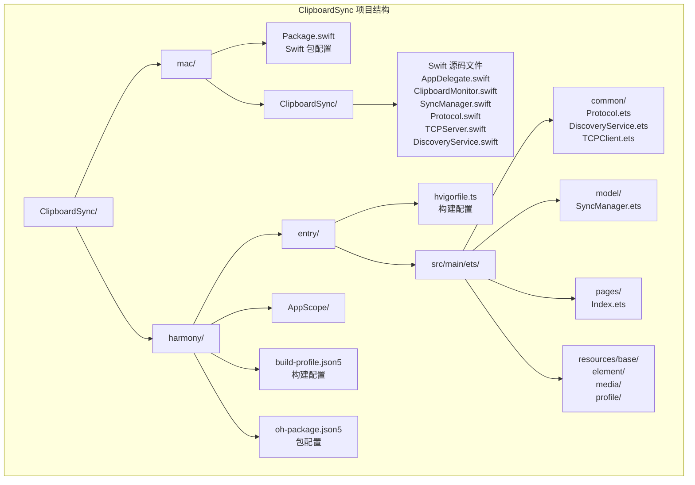
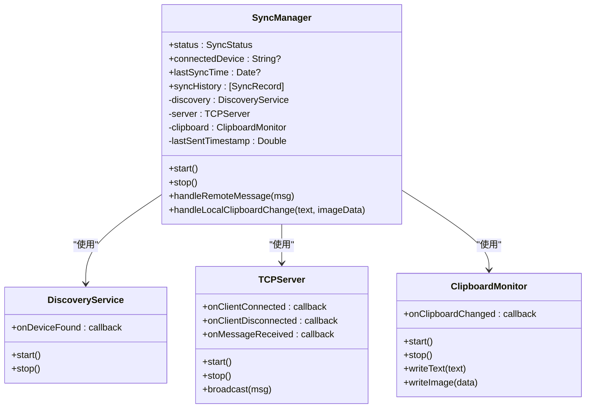
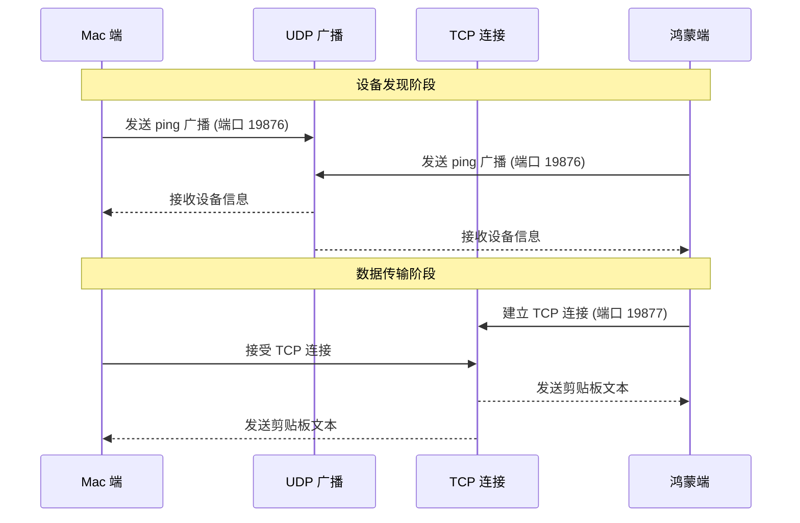
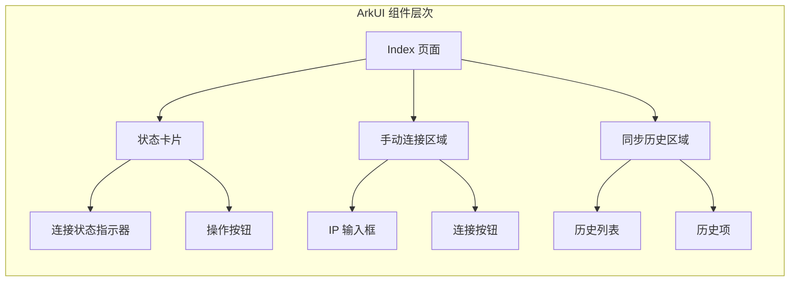
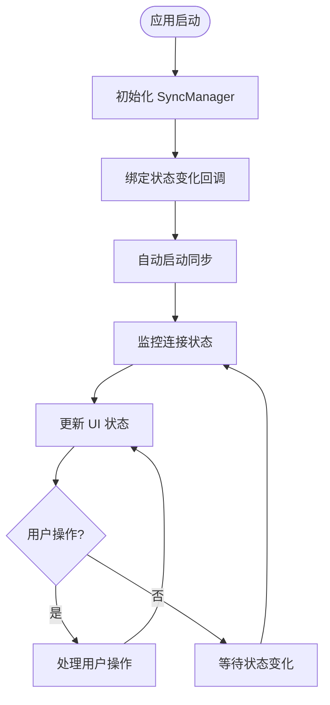
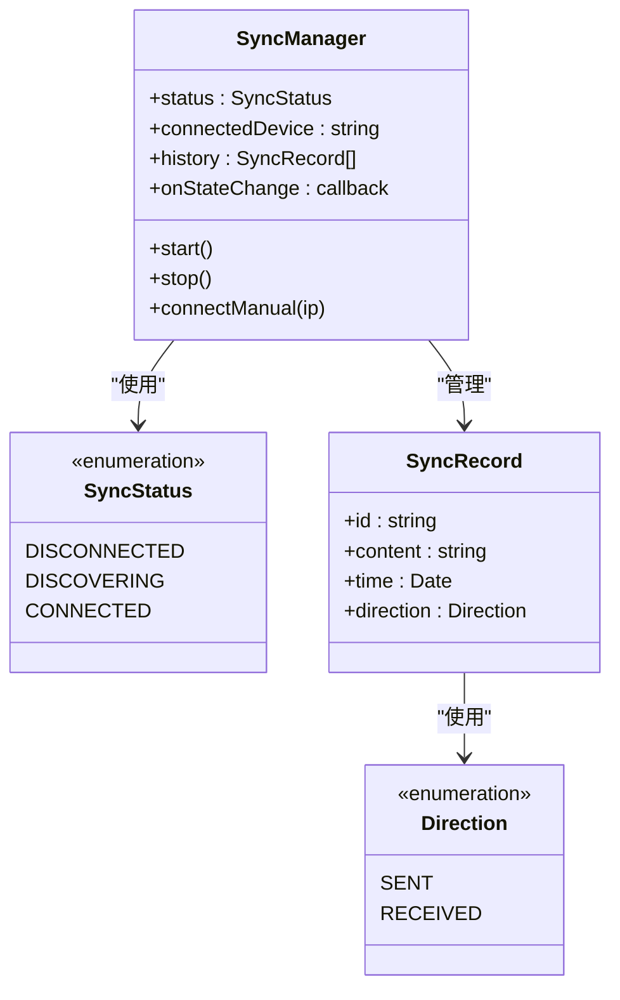
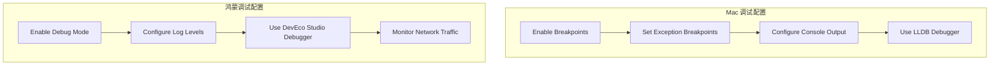

# 开发环境

<cite>
**本文引用的文件**
- [Package.swift](file://ClipboardSync/mac/Package.swift)
- [Info.plist](file://ClipboardSync/mac/ClipboardSync/Info.plist)
- [SyncManager.swift](file://ClipboardSync/mac/ClipboardSync/SyncManager.swift)
- [Protocol.swift](file://ClipboardSync/mac/ClipboardSync/Protocol.swift)
- [Index.ets](file://ClipboardSync/harmony/entry/src/main/ets/pages/Index.ets)
- [Protocol.ets](file://ClipboardSync/harmony/entry/src/main/ets/common/Protocol.ets)
- [module.json5](file://ClipboardSync/harmony/entry/src/main/module.json5)
- [build-profile.json5](file://ClipboardSync/harmony/entry/build-profile.json5)
- [hvigorfile.ts](file://ClipboardSync/harmony/entry/hvigorfile.ts)
- [hvigor-config.json5](file://ClipboardSync/harmony/hvigor/hvigor-config.json5)
- [oh-package.json5](file://ClipboardSync/harmony/oh-package.json5)
- [PROJECT.md](file://ClipboardSync/PROJECT.md)
</cite>

## 目录
1. [简介](#简介)
2. [项目结构](#项目结构)
3. [开发环境要求](#开发环境要求)
4. [Mac 端开发环境搭建](#mac-端开发环境搭建)
5. [鸿蒙端开发环境搭建](#鸿蒙端开发环境搭建)
6. [Swift 5.9+ 开发环境配置](#swift-59-开发环境配置)
7. [ArkTS 开发环境配置](#arkts-开发环境配置)
8. [第三方库和框架](#第三方库和框架)
9. [开发工具推荐配置](#开发工具推荐配置)
10. [调试技巧](#调试技巧)
11. [常见问题排查](#常见问题排查)
12. [环境验证](#环境验证)
13. [总结](#总结)

## 简介

ClipboardSync 是一个跨平台的剪贴板同步工具，支持 Mac 电脑与鸿蒙手机之间的实时剪贴板同步。该项目采用双端架构设计，Mac 端使用 Swift 5.9 + SwiftUI，鸿蒙端使用 ArkTS + ArkUI，通过 UDP 广播发现设备和 TCP 长连接进行数据传输。

## 项目结构

项目采用清晰的双端分离架构：



**图表来源**
- [PROJECT.md:5-50](file://ClipboardSync/PROJECT.md#L5-L50)
- [Package.swift:1-18](file://ClipboardSync/mac/Package.swift#L1-L18)
- [module.json5:1-39](file://ClipboardSync/harmony/entry/src/main/module.json5#L1-L39)

## 开发环境要求

根据项目配置文件分析，开发环境需要以下最低要求：

### 系统要求

| 组件 | 最低版本要求 | 推荐版本 |
|------|-------------|---------|
| macOS | 13.0 | 14.0+ |
| Xcode Command Line Tools | Swift 5.9+ | Swift 5.9+ |
| DevEco Studio | 6.1+ | 6.1+ |
| HarmonyOS SDK | API 23 (6.1.0) | API 23 (6.1.0) |
| 鸿蒙设备 | HarmonyOS 6.1 | HarmonyOS 6.1 |

### 网络要求

项目使用特定的网络端口进行通信：
- **UDP 广播端口**: 19876 (设备发现)
- **TCP 数据端口**: 19877 (数据传输)
- **TCP 发现端口**: 19878 (设备信息交换)

**章节来源**
- [PROJECT.md:161-169](file://ClipboardSync/PROJECT.md#L161-L169)
- [Protocol.swift:5-10](file://ClipboardSync/mac/ClipboardSync/Protocol.swift#L5-L10)
- [Protocol.ets:2-6](file://ClipboardSync/harmony/entry/src/main/ets/common/Protocol.ets#L2-L6)

## Mac 端开发环境搭建

### 系统和工具准备

1. **安装 Xcode Command Line Tools**
   ```bash
   # 检查是否已安装
   xcode-select --print-path
   
   # 如果未安装，下载安装 Xcode
   # 在 App Store 中搜索 "Xcode" 并安装
   ```

2. **验证 Swift 版本**
   ```bash
   swift --version
   # 输出应显示 Swift 5.9 或更高版本
   ```

3. **安装必要的系统组件**
   - macOS 13.0 或更高版本
   - Xcode 15.0 或更高版本（可选，用于图形界面开发）

### 项目配置

1. **项目结构理解**
   - 使用 Swift Package Manager (SPM) 进行依赖管理
   - macOS 13.0 作为最低系统版本要求
   - 应用以菜单栏图标运行（无 Dock 图标）

2. **关键配置文件**
   - `Package.swift`: 定义 Swift 工具版本和平台要求
   - `Info.plist`: 配置应用属性和网络安全设置

### 编译和运行

```bash
# 进入 Mac 端目录
cd ClipboardSync/mac

# 构建项目
swift build

# 运行应用
swift run ClipboardSync
```

**章节来源**
- [Package.swift:1-18](file://ClipboardSync/mac/Package.swift#L1-L18)
- [Info.plist:21-29](file://ClipboardSync/mac/ClipboardSync/Info.plist#L21-L29)
- [PROJECT.md:66-77](file://ClipboardSync/PROJECT.md#L66-L77)

## 鸿蒙端开发环境搭建

### 开发工具安装

1. **安装 DevEco Studio 6.1+**
   - 从华为开发者官网下载最新版本
   - 安装完成后启动 DevEco Studio

2. **配置 HarmonyOS SDK**
   - 在 DevEco Studio 中配置 API 23 (6.1.0) SDK
   - 确保 SDK 路径正确配置

### 项目导入和配置

1. **导入项目**
   ```bash
   # 在 DevEco Studio 中选择 "Open" 或 "Import Project"
   # 选择 ClipboardSync/harmony 目录
   ```

2. **构建配置**
   - `build-profile.json5`: 配置构建选项和目标
   - `hvigorfile.ts`: 配置构建任务和插件
   - `module.json5`: 配置应用模块和权限

3. **权限配置**
   应用需要以下权限：
   - `ohos.permission.INTERNET`: 网络访问
   - `ohos.permission.GET_WIFI_INFO`: 获取 WiFi 信息

### 编译和运行

```bash
# 在 DevEco Studio 中
# 1. 连接鸿蒙真机
# 2. 点击 "Run" 按钮
# 3. 在设备上安装并运行应用
```

**章节来源**
- [PROJECT.md:80-82](file://ClipboardSync/PROJECT.md#L80-L82)
- [module.json5:30-37](file://ClipboardSync/harmony/entry/src/main/module.json5#L30-L37)
- [build-profile.json5:1-14](file://ClipboardSync/harmony/entry/build-profile.json5#L1-L14)
- [hvigorfile.ts:1-6](file://ClipboardSync/harmony/entry/hvigorfile.ts#L1-L6)

## Swift 5.9+ 开发环境配置

### Swift 工具版本要求

项目明确要求 Swift 5.9+：
- `swift-tools-version: 5.9` 在 Package.swift 中指定
- 支持最新的 Swift 语法特性和性能优化

### macOS 平台配置

- 最低系统版本: macOS 13.0
- 应用类型: 菜单栏应用 (LSUIElement=true)
- 无 Dock 图标，仅显示菜单栏图标

### 核心模块架构



**图表来源**
- [SyncManager.swift:4-154](file://ClipboardSync/mac/ClipboardSync/SyncManager.swift#L4-L154)

### 网络通信协议



**图表来源**
- [Protocol.swift:4-25](file://ClipboardSync/mac/ClipboardSync/Protocol.swift#L4-L25)
- [Protocol.ets:11-26](file://ClipboardSync/harmony/entry/src/main/ets/common/Protocol.ets#L11-L26)

**章节来源**
- [Package.swift:1-7](file://ClipboardSync/mac/Package.swift#L1-L7)
- [Info.plist:21-24](file://ClipboardSync/mac/ClipboardSync/Info.plist#L21-L24)
- [SyncManager.swift:40-93](file://ClipboardSync/mac/ClipboardSync/SyncManager.swift#L40-L93)

## ArkTS 开发环境配置

### ArkTS 语言特性

- 基于 TypeScript 的 ArkTS 语言
- 支持装饰器语法 (@Component, @Entry)
- 强类型的接口定义
- 组件化的 UI 架构

### ArkUI 框架配置



**图表来源**
- [Index.ets:29-51](file://ClipboardSync/harmony/entry/src/main/ets/pages/Index.ets#L29-L51)

### 状态管理和数据绑定



**图表来源**
- [Index.ets:13-27](file://ClipboardSync/harmony/entry/src/main/ets/pages/Index.ets#L13-L27)

### 网络通信实现



**图表来源**
- [Index.ets:6-27](file://ClipboardSync/harmony/entry/src/main/ets/pages/Index.ets#L6-L27)

**章节来源**
- [Index.ets:1-200](file://ClipboardSync/harmony/entry/src/main/ets/pages/Index.ets#L1-L200)
- [module.json5:1-39](file://ClipboardSync/harmony/entry/src/main/module.json5#L1-L39)

## 第三方库和框架

### Mac 端依赖

根据项目配置，Mac 端主要依赖系统框架：

- **Foundation**: 核心数据结构和编码解码
- **Combine**: 响应式编程和事件处理
- **Network.framework**: 网络通信 (NWListener)
- **AppKit**: 菜单栏应用界面

### 鸿蒙端依赖

- **@kit.NetworkKit**: 网络通信 (socket.TCPSocket, socket.UDPSocket)
- **@kit.BasicServicesKit**: 基础服务 (pasteboard, BusinessError)
- **@ohos/hvigor-ohos-plugin**: 构建工具插件

### 构建系统

- **Swift Package Manager**: Mac 端包管理
- **hvigor**: 鸿蒙端构建系统
- **SPM**: Swift 包管理器

**章节来源**
- [PROJECT.md:154-159](file://ClipboardSync/PROJECT.md#L154-L159)
- [hvigorfile.ts:1-6](file://ClipboardSync/harmony/entry/hvigorfile.ts#L1-L6)

## 开发工具推荐配置

### Mac 开发工具

1. **Xcode 配置**
   - 启用 "Show Build Phases" 以便查看编译过程
   - 配置 "Build Settings" 中的 "Swift Compiler - Custom Compiler Flags"
   - 启用 "Debug Workflow" 以便调试

2. **命令行工具**
   ```bash
   # 安装额外的开发工具
   xcode-select --install
   
   # 配置 Swift 包管理器
   swift package resolve
   ```

### 鸿蒙开发工具

1. **DevEco Studio 配置**
   - 设置 "SDK Path" 指向正确的 HarmonyOS SDK
   - 配置 "模拟器" 或 "真机" 连接
   - 启用 "Logcat" 以便查看日志输出

2. **构建配置**
   - 在 `hvigor-config.json5` 中配置依赖
   - 确保 `build-profile.json5` 中的 API 级别正确

### 调试配置



## 调试技巧

### Mac 端调试

1. **网络连接调试**
   ```bash
   # 检查端口占用
   lsof -i :19876
   lsof -i :19877
   lsof -i :19878
   
   # 检查防火墙设置
   sudo /usr/libexec/ApplicationFirewall/socketfilterfw --getglobalstate
   ```

2. **剪贴板监控调试**
   - 使用 `NSWorkspace.shared.notificationCenter` 监控应用切换
   - 检查 `NSPasteboard` 的内容变化

3. **日志输出**
   - 使用 `print()` 函数输出调试信息
   - 使用 `os_log` 进行系统级日志记录

### 鸿蒙端调试

1. **网络连接调试**
   ```bash
   # 查看网络连接状态
   netstat -an | grep 19877
   
   # 检查权限是否正确
   dumpsys package com.example.clipboardsync
   ```

2. **UI 状态调试**
   - 使用 DevEco Studio 的 "Preview" 功能
   - 检查状态变化回调是否正常触发

3. **日志调试**
   - 使用 `console.log()` 输出调试信息
   - 使用 `hilog` 进行系统级日志记录

**章节来源**
- [PROJECT.md:102-127](file://ClipboardSync/PROJECT.md#L102-L127)

## 常见问题排查

### Mac 端问题

1. **Swift 版本不兼容**
   ```
   Error: The package requires Swift 5.9 or later
   Solution: 更新 Xcode Command Line Tools 到支持 Swift 5.9+
   ```

2. **菜单栏应用无法启动**
   ```
   Issue: 应用无响应
   Solution: 检查 Info.plist 中的 LSUIElement 设置
   ```

3. **网络连接失败**
   ```
   Error: Operation not permitted
   Solution: 检查防火墙设置和端口占用情况
   ```

### 鸿蒙端问题

1. **DevEco Studio 启动失败**
   ```
   Error: SDK path not found
   Solution: 在 DevEco Studio 中正确配置 HarmonyOS SDK 路径
   ```

2. **应用无法连接到 Mac**
   ```
   Error: 2301115 Operation in progress
   Solution: 实现正确的连接延迟机制，避免快速重复连接
   ```

3. **权限不足**
   ```
   Error: Permission denied
   Solution: 在 module.json5 中添加必要的权限声明
   ```

### 网络通信问题

1. **UDP 广播不工作**
   ```
   Issue: 设备无法互相发现
   Solution: 检查局域网设置和防火墙规则
   ```

2. **TCP 连接不稳定**
   ```
   Issue: 连接频繁断开
   Solution: 实现重连机制和心跳检测
   ```

**章节来源**
- [PROJECT.md:102-152](file://ClipboardSync/PROJECT.md#L102-L152)

## 环境验证

### Mac 端验证

1. **Swift 环境验证**
   ```bash
   # 验证 Swift 版本
   swift --version
   
   # 验证 SPM
   swift package --version
   
   # 验证构建
   cd ClipboardSync/mac
   swift build
   ```

2. **网络端口验证**
   ```bash
   # 检查端口可用性
   nc -zv localhost 19876
   nc -zv localhost 19877
   nc -zv localhost 19878
   ```

3. **应用启动验证**
   ```bash
   # 启动应用
   swift run ClipboardSync
   
   # 验证菜单栏图标
   # 检查是否有菜单栏图标出现
   ```

### 鸿蒙端验证

1. **DevEco Studio 验证**
   ```bash
   # 检查 SDK 配置
   # 在 DevEco Studio 中查看 SDK 路径
   
   # 验证项目导入
   # 确认所有文件都正确导入
   ```

2. **设备连接验证**
   ```bash
   # 连接真机设备
   # 在 DevEco Studio 中选择设备
   
   # 编译和运行
   # 确认应用成功安装到设备
   ```

3. **网络功能验证**
   ```bash
   # 在设备上输入 Mac 的 IP 地址
   # 点击连接按钮
   # 验证连接状态
   ```

### 双端联调验证

1. **基本功能测试**
   - 在 Mac 上复制文本
   - 在鸿蒙设备上验证同步
   - 在鸿蒙设备上复制文本
   - 在 Mac 上验证同步

2. **去重机制验证**
   - 测试同一消息不会重复同步
   - 验证时间戳去重逻辑

3. **异常处理验证**
   - 测试网络中断后的恢复
   - 测试设备离线后的状态

**章节来源**
- [PROJECT.md:64-89](file://ClipboardSync/PROJECT.md#L64-L89)

## 总结

ClipboardSync 项目提供了完整的跨平台剪贴板同步解决方案，具有以下特点：

1. **清晰的架构设计**: 双端分离，职责明确
2. **稳定的通信协议**: 基于 UDP 广播和 TCP 长连接
3. **完善的错误处理**: 包含多种异常场景的处理机制
4. **良好的用户体验**: 菜单栏应用和直观的 UI 设计

开发环境搭建的关键在于确保：
- Swift 5.9+ 和 DevEco Studio 6.1+ 的正确安装
- HarmonyOS SDK API 23 的配置
- 网络端口的正确开放和防火墙设置
- 设备间的局域网连通性

通过遵循本文档的指导，开发者可以快速搭建起完整的开发环境，并成功运行和调试 ClipboardSync 项目。