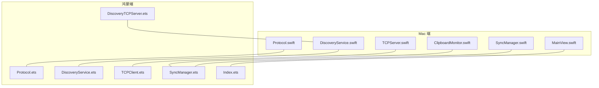
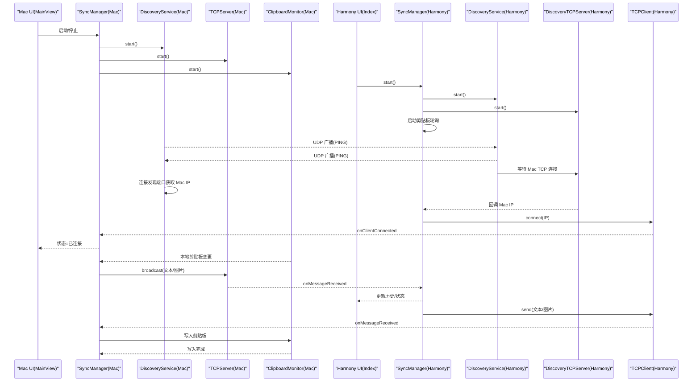
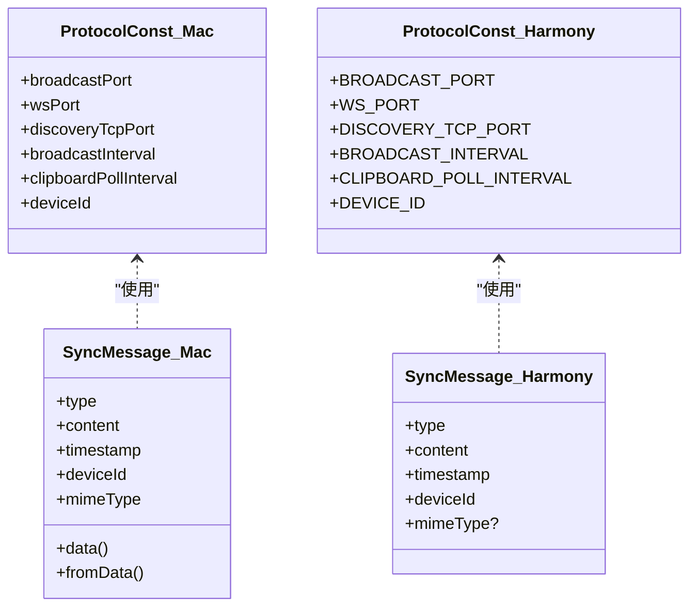
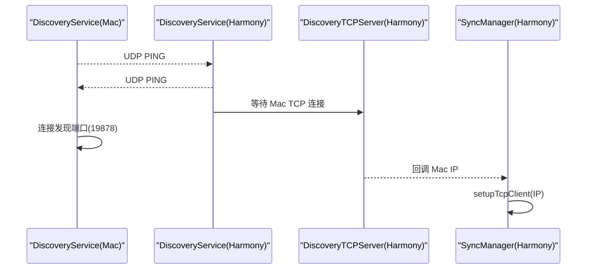
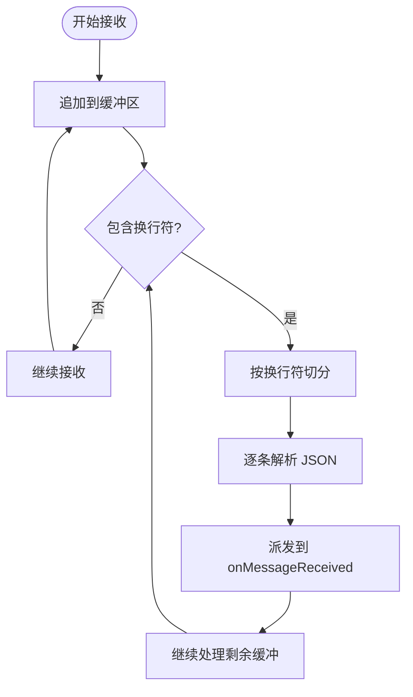
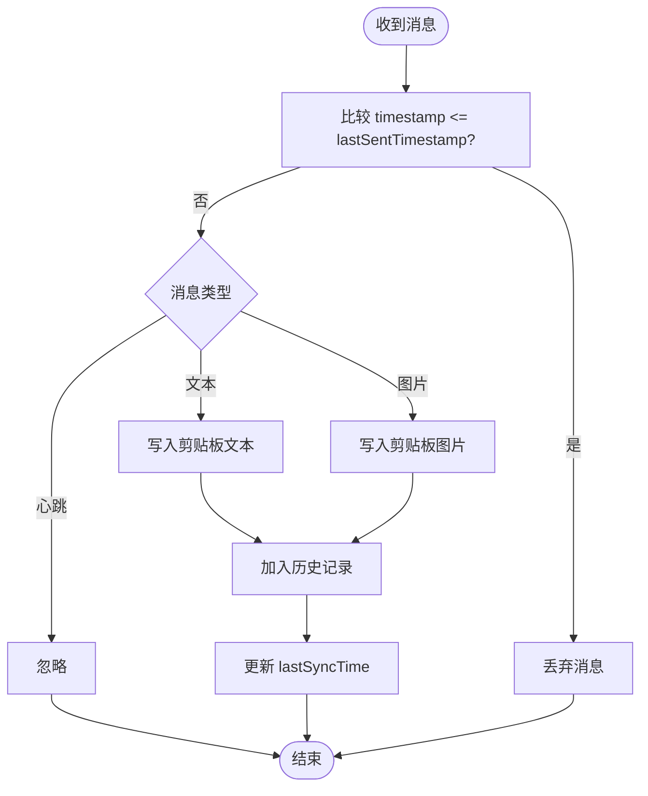
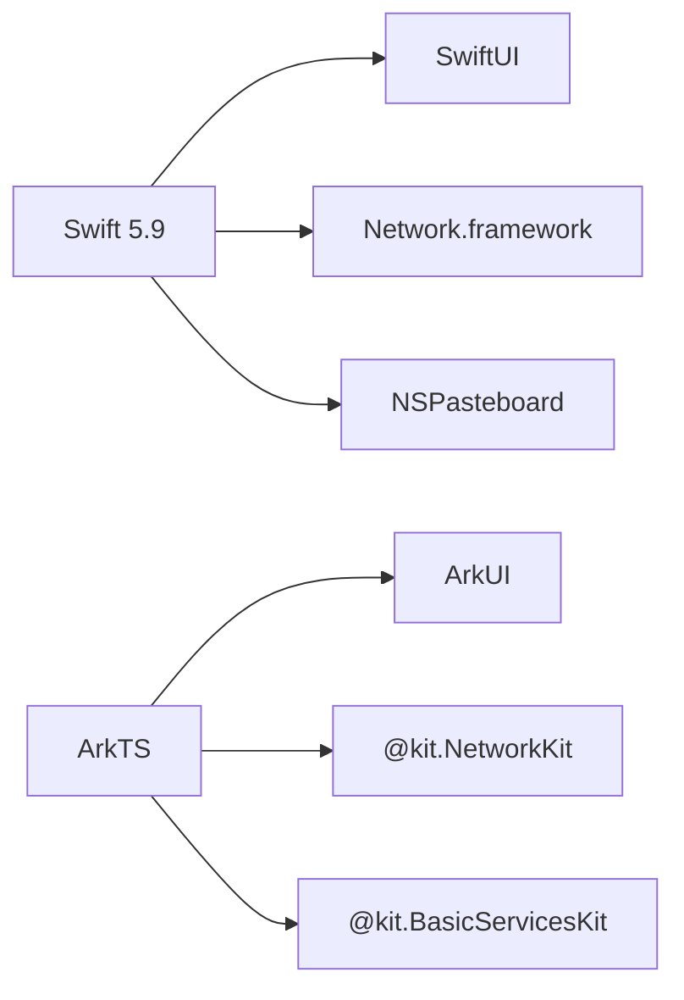

# 技术架构

<cite>
**本文引用的文件**
- [ClipboardSync/PROJECT.md](file://ClipboardSync/PROJECT.md)
- [ClipboardSync/mac/Package.swift](file://ClipboardSync/mac/Package.swift)
- [ClipboardSync/harmony/oh-package.json5](file://ClipboardSync/harmony/oh-package.json5)
- [ClipboardSync/harmony/build-profile.json5](file://ClipboardSync/harmony/build-profile.json5)
- [ClipboardSync/mac/ClipboardSync/Protocol.swift](file://ClipboardSync/mac/ClipboardSync/Protocol.swift)
- [ClipboardSync/harmony/entry/src/main/ets/common/Protocol.ets](file://ClipboardSync/harmony/entry/src/main/ets/common/Protocol.ets)
- [ClipboardSync/mac/ClipboardSync/SyncManager.swift](file://ClipboardSync/mac/ClipboardSync/SyncManager.swift)
- [ClipboardSync/harmony/entry/src/main/ets/model/SyncManager.ets](file://ClipboardSync/harmony/entry/src/main/ets/model/SyncManager.ets)
- [ClipboardSync/mac/ClipboardSync/DiscoveryService.swift](file://ClipboardSync/mac/ClipboardSync/DiscoveryService.swift)
- [ClipboardSync/harmony/entry/src/main/ets/common/DiscoveryService.ets](file://ClipboardSync/harmony/entry/src/main/ets/common/DiscoveryService.ets)
- [ClipboardSync/mac/ClipboardSync/TCPServer.swift](file://ClipboardSync/mac/ClipboardSync/TCPServer.swift)
- [ClipboardSync/harmony/entry/src/main/ets/common/TCPClient.ets](file://ClipboardSync/harmony/entry/src/main/ets/common/TCPClient.ets)
- [ClipboardSync/mac/ClipboardSync/MainView.swift](file://ClipboardSync/mac/ClipboardSync/MainView.swift)
- [ClipboardSync/harmony/entry/src/main/ets/pages/Index.ets](file://ClipboardSync/harmony/entry/src/main/ets/pages/Index.ets)
- [ClipboardSync/mac/ClipboardSync/ClipboardMonitor.swift](file://ClipboardSync/mac/ClipboardSync/ClipboardMonitor.swift)
- [ClipboardSync/harmony/entry/src/main/ets/common/DiscoveryTCPServer.ets](file://ClipboardSync/harmony/entry/src/main/ets/common/DiscoveryTCPServer.ets)
</cite>

## 目录
1. [简介](#简介)
2. [项目结构](#项目结构)
3. [核心组件](#核心组件)
4. [架构总览](#架构总览)
5. [详细组件分析](#详细组件分析)
6. [依赖分析](#依赖分析)
7. [性能考虑](#性能考虑)
8. [故障排查指南](#故障排查指南)
9. [结论](#结论)
10. [附录](#附录)

## 简介
ClipboardSync 是一款在局域网内实现 Mac 与鸿蒙手机之间剪贴板实时同步的工具。项目采用双端架构：Mac 端使用 Swift + SwiftUI，鸿蒙端使用 ArkTS + ArkUI。两端通过统一的通信协议进行设备发现与数据传输，并内置去重与防回环机制，确保同步稳定可靠。

## 项目结构
项目采用按端划分的模块化组织方式，Mac 端与鸿蒙端分别包含各自的协议、网络、剪贴板监听与 UI 模块，便于独立开发与维护。

图表来源
- [ClipboardSync/mac/ClipboardSync/Protocol.swift:1-43](file://ClipboardSync/mac/ClipboardSync/Protocol.swift#L1-L43)
- [ClipboardSync/harmony/entry/src/main/ets/common/Protocol.ets:1-27](file://ClipboardSync/harmony/entry/src/main/ets/common/Protocol.ets#L1-L27)
- [ClipboardSync/mac/ClipboardSync/DiscoveryService.swift:1-197](file://ClipboardSync/mac/ClipboardSync/DiscoveryService.swift#L1-L197)
- [ClipboardSync/harmony/entry/src/main/ets/common/DiscoveryService.ets:1-161](file://ClipboardSync/harmony/entry/src/main/ets/common/DiscoveryService.ets#L1-L161)
- [ClipboardSync/mac/ClipboardSync/TCPServer.swift:1-174](file://ClipboardSync/mac/ClipboardSync/TCPServer.swift#L1-L174)
- [ClipboardSync/harmony/entry/src/main/ets/common/TCPClient.ets:1-181](file://ClipboardSync/harmony/entry/src/main/ets/common/TCPClient.ets#L1-L181)
- [ClipboardSync/mac/ClipboardSync/SyncManager.swift:1-154](file://ClipboardSync/mac/ClipboardSync/SyncManager.swift#L1-L154)
- [ClipboardSync/harmony/entry/src/main/ets/model/SyncManager.ets:1-301](file://ClipboardSync/harmony/entry/src/main/ets/model/SyncManager.ets#L1-L301)
- [ClipboardSync/mac/ClipboardSync/MainView.swift:1-209](file://ClipboardSync/mac/ClipboardSync/MainView.swift#L1-L209)
- [ClipboardSync/harmony/entry/src/main/ets/pages/Index.ets:1-226](file://ClipboardSync/harmony/entry/src/main/ets/pages/Index.ets#L1-L226)
- [ClipboardSync/mac/ClipboardSync/ClipboardMonitor.swift:1-73](file://ClipboardSync/mac/ClipboardSync/ClipboardMonitor.swift#L1-L73)
- [ClipboardSync/harmony/entry/src/main/ets/common/DiscoveryTCPServer.ets:1-80](file://ClipboardSync/harmony/entry/src/main/ets/common/DiscoveryTCPServer.ets#L1-L80)

章节来源
- [ClipboardSync/PROJECT.md:5-50](file://ClipboardSync/PROJECT.md#L5-L50)
- [ClipboardSync/mac/Package.swift:1-18](file://ClipboardSync/mac/Package.swift#L1-L18)
- [ClipboardSync/harmony/build-profile.json5:1-43](file://ClipboardSync/harmony/build-profile.json5#L1-L43)

## 核心组件
- 通信协议层：定义端口、消息类型与消息结构，两端共享协议定义，保证兼容性。
- 设备发现层：基于 UDP 广播实现局域网设备发现；Mac 端同时通过 TCP 发现端口辅助获取鸿蒙端 IP。
- 网络传输层：基于 TCP 长连接传输 JSON 消息，使用换行符分隔，具备粘包处理能力。
- 同步协调层：负责状态管理、消息去重、历史记录与 UI 状态联动。
- 剪贴板监听层：轮询监听系统剪贴板变化，支持文本与图片（Mac 端）。

章节来源
- [ClipboardSync/mac/ClipboardSync/Protocol.swift:1-43](file://ClipboardSync/mac/ClipboardSync/Protocol.swift#L1-L43)
- [ClipboardSync/harmony/entry/src/main/ets/common/Protocol.ets:1-27](file://ClipboardSync/harmony/entry/src/main/ets/common/Protocol.ets#L1-L27)
- [ClipboardSync/mac/ClipboardSync/SyncManager.swift:1-154](file://ClipboardSync/mac/ClipboardSync/SyncManager.swift#L1-L154)
- [ClipboardSync/harmony/entry/src/main/ets/model/SyncManager.ets:1-301](file://ClipboardSync/harmony/entry/src/main/ets/model/SyncManager.ets#L1-L301)

## 架构总览
系统采用“观察者模式 + 状态管理模式”的组合架构：
- 观察者模式：SyncManager 通过 @Published 属性暴露状态，UI 层订阅状态变化；网络与剪贴板模块通过回调通知 SyncManager。
- 状态管理模式：两端均维护 SyncStatus、连接设备、同步历史等状态，通过统一的状态机驱动 UI 更新与行为切换。

图表来源
- [ClipboardSync/mac/ClipboardSync/SyncManager.swift:1-154](file://ClipboardSync/mac/ClipboardSync/SyncManager.swift#L1-L154)
- [ClipboardSync/harmony/entry/src/main/ets/model/SyncManager.ets:1-301](file://ClipboardSync/harmony/entry/src/main/ets/model/SyncManager.ets#L1-L301)
- [ClipboardSync/mac/ClipboardSync/DiscoveryService.swift:1-197](file://ClipboardSync/mac/ClipboardSync/DiscoveryService.swift#L1-L197)
- [ClipboardSync/harmony/entry/src/main/ets/common/DiscoveryService.ets:1-161](file://ClipboardSync/harmony/entry/src/main/ets/common/DiscoveryService.ets#L1-L161)
- [ClipboardSync/mac/ClipboardSync/TCPServer.swift:1-174](file://ClipboardSync/mac/ClipboardSync/TCPServer.swift#L1-L174)
- [ClipboardSync/harmony/entry/src/main/ets/common/TCPClient.ets:1-181](file://ClipboardSync/harmony/entry/src/main/ets/common/TCPClient.ets#L1-L181)
- [ClipboardSync/mac/ClipboardSync/MainView.swift:1-209](file://ClipboardSync/mac/ClipboardSync/MainView.swift#L1-L209)
- [ClipboardSync/harmony/entry/src/main/ets/pages/Index.ets:1-226](file://ClipboardSync/harmony/entry/src/main/ets/pages/Index.ets#L1-L226)

## 详细组件分析

### 协议与消息模型
- Mac 端与鸿蒙端共享协议常量与消息结构，确保两端解析一致。
- 消息类型包含文本、图片、心跳等；携带时间戳与设备 ID，用于去重与识别来源。

图表来源
- [ClipboardSync/mac/ClipboardSync/Protocol.swift:1-43](file://ClipboardSync/mac/ClipboardSync/Protocol.swift#L1-L43)
- [ClipboardSync/harmony/entry/src/main/ets/common/Protocol.ets:1-27](file://ClipboardSync/harmony/entry/src/main/ets/common/Protocol.ets#L1-L27)

章节来源
- [ClipboardSync/mac/ClipboardSync/Protocol.swift:1-43](file://ClipboardSync/mac/ClipboardSync/Protocol.swift#L1-L43)
- [ClipboardSync/harmony/entry/src/main/ets/common/Protocol.ets:1-27](file://ClipboardSync/harmony/entry/src/main/ets/common/Protocol.ets#L1-L27)

### 设备发现与连接建立
- Mac 端：UDP 广播 + TCP 发现端口。UDP 用于宣告在线；TCP 发现端口用于让鸿蒙端从连接中获取 Mac 的 IP。
- 鸿蒙端：UDP 广播 + TCP 发现服务端。UDP 用于发现 Mac；DiscoveryTCPServer 监听端口 19878，从连接中提取 Mac IP 并回调给 SyncManager。

图表来源
- [ClipboardSync/mac/ClipboardSync/DiscoveryService.swift:1-197](file://ClipboardSync/mac/ClipboardSync/DiscoveryService.swift#L1-L197)
- [ClipboardSync/harmony/entry/src/main/ets/common/DiscoveryService.ets:1-161](file://ClipboardSync/harmony/entry/src/main/ets/common/DiscoveryService.ets#L1-L161)
- [ClipboardSync/harmony/entry/src/main/ets/common/DiscoveryTCPServer.ets:1-80](file://ClipboardSync/harmony/entry/src/main/ets/common/DiscoveryTCPServer.ets#L1-L80)
- [ClipboardSync/harmony/entry/src/main/ets/model/SyncManager.ets:1-301](file://ClipboardSync/harmony/entry/src/main/ets/model/SyncManager.ets#L1-L301)

章节来源
- [ClipboardSync/mac/ClipboardSync/DiscoveryService.swift:1-197](file://ClipboardSync/mac/ClipboardSync/DiscoveryService.swift#L1-L197)
- [ClipboardSync/harmony/entry/src/main/ets/common/DiscoveryService.ets:1-161](file://ClipboardSync/harmony/entry/src/main/ets/common/DiscoveryService.ets#L1-L161)
- [ClipboardSync/harmony/entry/src/main/ets/common/DiscoveryTCPServer.ets:1-80](file://ClipboardSync/harmony/entry/src/main/ets/common/DiscoveryTCPServer.ets#L1-L80)
- [ClipboardSync/harmony/entry/src/main/ets/model/SyncManager.ets:1-301](file://ClipboardSync/harmony/entry/src/main/ets/model/SyncManager.ets#L1-L301)

### 数据传输与粘包处理
- Mac 端 TCPServer 作为服务端监听，使用换行符分隔消息；具备缓冲与粘包拆分能力。
- 鸿蒙端 TCPClient 作为客户端连接，同样以换行符分隔消息，具备重连与错误处理。

图表来源
- [ClipboardSync/mac/ClipboardSync/TCPServer.swift:129-148](file://ClipboardSync/mac/ClipboardSync/TCPServer.swift#L129-L148)
- [ClipboardSync/harmony/entry/src/main/ets/common/TCPClient.ets:115-146](file://ClipboardSync/harmony/entry/src/main/ets/common/TCPClient.ets#L115-L146)

章节来源
- [ClipboardSync/mac/ClipboardSync/TCPServer.swift:1-174](file://ClipboardSync/mac/ClipboardSync/TCPServer.swift#L1-L174)
- [ClipboardSync/harmony/entry/src/main/ets/common/TCPClient.ets:1-181](file://ClipboardSync/harmony/entry/src/main/ets/common/TCPClient.ets#L1-L181)

### 同步协调与去重防回环
- SyncManager 负责状态机、历史记录、去重判断与消息派发。
- 去重策略：基于消息时间戳与 lastSentTimestamp 比较，避免回环写入导致的无限循环。

图表来源
- [ClipboardSync/mac/ClipboardSync/SyncManager.swift:95-115](file://ClipboardSync/mac/ClipboardSync/SyncManager.swift#L95-L115)
- [ClipboardSync/harmony/entry/src/main/ets/model/SyncManager.ets:178-198](file://ClipboardSync/harmony/entry/src/main/ets/model/SyncManager.ets#L178-L198)

章节来源
- [ClipboardSync/mac/ClipboardSync/SyncManager.swift:1-154](file://ClipboardSync/mac/ClipboardSync/SyncManager.swift#L1-L154)
- [ClipboardSync/harmony/entry/src/main/ets/model/SyncManager.ets:1-301](file://ClipboardSync/harmony/entry/src/main/ets/model/SyncManager.ets#L1-L301)

### 剪贴板监听与写入
- Mac 端：NSPasteboard 轮询监听，优先读取文本，其次尝试读取图片并转换为 PNG。
- 鸿蒙端：轮询系统剪贴板 ChangeCount，读取文本后通过系统剪贴板写入。

章节来源
- [ClipboardSync/mac/ClipboardSync/ClipboardMonitor.swift:1-73](file://ClipboardSync/mac/ClipboardSync/ClipboardMonitor.swift#L1-L73)
- [ClipboardSync/harmony/entry/src/main/ets/model/SyncManager.ets:202-252](file://ClipboardSync/harmony/entry/src/main/ets/model/SyncManager.ets#L202-L252)

### UI 层与状态展示
- Mac：SwiftUI 菜单栏弹窗，展示状态、连接设备、最近同步时间与历史列表。
- 鸿蒙：ArkUI 页面，展示状态、手动连接输入框与历史列表。

章节来源
- [ClipboardSync/mac/ClipboardSync/MainView.swift:1-209](file://ClipboardSync/mac/ClipboardSync/MainView.swift#L1-L209)
- [ClipboardSync/harmony/entry/src/main/ets/pages/Index.ets:1-226](file://ClipboardSync/harmony/entry/src/main/ets/pages/Index.ets#L1-L226)

## 依赖分析
- 语言与框架选择：
  - Mac：Swift 5.9 + SwiftUI；网络使用 Network.framework（NWListener/NWConnection）与 BSD Socket；剪贴板使用 NSPasteboard。
  - 鸿蒙：ArkTS + ArkUI；网络使用 @kit.NetworkKit（socket.TCPSocket/socket.UDPSocket）；剪贴板使用 @kit.BasicServicesKit。
- 构建与配置：
  - Mac 使用 SPM（Package.swift）；鸿蒙使用构建配置（build-profile.json5、oh-package.json5）。
- 通信端口：
  - 设备发现：UDP 19876
  - 数据传输：TCP 19877
  - Mac → 鸿蒙：TCP 19878（发现端口）

图表来源
- [ClipboardSync/PROJECT.md:154-169](file://ClipboardSync/PROJECT.md#L154-L169)
- [ClipboardSync/mac/Package.swift:1-18](file://ClipboardSync/mac/Package.swift#L1-L18)
- [ClipboardSync/harmony/build-profile.json5:1-43](file://ClipboardSync/harmony/build-profile.json5#L1-L43)
- [ClipboardSync/harmony/oh-package.json5:1-10](file://ClipboardSync/harmony/oh-package.json5#L1-L10)

章节来源
- [ClipboardSync/PROJECT.md:154-169](file://ClipboardSync/PROJECT.md#L154-L169)
- [ClipboardSync/mac/Package.swift:1-18](file://ClipboardSync/mac/Package.swift#L1-L18)
- [ClipboardSync/harmony/build-profile.json5:1-43](file://ClipboardSync/harmony/build-profile.json5#L1-L43)
- [ClipboardSync/harmony/oh-package.json5:1-10](file://ClipboardSync/harmony/oh-package.json5#L1-L10)

## 性能考虑
- 轮询间隔：两端均采用短周期轮询（Mac 0.5s，鸿蒙 0.5s），平衡实时性与 CPU 占用。
- 粘包处理：基于换行符的帧边界处理，避免频繁内存拷贝与解析失败。
- 去重与防回环：基于时间戳与 isRemoteUpdate 标志，减少无效写入与重复处理。
- 连接管理：TCP 客户端具备自动重连与错误回调，提升链路稳定性。

## 故障排查指南
- 鸿蒙端 TCP 连接报错 2301115：由于 socket.close() 异步关闭导致新连接被系统拒绝。解决方案：在创建新连接前先断开旧连接，并延迟 500ms 再 connect。
- 鸿蒙端 socket.SocketErrorInfo 不存在：API 23 中 socket 模块未导出该类型，使用 BusinessError 作为错误回调参数类型。
- Mac 端 build-profile.json5 SDK 版本类型错误：compileSdkVersion 与 compatibleSdkVersion 必须为字符串而非数字。
- Mac 端 SyncManager.start() 未在启动时调用：最初仅在 UI 出现时调用，应改为在 AppDelegate 中直接调用。
- Mac 端 NWListener 默认监听 IPv6：可能影响 lsof 显示，但不影响连接；可忽略误判。

章节来源
- [ClipboardSync/PROJECT.md:102-131](file://ClipboardSync/PROJECT.md#L102-L131)

## 结论
ClipboardSync 通过清晰的双端架构与统一协议，实现了 Mac 与鸿蒙设备间的稳定剪贴板同步。观察者与状态管理相结合的设计使模块职责明确、耦合度低，便于后续扩展（如图片同步、后台保活、端到端加密等）。

## 附录
- 运行方式与端口说明详见项目文档。
- 后续完善方向包括 UDP 自动发现连接、图片同步、状态图标、开机自启、后台保活与端到端加密等。

章节来源
- [ClipboardSync/PROJECT.md:64-153](file://ClipboardSync/PROJECT.md#L64-L153)