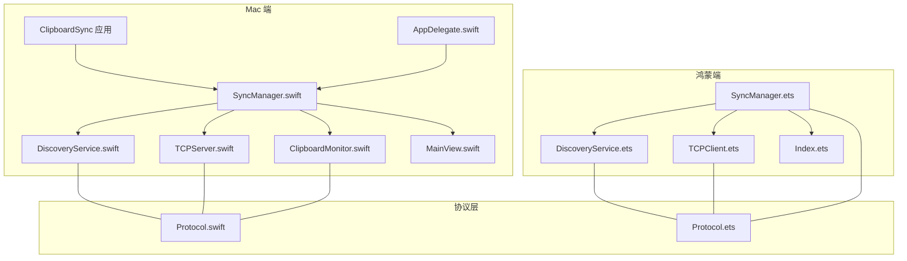
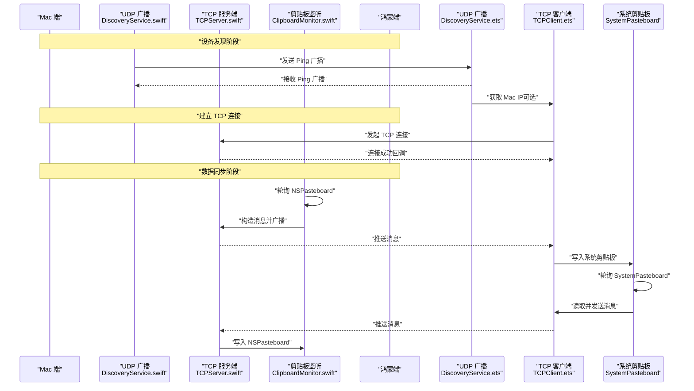
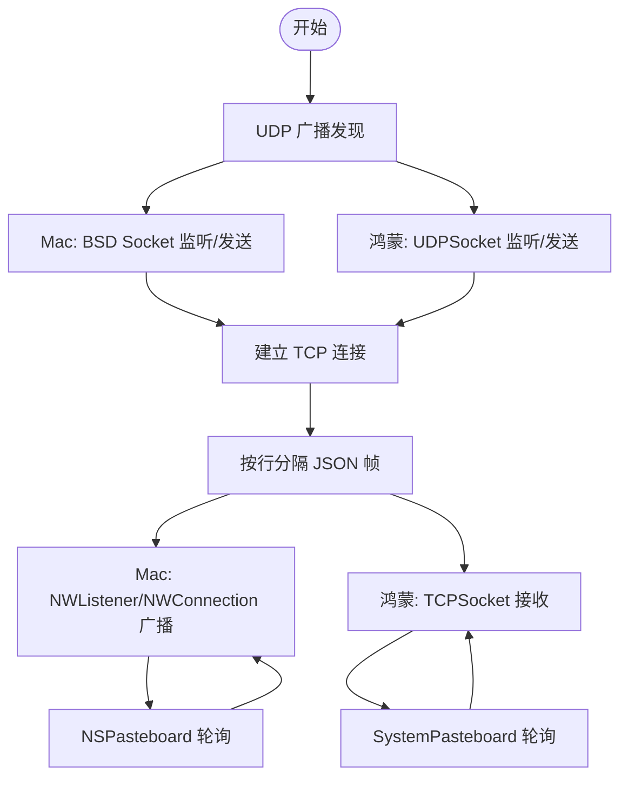
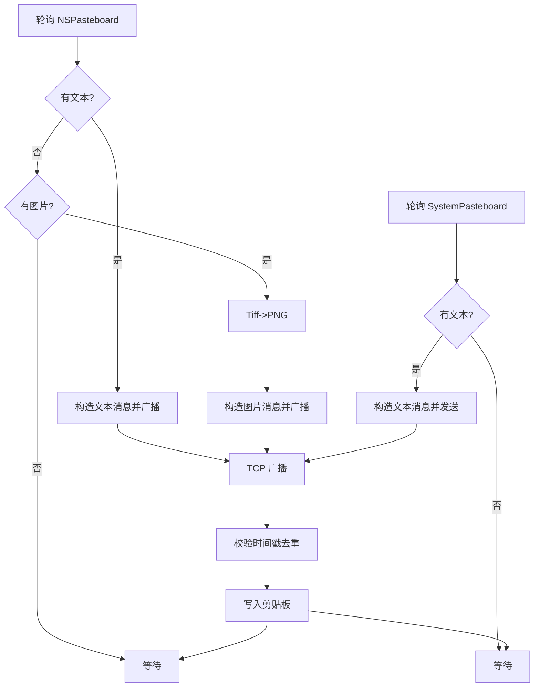
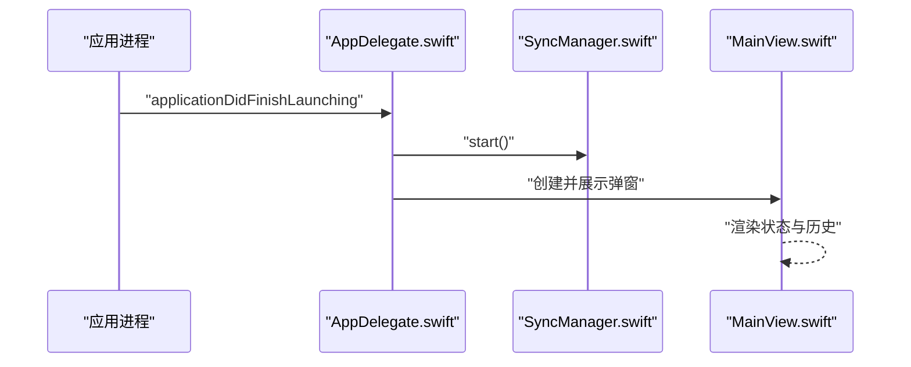
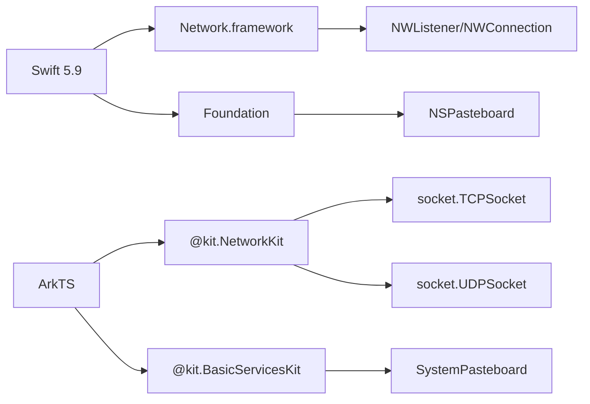

# 技术栈说明

<cite>
**本文引用的文件**
- [PROJECT.md](file://ClipboardSync/PROJECT.md)
- [Package.swift](file://ClipboardSync/mac/Package.swift)
- [oh-package.json5](file://ClipboardSync/harmony/oh-package.json5)
- [Protocol.swift](file://ClipboardSync/mac/ClipboardSync/Protocol.swift)
- [Protocol.ets](file://ClipboardSync/harmony/entry/src/main/ets/common/Protocol.ets)
- [DiscoveryService.swift](file://ClipboardSync/mac/ClipboardSync/DiscoveryService.swift)
- [DiscoveryService.ets](file://ClipboardSync/harmony/entry/src/main/ets/common/DiscoveryService.ets)
- [TCPServer.swift](file://ClipboardSync/mac/ClipboardSync/TCPServer.swift)
- [TCPClient.ets](file://ClipboardSync/harmony/entry/src/main/ets/common/TCPClient.ets)
- [SyncManager.swift](file://ClipboardSync/mac/ClipboardSync/SyncManager.swift)
- [SyncManager.ets](file://ClipboardSync/harmony/entry/src/main/ets/model/SyncManager.ets)
- [ClipboardMonitor.swift](file://ClipboardSync/mac/ClipboardSync/ClipboardMonitor.swift)
- [AppDelegate.swift](file://ClipboardSync/mac/ClipboardSync/AppDelegate.swift)
- [MainView.swift](file://ClipboardSync/mac/ClipboardSync/MainView.swift)
- [Index.ets](file://ClipboardSync/harmony/entry/src/main/ets/pages/Index.ets)
</cite>

## 目录
1. [引言](#引言)
2. [项目结构](#项目结构)
3. [核心组件](#核心组件)
4. [架构总览](#架构总览)
5. [详细组件分析](#详细组件分析)
6. [依赖关系分析](#依赖关系分析)
7. [性能考量](#性能考量)
8. [故障排查指南](#故障排查指南)
9. [结论](#结论)
10. [附录](#附录)

## 引言
本文件面向 ClipboardSync 项目，系统性说明 Mac 端与鸿蒙端的技术栈选择与实现原理，涵盖语言特性对比、UI 框架优势、网络通信选型、剪贴板 API 的跨平台实现、版本兼容性与升级路径，以及技术决策背景与权衡。

## 项目结构
项目采用“双端同构协议”的架构设计：Mac 端使用 Swift + SwiftUI，鸿蒙端使用 ArkTS + ArkUI。两端共享通信协议定义，通过 UDP 广播进行设备发现，随后建立 TCP 长连接进行文本与图片的双向同步。

图表来源
- [SyncManager.swift:1-154](file://ClipboardSync/mac/ClipboardSync/SyncManager.swift#L1-L154)
- [DiscoveryService.swift:1-197](file://ClipboardSync/mac/ClipboardSync/DiscoveryService.swift#L1-L197)
- [TCPServer.swift:1-174](file://ClipboardSync/mac/ClipboardSync/TCPServer.swift#L1-L174)
- [ClipboardMonitor.swift:1-73](file://ClipboardSync/mac/ClipboardSync/ClipboardMonitor.swift#L1-L73)
- [MainView.swift:1-209](file://ClipboardSync/mac/ClipboardSync/MainView.swift#L1-L209)
- [AppDelegate.swift:1-46](file://ClipboardSync/mac/ClipboardSync/AppDelegate.swift#L1-L46)
- [SyncManager.ets:1-301](file://ClipboardSync/harmony/entry/src/main/ets/model/SyncManager.ets#L1-L301)
- [DiscoveryService.ets:1-161](file://ClipboardSync/harmony/entry/src/main/ets/common/DiscoveryService.ets#L1-L161)
- [TCPClient.ets:1-181](file://ClipboardSync/harmony/entry/src/main/ets/common/TCPClient.ets#L1-L181)
- [Index.ets:1-226](file://ClipboardSync/harmony/entry/src/main/ets/pages/Index.ets#L1-L226)
- [Protocol.swift:1-43](file://ClipboardSync/mac/ClipboardSync/Protocol.swift#L1-L43)
- [Protocol.ets:1-27](file://ClipboardSync/harmony/entry/src/main/ets/common/Protocol.ets#L1-L27)

章节来源
- [PROJECT.md:5-50](file://ClipboardSync/PROJECT.md#L5-L50)

## 核心组件
- 协议层：两端共享的协议常量、消息类型与消息结构，确保跨端一致性。
- 设备发现：基于 UDP 广播的设备发现，Mac 端使用 BSD Socket，鸿蒙端使用 NetworkKit 的 UDPSocket。
- 数据传输：基于 TCP 的长连接，使用换行符分隔的 JSON 消息帧，Mac 端为服务端，鸿蒙端为客户端。
- 剪贴板监听：Mac 端使用 NSPasteboard 轮询监听，鸿蒙端使用 BasicServicesKit 的 SystemPasteboard。
- UI 层：Mac 端使用 SwiftUI，鸿蒙端使用 ArkUI，均提供状态展示与历史记录。

章节来源
- [Protocol.swift:1-43](file://ClipboardSync/mac/ClipboardSync/Protocol.swift#L1-L43)
- [Protocol.ets:1-27](file://ClipboardSync/harmony/entry/src/main/ets/common/Protocol.ets#L1-L27)
- [DiscoveryService.swift:1-197](file://ClipboardSync/mac/ClipboardSync/DiscoveryService.swift#L1-L197)
- [DiscoveryService.ets:1-161](file://ClipboardSync/harmony/entry/src/main/ets/common/DiscoveryService.ets#L1-L161)
- [TCPServer.swift:1-174](file://ClipboardSync/mac/ClipboardSync/TCPServer.swift#L1-L174)
- [TCPClient.ets:1-181](file://ClipboardSync/harmony/entry/src/main/ets/common/TCPClient.ets#L1-L181)
- [ClipboardMonitor.swift:1-73](file://ClipboardSync/mac/ClipboardSync/ClipboardMonitor.swift#L1-L73)
- [SyncManager.swift:1-154](file://ClipboardSync/mac/ClipboardSync/SyncManager.swift#L1-L154)
- [SyncManager.ets:1-301](file://ClipboardSync/harmony/entry/src/main/ets/model/SyncManager.ets#L1-L301)
- [MainView.swift:1-209](file://ClipboardSync/mac/ClipboardSync/MainView.swift#L1-L209)
- [Index.ets:1-226](file://ClipboardSync/harmony/entry/src/main/ets/pages/Index.ets#L1-L226)

## 架构总览
下图展示了端到端的数据流：两端通过 UDP 广播发现彼此，随后建立 TCP 连接进行消息传输；Mac 端负责监听剪贴板变化并广播消息，鸿蒙端负责读取系统剪贴板并写入。

图表来源
- [DiscoveryService.swift:1-197](file://ClipboardSync/mac/ClipboardSync/DiscoveryService.swift#L1-L197)
- [DiscoveryService.ets:1-161](file://ClipboardSync/harmony/entry/src/main/ets/common/DiscoveryService.ets#L1-L161)
- [TCPServer.swift:1-174](file://ClipboardSync/mac/ClipboardSync/TCPServer.swift#L1-L174)
- [TCPClient.ets:1-181](file://ClipboardSync/harmony/entry/src/main/ets/common/TCPClient.ets#L1-L181)
- [ClipboardMonitor.swift:1-73](file://ClipboardSync/mac/ClipboardSync/ClipboardMonitor.swift#L1-L73)
- [SyncManager.swift:1-154](file://ClipboardSync/mac/ClipboardSync/SyncManager.swift#L1-L154)
- [SyncManager.ets:1-301](file://ClipboardSync/harmony/entry/src/main/ets/model/SyncManager.ets#L1-L301)

## 详细组件分析

### 语言与框架对比：Swift vs ArkTS
- Swift（Mac 端）
  - 特性：强类型、内存安全、并发模型、Network.framework（NWListener/NWConnection）、Foundation（编码解码、主机信息）。
  - 优势：与 macOS 生态深度集成，NSPasteboard、NSStatusItem、SwiftUI 高效构建菜单栏应用。
  - 适用性：适合需要系统级网络与剪贴板访问的桌面应用。
- ArkTS（鸿蒙端）
  - 特性：TypeScript 语法生态、ArkUI 组件化、@kit.NetworkKit（socket/UDPSocket）、@kit.BasicServicesKit（pasteboard）。
  - 优势：跨设备一致的 UI 与网络能力，开发效率高，生态丰富。
  - 适用性：适合移动端与轻量 UI 的场景，配合 ArkUI 构建简洁页面。

章节来源
- [PROJECT.md:154-169](file://ClipboardSync/PROJECT.md#L154-L169)
- [Package.swift:1-18](file://ClipboardSync/mac/Package.swift#L1-L18)
- [oh-package.json5:1-10](file://ClipboardSync/harmony/oh-package.json5#L1-L10)

### SwiftUI vs ArkUI：优势与适用性
- SwiftUI（Mac 端）
  - 优势：声明式 UI、与 Combine 协同、状态驱动、易于构建菜单栏弹窗应用。
  - 适用性：菜单栏应用、状态卡片、历史列表等轻量 UI。
- ArkUI（鸿蒙端）
  - 优势：组件化、声明式语法、内置导航与列表组件，适配多设备形态。
  - 适用性：首页状态卡片、手动连接输入框、历史列表展示。

章节来源
- [MainView.swift:1-209](file://ClipboardSync/mac/ClipboardSync/MainView.swift#L1-L209)
- [Index.ets:1-226](file://ClipboardSync/harmony/entry/src/main/ets/pages/Index.ets#L1-L226)

### 网络通信选型与实现
- UDP 广播（设备发现）
  - Mac：BSD Socket（socket/bind/sendto/recvfrom），使用 IPv4，启用 SO_REUSEADDR/SO_REUSEPORT，定时发送 Ping。
  - 鸿蒙：@kit.NetworkKit.socket.UDPSocket，绑定端口、设置广播与复用选项，定时发送 Ping。
- TCP 长连接（数据传输）
  - Mac：NWListener/NWConnection，按换行符拆分消息帧，广播给所有连接。
  - 鸿蒙：@kit.NetworkKit.socket.TCPSocket，连接后按换行符解析消息，断线重连。
- 协议与消息
  - 两端共享协议定义，消息包含类型、内容、时间戳、设备 ID、MIME 类型，使用 JSON 编解码。

图表来源
- [DiscoveryService.swift:1-197](file://ClipboardSync/mac/ClipboardSync/DiscoveryService.swift#L1-L197)
- [DiscoveryService.ets:1-161](file://ClipboardSync/harmony/entry/src/main/ets/common/DiscoveryService.ets#L1-L161)
- [TCPServer.swift:1-174](file://ClipboardSync/mac/ClipboardSync/TCPServer.swift#L1-L174)
- [TCPClient.ets:1-181](file://ClipboardSync/harmony/entry/src/main/ets/common/TCPClient.ets#L1-L181)
- [Protocol.swift:1-43](file://ClipboardSync/mac/ClipboardSync/Protocol.swift#L1-L43)
- [Protocol.ets:1-27](file://ClipboardSync/harmony/entry/src/main/ets/common/Protocol.ets#L1-L27)

章节来源
- [DiscoveryService.swift:1-197](file://ClipboardSync/mac/ClipboardSync/DiscoveryService.swift#L1-L197)
- [DiscoveryService.ets:1-161](file://ClipboardSync/harmony/entry/src/main/ets/common/DiscoveryService.ets#L1-L161)
- [TCPServer.swift:1-174](file://ClipboardSync/mac/ClipboardSync/TCPServer.swift#L1-L174)
- [TCPClient.ets:1-181](file://ClipboardSync/harmony/entry/src/main/ets/common/TCPClient.ets#L1-L181)
- [Protocol.swift:1-43](file://ClipboardSync/mac/ClipboardSync/Protocol.swift#L1-L43)
- [Protocol.ets:1-27](file://ClipboardSync/harmony/entry/src/main/ets/common/Protocol.ets#L1-L27)

### 剪贴板 API 的跨平台实现
- Mac 端
  - 轮询 NSPasteboard，优先读取文本，其次读取 TIFF 并转换为 PNG，避免写入回环。
- 鸿蒙端
  - 轮询 SystemPasteboard，读取主文本，写入时使用指定 MIME 类型，避免写入回环。
- 去重与回环控制
  - 两端均携带时间戳，接收端仅处理大于上次发送时间戳的消息，防止写入剪贴板后再次触发监听回环。

图表来源
- [ClipboardMonitor.swift:1-73](file://ClipboardSync/mac/ClipboardSync/ClipboardMonitor.swift#L1-L73)
- [SyncManager.swift:1-154](file://ClipboardSync/mac/ClipboardSync/SyncManager.swift#L1-L154)
- [SyncManager.ets:1-301](file://ClipboardSync/harmony/entry/src/main/ets/model/SyncManager.ets#L1-L301)

章节来源
- [ClipboardMonitor.swift:1-73](file://ClipboardSync/mac/ClipboardSync/ClipboardMonitor.swift#L1-L73)
- [SyncManager.swift:1-154](file://ClipboardSync/mac/ClipboardSync/SyncManager.swift#L1-L154)
- [SyncManager.ets:1-301](file://ClipboardSync/harmony/entry/src/main/ets/model/SyncManager.ets#L1-L301)

### 关键流程：应用启动与 UI 生命周期
- Mac 端
  - AppDelegate 在应用启动后直接调用 SyncManager.start()，创建菜单栏图标与弹窗，SwiftUI 渲染状态卡片与历史列表。
- 鸿蒙端
  - 页面组件在 aboutToAppear 时初始化 SyncManager 并启动，提供手动连接输入框与历史列表。

图表来源
- [AppDelegate.swift:1-46](file://ClipboardSync/mac/ClipboardSync/AppDelegate.swift#L1-L46)
- [SyncManager.swift:1-154](file://ClipboardSync/mac/ClipboardSync/SyncManager.swift#L1-L154)
- [MainView.swift:1-209](file://ClipboardSync/mac/ClipboardSync/MainView.swift#L1-L209)

章节来源
- [AppDelegate.swift:1-46](file://ClipboardSync/mac/ClipboardSync/AppDelegate.swift#L1-L46)
- [MainView.swift:1-209](file://ClipboardSync/mac/ClipboardSync/MainView.swift#L1-L209)
- [Index.ets:1-226](file://ClipboardSync/harmony/entry/src/main/ets/pages/Index.ets#L1-L226)

## 依赖关系分析
- 构建与平台
  - Mac：SPM 包管理，最低系统版本 macOS 13。
  - 鸿蒙：oh-package.json5 管理依赖，DevEco Studio 6.1+，HarmonyOS API 23。
- 网络与剪贴板
  - Mac：Network.framework（NWListener/NWConnection）、BSD Socket、NSPasteboard。
  - 鸿蒙：@kit.NetworkKit（socket.TCPSocket/socket.UDPSocket）、@kit.BasicServicesKit（pasteboard）。

图表来源
- [Package.swift:1-18](file://ClipboardSync/mac/Package.swift#L1-L18)
- [oh-package.json5:1-10](file://ClipboardSync/harmony/oh-package.json5#L1-L10)
- [DiscoveryService.swift:1-197](file://ClipboardSync/mac/ClipboardSync/DiscoveryService.swift#L1-L197)
- [TCPServer.swift:1-174](file://ClipboardSync/mac/ClipboardSync/TCPServer.swift#L1-L174)
- [TCPClient.ets:1-181](file://ClipboardSync/harmony/entry/src/main/ets/common/TCPClient.ets#L1-L181)
- [ClipboardMonitor.swift:1-73](file://ClipboardSync/mac/ClipboardSync/ClipboardMonitor.swift#L1-L73)
- [SyncManager.ets:1-301](file://ClipboardSync/harmony/entry/src/main/ets/model/SyncManager.ets#L1-L301)

章节来源
- [Package.swift:1-18](file://ClipboardSync/mac/Package.swift#L1-L18)
- [oh-package.json5:1-10](file://ClipboardSync/harmony/oh-package.json5#L1-L10)
- [PROJECT.md:161-169](file://ClipboardSync/PROJECT.md#L161-L169)

## 性能考量
- 轮询间隔
  - 剪贴板轮询间隔短（Mac 0.5s，鸿蒙 0.5s），兼顾实时性与 CPU 占用。
- TCP 拆帧
  - 按行分隔避免粘包，减少解析复杂度。
- 去重策略
  - 基于时间戳去重，避免回环与重复写入。
- 断线重连
  - 鸿蒙端连接断开后延迟重连，降低系统资源抖动。

## 故障排查指南
- 鸿蒙端 TCP 连接“Operation in progress”
  - 原因：socket.close() 异步，旧 socket 未完全关闭即创建新连接。
  - 解决：先断开旧连接，延迟后再创建新实例并连接。
- 鸿蒙端 socket.SocketErrorInfo 不存在
  - 原因：API 23 中 NetworkKit socket 模块未导出该类型。
  - 解决：使用 BusinessError 作为 error 回调参数类型。
- Mac 端 build-profile.json5 SDK 版本类型错误
  - 原因：compileSdkVersion 与 compatibleSdkVersion 必须为字符串。
  - 解决：使用字符串格式（如 "6.1.0(23)"）。
- Mac 端 SyncManager.start() 未在启动时调用
  - 原因：最初仅在 UI 出现时调用，导致首次启动未启动。
  - 解决：在 AppDelegate.applicationDidFinishLaunching 中直接调用。
- Mac 端 NWListener 默认监听 IPv6
  - 原因：默认支持双栈，显示可能误导。
  - 解决：理解其行为，关注实际连接可达性。

章节来源
- [PROJECT.md:102-131](file://ClipboardSync/PROJECT.md#L102-L131)
- [SyncManager.ets:129-174](file://ClipboardSync/harmony/entry/src/main/ets/model/SyncManager.ets#L129-L174)

## 结论
本项目通过“Swift + SwiftUI”与“ArkTS + ArkUI”的组合，结合跨端协议与 UDP/TCP 网络栈，实现了 Mac 与鸿蒙设备间的高效剪贴板同步。技术选型在易用性、性能与可维护性之间取得平衡，并通过去重与断线重连等机制提升稳定性。

## 附录

### 技术栈与版本兼容性
- Mac
  - Swift：5.9
  - 平台：macOS 13+
  - 网络：NWListener/NWConnection（TCP）、BSD Socket（UDP）
  - 剪贴板：NSPasteboard
  - UI：SwiftUI
- 鸿蒙
  - ArkTS：DevEco Studio 6.1+
  - SDK：HarmonyOS API 23（6.1.0）
  - 网络：@kit.NetworkKit（socket.TCPSocket/socket.UDPSocket）
  - 剪贴板：@kit.BasicServicesKit（SystemPasteboard）
  - UI：ArkUI

章节来源
- [PROJECT.md:161-169](file://ClipboardSync/PROJECT.md#L161-L169)
- [Package.swift:1-18](file://ClipboardSync/mac/Package.swift#L1-L18)
- [oh-package.json5:1-10](file://ClipboardSync/harmony/oh-package.json5#L1-L10)

### 升级路径建议
- Mac
  - Swift：持续跟踪 Xcode/Toolchain 更新，逐步迁移至更高版本（注意 API 变更与废弃项）。
  - Network.framework：关注 NWListener/NWConnection 的新特性与行为变更。
- 鸿蒙
  - DevEco Studio：跟随官方版本迭代，及时升级 SDK 与工具链。
  - @kit.NetworkKit/@kit.BasicServicesKit：留意 API 变更与类型导出差异，提前适配。
- 协议与 UI
  - 协议保持向后兼容，新增字段需具备默认值。
  - UI 组件升级时遵循 ArkUI/SwiftUI 的最佳实践，保证跨端一致性。