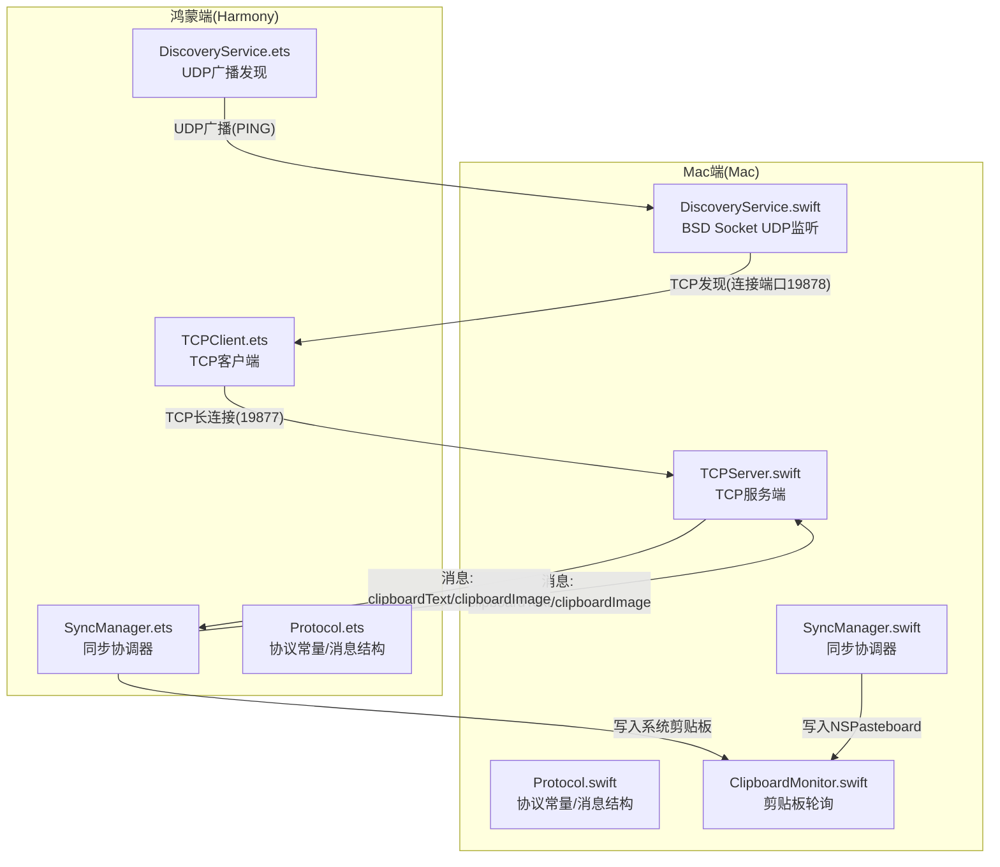
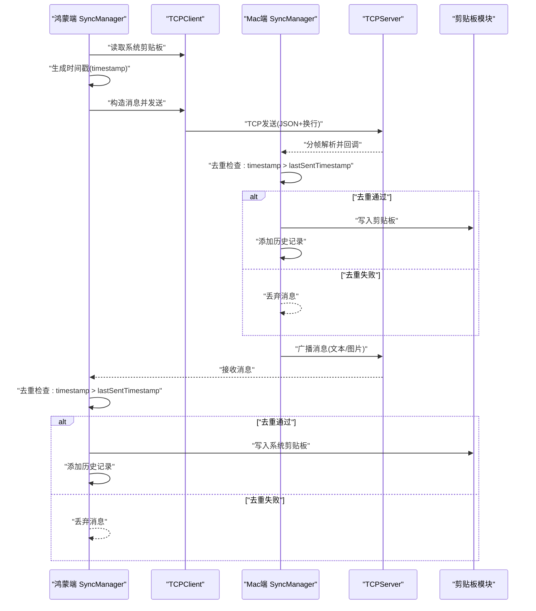
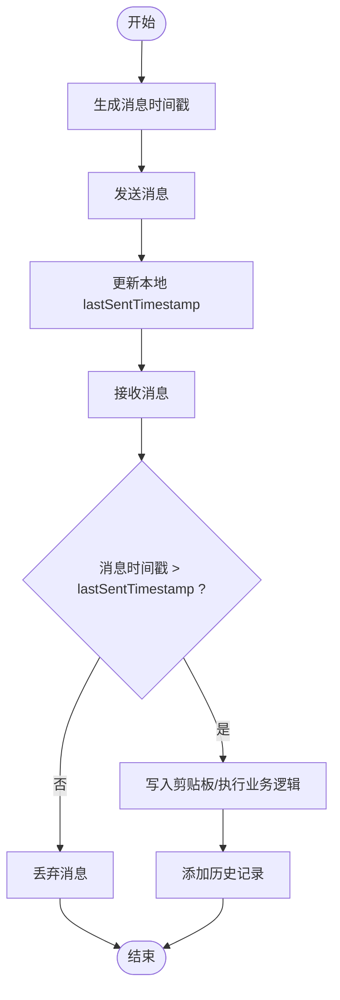
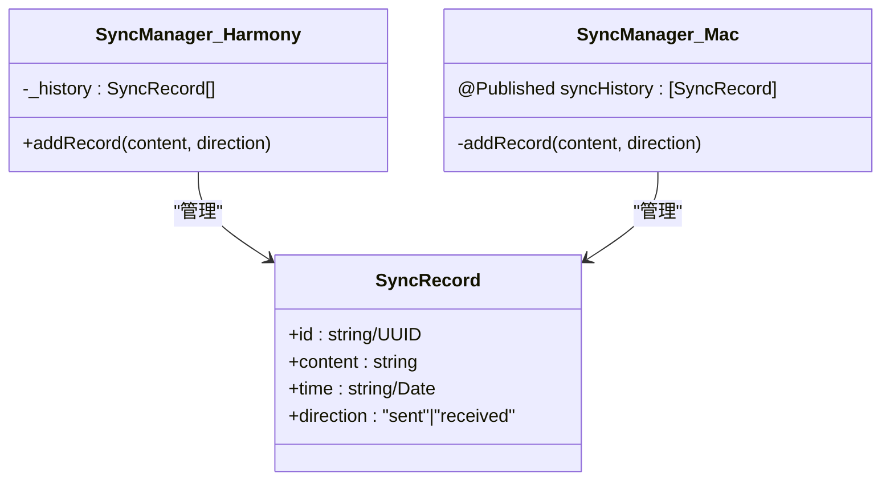
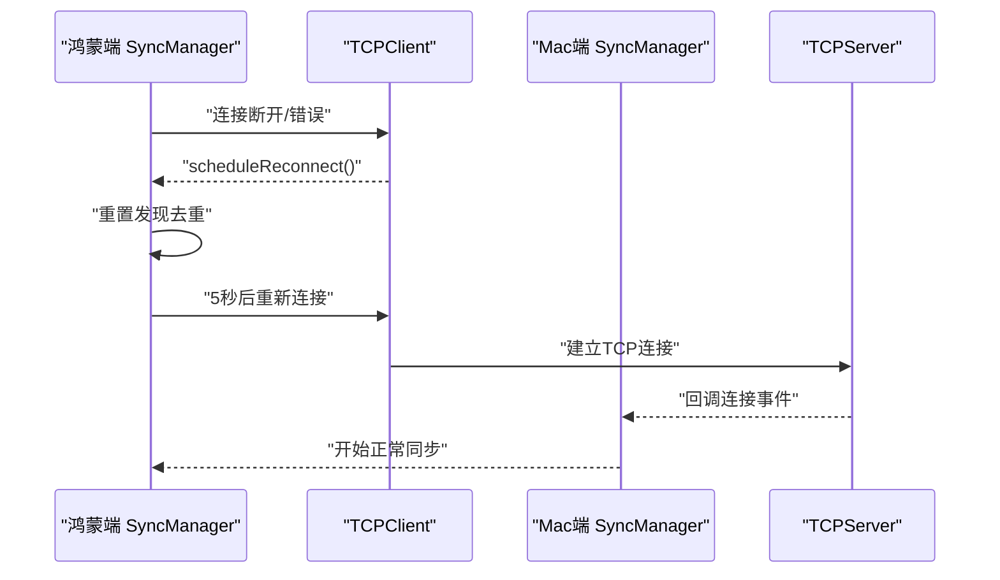
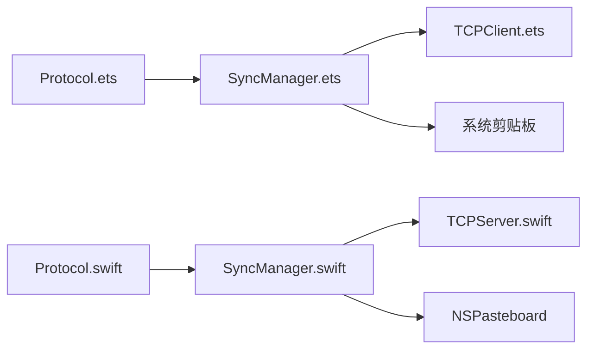

# 一致性保证机制

<cite>
**本文档引用的文件**
- [SyncManager.ets](file://ClipboardSync/harmony/entry/src/main/ets/model/SyncManager.ets)
- [SyncManager.swift](file://ClipboardSync/mac/ClipboardSync/SyncManager.swift)
- [Protocol.ets](file://ClipboardSync/harmony/entry/src/main/ets/common/Protocol.ets)
- [Protocol.swift](file://ClipboardSync/mac/ClipboardSync/Protocol.swift)
- [TCPClient.ets](file://ClipboardSync/harmony/entry/src/main/ets/common/TCPClient.ets)
- [TCPServer.swift](file://ClipboardSync/mac/ClipboardSync/TCPServer.swift)
- [DiscoveryService.ets](file://ClipboardSync/harmony/entry/src/main/ets/common/DiscoveryService.ets)
- [DiscoveryTCPServer.ets](file://ClipboardSync/harmony/entry/src/main/ets/common/DiscoveryTCPServer.ets)
- [DiscoveryService.swift](file://ClipboardSync/mac/ClipboardSync/DiscoveryService.swift)
- [ClipboardMonitor.swift](file://ClipboardSync/mac/ClipboardSync/ClipboardMonitor.swift)
- [PROJECT.md](file://ClipboardSync/PROJECT.md)
</cite>

## 目录
1. [简介](#简介)
2. [项目结构](#项目结构)
3. [核心组件](#核心组件)
4. [架构总览](#架构总览)
5. [详细组件分析](#详细组件分析)
6. [依赖关系分析](#依赖关系分析)
7. [性能考量](#性能考量)
8. [故障排查指南](#故障排查指南)
9. [结论](#结论)

## 简介
本文件聚焦于 ClipboardSync 项目的一致性保证机制，系统性阐述以下方面：
- 如何确保数据同步的一致性和完整性
- 去重防环机制的实现原理（基于时间戳比较与 lastSentTimestamp 管理）
- 消息顺序保证与乱序处理机制
- 历史记录的存储策略与查询机制（最多保存 50 条）
- 断线重连后的数据同步策略与状态恢复机制
- 一致性问题的检测与诊断方法
- 不同网络环境下的保障措施

## 项目结构
项目采用跨平台架构，两端分别负责设备发现、TCP 连接与剪贴板监听，并通过统一的协议进行消息传递。整体结构如下图所示：

图表来源
- [DiscoveryService.ets:10-161](file://ClipboardSync/harmony/entry/src/main/ets/common/DiscoveryService.ets#L10-L161)
- [TCPClient.ets:11-181](file://ClipboardSync/harmony/entry/src/main/ets/common/TCPClient.ets#L11-L181)
- [SyncManager.ets:26-301](file://ClipboardSync/harmony/entry/src/main/ets/model/SyncManager.ets#L26-L301)
- [DiscoveryService.swift:6-197](file://ClipboardSync/mac/ClipboardSync/DiscoveryService.swift#L6-L197)
- [TCPServer.swift:6-174](file://ClipboardSync/mac/ClipboardSync/TCPServer.swift#L6-L174)
- [SyncManager.swift:5-154](file://ClipboardSync/mac/ClipboardSync/SyncManager.swift#L5-L154)
- [ClipboardMonitor.swift:4-73](file://ClipboardSync/mac/ClipboardSync/ClipboardMonitor.swift#L4-L73)
- [Protocol.ets:2-27](file://ClipboardSync/harmony/entry/src/main/ets/common/Protocol.ets#L2-L27)
- [Protocol.swift:4-43](file://ClipboardSync/mac/ClipboardSync/Protocol.swift#L4-L43)

章节来源
- [PROJECT.md:52-63](file://ClipboardSync/PROJECT.md#L52-L63)

## 核心组件
- 协议层：定义消息类型、时间戳字段与设备标识，确保两端消息结构一致。
- 设备发现层：通过 UDP 广播与 TCP 发现端口配合，实现跨端可达性与 IP 获取。
- 连接层：TCP 客户端/服务端负责可靠数据传输，内置粘包处理与重连机制。
- 同步协调层：两端的 SyncManager 负责状态管理、去重防环、历史记录与剪贴板写入。
- 剪贴板监听层：轮询系统剪贴板变化，区分文本与图片，避免回环写入。

章节来源
- [Protocol.ets:12-27](file://ClipboardSync/harmony/entry/src/main/ets/common/Protocol.ets#L12-L27)
- [Protocol.swift:19-43](file://ClipboardSync/mac/ClipboardSync/Protocol.swift#L19-L43)
- [SyncManager.ets:26-301](file://ClipboardSync/harmony/entry/src/main/ets/model/SyncManager.ets#L26-L301)
- [SyncManager.swift:5-154](file://ClipboardSync/mac/ClipboardSync/SyncManager.swift#L5-L154)
- [TCPClient.ets:11-181](file://ClipboardSync/harmony/entry/src/main/ets/common/TCPClient.ets#L11-L181)
- [TCPServer.swift:6-174](file://ClipboardSync/mac/ClipboardSync/TCPServer.swift#L6-L174)
- [DiscoveryService.ets:10-161](file://ClipboardSync/harmony/entry/src/main/ets/common/DiscoveryService.ets#L10-L161)
- [DiscoveryService.swift:6-197](file://ClipboardSync/mac/ClipboardSync/DiscoveryService.swift#L6-L197)
- [ClipboardMonitor.swift:4-73](file://ClipboardSync/mac/ClipboardSync/ClipboardMonitor.swift#L4-L73)

## 架构总览
系统采用“设备发现 + TCP 长连接”的架构，两端通过统一协议进行消息交换。去重防环与历史记录管理由两端的 SyncManager 实现，剪贴板读写由各端专用模块负责。

图表来源
- [SyncManager.ets:178-198](file://ClipboardSync/harmony/entry/src/main/ets/model/SyncManager.ets#L178-L198)
- [SyncManager.swift:95-115](file://ClipboardSync/mac/ClipboardSync/SyncManager.swift#L95-L115)
- [TCPClient.ets:44-58](file://ClipboardSync/harmony/entry/src/main/ets/common/TCPClient.ets#L44-L58)
- [TCPServer.swift:60-67](file://ClipboardSync/mac/ClipboardSync/TCPServer.swift#L60-L67)
- [ClipboardMonitor.swift:30-48](file://ClipboardSync/mac/ClipboardSync/ClipboardMonitor.swift#L30-L48)

## 详细组件分析

### 去重防环机制与时间戳比较
- 机制原理
  - 每条消息携带时间戳字段，两端在发送时设置为当前时间（秒级）。
  - 接收端维护一个 lastSentTimestamp，仅处理“消息时间戳大于 lastSentTimestamp”的消息，其余丢弃。
  - 发送端在发送成功后更新本地 lastSentTimestamp，避免回环写入触发的重复处理。
- 实现位置
  - 鸿蒙端：发送前设置时间戳并更新 lastSentTimestamp；接收时比较时间戳并丢弃过期消息。
  - Mac 端：发送前设置时间戳并更新 lastSentTimestamp；接收时比较时间戳并丢弃过期消息。
- 作用范围
  - 防止“写入剪贴板 → 触发监听 → 再次发送 → 死循环”的回环。
  - 在网络抖动或重复消息到达时，确保只处理最新有效消息。

图表来源
- [SyncManager.ets:256-269](file://ClipboardSync/harmony/entry/src/main/ets/model/SyncManager.ets#L256-L269)
- [SyncManager.ets:178-198](file://ClipboardSync/harmony/entry/src/main/ets/model/SyncManager.ets#L178-L198)
- [SyncManager.swift:117-142](file://ClipboardSync/mac/ClipboardSync/SyncManager.swift#L117-L142)
- [SyncManager.swift:95-115](file://ClipboardSync/mac/ClipboardSync/SyncManager.swift#L95-L115)

章节来源
- [SyncManager.ets:35-35](file://ClipboardSync/harmony/entry/src/main/ets/model/SyncManager.ets#L35-L35)
- [SyncManager.ets:256-269](file://ClipboardSync/harmony/entry/src/main/ets/model/SyncManager.ets#L256-L269)
- [SyncManager.ets:178-198](file://ClipboardSync/harmony/entry/src/main/ets/model/SyncManager.ets#L178-L198)
- [SyncManager.swift:16-16](file://ClipboardSync/mac/ClipboardSync/SyncManager.swift#L16-L16)
- [SyncManager.swift:117-142](file://ClipboardSync/mac/ClipboardSync/SyncManager.swift#L117-L142)
- [SyncManager.swift:95-115](file://ClipboardSync/mac/ClipboardSync/SyncManager.swift#L95-L115)

### 消息顺序保证与乱序处理
- 顺序保证
  - 时间戳单调递增：发送端以秒级时间戳作为排序依据，天然具备顺序特征。
  - 去重阈值：仅处理“严格大于 lastSentTimestamp”的消息，避免重复或过期消息影响顺序。
- 乱序处理
  - 乱序容忍：系统不对消息进行队列重排，仅通过时间戳阈值过滤无效消息。
  - 适用场景：局域网内低延迟传输，乱序概率极低；若出现乱序，系统仍可正确去重，不会产生重复写入。
- 传输层可靠性
  - TCP 长连接提供有序、可靠的数据传输，结合换行分隔的 JSON 消息，减少粘包/拆包风险。

章节来源
- [TCPClient.ets:115-146](file://ClipboardSync/harmony/entry/src/main/ets/common/TCPClient.ets#L115-L146)
- [TCPServer.swift:129-148](file://ClipboardSync/mac/ClipboardSync/TCPServer.swift#L129-L148)
- [Protocol.ets:20-27](file://ClipboardSync/harmony/entry/src/main/ets/common/Protocol.ets#L20-L27)
- [Protocol.swift:28-43](file://ClipboardSync/mac/ClipboardSync/Protocol.swift#L28-L43)

### 历史记录存储策略与查询机制
- 存储策略
  - 鸿蒙端：每次发送/接收后添加一条记录，最多保留 50 条，超过上限则截断保留最新 50 条。
  - Mac 端：每次发送/接收后添加一条记录，最多保留 50 条，超过上限则截断保留最新 50 条。
- 记录内容
  - 包含：唯一 ID、内容摘要（文本截断或占位符）、时间戳、方向（发送/接收）。
- 查询与展示
  - 两端均提供历史列表属性，UI 层可直接绑定展示。
  - 添加记录时触发状态变更回调，驱动 UI 更新。

图表来源
- [SyncManager.ets:8-13](file://ClipboardSync/harmony/entry/src/main/ets/model/SyncManager.ets#L8-L13)
- [SyncManager.ets:287-299](file://ClipboardSync/harmony/entry/src/main/ets/model/SyncManager.ets#L287-L299)
- [SyncManager.swift:24-34](file://ClipboardSync/mac/ClipboardSync/SyncManager.swift#L24-L34)
- [SyncManager.swift:144-152](file://ClipboardSync/mac/ClipboardSync/SyncManager.swift#L144-L152)

章节来源
- [SyncManager.ets:48-51](file://ClipboardSync/harmony/entry/src/main/ets/model/SyncManager.ets#L48-L51)
- [SyncManager.ets:287-299](file://ClipboardSync/harmony/entry/src/main/ets/model/SyncManager.ets#L287-L299)
- [SyncManager.swift:9-9](file://ClipboardSync/mac/ClipboardSync/SyncManager.swift#L9-L9)
- [SyncManager.swift:144-152](file://ClipboardSync/mac/ClipboardSync/SyncManager.swift#L144-L152)

### 断线重连后的数据同步策略与状态恢复
- 断线重连
  - 鸿蒙端：TCPClient 在连接关闭或错误时调度 5 秒后重连，避免频繁重试。
  - Mac 端：TCPServer 维护连接集合，断开后移除连接并触发状态回调。
- 状态恢复
  - 设备发现去重：断线后重置已发现设备列表，允许重新发现同一设备并自动重连。
  - 剪贴板状态：两端通过 changeCount 与 isRemoteUpdate 字段避免回环写入。
- 连接建立后
  - 两端立即进入“已连接”状态，开始正常的消息收发与历史记录更新。

图表来源
- [TCPClient.ets:148-157](file://ClipboardSync/harmony/entry/src/main/ets/common/TCPClient.ets#L148-L157)
- [SyncManager.ets:150-157](file://ClipboardSync/harmony/entry/src/main/ets/model/SyncManager.ets#L150-L157)
- [DiscoveryService.ets:19-23](file://ClipboardSync/harmony/entry/src/main/ets/common/DiscoveryService.ets#L19-L23)
- [TCPServer.swift:99-106](file://ClipboardSync/mac/ClipboardSync/TCPServer.swift#L99-L106)

章节来源
- [TCPClient.ets:148-157](file://ClipboardSync/harmony/entry/src/main/ets/common/TCPClient.ets#L148-L157)
- [SyncManager.ets:150-157](file://ClipboardSync/harmony/entry/src/main/ets/model/SyncManager.ets#L150-L157)
- [DiscoveryService.ets:19-23](file://ClipboardSync/harmony/entry/src/main/ets/common/DiscoveryService.ets#L19-L23)
- [TCPServer.swift:99-106](file://ClipboardSync/mac/ClipboardSync/TCPServer.swift#L99-L106)

### 设备发现与连接建立
- 鸿蒙端
  - UDP 广播：定时发送 PING 广播，监听广播并去重，回调发现的新设备。
  - TCP 发现：监听端口 19878，从连接中获取 Mac 的 IP 地址，避免 UDP 无法到达的问题。
- Mac 端
  - BSD Socket 监听 UDP 广播，去重后回调发现设备。
  - 对新设备发起 TCP 发现连接（端口 19878），让鸿蒙端获取 Mac IP。
- 连接建立
  - 鸿蒙端根据获取的 Mac IP 建立 TCP 长连接，开始数据传输。

章节来源
- [DiscoveryService.ets:25-95](file://ClipboardSync/harmony/entry/src/main/ets/common/DiscoveryService.ets#L25-L95)
- [DiscoveryService.ets:126-161](file://ClipboardSync/harmony/entry/src/main/ets/common/DiscoveryService.ets#L126-L161)
- [DiscoveryTCPServer.ets:18-78](file://ClipboardSync/harmony/entry/src/main/ets/common/DiscoveryTCPServer.ets#L18-L78)
- [DiscoveryService.swift:33-100](file://ClipboardSync/mac/ClipboardSync/DiscoveryService.swift#L33-L100)
- [DiscoveryService.swift:151-180](file://ClipboardSync/mac/ClipboardSync/DiscoveryService.swift#L151-L180)

## 依赖关系分析
- 协议层：两端共享消息结构与常量，确保序列化/反序列化一致。
- 连接层：TCPClient/TCPServer 负责底层网络细节，上层仅关注消息收发。
- 同步层：两端 SyncManager 负责业务逻辑（去重、历史、状态），并协调各子模块。
- 剪贴板层：两端独立实现，避免跨端耦合。

图表来源
- [Protocol.ets:2-27](file://ClipboardSync/harmony/entry/src/main/ets/common/Protocol.ets#L2-L27)
- [Protocol.swift:4-43](file://ClipboardSync/mac/ClipboardSync/Protocol.swift#L4-L43)
- [SyncManager.ets:26-301](file://ClipboardSync/harmony/entry/src/main/ets/model/SyncManager.ets#L26-L301)
- [SyncManager.swift:5-154](file://ClipboardSync/mac/ClipboardSync/SyncManager.swift#L5-L154)
- [TCPClient.ets:11-181](file://ClipboardSync/harmony/entry/src/main/ets/common/TCPClient.ets#L11-L181)
- [TCPServer.swift:6-174](file://ClipboardSync/mac/ClipboardSync/TCPServer.swift#L6-L174)

## 性能考量
- 轮询间隔
  - 鸿蒙端：剪贴板轮询间隔为 500ms，兼顾响应速度与资源消耗。
  - Mac 端：剪贴板轮询间隔为 0.5 秒，与鸿蒙端保持一致。
- 重连策略
  - 鸿蒙端：断线后 5 秒重连，避免频繁重试导致资源浪费。
- 历史记录上限
  - 两端均限制为 50 条，控制内存占用与 UI 渲染成本。
- 传输效率
  - TCP 长连接 + 换行分隔 JSON，减少粘包/拆包复杂度，提升吞吐稳定性。

章节来源
- [Protocol.ets:6-7](file://ClipboardSync/harmony/entry/src/main/ets/common/Protocol.ets#L6-L7)
- [Protocol.swift:11-14](file://ClipboardSync/mac/ClipboardSync/Protocol.swift#L11-L14)
- [TCPClient.ets:148-157](file://ClipboardSync/harmony/entry/src/main/ets/common/TCPClient.ets#L148-L157)
- [SyncManager.ets:287-299](file://ClipboardSync/harmony/entry/src/main/ets/model/SyncManager.ets#L287-L299)
- [SyncManager.swift:144-152](file://ClipboardSync/mac/ClipboardSync/SyncManager.swift#L144-L152)

## 故障排查指南
- 常见问题与定位
  - “写入后再次触发同步”：检查去重逻辑是否生效（时间戳比较与 lastSentTimestamp 是否更新）。
  - “连接频繁断开”：查看 TCPClient 重连日志与错误码，确认网络稳定性与防火墙设置。
  - “设备发现失败”：确认 UDP 广播端口与广播地址正确，检查防火墙与路由器设置。
  - “图片同步异常”：确认 Mac 端图片编码为 PNG，鸿蒙端接收实现是否完善。
- 诊断手段
  - 日志输出：两端均提供发现与 TCP 日志，便于定位阶段问题。
  - 历史记录：通过 UI 查看最近 50 条记录，核对发送/接收方向与时间。
  - 状态切换：观察连接状态变化（未连接/搜索设备中/已连接），判断流程是否按预期推进。

章节来源
- [SyncManager.ets:62-70](file://ClipboardSync/harmony/entry/src/main/ets/model/SyncManager.ets#L62-L70)
- [TCPClient.ets:148-157](file://ClipboardSync/harmony/entry/src/main/ets/common/TCPClient.ets#L148-L157)
- [DiscoveryService.ets:126-161](file://ClipboardSync/harmony/entry/src/main/ets/common/DiscoveryService.ets#L126-L161)
- [PROJECT.md:102-127](file://ClipboardSync/PROJECT.md#L102-L127)

## 结论
ClipboardSync 通过“时间戳去重 + TCP 可靠传输 + 剪贴板轮询 + 历史记录上限”的组合机制，在局域网环境中实现了稳定的一致性与完整性保障。去重防环机制有效避免回环写入，历史记录帮助用户追溯同步过程，断线重连策略确保连接稳定性。在不同网络环境下，系统通过合理的轮询间隔、重连策略与粘包处理，维持良好的用户体验与数据一致性。