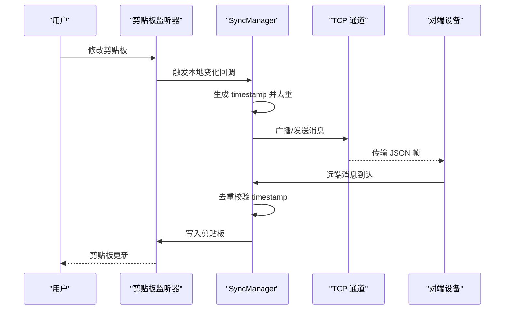
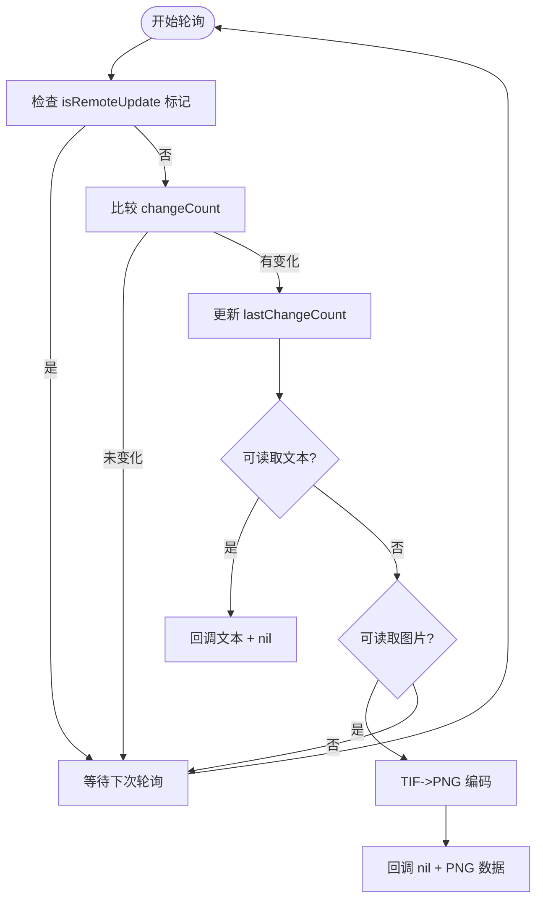
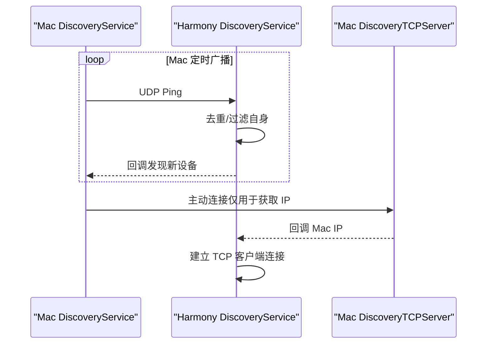
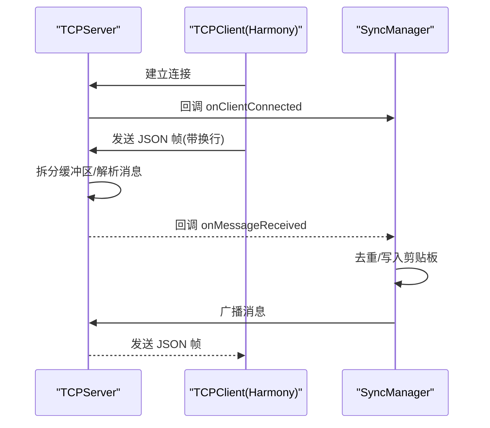
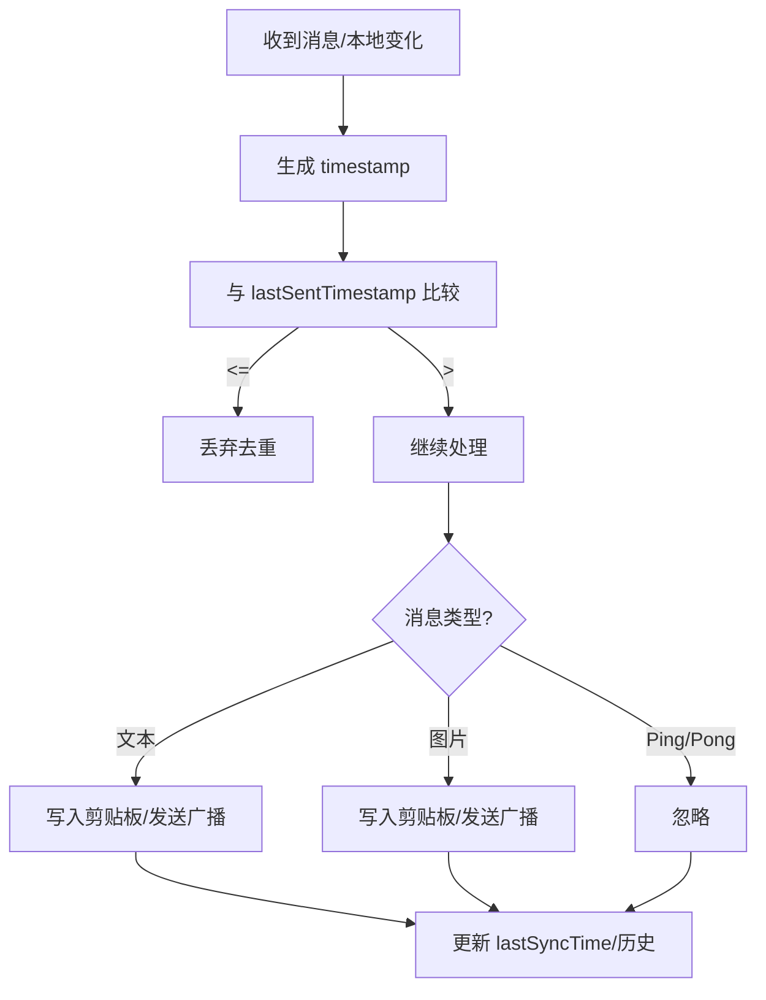
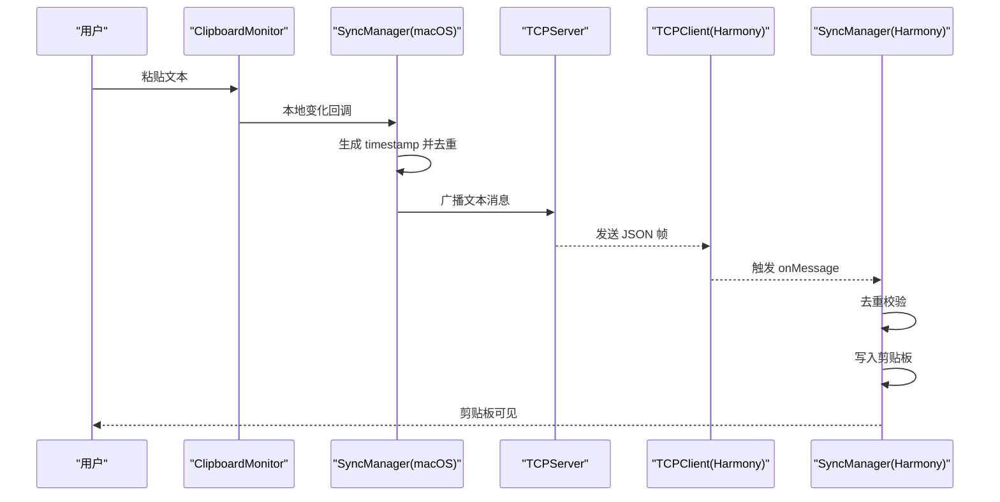
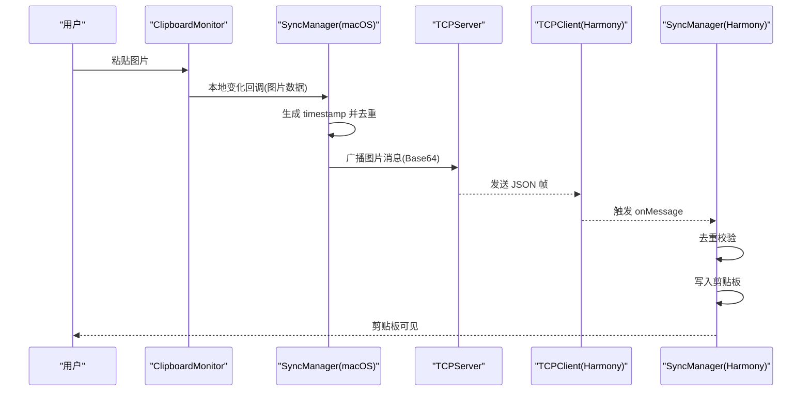

# 数据处理流程

<cite>
**本文引用的文件**
- [ClipboardMonitor.swift](file://ClipboardSync/mac/ClipboardSync/ClipboardMonitor.swift)
- [SyncManager.swift](file://ClipboardSync/mac/ClipboardSync/SyncManager.swift)
- [Protocol.swift](file://ClipboardSync/mac/ClipboardSync/Protocol.swift)
- [DiscoveryService.swift](file://ClipboardSync/mac/ClipboardSync/DiscoveryService.swift)
- [TCPServer.swift](file://ClipboardSync/mac/ClipboardSync/TCPServer.swift)
- [SyncManager.ets](file://ClipboardSync/harmony/entry/src/main/ets/model/SyncManager.ets)
- [DiscoveryService.ets](file://ClipboardSync/harmony/entry/src/main/ets/common/DiscoveryService.ets)
- [DiscoveryTCPServer.ets](file://ClipboardSync/harmony/entry/src/main/ets/common/DiscoveryTCPServer.ets)
- [Protocol.ets](file://ClipboardSync/harmony/entry/src/main/ets/common/Protocol.ets)
- [TCPClient.ets](file://ClipboardSync/harmony/entry/src/main/ets/common/TCPClient.ets)
</cite>

## 目录
1. [简介](#简介)
2. [项目结构](#项目结构)
3. [核心组件](#核心组件)
4. [架构总览](#架构总览)
5. [详细组件分析](#详细组件分析)
6. [依赖关系分析](#依赖关系分析)
7. [性能考量](#性能考量)
8. [故障排查指南](#故障排查指南)
9. [结论](#结论)

## 简介
本文件聚焦 ClipboardSync 项目的数据处理流程，系统性阐述从剪贴板变化检测到最终同步完成的完整数据流转过程。内容涵盖：
- 剪贴板监听器的工作机制与轮询策略
- SyncManager 如何协调设备发现、TCP 连接管理与消息路由
- 去重防环机制的实现原理，重点说明 timestamp 字段的作用与比较逻辑
- 典型场景的数据流图：文本同步与图片同步
- 异常情况的处理策略与错误恢复机制

## 项目结构
项目采用跨平台架构，分别在 macOS（Swift）与 Harmony（ArkTS）两端实现相同功能：
- macOS 端：以 AppKit 为基础的剪贴板监听、基于 Network.framework 的 TCP 服务端、基于 BSD Socket 的 UDP 发现
- Harmony 端：基于 BasicServicesKit 的剪贴板轮询、NetworkKit 的 TCP 客户端、基于 NetworkKit 的 UDP 发现与 TCP 发现服务端

```mermaid
graph TB
subgraph "macOS 端"
CM["ClipboardMonitor.swift<br/>剪贴板轮询/写入"]
SM_M["SyncManager.swift<br/>协调/去重/历史"]
DS_M["DiscoveryService.swift<br/>UDP 广播/监听"]
TS_M["TCPServer.swift<br/>TCP 服务端/粘包处理"]
end
subgraph "Harmony 端"
SM_H["SyncManager.ets<br/>协调/去重/历史"]
DS_H["DiscoveryService.ets<br/>UDP 广播/监听"]
DTS_H["DiscoveryTCPServer.ets<br/>TCP 发现服务端"]
TCP_H["TCPClient.ets<br/>TCP 客户端/重连"]
end
CM --> SM_M
SM_M --> TS_M
DS_M --> SM_M
SM_M --> CM
SM_H --> TCP_H
DS_H --> SM_H
DTS_H -. "TCP 发现" .-> SM_H
TS_M <- --> TCP_H
```

图表来源
- [ClipboardMonitor.swift:1-73](file://ClipboardSync/mac/ClipboardSync/ClipboardMonitor.swift#L1-L73)
- [SyncManager.swift:1-154](file://ClipboardSync/mac/ClipboardSync/SyncManager.swift#L1-L154)
- [DiscoveryService.swift:1-197](file://ClipboardSync/mac/ClipboardSync/DiscoveryService.swift#L1-L197)
- [TCPServer.swift:1-174](file://ClipboardSync/mac/ClipboardSync/TCPServer.swift#L1-L174)
- [SyncManager.ets:1-301](file://ClipboardSync/harmony/entry/src/main/ets/model/SyncManager.ets#L1-L301)
- [DiscoveryService.ets:1-161](file://ClipboardSync/harmony/entry/src/main/ets/common/DiscoveryService.ets#L1-L161)
- [DiscoveryTCPServer.ets:1-80](file://ClipboardSync/harmony/entry/src/main/ets/common/DiscoveryTCPServer.ets#L1-L80)
- [TCPClient.ets:1-181](file://ClipboardSync/harmony/entry/src/main/ets/common/TCPClient.ets#L1-L181)

章节来源
- [ClipboardMonitor.swift:1-73](file://ClipboardSync/mac/ClipboardSync/ClipboardMonitor.swift#L1-L73)
- [SyncManager.swift:1-154](file://ClipboardSync/mac/ClipboardSync/SyncManager.swift#L1-L154)
- [DiscoveryService.swift:1-197](file://ClipboardSync/mac/ClipboardSync/DiscoveryService.swift#L1-L197)
- [TCPServer.swift:1-174](file://ClipboardSync/mac/ClipboardSync/TCPServer.swift#L1-L174)
- [SyncManager.ets:1-301](file://ClipboardSync/harmony/entry/src/main/ets/model/SyncManager.ets#L1-L301)
- [DiscoveryService.ets:1-161](file://ClipboardSync/harmony/entry/src/main/ets/common/DiscoveryService.ets#L1-L161)
- [DiscoveryTCPServer.ets:1-80](file://ClipboardSync/harmony/entry/src/main/ets/common/DiscoveryTCPServer.ets#L1-L80)
- [TCPClient.ets:1-181](file://ClipboardSync/harmony/entry/src/main/ets/common/TCPClient.ets#L1-L181)

## 核心组件
- 剪贴板监听器（macOS：ClipboardMonitor；Harmony：轮询 SystemPasteboard）
- 同步管理器（SyncManager）：负责状态管理、设备发现、TCP 连接、消息路由与去重
- 通信协议（Protocol/ProtocolConst）：定义消息结构、端口、轮询间隔与设备 ID
- 设备发现（UDP 广播 + TCP 发现）：UDP 用于发现在线设备，TCP 用于 Mac 主动告知 IP
- TCP 通道：macOS 作为服务端，Harmony 作为客户端，使用换行分隔的 JSON 消息

章节来源
- [ClipboardMonitor.swift:1-73](file://ClipboardSync/mac/ClipboardSync/ClipboardMonitor.swift#L1-L73)
- [SyncManager.swift:1-154](file://ClipboardSync/mac/ClipboardSync/SyncManager.swift#L1-L154)
- [Protocol.swift:1-43](file://ClipboardSync/mac/ClipboardSync/Protocol.swift#L1-L43)
- [SyncManager.ets:1-301](file://ClipboardSync/harmony/entry/src/main/ets/model/SyncManager.ets#L1-L301)
- [Protocol.ets:1-27](file://ClipboardSync/harmony/entry/src/main/ets/common/Protocol.ets#L1-L27)

## 架构总览
系统采用“发现-连接-同步”的三层架构：
- 发现阶段：双方通过 UDP 广播与监听互相发现，Harmony 侧还通过 TCP 发现服务端让 Mac 主动上报 IP
- 连接阶段：建立 TCP 连接，使用换行分隔的 JSON 文本帧进行消息传输
- 同步阶段：本地剪贴板变化或远端消息到达时，经由 SyncManager 处理，执行去重与写入剪贴板/广播



图表来源
- [ClipboardMonitor.swift:16-71](file://ClipboardSync/mac/ClipboardSync/ClipboardMonitor.swift#L16-L71)
- [SyncManager.swift:95-142](file://ClipboardSync/mac/ClipboardSync/SyncManager.swift#L95-L142)
- [TCPServer.swift:60-67](file://ClipboardSync/mac/ClipboardSync/TCPServer.swift#L60-L67)
- [TCPClient.ets:30-58](file://ClipboardSync/harmony/entry/src/main/ets/common/TCPClient.ets#L30-L58)

## 详细组件分析

### 剪贴板监听器（macOS）
- 轮询策略：定时器以固定周期检查 NSPasteboard.changeCount，避免系统回调不可用或遗漏
- 变化检测：当 changeCount 变化且非远程写入标记时，判定为本地变化
- 数据读取顺序：优先读取文本，其次尝试读取 TIFF 并转换为 PNG
- 写入控制：写入剪贴板时设置远程更新标记，防止写回环；写入后更新 lastChangeCount



图表来源
- [ClipboardMonitor.swift:50-71](file://ClipboardSync/mac/ClipboardSync/ClipboardMonitor.swift#L50-L71)

章节来源
- [ClipboardMonitor.swift:16-71](file://ClipboardSync/mac/ClipboardSync/ClipboardMonitor.swift#L16-L71)

### 剪贴板轮询（Harmony）
- 轮询策略：基于定时器周期性调用 SystemPasteboard.getChangeCount 与 getDataSync
- 变化检测：changeCount 变化时读取主文本，触发发送
- 写入控制：写入剪贴板时设置 isRemoteUpdate 标记，避免回环

章节来源
- [SyncManager.ets:202-252](file://ClipboardSync/harmony/entry/src/main/ets/model/SyncManager.ets#L202-L252)

### 设备发现（UDP 广播与 TCP 发现）
- UDP 广播：定时向广播地址发送 Ping 消息，监听端接收后解析消息，过滤自身设备 ID，并对新设备回调
- TCP 发现（macOS）：监听端口用于接收 Mac 的主动连接，从连接中提取 Mac 的 IP 地址，便于 Harmony 主动连接
- 去重策略：双方均维护已发现设备集合，避免重复触发连接



图表来源
- [DiscoveryService.swift:104-146](file://ClipboardSync/mac/ClipboardSync/DiscoveryService.swift#L104-L146)
- [DiscoveryService.ets:87-95](file://ClipboardSync/harmony/entry/src/main/ets/common/DiscoveryService.ets#L87-L95)
- [DiscoveryService.ets:126-160](file://ClipboardSync/harmony/entry/src/main/ets/common/DiscoveryService.ets#L126-L160)
- [DiscoveryTCPServer.ets:18-78](file://ClipboardSync/harmony/entry/src/main/ets/common/DiscoveryTCPServer.ets#L18-L78)

章节来源
- [DiscoveryService.swift:15-100](file://ClipboardSync/mac/ClipboardSync/DiscoveryService.swift#L15-L100)
- [DiscoveryService.ets:25-95](file://ClipboardSync/harmony/entry/src/main/ets/common/DiscoveryService.ets#L25-L95)
- [DiscoveryTCPServer.ets:18-78](file://ClipboardSync/harmony/entry/src/main/ets/common/DiscoveryTCPServer.ets#L18-L78)

### TCP 通道与消息路由（macOS 服务端）
- 服务端：监听指定端口，接受连接，维护连接列表与每连接缓冲区，按换行符拆分消息帧
- 广播：将编码后的消息以换行符结尾后广播给所有已连接客户端
- 错误处理：接收/发送错误时移除连接，保持状态一致性



图表来源
- [TCPServer.swift:23-97](file://ClipboardSync/mac/ClipboardSync/TCPServer.swift#L23-L97)
- [TCPServer.swift:129-148](file://ClipboardSync/mac/ClipboardSync/TCPServer.swift#L129-L148)
- [TCPServer.swift:60-67](file://ClipboardSync/mac/ClipboardSync/TCPServer.swift#L60-L67)
- [TCPClient.ets:30-58](file://ClipboardSync/harmony/entry/src/main/ets/common/TCPClient.ets#L30-L58)

章节来源
- [TCPServer.swift:1-174](file://ClipboardSync/mac/ClipboardSync/TCPServer.swift#L1-L174)
- [TCPClient.ets:1-181](file://ClipboardSync/harmony/entry/src/main/ets/common/TCPClient.ets#L1-L181)

### SyncManager 协调与去重防环
- 状态管理：discovering/disconnected/connected 三态，根据连接与发现事件切换
- 去重机制：使用 timestamp 字段与 lastSentTimestamp 比较，确保消息不会回环
- 历史记录：维护最近 50 条同步记录，支持方向（发送/接收）



图表来源
- [SyncManager.swift:95-142](file://ClipboardSync/mac/ClipboardSync/SyncManager.swift#L95-L142)
- [SyncManager.ets:178-198](file://ClipboardSync/harmony/entry/src/main/ets/model/SyncManager.ets#L178-L198)

章节来源
- [SyncManager.swift:15-53](file://ClipboardSync/mac/ClipboardSync/SyncManager.swift#L15-L53)
- [SyncManager.swift:95-142](file://ClipboardSync/mac/ClipboardSync/SyncManager.swift#L95-L142)
- [SyncManager.ets:36-71](file://ClipboardSync/harmony/entry/src/main/ets/model/SyncManager.ets#L36-L71)
- [SyncManager.ets:178-198](file://ClipboardSync/harmony/entry/src/main/ets/model/SyncManager.ets#L178-L198)

### 典型场景数据流图

#### 文本同步（macOS → Harmony）


图表来源
- [ClipboardMonitor.swift:56-59](file://ClipboardSync/mac/ClipboardSync/ClipboardMonitor.swift#L56-L59)
- [SyncManager.swift:117-142](file://ClipboardSync/mac/ClipboardSync/SyncManager.swift#L117-L142)
- [TCPServer.swift:60-67](file://ClipboardSync/mac/ClipboardSync/TCPServer.swift#L60-L67)
- [TCPClient.ets:115-146](file://ClipboardSync/harmony/entry/src/main/ets/common/TCPClient.ets#L115-L146)
- [SyncManager.ets:178-198](file://ClipboardSync/harmony/entry/src/main/ets/model/SyncManager.ets#L178-L198)

#### 图片同步（macOS → Harmony）


图表来源
- [ClipboardMonitor.swift:62-70](file://ClipboardSync/mac/ClipboardSync/ClipboardMonitor.swift#L62-L70)
- [SyncManager.swift:131-141](file://ClipboardSync/mac/ClipboardSync/SyncManager.swift#L131-L141)
- [TCPServer.swift:60-67](file://ClipboardSync/mac/ClipboardSync/TCPServer.swift#L60-L67)
- [TCPClient.ets:115-146](file://ClipboardSync/harmony/entry/src/main/ets/common/TCPClient.ets#L115-L146)
- [SyncManager.ets:178-198](file://ClipboardSync/harmony/entry/src/main/ets/model/SyncManager.ets#L178-L198)

## 依赖关系分析
- macOS 端
  - SyncManager 依赖 ClipboardMonitor、DiscoveryService、TCPServer
  - TCPServer 依赖 Network.framework 的 NWListener/NWConnection
  - DiscoveryService 依赖 BSD Socket 与 NIO 风格的队列处理
- Harmony 端
  - SyncManager 依赖 DiscoveryService、DiscoveryTCPServer、TCPClient
  - TCPClient 依赖 NetworkKit 的 TCPSocket
  - DiscoveryService 依赖 NetworkKit 的 UDPSocket

```mermaid
graph LR
SM_M["SyncManager(macOS)"] --> CM["ClipboardMonitor"]
SM_M --> DS_M["DiscoveryService(macOS)"]
SM_M --> TS_M["TCPServer(macOS)"]
SM_H["SyncManager(Harmony)"] --> DS_H["DiscoveryService(Harmony)"]
SM_H --> DTS_H["DiscoveryTCPServer(Harmony)"]
SM_H --> TCP_H["TCPClient(Harmony)"]
TS_M <- --> TCP_H
```

图表来源
- [SyncManager.swift:11-13](file://ClipboardSync/mac/ClipboardSync/SyncManager.swift#L11-L13)
- [DiscoveryService.swift:6-13](file://ClipboardSync/mac/ClipboardSync/DiscoveryService.swift#L6-L13)
- [TCPServer.swift:6-17](file://ClipboardSync/mac/ClipboardSync/TCPServer.swift#L6-L17)
- [SyncManager.ets:27-30](file://ClipboardSync/harmony/entry/src/main/ets/model/SyncManager.ets#L27-L30)
- [TCPClient.ets:11-24](file://ClipboardSync/harmony/entry/src/main/ets/common/TCPClient.ets#L11-L24)
- [DiscoveryService.ets:10-17](file://ClipboardSync/harmony/entry/src/main/ets/common/DiscoveryService.ets#L10-L17)
- [DiscoveryTCPServer.ets:11-16](file://ClipboardSync/harmony/entry/src/main/ets/common/DiscoveryTCPServer.ets#L11-L16)

章节来源
- [SyncManager.swift:11-13](file://ClipboardSync/mac/ClipboardSync/SyncManager.swift#L11-L13)
- [SyncManager.ets:27-30](file://ClipboardSync/harmony/entry/src/main/ets/model/SyncManager.ets#L27-L30)

## 性能考量
- 轮询间隔：macOS 与 Harmony 分别以 0.5 秒轮询，兼顾实时性与 CPU 占用
- TCP 粘包处理：按换行符拆分，避免大块数据堆积
- 去重窗口：基于单个 lastSentTimestamp，避免跨设备时间漂移影响
- 广播与连接：仅在有连接时广播，减少无效网络负载

## 故障排查指南
- 剪贴板无响应
  - 检查轮询是否启动与 changeCount 是否变化
  - 确认 isRemoteUpdate 标记未被长期置位
- 无法发现对端
  - 检查 UDP 广播端口与广播开关
  - Harmony 侧确认 DiscoveryTCPServer 是否正确监听并回调 Mac IP
- 连接不稳定
  - 查看 TCPClient 的重连逻辑与错误回调
  - 检查防火墙与局域网互通性
- 消息回环
  - 核对 timestamp 比较逻辑与 lastSentTimestamp 更新时机
  - 确保去重分支未被绕过

章节来源
- [ClipboardMonitor.swift:16-28](file://ClipboardSync/mac/ClipboardSync/ClipboardMonitor.swift#L16-L28)
- [DiscoveryService.swift:104-146](file://ClipboardSync/mac/ClipboardSync/DiscoveryService.swift#L104-L146)
- [TCPClient.ets:148-157](file://ClipboardSync/harmony/entry/src/main/ets/common/TCPClient.ets#L148-L157)
- [SyncManager.swift:95-98](file://ClipboardSync/mac/ClipboardSync/SyncManager.swift#L95-L98)
- [SyncManager.ets:178-181](file://ClipboardSync/harmony/entry/src/main/ets/model/SyncManager.ets#L178-L181)

## 结论
ClipboardSync 通过“UDP 发现 + TCP 传输 + 剪贴板轮询”的组合，在两端实现了稳定、低延迟的剪贴板同步。去重防环机制以 timestamp 为核心，配合双方的去重策略，有效避免回环与重复同步。整体架构清晰、组件职责明确，具备良好的扩展性与可维护性。