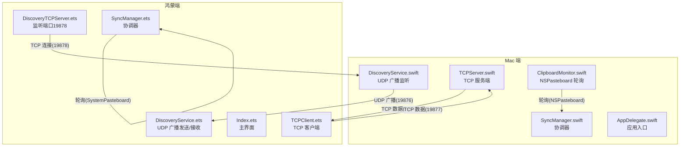
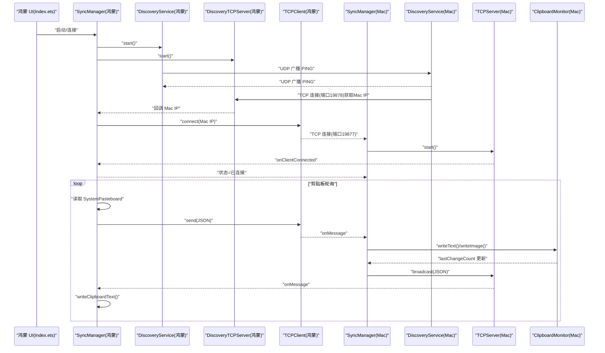
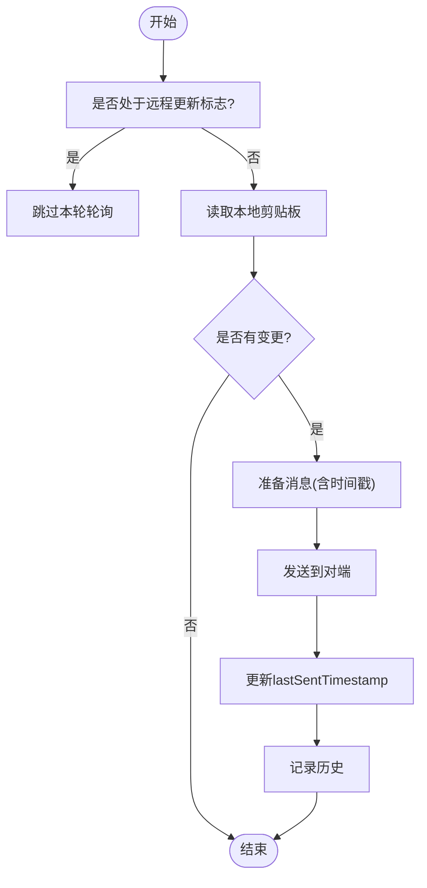
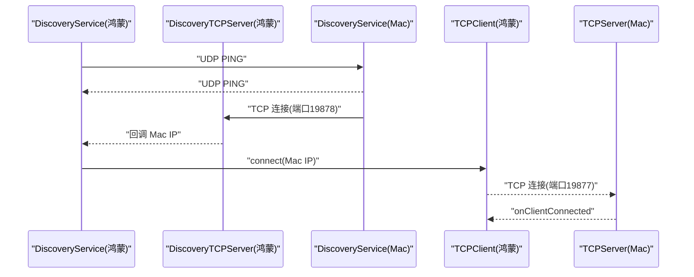
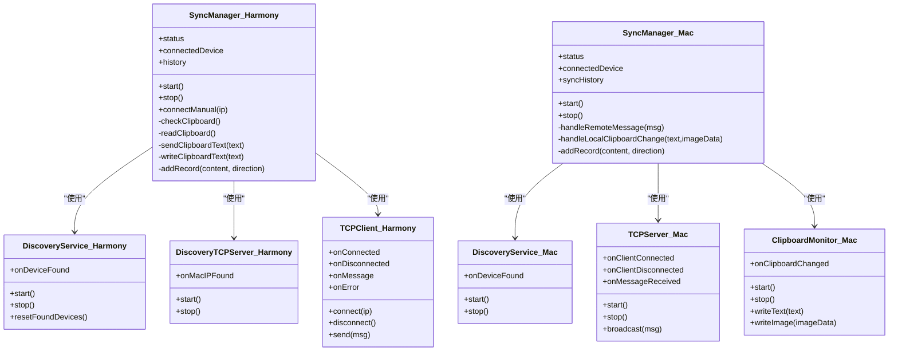
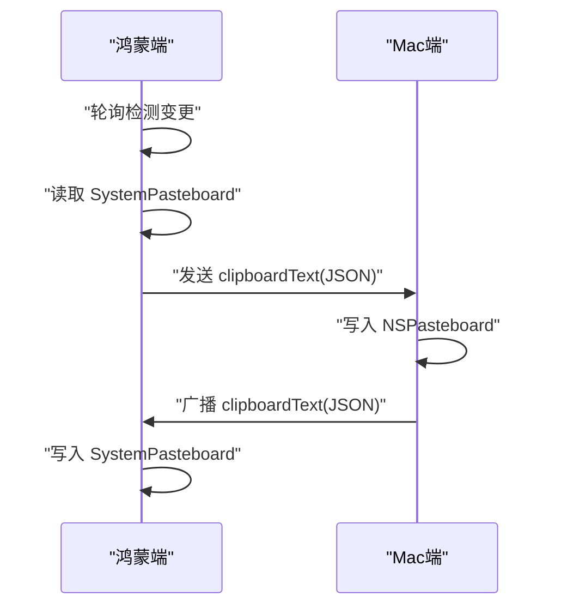

# 数据流设计

<cite>
**本文引用的文件**
- [SyncManager.ets](file://ClipboardSync/harmony/entry/src/main/ets/model/SyncManager.ets)
- [SyncManager.swift](file://ClipboardSync/mac/ClipboardSync/SyncManager.swift)
- [Protocol.ets](file://ClipboardSync/harmony/entry/src/main/ets/common/Protocol.ets)
- [Protocol.swift](file://ClipboardSync/mac/ClipboardSync/Protocol.swift)
- [DiscoveryService.ets](file://ClipboardSync/harmony/entry/src/main/ets/common/DiscoveryService.ets)
- [TCPClient.ets](file://ClipboardSync/harmony/entry/src/main/ets/common/TCPClient.ets)
- [DiscoveryTCPServer.ets](file://ClipboardSync/harmony/entry/src/main/ets/common/DiscoveryTCPServer.ets)
- [DiscoveryService.swift](file://ClipboardSync/mac/ClipboardSync/DiscoveryService.swift)
- [TCPServer.swift](file://ClipboardSync/mac/ClipboardSync/TCPServer.swift)
- [ClipboardMonitor.swift](file://ClipboardSync/mac/ClipboardSync/ClipboardMonitor.swift)
- [AppDelegate.swift](file://ClipboardSync/mac/ClipboardSync/AppDelegate.swift)
- [Index.ets](file://ClipboardSync/harmony/entry/src/main/ets/pages/Index.ets)
- [PROJECT.md](file://ClipboardSync/PROJECT.md)
</cite>

## 目录
1. [简介](#简介)
2. [项目结构](#项目结构)
3. [核心组件](#核心组件)
4. [架构总览](#架构总览)
5. [详细组件分析](#详细组件分析)
6. [依赖关系分析](#依赖关系分析)
7. [性能考量](#性能考量)
8. [故障排查指南](#故障排查指南)
9. [结论](#结论)
10. [附录](#附录)

## 简介
本文件面向ClipboardSync项目，系统性梳理“从剪贴板变化到最终同步完成”的完整数据流，涵盖消息格式与协议设计、去重防环机制、历史记录存储与管理、数据一致性与错误处理策略，并提供数据流图与消息传递示例，帮助开发者与使用者快速理解系统行为。

## 项目结构
项目采用跨平台架构：Mac端使用Swift + SwiftUI，鸿蒙端使用ArkTS + ArkUI。两端共享协议定义，通过UDP广播进行设备发现，随后建立TCP长连接进行剪贴板数据传输。

图表来源
- [DiscoveryService.ets:25-95](file://ClipboardSync/harmony/entry/src/main/ets/common/DiscoveryService.ets#L25-L95)
- [DiscoveryTCPServer.ets:18-49](file://ClipboardSync/harmony/entry/src/main/ets/common/DiscoveryTCPServer.ets#L18-L49)
- [TCPClient.ets:30-113](file://ClipboardSync/harmony/entry/src/main/ets/common/TCPClient.ets#L30-L113)
- [DiscoveryService.swift:15-100](file://ClipboardSync/mac/ClipboardSync/DiscoveryService.swift#L15-L100)
- [TCPServer.swift:23-51](file://ClipboardSync/mac/ClipboardSync/TCPServer.swift#L23-L51)
- [SyncManager.swift:40-93](file://ClipboardSync/mac/ClipboardSync/SyncManager.swift#L40-L93)
- [SyncManager.ets:72-98](file://ClipboardSync/harmony/entry/src/main/ets/model/SyncManager.ets#L72-L98)

章节来源
- [PROJECT.md:52-62](file://ClipboardSync/PROJECT.md#L52-L62)

## 核心组件
- 协议层：统一定义消息类型、字段与序列化/反序列化方法，确保两端兼容。
- 设备发现：基于UDP广播的双向发现，Mac端同时提供TCP发现通道以协助鸿蒙端获取IP。
- 数据传输：基于TCP长连接，使用换行分隔的JSON帧，具备粘包处理能力。
- 同步协调：两端的SyncManager负责状态管理、去重防环、剪贴板读写与历史记录维护。
- 剪贴板监听：Mac端使用NSPasteboard轮询，鸿蒙端使用SystemPasteboard轮询。

章节来源
- [Protocol.ets:1-27](file://ClipboardSync/harmony/entry/src/main/ets/common/Protocol.ets#L1-L27)
- [Protocol.swift:1-43](file://ClipboardSync/mac/ClipboardSync/Protocol.swift#L1-L43)
- [SyncManager.ets:26-301](file://ClipboardSync/harmony/entry/src/main/ets/model/SyncManager.ets#L26-L301)
- [SyncManager.swift:5-154](file://ClipboardSync/mac/ClipboardSync/SyncManager.swift#L5-L154)

## 架构总览
系统采用“发现-连接-同步”三层架构：
- 发现阶段：双方周期性发送/接收PING消息，实现设备可达性确认。
- 连接阶段：建立TCP长连接，承载剪贴板数据帧。
- 同步阶段：双方轮询本地剪贴板，按去重策略发送/接收消息，写入目标剪贴板并记录历史。

图表来源
- [Index.ets:13-27](file://ClipboardSync/harmony/entry/src/main/ets/pages/Index.ets#L13-L27)
- [SyncManager.ets:72-98](file://ClipboardSync/harmony/entry/src/main/ets/model/SyncManager.ets#L72-L98)
- [DiscoveryService.ets:25-95](file://ClipboardSync/harmony/entry/src/main/ets/common/DiscoveryService.ets#L25-L95)
- [DiscoveryTCPServer.ets:18-49](file://ClipboardSync/harmony/entry/src/main/ets/common/DiscoveryTCPServer.ets#L18-L49)
- [TCPClient.ets:30-113](file://ClipboardSync/harmony/entry/src/main/ets/common/TCPClient.ets#L30-L113)
- [SyncManager.swift:40-93](file://ClipboardSync/mac/ClipboardSync/SyncManager.swift#L40-L93)
- [DiscoveryService.swift:15-100](file://ClipboardSync/mac/ClipboardSync/DiscoveryService.swift#L15-L100)
- [TCPServer.swift:23-51](file://ClipboardSync/mac/ClipboardSync/TCPServer.swift#L23-L51)
- [ClipboardMonitor.swift:50-71](file://ClipboardSync/mac/ClipboardSync/ClipboardMonitor.swift#L50-L71)

## 详细组件分析

### 协议与消息格式
- 消息类型：clipboardText、clipboardImage、ping、pong。
- 字段定义：
  - type：消息类型
  - content：消息体（文本或Base64图片）
  - timestamp：Unix秒级时间戳
  - deviceId：设备标识
  - mimeType：可选，标识内容类型
- 序列化机制：
  - 鸿蒙端：使用JSON字符串化，消息以换行符分隔。
  - Mac端：使用Codable编码/解码，消息以换行符分隔。
- 端口分配：
  - UDP广播端口：19876
  - TCP数据端口：19877
  - TCP发现端口：19878（仅用于Mac向鸿蒙暴露IP）

章节来源
- [Protocol.ets:12-27](file://ClipboardSync/harmony/entry/src/main/ets/common/Protocol.ets#L12-L27)
- [Protocol.swift:19-43](file://ClipboardSync/mac/ClipboardSync/Protocol.swift#L19-L43)
- [TCPClient.ets:44-58](file://ClipboardSync/harmony/entry/src/main/ets/common/TCPClient.ets#L44-L58)
- [TCPServer.swift:60-67](file://ClipboardSync/mac/ClipboardSync/TCPServer.swift#L60-L67)
- [PROJECT.md:54-58](file://ClipboardSync/PROJECT.md#L54-L58)

### 去重防环机制
- 时间戳去重：每条消息携带timestamp，接收端仅处理“timestamp > lastSentTimestamp”的消息，避免写入剪贴板后触发监听回环。
- 鸿蒙端：
  - 发送前设置lastSentTimestamp为当前时间戳。
  - 接收时比较timestamp，小于等于则丢弃。
- Mac端：
  - 发送前设置lastSentTimestamp为当前时间戳。
  - 接收时比较timestamp，小于等于则丢弃。
- 额外防环：
  - 鸿蒙端写入剪贴板时设置isRemoteUpdate标志，轮询阶段跳过读取。
  - Mac端写入剪贴板时设置isRemoteUpdate标志，轮询阶段跳过读取。

图表来源
- [SyncManager.ets:215-252](file://ClipboardSync/harmony/entry/src/main/ets/model/SyncManager.ets#L215-L252)
- [SyncManager.swift:117-142](file://ClipboardSync/mac/ClipboardSync/SyncManager.swift#L117-L142)

章节来源
- [SyncManager.ets:178-198](file://ClipboardSync/harmony/entry/src/main/ets/model/SyncManager.ets#L178-L198)
- [SyncManager.swift:95-115](file://ClipboardSync/mac/ClipboardSync/SyncManager.swift#L95-L115)

### 历史记录存储与管理
- 存储结构：
  - 鸿蒙端：数组结构，包含id、content、time、direction字段，最多保留50条。
  - Mac端：数组结构，包含UUID、content、time、direction字段，最多保留50条。
- 更新策略：
  - 每次发送/接收成功后插入到数组头部，超过上限截断。
  - UI层通过状态变化回调刷新显示。
- 展示策略：
  - 鸿蒙端：列表项显示箭头方向、内容与时间，超长内容截断。
  - Mac端：列表项显示方向、内容与时间。

章节来源
- [SyncManager.ets:8-13](file://ClipboardSync/harmony/entry/src/main/ets/model/SyncManager.ets#L8-L13)
- [SyncManager.ets:287-299](file://ClipboardSync/harmony/entry/src/main/ets/model/SyncManager.ets#L287-L299)
- [SyncManager.swift:24-34](file://ClipboardSync/mac/ClipboardSync/SyncManager.swift#L24-L34)
- [SyncManager.swift:144-152](file://ClipboardSync/mac/ClipboardSync/SyncManager.swift#L144-L152)
- [Index.ets:150-185](file://ClipboardSync/harmony/entry/src/main/ets/pages/Index.ets#L150-L185)

### 设备发现与连接流程
- 鸿蒙端：
  - DiscoveryService：周期性发送PING广播，接收时去重并回调设备信息。
  - DiscoveryTCPServer：监听端口19878，从连接中获取Mac IP并回调。
  - TCPClient：连接Mac的19877端口，处理消息与断线重连。
- Mac端：
  - DiscoveryService：BSD Socket监听UDP广播，收到PING后回调设备信息并发起TCP发现连接。
  - TCPServer：作为服务端监听19877端口，处理消息与广播。
  - ClipboardMonitor：轮询NSPasteboard，触发同步。

图表来源
- [DiscoveryService.ets:25-95](file://ClipboardSync/harmony/entry/src/main/ets/common/DiscoveryService.ets#L25-L95)
- [DiscoveryTCPServer.ets:18-49](file://ClipboardSync/harmony/entry/src/main/ets/common/DiscoveryTCPServer.ets#L18-L49)
- [DiscoveryService.swift:15-100](file://ClipboardSync/mac/ClipboardSync/DiscoveryService.swift#L15-L100)
- [TCPClient.ets:30-113](file://ClipboardSync/harmony/entry/src/main/ets/common/TCPClient.ets#L30-L113)
- [TCPServer.swift:23-51](file://ClipboardSync/mac/ClipboardSync/TCPServer.swift#L23-L51)

章节来源
- [DiscoveryService.ets:10-161](file://ClipboardSync/harmony/entry/src/main/ets/common/DiscoveryService.ets#L10-L161)
- [DiscoveryTCPServer.ets:11-80](file://ClipboardSync/harmony/entry/src/main/ets/common/DiscoveryTCPServer.ets#L11-L80)
- [DiscoveryService.swift:6-197](file://ClipboardSync/mac/ClipboardSync/DiscoveryService.swift#L6-L197)
- [TCPServer.swift:6-174](file://ClipboardSync/mac/ClipboardSync/TCPServer.swift#L6-L174)

### 剪贴板轮询与写入策略
- 鸿蒙端：
  - 轮询间隔：500ms。
  - 读取：SystemPasteboard.getDataSync()获取原始数据，解析文本。
  - 写入：pasteboard.createData()创建数据，setDataSync()写入。
- Mac端：
  - 轮询间隔：0.5s。
  - 读取：优先读取文本，其次尝试读取图片并转换为PNG。
  - 写入：clearContents()清空，写入对应类型。

章节来源
- [SyncManager.ets:202-252](file://ClipboardSync/harmony/entry/src/main/ets/model/SyncManager.ets#L202-L252)
- [ClipboardMonitor.swift:16-71](file://ClipboardSync/mac/ClipboardSync/ClipboardMonitor.swift#L16-L71)

## 依赖关系分析

图表来源
- [SyncManager.ets:26-301](file://ClipboardSync/harmony/entry/src/main/ets/model/SyncManager.ets#L26-L301)
- [SyncManager.swift:5-154](file://ClipboardSync/mac/ClipboardSync/SyncManager.swift#L5-L154)
- [DiscoveryService.ets:10-161](file://ClipboardSync/harmony/entry/src/main/ets/common/DiscoveryService.ets#L10-L161)
- [DiscoveryTCPServer.ets:11-80](file://ClipboardSync/harmony/entry/src/main/ets/common/DiscoveryTCPServer.ets#L11-L80)
- [TCPClient.ets:11-181](file://ClipboardSync/harmony/entry/src/main/ets/common/TCPClient.ets#L11-L181)
- [DiscoveryService.swift:6-197](file://ClipboardSync/mac/ClipboardSync/DiscoveryService.swift#L6-L197)
- [TCPServer.swift:6-174](file://ClipboardSync/mac/ClipboardSync/TCPServer.swift#L6-L174)
- [ClipboardMonitor.swift:4-73](file://ClipboardSync/mac/ClipboardSync/ClipboardMonitor.swift#L4-L73)

## 性能考量
- 轮询间隔：两端均采用0.5s轮询，兼顾实时性与资源消耗。
- TCP粘包处理：缓冲区累积+按换行符切分，避免重复解析。
- 去重策略：时间戳+远程更新标志，减少无效同步。
- 历史记录上限：固定长度数组，避免内存膨胀。
- 断线重连：连接断开后延迟重连，降低频繁重建成本。

## 故障排查指南
- 鸿蒙端TCP连接报错“Operation in progress”
  - 原因：socket.close()异步，旧连接未完全释放。
  - 处理：先断开旧连接，延迟后再创建新连接。
- 鸿蒙端socket.SocketErrorInfo不存在
  - 原因：API 23中NetworkKit未导出该类型。
  - 处理：使用BusinessError作为错误回调参数类型。
- Mac端build-profile.json5 SDK版本类型错误
  - 原因：compileSdkVersion与compatibleSdkVersion需为字符串。
  - 处理：使用字符串值如"6.1.0(23)"。
- Mac端SyncManager.start()未在启动时调用
  - 原因：onAppear依赖用户交互。
  - 处理：在AppDelegate.applicationDidFinishLaunching中直接调用。
- Mac端NWListener默认监听IPv6
  - 影响：lsof显示为IPv6，但实际不影响连接。
  - 处理：注意日志解读，不影响功能。

章节来源
- [PROJECT.md:102-131](file://ClipboardSync/PROJECT.md#L102-L131)

## 结论
ClipboardSync通过简洁可靠的协议与去重机制，在两端实现了稳定的剪贴板同步。UDP广播用于设备发现，TCP长连接承载数据帧，时间戳与远程更新标志共同防止回环。历史记录与UI联动提供了良好的可观测性。未来可在自动发现、图片同步、后台保活等方面进一步完善。

## 附录

### 典型场景示例：文本同步流程
- 鸿蒙端复制文本
  - 轮询检测到变更，读取SystemPasteboard，构造SyncMessage，发送至Mac。
  - Mac端接收消息，写入NSPasteboard，更新lastSyncTime，记录历史。
- Mac端复制文本
  - 轮询检测到变更，读取NSPasteboard，构造SyncMessage，广播至所有连接。
  - 鸿蒙端接收消息，写入SystemPasteboard，更新lastSyncTime，记录历史。

图表来源
- [SyncManager.ets:235-252](file://ClipboardSync/harmony/entry/src/main/ets/model/SyncManager.ets#L235-L252)
- [SyncManager.swift:117-142](file://ClipboardSync/mac/ClipboardSync/SyncManager.swift#L117-L142)
- [ClipboardMonitor.swift:50-71](file://ClipboardSync/mac/ClipboardSync/ClipboardMonitor.swift#L50-L71)