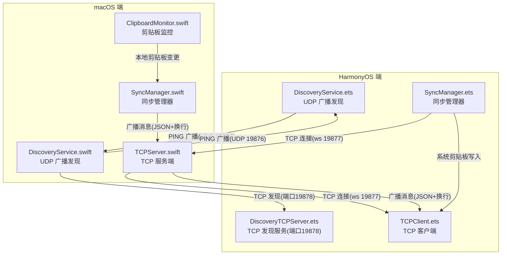
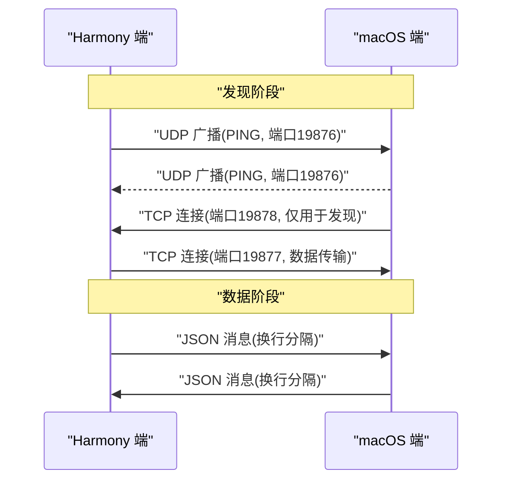
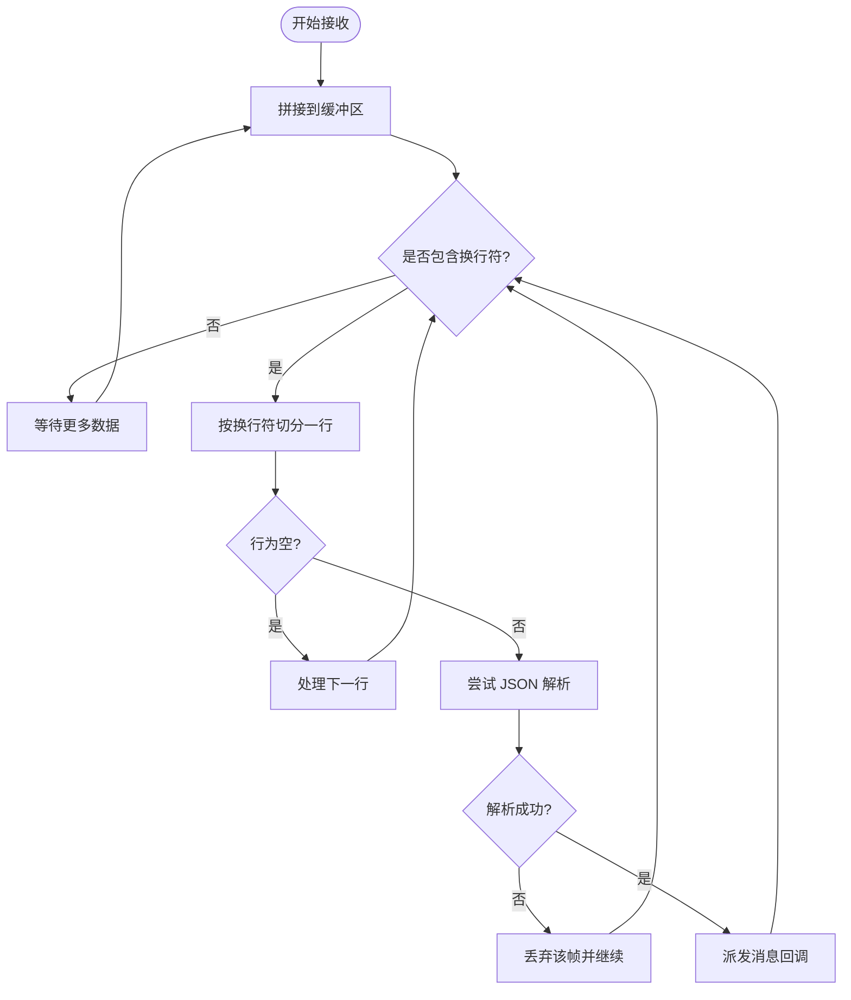
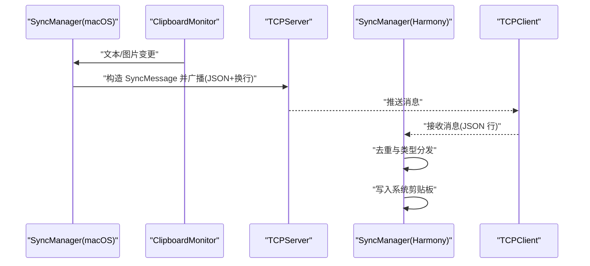
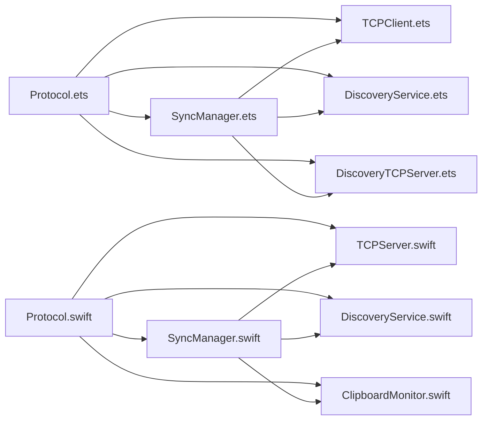

# 消息格式与协议

<cite>
**本文引用的文件**
- [Protocol.ets](file://ClipboardSync/harmony/entry/src/main/ets/common/Protocol.ets)
- [Protocol.swift](file://ClipboardSync/mac/ClipboardSync/Protocol.swift)
- [SyncManager.ets](file://ClipboardSync/harmony/entry/src/main/ets/model/SyncManager.ets)
- [SyncManager.swift](file://ClipboardSync/mac/ClipboardSync/SyncManager.swift)
- [TCPClient.ets](file://ClipboardSync/harmony/entry/src/main/ets/common/TCPClient.ets)
- [TCPServer.swift](file://ClipboardSync/mac/ClipboardSync/TCPServer.swift)
- [DiscoveryService.ets](file://ClipboardSync/harmony/entry/src/main/ets/common/DiscoveryService.ets)
- [DiscoveryService.swift](file://ClipboardSync/mac/ClipboardSync/DiscoveryService.swift)
- [DiscoveryTCPServer.ets](file://ClipboardSync/harmony/entry/src/main/ets/common/DiscoveryTCPServer.ets)
- [ClipboardMonitor.swift](file://ClipboardSync/mac/ClipboardSync/ClipboardMonitor.swift)
</cite>

## 目录
1. [简介](#简介)
2. [项目结构](#项目结构)
3. [核心组件](#核心组件)
4. [架构总览](#架构总览)
5. [详细组件分析](#详细组件分析)
6. [依赖关系分析](#依赖关系分析)
7. [性能考虑](#性能考虑)
8. [故障排查指南](#故障排查指南)
9. [结论](#结论)
10. [附录](#附录)

## 简介
本文件系统性阐述 ClipboardSync 项目的“消息格式与协议”，覆盖以下要点：
- JSON 消息结构设计：字段定义、用途与约束
- 消息类型分类与格式规范：ping、text、image 等
- 协议版本管理与向后兼容策略
- 完整消息示例：文本同步与图片同步
- 序列化与反序列化实现细节
- 端口分配与网络层协议选择原因

## 项目结构
项目采用跨平台（HarmonyOS 与 macOS）实现，两端共享统一的协议模型与消息格式，通过 UDP 广播进行设备发现，通过 TCP 进行可靠的数据传输。

图表来源
- [DiscoveryService.ets:25-161](file://ClipboardSync/harmony/entry/src/main/ets/common/DiscoveryService.ets#L25-L161)
- [DiscoveryService.swift:15-197](file://ClipboardSync/mac/ClipboardSync/DiscoveryService.swift#L15-L197)
- [DiscoveryTCPServer.ets:18-80](file://ClipboardSync/harmony/entry/src/main/ets/common/DiscoveryTCPServer.ets#L18-L80)
- [SyncManager.ets:72-174](file://ClipboardSync/harmony/entry/src/main/ets/model/SyncManager.ets#L72-L174)
- [SyncManager.swift:40-153](file://ClipboardSync/mac/ClipboardSync/SyncManager.swift#L40-L153)
- [TCPClient.ets:30-181](file://ClipboardSync/harmony/entry/src/main/ets/common/TCPClient.ets#L30-L181)
- [TCPServer.swift:23-174](file://ClipboardSync/mac/ClipboardSync/TCPServer.swift#L23-L174)
- [ClipboardMonitor.swift:16-73](file://ClipboardSync/mac/ClipboardSync/ClipboardMonitor.swift#L16-L73)

章节来源
- [DiscoveryService.ets:25-161](file://ClipboardSync/harmony/entry/src/main/ets/common/DiscoveryService.ets#L25-L161)
- [DiscoveryService.swift:15-197](file://ClipboardSync/mac/ClipboardSync/DiscoveryService.swift#L15-L197)
- [DiscoveryTCPServer.ets:18-80](file://ClipboardSync/harmony/entry/src/main/ets/common/DiscoveryTCPServer.ets#L18-L80)
- [SyncManager.ets:72-174](file://ClipboardSync/harmony/entry/src/main/ets/model/SyncManager.ets#L72-L174)
- [SyncManager.swift:40-153](file://ClipboardSync/mac/ClipboardSync/SyncManager.swift#L40-L153)
- [TCPClient.ets:30-181](file://ClipboardSync/harmony/entry/src/main/ets/common/TCPClient.ets#L30-L181)
- [TCPServer.swift:23-174](file://ClipboardSync/mac/ClipboardSync/TCPServer.swift#L23-L174)
- [ClipboardMonitor.swift:16-73](file://ClipboardSync/mac/ClipboardSync/ClipboardMonitor.swift#L16-L73)

## 核心组件
- 协议常量与消息结构
  - Harmony 端：协议常量与消息接口定义于 [Protocol.ets:1-27](file://ClipboardSync/harmony/entry/src/main/ets/common/Protocol.ets#L1-L27)，包含端口、设备 ID、消息类型枚举与消息结构接口。
  - macOS 端：协议常量与消息结构定义于 [Protocol.swift:3-43](file://ClipboardSync/mac/ClipboardSync/Protocol.swift#L3-L43)，包含端口、设备 ID、消息类型枚举与可编码消息结构，并提供 JSON 编解码辅助方法。
- 同步管理器
  - Harmony 端：[SyncManager.ets:26-301](file://ClipboardSync/harmony/entry/src/main/ets/model/SyncManager.ets#L26-L301) 负责设备发现、TCP 连接、剪贴板轮询与消息收发。
  - macOS 端：[SyncManager.swift:5-153](file://ClipboardSync/mac/ClipboardSync/SyncManager.swift#L5-L153) 负责设备发现、TCP 服务端、剪贴板监控与消息收发。
- 传输层
  - Harmony 端 TCP 客户端：[TCPClient.ets:11-181](file://ClipboardSync/harmony/entry/src/main/ets/common/TCPClient.ets#L11-L181) 以换行分隔 JSON 消息，支持断线重连。
  - macOS 端 TCP 服务端：[TCPServer.swift:6-174](file://ClipboardSync/mac/ClipboardSync/TCPServer.swift#L6-L174) 以换行分隔 JSON 消息，支持多客户端广播。
- 发现层
  - Harmony 端 UDP 发现与 TCP 发现服务：[DiscoveryService.ets:10-161](file://ClipboardSync/harmony/entry/src/main/ets/common/DiscoveryService.ets#L10-L161)、[DiscoveryTCPServer.ets:11-80](file://ClipboardSync/harmony/entry/src/main/ets/common/DiscoveryTCPServer.ets#L11-L80)。
  - macOS 端 UDP 发现与 TCP 发现连接：[DiscoveryService.swift:6-197](file://ClipboardSync/mac/ClipboardSync/DiscoveryService.swift#L6-L197)。

章节来源
- [Protocol.ets:1-27](file://ClipboardSync/harmony/entry/src/main/ets/common/Protocol.ets#L1-L27)
- [Protocol.swift:3-43](file://ClipboardSync/mac/ClipboardSync/Protocol.swift#L3-L43)
- [SyncManager.ets:26-301](file://ClipboardSync/harmony/entry/src/main/ets/model/SyncManager.ets#L26-L301)
- [SyncManager.swift:5-153](file://ClipboardSync/mac/ClipboardSync/SyncManager.swift#L5-L153)
- [TCPClient.ets:11-181](file://ClipboardSync/harmony/entry/src/main/ets/common/TCPClient.ets#L11-L181)
- [TCPServer.swift:6-174](file://ClipboardSync/mac/ClipboardSync/TCPServer.swift#L6-L174)
- [DiscoveryService.ets:10-161](file://ClipboardSync/harmony/entry/src/main/ets/common/DiscoveryService.ets#L10-L161)
- [DiscoveryService.swift:6-197](file://ClipboardSync/mac/ClipboardSync/DiscoveryService.swift#L6-L197)
- [DiscoveryTCPServer.ets:11-80](file://ClipboardSync/harmony/entry/src/main/ets/common/DiscoveryTCPServer.ets#L11-L80)

## 架构总览
下图展示了跨平台消息流：两端均以 JSON 文本承载消息，通过换行符分隔；发现阶段使用 UDP 广播与 TCP 发现端口，数据阶段使用 TCP 服务端/客户端。

图表来源
- [DiscoveryService.ets:97-124](file://ClipboardSync/harmony/entry/src/main/ets/common/DiscoveryService.ets#L97-L124)
- [DiscoveryService.swift:104-146](file://ClipboardSync/mac/ClipboardSync/DiscoveryService.swift#L104-L146)
- [DiscoveryTCPServer.ets:33-78](file://ClipboardSync/harmony/entry/src/main/ets/common/DiscoveryTCPServer.ets#L33-L78)
- [TCPClient.ets:30-58](file://ClipboardSync/harmony/entry/src/main/ets/common/TCPClient.ets#L30-L58)
- [TCPServer.swift:19-67](file://ClipboardSync/mac/ClipboardSync/TCPServer.swift#L19-L67)

## 详细组件分析

### 消息格式与字段定义
- 字段说明
  - type：消息类型，枚举值包括 clipboardText、clipboardImage、ping、pong。
  - content：消息内容主体，文本消息为纯文本，图片消息为 Base64 编码的二进制数据字符串。
  - timestamp：Unix 时间戳（秒级），用于去重与顺序判断。
  - deviceId：设备标识，用于发现与去重。
  - mimeType：可选字段，指示 content 的 MIME 类型（如 text/plain、image/png）。
- 字段约束
  - content 非空（除 ping/pong 外）。
  - timestamp 严格递增，用于避免回环与重复处理。
  - deviceId 由各端生成并唯一标识本端设备。
  - mimeType 为可选，便于未来扩展不同媒体类型。

章节来源
- [Protocol.ets:11-26](file://ClipboardSync/harmony/entry/src/main/ets/common/Protocol.ets#L11-L26)
- [Protocol.swift:19-34](file://ClipboardSync/mac/ClipboardSync/Protocol.swift#L19-L34)

### 消息类型与格式规范
- clipboardText
  - 用途：同步剪贴板文本内容。
  - content：UTF-8 文本字符串。
  - mimeType：text/plain。
  - 示例参考“附录”的示例消息。
- clipboardImage
  - 用途：同步剪贴板图片内容。
  - content：Base64 编码的 PNG 图片数据字符串。
  - mimeType：image/png。
  - 示例参考“附录”的示例消息。
- ping/pong
  - 用途：心跳与发现探测。
  - content：通用描述字符串（如 discover）。
  - 通常不携带 mimeType 或留空。

章节来源
- [SyncManager.ets:183-194](file://ClipboardSync/harmony/entry/src/main/ets/model/SyncManager.ets#L183-L194)
- [SyncManager.swift:99-110](file://ClipboardSync/mac/ClipboardSync/SyncManager.swift#L99-L110)
- [TCPClient.ets:44-58](file://ClipboardSync/harmony/entry/src/main/ets/common/TCPClient.ets#L44-L58)
- [TCPServer.swift:60-67](file://ClipboardSync/mac/ClipboardSync/TCPServer.swift#L60-L67)

### 序列化与反序列化实现
- Harmony 端
  - 发送：将 SyncMessage 对象 JSON.stringify 后追加换行符再发送。
  - 接收：按字节流拼接缓冲区，遇到换行符拆分出一条完整消息，再 JSON.parse。
- macOS 端
  - 发送：将 SyncMessage 编码为 JSON Data，附加换行符后广播给所有连接。
  - 接收：按 UTF-8 文本拼接缓冲区，遇到换行符拆分，再从 Data 解码为 SyncMessage。
- 可靠性
  - 两端均以换行符作为帧边界，避免粘包问题。
  - 错误处理：解析失败或网络异常时丢弃该帧并继续处理后续数据。

图表来源
- [TCPClient.ets:115-146](file://ClipboardSync/harmony/entry/src/main/ets/common/TCPClient.ets#L115-L146)
- [TCPServer.swift:129-148](file://ClipboardSync/mac/ClipboardSync/TCPServer.swift#L129-L148)

章节来源
- [TCPClient.ets:44-58](file://ClipboardSync/harmony/entry/src/main/ets/common/TCPClient.ets#L44-L58)
- [TCPClient.ets:115-146](file://ClipboardSync/harmony/entry/src/main/ets/common/TCPClient.ets#L115-L146)
- [TCPServer.swift:60-67](file://ClipboardSync/mac/ClipboardSync/TCPServer.swift#L60-L67)
- [TCPServer.swift:129-148](file://ClipboardSync/mac/ClipboardSync/TCPServer.swift#L129-L148)

### 端口分配与网络层协议选择
- 端口分配
  - 19876：UDP 广播端口，用于设备发现与心跳。
  - 19877：TCP 数据传输端口，用于可靠消息广播与接收。
  - 19878：TCP 发现端口，仅用于 macOS 端告知 Harmony 端其 IP，不承载数据。
- 协议选择
  - UDP：低延迟、易跨网段发现，适合广播心跳与去重。
  - TCP：面向连接、有序可靠，适合消息广播与去重控制。
  - 两端均采用换行符帧边界，简化粘包处理。

章节来源
- [Protocol.ets:3-8](file://ClipboardSync/harmony/entry/src/main/ets/common/Protocol.ets#L3-L8)
- [Protocol.swift:4-17](file://ClipboardSync/mac/ClipboardSync/Protocol.swift#L4-L17)
- [DiscoveryService.ets:45-51](file://ClipboardSync/harmony/entry/src/main/ets/common/DiscoveryService.ets#L45-L51)
- [DiscoveryService.swift:43-59](file://ClipboardSync/mac/ClipboardSync/DiscoveryService.swift#L43-L59)
- [TCPServer.swift:19-21](file://ClipboardSync/mac/ClipboardSync/TCPServer.swift#L19-L21)
- [TCPClient.ets:16-16](file://ClipboardSync/harmony/entry/src/main/ets/common/TCPClient.ets#L16-L16)

### 协议版本管理与向后兼容策略
- 当前版本
  - 两端消息结构一致，字段集稳定，无显式版本号。
- 版本演进建议
  - 引入版本字段（如 version: number），默认值为 1。
  - 新增字段采用可选策略，老版本忽略未知字段。
  - 保留对历史字段的兼容解析（如新增 mimeType 时兼容无该字段）。
  - 通过 ping/pong 交换能力清单，动态协商能力。
- 向后兼容原则
  - 不破坏现有字段语义与长度。
  - 不删除必填字段。
  - 通过可选字段扩展能力，逐步淘汰旧字段。

章节来源
- [Protocol.ets:19-26](file://ClipboardSync/harmony/entry/src/main/ets/common/Protocol.ets#L19-L26)
- [Protocol.swift:27-42](file://ClipboardSync/mac/ClipboardSync/Protocol.swift#L27-L42)

### 消息示例
- 文本同步示例
  - type: clipboardText
  - content: "Hello ClipboardSync"
  - timestamp: 1719900000.123
  - deviceId: "Harmony-1234"
  - mimeType: text/plain
- 图片同步示例
  - type: clipboardImage
  - content: "iVBORw0K..."（Base64 PNG）
  - timestamp: 1719900001.456
  - deviceId: "Mac-5678"
  - mimeType: image/png

章节来源
- [SyncManager.ets:261-269](file://ClipboardSync/harmony/entry/src/main/ets/model/SyncManager.ets#L261-L269)
- [SyncManager.swift:122-139](file://ClipboardSync/mac/ClipboardSync/SyncManager.swift#L122-L139)

### 数据流与处理逻辑
- 发送流程（macOS）
  - 本地剪贴板变化触发 → 读取文本或图片 → 构造 SyncMessage → 广播到所有连接。
- 接收流程（HarmonyOS）
  - TCP 连接建立 → 接收 JSON 行 → 解析为 SyncMessage → 去重判断 → 写入系统剪贴板。
- 发现流程
  - 两端定时广播 PING → 相互识别设备 → 建立 TCP 数据通道。

图表来源
- [SyncManager.swift:117-142](file://ClipboardSync/mac/ClipboardSync/SyncManager.swift#L117-L142)
- [TCPServer.swift:60-67](file://ClipboardSync/mac/ClipboardSync/TCPServer.swift#L60-L67)
- [TCPClient.ets:115-146](file://ClipboardSync/harmony/entry/src/main/ets/common/TCPClient.ets#L115-L146)
- [SyncManager.ets:178-198](file://ClipboardSync/harmony/entry/src/main/ets/model/SyncManager.ets#L178-L198)

章节来源
- [SyncManager.swift:117-142](file://ClipboardSync/mac/ClipboardSync/SyncManager.swift#L117-L142)
- [TCPServer.swift:60-67](file://ClipboardSync/mac/ClipboardSync/TCPServer.swift#L60-L67)
- [TCPClient.ets:115-146](file://ClipboardSync/harmony/entry/src/main/ets/common/TCPClient.ets#L115-L146)
- [SyncManager.ets:178-198](file://ClipboardSync/harmony/entry/src/main/ets/model/SyncManager.ets#L178-L198)

## 依赖关系分析
- 结构耦合
  - SyncManager 依赖 Discovery/TCPServer/TCPClient（Harmony）或 Discovery/TCPServer/ClipboardMonitor（macOS）。
  - 协议层（Protocol.ets/Protocol.swift）被所有模块共享，保持消息格式一致性。
- 依赖可视化

图表来源
- [Protocol.ets:1-27](file://ClipboardSync/harmony/entry/src/main/ets/common/Protocol.ets#L1-L27)
- [Protocol.swift:3-43](file://ClipboardSync/mac/ClipboardSync/Protocol.swift#L3-L43)
- [SyncManager.ets:1-301](file://ClipboardSync/harmony/entry/src/main/ets/model/SyncManager.ets#L1-L301)
- [SyncManager.swift:1-154](file://ClipboardSync/mac/ClipboardSync/SyncManager.swift#L1-L154)
- [TCPClient.ets:1-181](file://ClipboardSync/harmony/entry/src/main/ets/common/TCPClient.ets#L1-L181)
- [TCPServer.swift:1-174](file://ClipboardSync/mac/ClipboardSync/TCPServer.swift#L1-L174)
- [DiscoveryService.ets:1-161](file://ClipboardSync/harmony/entry/src/main/ets/common/DiscoveryService.ets#L1-L161)
- [DiscoveryService.swift:1-197](file://ClipboardSync/mac/ClipboardSync/DiscoveryService.swift#L1-L197)
- [DiscoveryTCPServer.ets:1-80](file://ClipboardSync/harmony/entry/src/main/ets/common/DiscoveryTCPServer.ets#L1-L80)
- [ClipboardMonitor.swift:1-73](file://ClipboardSync/mac/ClipboardSync/ClipboardMonitor.swift#L1-L73)

章节来源
- [Protocol.ets:1-27](file://ClipboardSync/harmony/entry/src/main/ets/common/Protocol.ets#L1-L27)
- [Protocol.swift:3-43](file://ClipboardSync/mac/ClipboardSync/Protocol.swift#L3-L43)
- [SyncManager.ets:1-301](file://ClipboardSync/harmony/entry/src/main/ets/model/SyncManager.ets#L1-L301)
- [SyncManager.swift:1-154](file://ClipboardSync/mac/ClipboardSync/SyncManager.swift#L1-L154)
- [TCPClient.ets:1-181](file://ClipboardSync/harmony/entry/src/main/ets/common/TCPClient.ets#L1-L181)
- [TCPServer.swift:1-174](file://ClipboardSync/mac/ClipboardSync/TCPServer.swift#L1-L174)
- [DiscoveryService.ets:1-161](file://ClipboardSync/harmony/entry/src/main/ets/common/DiscoveryService.ets#L1-L161)
- [DiscoveryService.swift:1-197](file://ClipboardSync/mac/ClipboardSync/DiscoveryService.swift#L1-L197)
- [DiscoveryTCPServer.ets:1-80](file://ClipboardSync/harmony/entry/src/main/ets/common/DiscoveryTCPServer.ets#L1-L80)
- [ClipboardMonitor.swift:1-73](file://ClipboardSync/mac/ClipboardSync/ClipboardMonitor.swift#L1-L73)

## 性能考虑
- 轮询与去重
  - 两端均采用定时轮询检测剪贴板变化，减少事件驱动复杂度。
  - 通过 timestamp 去重，避免回环与重复处理。
- 粘包处理
  - 以换行符为帧边界，简单高效，适合小消息频繁场景。
- 广播与连接数
  - macOS 作为服务端广播至所有连接，注意连接数增长带来的内存与 CPU 压力。
- 编解码开销
  - JSON 编解码与 Base64 编解码在图片场景下可能成为瓶颈，建议在更高层优化（如压缩、增量）。

## 故障排查指南
- 无法发现设备
  - 检查 UDP 端口 19876 是否被防火墙拦截。
  - 确认两端广播间隔与设备 ID 唯一性。
- TCP 连接失败
  - 检查端口 19877 是否被占用或防火墙阻断。
  - 查看断线重连日志与错误回调。
- 消息乱序或重复
  - 核对 timestamp 是否单调递增。
  - 检查缓冲区拼接与换行符处理逻辑。
- 图片同步失败
  - 确认 content 为有效 Base64 PNG 数据。
  - 检查剪贴板写入权限与时机（避免远程更新期间写入）。

章节来源
- [TCPClient.ets:148-157](file://ClipboardSync/harmony/entry/src/main/ets/common/TCPClient.ets#L148-L157)
- [TCPServer.swift:129-148](file://ClipboardSync/mac/ClipboardSync/TCPServer.swift#L129-L148)
- [SyncManager.ets:178-198](file://ClipboardSync/harmony/entry/src/main/ets/model/SyncManager.ets#L178-L198)
- [SyncManager.swift:95-115](file://ClipboardSync/mac/ClipboardSync/SyncManager.swift#L95-L115)

## 结论
本协议以简洁稳定的 JSON 消息为核心，结合 UDP 广播与 TCP 可靠传输，实现了跨平台剪贴板同步。通过去重时间戳与换行帧边界，两端在保证实时性的同时具备良好的容错能力。建议在未来版本引入显式版本号与能力协商机制，进一步增强演进空间与兼容性。

## 附录
- 消息字段定义与用途
  - type：消息类型（clipboardText/clipboardImage/ping/pong）
  - content：消息内容（文本或 Base64 图片）
  - timestamp：时间戳（秒）
  - deviceId：设备标识
  - mimeType：可选，媒体类型
- 端口与协议
  - 19876：UDP 广播（发现）
  - 19877：TCP 数据（传输）
  - 19878：TCP 发现（仅用于告知 IP）