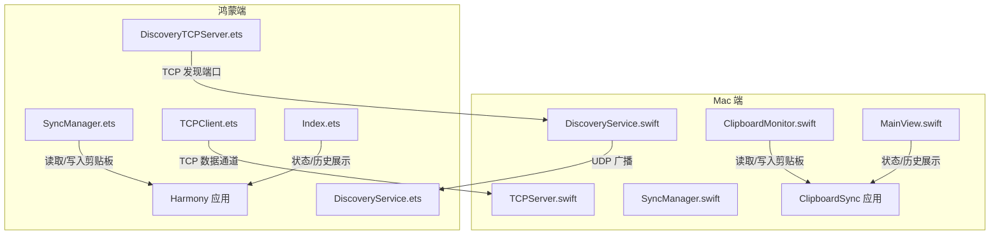
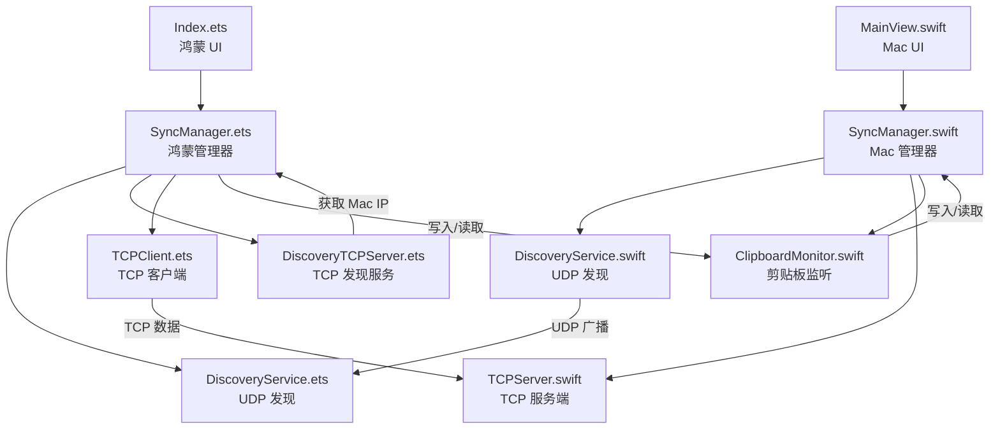
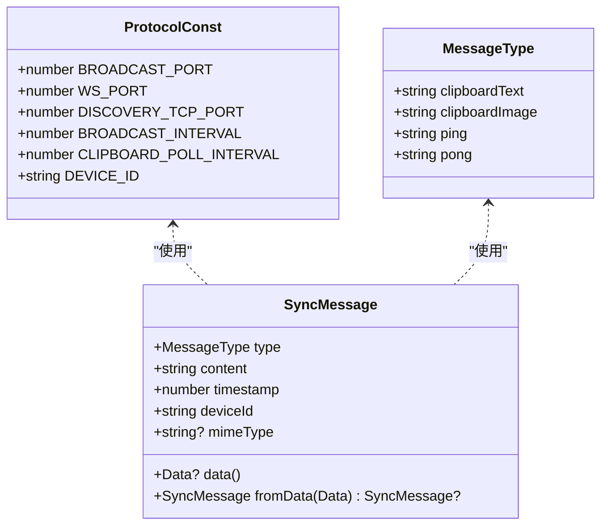
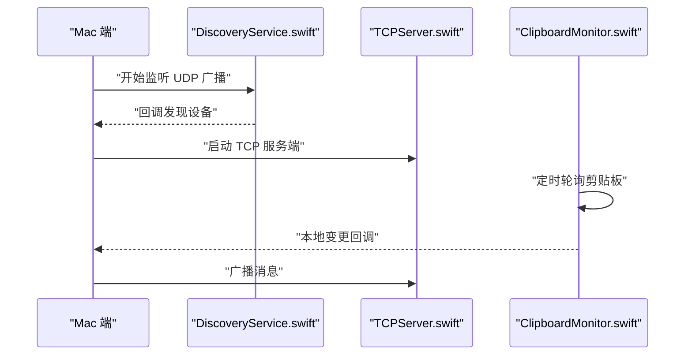
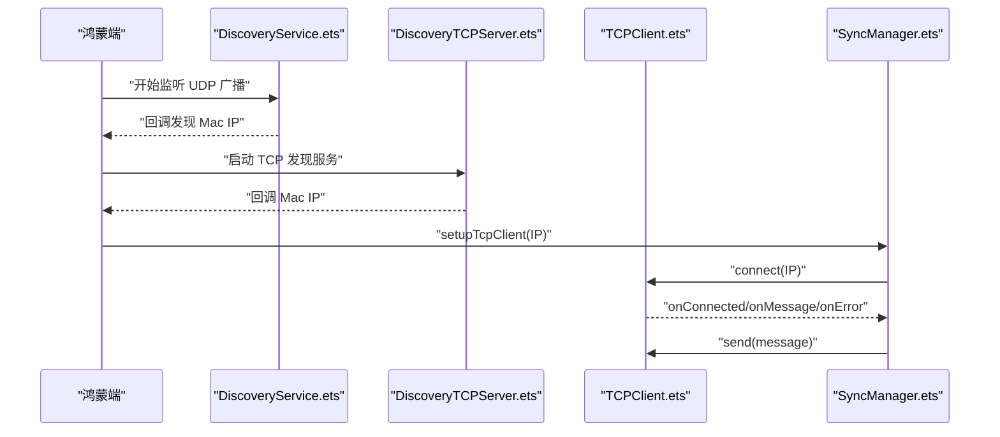
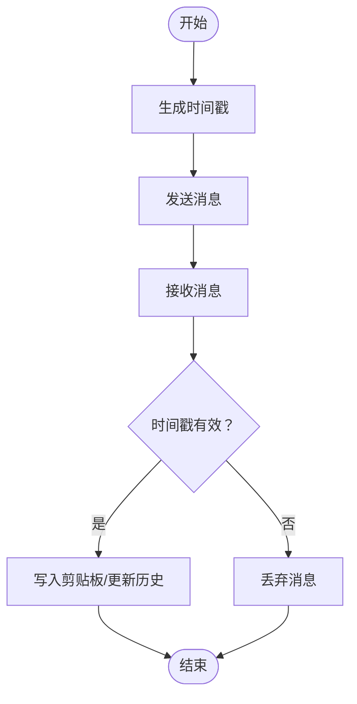
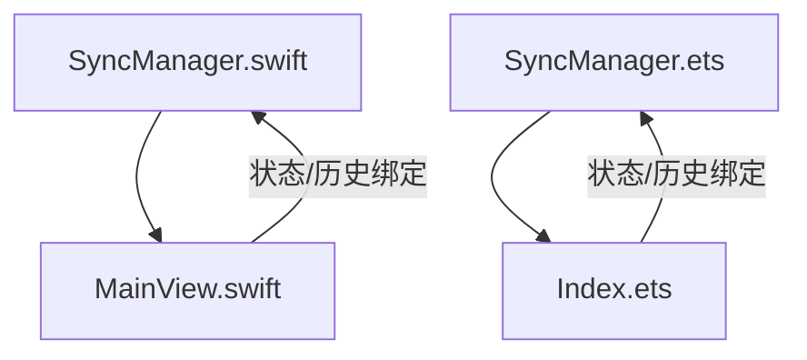
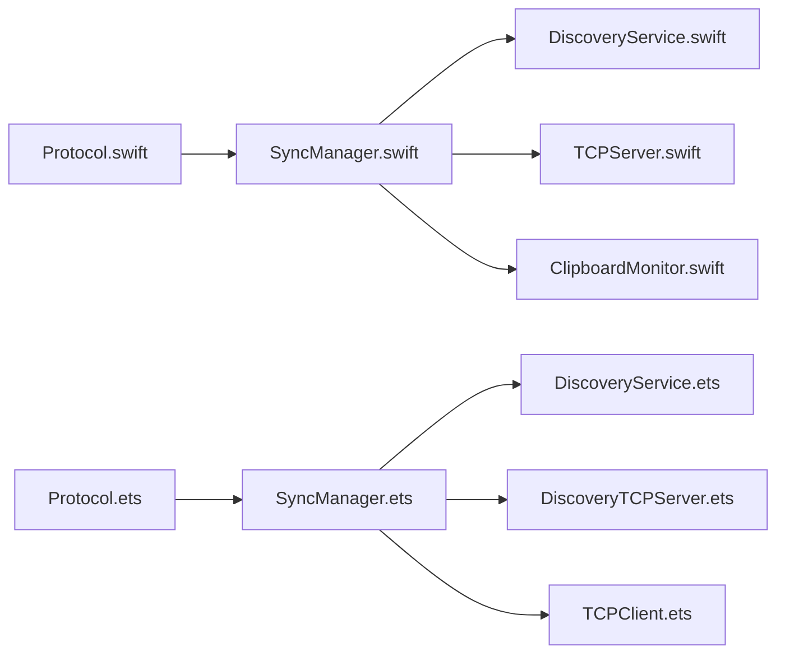

# 整体设计

<cite>
**本文引用的文件**
- [PROJECT.md](file://ClipboardSync/PROJECT.md)
- [Package.swift](file://ClipboardSync/mac/Package.swift)
- [build-profile.json5](file://ClipboardSync/harmony/build-profile.json5)
- [Protocol.swift](file://ClipboardSync/mac/ClipboardSync/Protocol.swift)
- [Protocol.ets](file://ClipboardSync/harmony/entry/src/main/ets/common/Protocol.ets)
- [SyncManager.swift](file://ClipboardSync/mac/ClipboardSync/SyncManager.swift)
- [SyncManager.ets](file://ClipboardSync/harmony/entry/src/main/ets/model/SyncManager.ets)
- [DiscoveryService.swift](file://ClipboardSync/mac/ClipboardSync/DiscoveryService.swift)
- [DiscoveryService.ets](file://ClipboardSync/harmony/entry/src/main/ets/common/DiscoveryService.ets)
- [TCPServer.swift](file://ClipboardSync/mac/ClipboardSync/TCPServer.swift)
- [TCPClient.ets](file://ClipboardSync/harmony/entry/src/main/ets/common/TCPClient.ets)
- [ClipboardMonitor.swift](file://ClipboardSync/mac/ClipboardSync/ClipboardMonitor.swift)
- [DiscoveryTCPServer.ets](file://ClipboardSync/harmony/entry/src/main/ets/common/DiscoveryTCPServer.ets)
- [MainView.swift](file://ClipboardSync/mac/ClipboardSync/MainView.swift)
- [Index.ets](file://ClipboardSync/harmony/entry/src/main/ets/pages/Index.ets)
</cite>

## 目录
1. [简介](#简介)
2. [项目结构](#项目结构)
3. [核心组件](#核心组件)
4. [架构总览](#架构总览)
5. [详细组件分析](#详细组件分析)
6. [依赖关系分析](#依赖关系分析)
7. [性能考量](#性能考量)
8. [故障排查指南](#故障排查指南)
9. [结论](#结论)
10. [附录](#附录)

## 简介
ClipboardSync 是一个在局域网内实现 Mac 与鸿蒙手机之间剪贴板实时同步的双端应用。其设计理念是在保证简洁性的同时，通过明确的分层与模块化设计，确保两端在不同平台生态下仍能稳定协作。项目采用“设备发现 + TCP 数据通道”的双阶段通信策略，并通过时间戳去重机制避免回环。

## 项目结构
项目采用按端划分的模块化组织方式：
- Mac 端：Swift + SwiftUI，使用 Network.framework 与 BSD Socket 实现网络通信，NSPasteboard 访问系统剪贴板。
- 鸿蒙端：ArkTS + ArkUI，使用 @kit.NetworkKit 与 @kit.BasicServicesKit 实现网络与剪贴板访问。
- 共享协议：两端共享通信协议常量与消息结构，确保消息格式一致。

图表来源
- [SyncManager.swift:1-154](file://ClipboardSync/mac/ClipboardSync/SyncManager.swift#L1-L154)
- [SyncManager.ets:1-301](file://ClipboardSync/harmony/entry/src/main/ets/model/SyncManager.ets#L1-L301)
- [DiscoveryService.swift:1-197](file://ClipboardSync/mac/ClipboardSync/DiscoveryService.swift#L1-L197)
- [DiscoveryService.ets:1-161](file://ClipboardSync/harmony/entry/src/main/ets/common/DiscoveryService.ets#L1-L161)
- [DiscoveryTCPServer.ets:1-80](file://ClipboardSync/harmony/entry/src/main/ets/common/DiscoveryTCPServer.ets#L1-L80)
- [TCPServer.swift:1-174](file://ClipboardSync/mac/ClipboardSync/TCPServer.swift#L1-L174)
- [TCPClient.ets:1-181](file://ClipboardSync/harmony/entry/src/main/ets/common/TCPClient.ets#L1-L181)
- [MainView.swift:1-209](file://ClipboardSync/mac/ClipboardSync/MainView.swift#L1-L209)
- [Index.ets:1-226](file://ClipboardSync/harmony/entry/src/main/ets/pages/Index.ets#L1-L226)

章节来源
- [PROJECT.md:5-50](file://ClipboardSync/PROJECT.md#L5-L50)
- [Package.swift:1-18](file://ClipboardSync/mac/Package.swift#L1-L18)
- [build-profile.json5:1-43](file://ClipboardSync/harmony/build-profile.json5#L1-L43)

## 核心组件
- 协议层：统一的通信协议常量与消息结构，确保两端消息格式一致。
- 设备发现层：基于 UDP 广播的设备发现，辅以 TCP 发现端口用于从 Mac 获取 IP。
- 传输层：基于 TCP 的长连接数据通道，使用换行分隔 JSON，具备粘包处理能力。
- 剪贴板访问层：两端分别通过系统 API 访问与写入剪贴板。
- 管理与状态层：两端均提供 SyncManager，负责状态管理、历史记录、去重与流程编排。

章节来源
- [Protocol.swift:1-43](file://ClipboardSync/mac/ClipboardSync/Protocol.swift#L1-L43)
- [Protocol.ets:1-27](file://ClipboardSync/harmony/entry/src/main/ets/common/Protocol.ets#L1-L27)
- [SyncManager.swift:1-154](file://ClipboardSync/mac/ClipboardSync/SyncManager.swift#L1-L154)
- [SyncManager.ets:1-301](file://ClipboardSync/harmony/entry/src/main/ets/model/SyncManager.ets#L1-L301)

## 架构总览
系统采用分层架构，自上而下为：
- 表示层（UI 层）：Mac 的 SwiftUI 视图与鸿蒙的 ArkUI 页面，负责状态展示与用户交互。
- 业务逻辑层（管理器层）：两端的 SyncManager，负责状态编排、历史记录、去重与回调调度。
- 网络通信层：设备发现（UDP）、TCP 发现（TCP）、数据传输（TCP）三类通道。
- 系统接口层：Mac 的 NSPasteboard 与鸿蒙的 BasicServicesKit 剪贴板 API。

图表来源
- [MainView.swift:1-209](file://ClipboardSync/mac/ClipboardSync/MainView.swift#L1-L209)
- [Index.ets:1-226](file://ClipboardSync/harmony/entry/src/main/ets/pages/Index.ets#L1-L226)
- [SyncManager.swift:1-154](file://ClipboardSync/mac/ClipboardSync/SyncManager.swift#L1-L154)
- [SyncManager.ets:1-301](file://ClipboardSync/harmony/entry/src/main/ets/model/SyncManager.ets#L1-L301)
- [DiscoveryService.swift:1-197](file://ClipboardSync/mac/ClipboardSync/DiscoveryService.swift#L1-L197)
- [DiscoveryService.ets:1-161](file://ClipboardSync/harmony/entry/src/main/ets/common/DiscoveryService.ets#L1-L161)
- [DiscoveryTCPServer.ets:1-80](file://ClipboardSync/harmony/entry/src/main/ets/common/DiscoveryTCPServer.ets#L1-L80)
- [TCPServer.swift:1-174](file://ClipboardSync/mac/ClipboardSync/TCPServer.swift#L1-L174)
- [TCPClient.ets:1-181](file://ClipboardSync/harmony/entry/src/main/ets/common/TCPClient.ets#L1-L181)
- [ClipboardMonitor.swift:1-73](file://ClipboardSync/mac/ClipboardSync/ClipboardMonitor.swift#L1-L73)

## 详细组件分析

### 协议与消息模型
- 协议常量：包含广播端口、数据端口、发现端口、广播间隔、轮询间隔与设备 ID。
- 消息类型：文本、图片、心跳（ping/pong）。
- 消息结构：包含类型、内容、时间戳、设备 ID 与 MIME 类型，支持 JSON 编解码。

图表来源
- [Protocol.swift:1-43](file://ClipboardSync/mac/ClipboardSync/Protocol.swift#L1-L43)
- [Protocol.ets:1-27](file://ClipboardSync/harmony/entry/src/main/ets/common/Protocol.ets#L1-L27)

章节来源
- [Protocol.swift:1-43](file://ClipboardSync/mac/ClipboardSync/Protocol.swift#L1-L43)
- [Protocol.ets:1-27](file://ClipboardSync/harmony/entry/src/main/ets/common/Protocol.ets#L1-L27)

### Mac 端：设备发现与 TCP 服务
- DiscoveryService：使用 BSD Socket 监听与发送 UDP 广播，过滤自身设备，回调新设备并触发 TCP 发现。
- TCPServer：基于 Network.framework 的 NWListener，维护连接集合，按行分隔处理粘包，广播消息给所有连接。
- ClipboardMonitor：定时轮询 NSPasteboard，区分文本与图片，避免远程更新触发的回环。

图表来源
- [DiscoveryService.swift:1-197](file://ClipboardSync/mac/ClipboardSync/DiscoveryService.swift#L1-L197)
- [TCPServer.swift:1-174](file://ClipboardSync/mac/ClipboardSync/TCPServer.swift#L1-L174)
- [ClipboardMonitor.swift:1-73](file://ClipboardSync/mac/ClipboardSync/ClipboardMonitor.swift#L1-L73)

章节来源
- [DiscoveryService.swift:1-197](file://ClipboardSync/mac/ClipboardSync/DiscoveryService.swift#L1-L197)
- [TCPServer.swift:1-174](file://ClipboardSync/mac/ClipboardSync/TCPServer.swift#L1-L174)
- [ClipboardMonitor.swift:1-73](file://ClipboardSync/mac/ClipboardSync/ClipboardMonitor.swift#L1-L73)

### 鸿蒙端：设备发现、TCP 发现与 TCP 客户端
- DiscoveryService：监听与发送 UDP 广播，解析消息，去重后回调新设备。
- DiscoveryTCPServer：监听端口 19878，从连接中获取 Mac 的 IP 地址，回调给 SyncManager。
- TCPClient：连接 Mac 的 TCP 服务端，按行分隔处理粘包，断线重连，发送消息。
- SyncManager：协调发现、连接、剪贴板轮询与历史记录，提供状态回调与 UI 绑定。

图表来源
- [DiscoveryService.ets:1-161](file://ClipboardSync/harmony/entry/src/main/ets/common/DiscoveryService.ets#L1-L161)
- [DiscoveryTCPServer.ets:1-80](file://ClipboardSync/harmony/entry/src/main/ets/common/DiscoveryTCPServer.ets#L1-L80)
- [TCPClient.ets:1-181](file://ClipboardSync/harmony/entry/src/main/ets/common/TCPClient.ets#L1-L181)
- [SyncManager.ets:1-301](file://ClipboardSync/harmony/entry/src/main/ets/model/SyncManager.ets#L1-L301)

章节来源
- [DiscoveryService.ets:1-161](file://ClipboardSync/harmony/entry/src/main/ets/common/DiscoveryService.ets#L1-L161)
- [DiscoveryTCPServer.ets:1-80](file://ClipboardSync/harmony/entry/src/main/ets/common/DiscoveryTCPServer.ets#L1-L80)
- [TCPClient.ets:1-181](file://ClipboardSync/harmony/entry/src/main/ets/common/TCPClient.ets#L1-L181)
- [SyncManager.ets:1-301](file://ClipboardSync/harmony/entry/src/main/ets/model/SyncManager.ets#L1-L301)

### 去重与回环控制
- 时间戳去重：两端在发送与接收时均携带 timestamp，接收端仅处理大于 lastSentTimestamp 的消息，避免写入剪贴板后触发监听回环。
- 远程更新标记：Mac 端通过 isRemoteUpdate 标记避免远程写入导致的本地轮询检测。

图表来源
- [SyncManager.swift:95-115](file://ClipboardSync/mac/ClipboardSync/SyncManager.swift#L95-L115)
- [SyncManager.ets:178-198](file://ClipboardSync/harmony/entry/src/main/ets/model/SyncManager.ets#L178-L198)
- [ClipboardMonitor.swift:30-48](file://ClipboardSync/mac/ClipboardSync/ClipboardMonitor.swift#L30-L48)

章节来源
- [SyncManager.swift:95-115](file://ClipboardSync/mac/ClipboardSync/SyncManager.swift#L95-L115)
- [SyncManager.ets:178-198](file://ClipboardSync/harmony/entry/src/main/ets/model/SyncManager.ets#L178-L198)
- [ClipboardMonitor.swift:30-48](file://ClipboardSync/mac/ClipboardSync/ClipboardMonitor.swift#L30-L48)

### UI 与状态展示
- Mac：MainView 展示状态卡片、连接设备信息、刷新与断开按钮，以及最多 50 条同步历史。
- 鸿蒙：Index 页面展示状态、手动连接区域与同步历史，支持断开与重新搜索。

图表来源
- [MainView.swift:1-209](file://ClipboardSync/mac/ClipboardSync/MainView.swift#L1-L209)
- [Index.ets:1-226](file://ClipboardSync/harmony/entry/src/main/ets/pages/Index.ets#L1-L226)
- [SyncManager.swift:1-154](file://ClipboardSync/mac/ClipboardSync/SyncManager.swift#L1-L154)
- [SyncManager.ets:1-301](file://ClipboardSync/harmony/entry/src/main/ets/model/SyncManager.ets#L1-L301)

章节来源
- [MainView.swift:1-209](file://ClipboardSync/mac/ClipboardSync/MainView.swift#L1-L209)
- [Index.ets:1-226](file://ClipboardSync/harmony/entry/src/main/ets/pages/Index.ets#L1-L226)

## 依赖关系分析
- 两端共享协议：Protocol.swift 与 Protocol.ets 定义相同的常量与消息结构，确保互操作性。
- Mac 端依赖：Network.framework（TCP）、BSD Socket（UDP）、NSPasteboard。
- 鸿蒙端依赖：@kit.NetworkKit（TCP/UDP）、@kit.BasicServicesKit（剪贴板）。
- 管理器耦合：两端 SyncManager 通过协议与网络模块协作，UI 通过状态回调与管理器解耦。

图表来源
- [Protocol.swift:1-43](file://ClipboardSync/mac/ClipboardSync/Protocol.swift#L1-L43)
- [Protocol.ets:1-27](file://ClipboardSync/harmony/entry/src/main/ets/common/Protocol.ets#L1-L27)
- [SyncManager.swift:1-154](file://ClipboardSync/mac/ClipboardSync/SyncManager.swift#L1-L154)
- [SyncManager.ets:1-301](file://ClipboardSync/harmony/entry/src/main/ets/model/SyncManager.ets#L1-L301)
- [DiscoveryService.swift:1-197](file://ClipboardSync/mac/ClipboardSync/DiscoveryService.swift#L1-L197)
- [DiscoveryService.ets:1-161](file://ClipboardSync/harmony/entry/src/main/ets/common/DiscoveryService.ets#L1-L161)
- [DiscoveryTCPServer.ets:1-80](file://ClipboardSync/harmony/entry/src/main/ets/common/DiscoveryTCPServer.ets#L1-L80)
- [TCPServer.swift:1-174](file://ClipboardSync/mac/ClipboardSync/TCPServer.swift#L1-L174)
- [TCPClient.ets:1-181](file://ClipboardSync/harmony/entry/src/main/ets/common/TCPClient.ets#L1-L181)
- [ClipboardMonitor.swift:1-73](file://ClipboardSync/mac/ClipboardSync/ClipboardMonitor.swift#L1-L73)

章节来源
- [Protocol.swift:1-43](file://ClipboardSync/mac/ClipboardSync/Protocol.swift#L1-L43)
- [Protocol.ets:1-27](file://ClipboardSync/harmony/entry/src/main/ets/common/Protocol.ets#L1-L27)
- [SyncManager.swift:1-154](file://ClipboardSync/mac/ClipboardSync/SyncManager.swift#L1-L154)
- [SyncManager.ets:1-301](file://ClipboardSync/harmony/entry/src/main/ets/model/SyncManager.ets#L1-L301)

## 性能考量
- 轮询间隔：两端均采用短周期轮询（约 0.5 秒），平衡实时性与资源消耗。
- TCP 粘包处理：两端均按行分隔处理，避免消息堆积与解析开销。
- 去重策略：基于时间戳的去重减少无效写入与 UI 更新。
- 断线重连：TCP 客户端具备指数退避与重连机制，提升稳定性。

## 故障排查指南
- 鸿蒙端 TCP 连接报错（2301115 Operation in progress）：由于 socket.close() 异步，需先断开旧连接并延迟后再建立新连接。
- 鸿蒙端 socket.SocketErrorInfo 不存在：使用 BusinessError 替代错误回调参数类型。
- Mac 端 build-profile.json5 SDK 版本类型错误：需使用字符串而非数字。
- Mac 端 SyncManager.start() 未在启动时调用：应在应用生命周期早期调用，避免 UI 触发延迟。
- Mac 端 NWListener 默认监听 IPv6：可能影响 lsof 视图，但不影响连接。

章节来源
- [PROJECT.md:102-127](file://ClipboardSync/PROJECT.md#L102-L127)

## 结论
ClipboardSync 通过清晰的分层与模块化设计，在 Mac 与鸿蒙两端实现了稳定的剪贴板同步。协议层的统一、设备发现与 TCP 通道的配合、以及去重与回环控制，构成了可靠的数据流闭环。未来可在 UDP 自动发现、图片同步、后台保活与安全加密等方面持续演进。

## 附录
- 运行方式与端口说明详见项目文档。
- 构建配置与目标平台版本见各自构建文件。

章节来源
- [PROJECT.md:64-170](file://ClipboardSync/PROJECT.md#L64-L170)
- [Package.swift:1-18](file://ClipboardSync/mac/Package.swift#L1-L18)
- [build-profile.json5:1-43](file://ClipboardSync/harmony/build-profile.json5#L1-L43)