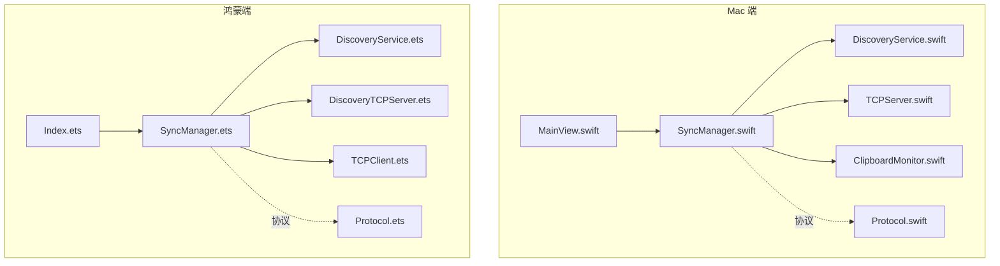
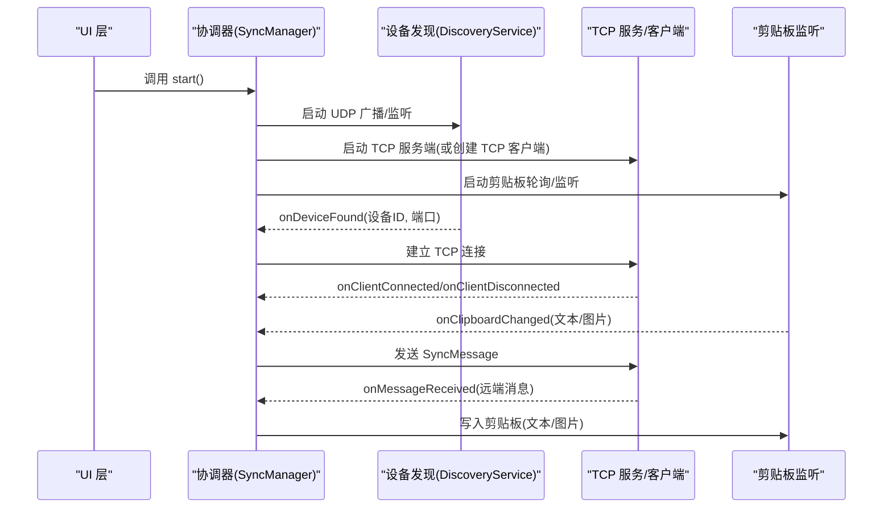
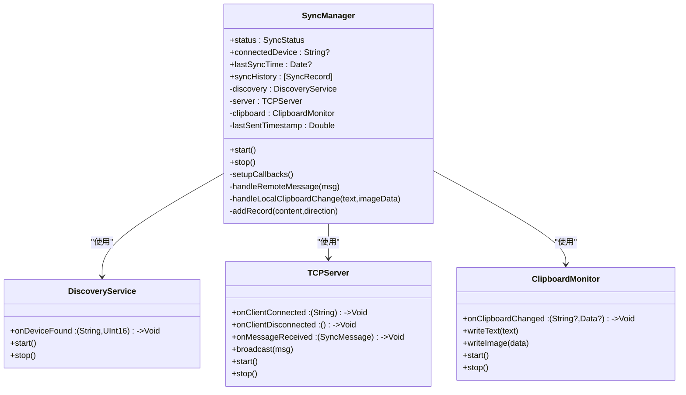
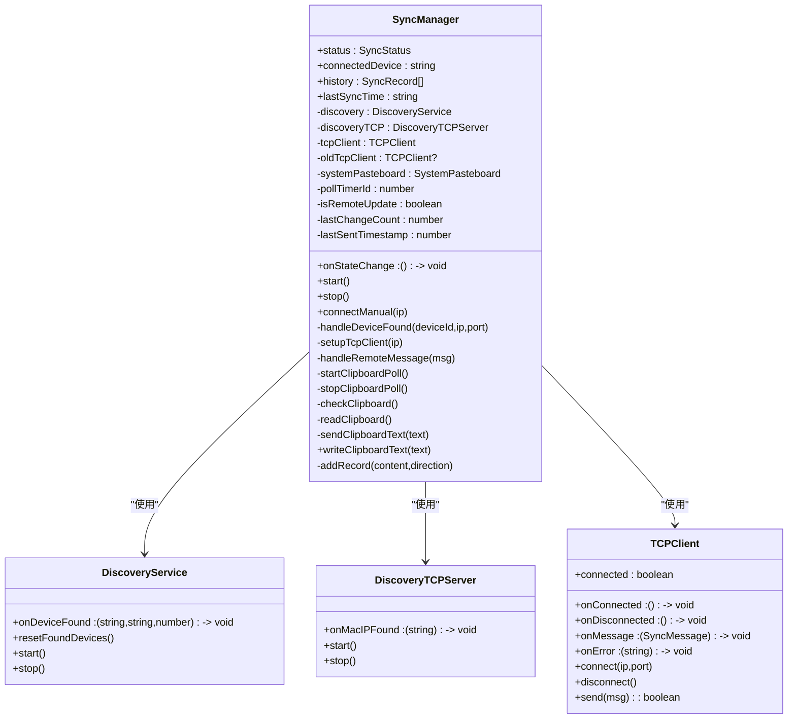
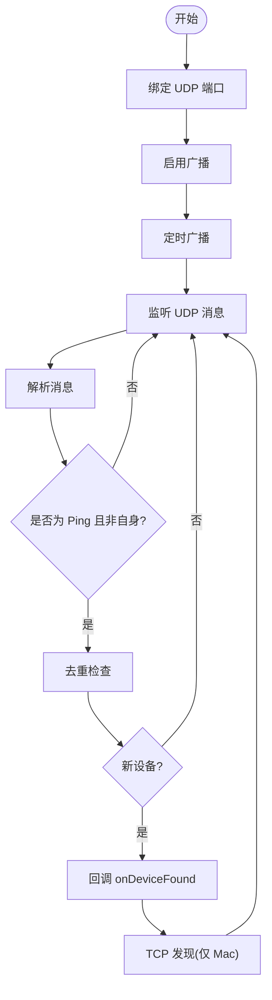
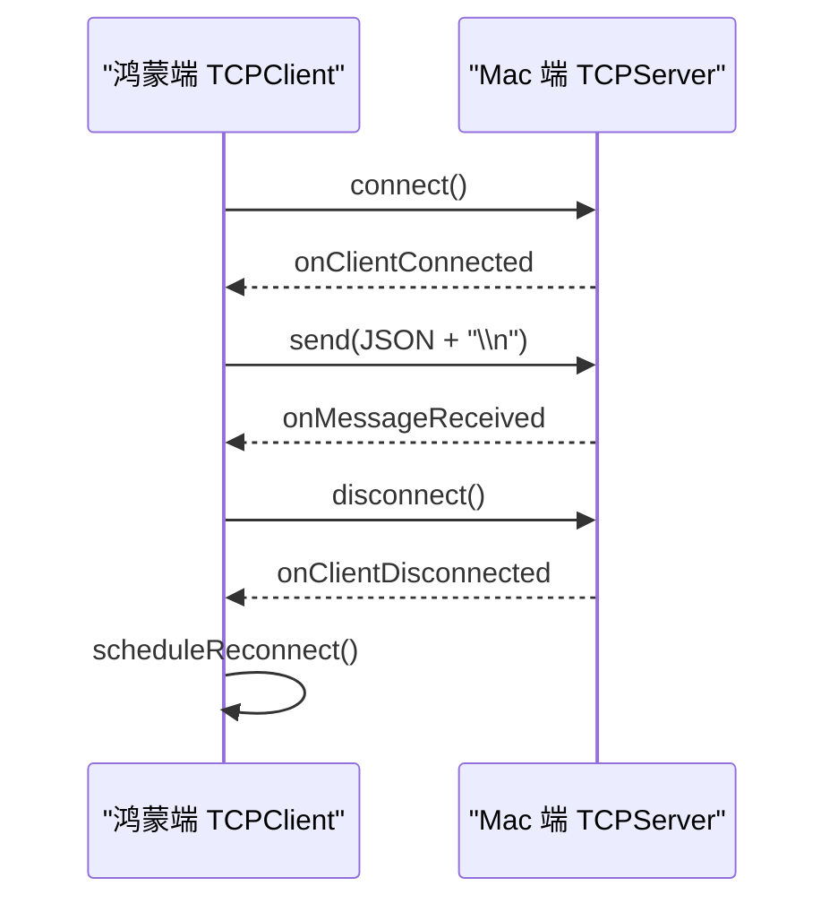
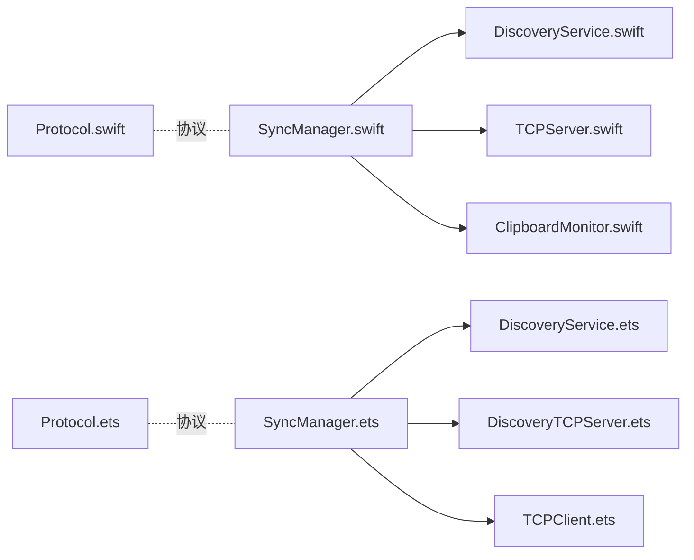

# 协调器设计模式

<cite>
**本文档引用的文件**
- [SyncManager.swift](file://ClipboardSync/mac/ClipboardSync/SyncManager.swift)
- [SyncManager.ets](file://ClipboardSync/harmony/entry/src/main/ets/model/SyncManager.ets)
- [DiscoveryService.swift](file://ClipboardSync/mac/ClipboardSync/DiscoveryService.swift)
- [DiscoveryService.ets](file://ClipboardSync/harmony/entry/src/main/ets/common/DiscoveryService.ets)
- [TCPServer.swift](file://ClipboardSync/mac/ClipboardSync/TCPServer.swift)
- [TCPClient.ets](file://ClipboardSync/harmony/entry/src/main/ets/common/TCPClient.ets)
- [ClipboardMonitor.swift](file://ClipboardSync/mac/ClipboardSync/ClipboardMonitor.swift)
- [DiscoveryTCPServer.ets](file://ClipboardSync/harmony/entry/src/main/ets/common/DiscoveryTCPServer.ets)
- [Protocol.swift](file://ClipboardSync/mac/ClipboardSync/Protocol.swift)
- [Protocol.ets](file://ClipboardSync/harmony/entry/src/main/ets/common/Protocol.ets)
- [MainView.swift](file://ClipboardSync/mac/ClipboardSync/MainView.swift)
- [Index.ets](file://ClipboardSync/harmony/entry/src/main/ets/pages/Index.ets)
</cite>

## 目录
1. [简介](#简介)
2. [项目结构](#项目结构)
3. [核心组件](#核心组件)
4. [架构总览](#架构总览)
5. [详细组件分析](#详细组件分析)
6. [依赖关系分析](#依赖关系分析)
7. [性能考量](#性能考量)
8. [故障排查指南](#故障排查指南)
9. [结论](#结论)

## 简介
本文件围绕 ClipboardSync 项目中的协调器设计模式展开，重点阐述 SyncManager 作为中央协调器在 Mac 端与鸿蒙端的实现差异与统一机制。协调器负责统一管理设备发现、TCP 连接、剪贴板监听等子服务，并通过事件回调实现模块间解耦与通信。本文将结合具体代码路径，说明初始化、启动、停止等关键流程，以及协调器在整个系统架构中的关键作用。

## 项目结构
项目采用按平台划分的结构，Mac 端与鸿蒙端分别实现相同职责的模块，但技术栈不同：
- Mac 端：Swift + SwiftUI，使用 Network.framework 与 AppKit
- 鸿蒙端：ArkTS + HarmonyOS SDK，使用 NetworkKit 与 BasicServicesKit

图表来源
- [SyncManager.swift:1-154](file://ClipboardSync/mac/ClipboardSync/SyncManager.swift#L1-L154)
- [DiscoveryService.swift:1-197](file://ClipboardSync/mac/ClipboardSync/DiscoveryService.swift#L1-L197)
- [TCPServer.swift:1-174](file://ClipboardSync/mac/ClipboardSync/TCPServer.swift#L1-L174)
- [ClipboardMonitor.swift:1-73](file://ClipboardSync/mac/ClipboardSync/ClipboardMonitor.swift#L1-L73)
- [SyncManager.ets:1-301](file://ClipboardSync/harmony/entry/src/main/ets/model/SyncManager.ets#L1-L301)
- [DiscoveryService.ets:1-161](file://ClipboardSync/harmony/entry/src/main/ets/common/DiscoveryService.ets#L1-L161)
- [DiscoveryTCPServer.ets:1-80](file://ClipboardSync/harmony/entry/src/main/ets/common/DiscoveryTCPServer.ets#L1-L80)
- [TCPClient.ets:1-181](file://ClipboardSync/harmony/entry/src/main/ets/common/TCPClient.ets#L1-L181)
- [Protocol.swift:1-43](file://ClipboardSync/mac/ClipboardSync/Protocol.swift#L1-L43)
- [Protocol.ets:1-27](file://ClipboardSync/harmony/entry/src/main/ets/common/Protocol.ets#L1-L27)
- [MainView.swift:1-209](file://ClipboardSync/mac/ClipboardSync/MainView.swift#L1-L209)
- [Index.ets:1-226](file://ClipboardSync/harmony/entry/src/main/ets/pages/Index.ets#L1-L226)

章节来源
- [SyncManager.swift:1-154](file://ClipboardSync/mac/ClipboardSync/SyncManager.swift#L1-L154)
- [SyncManager.ets:1-301](file://ClipboardSync/harmony/entry/src/main/ets/model/SyncManager.ets#L1-L301)
- [Protocol.swift:1-43](file://ClipboardSync/mac/ClipboardSync/Protocol.swift#L1-L43)
- [Protocol.ets:1-27](file://ClipboardSync/harmony/entry/src/main/ets/common/Protocol.ets#L1-L27)

## 核心组件
- Mac 端协调器：SyncManager.swift
  - 管理状态：连接状态、已连接设备、最后同步时间、同步历史
  - 子服务：设备发现（DiscoveryService）、TCP 服务端（TCPServer）、剪贴板监听（ClipboardMonitor）
  - 关键方法：start()/stop()、回调设置、消息处理、去重与历史记录
- 鸿蒙端协调器：SyncManager.ets
  - 管理状态：连接状态、已连接设备、历史记录、最后同步时间、诊断日志
  - 子服务：UDP 设备发现（DiscoveryService）、TCP 发现服务（DiscoveryTCPServer）、TCP 客户端（TCPClient）、系统剪贴板
  - 关键方法：start()/stop()/connectManual()、设备发现处理、TCP 客户端生命周期管理、轮询剪贴板、消息发送与接收、历史记录

章节来源
- [SyncManager.swift:4-53](file://ClipboardSync/mac/ClipboardSync/SyncManager.swift#L4-L53)
- [SyncManager.ets:26-71](file://ClipboardSync/harmony/entry/src/main/ets/model/SyncManager.ets#L26-L71)

## 架构总览
协调器作为中央枢纽，统一调度以下子系统：
- 设备发现：通过 UDP 广播/监听实现局域网内设备发现；Mac 端还通过 TCP 发现端口告知自身 IP
- 连接管理：建立或断开 TCP 连接，处理连接状态变更与重连
- 剪贴板监听：轮询或监听剪贴板变化，将变更内容通过 TCP 广播或单播发送
- 事件分发：通过回调将设备发现、连接状态、消息接收、剪贴板变化等事件传递给协调器，再由协调器统一处理

图表来源
- [SyncManager.swift:40-93](file://ClipboardSync/mac/ClipboardSync/SyncManager.swift#L40-L93)
- [SyncManager.ets:72-98](file://ClipboardSync/harmony/entry/src/main/ets/model/SyncManager.ets#L72-L98)
- [DiscoveryService.swift:15-29](file://ClipboardSync/mac/ClipboardSync/DiscoveryService.swift#L15-L29)
- [DiscoveryService.ets:25-70](file://ClipboardSync/harmony/entry/src/main/ets/common/DiscoveryService.ets#L25-L70)
- [TCPServer.swift:23-51](file://ClipboardSync/mac/ClipboardSync/TCPServer.swift#L23-L51)
- [TCPClient.ets:30-42](file://ClipboardSync/harmony/entry/src/main/ets/common/TCPClient.ets#L30-L42)
- [ClipboardMonitor.swift:16-28](file://ClipboardSync/mac/ClipboardSync/ClipboardMonitor.swift#L16-L28)

## 详细组件分析

### Mac 端协调器：SyncManager.swift
- 设计理念
  - 以状态机为核心：disconnected/discovering/connected 三态切换
  - 事件驱动：通过回调将设备发现、TCP 连接、剪贴板变化等事件汇聚到协调器
  - 去重与防环：基于时间戳避免消息回环
- 关键实现
  - 初始化：setupCallbacks() 设置各子服务回调
  - 启动：start() 启动发现、服务端、剪贴板监听
  - 停止：stop() 停止所有子服务并重置状态
  - 消息处理：handleRemoteMessage() 处理远端消息，writeText/writeImage 写入剪贴板
  - 本地变更：handleLocalClipboardChange() 读取剪贴板内容，构造消息并通过服务端广播
  - 历史记录：addRecord() 限制历史数量并更新 UI

图表来源
- [SyncManager.swift:5-153](file://ClipboardSync/mac/ClipboardSync/SyncManager.swift#L5-L153)
- [DiscoveryService.swift:6-100](file://ClipboardSync/mac/ClipboardSync/DiscoveryService.swift#L6-L100)
- [TCPServer.swift:6-106](file://ClipboardSync/mac/ClipboardSync/TCPServer.swift#L6-L106)
- [ClipboardMonitor.swift:4-48](file://ClipboardSync/mac/ClipboardSync/ClipboardMonitor.swift#L4-L48)

章节来源
- [SyncManager.swift:36-93](file://ClipboardSync/mac/ClipboardSync/SyncManager.swift#L36-L93)
- [SyncManager.swift:95-152](file://ClipboardSync/mac/ClipboardSync/SyncManager.swift#L95-L152)

### 鸿蒙端协调器：SyncManager.ets
- 设计理念
  - 以状态回调驱动 UI 更新：onStateChange 通知状态变化
  - 双通道发现：UDP 广播发现 Mac，同时通过 DiscoveryTCPServer 监听 Mac 的 TCP 连接以获取 IP
  - 客户端生命周期管理：每次连接前断开旧连接，延迟重建，避免资源竞争
  - 轮询剪贴板：定期检查 changeCount，避免远程写入导致的循环触发
- 关键实现
  - 启动：start() 启动 UDP 发现、TCP 发现服务、剪贴板轮询
  - 停止：stop() 停止所有子服务并清理轮询
  - 设备发现：handleDeviceFound() 与 setupTcpClient() 建立 TCP 连接
  - 远端消息：handleRemoteMessage() 去重并写入剪贴板
  - 剪贴板轮询：startClipboardPoll()/checkClipboard()/readClipboard() 发送文本消息
  - 历史记录：addRecord() 限制长度并触发 UI 更新

图表来源
- [SyncManager.ets:26-300](file://ClipboardSync/harmony/entry/src/main/ets/model/SyncManager.ets#L26-L300)
- [DiscoveryService.ets:10-160](file://ClipboardSync/harmony/entry/src/main/ets/common/DiscoveryService.ets#L10-L160)
- [DiscoveryTCPServer.ets:11-79](file://ClipboardSync/harmony/entry/src/main/ets/common/DiscoveryTCPServer.ets#L11-L79)
- [TCPClient.ets:11-180](file://ClipboardSync/harmony/entry/src/main/ets/common/TCPClient.ets#L11-L180)

章节来源
- [SyncManager.ets:72-174](file://ClipboardSync/harmony/entry/src/main/ets/model/SyncManager.ets#L72-L174)
- [SyncManager.ets:178-299](file://ClipboardSync/harmony/entry/src/main/ets/model/SyncManager.ets#L178-L299)

### 设备发现模块对比
- Mac 端 DiscoveryService.swift
  - 使用 BSD Socket 实现 UDP 广播与监听，支持 TCP 发现（连接到鸿蒙端发现端口获取 IP）
  - 去重集合避免重复回调与重复 TCP 发现
- 鸿蒙端 DiscoveryService.ets
  - 使用 NetworkKit UDPSocket，绑定广播端口并定时发送广播
  - 去重数组支持重置以允许重新发现同一设备

图表来源
- [DiscoveryService.swift:15-100](file://ClipboardSync/mac/ClipboardSync/DiscoveryService.swift#L15-L100)
- [DiscoveryService.ets:25-95](file://ClipboardSync/harmony/entry/src/main/ets/common/DiscoveryService.ets#L25-L95)

章节来源
- [DiscoveryService.swift:33-100](file://ClipboardSync/mac/ClipboardSync/DiscoveryService.swift#L33-L100)
- [DiscoveryService.ets:126-160](file://ClipboardSync/harmony/entry/src/main/ets/common/DiscoveryService.ets#L126-L160)

### TCP 服务与客户端对比
- Mac 端 TCPServer.swift
  - 作为服务端监听，使用换行符分隔消息，维护连接列表与缓冲区
  - 广播消息给所有连接
- 鸿蒙端 TCPClient.ets
  - 作为客户端连接 Mac 服务端，支持重连与粘包处理
  - 通过回调通知连接状态与消息接收

图表来源
- [TCPClient.ets:30-113](file://ClipboardSync/harmony/entry/src/main/ets/common/TCPClient.ets#L30-L113)
- [TCPServer.swift:75-147](file://ClipboardSync/mac/ClipboardSync/TCPServer.swift#L75-L147)

章节来源
- [TCPClient.ets:115-146](file://ClipboardSync/harmony/entry/src/main/ets/common/TCPClient.ets#L115-L146)
- [TCPServer.swift:108-147](file://ClipboardSync/mac/ClipboardSync/TCPServer.swift#L108-L147)

### 剪贴板监听对比
- Mac 端 ClipboardMonitor.swift
  - 使用 NSTimer 轮询，区分文本与图片，写入剪贴板时标记 isRemoteUpdate 防止循环
- 鸿蒙端
  - 通过系统剪贴板接口轮询 changeCount，避免远程写入导致的循环

章节来源
- [ClipboardMonitor.swift:16-71](file://ClipboardSync/mac/ClipboardSync/ClipboardMonitor.swift#L16-L71)
- [SyncManager.ets:202-252](file://ClipboardSync/harmony/entry/src/main/ets/model/SyncManager.ets#L202-L252)

## 依赖关系分析
- 协调器对子服务的依赖
  - Mac 端：SyncManager 依赖 DiscoveryService、TCPServer、ClipboardMonitor
  - 鸿蒙端：SyncManager 依赖 DiscoveryService、DiscoveryTCPServer、TCPClient、系统剪贴板
- 协议一致性
  - 两端使用相同的协议常量与消息结构，确保跨端兼容
- UI 与协调器的耦合
  - Mac：MainView 通过 @ObservedObject 绑定 SyncManager 的发布属性
  - 鸿蒙：Index 通过 onStateChange 回调更新状态与历史

图表来源
- [SyncManager.swift:11-13](file://ClipboardSync/mac/ClipboardSync/SyncManager.swift#L11-L13)
- [SyncManager.ets:27-31](file://ClipboardSync/harmony/entry/src/main/ets/model/SyncManager.ets#L27-L31)
- [Protocol.swift:4-17](file://ClipboardSync/mac/ClipboardSync/Protocol.swift#L4-L17)
- [Protocol.ets:2-9](file://ClipboardSync/harmony/entry/src/main/ets/common/Protocol.ets#L2-L9)

章节来源
- [MainView.swift:3-21](file://ClipboardSync/mac/ClipboardSync/MainView.swift#L3-L21)
- [Index.ets:13-27](file://ClipboardSync/harmony/entry/src/main/ets/pages/Index.ets#L13-L27)

## 性能考量
- 轮询策略
  - Mac：剪贴板轮询间隔短，响应快但 CPU 占用略高
  - 鸿蒙：轮询间隔适中，兼顾性能与实时性
- TCP 消息帧
  - 使用换行符分隔消息，简单可靠，避免复杂序列化开销
- 去重与防环
  - 基于时间戳去重，有效防止消息回环
- 连接管理
  - 鸿蒙端在连接前断开旧连接并延迟重建，避免资源竞争与连接冲突

## 故障排查指南
- 设备无法被发现
  - 检查 UDP 广播端口与网络权限（Mac 端需允许广播）
  - 确认 DiscoveryService 的 start()/stop() 生命周期正确
- 连接不稳定或频繁断开
  - 查看 TCPClient 的重连逻辑与错误回调
  - 检查 Mac 端 TCPServer 的连接数与缓冲区处理
- 剪贴板循环写入
  - 确认 isRemoteUpdate 标志位在写入前后正确设置
  - 鸿蒙端检查 changeCount 轮询与去重逻辑
- UI 不更新
  - Mac：确认 @Published 属性在主线程更新
  - 鸿蒙：确认 onStateChange 回调正确绑定与触发

章节来源
- [DiscoveryService.swift:15-29](file://ClipboardSync/mac/ClipboardSync/DiscoveryService.swift#L15-L29)
- [TCPClient.ets:148-157](file://ClipboardSync/harmony/entry/src/main/ets/common/TCPClient.ets#L148-L157)
- [TCPServer.swift:75-106](file://ClipboardSync/mac/ClipboardSync/TCPServer.swift#L75-L106)
- [ClipboardMonitor.swift:30-48](file://ClipboardSync/mac/ClipboardSync/ClipboardMonitor.swift#L30-L48)
- [SyncManager.ets:202-233](file://ClipboardSync/harmony/entry/src/main/ets/model/SyncManager.ets#L202-L233)

## 结论
ClipboardSync 的协调器设计模式通过统一的状态管理、事件回调与模块解耦，实现了跨端一致的剪贴板同步能力。Mac 端与鸿蒙端在实现细节上存在差异（如 TCP 服务端/客户端角色、剪贴板监听方式），但共享相同的协议与核心流程。协调器在系统中的关键作用体现在：
- 统一调度多个子服务，降低模块间耦合
- 通过回调与状态机实现清晰的控制流
- 在两端保持一致的用户体验与功能表现