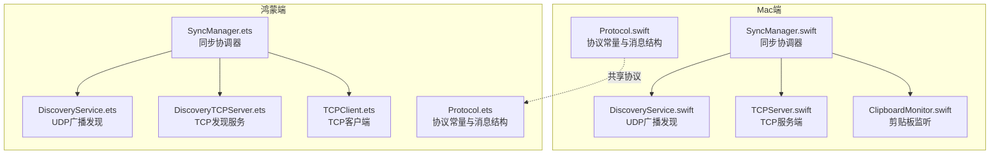
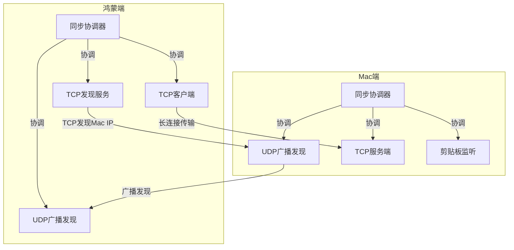
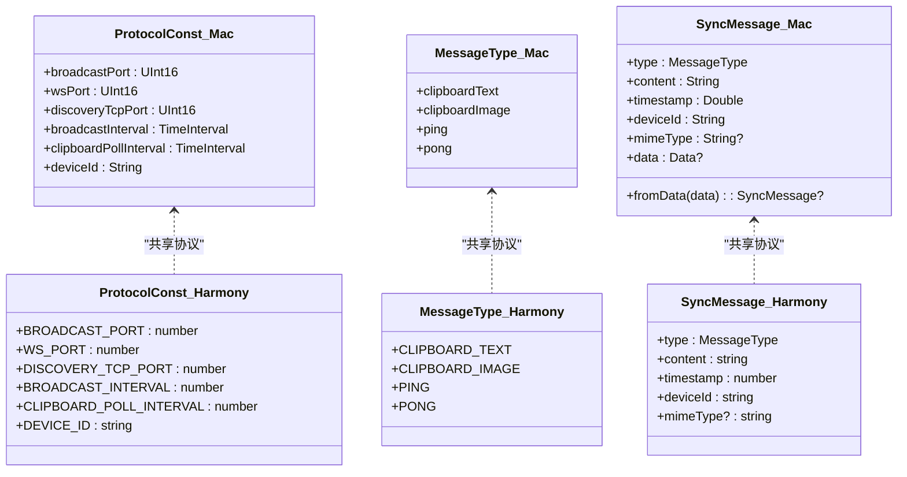
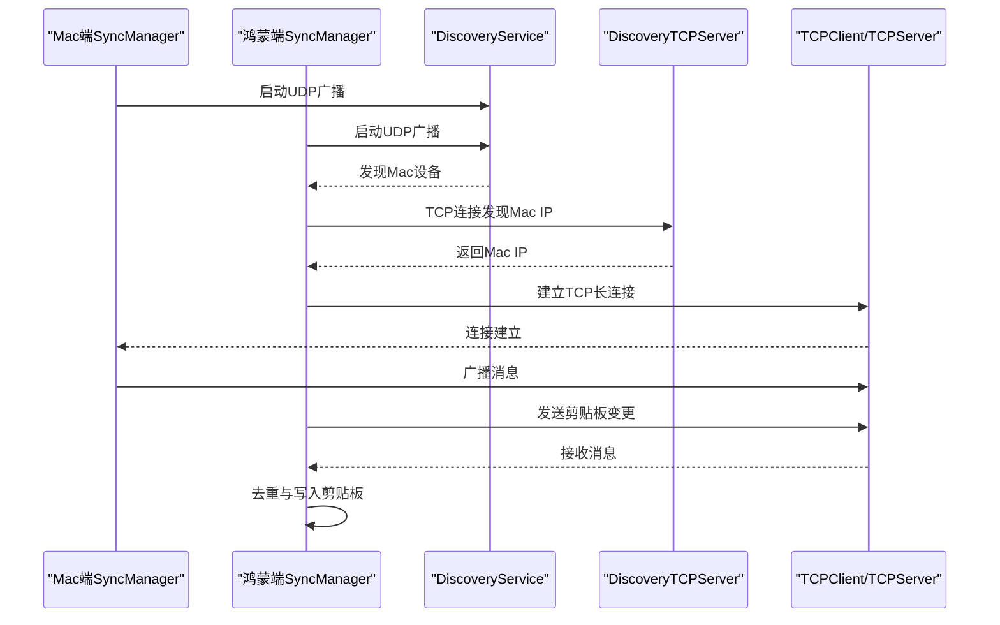
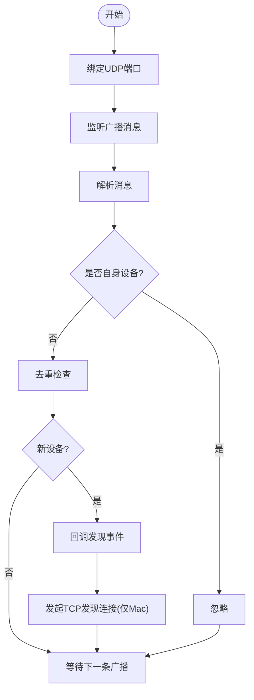
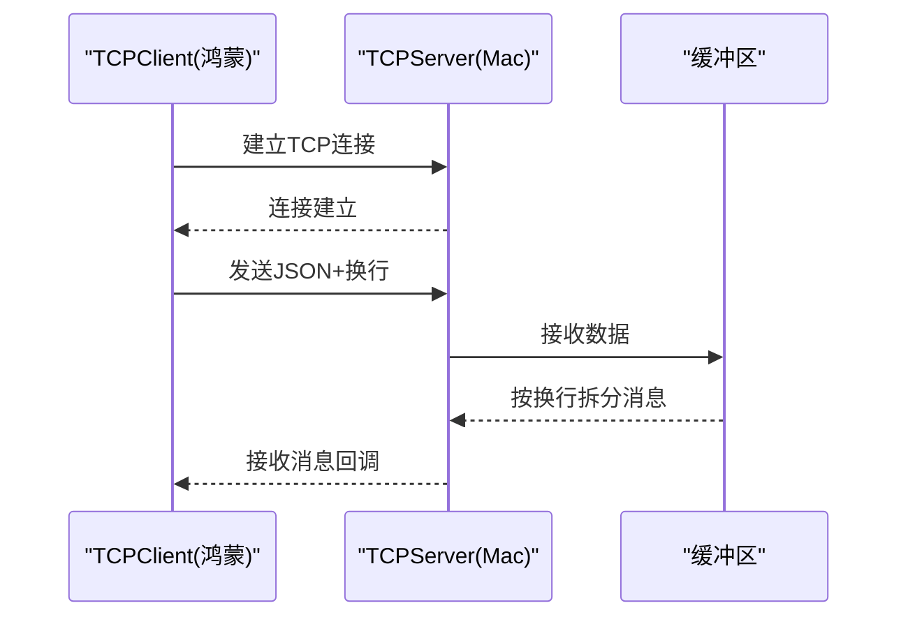
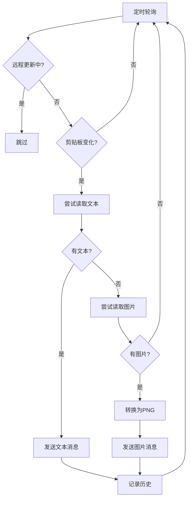
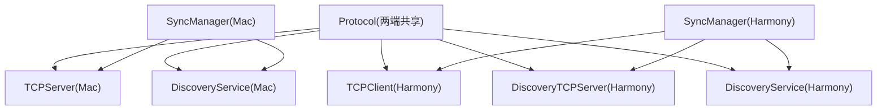

# 接口抽象设计

<cite>
**本文档引用的文件**
- [Protocol.swift](file://ClipboardSync/mac/ClipboardSync/Protocol.swift)
- [Protocol.ets](file://ClipboardSync/harmony/entry/src/main/ets/common/Protocol.ets)
- [SyncManager.swift](file://ClipboardSync/mac/ClipboardSync/SyncManager.swift)
- [SyncManager.ets](file://ClipboardSync/harmony/entry/src/main/ets/model/SyncManager.ets)
- [DiscoveryService.swift](file://ClipboardSync/mac/ClipboardSync/DiscoveryService.swift)
- [DiscoveryService.ets](file://ClipboardSync/harmony/entry/src/main/ets/common/DiscoveryService.ets)
- [TCPServer.swift](file://ClipboardSync/mac/ClipboardSync/TCPServer.swift)
- [TCPClient.ets](file://ClipboardSync/harmony/entry/src/main/ets/common/TCPClient.ets)
- [DiscoveryTCPServer.ets](file://ClipboardSync/harmony/entry/src/main/ets/common/DiscoveryTCPServer.ets)
- [ClipboardMonitor.swift](file://ClipboardSync/mac/ClipboardSync/ClipboardMonitor.swift)
- [PROJECT.md](file://ClipboardSync/PROJECT.md)
</cite>

## 目录
1. [引言](#引言)
2. [项目结构](#项目结构)
3. [核心组件](#核心组件)
4. [架构总览](#架构总览)
5. [详细组件分析](#详细组件分析)
6. [依赖关系分析](#依赖关系分析)
7. [性能考量](#性能考量)
8. [故障排除指南](#故障排除指南)
9. [结论](#结论)
10. [附录](#附录)

## 引言
本设计文档聚焦于ClipboardSync项目中的接口抽象设计，重点阐述如何通过协议层实现Mac端与鸿蒙端的松耦合通信。协议文件在两端共享使用，确保两端协议一致性，并通过接口抽象支持未来扩展与替换底层实现。文档还总结了接口设计原则、命名规范、版本兼容性考虑，以及跨平台代码复用与维护性的最佳实践。

## 项目结构
ClipboardSync采用按平台划分的目录结构，两端分别实现相同协议的共享定义与各自的网络与剪贴板适配层。

**图表来源**
- [Protocol.swift:1-43](file://ClipboardSync/mac/ClipboardSync/Protocol.swift#L1-L43)
- [Protocol.ets:1-27](file://ClipboardSync/harmony/entry/src/main/ets/common/Protocol.ets#L1-L27)
- [SyncManager.swift:1-154](file://ClipboardSync/mac/ClipboardSync/SyncManager.swift#L1-L154)
- [SyncManager.ets:1-301](file://ClipboardSync/harmony/entry/src/main/ets/model/SyncManager.ets#L1-L301)

**章节来源**
- [PROJECT.md:5-50](file://ClipboardSync/PROJECT.md#L5-L50)

## 核心组件
- 协议层（Protocol）：定义通信端口、消息类型与消息结构，两端共享，保证协议一致性。
- 发现层（DiscoveryService）：基于UDP广播进行设备发现，两端实现逻辑一致。
- 传输层（TCPClient/TCPServer）：基于长连接进行可靠消息传输，两端实现对应网络组件。
- 同步协调器（SyncManager）：统一调度发现、传输与剪贴板处理，两端职责一致。
- 剪贴板监听（ClipboardMonitor）：轮询监听系统剪贴板变化，两端实现逻辑一致。

**章节来源**
- [Protocol.swift:1-43](file://ClipboardSync/mac/ClipboardSync/Protocol.swift#L1-L43)
- [Protocol.ets:1-27](file://ClipboardSync/harmony/entry/src/main/ets/common/Protocol.ets#L1-L27)
- [SyncManager.swift:1-154](file://ClipboardSync/mac/ClipboardSync/SyncManager.swift#L1-L154)
- [SyncManager.ets:1-301](file://ClipboardSync/harmony/entry/src/main/ets/model/SyncManager.ets#L1-L301)

## 架构总览
两端通过共享协议实现松耦合通信，采用“UDP广播发现 + TCP长连接传输”的架构模式。Mac端作为TCP服务端，鸿蒙端作为TCP客户端；两端通过协议层的常量与消息结构保持一致。

**图表来源**
- [DiscoveryService.swift:1-197](file://ClipboardSync/mac/ClipboardSync/DiscoveryService.swift#L1-L197)
- [DiscoveryService.ets:1-161](file://ClipboardSync/harmony/entry/src/main/ets/common/DiscoveryService.ets#L1-L161)
- [DiscoveryTCPServer.ets:1-80](file://ClipboardSync/harmony/entry/src/main/ets/common/DiscoveryTCPServer.ets#L1-L80)
- [TCPServer.swift:1-174](file://ClipboardSync/mac/ClipboardSync/TCPServer.swift#L1-L174)
- [TCPClient.ets:1-181](file://ClipboardSync/harmony/entry/src/main/ets/common/TCPClient.ets#L1-L181)
- [SyncManager.swift:1-154](file://ClipboardSync/mac/ClipboardSync/SyncManager.swift#L1-L154)
- [SyncManager.ets:1-301](file://ClipboardSync/harmony/entry/src/main/ets/model/SyncManager.ets#L1-L301)

## 详细组件分析

### 协议层（Protocol）设计
- 协议常量：两端共享端口、轮询间隔与设备ID生成策略，确保发现与传输行为一致。
- 消息类型：两端共享消息类型枚举，保证消息语义一致。
- 消息结构：两端共享消息结构定义，包含类型、内容、时间戳、设备ID与可选MIME类型，支持文本与图片同步。

**图表来源**
- [Protocol.swift:4-17](file://ClipboardSync/mac/ClipboardSync/Protocol.swift#L4-L17)
- [Protocol.ets:2-9](file://ClipboardSync/harmony/entry/src/main/ets/common/Protocol.ets#L2-L9)
- [Protocol.swift:20-25](file://ClipboardSync/mac/ClipboardSync/Protocol.swift#L20-L25)
- [Protocol.ets:12-17](file://ClipboardSync/harmony/entry/src/main/ets/common/Protocol.ets#L12-L17)
- [Protocol.swift:28-42](file://ClipboardSync/mac/ClipboardSync/Protocol.swift#L28-L42)
- [Protocol.ets:20-26](file://ClipboardSync/harmony/entry/src/main/ets/common/Protocol.ets#L20-L26)

**章节来源**
- [Protocol.swift:1-43](file://ClipboardSync/mac/ClipboardSync/Protocol.swift#L1-L43)
- [Protocol.ets:1-27](file://ClipboardSync/harmony/entry/src/main/ets/common/Protocol.ets#L1-L27)

### 同步协调器（SyncManager）设计
- Mac端：负责启动发现、TCP服务端与剪贴板监听，处理去重与历史记录。
- 鸿蒙端：负责启动UDP发现、TCP发现服务与TCP客户端，实现轮询剪贴板与消息发送。

**图表来源**
- [SyncManager.swift:36-93](file://ClipboardSync/mac/ClipboardSync/SyncManager.swift#L36-L93)
- [SyncManager.ets:72-174](file://ClipboardSync/harmony/entry/src/main/ets/model/SyncManager.ets#L72-L174)
- [DiscoveryService.swift:15-29](file://ClipboardSync/mac/ClipboardSync/DiscoveryService.swift#L15-L29)
- [DiscoveryService.ets:25-85](file://ClipboardSync/harmony/entry/src/main/ets/common/DiscoveryService.ets#L25-L85)
- [DiscoveryTCPServer.ets:18-49](file://ClipboardSync/harmony/entry/src/main/ets/common/DiscoveryTCPServer.ets#L18-L49)
- [TCPServer.swift:23-51](file://ClipboardSync/mac/ClipboardSync/TCPServer.swift#L23-L51)
- [TCPClient.ets:30-42](file://ClipboardSync/harmony/entry/src/main/ets/common/TCPClient.ets#L30-L42)

**章节来源**
- [SyncManager.swift:1-154](file://ClipboardSync/mac/ClipboardSync/SyncManager.swift#L1-L154)
- [SyncManager.ets:1-301](file://ClipboardSync/harmony/entry/src/main/ets/model/SyncManager.ets#L1-L301)

### 发现层（DiscoveryService）设计
- Mac端：使用BSD Socket监听UDP广播，过滤自身设备，去重后回调发现事件，并向新设备发起TCP发现连接。
- 鸿蒙端：使用NetworkKit UDPSocket监听广播，解析消息后回调发现事件，支持重置已发现设备列表以实现断线重连。

**图表来源**
- [DiscoveryService.swift:33-100](file://ClipboardSync/mac/ClipboardSync/DiscoveryService.swift#L33-L100)
- [DiscoveryService.ets:126-160](file://ClipboardSync/harmony/entry/src/main/ets/common/DiscoveryService.ets#L126-L160)

**章节来源**
- [DiscoveryService.swift:1-197](file://ClipboardSync/mac/ClipboardSync/DiscoveryService.swift#L1-L197)
- [DiscoveryService.ets:1-161](file://ClipboardSync/harmony/entry/src/main/ets/common/DiscoveryService.ets#L1-L161)

### 传输层（TCPClient/TCPServer）设计
- Mac端：使用NWListener监听TCP连接，按行分隔消息，处理粘包与断线重连。
- 鸿蒙端：使用NetworkKit TCPSocket连接Mac端，按行分隔消息，实现自动重连与缓冲区处理。

**图表来源**
- [TCPServer.swift:108-148](file://ClipboardSync/mac/ClipboardSync/TCPServer.swift#L108-L148)
- [TCPClient.ets:115-146](file://ClipboardSync/harmony/entry/src/main/ets/common/TCPClient.ets#L115-L146)

**章节来源**
- [TCPServer.swift:1-174](file://ClipboardSync/mac/ClipboardSync/TCPServer.swift#L1-L174)
- [TCPClient.ets:1-181](file://ClipboardSync/harmony/entry/src/main/ets/common/TCPClient.ets#L1-L181)

### 剪贴板监听（ClipboardMonitor）设计
- Mac端：定时轮询NSPasteboard，优先读取文本，其次尝试读取图片并转换为PNG。
- 鸿蒙端：定时轮询系统剪贴板，读取文本后发送至Mac端。

**图表来源**
- [ClipboardMonitor.swift:50-71](file://ClipboardSync/mac/ClipboardSync/ClipboardMonitor.swift#L50-L71)
- [SyncManager.ets:202-233](file://ClipboardSync/harmony/entry/src/main/ets/model/SyncManager.ets#L202-L233)

**章节来源**
- [ClipboardMonitor.swift:1-73](file://ClipboardSync/mac/ClipboardSync/ClipboardMonitor.swift#L1-L73)
- [SyncManager.ets:200-233](file://ClipboardSync/harmony/entry/src/main/ets/model/SyncManager.ets#L200-L233)

## 依赖关系分析
- 协议层是所有模块的共同依赖，两端通过共享协议文件确保一致性。
- 同步协调器依赖发现层与传输层，实现端到端的同步流程。
- 发现层与传输层相互配合，发现层负责连接建立，传输层负责消息可靠传递。

**图表来源**
- [Protocol.swift:1-43](file://ClipboardSync/mac/ClipboardSync/Protocol.swift#L1-L43)
- [Protocol.ets:1-27](file://ClipboardSync/harmony/entry/src/main/ets/common/Protocol.ets#L1-L27)
- [SyncManager.swift:1-154](file://ClipboardSync/mac/ClipboardSync/SyncManager.swift#L1-L154)
- [SyncManager.ets:1-301](file://ClipboardSync/harmony/entry/src/main/ets/model/SyncManager.ets#L1-L301)

**章节来源**
- [SyncManager.swift:1-154](file://ClipboardSync/mac/ClipboardSync/SyncManager.swift#L1-L154)
- [SyncManager.ets:1-301](file://ClipboardSync/harmony/entry/src/main/ets/model/SyncManager.ets#L1-L301)

## 性能考量
- 轮询间隔：两端均采用定时轮询检测剪贴板变化，合理设置轮询间隔以平衡响应速度与CPU占用。
- 粘包处理：传输层按行分隔消息，避免粘包导致的解析错误。
- 去重机制：通过时间戳去重，防止写入剪贴板后触发监听回环，减少无效传输。
- 断线重连：传输层具备自动重连机制，提升连接稳定性。

[本节为通用性能讨论，不直接分析具体文件]

## 故障排除指南
- 鸿蒙端TCP连接错误码：注意`socket.SocketErrorInfo`在API 23中不可用，应使用`BusinessError`作为错误回调参数类型。
- 连接复用问题：`socket.close()`为异步操作，需等待旧连接完全关闭后再创建新连接，避免系统拒绝。
- Mac端构建配置：SDK版本类型必须为字符串而非数字，确保构建配置正确。
- SyncManager启动时机：Mac端应在应用启动时调用`start()`，避免UI触发才启动导致功能不可用。

**章节来源**
- [PROJECT.md:102-131](file://ClipboardSync/PROJECT.md#L102-L131)

## 结论
通过协议层的共享设计与模块化的接口抽象，ClipboardSync实现了Mac端与鸿蒙端的松耦合通信。协议常量与消息结构在两端保持一致，同步协调器统一调度发现与传输，去重与轮询机制保障了系统的稳定性和性能。该设计为未来的扩展与替换底层实现提供了良好的基础，同时提升了跨平台代码的复用性与可维护性。

[本节为总结性内容，不直接分析具体文件]

## 附录

### 接口设计原则
- 协议一致性：两端共享协议文件，确保端口、消息类型与消息结构一致。
- 松耦合：模块间通过接口解耦，便于替换底层实现。
- 可扩展：协议层预留扩展点，支持新增消息类型与传输方式。
- 版本兼容：通过协议常量与消息字段的兼容策略，保证向前兼容。

### 命名规范
- 协议常量：两端使用相同的命名风格与语义，如端口、轮询间隔、设备ID。
- 消息类型：两端使用相同的枚举值，如文本、图片、心跳消息。
- 方法与属性：遵循各自语言的命名约定，保持清晰易懂。

### 版本兼容性考虑
- 协议版本：通过协议常量与消息结构的兼容策略，确保新旧版本能够互通。
- 底层API：关注不同平台API版本差异，及时调整实现细节以保持兼容。

[本节为通用指导，不直接分析具体文件]