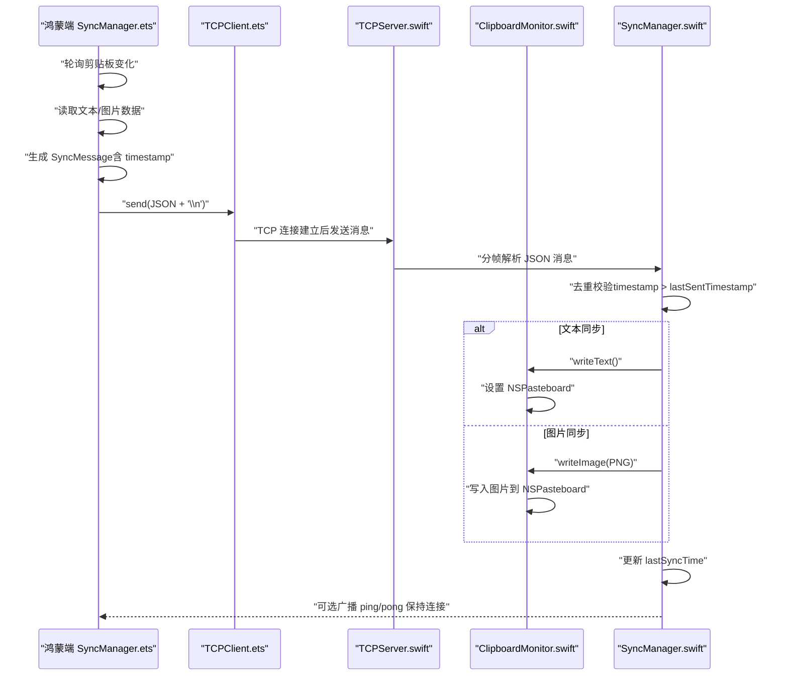
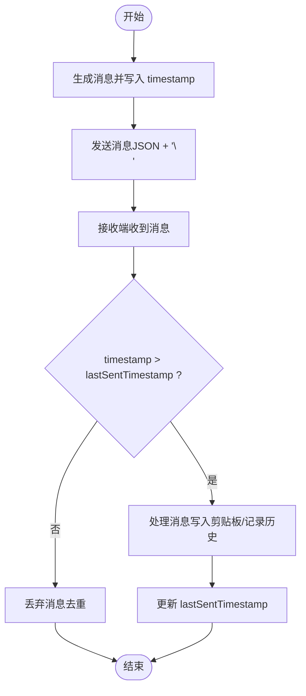
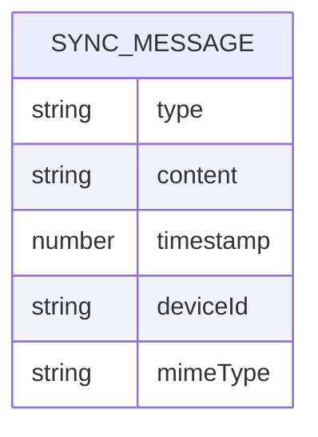
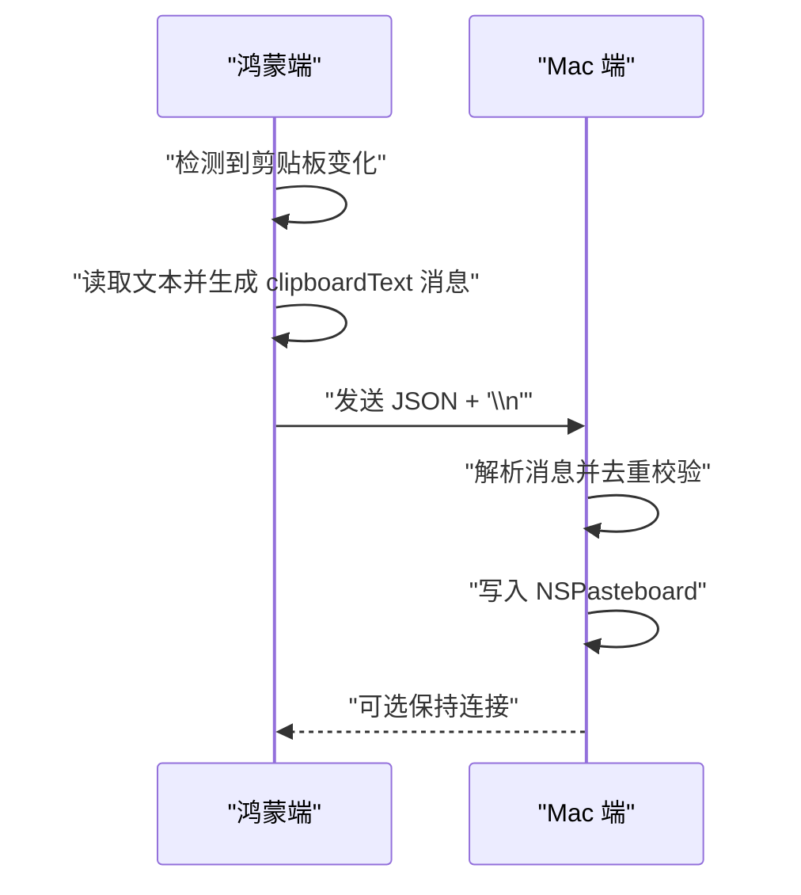
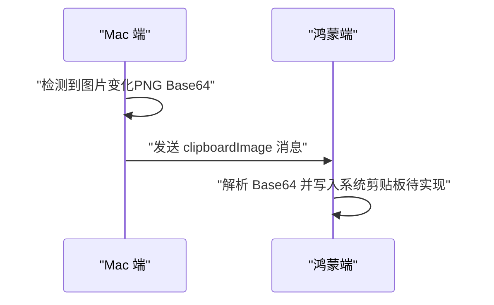
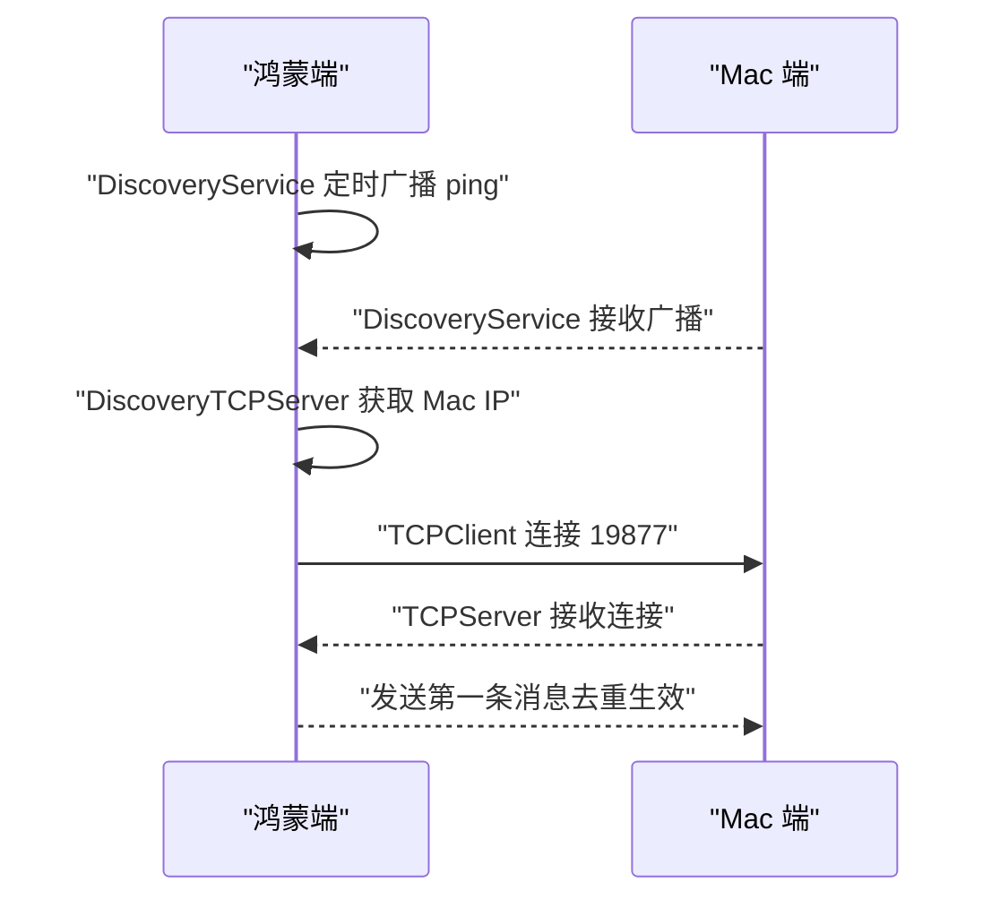
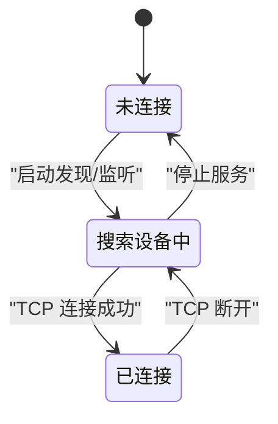
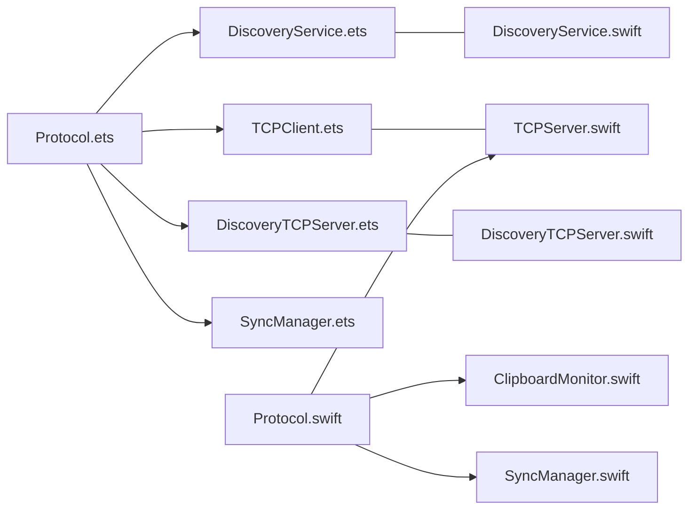

# 数据流控制

<cite>
**本文引用的文件**
- [SyncManager.ets](file://ClipboardSync/harmony/entry/src/main/ets/model/SyncManager.ets)
- [TCPClient.ets](file://ClipboardSync/harmony/entry/src/main/ets/common/TCPClient.ets)
- [DiscoveryService.ets](file://ClipboardSync/harmony/entry/src/main/ets/common/DiscoveryService.ets)
- [DiscoveryTCPServer.ets](file://ClipboardSync/harmony/entry/src/main/ets/common/DiscoveryTCPServer.ets)
- [Protocol.ets](file://ClipboardSync/harmony/entry/src/main/ets/common/Protocol.ets)
- [SyncManager.swift](file://ClipboardSync/mac/ClipboardSync/SyncManager.swift)
- [TCPServer.swift](file://ClipboardSync/mac/ClipboardSync/TCPServer.swift)
- [ClipboardMonitor.swift](file://ClipboardSync/mac/ClipboardSync/ClipboardMonitor.swift)
- [Protocol.swift](file://ClipboardSync/mac/ClipboardSync/Protocol.swift)
- [AppDelegate.swift](file://ClipboardSync/mac/ClipboardSync/AppDelegate.swift)
- [PROJECT.md](file://ClipboardSync/PROJECT.md)
</cite>

## 目录
1. [简介](#简介)
2. [项目结构](#项目结构)
3. [核心组件](#核心组件)
4. [架构总览](#架构总览)
5. [详细组件分析](#详细组件分析)
6. [依赖关系分析](#依赖关系分析)
7. [性能考量](#性能考量)
8. [故障排查指南](#故障排查指南)
9. [结论](#结论)
10. [附录](#附录)

## 简介
本文件聚焦于 ClipboardSync 项目的数据流控制，系统性阐述从剪贴板变化检测到消息发送、传输、接收、写入的完整数据流，深入解析去重防环机制（基于 timestamp 验证与 lastSentTimestamp 管理）、消息格式规范与编码方式、以及传输协议细节。同时提供数据流图与状态转换图，覆盖文本同步与图片同步等不同内容类型的处理流程，并给出常见问题的排查建议。

## 项目结构
项目采用“两端一协议”的分层设计：
- 协议层：两端共享的通信协议常量、消息类型与消息结构定义，确保两端一致的编码与解码行为。
- Mac 端：Swift 实现的 TCP 服务端、剪贴板监听、设备发现与同步协调器。
- 鸿蒙端：ArkTS 实现的 TCP 客户端、设备发现、剪贴板轮询与同步协调器。

```mermaid
graph TB
subgraph "Mac 端"
M_SyncMgr["SyncManager.swift<br/>协调器"]
M_TCPSrv["TCPServer.swift<br/>TCP 服务端"]
M_CBMon["ClipboardMonitor.swift<br/>剪贴板监听"]
M_Prot["Protocol.swift<br/>协议常量/消息结构"]
M_App["AppDelegate.swift<br/>应用入口"]
end
subgraph "鸿蒙端"
H_SyncMgr["SyncManager.ets<br/>协调器"]
H_TCPClient["TCPClient.ets<br/>TCP 客户端"]
H_Discovery["DiscoveryService.ets<br/>UDP 设备发现"]
H_DiscoveryTCP["DiscoveryTCPServer.ets<br/>TCP 发现服务"]
H_Prot["Protocol.ets<br/>协议常量/消息结构"]
end
M_SyncMgr --> M_TCPSrv
M_SyncMgr --> M_CBMon
M_SyncMgr --> M_Prot
M_App --> M_SyncMgr
H_SyncMgr --> H_TCPClient
H_SyncMgr --> H_Discovery
H_SyncMgr --> H_DiscoveryTCP
H_SyncMgr --> H_Prot
M_TCPSrv <- --> H_TCPClient
```

图表来源
- [SyncManager.swift:1-154](file://ClipboardSync/mac/ClipboardSync/SyncManager.swift#L1-L154)
- [TCPServer.swift:1-174](file://ClipboardSync/mac/ClipboardSync/TCPServer.swift#L1-L174)
- [ClipboardMonitor.swift:1-73](file://ClipboardSync/mac/ClipboardSync/ClipboardMonitor.swift#L1-L73)
- [Protocol.swift:1-43](file://ClipboardSync/mac/ClipboardSync/Protocol.swift#L1-L43)
- [AppDelegate.swift:1-46](file://ClipboardSync/mac/ClipboardSync/AppDelegate.swift#L1-L46)
- [SyncManager.ets:1-301](file://ClipboardSync/harmony/entry/src/main/ets/model/SyncManager.ets#L1-L301)
- [TCPClient.ets:1-181](file://ClipboardSync/harmony/entry/src/main/ets/common/TCPClient.ets#L1-L181)
- [DiscoveryService.ets:1-161](file://ClipboardSync/harmony/entry/src/main/ets/common/DiscoveryService.ets#L1-L161)
- [DiscoveryTCPServer.ets:1-80](file://ClipboardSync/harmony/entry/src/main/ets/common/DiscoveryTCPServer.ets#L1-L80)
- [Protocol.ets:1-27](file://ClipboardSync/harmony/entry/src/main/ets/common/Protocol.ets#L1-L27)

章节来源
- [PROJECT.md:52-63](file://ClipboardSync/PROJECT.md#L52-L63)

## 核心组件
- 协议层（两端共享）
  - 协议常量：包含广播端口、WS 端口、发现 TCP 端口、广播间隔、剪贴板轮询间隔、设备 ID 等。
  - 消息类型：clipboardText、clipboardImage、ping、pong。
  - 消息结构：type、content、timestamp、deviceId、mimeType。
- Mac 端
  - SyncManager：协调设备发现、TCP 连接、剪贴板监听与消息处理。
  - TCPServer：NWListener 监听，按换行符分隔 JSON 消息，广播给所有连接客户端。
  - ClipboardMonitor：NSPasteboard 轮询，优先读取文本，其次读取图片并转 PNG。
  - Protocol：与鸿蒙端共享的协议常量与消息结构。
- 鸿蒙端
  - SyncManager：协调设备发现、TCP 连接、剪贴板轮询与消息处理。
  - TCPClient：socket.TCPSocket 客户端，按换行符分隔 JSON 消息，自动处理粘包。
  - DiscoveryService：UDP 广播发现，过滤重复设备。
  - DiscoveryTCPServer：监听 19878 端口，从连接方地址获取 Mac IP。
  - Protocol：与 Mac 端共享的协议常量与消息结构。

章节来源
- [Protocol.ets:1-27](file://ClipboardSync/harmony/entry/src/main/ets/common/Protocol.ets#L1-L27)
- [Protocol.swift:1-43](file://ClipboardSync/mac/ClipboardSync/Protocol.swift#L1-L43)
- [SyncManager.swift:1-154](file://ClipboardSync/mac/ClipboardSync/SyncManager.swift#L1-L154)
- [TCPServer.swift:1-174](file://ClipboardSync/mac/ClipboardSync/TCPServer.swift#L1-L174)
- [ClipboardMonitor.swift:1-73](file://ClipboardSync/mac/ClipboardSync/ClipboardMonitor.swift#L1-L73)
- [SyncManager.ets:1-301](file://ClipboardSync/harmony/entry/src/main/ets/model/SyncManager.ets#L1-L301)
- [TCPClient.ets:1-181](file://ClipboardSync/harmony/entry/src/main/ets/common/TCPClient.ets#L1-L181)
- [DiscoveryService.ets:1-161](file://ClipboardSync/harmony/entry/src/main/ets/common/DiscoveryService.ets#L1-L161)
- [DiscoveryTCPServer.ets:1-80](file://ClipboardSync/harmony/entry/src/main/ets/common/DiscoveryTCPServer.ets#L1-L80)

## 架构总览
- 连接角色：Mac 端为 TCP 服务端，鸿蒙端为 TCP 客户端。
- 设备发现：两端定时广播 ping，Mac 端通过 UDP 广播端口 19876 发现彼此；鸿蒙端通过 DiscoveryTCPServer 获取 Mac 的 IP。
- 数据传输：TCP 长连接，消息以 JSON 行分隔（换行符），自动处理粘包。
- 去重防环：每条消息携带 timestamp，接收端仅处理大于 lastSentTimestamp 的消息，避免写入剪贴板后触发监听回环。



图表来源
- [SyncManager.ets:202-252](file://ClipboardSync/harmony/entry/src/main/ets/model/SyncManager.ets#L202-L252)
- [TCPClient.ets:44-58](file://ClipboardSync/harmony/entry/src/main/ets/common/TCPClient.ets#L44-L58)
- [SyncManager.swift:95-115](file://ClipboardSync/mac/ClipboardSync/SyncManager.swift#L95-L115)
- [TCPServer.swift:60-67](file://ClipboardSync/mac/ClipboardSync/TCPServer.swift#L60-L67)
- [ClipboardMonitor.swift:30-48](file://ClipboardSync/mac/ClipboardSync/ClipboardMonitor.swift#L30-L48)

章节来源
- [PROJECT.md:52-63](file://ClipboardSync/PROJECT.md#L52-L63)

## 详细组件分析

### 去重防环机制
- 机制原理
  - 发送端在发送前记录当前时间戳（秒级），并将其写入消息的 timestamp 字段。
  - 接收端维护 lastSentTimestamp，仅当收到消息的 timestamp 大于 lastSentTimestamp 时才处理该消息。
  - 此策略有效防止“写入剪贴板 → 触发监听 → 再次发送”导致的无限回环。
- 实现位置
  - 鸿蒙端：发送文本时设置 lastSentTimestamp，接收消息时进行比较。
  - Mac 端：发送文本/图片时设置 lastSentTimestamp，接收消息时进行比较。
- 边界与注意事项
  - 时间源应尽量一致，避免跨设备时间偏差导致误判。
  - 若系统时间回拨，可能短暂失效，建议结合设备 ID 与设备去重策略进一步增强鲁棒性。



图表来源
- [SyncManager.ets:256-269](file://ClipboardSync/harmony/entry/src/main/ets/model/SyncManager.ets#L256-L269)
- [SyncManager.swift:117-129](file://ClipboardSync/mac/ClipboardSync/SyncManager.swift#L117-L129)

章节来源
- [SyncManager.ets:178-198](file://ClipboardSync/harmony/entry/src/main/ets/model/SyncManager.ets#L178-L198)
- [SyncManager.swift:95-115](file://ClipboardSync/mac/ClipboardSync/SyncManager.swift#L95-L115)

### 消息格式规范与编码方式
- 消息结构
  - 字段：type（消息类型）、content（内容）、timestamp（时间戳，秒级）、deviceId（设备标识）、mimeType（可选，如 text/plain、image/png）。
- 编码方式
  - JSON 序列化为字符串，以换行符（\n）作为帧边界，形成“行分隔 JSON”消息。
  - Mac 端使用 JSONEncoder/JSONDecoder，Swift 的 Codable 协议保证序列化一致性。
  - 鸿蒙端使用 JSON.stringify 与 JSON.parse，确保两端一致。
- 传输协议
  - 设备发现：UDP 广播，端口 19876，消息为 ping。
  - 数据传输：TCP 长连接，端口 19877，消息以 \n 分隔，自动处理粘包。
  - 发现 TCP：鸿蒙端监听 19878 端口，Mac 端连接以获取其 IP。



图表来源
- [Protocol.ets:20-26](file://ClipboardSync/harmony/entry/src/main/ets/common/Protocol.ets#L20-L26)
- [Protocol.swift:28-42](file://ClipboardSync/mac/ClipboardSync/Protocol.swift#L28-L42)

章节来源
- [Protocol.ets:1-27](file://ClipboardSync/harmony/entry/src/main/ets/common/Protocol.ets#L1-L27)
- [Protocol.swift:1-43](file://ClipboardSync/mac/ClipboardSync/Protocol.swift#L1-L43)

### 文本同步流程
- 鸿蒙端
  - 轮询剪贴板，检测 changeCount 变化，读取文本，构造 clipboardText 消息，发送至 Mac。
  - 接收端收到消息后，若 timestamp 合法则写入系统剪贴板，更新历史记录。
- Mac 端
  - 轮询剪贴板，检测 changeCount 变化，读取文本，构造 clipboardText 消息，广播给所有连接客户端。
  - 接收端收到消息后，若 timestamp 合法则写入 NSPasteboard，更新历史记录。



图表来源
- [SyncManager.ets:235-252](file://ClipboardSync/harmony/entry/src/main/ets/model/SyncManager.ets#L235-L252)
- [SyncManager.swift:117-131](file://ClipboardSync/mac/ClipboardSync/SyncManager.swift#L117-L131)

章节来源
- [SyncManager.ets:235-252](file://ClipboardSync/harmony/entry/src/main/ets/model/SyncManager.ets#L235-L252)
- [SyncManager.swift:117-131](file://ClipboardSync/mac/ClipboardSync/SyncManager.swift#L117-L131)

### 图片同步流程
- Mac 端
  - 优先读取文本，若无文本则尝试读取图片（TIFF），转为 PNG Data 并以 Base64 形式放入 content 字段，消息类型为 clipboardImage。
  - 发送后由接收端解析 Base64 并写入 NSPasteboard。
- 鸿蒙端
  - 接收 clipboardImage 消息后，解析 Base64 并写入系统剪贴板（当前实现以占位记录为主，具体写入逻辑可按需扩展）。



图表来源
- [ClipboardMonitor.swift:62-70](file://ClipboardSync/mac/ClipboardSync/ClipboardMonitor.swift#L62-L70)
- [SyncManager.swift:131-141](file://ClipboardSync/mac/ClipboardSync/SyncManager.swift#L131-L141)
- [SyncManager.ets:188-190](file://ClipboardSync/harmony/entry/src/main/ets/model/SyncManager.ets#L188-L190)

章节来源
- [ClipboardMonitor.swift:62-70](file://ClipboardSync/mac/ClipboardSync/ClipboardMonitor.swift#L62-L70)
- [SyncManager.swift:131-141](file://ClipboardSync/mac/ClipboardSync/SyncManager.swift#L131-L141)

### 设备发现与连接建立
- 鸿蒙端
  - DiscoveryService：定时广播 ping，监听 UDP 广播，过滤重复设备，回调发现的新设备 IP。
  - DiscoveryTCPServer：监听 19878 端口，从连接方地址获取 Mac IP，避免 UDP 广播无法到达的情况。
  - TCPClient：连接 Mac 的 19877 端口，处理连接、消息、错误与重连。
- Mac 端
  - TCPServer：监听 19877 端口，接收来自鸿蒙端的消息，广播给所有连接客户端。
  - DiscoveryService：接收鸿蒙端广播，更新设备状态（当前用于 UI 展示，连接仍由 TCP 客户端负责）。



图表来源
- [DiscoveryService.ets:87-124](file://ClipboardSync/harmony/entry/src/main/ets/common/DiscoveryService.ets#L87-L124)
- [DiscoveryTCPServer.ets:18-78](file://ClipboardSync/harmony/entry/src/main/ets/common/DiscoveryTCPServer.ets#L18-L78)
- [TCPClient.ets:30-113](file://ClipboardSync/harmony/entry/src/main/ets/common/TCPClient.ets#L30-L113)
- [TCPServer.swift:23-51](file://ClipboardSync/mac/ClipboardSync/TCPServer.swift#L23-L51)

章节来源
- [DiscoveryService.ets:25-95](file://ClipboardSync/harmony/entry/src/main/ets/common/DiscoveryService.ets#L25-L95)
- [DiscoveryTCPServer.ets:18-78](file://ClipboardSync/harmony/entry/src/main/ets/common/DiscoveryTCPServer.ets#L18-L78)
- [TCPClient.ets:30-113](file://ClipboardSync/harmony/entry/src/main/ets/common/TCPClient.ets#L30-L113)
- [TCPServer.swift:23-51](file://ClipboardSync/mac/ClipboardSync/TCPServer.swift#L23-L51)

### 状态转换图
- 鸿蒙端状态
  - DISCONNECTED → DISCOVERING（启动发现服务）→ CONNECTED（TCP 连接成功）→ DISCOVERING（断开重连）。
- Mac 端状态
  - disconnected → discovering（启动 TCP 服务与发现）→ connected（有客户端连接）→ discovering（无客户端时）。



图表来源
- [SyncManager.ets:16-20](file://ClipboardSync/harmony/entry/src/main/ets/model/SyncManager.ets#L16-L20)
- [SyncManager.swift:18-22](file://ClipboardSync/mac/ClipboardSync/SyncManager.swift#L18-L22)

章节来源
- [SyncManager.ets:72-108](file://ClipboardSync/harmony/entry/src/main/ets/model/SyncManager.ets#L72-L108)
- [SyncManager.swift:40-53](file://ClipboardSync/mac/ClipboardSync/SyncManager.swift#L40-L53)

## 依赖关系分析
- 协议共享：两端共享 Protocol 文件，确保消息结构与常量一致。
- 传输层耦合：Mac 端 TCPServer 与鸿蒙端 TCPClient 互为对端，形成稳定的长连接。
- 监听与写入：两端均通过轮询检测剪贴板变化，写入系统剪贴板，形成双向同步闭环。
- 去重依赖：去重依赖双方对 timestamp 的一致理解与 lastSentTimestamp 的正确维护。



图表来源
- [Protocol.ets:1-27](file://ClipboardSync/harmony/entry/src/main/ets/common/Protocol.ets#L1-L27)
- [TCPClient.ets:1-181](file://ClipboardSync/harmony/entry/src/main/ets/common/TCPClient.ets#L1-L181)
- [DiscoveryService.ets:1-161](file://ClipboardSync/harmony/entry/src/main/ets/common/DiscoveryService.ets#L1-L161)
- [DiscoveryTCPServer.ets:1-80](file://ClipboardSync/harmony/entry/src/main/ets/common/DiscoveryTCPServer.ets#L1-L80)
- [SyncManager.ets:1-301](file://ClipboardSync/harmony/entry/src/main/ets/model/SyncManager.ets#L1-L301)
- [Protocol.swift:1-43](file://ClipboardSync/mac/ClipboardSync/Protocol.swift#L1-L43)
- [TCPServer.swift:1-174](file://ClipboardSync/mac/ClipboardSync/TCPServer.swift#L1-L174)
- [ClipboardMonitor.swift:1-73](file://ClipboardSync/mac/ClipboardSync/ClipboardMonitor.swift#L1-L73)
- [SyncManager.swift:1-154](file://ClipboardSync/mac/ClipboardSync/SyncManager.swift#L1-L154)

章节来源
- [PROJECT.md:52-63](file://ClipboardSync/PROJECT.md#L52-L63)

## 性能考量
- 轮询间隔
  - 两端均采用短周期轮询（0.5 秒），兼顾实时性与资源消耗。可根据设备性能调整。
- TCP 粘包处理
  - 两端均按换行符分帧，避免粘包影响；Mac 端使用缓冲区拼接，确保消息完整性。
- 去重效率
  - 基于时间戳的去重复杂度低，适合高频消息场景；建议避免频繁时间回拨。
- 广播与连接
  - UDP 广播间隔合理，避免过多网络负载；TCP 连接为长连接，减少握手开销。

[本节为通用性能讨论，不直接分析具体文件]

## 故障排查指南
- 鸿蒙端 TCP 连接报错“Operation in progress”
  - 原因：socket.close() 异步，旧 socket 未完全关闭即创建新连接。
  - 解决：在创建新 TCPClient 前先断开旧连接，并延迟一段时间后再连接。
- 鸿蒙端 socket 错误类型缺失
  - 原因：API 23 中 socket 模块未导出特定错误类型。
  - 解决：使用 BusinessError 作为错误回调参数类型。
- Mac 端构建配置错误
  - 原因：SDK 版本字段类型错误。
  - 解决：使用字符串而非数字。
- Mac 端应用未自动启动
  - 原因：启动时机不当。
  - 解决：在 AppDelegate 中直接调用 SyncManager.start()。

章节来源
- [PROJECT.md:102-131](file://ClipboardSync/PROJECT.md#L102-L131)
- [TCPClient.ets:138-157](file://ClipboardSync/harmony/entry/src/main/ets/common/TCPClient.ets#L138-L157)
- [SyncManager.ets:129-174](file://ClipboardSync/harmony/entry/src/main/ets/model/SyncManager.ets#L129-L174)

## 结论
ClipboardSync 通过“行分隔 JSON + 去重时间戳”的组合，在两端实现了稳定可靠的剪贴板同步。文本与图片同步路径清晰，去重防环机制有效避免回环。未来可在 UDP 自动发现连接、图片写入实现、状态持久化等方面持续优化，进一步提升用户体验与稳定性。

[本节为总结性内容，不直接分析具体文件]

## 附录
- 通信端口与协议
  - 设备发现：UDP 广播端口 19876，消息类型 ping。
  - 数据传输：TCP 端口 19877，消息以 \n 分隔。
  - 发现 TCP：端口 19878，用于获取 Mac IP。
- 消息类型
  - clipboardText：文本同步。
  - clipboardImage：图片同步（Base64 PNG）。
  - ping/pong：心跳/发现消息。

章节来源
- [PROJECT.md:52-63](file://ClipboardSync/PROJECT.md#L52-L63)
- [Protocol.ets:12-17](file://ClipboardSync/harmony/entry/src/main/ets/common/Protocol.ets#L12-L17)
- [Protocol.swift:19-25](file://ClipboardSync/mac/ClipboardSync/Protocol.swift#L19-L25)