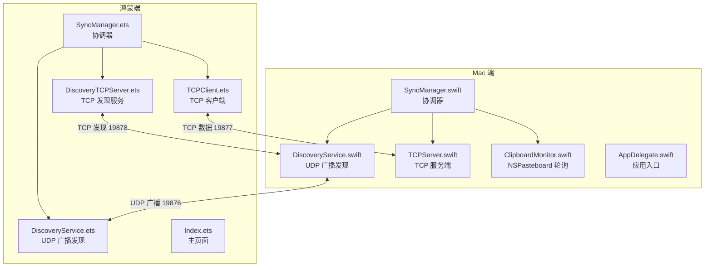
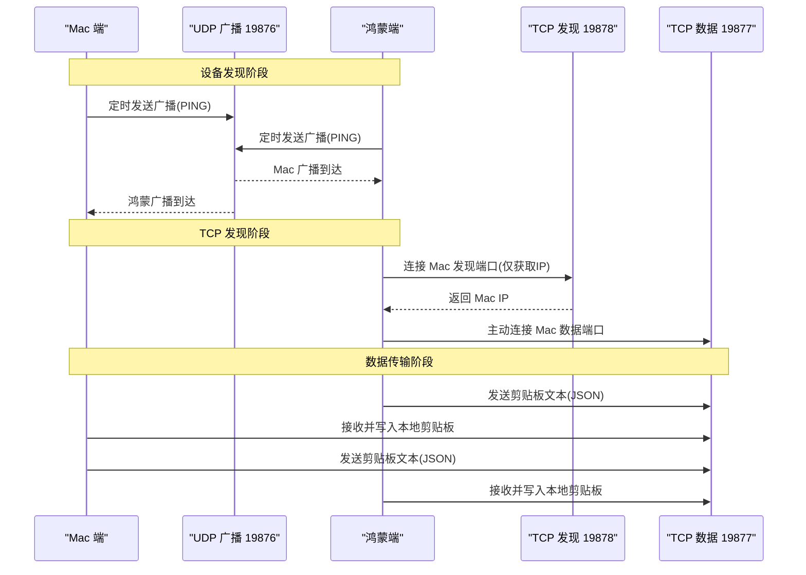
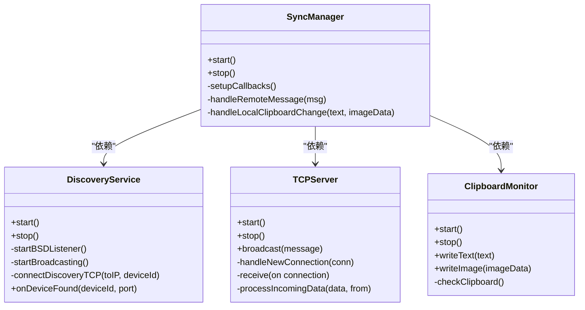
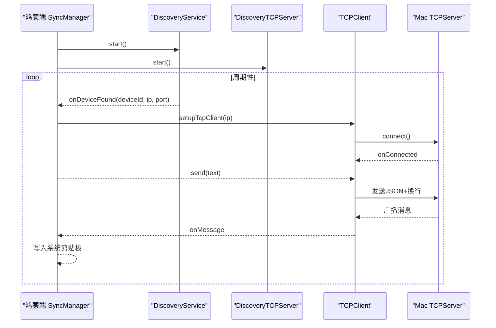
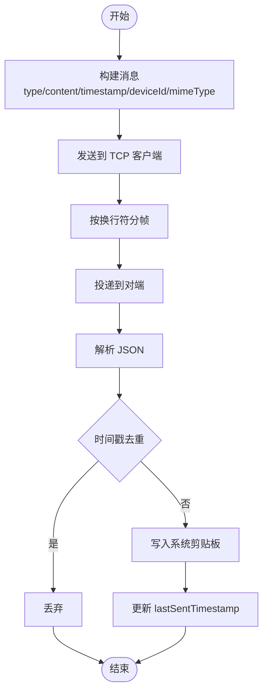
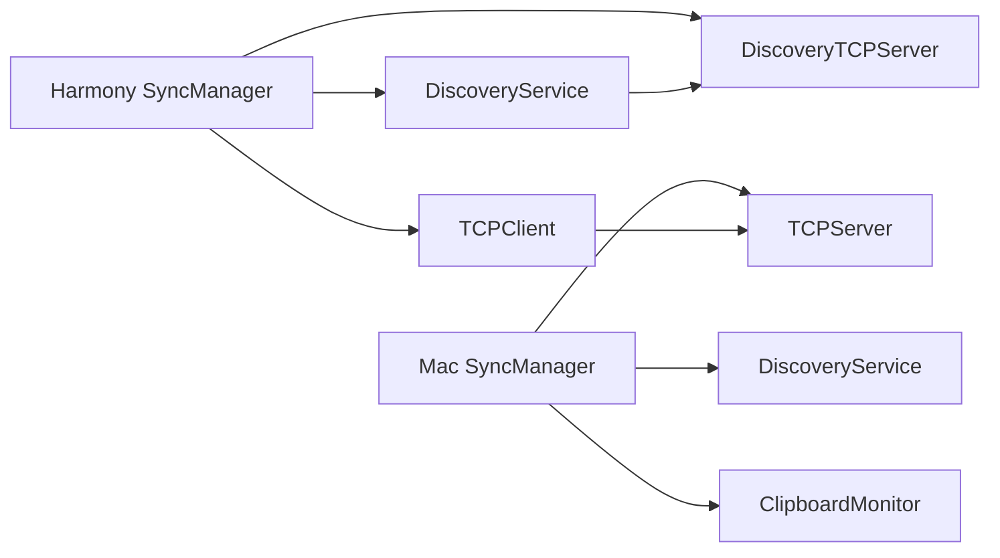

# 服务交互机制

<cite>
**本文档引用的文件**
- [DiscoveryService.swift](file://ClipboardSync/mac/ClipboardSync/DiscoveryService.swift)
- [TCPServer.swift](file://ClipboardSync/mac/ClipboardSync/TCPServer.swift)
- [ClipboardMonitor.swift](file://ClipboardSync/mac/ClipboardSync/ClipboardMonitor.swift)
- [SyncManager.swift](file://ClipboardSync/mac/ClipboardSync/SyncManager.swift)
- [Protocol.swift](file://ClipboardSync/mac/ClipboardSync/Protocol.swift)
- [DiscoveryService.ets](file://ClipboardSync/harmony/entry/src/main/ets/common/DiscoveryService.ets)
- [DiscoveryTCPServer.ets](file://ClipboardSync/harmony/entry/src/main/ets/common/DiscoveryTCPServer.ets)
- [TCPClient.ets](file://ClipboardSync/harmony/entry/src/main/ets/common/TCPClient.ets)
- [SyncManager.ets](file://ClipboardSync/harmony/entry/src/main/ets/model/SyncManager.ets)
- [Protocol.ets](file://ClipboardSync/harmony/entry/src/main/ets/common/Protocol.ets)
- [AppDelegate.swift](file://ClipboardSync/mac/ClipboardSync/AppDelegate.swift)
- [Index.ets](file://ClipboardSync/harmony/entry/src/main/ets/pages/Index.ets)
- [PROJECT.md](file://ClipboardSync/PROJECT.md)
</cite>

## 目录
1. [简介](#简介)
2. [项目结构](#项目结构)
3. [核心组件](#核心组件)
4. [架构总览](#架构总览)
5. [详细组件分析](#详细组件分析)
6. [依赖关系分析](#依赖关系分析)
7. [性能考虑](#性能考虑)
8. [故障排除指南](#故障排除指南)
9. [结论](#结论)

## 简介
本文件面向ClipboardSync项目的服务交互机制，系统性阐述Mac端与鸿蒙端之间设备发现、TCP通信与剪贴板监听三大服务模块的协作关系与交互流程。文档覆盖服务启动顺序、生命周期管理、异常处理策略，并提供关键时序图与流程图，帮助开发者快速理解与维护系统。

## 项目结构
项目采用“平台分离”的模块化组织方式：
- Mac端：Swift + SwiftUI，包含设备发现、TCP服务端、剪贴板监听与协调器
- 鸿蒙端：ArkTS + ArkUI，包含设备发现、TCP客户端、剪贴板轮询与协调器
- 两端共享协议定义，确保消息格式一致

图表来源
- [DiscoveryService.swift:1-197](file://ClipboardSync/mac/ClipboardSync/DiscoveryService.swift#L1-L197)
- [TCPServer.swift:1-174](file://ClipboardSync/mac/ClipboardSync/TCPServer.swift#L1-L174)
- [ClipboardMonitor.swift:1-73](file://ClipboardSync/mac/ClipboardSync/ClipboardMonitor.swift#L1-L73)
- [SyncManager.swift:1-154](file://ClipboardSync/mac/ClipboardSync/SyncManager.swift#L1-L154)
- [DiscoveryService.ets:1-161](file://ClipboardSync/harmony/entry/src/main/ets/common/DiscoveryService.ets#L1-L161)
- [DiscoveryTCPServer.ets:1-80](file://ClipboardSync/harmony/entry/src/main/ets/common/DiscoveryTCPServer.ets#L1-L80)
- [TCPClient.ets:1-181](file://ClipboardSync/harmony/entry/src/main/ets/common/TCPClient.ets#L1-L181)
- [SyncManager.ets:1-301](file://ClipboardSync/harmony/entry/src/main/ets/model/SyncManager.ets#L1-L301)

章节来源
- [PROJECT.md:52-63](file://ClipboardSync/PROJECT.md#L52-L63)

## 核心组件
- Mac端
  - DiscoveryService：基于BSD Socket的UDP广播与监听，负责局域网设备发现与TCP发现连接
  - TCPServer：基于Network框架的TCP服务端，处理连接接入、消息帧解析与广播
  - ClipboardMonitor：基于NSPasteboard的轮询监听，检测本地剪贴板变更
  - SyncManager：统一协调上述模块，管理状态、历史记录与消息去重
- 鸿蒙端
  - DiscoveryService：基于NetworkKit UDPSocket的UDP广播与监听
  - DiscoveryTCPServer：监听端口19878，用于Mac通过TCP连接获取其IP
  - TCPClient：基于NetworkKit TCPSocket的客户端，负责连接、消息收发与断线重连
  - SyncManager：协调设备发现、TCP连接与剪贴板轮询，处理消息去重与历史记录

章节来源
- [DiscoveryService.swift:1-197](file://ClipboardSync/mac/ClipboardSync/DiscoveryService.swift#L1-L197)
- [TCPServer.swift:1-174](file://ClipboardSync/mac/ClipboardSync/TCPServer.swift#L1-L174)
- [ClipboardMonitor.swift:1-73](file://ClipboardSync/mac/ClipboardSync/ClipboardMonitor.swift#L1-L73)
- [SyncManager.swift:1-154](file://ClipboardSync/mac/ClipboardSync/SyncManager.swift#L1-L154)
- [DiscoveryService.ets:1-161](file://ClipboardSync/harmony/entry/src/main/ets/common/DiscoveryService.ets#L1-L161)
- [DiscoveryTCPServer.ets:1-80](file://ClipboardSync/harmony/entry/src/main/ets/common/DiscoveryTCPServer.ets#L1-L80)
- [TCPClient.ets:1-181](file://ClipboardSync/harmony/entry/src/main/ets/common/TCPClient.ets#L1-L181)
- [SyncManager.ets:1-301](file://ClipboardSync/harmony/entry/src/main/ets/model/SyncManager.ets#L1-L301)

## 架构总览
系统采用“UDP发现 + TCP长连接”的混合架构：
- 设备发现层：双方周期性发送UDP广播，探测彼此在线状态
- 连接建立层：Mac端监听TCP 19877，鸿蒙端主动连接；同时通过TCP 19878进行Mac IP发现
- 数据传输层：基于换行符分隔的JSON消息，支持文本与图片（Base64）传输
- 去重与回环防护：通过消息时间戳判断，避免写入剪贴板后触发监听回环

图表来源
- [DiscoveryService.swift:104-146](file://ClipboardSync/mac/ClipboardSync/DiscoveryService.swift#L104-L146)
- [DiscoveryService.ets:87-124](file://ClipboardSync/harmony/entry/src/main/ets/common/DiscoveryService.ets#L87-L124)
- [DiscoveryTCPServer.ets:18-78](file://ClipboardSync/harmony/entry/src/main/ets/common/DiscoveryTCPServer.ets#L18-L78)
- [TCPClient.ets:30-113](file://ClipboardSync/harmony/entry/src/main/ets/common/TCPClient.ets#L30-L113)
- [TCPServer.swift:23-51](file://ClipboardSync/mac/ClipboardSync/TCPServer.swift#L23-L51)

## 详细组件分析

### Mac 端服务交互
- DiscoveryService
  - 监听UDP广播，解析PING消息，过滤自身设备，去重后回调发现事件
  - 对新设备发起TCP连接（端口19878），用于获取Mac的IP地址
  - 广播周期与端口由ProtocolConst统一管理
- TCPServer
  - 监听TCP 19877，处理连接接入、断开与消息接收
  - 使用缓冲区按换行符拆分消息，避免TCP粘包
  - 广播消息给所有已连接客户端
- ClipboardMonitor
  - 周期性轮询NSPasteboard，检测变更后读取文本或PNG图片
  - 写入剪贴板时设置远程更新标记，避免回环
- SyncManager
  - 统一启动/停止各子模块，维护状态与历史记录
  - 处理远端消息与本地变更，执行去重逻辑

图表来源
- [DiscoveryService.swift:6-29](file://ClipboardSync/mac/ClipboardSync/DiscoveryService.swift#L6-L29)
- [TCPServer.swift:6-51](file://ClipboardSync/mac/ClipboardSync/TCPServer.swift#L6-L51)
- [ClipboardMonitor.swift:4-29](file://ClipboardSync/mac/ClipboardSync/ClipboardMonitor.swift#L4-L29)
- [SyncManager.swift:5-53](file://ClipboardSync/mac/ClipboardSync/SyncManager.swift#L5-L53)

章节来源
- [DiscoveryService.swift:15-100](file://ClipboardSync/mac/ClipboardSync/DiscoveryService.swift#L15-L100)
- [TCPServer.swift:23-127](file://ClipboardSync/mac/ClipboardSync/TCPServer.swift#L23-L127)
- [ClipboardMonitor.swift:16-71](file://ClipboardSync/mac/ClipboardSync/ClipboardMonitor.swift#L16-L71)
- [SyncManager.swift:40-93](file://ClipboardSync/mac/ClipboardSync/SyncManager.swift#L40-L93)

### 鸿蒙端服务交互
- DiscoveryService
  - 绑定UDP端口，周期性发送广播，监听PING消息并去重
  - 发现Mac后回调设备ID、IP与数据端口
- DiscoveryTCPServer
  - 监听端口19878，从连接中获取Mac的IP地址
  - 仅用于发现，连接建立后立即关闭
- TCPClient
  - 主动连接Mac的TCP 19877，处理消息收发与断线重连
  - 使用缓冲区按换行符拆分消息，避免粘包
- SyncManager
  - 启动设备发现与TCP发现服务，根据发现结果建立TCP连接
  - 轮询系统剪贴板，发送文本消息；处理远端文本消息并写入系统剪贴板
  - 实现连接状态管理与历史记录维护

图表来源
- [SyncManager.ets:72-98](file://ClipboardSync/harmony/entry/src/main/ets/model/SyncManager.ets#L72-L98)
- [DiscoveryService.ets:25-70](file://ClipboardSync/harmony/entry/src/main/ets/common/DiscoveryService.ets#L25-L70)
- [DiscoveryTCPServer.ets:18-49](file://ClipboardSync/harmony/entry/src/main/ets/common/DiscoveryTCPServer.ets#L18-L49)
- [TCPClient.ets:30-113](file://ClipboardSync/harmony/entry/src/main/ets/common/TCPClient.ets#L30-L113)
- [TCPServer.swift:23-51](file://ClipboardSync/mac/ClipboardSync/TCPServer.swift#L23-L51)

章节来源
- [DiscoveryService.ets:25-161](file://ClipboardSync/harmony/entry/src/main/ets/common/DiscoveryService.ets#L25-L161)
- [DiscoveryTCPServer.ets:18-78](file://ClipboardSync/harmony/entry/src/main/ets/common/DiscoveryTCPServer.ets#L18-L78)
- [TCPClient.ets:11-181](file://ClipboardSync/harmony/entry/src/main/ets/common/TCPClient.ets#L11-L181)
- [SyncManager.ets:129-174](file://ClipboardSync/harmony/entry/src/main/ets/model/SyncManager.ets#L129-L174)

### 数据流与消息格式
- 协议常量
  - 广播端口：19876
  - 数据端口：19877
  - 发现端口：19878
  - 广播间隔：3秒
  - 剪贴板轮询间隔：0.5秒
- 消息结构
  - 字段：type、content、timestamp、deviceId、mimeType
  - 文本消息：mimeType为text/plain
  - 图片消息：content为PNG的Base64编码，mimeType为image/png
- 去重机制
  - 发送端记录lastSentTimestamp
  - 接收端丢弃timestamp<=lastSentTimestamp的消息

图表来源
- [Protocol.swift:28-42](file://ClipboardSync/mac/ClipboardSync/Protocol.swift#L28-L42)
- [Protocol.ets:19-27](file://ClipboardSync/harmony/entry/src/main/ets/common/Protocol.ets#L19-L27)
- [SyncManager.swift:117-142](file://ClipboardSync/mac/ClipboardSync/SyncManager.swift#L117-L142)
- [SyncManager.ets:178-198](file://ClipboardSync/harmony/entry/src/main/ets/model/SyncManager.ets#L178-L198)

章节来源
- [Protocol.swift:4-17](file://ClipboardSync/mac/ClipboardSync/Protocol.swift#L4-L17)
- [Protocol.ets:2-9](file://ClipboardSync/harmony/entry/src/main/ets/common/Protocol.ets#L2-L9)
- [SyncManager.swift:15-16](file://ClipboardSync/mac/ClipboardSync/SyncManager.swift#L15-L16)
- [SyncManager.ets:35](file://ClipboardSync/harmony/entry/src/main/ets/model/SyncManager.ets#L35)

## 依赖关系分析
- 模块内聚与耦合
  - SyncManager作为协调器，聚合DiscoveryService/TCPServer/ClipboardMonitor（Mac）或DiscoveryService/DiscoveryTCPServer/TCPClient（鸿蒙）
  - 各模块职责清晰，耦合通过回调与消息接口实现
- 外部依赖
  - Mac端：Foundation、Network、AppKit
  - 鸿蒙端：@kit.NetworkKit、@kit.BasicServicesKit、@kit.ArkTS
- 循环依赖
  - 无直接循环依赖，通过回调与消息解耦

图表来源
- [SyncManager.swift:11-13](file://ClipboardSync/mac/ClipboardSync/SyncManager.swift#L11-L13)
- [SyncManager.ets:27-29](file://ClipboardSync/harmony/entry/src/main/ets/model/SyncManager.ets#L27-L29)

章节来源
- [SyncManager.swift:11-13](file://ClipboardSync/mac/ClipboardSync/SyncManager.swift#L11-L13)
- [SyncManager.ets:27-29](file://ClipboardSync/harmony/entry/src/main/ets/model/SyncManager.ets#L27-L29)

## 性能考虑
- 广播与轮询
  - 广播间隔与轮询间隔均为毫秒级，建议在低负载场景下运行，避免频繁I/O
- TCP粘包处理
  - 两端均采用缓冲区+换行符拆分，降低内存占用与解析复杂度
- 去重策略
  - 时间戳去重有效防止回环，减少无效写入与网络抖动
- 连接复用与重连
  - 鸿蒙端在连接关闭后延迟重建，避免socket状态冲突

## 故障排除指南
- 鸿蒙端连接报错“Operation in progress”
  - 原因：socket.close()异步，旧连接未完全释放
  - 解决：在创建新连接前先断开旧连接，并延迟500ms再连接
- 鸿蒙端socket错误类型缺失
  - 原因：API 23中NetworkKit socket未导出SocketErrorInfo
  - 解决：使用BusinessError作为错误回调参数类型
- Mac端监听IPv6导致误解
  - 原因：NWListener默认监听IPv6且支持双栈
  - 解决：关注实际连接可达性，而非仅看lsof输出
- UDP自动发现未触发TCP连接
  - 现状：Mac端可收到广播，鸿蒙端收到广播后自动连接逻辑尚需完善
  - 建议：在收到广播后解析remoteInfo.address并触发TCP连接

章节来源
- [PROJECT.md:104-127](file://ClipboardSync/PROJECT.md#L104-L127)
- [SyncManager.ets:129-174](file://ClipboardSync/harmony/entry/src/main/ets/model/SyncManager.ets#L129-L174)

## 结论
ClipboardSync通过“UDP发现 + TCP长连接”实现了Mac与鸿蒙端的稳定剪贴板同步。两端在协议、消息格式与去重机制上保持一致，协调器负责模块编排与状态管理。当前版本在文本同步方面已稳定可用，图片同步与自动发现仍需进一步完善。建议优先修复UDP自动发现与图片接收能力，以提升用户体验与系统完整性。