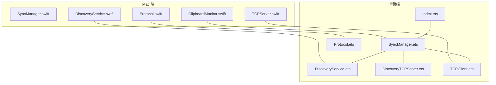
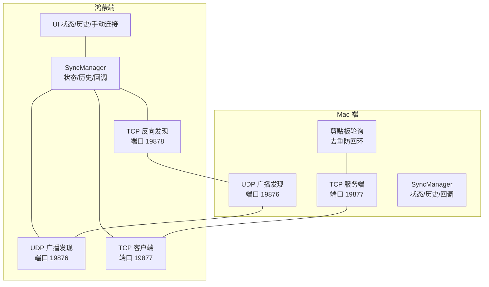
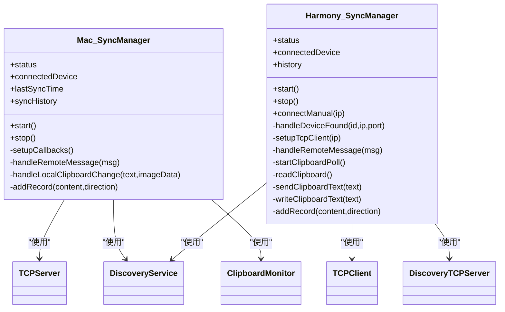
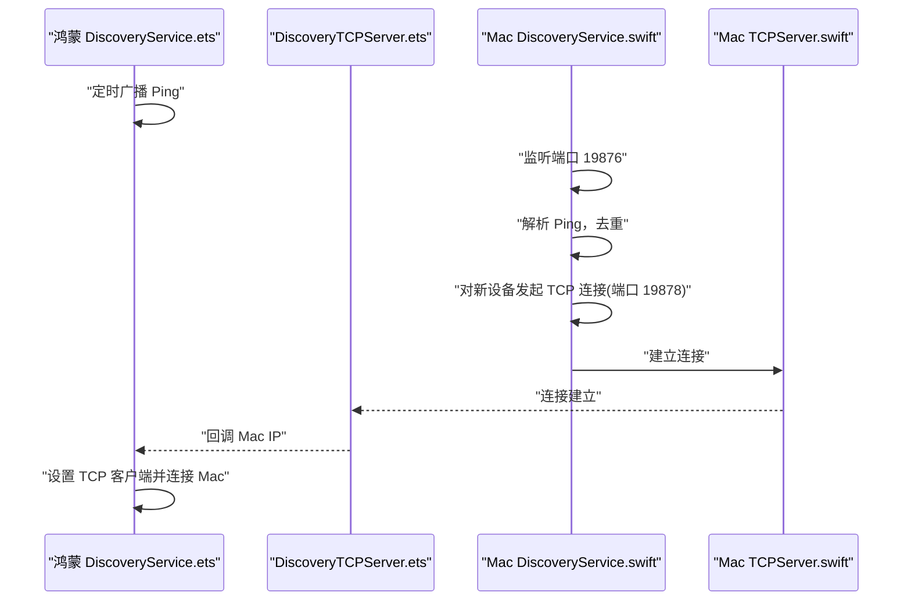
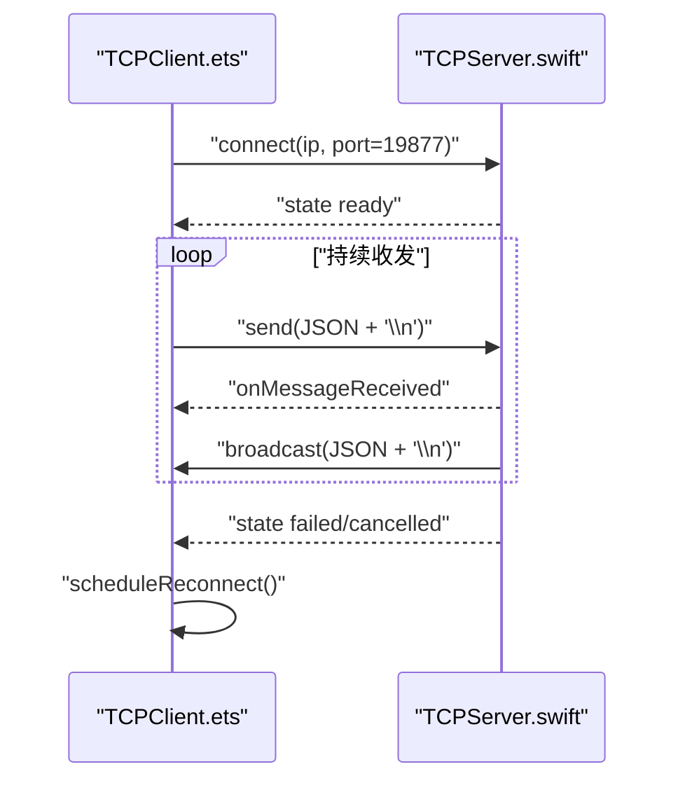
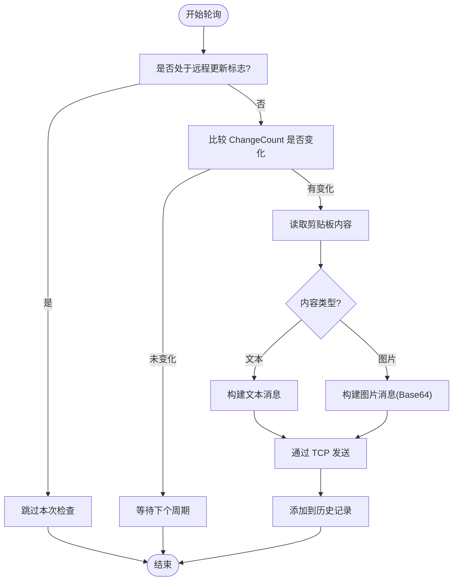
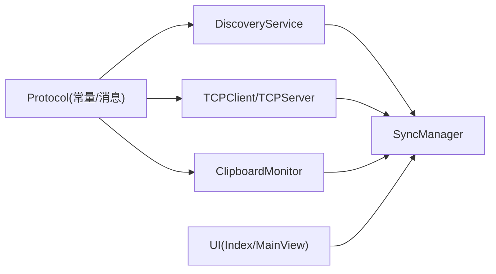

# 组件交互关系

<cite>
**本文引用的文件**
- [SyncManager.ets](file://ClipboardSync/harmony/entry/src/main/ets/model/SyncManager.ets)
- [SyncManager.swift](file://ClipboardSync/mac/ClipboardSync/SyncManager.swift)
- [DiscoveryService.ets](file://ClipboardSync/harmony/entry/src/main/ets/common/DiscoveryService.ets)
- [DiscoveryService.swift](file://ClipboardSync/mac/ClipboardSync/DiscoveryService.swift)
- [TCPClient.ets](file://ClipboardSync/harmony/entry/src/main/ets/common/TCPClient.ets)
- [TCPServer.swift](file://ClipboardSync/mac/ClipboardSync/TCPServer.swift)
- [Protocol.ets](file://ClipboardSync/harmony/entry/src/main/ets/common/Protocol.ets)
- [Protocol.swift](file://ClipboardSync/mac/ClipboardSync/Protocol.swift)
- [DiscoveryTCPServer.ets](file://ClipboardSync/harmony/entry/src/main/ets/common/DiscoveryTCPServer.ets)
- [ClipboardMonitor.swift](file://ClipboardSync/mac/ClipboardSync/ClipboardMonitor.swift)
- [Index.ets](file://ClipboardSync/harmony/entry/src/main/ets/pages/Index.ets)
- [MainView.swift](file://ClipboardSync/mac/ClipboardSync/MainView.swift)
- [PROJECT.md](file://ClipboardSync/PROJECT.md)
</cite>

## 目录
1. [简介](#简介)
2. [项目结构](#项目结构)
3. [核心组件](#核心组件)
4. [架构总览](#架构总览)
5. [详细组件分析](#详细组件分析)
6. [依赖关系分析](#依赖关系分析)
7. [性能考量](#性能考量)
8. [故障排查指南](#故障排查指南)
9. [结论](#结论)

## 简介
本文件聚焦于 ClipboardSync 项目在 Mac 端与鸿蒙端之间的组件交互关系，重点说明 SyncManager 作为中央协调器的作用，以及设备发现、TCP 连接、剪贴板监听等关键流程。文档同时提供组件交互图与时序图，帮助读者快速理解数据流与控制流，并解释组件解耦设计与接口抽象如何实现模块间的松耦合。

## 项目结构
项目采用“平台分离”的组织方式，Mac 端与鸿蒙端分别包含独立的协议、发现、网络与剪贴板模块，二者通过统一的协议常量与消息结构进行通信。

图表来源
- [SyncManager.swift:1-154](file://ClipboardSync/mac/ClipboardSync/SyncManager.swift#L1-L154)
- [SyncManager.ets:1-301](file://ClipboardSync/harmony/entry/src/main/ets/model/SyncManager.ets#L1-L301)
- [DiscoveryService.swift:1-197](file://ClipboardSync/mac/ClipboardSync/DiscoveryService.swift#L1-L197)
- [DiscoveryService.ets:1-161](file://ClipboardSync/harmony/entry/src/main/ets/common/DiscoveryService.ets#L1-L161)
- [DiscoveryTCPServer.ets:1-80](file://ClipboardSync/harmony/entry/src/main/ets/common/DiscoveryTCPServer.ets#L1-L80)
- [TCPServer.swift:1-174](file://ClipboardSync/mac/ClipboardSync/TCPServer.swift#L1-L174)
- [TCPClient.ets:1-181](file://ClipboardSync/harmony/entry/src/main/ets/common/TCPClient.ets#L1-L181)
- [Protocol.swift:1-43](file://ClipboardSync/mac/ClipboardSync/Protocol.swift#L1-L43)
- [Protocol.ets:1-27](file://ClipboardSync/harmony/entry/src/main/ets/common/Protocol.ets#L1-L27)
- [Index.ets:1-226](file://ClipboardSync/harmony/entry/src/main/ets/pages/Index.ets#L1-L226)
- [MainView.swift:1-209](file://ClipboardSync/mac/ClipboardSync/MainView.swift#L1-L209)

章节来源
- [PROJECT.md:5-50](file://ClipboardSync/PROJECT.md#L5-L50)

## 核心组件
- 协议层（Protocol）：定义端口、消息类型与消息结构，确保两端一致的通信契约。
- 设备发现层（DiscoveryService）：基于 UDP 广播实现跨端发现，Mac 端还通过 TCP 端口 19878 提供“反向发现”能力，解决 UDP 无法从 Mac 到达鸿蒙的问题。
- 网络层（TCPClient/TCPServer）：基于换行符分隔的 JSON 消息，处理粘包与断线重连。
- 剪贴板监听层（ClipboardMonitor/SyncManager 轮询）：检测系统剪贴板变化，将变更通过网络同步至对端。
- 中央协调器（SyncManager）：负责启动/停止各子模块、状态管理、消息去重与历史记录维护。

章节来源
- [Protocol.ets:1-27](file://ClipboardSync/harmony/entry/src/main/ets/common/Protocol.ets#L1-L27)
- [Protocol.swift:1-43](file://ClipboardSync/mac/ClipboardSync/Protocol.swift#L1-L43)
- [DiscoveryService.ets:1-161](file://ClipboardSync/harmony/entry/src/main/ets/common/DiscoveryService.ets#L1-L161)
- [DiscoveryService.swift:1-197](file://ClipboardSync/mac/ClipboardSync/DiscoveryService.swift#L1-L197)
- [DiscoveryTCPServer.ets:1-80](file://ClipboardSync/harmony/entry/src/main/ets/common/DiscoveryTCPServer.ets#L1-L80)
- [TCPClient.ets:1-181](file://ClipboardSync/harmony/entry/src/main/ets/common/TCPClient.ets#L1-L181)
- [TCPServer.swift:1-174](file://ClipboardSync/mac/ClipboardSync/TCPServer.swift#L1-L174)
- [ClipboardMonitor.swift:1-73](file://ClipboardSync/mac/ClipboardSync/ClipboardMonitor.swift#L1-L73)
- [SyncManager.ets:1-301](file://ClipboardSync/harmony/entry/src/main/ets/model/SyncManager.ets#L1-L301)
- [SyncManager.swift:1-154](file://ClipboardSync/mac/ClipboardSync/SyncManager.swift#L1-L154)

## 架构总览
两端均以“协议层 + 发现层 + 网络层 + 剪贴板层 + 协调器”的分层设计实现松耦合。Mac 端作为 TCP 服务端，鸿蒙端作为 TCP 客户端；设备发现通过 UDP 广播与“反向发现”结合，提升连接成功率。

图表来源
- [DiscoveryService.swift:1-197](file://ClipboardSync/mac/ClipboardSync/DiscoveryService.swift#L1-L197)
- [DiscoveryService.ets:1-161](file://ClipboardSync/harmony/entry/src/main/ets/common/DiscoveryService.ets#L1-L161)
- [DiscoveryTCPServer.ets:1-80](file://ClipboardSync/harmony/entry/src/main/ets/common/DiscoveryTCPServer.ets#L1-L80)
- [TCPServer.swift:1-174](file://ClipboardSync/mac/ClipboardSync/TCPServer.swift#L1-L174)
- [TCPClient.ets:1-181](file://ClipboardSync/harmony/entry/src/main/ets/common/TCPClient.ets#L1-L181)
- [SyncManager.swift:1-154](file://ClipboardSync/mac/ClipboardSync/SyncManager.swift#L1-L154)
- [SyncManager.ets:1-301](file://ClipboardSync/harmony/entry/src/main/ets/model/SyncManager.ets#L1-L301)
- [Index.ets:1-226](file://ClipboardSync/harmony/entry/src/main/ets/pages/Index.ets#L1-L226)

## 详细组件分析

### 协调器（SyncManager）职责与交互
- Mac 端 SyncManager.swift
  - 启动顺序：TCPServer → DiscoveryService → ClipboardMonitor
  - 状态管理：disconnected/discovering/connected
  - 事件回调：设备发现、客户端连接/断开、消息到达、剪贴板变化
  - 去重策略：基于消息时间戳 lastSentTimestamp
  - 历史记录：最多保留 50 条，按时间排序
- 鸿蒙端 SyncManager.ets
  - 启动顺序：DiscoveryService → DiscoveryTCPServer → TCPClient
  - 状态管理：DISCONNECTED/DISCOVERING/CONNECTED
  - 事件回调：设备发现、TCP 连接/断开、消息到达、剪贴板轮询
  - 去重策略：同 Mac 端
  - 历史记录：同上

图表来源
- [SyncManager.swift:1-154](file://ClipboardSync/mac/ClipboardSync/SyncManager.swift#L1-L154)
- [SyncManager.ets:1-301](file://ClipboardSync/harmony/entry/src/main/ets/model/SyncManager.ets#L1-L301)
- [TCPServer.swift:1-174](file://ClipboardSync/mac/ClipboardSync/TCPServer.swift#L1-L174)
- [TCPClient.ets:1-181](file://ClipboardSync/harmony/entry/src/main/ets/common/TCPClient.ets#L1-L181)
- [DiscoveryService.swift:1-197](file://ClipboardSync/mac/ClipboardSync/DiscoveryService.swift#L1-L197)
- [DiscoveryService.ets:1-161](file://ClipboardSync/harmony/entry/src/main/ets/common/DiscoveryService.ets#L1-L161)
- [DiscoveryTCPServer.ets:1-80](file://ClipboardSync/harmony/entry/src/main/ets/common/DiscoveryTCPServer.ets#L1-L80)
- [ClipboardMonitor.swift:1-73](file://ClipboardSync/mac/ClipboardSync/ClipboardMonitor.swift#L1-L73)

章节来源
- [SyncManager.swift:1-154](file://ClipboardSync/mac/ClipboardSync/SyncManager.swift#L1-L154)
- [SyncManager.ets:1-301](file://ClipboardSync/harmony/entry/src/main/ets/model/SyncManager.ets#L1-L301)

### 设备发现与反向发现
- 鸿蒙端 DiscoveryService.ets
  - 定时广播 Ping 消息，监听来自 Mac 的 Ping，去重后回调设备发现
  - 通过 DiscoveryTCPServer.ets 监听端口 19878，从连接中获取 Mac 的 IP
- Mac 端 DiscoveryService.swift
  - 使用 BSD Socket 监听端口 19876，解析 Ping 消息，去重后回调设备发现
  - 对新设备发起一次 TCP 连接（端口 19878），用于让鸿蒙端获取 Mac 的 IP
  - 为避免重复触发，使用集合标记已完成 TCP 发现的设备

图表来源
- [DiscoveryService.ets:1-161](file://ClipboardSync/harmony/entry/src/main/ets/common/DiscoveryService.ets#L1-L161)
- [DiscoveryTCPServer.ets:1-80](file://ClipboardSync/harmony/entry/src/main/ets/common/DiscoveryTCPServer.ets#L1-L80)
- [DiscoveryService.swift:1-197](file://ClipboardSync/mac/ClipboardSync/DiscoveryService.swift#L1-L197)
- [TCPServer.swift:1-174](file://ClipboardSync/mac/ClipboardSync/TCPServer.swift#L1-L174)

章节来源
- [DiscoveryService.ets:1-161](file://ClipboardSync/harmony/entry/src/main/ets/common/DiscoveryService.ets#L1-L161)
- [DiscoveryService.swift:1-197](file://ClipboardSync/mac/ClipboardSync/DiscoveryService.swift#L1-L197)
- [DiscoveryTCPServer.ets:1-80](file://ClipboardSync/harmony/entry/src/main/ets/common/DiscoveryTCPServer.ets#L1-L80)

### TCP 连接与消息传输
- 鸿蒙端 TCPClient.ets
  - 基于 NetworkKit 的 TCPSocket，连接 Mac 的 19877 端口
  - 消息以 JSON + 换行符分隔，内置缓冲与粘包处理
  - 断线自动重连（5 秒间隔）
- Mac 端 TCPServer.swift
  - 基于 Network 的 NWListener，监听 19877 端口
  - 每条消息以换行符结尾，按行拆分处理
  - 广播消息给所有已连接客户端

图表来源
- [TCPClient.ets:1-181](file://ClipboardSync/harmony/entry/src/main/ets/common/TCPClient.ets#L1-L181)
- [TCPServer.swift:1-174](file://ClipboardSync/mac/ClipboardSync/TCPServer.swift#L1-L174)

章节来源
- [TCPClient.ets:1-181](file://ClipboardSync/harmony/entry/src/main/ets/common/TCPClient.ets#L1-L181)
- [TCPServer.swift:1-174](file://ClipboardSync/mac/ClipboardSync/TCPServer.swift#L1-L174)

### 剪贴板监听与同步
- 鸿蒙端
  - 通过轮询系统剪贴板 ChangeCount 检测变化
  - 读取文本内容后封装为 SyncMessage，通过 TCPClient 发送
  - 接收远端消息后写入系统剪贴板，并更新历史
- Mac 端
  - 使用 Timer 轮询 NSPasteboard，优先读取文本，其次尝试读取图片（PNG）
  - 发送文本或图片（Base64）消息，接收时写入剪贴板

图表来源
- [SyncManager.ets:202-252](file://ClipboardSync/harmony/entry/src/main/ets/model/SyncManager.ets#L202-L252)
- [SyncManager.swift:117-142](file://ClipboardSync/mac/ClipboardSync/SyncManager.swift#L117-L142)
- [ClipboardMonitor.swift:50-71](file://ClipboardSync/mac/ClipboardSync/ClipboardMonitor.swift#L50-L71)

章节来源
- [SyncManager.ets:202-252](file://ClipboardSync/harmony/entry/src/main/ets/model/SyncManager.ets#L202-L252)
- [SyncManager.swift:117-142](file://ClipboardSync/mac/ClipboardSync/SyncManager.swift#L117-L142)
- [ClipboardMonitor.swift:1-73](file://ClipboardSync/mac/ClipboardSync/ClipboardMonitor.swift#L1-L73)

### UI 层与状态展示
- 鸿蒙端 Index.ets
  - 绑定 SyncManager 的状态变化回调，动态更新状态卡片、历史列表与手动连接入口
- Mac 端 MainView.swift
  - 展示状态卡片、同步历史列表与刷新/断开按钮

章节来源
- [Index.ets:1-226](file://ClipboardSync/harmony/entry/src/main/ets/pages/Index.ets#L1-L226)
- [MainView.swift:1-209](file://ClipboardSync/mac/ClipboardSync/MainView.swift#L1-L209)

## 依赖关系分析
- 协议一致性：两端共享协议常量与消息结构，保证端口、消息类型与字段一致
- 模块内聚与解耦：
  - 发现层与网络层通过回调解耦，发现模块仅负责“发现”，网络模块负责“连接”
  - 协调器聚合各子模块，对外暴露统一接口，内部通过事件驱动解耦
- 可能的耦合点：
  - 两端对端口与消息格式的强约定
  - 去重逻辑依赖时间戳，需保证两端时间同步

图表来源
- [Protocol.ets:1-27](file://ClipboardSync/harmony/entry/src/main/ets/common/Protocol.ets#L1-L27)
- [Protocol.swift:1-43](file://ClipboardSync/mac/ClipboardSync/Protocol.swift#L1-L43)
- [DiscoveryService.ets:1-161](file://ClipboardSync/harmony/entry/src/main/ets/common/DiscoveryService.ets#L1-L161)
- [TCPClient.ets:1-181](file://ClipboardSync/harmony/entry/src/main/ets/common/TCPClient.ets#L1-L181)
- [TCPServer.swift:1-174](file://ClipboardSync/mac/ClipboardSync/TCPServer.swift#L1-L174)
- [ClipboardMonitor.swift:1-73](file://ClipboardSync/mac/ClipboardSync/ClipboardMonitor.swift#L1-L73)
- [SyncManager.ets:1-301](file://ClipboardSync/harmony/entry/src/main/ets/model/SyncManager.ets#L1-L301)
- [SyncManager.swift:1-154](file://ClipboardSync/mac/ClipboardSync/SyncManager.swift#L1-L154)
- [Index.ets:1-226](file://ClipboardSync/harmony/entry/src/main/ets/pages/Index.ets#L1-L226)
- [MainView.swift:1-209](file://ClipboardSync/mac/ClipboardSync/MainView.swift#L1-L209)

章节来源
- [PROJECT.md:52-63](file://ClipboardSync/PROJECT.md#L52-L63)

## 性能考量
- 轮询频率：两端均采用短周期轮询（约 500ms），在保证实时性的同时降低 CPU 占用
- 粘包处理：基于换行符的帧边界，避免频繁内存拷贝与复杂协议解析
- 断线重连：5 秒重连间隔，减少无效重试
- 去重策略：基于时间戳的回环防护，避免写入剪贴板触发新一轮监听

## 故障排查指南
- 鸿蒙端 TCP 连接报错（Operation in progress）
  - 原因：socket.close() 异步，旧连接未完全释放
  - 解决：在创建新连接前先断开旧连接，并延迟 500ms 再 connect
- 鸿蒙端 socket 错误类型缺失
  - 原因：NetworkKit socket 模块未导出 SocketErrorInfo
  - 解决：使用 BusinessError 作为错误回调参数类型
- Mac 端构建配置版本类型错误
  - 原因：SDK 版本需为字符串
  - 解决：使用 "6.1.0(23)" 而非 23
- Mac 端未自动启动
  - 原因：onAppear 触发时机晚
  - 解决：在 AppDelegate 中直接调用 SyncManager.start()

章节来源
- [PROJECT.md:102-127](file://ClipboardSync/PROJECT.md#L102-L127)

## 结论
ClipboardSync 通过清晰的分层设计与统一协议，实现了 Mac 与鸿蒙端的稳定通信。SyncManager 作为中央协调器，承担了状态管理、事件调度与历史记录等职责，配合发现层、网络层与剪贴板层，形成高内聚、低耦合的模块体系。未来可进一步完善 UDP 自动发现、图片同步与后台保活等能力，持续提升用户体验与稳定性。