# TCP连接管理

<cite>
**本文档引用的文件**
- [TCPServer.swift](file://ClipboardSync/mac/ClipboardSync/TCPServer.swift)
- [TCPClient.ets](file://ClipboardSync/harmony/entry/src/main/ets/common/TCPClient.ets)
- [SyncManager.swift](file://ClipboardSync/mac/ClipboardSync/SyncManager.swift)
- [SyncManager.ets](file://ClipboardSync/harmony/entry/src/main/ets/model/SyncManager.ets)
- [Protocol.ets](file://ClipboardSync/harmony/entry/src/main/ets/common/Protocol.ets)
- [DiscoveryService.ets](file://ClipboardSync/harmony/entry/src/main/ets/common/DiscoveryService.ets)
- [DiscoveryService.swift](file://ClipboardSync/mac/ClipboardSync/DiscoveryService.swift)
- [DiscoveryTCPServer.ets](file://ClipboardSync/harmony/entry/src/main/ets/common/DiscoveryTCPServer.ets)
- [ClipboardMonitor.swift](file://ClipboardSync/mac/ClipboardSync/ClipboardMonitor.swift)
- [Index.ets](file://ClipboardSync/harmony/entry/src/main/ets/pages/Index.ets)
</cite>

## 目录
1. [简介](#简介)
2. [项目结构](#项目结构)
3. [核心组件](#核心组件)
4. [架构概览](#架构概览)
5. [详细组件分析](#详细组件分析)
6. [依赖关系分析](#依赖关系分析)
7. [性能考虑](#性能考虑)
8. [故障排除指南](#故障排除指南)
9. [结论](#结论)

## 简介

本项目实现了跨平台的剪贴板同步功能，采用TCP长连接进行双向数据传输。系统采用"Mac端作为TCP服务器，鸿蒙端作为TCP客户端"的架构设计，通过UDP广播发现机制实现设备自动发现，然后建立稳定的TCP连接进行剪贴板内容同步。

该实现具有以下特点：
- **双端角色分离**：Mac端负责监听和接收，鸿蒙端负责主动连接
- **多层发现机制**：UDP广播+TCP发现双重保障
- **粘包处理**：基于换行符的帧边界处理
- **自动重连**：断线后的智能重连机制
- **去重保护**：防止消息回环和重复同步

## 项目结构

项目采用按平台分层的组织方式，清晰分离了Mac端和鸿蒙端的实现：

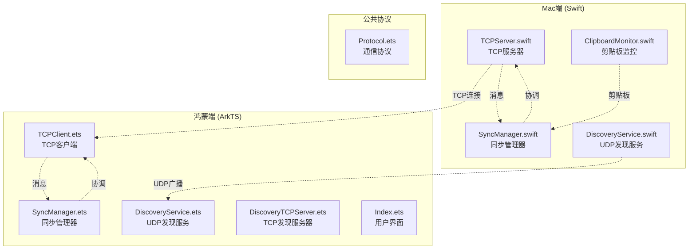

**图表来源**
- [TCPServer.swift:1-174](file://ClipboardSync/mac/ClipboardSync/TCPServer.swift#L1-L174)
- [TCPClient.ets:1-181](file://ClipboardSync/harmony/entry/src/main/ets/common/TCPClient.ets#L1-L181)
- [SyncManager.swift:1-154](file://ClipboardSync/mac/ClipboardSync/SyncManager.swift#L1-L154)
- [SyncManager.ets:1-301](file://ClipboardSync/harmony/entry/src/main/ets/model/SyncManager.ets#L1-L301)

**章节来源**
- [TCPServer.swift:1-174](file://ClipboardSync/mac/ClipboardSync/TCPServer.swift#L1-L174)
- [TCPClient.ets:1-181](file://ClipboardSync/harmony/entry/src/main/ets/common/TCPClient.ets#L1-L181)
- [SyncManager.swift:1-154](file://ClipboardSync/mac/ClipboardSync/SyncManager.swift#L1-L154)
- [SyncManager.ets:1-301](file://ClipboardSync/harmony/entry/src/main/ets/model/SyncManager.ets#L1-L301)

## 核心组件

### 通信协议定义

系统使用统一的通信协议常量和消息格式：

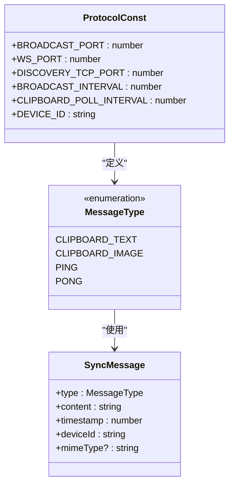

**图表来源**
- [Protocol.ets:1-27](file://ClipboardSync/harmony/entry/src/main/ets/common/Protocol.ets#L1-L27)

### Mac端TCP服务器

Mac端作为TCP服务器，负责监听客户端连接并处理消息：

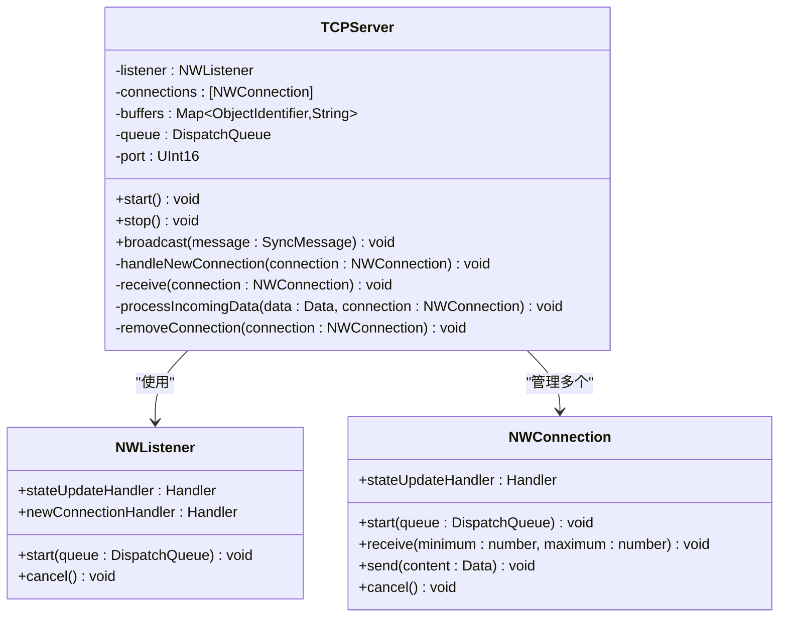

**图表来源**
- [TCPServer.swift:1-174](file://ClipboardSync/mac/ClipboardSync/TCPServer.swift#L1-L174)

### 鸿蒙端TCP客户端

鸿蒙端作为TCP客户端，负责主动连接服务器并处理消息：

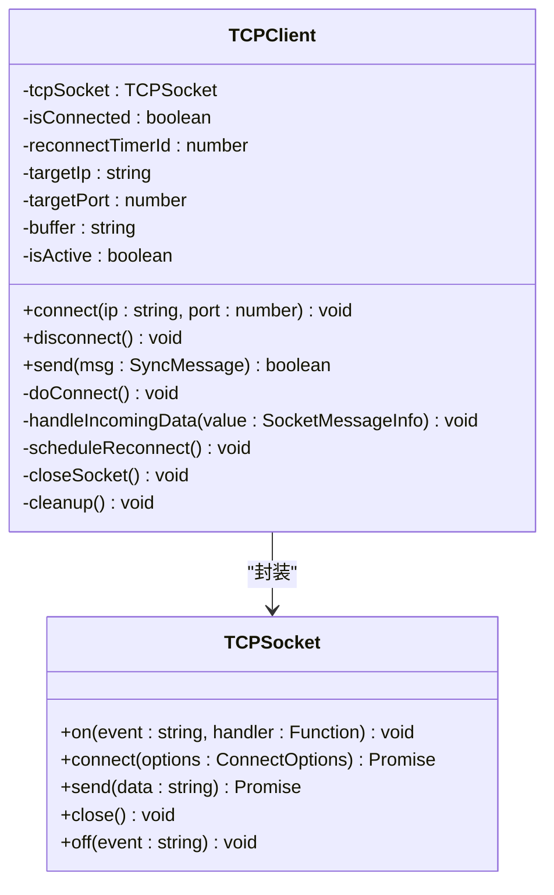

**图表来源**
- [TCPClient.ets:1-181](file://ClipboardSync/harmony/entry/src/main/ets/common/TCPClient.ets#L1-L181)

**章节来源**
- [Protocol.ets:1-27](file://ClipboardSync/harmony/entry/src/main/ets/common/Protocol.ets#L1-L27)
- [TCPServer.swift:1-174](file://ClipboardSync/mac/ClipboardSync/TCPServer.swift#L1-L174)
- [TCPClient.ets:1-181](file://ClipboardSync/harmony/entry/src/main/ets/common/TCPClient.ets#L1-L181)

## 架构概览

系统采用分层架构设计，实现了完整的设备发现、连接管理和数据同步流程：

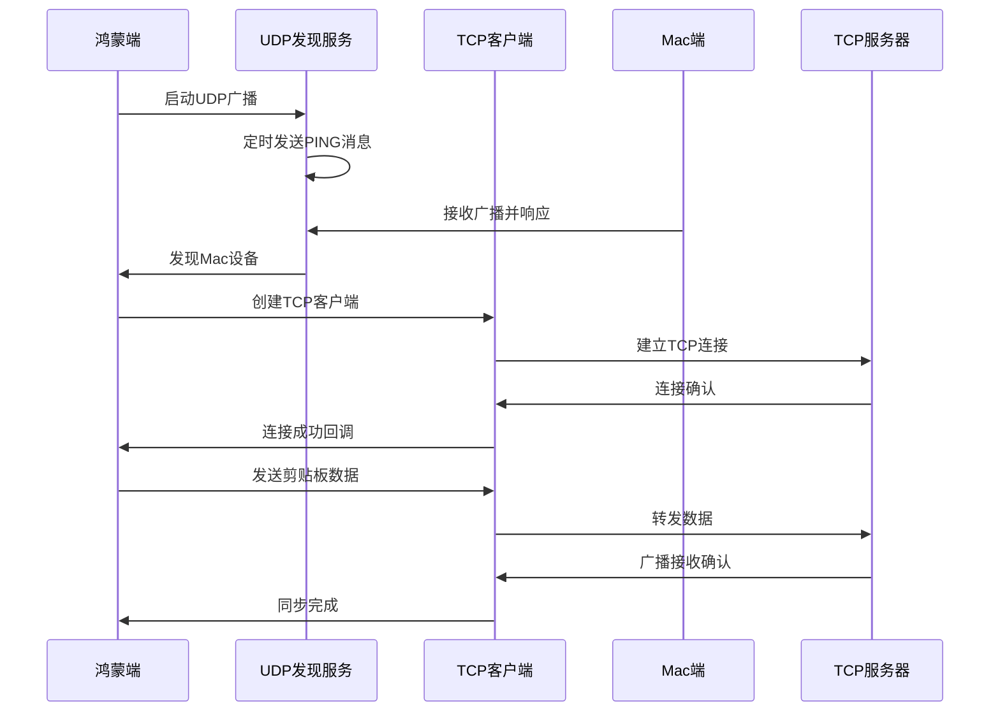

**图表来源**
- [SyncManager.ets:72-98](file://ClipboardSync/harmony/entry/src/main/ets/model/SyncManager.ets#L72-L98)
- [SyncManager.swift:40-45](file://ClipboardSync/mac/ClipboardSync/SyncManager.swift#L40-L45)

### 连接建立流程

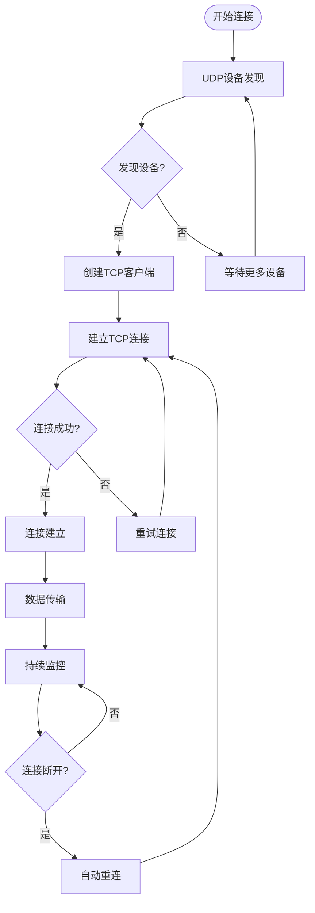

**图表来源**
- [TCPClient.ets:30-113](file://ClipboardSync/harmony/entry/src/main/ets/common/TCPClient.ets#L30-L113)
- [SyncManager.ets:129-174](file://ClipboardSync/harmony/entry/src/main/ets/model/SyncManager.ets#L129-L174)

## 详细组件分析

### Mac端TCP服务器实现

Mac端的TCPServer类提供了完整的TCP服务器功能，包括连接管理、消息处理和粘包处理：

#### 连接管理机制

服务器使用NWListener进行连接监听，支持多个客户端同时连接：

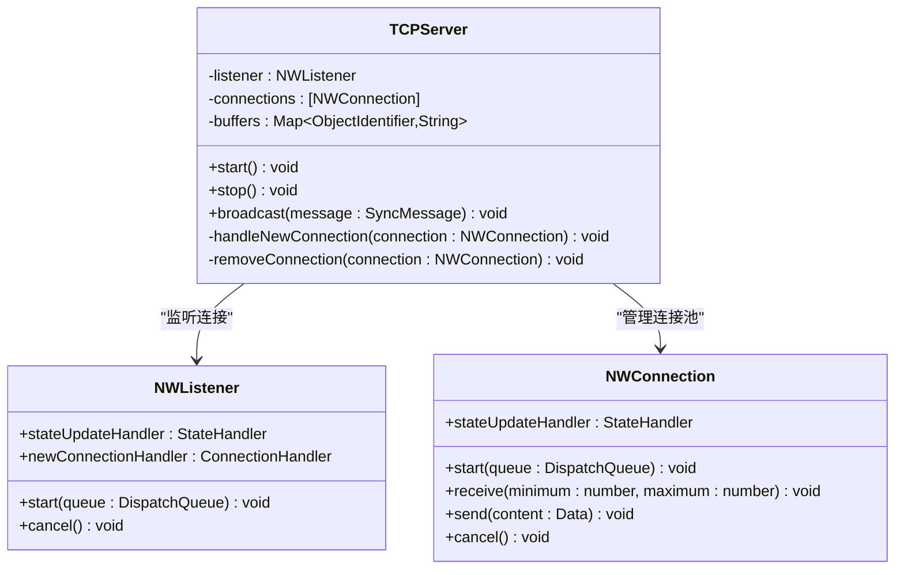

**图表来源**
- [TCPServer.swift:6-58](file://ClipboardSync/mac/ClipboardSync/TCPServer.swift#L6-L58)

#### 粘包处理算法

服务器实现了基于缓冲区的粘包处理机制：

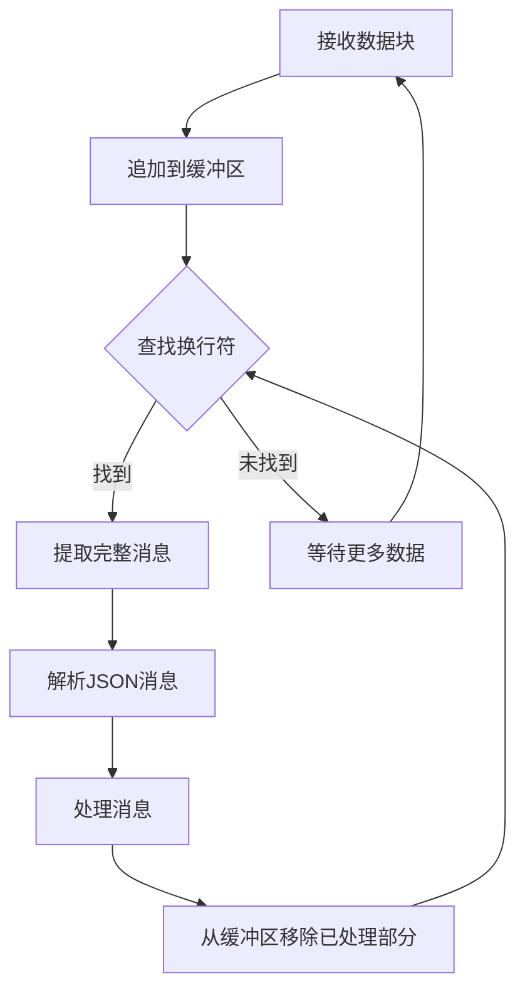

**图表来源**
- [TCPServer.swift:129-148](file://ClipboardSync/mac/ClipboardSync/TCPServer.swift#L129-L148)

#### 错误处理策略

服务器采用渐进式的错误处理策略：

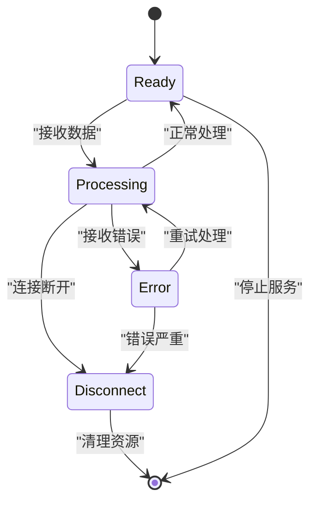

**图表来源**
- [TCPServer.swift:108-127](file://ClipboardSync/mac/ClipboardSync/TCPServer.swift#L108-L127)

**章节来源**
- [TCPServer.swift:1-174](file://ClipboardSync/mac/ClipboardSync/TCPServer.swift#L1-L174)

### 鸿蒙端TCP客户端实现

鸿蒙端的TCPClient类提供了完整的TCP客户端功能，包括自动重连和消息处理：

#### 连接生命周期管理

客户端实现了完整的连接生命周期管理：

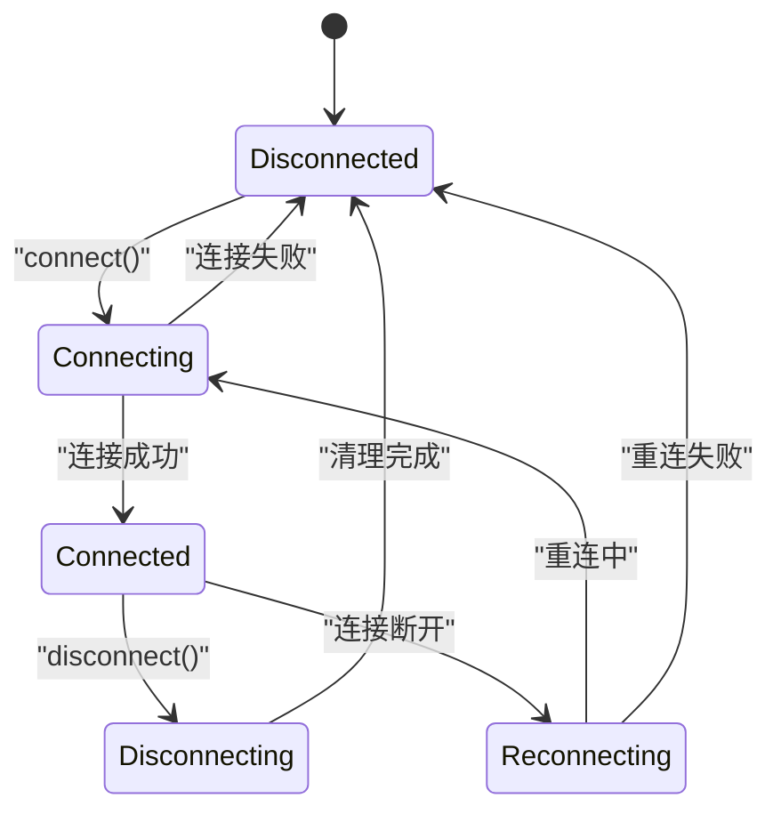

**图表来源**
- [TCPClient.ets:148-181](file://ClipboardSync/harmony/entry/src/main/ets/common/TCPClient.ets#L148-L181)

#### 消息序列化与反序列化

客户端实现了基于换行符的消息边界处理：

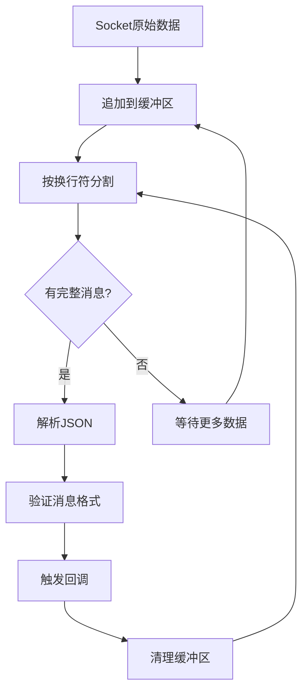

**图表来源**
- [TCPClient.ets:115-146](file://ClipboardSync/harmony/entry/src/main/ets/common/TCPClient.ets#L115-L146)

#### 自动重连机制

客户端实现了指数退避的重连策略：

```mermaid
flowchart TD
ConnectionLost["连接丢失"] --> Cleanup["清理资源"]
Cleanup --> ScheduleReconnect["调度重连"]
ScheduleReconnect --> TimerWait["等待5秒"]
TimerWait --> CheckActive{"是否仍需连接?"}
CheckActive --> |是| CloseSocket["关闭socket"]
CheckActive --> |否| CancelReconnect["取消重连"]
CloseSocket --> CreateNewSocket["创建新socket"]
CreateNewSocket --> ConnectAgain["重新连接"]
ConnectAgain --> ReconnectSuccess{"重连成功?"}
ReconnectSuccess --> |是| Connected["连接建立"]
ReconnectSuccess --> |否| ScheduleReconnect
CancelReconnect --> [*]
Connected --> [*]
```

**图表来源**
- [TCPClient.ets:148-157](file://ClipboardSync/harmony/entry/src/main/ets/common/TCPClient.ets#L148-L157)

**章节来源**
- [TCPClient.ets:1-181](file://ClipboardSync/harmony/entry/src/main/ets/common/TCPClient.ets#L1-L181)

### 设备发现机制

系统采用了双层发现机制确保连接可靠性：

#### UDP广播发现

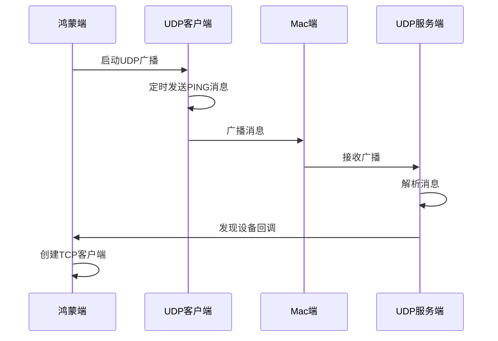

**图表来源**
- [DiscoveryService.ets:25-70](file://ClipboardSync/harmony/entry/src/main/ets/common/DiscoveryService.ets#L25-L70)

#### TCP发现辅助

Mac端还提供了TCP发现服务，用于解决UDP广播无法到达的问题：

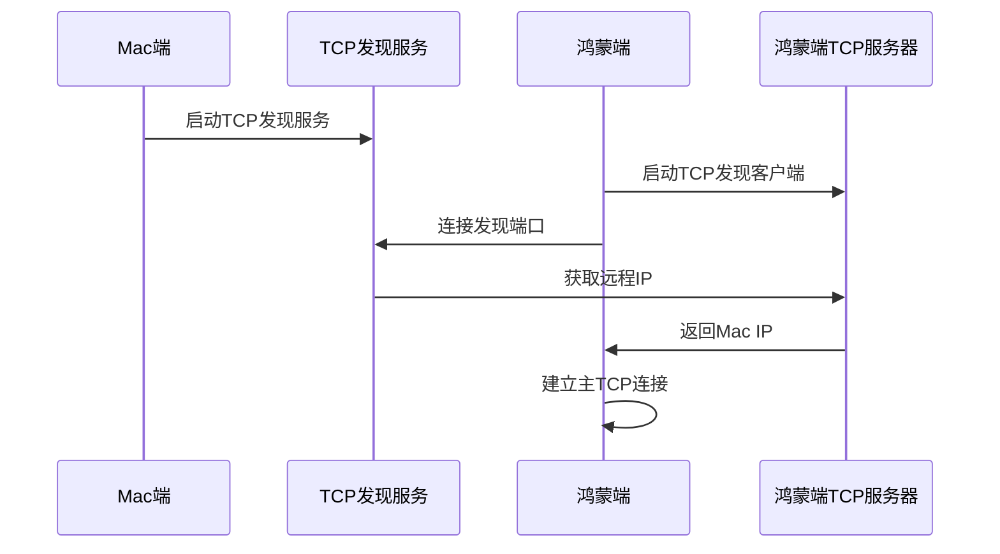

**图表来源**
- [DiscoveryService.swift:150-180](file://ClipboardSync/mac/ClipboardSync/DiscoveryService.swift#L150-L180)
- [DiscoveryTCPServer.ets:18-49](file://ClipboardSync/harmony/entry/src/main/ets/common/DiscoveryTCPServer.ets#L18-L49)

**章节来源**
- [DiscoveryService.ets:1-161](file://ClipboardSync/harmony/entry/src/main/ets/common/DiscoveryService.ets#L1-L161)
- [DiscoveryService.swift:1-197](file://ClipboardSync/mac/ClipboardSync/DiscoveryService.swift#L1-L197)
- [DiscoveryTCPServer.ets:1-80](file://ClipboardSync/harmony/entry/src/main/ets/common/DiscoveryTCPServer.ets#L1-L80)

### 同步管理器

#### Mac端同步管理器

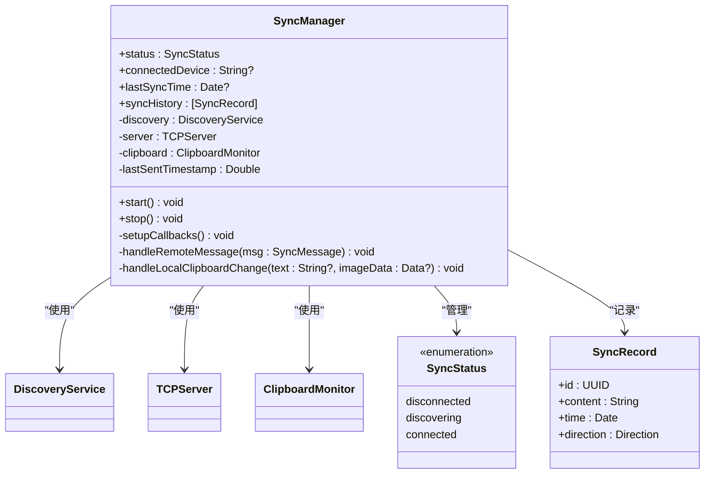

**图表来源**
- [SyncManager.swift:4-93](file://ClipboardSync/mac/ClipboardSync/SyncManager.swift#L4-L93)

#### 鸿蒙端同步管理器

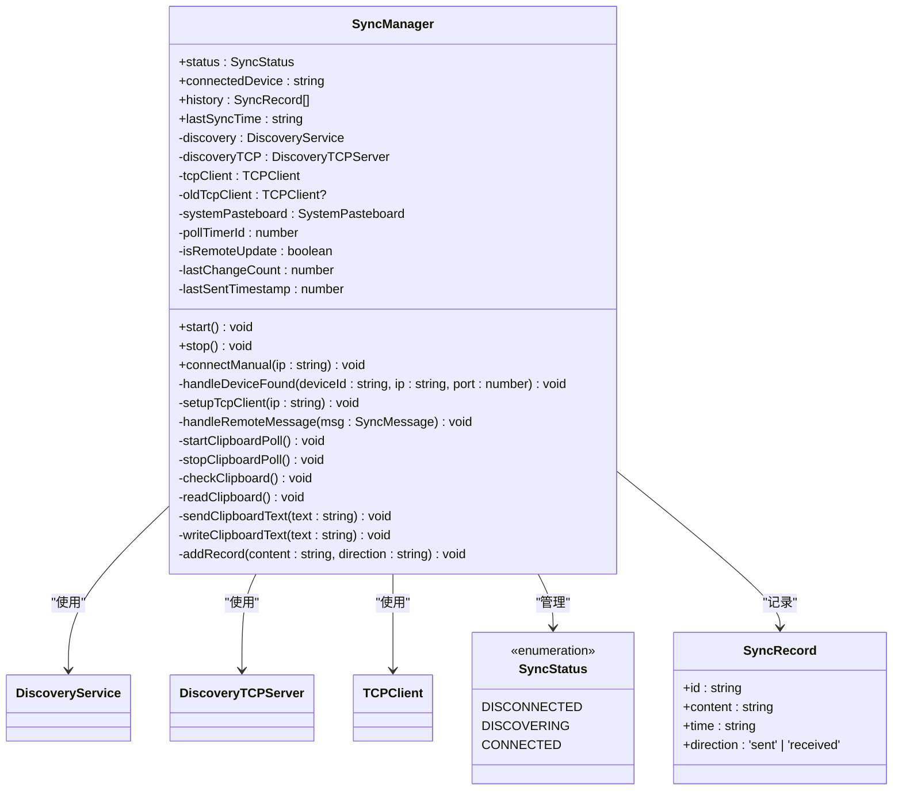

**图表来源**
- [SyncManager.ets:26-98](file://ClipboardSync/harmony/entry/src/main/ets/model/SyncManager.ets#L26-L98)

**章节来源**
- [SyncManager.swift:1-154](file://ClipboardSync/mac/ClipboardSync/SyncManager.swift#L1-L154)
- [SyncManager.ets:1-301](file://ClipboardSync/harmony/entry/src/main/ets/model/SyncManager.ets#L1-L301)

## 依赖关系分析

系统采用松耦合的设计，各组件间通过清晰的接口进行交互：

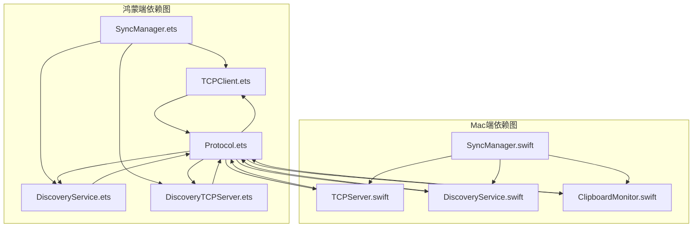

**图表来源**
- [SyncManager.ets:1-6](file://ClipboardSync/harmony/entry/src/main/ets/model/SyncManager.ets#L1-L6)
- [SyncManager.swift:1-14](file://ClipboardSync/mac/ClipboardSync/SyncManager.swift#L1-L14)

### 组件耦合度分析

系统在设计上实现了良好的内聚性和低耦合性：

- **高内聚**：每个组件专注于单一职责
- **低耦合**：通过协议接口进行通信
- **可扩展性**：新增功能不影响现有组件
- **可测试性**：组件间依赖通过接口解耦

**章节来源**
- [Protocol.ets:1-27](file://ClipboardSync/harmony/entry/src/main/ets/common/Protocol.ets#L1-L27)
- [SyncManager.ets:1-301](file://ClipboardSync/harmony/entry/src/main/ets/model/SyncManager.ets#L1-L301)
- [SyncManager.swift:1-154](file://ClipboardSync/mac/ClipboardSync/SyncManager.swift#L1-L154)

## 性能考虑

### 连接池管理

Mac端实现了高效的连接池管理：

- **连接复用**：单个监听器管理多个客户端连接
- **内存优化**：使用对象标识符映射连接缓冲区
- **并发处理**：每个连接独立的队列处理
- **资源回收**：及时清理断开连接的资源

### 粘包处理优化

服务器采用缓冲区技术处理粘包问题：

- **增量处理**：逐字节处理避免全量复制
- **内存复用**：重用缓冲区减少内存分配
- **异步处理**：非阻塞的数据处理
- **错误隔离**：单个连接错误不影响其他连接

### 重连机制优化

客户端实现了智能的重连策略：

- **指数退避**：避免频繁重连造成网络压力
- **资源清理**：重连前彻底清理旧连接资源
- **状态同步**：重连过程中保持应用状态一致
- **防抖处理**：避免多次重复重连

### 性能监控指标

系统提供了完善的性能监控：

- **连接状态**：实时显示连接数量和状态
- **消息统计**：统计收发消息数量和大小
- **延迟监控**：测量消息传输延迟
- **错误统计**：记录各类错误发生频率

## 故障排除指南

### 常见连接问题

#### UDP发现失败

**症状**：无法发现Mac设备
**排查步骤**：
1. 检查防火墙设置是否允许UDP广播
2. 验证两个设备在同一网络段
3. 确认广播端口未被占用
4. 查看UDP广播日志输出

**解决方案**：
- 调整防火墙规则允许UDP通信
- 手动输入Mac设备IP地址进行连接
- 检查网络路由器配置

#### TCP连接建立失败

**症状**：客户端无法连接到Mac端
**排查步骤**：
1. 检查Mac端TCP服务器是否启动
2. 验证目标端口是否正确
3. 确认网络连通性
4. 查看连接超时设置

**解决方案**：
- 重启TCP服务器服务
- 调整连接超时参数
- 检查端口占用情况

#### 粘包处理异常

**症状**：消息解析失败或数据丢失
**排查步骤**：
1. 检查消息边界字符是否正确
2. 验证缓冲区大小设置
3. 确认数据编码格式
4. 查看异常日志信息

**解决方案**：
- 调整缓冲区大小
- 修复消息序列化格式
- 优化数据传输协议

### 调试工具和方法

#### 日志分析

系统提供了多层次的日志输出：

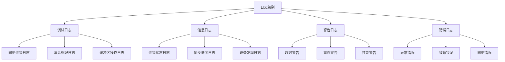

#### 性能分析

**CPU使用率监控**：
- TCP连接处理线程CPU占用
- 消息解析CPU消耗
- 粘包处理性能指标

**内存使用监控**：
- 连接缓冲区内存占用
- 消息队列内存使用
- 对象生命周期管理

**网络性能监控**：
- 连接建立时间
- 消息传输延迟
- 带宽利用率

**章节来源**
- [TCPClient.ets:83-90](file://ClipboardSync/harmony/entry/src/main/ets/common/TCPClient.ets#L83-L90)
- [TCPServer.swift:108-127](file://ClipboardSync/mac/ClipboardSync/TCPServer.swift#L108-L127)
- [DiscoveryService.ets:36-43](file://ClipboardSync/harmony/entry/src/main/ets/common/DiscoveryService.ets#L36-L43)

## 结论

本项目成功实现了跨平台的TCP连接管理功能，具有以下优势：

### 技术亮点

1. **架构设计合理**：Mac端服务器+鸿蒙端客户端的角色分工明确
2. **协议设计完善**：基于换行符的消息边界处理机制
3. **错误处理健全**：完整的连接重连和异常恢复机制
4. **性能优化到位**：粘包处理和连接池管理优化
5. **可维护性强**：模块化设计便于功能扩展和维护

### 应用价值

该实现为跨平台应用提供了可靠的网络通信基础，可以作为其他类似场景的参考模板。通过合理的架构设计和完善的错误处理机制，系统能够在复杂的网络环境中保持稳定运行。

### 改进建议

1. **增加连接池配置**：允许动态调整连接池大小
2. **增强安全机制**：添加连接认证和数据加密
3. **优化性能监控**：提供更详细的性能指标统计
4. **扩展协议支持**：支持更多消息类型和数据格式
5. **提升用户体验**：增加连接状态可视化和故障提示

该TCP连接管理系统为跨平台应用开发提供了优秀的实践案例，其设计理念和实现方案值得在类似项目中借鉴和应用。