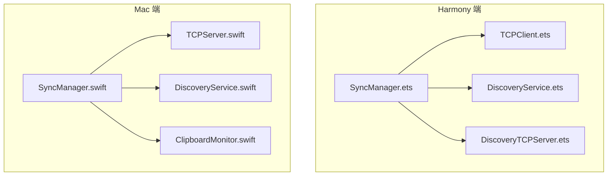
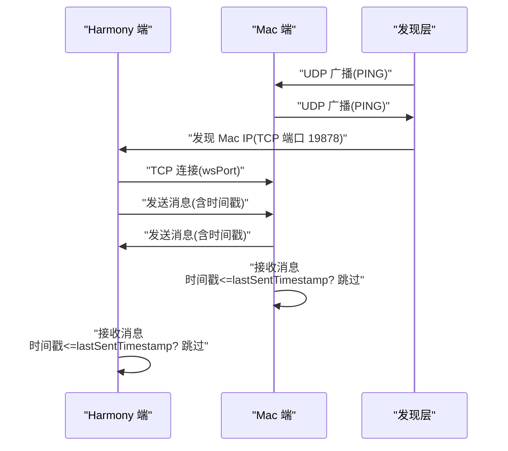
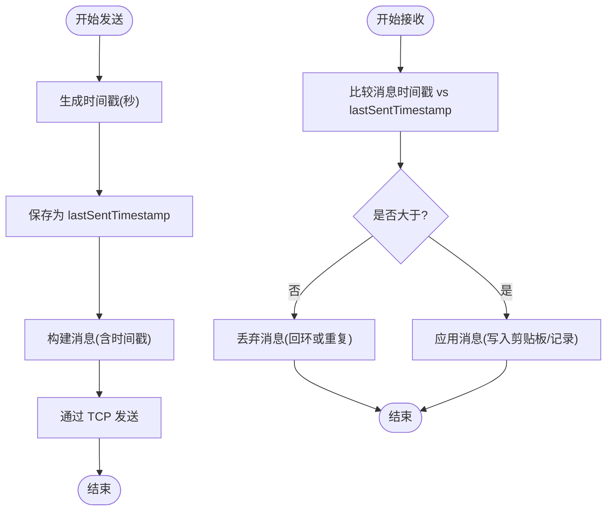
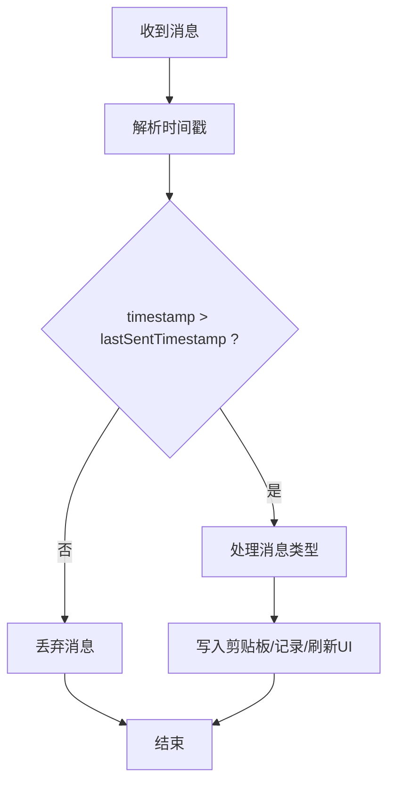
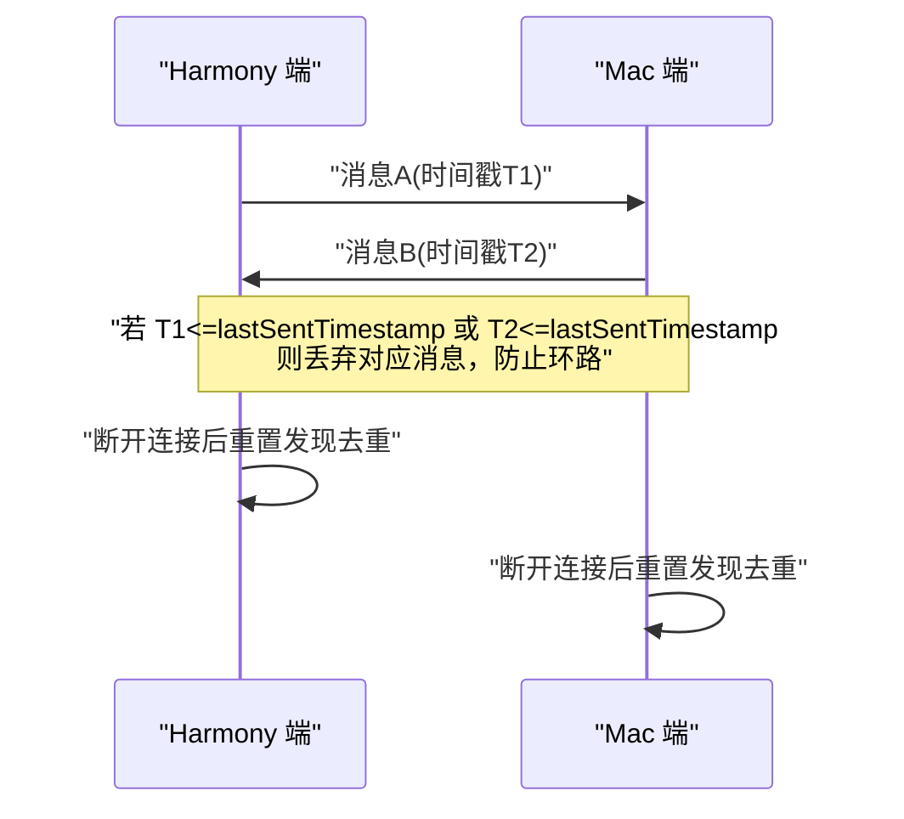
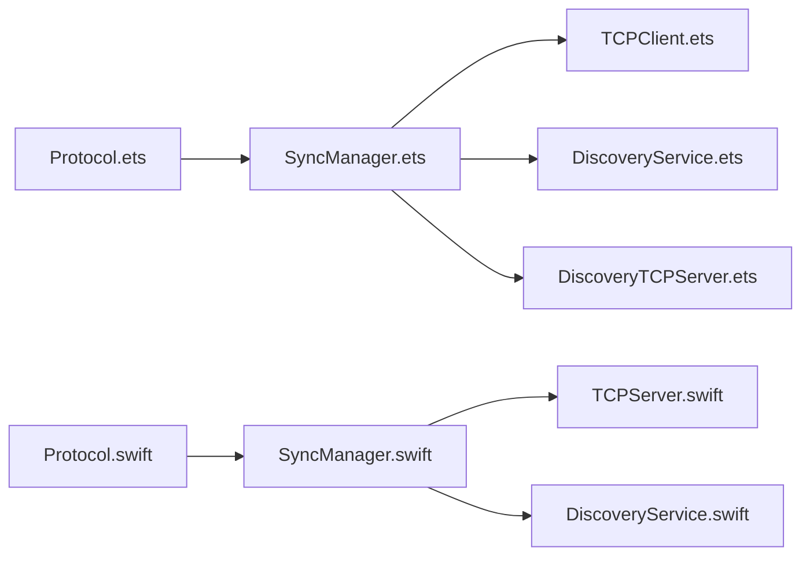

# 去重防环机制

<cite>
**本文档引用的文件**
- [SyncManager.ets](file://ClipboardSync/harmony/entry/src/main/ets/model/SyncManager.ets)
- [SyncManager.swift](file://ClipboardSync/mac/ClipboardSync/SyncManager.swift)
- [Protocol.ets](file://ClipboardSync/harmony/entry/src/main/ets/common/Protocol.ets)
- [Protocol.swift](file://ClipboardSync/mac/ClipboardSync/Protocol.swift)
- [TCPClient.ets](file://ClipboardSync/harmony/entry/src/main/ets/common/TCPClient.ets)
- [TCPServer.swift](file://ClipboardSync/mac/ClipboardSync/TCPServer.swift)
- [DiscoveryService.ets](file://ClipboardSync/harmony/entry/src/main/ets/common/DiscoveryService.ets)
- [DiscoveryService.swift](file://ClipboardSync/mac/ClipboardSync/DiscoveryService.swift)
- [DiscoveryTCPServer.ets](file://ClipboardSync/harmony/entry/src/main/ets/common/DiscoveryTCPServer.ets)
- [ClipboardMonitor.swift](file://ClipboardSync/mac/ClipboardSync/ClipboardMonitor.swift)
</cite>

## 目录
1. [简介](#简介)
2. [项目结构](#项目结构)
3. [核心组件](#核心组件)
4. [架构总览](#架构总览)
5. [详细组件分析](#详细组件分析)
6. [依赖关系分析](#依赖关系分析)
7. [性能考虑](#性能考虑)
8. [故障排除指南](#故障排除指南)
9. [结论](#结论)

## 简介
本文件聚焦于剪贴板同步系统中的去重防环机制，详细阐述时间戳机制如何防止同步过程中的回环问题。通过对两端（Harmony 端与 Mac 端）的实现进行对比分析，解释消息时间戳生成、重复检测算法与去重判断逻辑，并总结在不同同步场景下的行为表现与优化策略。

## 项目结构
系统采用跨平台架构，两端分别实现：
- Harmony 端（ArkTS/ETS）：使用 UDP 广播发现设备，通过 TCP 传输剪贴板数据；基于时间戳进行去重。
- Mac 端（Swift）：使用 BSD Socket 广播发现设备，通过 NWFramework 的 TCP 服务端接收连接并广播消息；同样基于时间戳进行去重。

**图表来源**
- [SyncManager.ets:26-301](file://ClipboardSync/harmony/entry/src/main/ets/model/SyncManager.ets#L26-L301)
- [SyncManager.swift:5-154](file://ClipboardSync/mac/ClipboardSync/SyncManager.swift#L5-L154)
- [TCPClient.ets:11-181](file://ClipboardSync/harmony/entry/src/main/ets/common/TCPClient.ets#L11-L181)
- [TCPServer.swift:6-174](file://ClipboardSync/mac/ClipboardSync/TCPServer.swift#L6-L174)
- [DiscoveryService.ets:10-161](file://ClipboardSync/harmony/entry/src/main/ets/common/DiscoveryService.ets#L10-L161)
- [DiscoveryService.swift:6-197](file://ClipboardSync/mac/ClipboardSync/DiscoveryService.swift#L6-L197)
- [DiscoveryTCPServer.ets:11-80](file://ClipboardSync/harmony/entry/src/main/ets/common/DiscoveryTCPServer.ets#L11-L80)

**章节来源**
- [SyncManager.ets:26-301](file://ClipboardSync/harmony/entry/src/main/ets/model/SyncManager.ets#L26-L301)
- [SyncManager.swift:5-154](file://ClipboardSync/mac/ClipboardSync/SyncManager.swift#L5-L154)

## 核心组件
- 时间戳字段：两端均在消息结构中携带时间戳，用于去重判断。
- 去重变量：Harmony 端维护上一次发送的时间戳；Mac 端同样维护上一次发送的时间戳。
- 去重逻辑：接收消息时，若消息时间戳小于等于本地记录的最后发送时间戳，则丢弃该消息，避免回环。
- 同步状态：两端均维护连接状态与历史记录，便于诊断与用户反馈。

**章节来源**
- [Protocol.ets:20-27](file://ClipboardSync/harmony/entry/src/main/ets/common/Protocol.ets#L20-L27)
- [Protocol.swift:28-43](file://ClipboardSync/mac/ClipboardSync/Protocol.swift#L28-L43)
- [SyncManager.ets:35-35](file://ClipboardSync/harmony/entry/src/main/ets/model/SyncManager.ets#L35-L35)
- [SyncManager.swift:16-16](file://ClipboardSync/mac/ClipboardSync/SyncManager.swift#L16-L16)

## 架构总览
两端通过发现机制建立连接，随后通过 TCP 进行消息传输。消息结构包含时间戳，两端在发送与接收时均使用该时间戳进行去重判断，从而有效防止回环。

**图表来源**
- [DiscoveryService.ets:104-156](file://ClipboardSync/harmony/entry/src/main/ets/common/DiscoveryService.ets#L104-L156)
- [DiscoveryService.swift:78-100](file://ClipboardSync/mac/ClipboardSync/DiscoveryService.swift#L78-L100)
- [DiscoveryTCPServer.ets:61-78](file://ClipboardSync/harmony/entry/src/main/ets/common/DiscoveryTCPServer.ets#L61-L78)
- [TCPClient.ets:30-58](file://ClipboardSync/harmony/entry/src/main/ets/common/TCPClient.ets#L30-L58)
- [TCPServer.swift:60-67](file://ClipboardSync/mac/ClipboardSync/TCPServer.swift#L60-L67)
- [SyncManager.ets:178-198](file://ClipboardSync/harmony/entry/src/main/ets/model/SyncManager.ets#L178-L198)
- [SyncManager.swift:95-115](file://ClipboardSync/mac/ClipboardSync/SyncManager.swift#L95-L115)

## 详细组件分析

### 时间戳生成与使用
- 发送端在构造消息时生成当前时间戳（秒级），并更新本地的 lastSentTimestamp。
- 接收端在处理消息前，先比较消息时间戳与本地 lastSentTimestamp，若不大于则直接丢弃，避免重复处理。

**图表来源**
- [SyncManager.ets:256-269](file://ClipboardSync/harmony/entry/src/main/ets/model/SyncManager.ets#L256-L269)
- [SyncManager.swift:117-142](file://ClipboardSync/mac/ClipboardSync/SyncManager.swift#L117-L142)
- [SyncManager.ets:178-198](file://ClipboardSync/harmony/entry/src/main/ets/model/SyncManager.ets#L178-L198)
- [SyncManager.swift:95-115](file://ClipboardSync/mac/ClipboardSync/SyncManager.swift#L95-L115)

**章节来源**
- [SyncManager.ets:256-269](file://ClipboardSync/harmony/entry/src/main/ets/model/SyncManager.ets#L256-L269)
- [SyncManager.swift:117-142](file://ClipboardSync/mac/ClipboardSync/SyncManager.swift#L117-L142)
- [SyncManager.ets:178-198](file://ClipboardSync/harmony/entry/src/main/ets/model/SyncManager.ets#L178-L198)
- [SyncManager.swift:95-115](file://ClipboardSync/mac/ClipboardSync/SyncManager.swift#L95-L115)

### 去重判断逻辑
- 判断条件：消息时间戳严格大于本地 lastSentTimestamp。
- 处理结果：满足条件则执行消息处理（写入剪贴板、更新历史记录、刷新 UI），否则忽略。
- 作用范围：针对剪贴板文本与图片消息生效，PING/PONG 不参与去重判断。

**图表来源**
- [SyncManager.ets:178-198](file://ClipboardSync/harmony/entry/src/main/ets/model/SyncManager.ets#L178-L198)
- [SyncManager.swift:95-115](file://ClipboardSync/mac/ClipboardSync/SyncManager.swift#L95-L115)

**章节来源**
- [SyncManager.ets:178-198](file://ClipboardSync/harmony/entry/src/main/ets/model/SyncManager.ets#L178-L198)
- [SyncManager.swift:95-115](file://ClipboardSync/mac/ClipboardSync/SyncManager.swift#L95-L115)

### 环路检测方法
- 基于时间戳的单向去重：确保同一条消息不会被重复处理。
- 配合状态控制：两端在连接断开时重置发现去重状态，允许重新发现同一设备并自动重连，避免因设备状态异常导致的持续环路。

**图表来源**
- [SyncManager.ets:150-157](file://ClipboardSync/harmony/entry/src/main/ets/model/SyncManager.ets#L150-L157)
- [SyncManager.swift:75-82](file://ClipboardSync/mac/ClipboardSync/SyncManager.swift#L75-L82)

**章节来源**
- [SyncManager.ets:150-157](file://ClipboardSync/harmony/entry/src/main/ets/model/SyncManager.ets#L150-L157)
- [SyncManager.swift:75-82](file://ClipboardSync/mac/ClipboardSync/SyncManager.swift#L75-L82)

### 同步状态控制
- Harmony 端状态：DISCONNECTED/DISCOVERING/CONNECTED，连接断开时重置发现去重，允许重新发现设备。
- Mac 端状态：disconnected/discovering/connected，连接断开时清空连接计数并重置设备信息。
- 历史记录：两端均维护同步历史，限制长度并实时刷新，便于用户观察同步状态。

**章节来源**
- [SyncManager.ets:16-20](file://ClipboardSync/harmony/entry/src/main/ets/model/SyncManager.ets#L16-L20)
- [SyncManager.swift:18-22](file://ClipboardSync/mac/ClipboardSync/SyncManager.swift#L18-L22)
- [SyncManager.ets:48-51](file://ClipboardSync/harmony/entry/src/main/ets/model/SyncManager.ets#L48-L51)
- [SyncManager.swift:9-9](file://ClipboardSync/mac/ClipboardSync/SyncManager.swift#L9-L9)

### 发现与连接流程中的去重
- Harmony 端：UDP 广播发现设备，使用 foundDevices 数组避免重复回调；当连接断开时重置该数组，允许重新发现。
- Mac 端：BSD Socket 监听广播，使用 Set 去重设备 ID；同时维护 tcpDiscoveryDone 集合，避免对同一设备重复发起 TCP 发现连接。

**章节来源**
- [DiscoveryService.ets:14-23](file://ClipboardSync/harmony/entry/src/main/ets/common/DiscoveryService.ets#L14-L23)
- [DiscoveryService.ets:144-156](file://ClipboardSync/harmony/entry/src/main/ets/common/DiscoveryService.ets#L144-L156)
- [DiscoveryService.swift:10-11](file://ClipboardSync/mac/ClipboardSync/DiscoveryService.swift#L10-L11)
- [DiscoveryService.swift:84-100](file://ClipboardSync/mac/ClipboardSync/DiscoveryService.swift#L84-L100)

## 依赖关系分析
两端均依赖统一的协议定义，确保消息结构一致；传输层分别使用 TCP 客户端/服务端与 NWFramework 的 TCP 实现；发现层分别使用 ArkTS 的 UDP 与 Swift 的 BSD Socket。

**图表来源**
- [Protocol.ets:2-27](file://ClipboardSync/harmony/entry/src/main/ets/common/Protocol.ets#L2-L27)
- [Protocol.swift:4-43](file://ClipboardSync/mac/ClipboardSync/Protocol.swift#L4-L43)
- [SyncManager.ets:2-6](file://ClipboardSync/harmony/entry/src/main/ets/model/SyncManager.ets#L2-L6)
- [SyncManager.swift:1-14](file://ClipboardSync/mac/ClipboardSync/SyncManager.swift#L1-L14)
- [TCPClient.ets:1-5](file://ClipboardSync/harmony/entry/src/main/ets/common/TCPClient.ets#L1-L5)
- [TCPServer.swift:1-10](file://ClipboardSync/mac/ClipboardSync/TCPServer.swift#L1-L10)
- [DiscoveryService.ets:1-4](file://ClipboardSync/harmony/entry/src/main/ets/common/DiscoveryService.ets#L1-L4)
- [DiscoveryService.swift:1-6](file://ClipboardSync/mac/ClipboardSync/DiscoveryService.swift#L1-L6)
- [DiscoveryTCPServer.ets:1-4](file://ClipboardSync/harmony/entry/src/main/ets/common/DiscoveryTCPServer.ets#L1-L4)

**章节来源**
- [Protocol.ets:2-27](file://ClipboardSync/harmony/entry/src/main/ets/common/Protocol.ets#L2-L27)
- [Protocol.swift:4-43](file://ClipboardSync/mac/ClipboardSync/Protocol.swift#L4-L43)
- [TCPClient.ets:1-5](file://ClipboardSync/harmony/entry/src/main/ets/common/TCPClient.ets#L1-L5)
- [TCPServer.swift:1-10](file://ClipboardSync/mac/ClipboardSync/TCPServer.swift#L1-L10)
- [DiscoveryService.ets:1-4](file://ClipboardSync/harmony/entry/src/main/ets/common/DiscoveryService.ets#L1-L4)
- [DiscoveryService.swift:1-6](file://ClipboardSync/mac/ClipboardSync/DiscoveryService.swift#L1-L6)
- [DiscoveryTCPServer.ets:1-4](file://ClipboardSync/harmony/entry/src/main/ets/common/DiscoveryTCPServer.ets#L1-L4)

## 性能考虑
- 时间戳精度：两端均使用秒级时间戳，满足去重需求且开销极小。
- 去重成本：每次接收消息只需一次数值比较，时间复杂度 O(1)，空间复杂度 O(1)。
- 轮询间隔：两端均设置合理的轮询间隔，减少 CPU 占用与网络压力。
- 连接稳定性：TCP 断线重连与发现去重重置机制，降低异常情况下的资源占用与错误传播风险。

[本节为通用性能讨论，无需具体文件分析]

## 故障排除指南
- 消息未到达：检查两端时间戳是否正确生成与比较；确认 lastSentTimestamp 是否被及时更新。
- 重复消息：确认去重逻辑是否生效；检查连接断开后的去重状态重置是否正常。
- 连接不稳定：查看断线重连与发现去重重置逻辑；确认设备发现回调是否被正确触发。

**章节来源**
- [SyncManager.ets:150-157](file://ClipboardSync/harmony/entry/src/main/ets/model/SyncManager.ets#L150-L157)
- [SyncManager.swift:75-82](file://ClipboardSync/mac/ClipboardSync/SyncManager.swift#L75-L82)

## 结论
去重防环机制通过时间戳与状态控制实现了高效的回环防护：发送端维护 lastSentTimestamp，接收端在处理消息前进行严格的时间戳比较，确保同一条消息不会被重复处理。配合发现层的去重与连接断开后的状态重置，系统在不同同步场景下均能保持稳定与高效。