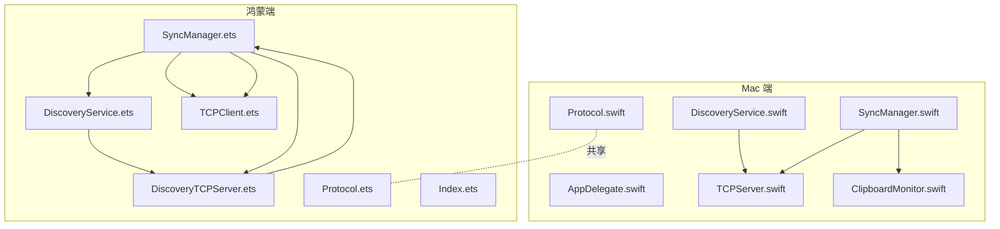
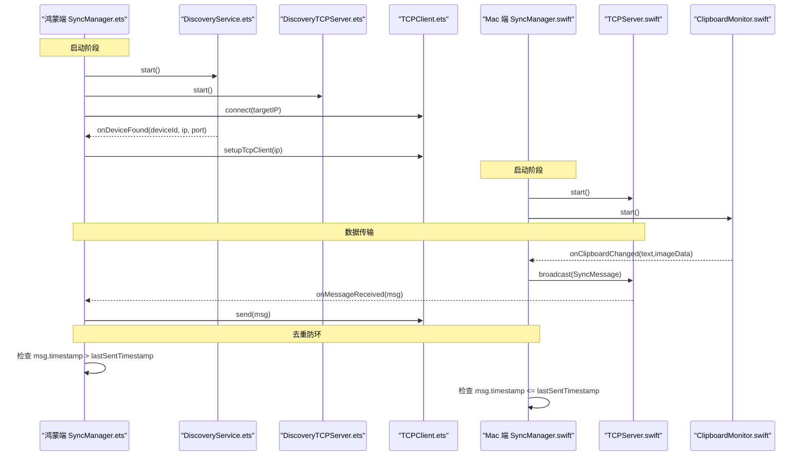
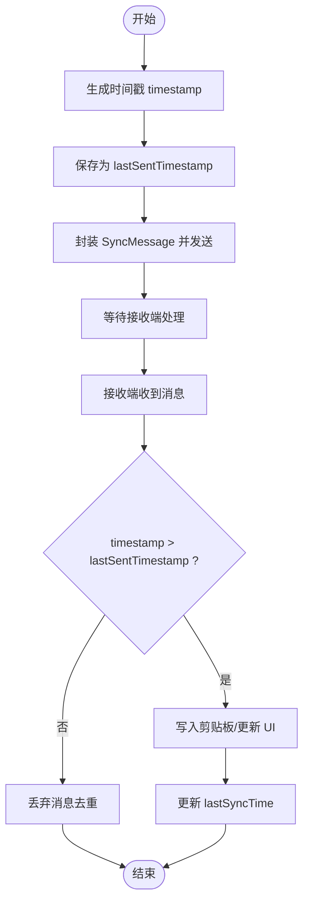
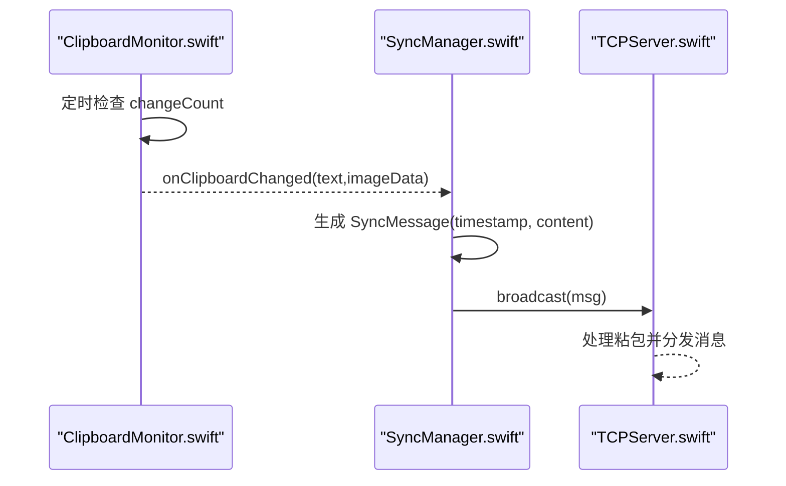
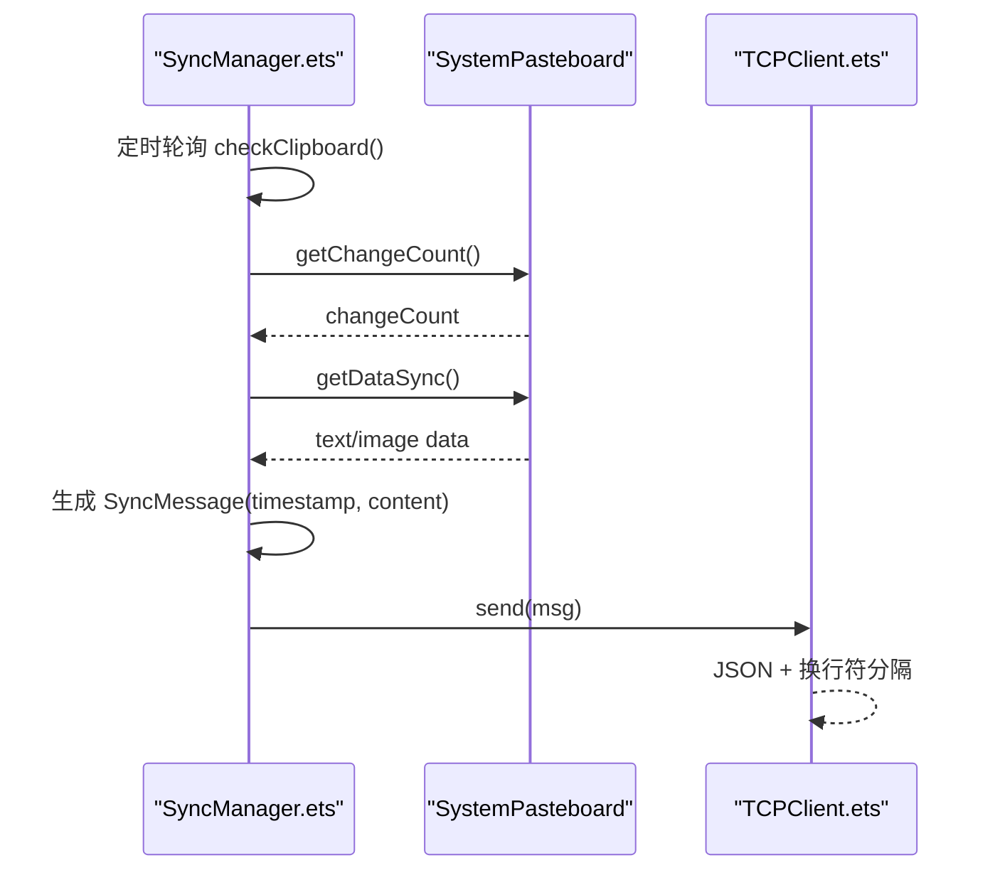
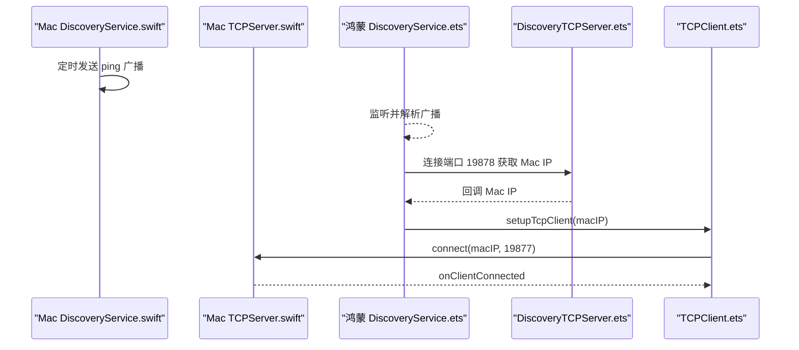
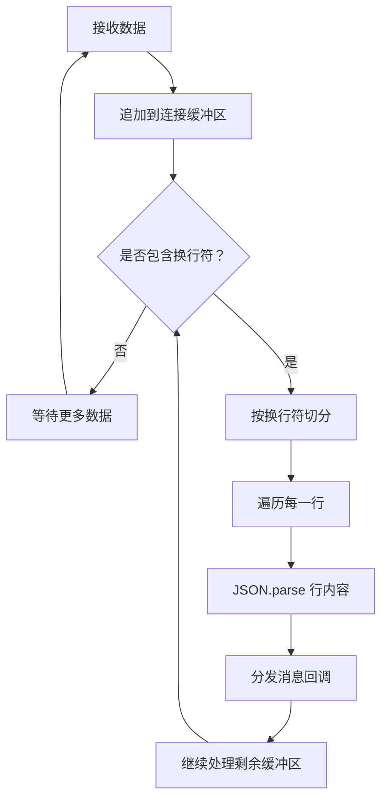
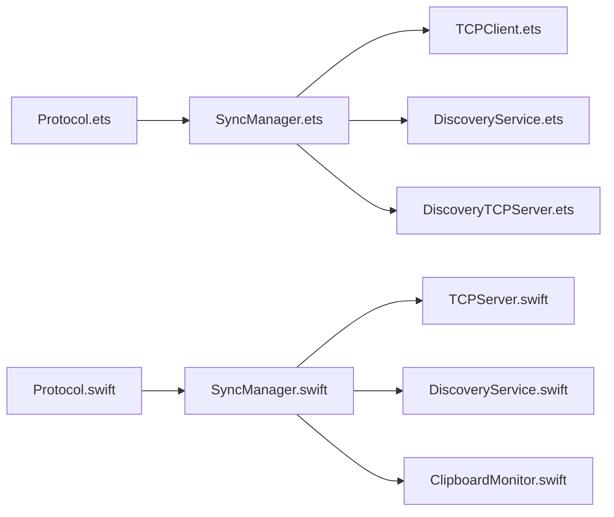

# 双向文本同步

<cite>
**本文引用的文件**
- [SyncManager.swift](file://ClipboardSync/mac/ClipboardSync/SyncManager.swift)
- [SyncManager.ets](file://ClipboardSync/harmony/entry/src/main/ets/model/SyncManager.ets)
- [ClipboardMonitor.swift](file://ClipboardSync/mac/ClipboardSync/ClipboardMonitor.swift)
- [Protocol.ets](file://ClipboardSync/harmony/entry/src/main/ets/common/Protocol.ets)
- [Protocol.swift](file://ClipboardSync/mac/ClipboardSync/Protocol.swift)
- [TCPServer.swift](file://ClipboardSync/mac/ClipboardSync/TCPServer.swift)
- [TCPClient.ets](file://ClipboardSync/harmony/entry/src/main/ets/common/TCPClient.ets)
- [DiscoveryService.swift](file://ClipboardSync/mac/ClipboardSync/DiscoveryService.swift)
- [DiscoveryService.ets](file://ClipboardSync/harmony/entry/src/main/ets/common/DiscoveryService.ets)
- [DiscoveryTCPServer.ets](file://ClipboardSync/harmony/entry/src/main/ets/common/DiscoveryTCPServer.ets)
- [AppDelegate.swift](file://ClipboardSync/mac/ClipboardSync/AppDelegate.swift)
- [Index.ets](file://ClipboardSync/harmony/entry/src/main/ets/pages/Index.ets)
- [PROJECT.md](file://ClipboardSync/PROJECT.md)
</cite>

## 目录
1. [简介](#简介)
2. [项目结构](#项目结构)
3. [核心组件](#核心组件)
4. [架构总览](#架构总览)
5. [详细组件分析](#详细组件分析)
6. [依赖关系分析](#依赖关系分析)
7. [性能考量](#性能考量)
8. [故障排查指南](#故障排查指南)
9. [结论](#结论)
10. [附录](#附录)

## 简介
本项目实现了 Mac 与鸿蒙手机之间的双向文本（及图片）剪贴板同步。其核心机制包括：
- 设备发现：通过 UDP 广播实现局域网内设备发现
- 连接建立：鸿蒙端主动连接 Mac 端的 TCP 服务
- 剪贴板监听：两端分别通过轮询监听系统剪贴板变化
- 消息封装：统一的 JSON 消息格式，包含类型、内容、时间戳、设备 ID、MIME 类型
- 去重防环：基于时间戳的去重策略，避免写入剪贴板后触发监听回环
- 传输协议：TCP 长连接，使用换行符分隔的 JSON 消息，具备粘包处理能力

## 项目结构
项目采用“平台分离”的组织方式，Mac 端使用 Swift + SwiftUI，鸿蒙端使用 ArkTS + ArkUI。两端共享通信协议定义，分别实现各自的设备发现、TCP 客户端/服务端、剪贴板监听与同步管理器。

图表来源
- [AppDelegate.swift:1-46](file://ClipboardSync/mac/ClipboardSync/AppDelegate.swift#L1-L46)
- [SyncManager.swift:1-154](file://ClipboardSync/mac/ClipboardSync/SyncManager.swift#L1-L154)
- [DiscoveryService.swift:1-197](file://ClipboardSync/mac/ClipboardSync/DiscoveryService.swift#L1-L197)
- [TCPServer.swift:1-174](file://ClipboardSync/mac/ClipboardSync/TCPServer.swift#L1-L174)
- [ClipboardMonitor.swift:1-73](file://ClipboardSync/mac/ClipboardSync/ClipboardMonitor.swift#L1-L73)
- [Protocol.swift:1-43](file://ClipboardSync/mac/ClipboardSync/Protocol.swift#L1-L43)
- [SyncManager.ets:1-301](file://ClipboardSync/harmony/entry/src/main/ets/model/SyncManager.ets#L1-L301)
- [DiscoveryService.ets:1-161](file://ClipboardSync/harmony/entry/src/main/ets/common/DiscoveryService.ets#L1-L161)
- [DiscoveryTCPServer.ets:1-80](file://ClipboardSync/harmony/entry/src/main/ets/common/DiscoveryTCPServer.ets#L1-L80)
- [TCPClient.ets:1-181](file://ClipboardSync/harmony/entry/src/main/ets/common/TCPClient.ets#L1-L181)
- [Protocol.ets:1-27](file://ClipboardSync/harmony/entry/src/main/ets/common/Protocol.ets#L1-L27)
- [Index.ets:1-226](file://ClipboardSync/harmony/entry/src/main/ets/pages/Index.ets#L1-L226)

章节来源
- [PROJECT.md:52-63](file://ClipboardSync/PROJECT.md#L52-L63)

## 核心组件
- Mac 端
  - SyncManager：协调设备发现、TCP 服务端、剪贴板监听，负责状态管理、消息去重与历史记录
  - TCPServer：NWListener 实现的 TCP 服务端，负责连接管理、消息接收与广播
  - ClipboardMonitor：基于 NSPasteboard 的轮询监听器，检测文本/图片变化并回调
  - DiscoveryService：BSD Socket 实现的 UDP 广播发现，同时通过 TCP 端口 19878 告知 Mac IP
  - Protocol：定义消息类型、协议常量与消息结构体

- 鸿蒙端
  - SyncManager：协调设备发现、TCP 客户端、剪贴板轮询，负责状态管理、消息去重与历史记录
  - TCPClient：NetworkKit 的 socket.TCPSocket 实现，负责连接、消息收发与断线重连
  - DiscoveryService：NetworkKit 的 socket.UDPSocket 实现，负责广播与监听
  - DiscoveryTCPServer：监听端口 19878，用于获取 Mac 的 IP 地址
  - Protocol：与 Mac 端共享的协议常量与消息结构

章节来源
- [SyncManager.swift:4-154](file://ClipboardSync/mac/ClipboardSync/SyncManager.swift#L4-L154)
- [SyncManager.ets:26-301](file://ClipboardSync/harmony/entry/src/main/ets/model/SyncManager.ets#L26-L301)
- [Protocol.swift:3-43](file://ClipboardSync/mac/ClipboardSync/Protocol.swift#L3-L43)
- [Protocol.ets:1-27](file://ClipboardSync/harmony/entry/src/main/ets/common/Protocol.ets#L1-L27)

## 架构总览
系统采用“设备发现 + TCP 数据通道”的双层架构：
- 设备发现层：UDP 广播（端口 19876）用于宣告存在；Mac 通过 TCP 端口 19878 告知自身 IP
- 数据传输层：TCP 长连接（端口 19877）承载剪贴板消息，使用换行符分隔 JSON，具备粘包处理
- 同步控制层：两端的 SyncManager 负责状态管理、去重防环、历史记录与 UI 更新

图表来源
- [SyncManager.ets:72-174](file://ClipboardSync/harmony/entry/src/main/ets/model/SyncManager.ets#L72-L174)
- [DiscoveryService.ets:25-95](file://ClipboardSync/harmony/entry/src/main/ets/common/DiscoveryService.ets#L25-L95)
- [DiscoveryTCPServer.ets:18-78](file://ClipboardSync/harmony/entry/src/main/ets/common/DiscoveryTCPServer.ets#L18-L78)
- [TCPClient.ets:30-113](file://ClipboardSync/harmony/entry/src/main/ets/common/TCPClient.ets#L30-L113)
- [SyncManager.swift:40-93](file://ClipboardSync/mac/ClipboardSync/SyncManager.swift#L40-L93)
- [TCPServer.swift:23-97](file://ClipboardSync/mac/ClipboardSync/TCPServer.swift#L23-L97)
- [ClipboardMonitor.swift:16-71](file://ClipboardSync/mac/ClipboardSync/ClipboardMonitor.swift#L16-L71)

## 详细组件分析

### 消息类型与封装格式
- 消息类型
  - 文本：clipboardText
  - 图片：clipboardImage
  - 心跳：ping/pong
- 消息字段
  - type：消息类型
  - content：内容（文本或图片 Base64）
  - timestamp：发送时间戳（秒）
  - deviceId：设备标识
  - mimeType：可选，如 text/plain、image/png

章节来源
- [Protocol.ets:12-27](file://ClipboardSync/harmony/entry/src/main/ets/common/Protocol.ets#L12-L27)
- [Protocol.swift:20-42](file://ClipboardSync/mac/ClipboardSync/Protocol.swift#L20-L42)

### 时间戳机制与去重防环
- 发送端：在发送前生成当前时间戳并保存为 lastSentTimestamp
- 接收端：仅处理 timestamp > lastSentTimestamp 的消息，避免回环
- 鸿蒙端还通过 isRemoteUpdate 标志位，在写入剪贴板时临时屏蔽轮询，防止写入触发监听

图表来源
- [SyncManager.ets:256-269](file://ClipboardSync/harmony/entry/src/main/ets/model/SyncManager.ets#L256-L269)
- [SyncManager.swift:117-142](file://ClipboardSync/mac/ClipboardSync/SyncManager.swift#L117-L142)

章节来源
- [SyncManager.ets:178-198](file://ClipboardSync/harmony/entry/src/main/ets/model/SyncManager.ets#L178-L198)
- [SyncManager.swift:95-115](file://ClipboardSync/mac/ClipboardSync/SyncManager.swift#L95-L115)

### Mac 端剪贴板监听与消息发送
- ClipboardMonitor：定时轮询 NSPasteboard，检测 changeCount 变化，优先读取文本，其次尝试读取图片并转换为 PNG
- SyncManager：在收到本地变化时，生成消息并广播给所有连接的客户端

图表来源
- [ClipboardMonitor.swift:50-71](file://ClipboardSync/mac/ClipboardSync/ClipboardMonitor.swift#L50-L71)
- [SyncManager.swift:117-142](file://ClipboardSync/mac/ClipboardSync/SyncManager.swift#L117-L142)
- [TCPServer.swift:60-67](file://ClipboardSync/mac/ClipboardSync/TCPServer.swift#L60-L67)

章节来源
- [ClipboardMonitor.swift:16-71](file://ClipboardSync/mac/ClipboardSync/ClipboardMonitor.swift#L16-L71)
- [SyncManager.swift:117-142](file://ClipboardSync/mac/ClipboardSync/SyncManager.swift#L117-L142)

### 鸿蒙端剪贴板轮询与消息发送
- SyncManager：通过系统剪贴板 API 获取 changeCount，检测变化后读取文本，封装消息并通过 TCPClient 发送
- 去重：同样使用时间戳比较与 isRemoteUpdate 标志位

图表来源
- [SyncManager.ets:202-252](file://ClipboardSync/harmony/entry/src/main/ets/model/SyncManager.ets#L202-L252)
- [TCPClient.ets:44-58](file://ClipboardSync/harmony/entry/src/main/ets/common/TCPClient.ets#L44-L58)

章节来源
- [SyncManager.ets:202-252](file://ClipboardSync/harmony/entry/src/main/ets/model/SyncManager.ets#L202-L252)
- [TCPClient.ets:115-146](file://ClipboardSync/harmony/entry/src/main/ets/common/TCPClient.ets#L115-L146)

### 设备发现与连接建立
- Mac 端
  - DiscoveryService：定时发送 ping 广播，监听广播并回调新设备；同时通过 TCP 端口 19878 告知 Mac IP
  - TCPServer：监听端口 19877，接受来自鸿蒙端的连接
- 鸿蒙端
  - DiscoveryService：定时发送 ping 广播，监听 Mac 的广播，回调新设备并触发 TCP 连接
  - DiscoveryTCPServer：监听端口 19878，从连接中获取 Mac 的 IP 地址

图表来源
- [DiscoveryService.swift:104-146](file://ClipboardSync/mac/ClipboardSync/DiscoveryService.swift#L104-L146)
- [DiscoveryService.ets:87-124](file://ClipboardSync/harmony/entry/src/main/ets/common/DiscoveryService.ets#L87-L124)
- [DiscoveryTCPServer.ets:18-78](file://ClipboardSync/harmony/entry/src/main/ets/common/DiscoveryTCPServer.ets#L18-L78)
- [TCPClient.ets:30-113](file://ClipboardSync/harmony/entry/src/main/ets/common/TCPClient.ets#L30-L113)
- [TCPServer.swift:23-51](file://ClipboardSync/mac/ClipboardSync/TCPServer.swift#L23-L51)

章节来源
- [DiscoveryService.swift:15-100](file://ClipboardSync/mac/ClipboardSync/DiscoveryService.swift#L15-L100)
- [DiscoveryService.ets:25-95](file://ClipboardSync/harmony/entry/src/main/ets/common/DiscoveryService.ets#L25-L95)
- [DiscoveryTCPServer.ets:18-78](file://ClipboardSync/harmony/entry/src/main/ets/common/DiscoveryTCPServer.ets#L18-L78)

### TCP 传输与粘包处理
- 消息格式：每条消息以 JSON 字符串结尾加换行符（\n），便于按行解析
- 粘包处理：接收端维护每个连接的缓冲区，按换行符切分消息，逐条解析
- 错误处理：连接异常时移除连接并触发断线重连

图表来源
- [TCPServer.swift:129-148](file://ClipboardSync/mac/ClipboardSync/TCPServer.swift#L129-L148)
- [TCPClient.ets:115-146](file://ClipboardSync/harmony/entry/src/main/ets/common/TCPClient.ets#L115-L146)

章节来源
- [TCPServer.swift:129-148](file://ClipboardSync/mac/ClipboardSync/TCPServer.swift#L129-L148)
- [TCPClient.ets:115-146](file://ClipboardSync/harmony/entry/src/main/ets/common/TCPClient.ets#L115-L146)

### 同步状态管理与 UI 展示
- Mac 端：AppDelegate 启动 SyncManager，MainView 展示状态与历史
- 鸿蒙端：Index 页面展示状态、手动连接与历史记录

章节来源
- [AppDelegate.swift:9-35](file://ClipboardSync/mac/ClipboardSync/AppDelegate.swift#L9-L35)
- [Index.ets:13-27](file://ClipboardSync/harmony/entry/src/main/ets/pages/Index.ets#L13-L27)

## 依赖关系分析
- 协议共享：两端共享 Protocol 定义，确保消息格式一致
- 组件耦合：
  - Mac 端：SyncManager 依赖 TCPServer、ClipboardMonitor、DiscoveryService
  - 鸿蒙端：SyncManager 依赖 TCPClient、DiscoveryService、DiscoveryTCPServer
- 外部依赖：
  - Mac：Foundation、Network（NWListener）、AppKit（NSPasteboard）
  - 鸿蒙：@kit.NetworkKit（socket.UDPSocket/socket.TCPSocket）、@kit.BasicServicesKit（pasteboard）

图表来源
- [Protocol.ets:1-27](file://ClipboardSync/harmony/entry/src/main/ets/common/Protocol.ets#L1-L27)
- [Protocol.swift:1-43](file://ClipboardSync/mac/ClipboardSync/Protocol.swift#L1-L43)
- [SyncManager.ets:26-301](file://ClipboardSync/harmony/entry/src/main/ets/model/SyncManager.ets#L26-L301)
- [SyncManager.swift:5-154](file://ClipboardSync/mac/ClipboardSync/SyncManager.swift#L5-L154)
- [TCPClient.ets:1-181](file://ClipboardSync/harmony/entry/src/main/ets/common/TCPClient.ets#L1-L181)
- [TCPServer.swift:1-174](file://ClipboardSync/mac/ClipboardSync/TCPServer.swift#L1-L174)
- [DiscoveryService.ets:1-161](file://ClipboardSync/harmony/entry/src/main/ets/common/DiscoveryService.ets#L1-L161)
- [DiscoveryService.swift:1-197](file://ClipboardSync/mac/ClipboardSync/DiscoveryService.swift#L1-L197)
- [DiscoveryTCPServer.ets:1-80](file://ClipboardSync/harmony/entry/src/main/ets/common/DiscoveryTCPServer.ets#L1-L80)
- [ClipboardMonitor.swift:1-73](file://ClipboardSync/mac/ClipboardSync/ClipboardMonitor.swift#L1-L73)

## 性能考量
- 轮询频率
  - Mac：剪贴板轮询间隔 0.5 秒
  - 鸿蒙：剪贴板轮询间隔 0.5 秒
- 广播间隔
  - 设备发现广播间隔 3 秒
- 粘包处理
  - 两端均采用缓冲区 + 换行符分隔，避免频繁分配与解析
- 历史记录
  - 两端最多保留最近 50 条同步记录，避免内存膨胀
- 断线重连
  - 鸿蒙端 TCPClient 在断开后 5 秒重连，降低网络抖动影响

章节来源
- [Protocol.swift:11-16](file://ClipboardSync/mac/ClipboardSync/Protocol.swift#L11-L16)
- [Protocol.ets:6-8](file://ClipboardSync/harmony/entry/src/main/ets/common/Protocol.ets#L6-L8)
- [TCPClient.ets:148-157](file://ClipboardSync/harmony/entry/src/main/ets/common/TCPClient.ets#L148-L157)
- [SyncManager.swift:144-152](file://ClipboardSync/mac/ClipboardSync/SyncManager.swift#L144-L152)
- [SyncManager.ets:287-299](file://ClipboardSync/harmony/entry/src/main/ets/model/SyncManager.ets#L287-L299)

## 故障排查指南
- 鸿蒙端 TCP 连接报错 2301115（Operation in progress）
  - 原因：socket.close() 异步，旧连接未完全释放
  - 解决：在创建新连接前先断开旧连接，并延迟 500ms 再 connect
- 鸿蒙端 socket.SocketErrorInfo 不存在
  - 原因：API 23 中 NetworkKit 未导出该类型
  - 解决：使用 BusinessError 作为 error 回调参数类型
- Mac 端 build-profile.json5 SDK 版本类型错误
  - 原因：compileSdkVersion 与 compatibleSdkVersion 必须为字符串
  - 解决：使用 "6.1.0(23)" 而非 23
- Mac 端 SyncManager.start() 未在启动时调用
  - 原因：最初只在 UI 出现时调用
  - 解决：在 AppDelegate.applicationDidFinishLaunching 中直接调用

章节来源
- [PROJECT.md:104-127](file://ClipboardSync/PROJECT.md#L104-L127)

## 结论
本项目通过“UDP 设备发现 + TCP 数据传输”的组合，实现了 Mac 与鸿蒙端的双向文本（及图片）剪贴板同步。两端均采用时间戳去重与轮询监听机制，有效避免了回环与资源浪费。协议设计简洁统一，粘包处理稳健，具备良好的可扩展性。未来可在 UDP 自动发现、图片同步、后台保活等方面进一步完善。

## 附录
- 运行方式与端口说明见 [PROJECT.md:64-89](file://ClipboardSync/PROJECT.md#L64-L89)
- 技术栈与开发环境见 [PROJECT.md:154-169](file://ClipboardSync/PROJECT.md#L154-L169)