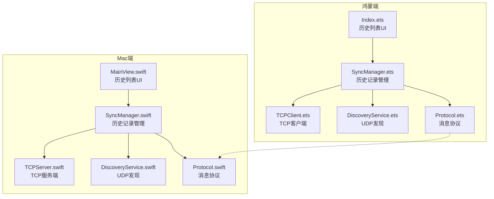
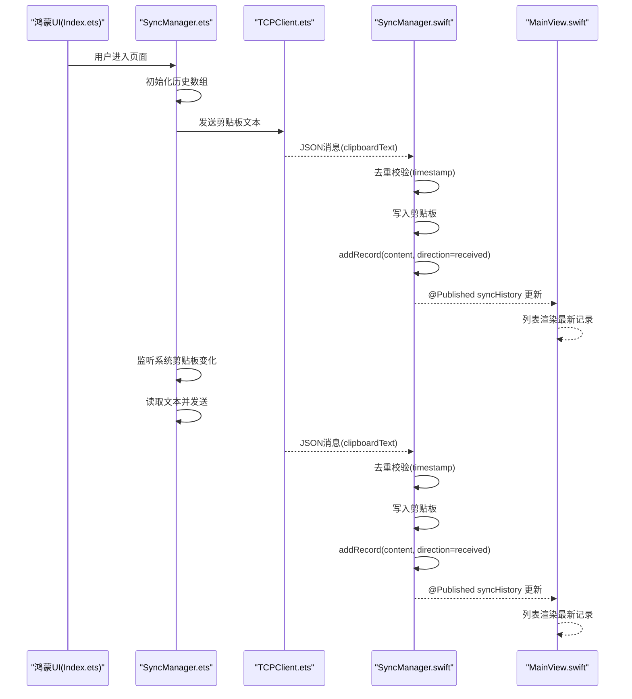
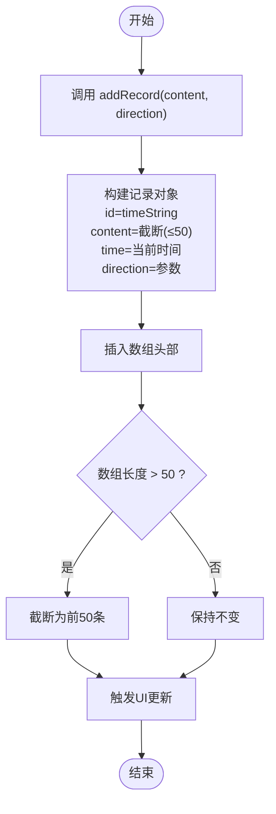
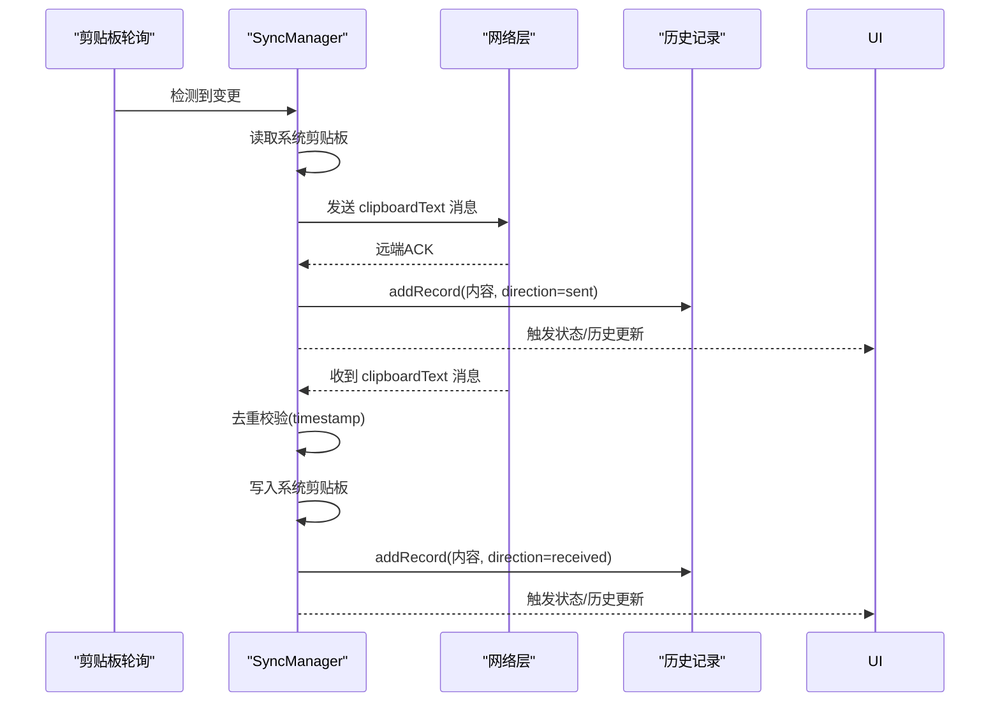
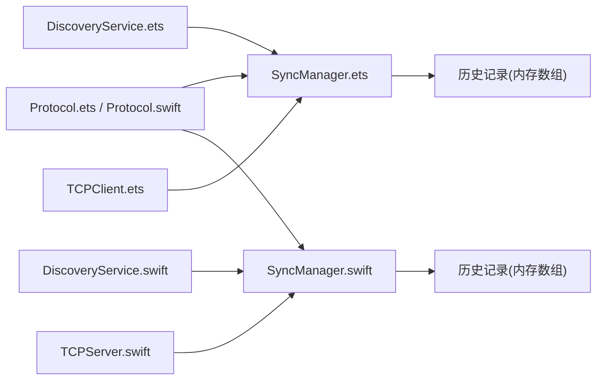

# 同步历史记录

<cite>
**本文引用的文件**
- [SyncManager.ets](file://ClipboardSync/harmony/entry/src/main/ets/model/SyncManager.ets)
- [Index.ets](file://ClipboardSync/harmony/entry/src/main/ets/pages/Index.ets)
- [SyncManager.swift](file://ClipboardSync/mac/ClipboardSync/SyncManager.swift)
- [MainView.swift](file://ClipboardSync/mac/ClipboardSync/MainView.swift)
- [Protocol.ets](file://ClipboardSync/harmony/entry/src/main/ets/common/Protocol.ets)
- [Protocol.swift](file://ClipboardSync/mac/ClipboardSync/Protocol.swift)
- [DiscoveryService.ets](file://ClipboardSync/harmony/entry/src/main/ets/common/DiscoveryService.ets)
- [TCPClient.ets](file://ClipboardSync/harmony/entry/src/main/ets/common/TCPClient.ets)
- [DiscoveryService.swift](file://ClipboardSync/mac/ClipboardSync/DiscoveryService.swift)
- [TCPServer.swift](file://ClipboardSync/mac/ClipboardSync/TCPServer.swift)
- [PROJECT.md](file://ClipboardSync/PROJECT.md)
</cite>

## 目录
1. [简介](#简介)
2. [项目结构](#项目结构)
3. [核心组件](#核心组件)
4. [架构总览](#架构总览)
5. [详细组件分析](#详细组件分析)
6. [依赖关系分析](#依赖关系分析)
7. [性能考量](#性能考量)
8. [故障排查指南](#故障排查指南)
9. [结论](#结论)
10. [附录](#附录)

## 简介
本文件围绕“同步历史记录”功能进行深入文档化，涵盖历史记录的数据结构、存储策略、UI 展示方式，以及生成与维护流程（消息捕获、记录保存、数量限制、过期处理）。同时提供跨平台实现差异说明，并给出可定位到源码位置的参考路径，便于开发者快速定位实现细节。

## 项目结构
该项目采用“两端分离”的架构：Mac 端使用 Swift + SwiftUI，鸿蒙端使用 ArkTS + ArkUI。两者通过 UDP 广播进行设备发现，随后建立 TCP 长连接进行剪贴板内容同步。历史记录在两端均以内存数组形式维护，最多保留最近 50 条记录。

图表来源
- [SyncManager.ets:26-301](file://ClipboardSync/harmony/entry/src/main/ets/model/SyncManager.ets#L26-L301)
- [Index.ets:1-226](file://ClipboardSync/harmony/entry/src/main/ets/pages/Index.ets#L1-L226)
- [SyncManager.swift:5-154](file://ClipboardSync/mac/ClipboardSync/SyncManager.swift#L5-L154)
- [MainView.swift:1-209](file://ClipboardSync/mac/ClipboardSync/MainView.swift#L1-L209)
- [Protocol.ets:1-27](file://ClipboardSync/harmony/entry/src/main/ets/common/Protocol.ets#L1-L27)
- [Protocol.swift:1-43](file://ClipboardSync/mac/ClipboardSync/Protocol.swift#L1-L43)
- [DiscoveryService.ets:1-161](file://ClipboardSync/harmony/entry/src/main/ets/common/DiscoveryService.ets#L1-L161)
- [TCPClient.ets:1-181](file://ClipboardSync/harmony/entry/src/main/ets/common/TCPClient.ets#L1-L181)
- [DiscoveryService.swift:1-197](file://ClipboardSync/mac/ClipboardSync/DiscoveryService.swift#L1-L197)
- [TCPServer.swift:1-174](file://ClipboardSync/mac/ClipboardSync/TCPServer.swift#L1-L174)

章节来源
- [PROJECT.md:1-170](file://ClipboardSync/PROJECT.md#L1-L170)

## 核心组件
- 历史记录数据模型
  - 鸿蒙端：接口定义包含 id、content、time、direction 字段，其中 content 会截断至 50 字符并追加省略号。
  - Mac 端：结构体定义包含 id、content、time、direction，direction 为枚举值 sent/received。
- 历史记录管理
  - 两端均在消息发送/接收后调用 addRecord 方法，将新记录插入数组头部，并限制最大长度为 50。
- UI 展示
  - 鸿蒙端：使用 List 渲染历史项，每项包含方向图标、内容文本、时间标签。
  - Mac 端：使用 SwiftUI List 渲染历史项，包含方向圆点图标、内容与辅助文本、时间标签。

章节来源
- [SyncManager.ets:8-13](file://ClipboardSync/harmony/entry/src/main/ets/model/SyncManager.ets#L8-L13)
- [SyncManager.ets:287-299](file://ClipboardSync/harmony/entry/src/main/ets/model/SyncManager.ets#L287-L299)
- [Index.ets:150-209](file://ClipboardSync/harmony/entry/src/main/ets/pages/Index.ets#L150-L209)
- [SyncManager.swift:24-34](file://ClipboardSync/mac/ClipboardSync/SyncManager.swift#L24-L34)
- [SyncManager.swift:144-152](file://ClipboardSync/mac/ClipboardSync/SyncManager.swift#L144-L152)
- [MainView.swift:156-207](file://ClipboardSync/mac/ClipboardSync/MainView.swift#L156-L207)

## 架构总览
历史记录贯穿于“消息捕获—记录保存—UI展示”的完整链路。两端通过协议统一的消息结构进行传输，去重逻辑基于时间戳避免回环，历史记录在两端独立维护，互不共享。

图表来源
- [Index.ets:13-27](file://ClipboardSync/harmony/entry/src/main/ets/pages/Index.ets#L13-L27)
- [SyncManager.ets:202-252](file://ClipboardSync/harmony/entry/src/main/ets/model/SyncManager.ets#L202-L252)
- [TCPClient.ets:44-58](file://ClipboardSync/harmony/entry/src/main/ets/common/TCPClient.ets#L44-L58)
- [SyncManager.swift:95-142](file://ClipboardSync/mac/ClipboardSync/SyncManager.swift#L95-L142)
- [MainView.swift:156-207](file://ClipboardSync/mac/ClipboardSync/MainView.swift#L156-L207)

## 详细组件分析

### 历史记录数据模型与存储策略
- 数据模型
  - 鸿蒙端：接口 SyncRecord 包含 id、content、time、direction；content 截断策略在添加记录时执行。
  - Mac 端：结构体 SyncRecord 包含 id、content、time、direction；SwiftUI 使用 Identifiable 协议。
- 存储策略
  - 插入策略：每次新增记录都插入数组首部（unshift 或 insert at 0）。
  - 数量限制：超过 50 条时截断数组，保留最新的 50 条。
  - 时间戳去重：两端均在消息处理前比较 timestamp，避免回环导致的历史记录膨胀。
- 存储介质
  - 两端均为内存数组，未见持久化存储（如本地数据库或文件）。

图表来源
- [SyncManager.ets:287-299](file://ClipboardSync/harmony/entry/src/main/ets/model/SyncManager.ets#L287-L299)
- [SyncManager.swift:144-152](file://ClipboardSync/mac/ClipboardSync/SyncManager.swift#L144-L152)

章节来源
- [SyncManager.ets:8-13](file://ClipboardSync/harmony/entry/src/main/ets/model/SyncManager.ets#L8-L13)
- [SyncManager.ets:287-299](file://ClipboardSync/harmony/entry/src/main/ets/model/SyncManager.ets#L287-L299)
- [SyncManager.swift:24-34](file://ClipboardSync/mac/ClipboardSync/SyncManager.swift#L24-L34)
- [SyncManager.swift:144-152](file://ClipboardSync/mac/ClipboardSync/SyncManager.swift#L144-L152)

### 历史记录生成与维护流程
- 消息捕获
  - 鸿蒙端：系统剪贴板轮询检测变更，读取文本后通过 TCPClient 发送；收到远端消息时也触发历史记录添加。
  - Mac 端：剪贴板监控回调触发本地消息生成，广播给所有连接客户端；收到远端消息时同样添加历史记录。
- 记录保存
  - 两端在发送/接收成功后调用 addRecord，确保历史记录与实际同步行为一致。
- 数量限制与过期处理
  - 通过固定上限（50）进行截断，无额外过期字段或时间窗口控制。
- 去重处理
  - 两端均使用 timestamp 与 lastSentTimestamp 比较，过滤掉已处理过的消息，防止回环。

图表来源
- [SyncManager.ets:202-252](file://ClipboardSync/harmony/entry/src/main/ets/model/SyncManager.ets#L202-L252)
- [SyncManager.swift:117-142](file://ClipboardSync/mac/ClipboardSync/SyncManager.swift#L117-L142)

章节来源
- [SyncManager.ets:178-198](file://ClipboardSync/harmony/entry/src/main/ets/model/SyncManager.ets#L178-L198)
- [SyncManager.ets:215-252](file://ClipboardSync/harmony/entry/src/main/ets/model/SyncManager.ets#L215-L252)
- [SyncManager.swift:95-142](file://ClipboardSync/mac/ClipboardSync/SyncManager.swift#L95-L142)

### UI 展示方式
- 鸿蒙端（ArkUI）
  - 页面结构：状态卡片 + 手动连接区域 + 同步历史列表。
  - 历史列表：使用 List + ForEach 渲染，每项包含方向图标、内容文本、时间标签；空状态提示“暂无同步记录”。
- Mac 端（SwiftUI）
  - 页面结构：状态卡片 + 同步历史列表。
  - 历史列表：使用 List 渲染，每项包含方向圆点图标、内容与辅助文本、时间标签；空状态提示“暂无同步记录”。

章节来源
- [Index.ets:29-51](file://ClipboardSync/harmony/entry/src/main/ets/pages/Index.ets#L29-L51)
- [Index.ets:150-209](file://ClipboardSync/harmony/entry/src/main/ets/pages/Index.ets#L150-L209)
- [MainView.swift:3-21](file://ClipboardSync/mac/ClipboardSync/MainView.swift#L3-L21)
- [MainView.swift:156-207](file://ClipboardSync/mac/ClipboardSync/MainView.swift#L156-L207)

### 跨平台实现差异
- 数据模型
  - 鸿蒙端：ArkTS 接口，时间字段为字符串；方向为字面量联合类型。
  - Mac 端：Swift 结构体，时间字段为 Date；方向为枚举。
- 存储与更新
  - 鸿蒙端：通过 onStateChange 回调驱动 UI 更新。
  - Mac 端：通过 @Published 属性包装器与 Combine，自动触发 UI 更新。
- 历史记录上限
  - 两端均限制为 50 条，实现方式分别为数组切片与前缀截断。
- 协议与消息
  - 两端共享协议常量与消息结构，确保跨端兼容性。

章节来源
- [SyncManager.ets:8-13](file://ClipboardSync/harmony/entry/src/main/ets/model/SyncManager.ets#L8-L13)
- [SyncManager.swift:24-34](file://ClipboardSync/mac/ClipboardSync/SyncManager.swift#L24-L34)
- [Index.ets:15-19](file://ClipboardSync/harmony/entry/src/main/ets/pages/Index.ets#L15-L19)
- [MainView.swift:4-9](file://ClipboardSync/mac/ClipboardSync/MainView.swift#L4-L9)

## 依赖关系分析
- 协议层
  - 两端共享消息类型与协议常量，保证消息格式一致。
- 通信层
  - 鸿蒙端：DiscoveryService（UDP）、TCPClient（TCP）。
  - Mac 端：DiscoveryService（UDP）、TCPServer（TCP）。
- 历史记录依赖
  - 鸿蒙端：SyncManager 依赖 Protocol、DiscoveryService、TCPClient；历史记录在消息发送/接收路径中被调用。
  - Mac 端：SyncManager 依赖 Protocol、DiscoveryService、TCPServer；历史记录在消息发送/接收路径中被调用。

图表来源
- [Protocol.ets:1-27](file://ClipboardSync/harmony/entry/src/main/ets/common/Protocol.ets#L1-L27)
- [Protocol.swift:1-43](file://ClipboardSync/mac/ClipboardSync/Protocol.swift#L1-L43)
- [DiscoveryService.ets:1-161](file://ClipboardSync/harmony/entry/src/main/ets/common/DiscoveryService.ets#L1-L161)
- [TCPClient.ets:1-181](file://ClipboardSync/harmony/entry/src/main/ets/common/TCPClient.ets#L1-L181)
- [DiscoveryService.swift:1-197](file://ClipboardSync/mac/ClipboardSync/DiscoveryService.swift#L1-L197)
- [TCPServer.swift:1-174](file://ClipboardSync/mac/ClipboardSync/TCPServer.swift#L1-L174)
- [SyncManager.ets:26-301](file://ClipboardSync/harmony/entry/src/main/ets/model/SyncManager.ets#L26-L301)
- [SyncManager.swift:5-154](file://ClipboardSync/mac/ClipboardSync/SyncManager.swift#L5-L154)

章节来源
- [PROJECT.md:52-63](file://ClipboardSync/PROJECT.md#L52-L63)

## 性能考量
- 历史记录上限为 50 条，插入与截断操作的时间复杂度为 O(n)（数组头部插入 + 截断），在当前规模下开销极小。
- 去重基于时间戳比较，避免回环带来的重复记录，减少无效 UI 更新。
- UI 更新采用响应式机制（鸿蒙端回调、Mac 端 @Published），避免手动刷新，提升交互流畅度。
- 若未来需要更大容量或更复杂的查询需求，建议引入本地持久化存储（如数据库或归档文件）以降低内存占用并支持历史检索。

## 故障排查指南
- 历史记录为空
  - 检查是否已连接且有同步发生；确认 UI 是否正确订阅状态变化。
  - 参考路径：[Index.ets:159-168](file://ClipboardSync/harmony/entry/src/main/ets/pages/Index.ets#L159-L168)、[MainView.swift:14-18](file://ClipboardSync/mac/ClipboardSync/MainView.swift#L14-L18)
- 历史记录不更新
  - 确认 addRecord 是否在发送/接收路径中被调用；检查去重逻辑是否拦截了消息。
  - 参考路径：[SyncManager.ets:287-299](file://ClipboardSync/harmony/entry/src/main/ets/model/SyncManager.ets#L287-L299)、[SyncManager.swift:144-152](file://ClipboardSync/mac/ClipboardSync/SyncManager.swift#L144-L152)
- 去重失效导致重复记录
  - 检查 timestamp 与 lastSentTimestamp 的设置与传递是否一致。
  - 参考路径：[SyncManager.ets:178-181](file://ClipboardSync/harmony/entry/src/main/ets/model/SyncManager.ets#L178-L181)、[SyncManager.swift:96-98](file://ClipboardSync/mac/ClipboardSync/SyncManager.swift#L96-L98)

章节来源
- [Index.ets:159-168](file://ClipboardSync/harmony/entry/src/main/ets/pages/Index.ets#L159-L168)
- [MainView.swift:14-18](file://ClipboardSync/mac/ClipboardSync/MainView.swift#L14-L18)
- [SyncManager.ets:178-181](file://ClipboardSync/harmony/entry/src/main/ets/model/SyncManager.ets#L178-L181)
- [SyncManager.swift:96-98](file://ClipboardSync/mac/ClipboardSync/SyncManager.swift#L96-L98)

## 结论
同步历史记录在两端实现了统一的数据模型与一致的展示方式，通过时间戳去重与固定上限策略，确保历史记录的准确性与性能。未来可在保持现有 UI 体验的基础上，考虑引入持久化存储与更丰富的查询能力，以满足长期使用场景下的历史检索需求。

## 附录
- 关键实现参考路径
  - 鸿蒙端历史记录管理：[SyncManager.ets:287-299](file://ClipboardSync/harmony/entry/src/main/ets/model/SyncManager.ets#L287-L299)
  - 鸿蒙端 UI 历史列表：[Index.ets:150-209](file://ClipboardSync/harmony/entry/src/main/ets/pages/Index.ets#L150-L209)
  - Mac 端历史记录管理：[SyncManager.swift:144-152](file://ClipboardSync/mac/ClipboardSync/SyncManager.swift#L144-L152)
  - Mac 端 UI 历史列表：[MainView.swift:156-207](file://ClipboardSync/mac/ClipboardSync/MainView.swift#L156-L207)
  - 协议与消息结构：[Protocol.ets:1-27](file://ClipboardSync/harmony/entry/src/main/ets/common/Protocol.ets#L1-L27)、[Protocol.swift:1-43](file://ClipboardSync/mac/ClipboardSync/Protocol.swift#L1-L43)
  - 通信与发现组件：[DiscoveryService.ets:1-161](file://ClipboardSync/harmony/entry/src/main/ets/common/DiscoveryService.ets#L1-L161)、[TCPClient.ets:1-181](file://ClipboardSync/harmony/entry/src/main/ets/common/TCPClient.ets#L1-L181)、[DiscoveryService.swift:1-197](file://ClipboardSync/mac/ClipboardSync/DiscoveryService.swift#L1-L197)、[TCPServer.swift:1-174](file://ClipboardSync/mac/ClipboardSync/TCPServer.swift#L1-L174)