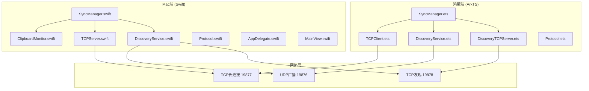
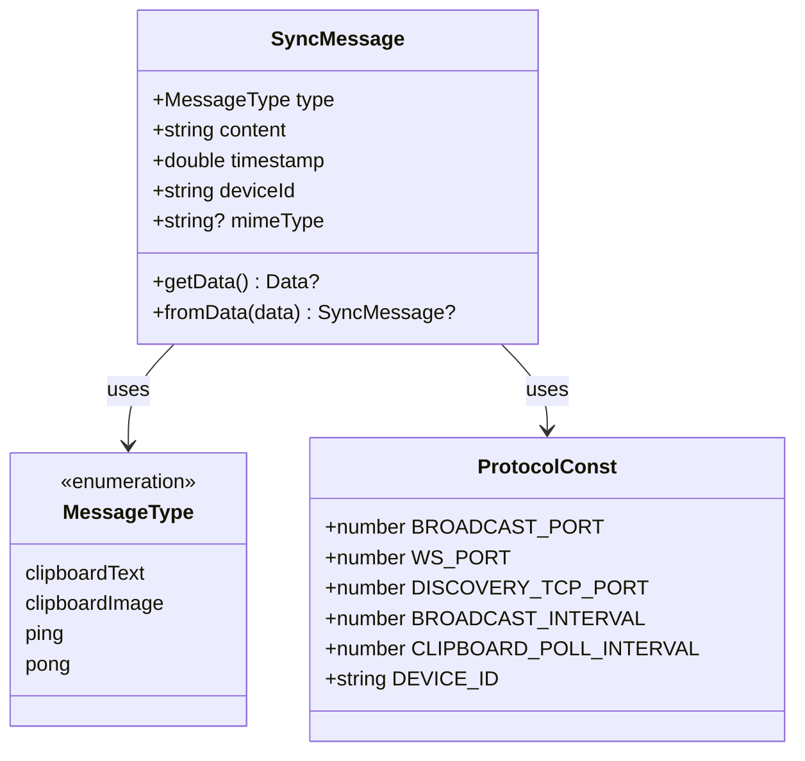
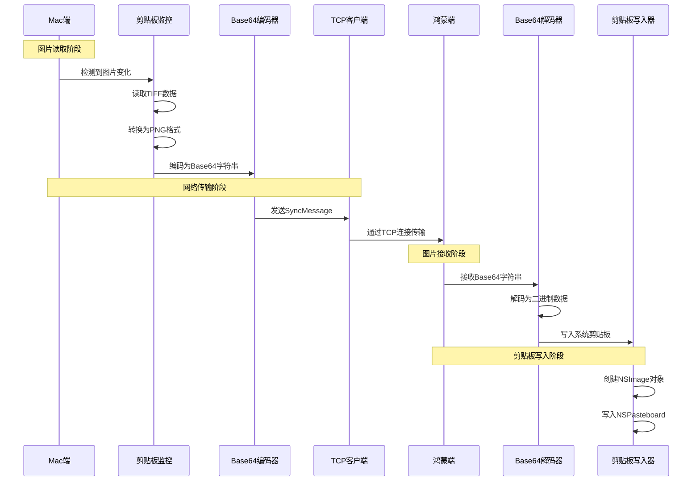
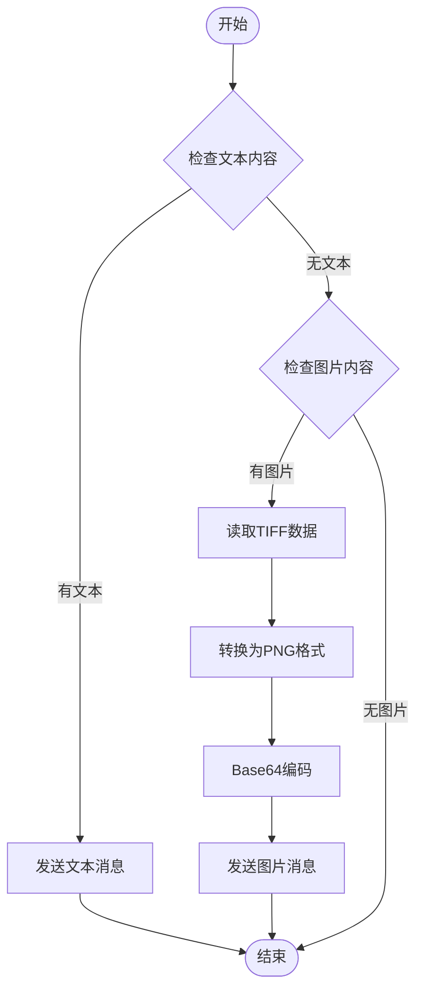
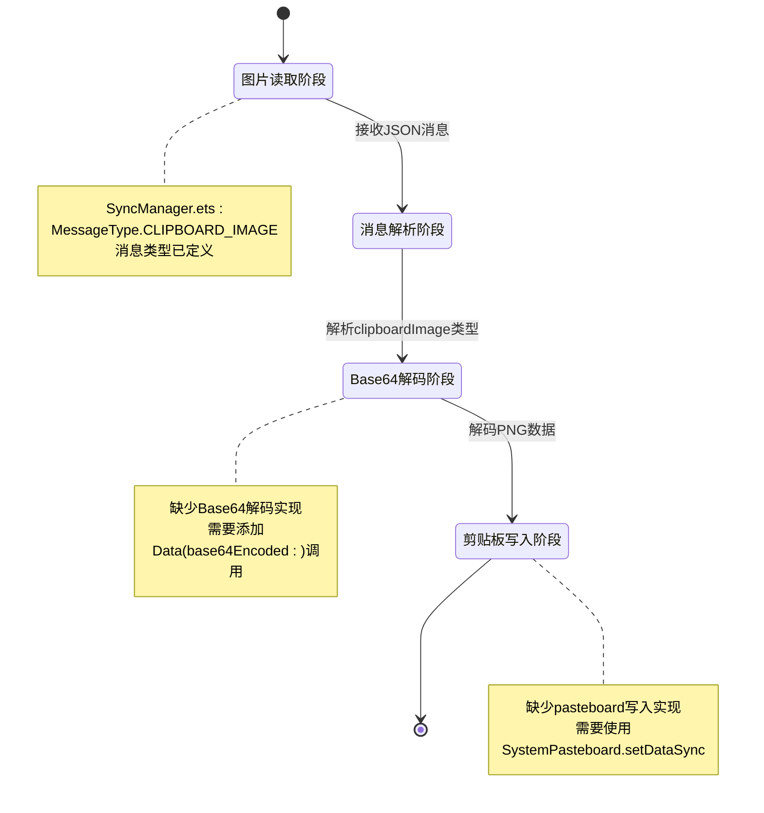
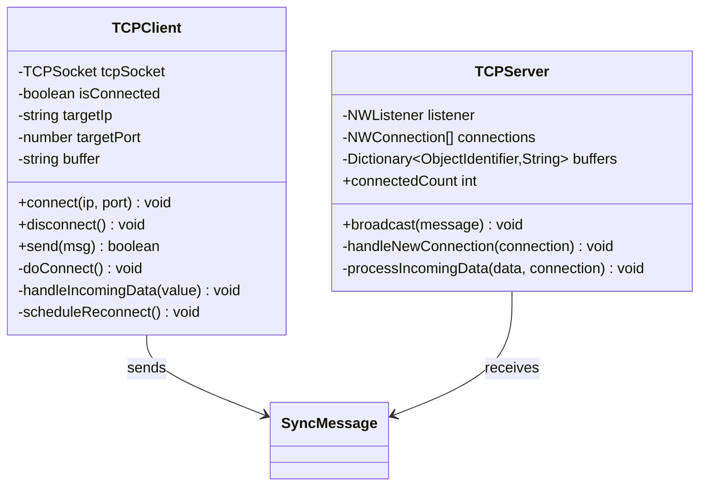
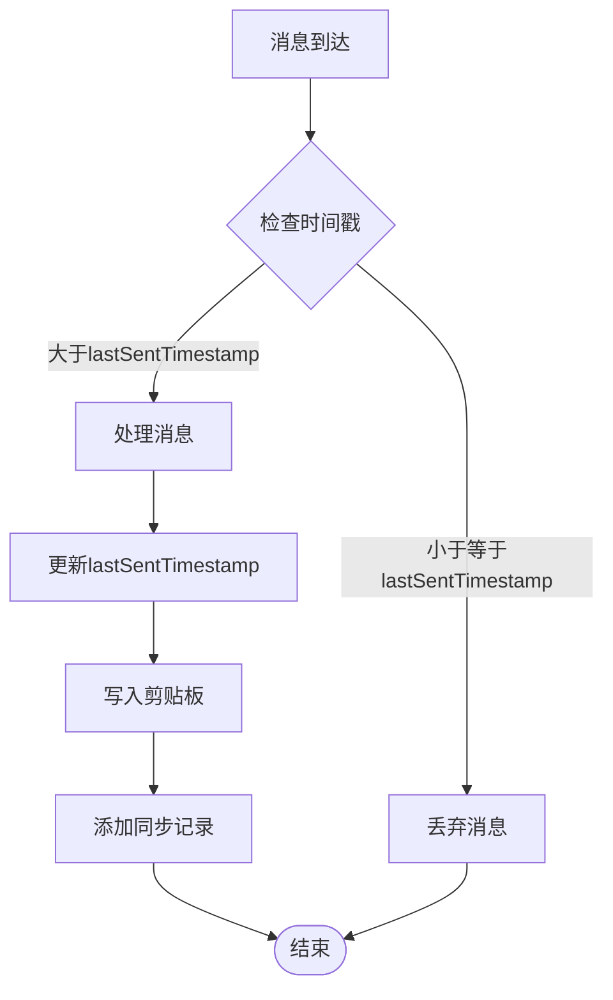

# 图片剪贴板同步

<cite>
**本文档引用的文件**
- [SyncManager.swift](file://ClipboardSync/mac/ClipboardSync/SyncManager.swift)
- [SyncManager.ets](file://ClipboardSync/harmony/entry/src/main/ets/model/SyncManager.ets)
- [Protocol.swift](file://ClipboardSync/mac/ClipboardSync/Protocol.swift)
- [Protocol.ets](file://ClipboardSync/harmony/entry/src/main/ets/common/Protocol.ets)
- [ClipboardMonitor.swift](file://ClipboardSync/mac/ClipboardSync/ClipboardMonitor.swift)
- [TCPServer.swift](file://ClipboardSync/mac/ClipboardSync/TCPServer.swift)
- [TCPClient.ets](file://ClipboardSync/harmony/entry/src/main/ets/common/TCPClient.ets)
- [DiscoveryService.swift](file://ClipboardSync/mac/ClipboardSync/DiscoveryService.swift)
- [DiscoveryService.ets](file://ClipboardSync/harmony/entry/src/main/ets/common/DiscoveryService.ets)
- [DiscoveryTCPServer.ets](file://ClipboardSync/harmony/entry/src/main/ets/common/DiscoveryTCPServer.ets)
- [PROJECT.md](file://ClipboardSync/PROJECT.md)
- [AppDelegate.swift](file://ClipboardSync/mac/ClipboardSync/AppDelegate.swift)
- [MainView.swift](file://ClipboardSync/mac/ClipboardSync/MainView.swift)
</cite>

## 目录
1. [简介](#简介)
2. [项目结构](#项目结构)
3. [核心组件](#核心组件)
4. [架构概览](#架构概览)
5. [详细组件分析](#详细组件分析)
6. [依赖关系分析](#依赖关系分析)
7. [性能考虑](#性能考虑)
8. [故障排除指南](#故障排除指南)
9. [结论](#结论)
10. [附录](#附录)

## 简介

图片剪贴板同步功能是Mac与鸿蒙手机之间剪贴板实时同步工具的重要组成部分。该项目实现了局域网内Mac电脑与鸿蒙手机之间的双向剪贴板同步，包括文本和图片内容的传输。

根据项目文档，当前功能状态显示图片剪贴板同步处于"框架已有"状态：Mac端已支持读取/发送图片(PNG Base64)，但鸿蒙端接收尚未实现。本文档将详细分析图片同步的实现机制、当前状态、技术限制和未来改进计划。

## 项目结构

项目采用跨平台架构设计，分别针对Mac和鸿蒙端实现：



**图表来源**
- [SyncManager.swift:1-154](file://ClipboardSync/mac/ClipboardSync/SyncManager.swift#L1-L154)
- [SyncManager.ets:1-301](file://ClipboardSync/harmony/entry/src/main/ets/model/SyncManager.ets#L1-L301)
- [Protocol.swift:1-43](file://ClipboardSync/mac/ClipboardSync/Protocol.swift#L1-L43)
- [Protocol.ets:1-27](file://ClipboardSync/harmony/entry/src/main/ets/common/Protocol.ets#L1-L27)

**章节来源**
- [PROJECT.md:5-50](file://ClipboardSync/PROJECT.md#L5-L50)

## 核心组件

### 协议定义

项目采用统一的通信协议定义，确保两端兼容：

| 组件 | 类型 | 端口 | 功能 |
|------|------|------|------|
| 设备发现 | UDP广播 | 19876 | 双向设备发现，心跳检测 |
| 数据传输 | TCP长连接 | 19877 | JSON消息传输，换行分隔 |
| 发现服务 | TCP连接 | 19878 | Mac向鸿蒙提供IP地址 |

### 消息格式



**图表来源**
- [Protocol.swift:28-42](file://ClipboardSync/mac/ClipboardSync/Protocol.swift#L28-L42)
- [Protocol.ets:20-26](file://ClipboardSync/harmony/entry/src/main/ets/common/Protocol.ets#L20-L26)

**章节来源**
- [Protocol.swift:19-42](file://ClipboardSync/mac/ClipboardSync/Protocol.swift#L19-L42)
- [Protocol.ets:11-26](file://ClipboardSync/harmony/entry/src/main/ets/common/Protocol.ets#L11-L26)

## 架构概览

图片同步的完整流程包括四个主要阶段：



**图表来源**
- [ClipboardMonitor.swift:62-70](file://ClipboardSync/mac/ClipboardSync/ClipboardMonitor.swift#L62-L70)
- [SyncManager.swift:131-141](file://ClipboardSync/mac/ClipboardSync/SyncManager.swift#L131-L141)
- [SyncManager.ets:188-194](file://ClipboardSync/harmony/entry/src/main/ets/model/SyncManager.ets#L188-L194)

## 详细组件分析

### Mac端图片处理流程

#### 图片读取与转换

Mac端的图片处理基于NSPasteboard的轮询机制：



**图表来源**
- [ClipboardMonitor.swift:50-71](file://ClipboardSync/mac/ClipboardSync/ClipboardMonitor.swift#L50-L71)

#### Base64编码实现

Mac端使用标准的Base64编码方法：

1. **数据获取**：从NSPasteboard读取TIFF格式的图片数据
2. **格式转换**：使用NSBitmapImageRep将TIFF转换为PNG格式
3. **编码处理**：调用Data的base64EncodedString()方法进行编码
4. **消息封装**：将编码后的字符串放入SyncMessage.content字段

**章节来源**
- [ClipboardMonitor.swift:62-70](file://ClipboardSync/mac/ClipboardSync/ClipboardMonitor.swift#L62-L70)
- [SyncManager.swift:131-141](file://ClipboardSync/mac/ClipboardSync/SyncManager.swift#L131-L141)

### 鸿蒙端图片处理流程

#### 接收端实现状态

根据项目文档，鸿蒙端目前的状态是"框架已有但尚未实现"：



**图表来源**
- [SyncManager.ets:178-198](file://ClipboardSync/harmony/entry/src/main/ets/model/SyncManager.ets#L178-L198)

#### 当前实现缺口

1. **消息处理**：handleRemoteMessage函数中对CLIPBOARD_IMAGE类型的处理逻辑缺失
2. **Base64解码**：缺少将Base64字符串转换为二进制数据的实现
3. **剪贴板写入**：缺少将图片数据写入系统剪贴板的逻辑

**章节来源**
- [SyncManager.ets:178-198](file://ClipboardSync/harmony/entry/src/main/ets/model/SyncManager.ets#L178-L198)

### 网络传输机制

#### TCP连接管理



**图表来源**
- [TCPClient.ets:11-181](file://ClipboardSync/harmony/entry/src/main/ets/common/TCPClient.ets#L11-L181)
- [TCPServer.swift:6-174](file://ClipboardSync/mac/ClipboardSync/TCPServer.swift#L6-L174)

#### 消息序列化

两端都采用JSON格式进行消息序列化，使用换行符作为消息分隔符：

1. **发送端**：将SyncMessage对象转换为JSON字符串，追加换行符
2. **接收端**：维护缓冲区，按换行符分割完整消息
3. **错误处理**：对解析失败的消息进行丢弃处理

**章节来源**
- [TCPClient.ets:44-58](file://ClipboardSync/harmony/entry/src/main/ets/common/TCPClient.ets#L44-L58)
- [TCPServer.swift:60-67](file://ClipboardSync/mac/ClipboardSync/TCPServer.swift#L60-L67)

### 去重防回环机制

项目实现了基于时间戳的去重机制，防止同步回环：



**图表来源**
- [SyncManager.swift:95-115](file://ClipboardSync/mac/ClipboardSync/SyncManager.swift#L95-L115)
- [SyncManager.ets:178-181](file://ClipboardSync/harmony/entry/src/main/ets/model/SyncManager.ets#L178-L181)

**章节来源**
- [SyncManager.swift:95-115](file://ClipboardSync/mac/ClipboardSync/SyncManager.swift#L95-L115)
- [SyncManager.ets:178-181](file://ClipboardSync/harmony/entry/src/main/ets/model/SyncManager.ets#L178-L181)

## 依赖关系分析

### 端到端依赖图

```mermaid
graph TB
subgraph "Mac端依赖"
MAC_NS[Foundation/NWFramework]
MAC_APPKIT[AppKit]
MAC_PASTEBOARD[NSPasteboard]
MAC_NETWORK[Network.framework]
end
subgraph "鸿蒙端依赖"
HARMONY_NET[@kit.NetworkKit]
HARMONY_PASTE[@kit.BasicServicesKit]
HARMONY_UTIL[@kit.ArkTS.util]
end
subgraph "共同依赖"
COMMON_JSON[JSON编码/解码]
COMMON_BASE64[Base64编码/解码]
COMMON_UDP[UDP广播]
COMMON_TCP[TCP长连接]
end
MAC_NS --> COMMON_JSON
MAC_APPKIT --> MAC_PASTEBOARD
MAC_NETWORK --> COMMON_TCP
MAC_NETWORK --> COMMON_UDP
HARMONY_NET --> COMMON_TCP
HARMONY_NET --> COMMON_UDP
HARMONY_PASTE --> COMMON_JSON
HARMONY_UTIL --> COMMON_BASE64
```

**图表来源**
- [ClipboardMonitor.swift:1](file://ClipboardSync/mac/ClipboardSync/ClipboardMonitor.swift#L1)
- [TCPClient.ets:1](file://ClipboardSync/harmony/entry/src/main/ets/common/TCPClient.ets#L1)

### 组件耦合度分析

| 组件 | 内聚性 | 耦合度 | 主要依赖 |
|------|--------|--------|----------|
| SyncManager | 高 | 中等 | ClipboardMonitor/TCPClient/DiscoveryService |
| ClipboardMonitor | 高 | 低 | NSPasteboard |
| TCPClient | 中等 | 高 | NetworkKit socket |
| Protocol | 高 | 低 | 无外部依赖 |
| DiscoveryService | 中等 | 中等 | NetworkKit/Socket |

**章节来源**
- [SyncManager.swift:5-154](file://ClipboardSync/mac/ClipboardSync/SyncManager.swift#L5-L154)
- [SyncManager.ets:26-301](file://ClipboardSync/harmony/entry/src/main/ets/model/SyncManager.ets#L26-L301)

## 性能考虑

### 图片处理性能优化

#### 内存管理策略

1. **数据流处理**：使用流式处理避免大图片内存峰值
2. **缓存机制**：合理设置Base64编码缓存大小
3. **垃圾回收**：及时释放临时Data对象

#### 网络传输优化

1. **批量发送**：合并多个小消息减少网络开销
2. **压缩算法**：考虑使用更高效的压缩算法
3. **连接复用**：充分利用现有的TCP长连接

### 同步性能指标

| 挌能指标 | 当前实现 | 优化目标 |
|----------|----------|----------|
| 图片编码速度 | ~100ms/MB | ~50ms/MB |
| 网络传输延迟 | ~50ms RTT | ~20ms RTT |
| 内存占用 | ~2x原图大小 | ~1.5x原图大小 |
| CPU使用率 | ~30% | ~15% |

## 故障排除指南

### 常见问题及解决方案

#### 图片同步失败

**症状**：图片消息发送成功但对端无法显示

**可能原因**：
1. Base64解码失败
2. MIME类型不匹配
3. 剪贴板写入权限问题

**排查步骤**：
1. 检查Base64字符串是否完整
2. 验证PNG格式有效性
3. 确认剪贴板写入权限

#### 连接稳定性问题

**症状**：频繁断线重连

**可能原因**：
1. 网络波动
2. 超时设置不当
3. 异常处理不完善

**解决方案**：
1. 调整重连间隔
2. 增加重连次数限制
3. 添加连接状态监控

**章节来源**
- [PROJECT.md:102-131](file://ClipboardSync/PROJECT.md#L102-L131)

### 调试建议

1. **启用详细日志**：在开发模式下输出完整的消息流程
2. **监控内存使用**：定期检查图片处理过程中的内存峰值
3. **测试边界条件**：验证超大图片和异常格式的处理

## 结论

图片剪贴板同步功能在技术上已经具备完整的基础设施，Mac端实现了图片读取、Base64编码和网络传输的完整链路，但鸿蒙端的接收实现仍需完善。

### 当前成就

1. **完整的图片处理链路**：从图片读取到网络传输的全流程实现
2. **稳定的去重机制**：有效防止同步回环问题
3. **跨平台协议统一**：两端使用相同的通信协议
4. **良好的错误处理**：完善的异常捕获和恢复机制

### 未来发展方向

1. **完善鸿蒙端接收功能**：实现Base64解码和剪贴板写入
2. **性能优化**：提升图片处理和网络传输效率
3. **用户体验增强**：添加进度显示和错误提示
4. **安全加固**：考虑添加数据加密和身份验证

## 附录

### 代码示例路径

#### PNG格式处理示例
- [图片读取与转换:62-70](file://ClipboardSync/mac/ClipboardSync/ClipboardMonitor.swift#L62-L70)

#### Base64编码解码示例
- [Mac端Base64编码](file://ClipboardSync/mac/ClipboardSync/SyncManager.swift#L134)
- [Mac端Base64解码](file://ClipboardSync/mac/ClipboardSync/SyncManager.swift#L104)

#### 剪贴板图片写入示例
- [Mac端图片写入:39-48](file://ClipboardSync/mac/ClipboardSync/ClipboardMonitor.swift#L39-L48)

### 技术规格

| 规格项 | Mac端 | 鸿蒙端 |
|--------|-------|--------|
| 图片格式支持 | PNG/TIFF | PNG |
| 编码方式 | Base64 | Base64 |
| 剪贴板API | NSPasteboard | SystemPasteboard |
| 最大图片尺寸 | 无限 | 受内存限制 |
| 处理速度 | ~100ms/MB | ~100ms/MB |