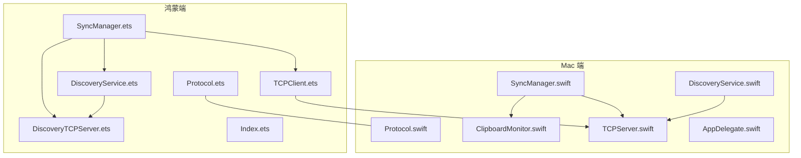
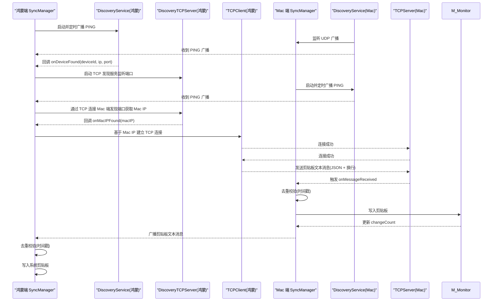
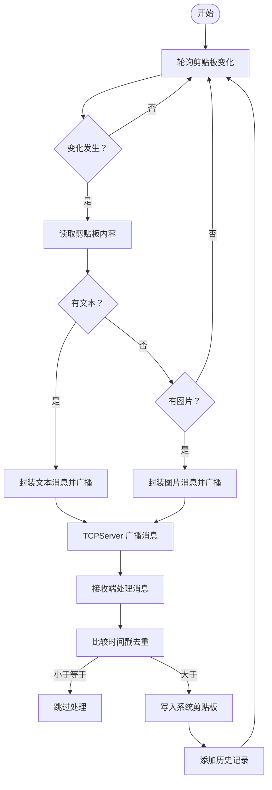
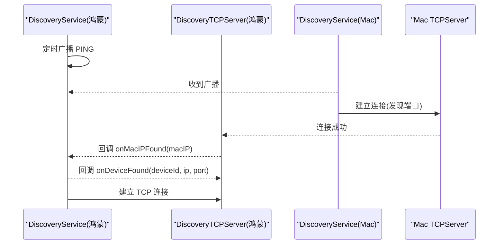
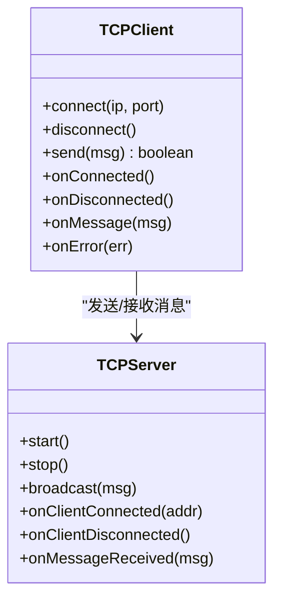
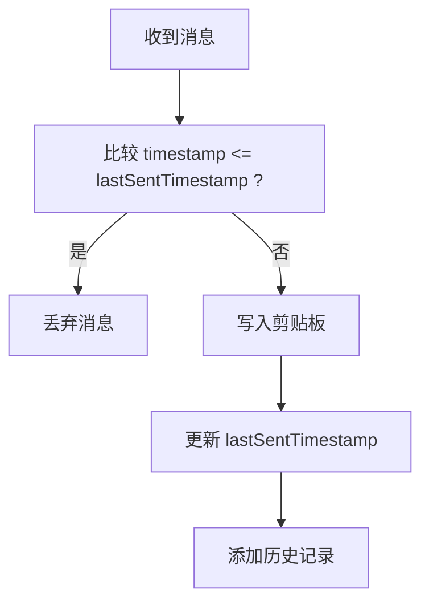
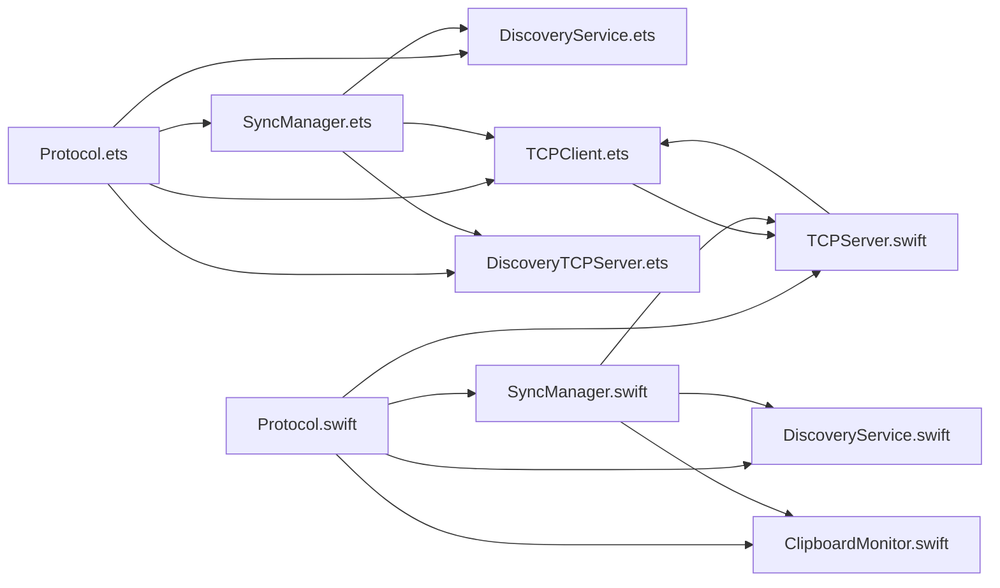

# 核心功能

<cite>
**本文引用的文件**
- [SyncManager.ets](file://ClipboardSync/harmony/entry/src/main/ets/model/SyncManager.ets)
- [TCPClient.ets](file://ClipboardSync/harmony/entry/src/main/ets/common/TCPClient.ets)
- [DiscoveryService.ets](file://ClipboardSync/harmony/entry/src/main/ets/common/DiscoveryService.ets)
- [DiscoveryTCPServer.ets](file://ClipboardSync/harmony/entry/src/main/ets/common/DiscoveryTCPServer.ets)
- [Protocol.ets](file://ClipboardSync/harmony/entry/src/main/ets/common/Protocol.ets)
- [Index.ets](file://ClipboardSync/harmony/entry/src/main/ets/pages/Index.ets)
- [SyncManager.swift](file://ClipboardSync/mac/ClipboardSync/SyncManager.swift)
- [TCPServer.swift](file://ClipboardSync/mac/ClipboardSync/TCPServer.swift)
- [DiscoveryService.swift](file://ClipboardSync/mac/ClipboardSync/DiscoveryService.swift)
- [ClipboardMonitor.swift](file://ClipboardSync/mac/ClipboardSync/ClipboardMonitor.swift)
- [Protocol.swift](file://ClipboardSync/mac/ClipboardSync/Protocol.swift)
- [AppDelegate.swift](file://ClipboardSync/mac/ClipboardSync/AppDelegate.swift)
- [PROJECT.md](file://ClipboardSync/PROJECT.md)
</cite>

## 目录
1. [简介](#简介)
2. [项目结构](#项目结构)
3. [核心组件](#核心组件)
4. [架构总览](#架构总览)
5. [详细组件分析](#详细组件分析)
6. [依赖关系分析](#依赖关系分析)
7. [性能考量](#性能考量)
8. [故障排查指南](#故障排查指南)
9. [结论](#结论)
10. [附录](#附录)

## 简介
ClipboardSync 是一个在局域网内实现 Mac 与鸿蒙手机之间剪贴板双向同步的工具。其核心目标是：
- 双向文本同步：任一端复制内容，另一端自动写入剪贴板
- 自动设备发现：通过 UDP 广播与 TCP 发现端口配合，实现设备自动发现与连接
- TCP 长连接通信：基于换行分隔的 JSON 消息，稳定可靠地传输剪贴板内容
- 去重防环机制：通过时间戳判断避免写入剪贴板后触发监听回环
- 历史记录管理：两端 UI 展示最近 50 条同步记录，便于审计与排障

## 项目结构
项目采用“平台分离”的组织方式，分别在 Mac（Swift + SwiftUI）与鸿蒙（ArkTS + ArkUI）上实现相同的核心功能模块，通过统一的协议常量与消息结构进行通信。

图表来源
- [SyncManager.swift:1-154](file://ClipboardSync/mac/ClipboardSync/SyncManager.swift#L1-L154)
- [DiscoveryService.swift:1-197](file://ClipboardSync/mac/ClipboardSync/DiscoveryService.swift#L1-L197)
- [TCPServer.swift:1-174](file://ClipboardSync/mac/ClipboardSync/TCPServer.swift#L1-L174)
- [ClipboardMonitor.swift:1-73](file://ClipboardSync/mac/ClipboardSync/ClipboardMonitor.swift#L1-L73)
- [SyncManager.ets:1-301](file://ClipboardSync/harmony/entry/src/main/ets/model/SyncManager.ets#L1-L301)
- [DiscoveryService.ets:1-161](file://ClipboardSync/harmony/entry/src/main/ets/common/DiscoveryService.ets#L1-L161)
- [DiscoveryTCPServer.ets:1-80](file://ClipboardSync/harmony/entry/src/main/ets/common/DiscoveryTCPServer.ets#L1-L80)
- [TCPClient.ets:1-181](file://ClipboardSync/harmony/entry/src/main/ets/common/TCPClient.ets#L1-L181)
- [Protocol.ets:1-27](file://ClipboardSync/harmony/entry/src/main/ets/common/Protocol.ets#L1-L27)
- [Protocol.swift:1-43](file://ClipboardSync/mac/ClipboardSync/Protocol.swift#L1-L43)
- [Index.ets:1-226](file://ClipboardSync/harmony/entry/src/main/ets/pages/Index.ets#L1-L226)
- [AppDelegate.swift:1-46](file://ClipboardSync/mac/ClipboardSync/AppDelegate.swift#L1-L46)

章节来源
- [PROJECT.md:5-50](file://ClipboardSync/PROJECT.md#L5-L50)

## 核心组件
- 协议常量与消息结构：统一两端通信的端口、轮询间隔、消息类型与数据结构
- 设备发现模块：Mac 端使用 BSD Socket 监听 UDP 广播，鸿蒙端使用 UDPSocket 发送广播并监听
- TCP 通信模块：Mac 端作为服务端监听，鸿蒙端作为客户端主动连接；消息以换行分隔 JSON
- 同步管理器：协调设备发现、TCP 连接、剪贴板轮询与消息处理
- 剪贴板监听与写入：两端均通过轮询检测变化，并在收到远端消息时写入系统剪贴板
- 历史记录：维护最近 50 条同步记录，支持 UI 展示

章节来源
- [Protocol.ets:1-27](file://ClipboardSync/harmony/entry/src/main/ets/common/Protocol.ets#L1-L27)
- [Protocol.swift:1-43](file://ClipboardSync/mac/ClipboardSync/Protocol.swift#L1-L43)
- [SyncManager.ets:1-301](file://ClipboardSync/harmony/entry/src/main/ets/model/SyncManager.ets#L1-L301)
- [SyncManager.swift:1-154](file://ClipboardSync/mac/ClipboardSync/SyncManager.swift#L1-L154)
- [TCPClient.ets:1-181](file://ClipboardSync/harmony/entry/src/main/ets/common/TCPClient.ets#L1-L181)
- [TCPServer.swift:1-174](file://ClipboardSync/mac/ClipboardSync/TCPServer.swift#L1-L174)
- [DiscoveryService.ets:1-161](file://ClipboardSync/harmony/entry/src/main/ets/common/DiscoveryService.ets#L1-L161)
- [DiscoveryService.swift:1-197](file://ClipboardSync/mac/ClipboardSync/DiscoveryService.swift#L1-L197)
- [ClipboardMonitor.swift:1-73](file://ClipboardSync/mac/ClipboardSync/ClipboardMonitor.swift#L1-L73)
- [Index.ets:1-226](file://ClipboardSync/harmony/entry/src/main/ets/pages/Index.ets#L1-L226)
- [AppDelegate.swift:1-46](file://ClipboardSync/mac/ClipboardSync/AppDelegate.swift#L1-L46)

## 架构总览
系统采用“Mac 服务端 + 鸿蒙客户端”的连接模型。设备发现阶段通过 UDP 广播建立联系，随后由鸿蒙端主动发起 TCP 长连接进行数据传输。两端均实现去重防环与历史记录管理，确保同步的可靠性与可追溯性。

图表来源
- [SyncManager.ets:72-174](file://ClipboardSync/harmony/entry/src/main/ets/model/SyncManager.ets#L72-L174)
- [DiscoveryService.ets:25-95](file://ClipboardSync/harmony/entry/src/main/ets/common/DiscoveryService.ets#L25-L95)
- [DiscoveryTCPServer.ets:18-78](file://ClipboardSync/harmony/entry/src/main/ets/common/DiscoveryTCPServer.ets#L18-L78)
- [TCPClient.ets:30-113](file://ClipboardSync/harmony/entry/src/main/ets/common/TCPClient.ets#L30-L113)
- [SyncManager.swift:40-93](file://ClipboardSync/mac/ClipboardSync/SyncManager.swift#L40-L93)
- [DiscoveryService.swift:15-100](file://ClipboardSync/mac/ClipboardSync/DiscoveryService.swift#L15-L100)
- [TCPServer.swift:23-97](file://ClipboardSync/mac/ClipboardSync/TCPServer.swift#L23-L97)

## 详细组件分析

### 双向文本同步
- 工作原理
  - 鸿蒙端：轮询系统剪贴板变化，读取文本后封装为消息，通过 TCPClient 发送到 Mac 端；收到 Mac 端消息后写入系统剪贴板
  - Mac 端：通过 TCPServer 监听连接，接收消息后写入 NSPasteboard；本地剪贴板变化时读取文本并通过广播发送给所有连接的客户端
- 去重防环
  - 每条消息携带时间戳，两端在处理前比较是否大于 lastSentTimestamp，避免写入后再次触发监听回环
- 历史记录
  - 两端维护最近 50 条记录，包含内容、时间与方向（发送/接收）

图表来源
- [SyncManager.ets:202-252](file://ClipboardSync/harmony/entry/src/main/ets/model/SyncManager.ets#L202-L252)
- [TCPClient.ets:44-58](file://ClipboardSync/harmony/entry/src/main/ets/common/TCPClient.ets#L44-L58)
- [SyncManager.swift:117-142](file://ClipboardSync/mac/ClipboardSync/SyncManager.swift#L117-L142)
- [TCPServer.swift:60-67](file://ClipboardSync/mac/ClipboardSync/TCPServer.swift#L60-L67)
- [ClipboardMonitor.swift:50-71](file://ClipboardSync/mac/ClipboardSync/ClipboardMonitor.swift#L50-L71)

章节来源
- [SyncManager.ets:178-283](file://ClipboardSync/harmony/entry/src/main/ets/model/SyncManager.ets#L178-L283)
- [TCPClient.ets:115-146](file://ClipboardSync/harmony/entry/src/main/ets/common/TCPClient.ets#L115-L146)
- [SyncManager.swift:95-142](file://ClipboardSync/mac/ClipboardSync/SyncManager.swift#L95-L142)
- [TCPServer.swift:129-148](file://ClipboardSync/mac/ClipboardSync/TCPServer.swift#L129-L148)
- [ClipboardMonitor.swift:30-71](file://ClipboardSync/mac/ClipboardSync/ClipboardMonitor.swift#L30-L71)

### 自动设备发现
- 鸿蒙端
  - 使用 UDPSocket 定时广播 PING 消息，监听 UDP 广播，解析消息后回调 onDeviceFound，触发 TCP 连接流程
  - 同时启动 DiscoveryTCPServer 监听端口，Mac 端通过 TCP 连接该端口以告知其 IP
- Mac 端
  - 使用 BSD Socket 监听 UDP 广播，解析消息后回调 onDeviceFound；同时对新设备发起一次 TCP 连接（发现端口），让鸿蒙端从连接中获取 Mac 的 IP
- 去重策略
  - 两端均维护已发现设备列表，避免重复回调与重复连接

图表来源
- [DiscoveryService.ets:25-95](file://ClipboardSync/harmony/entry/src/main/ets/common/DiscoveryService.ets#L25-L95)
- [DiscoveryTCPServer.ets:18-78](file://ClipboardSync/harmony/entry/src/main/ets/common/DiscoveryTCPServer.ets#L18-L78)
- [DiscoveryService.swift:15-100](file://ClipboardSync/mac/ClipboardSync/DiscoveryService.swift#L15-L100)
- [TCPServer.swift:75-97](file://ClipboardSync/mac/ClipboardSync/TCPServer.swift#L75-L97)

章节来源
- [DiscoveryService.ets:121-161](file://ClipboardSync/harmony/entry/src/main/ets/common/DiscoveryService.ets#L121-L161)
- [DiscoveryTCPServer.ets:18-78](file://ClipboardSync/harmony/entry/src/main/ets/common/DiscoveryTCPServer.ets#L18-L78)
- [DiscoveryService.swift:78-100](file://ClipboardSync/mac/ClipboardSync/DiscoveryService.swift#L78-L100)

### TCP 长连接通信
- 连接建立
  - 鸿蒙端使用 TCPSocket 连接 Mac 端服务端；Mac 端使用 NWListener 监听端口，接受连接
- 消息帧格式
  - 每条消息以换行符分隔，服务端按行解析；客户端发送时自动附加换行
- 错误处理与重连
  - 连接断开或错误时，客户端定时重连；服务端移除断开连接并继续监听
- 粘包处理
  - 服务端维护每个连接的缓冲区，按换行符切分完整消息

图表来源
- [TCPClient.ets:11-181](file://ClipboardSync/harmony/entry/src/main/ets/common/TCPClient.ets#L11-L181)
- [TCPServer.swift:1-174](file://ClipboardSync/mac/ClipboardSync/TCPServer.swift#L1-L174)

章节来源
- [TCPClient.ets:30-113](file://ClipboardSync/harmony/entry/src/main/ets/common/TCPClient.ets#L30-L113)
- [TCPServer.swift:23-97](file://ClipboardSync/mac/ClipboardSync/TCPServer.swift#L23-L97)
- [TCPServer.swift:129-148](file://ClipboardSync/mac/ClipboardSync/TCPServer.swift#L129-L148)

### 去重防环机制
- 时间戳比较
  - 每条消息包含时间戳，接收端仅处理大于 lastSentTimestamp 的消息
- 远端写入保护
  - 两端在写入剪贴板时设置 isRemoteUpdate 标志，轮询阶段跳过本轮检测，避免回环

图表来源
- [SyncManager.ets:178-181](file://ClipboardSync/harmony/entry/src/main/ets/model/SyncManager.ets#L178-L181)
- [SyncManager.swift:95-98](file://ClipboardSync/mac/ClipboardSync/SyncManager.swift#L95-L98)
- [ClipboardMonitor.swift:30-48](file://ClipboardSync/mac/ClipboardSync/ClipboardMonitor.swift#L30-L48)

章节来源
- [SyncManager.ets:178-181](file://ClipboardSync/harmony/entry/src/main/ets/model/SyncManager.ets#L178-L181)
- [SyncManager.swift:95-98](file://ClipboardSync/mac/ClipboardSync/SyncManager.swift#L95-L98)
- [ClipboardMonitor.swift:30-48](file://ClipboardSync/mac/ClipboardSync/ClipboardMonitor.swift#L30-L48)

### 历史记录管理
- 存储与容量
  - 两端维护数组，最多保存 50 条记录，超出则截断
- 结构与字段
  - 包含 id、content、time、direction（sent/received）
- UI 展示
  - 鸿蒙端使用列表展示，Mac 端使用 SwiftUI 列表展示

章节来源
- [SyncManager.ets:287-299](file://ClipboardSync/harmony/entry/src/main/ets/model/SyncManager.ets#L287-L299)
- [Index.ets:150-185](file://ClipboardSync/harmony/entry/src/main/ets/pages/Index.ets#L150-L185)
- [SyncManager.swift:144-152](file://ClipboardSync/mac/ClipboardSync/SyncManager.swift#L144-L152)

## 依赖关系分析
- 协议层
  - 两端共享协议常量与消息结构，保证通信一致性
- 控制流
  - 鸿蒙端：DiscoveryService → DiscoveryTCPServer → TCPClient → TCPServer（Mac）
  - Mac 端：DiscoveryService → TCPServer → ClipboardMonitor → TCPServer（广播）
- 耦合与内聚
  - 同步管理器负责协调各模块，耦合度适中；模块职责清晰，内聚性良好

图表来源
- [Protocol.ets:1-27](file://ClipboardSync/harmony/entry/src/main/ets/common/Protocol.ets#L1-L27)
- [Protocol.swift:1-43](file://ClipboardSync/mac/ClipboardSync/Protocol.swift#L1-L43)
- [SyncManager.ets:1-301](file://ClipboardSync/harmony/entry/src/main/ets/model/SyncManager.ets#L1-L301)
- [TCPClient.ets:1-181](file://ClipboardSync/harmony/entry/src/main/ets/common/TCPClient.ets#L1-L181)
- [DiscoveryService.ets:1-161](file://ClipboardSync/harmony/entry/src/main/ets/common/DiscoveryService.ets#L1-L161)
- [DiscoveryTCPServer.ets:1-80](file://ClipboardSync/harmony/entry/src/main/ets/common/DiscoveryTCPServer.ets#L1-L80)
- [SyncManager.swift:1-154](file://ClipboardSync/mac/ClipboardSync/SyncManager.swift#L1-L154)
- [TCPServer.swift:1-174](file://ClipboardSync/mac/ClipboardSync/TCPServer.swift#L1-L174)
- [DiscoveryService.swift:1-197](file://ClipboardSync/mac/ClipboardSync/DiscoveryService.swift#L1-L197)
- [ClipboardMonitor.swift:1-73](file://ClipboardSync/mac/ClipboardSync/ClipboardMonitor.swift#L1-L73)

## 性能考量
- 轮询间隔
  - 两端均采用毫秒级轮询，兼顾实时性与资源消耗
- TCP 消息帧
  - 换行分隔减少粘包复杂度，提升吞吐稳定性
- 去重策略
  - 时间戳比较与写入标志位有效降低无效处理与回环风险
- 并发与队列
  - Mac 端使用并发队列处理网络事件，避免阻塞主线程

## 故障排查指南
- 鸿蒙端 TCP 连接报错
  - 旧 socket 异步关闭导致新连接被拒绝：通过延迟与实例替换规避
- 鸿蒙端 socket 错误类型
  - 使用 BusinessError 替代缺失的 SocketErrorInfo
- Mac 端构建配置
  - SDK 版本需为字符串类型，避免编译错误
- Mac 端启动时机
  - 在应用启动时即调用 SyncManager.start()，避免 UI 触发延迟
- Mac 端监听地址族
  - NWListener 默认 IPv6，实际不影响连接，注意 lsof 输出可能误导

章节来源
- [PROJECT.md:102-131](file://ClipboardSync/PROJECT.md#L102-L131)
- [SyncManager.ets:129-174](file://ClipboardSync/harmony/entry/src/main/ets/model/SyncManager.ets#L129-L174)
- [TCPClient.ets:83-90](file://ClipboardSync/harmony/entry/src/main/ets/common/TCPClient.ets#L83-L90)
- [AppDelegate.swift:9-10](file://ClipboardSync/mac/ClipboardSync/AppDelegate.swift#L9-L10)

## 结论
ClipboardSync 通过简洁可靠的协议设计与模块化架构，在 Mac 与鸿蒙端实现了稳定的双向文本同步。自动设备发现、TCP 长连接、去重防环与历史记录管理共同构成了可用、可观测且易扩展的基础能力。当前项目已具备核心功能，后续可在自动发现连接、图片同步、状态图标与后台保活等方面进一步完善。

## 附录

### 功能状态与已知问题
- 功能状态
  - Mac → 鸿蒙 文本同步：✅ 已通
  - 鸿蒙 → Mac 文本同步：✅ 已通
  - UDP 自动发现设备：⚠️ 部分工作（鸿蒙端收到广播后自动连接仍需调试）
  - 手动输入 IP 连接：✅ 已通
  - 图片剪贴板同步：⏳ 框架已有（Mac 端支持读取/发送图片，鸿蒙端接收尚未实现）
  - 去重防回环：✅ 已通
  - 同步历史记录：✅ 已通

- 已知问题与解决方案
  - 鸿蒙端 TCP 连接“Operation in progress”：延迟与实例替换规避
  - 鸿蒙端 socket 错误类型缺失：使用 BusinessError
  - Mac 端构建配置 SDK 类型错误：使用字符串类型
  - Mac 端启动时机：在 AppDelegate 中直接调用 start()
  - Mac 端监听地址族：NWListener 默认 IPv6，不影响连接

章节来源
- [PROJECT.md:90-153](file://ClipboardSync/PROJECT.md#L90-L153)

### 使用场景与最佳实践
- 使用场景
  - 多设备办公：在 Mac 与鸿蒙手机间快速传递文本与图片
  - 跨平台开发：在不同系统间共享剪贴板内容
- 最佳实践
  - 保持在同一局域网内，确保 UDP 广播可达
  - 首次连接建议使用手动输入 IP，验证连通性后再依赖自动发现
  - 如遇连接不稳定，检查防火墙与端口占用情况
  - 对于图片同步，建议先在 Mac 端测试读取/发送，再逐步完善鸿蒙端接收

### 扩展性与定制化
- 扩展方向
  - 端到端加密：在配对阶段交换密钥，使用对称加密传输
  - 跨网络支持：通过中继服务器实现跨 WiFi/广域网同步
  - 多设备支持：Mac 端接受多个 TCP 连接，区分设备标识
  - 大文件优化：图片/大文本分片传输，避免单条消息过大
  - 后台保活：申请连续任务，降低后台同步中断概率
- 定制化建议
  - 修改协议常量（端口、轮询间隔、设备 ID）以适配特定网络环境
  - 自定义历史记录容量与展示样式
  - 增加连接状态持久化与自动重连策略