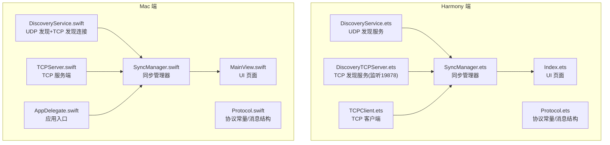
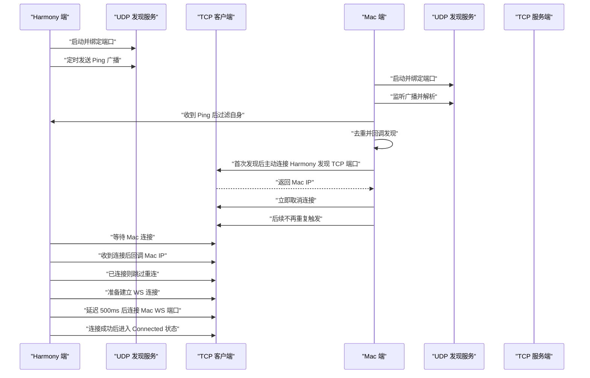
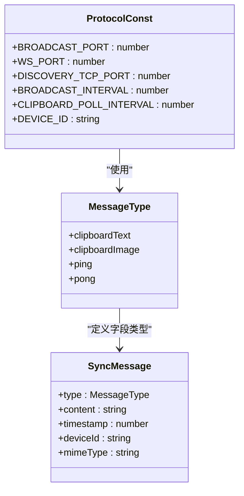
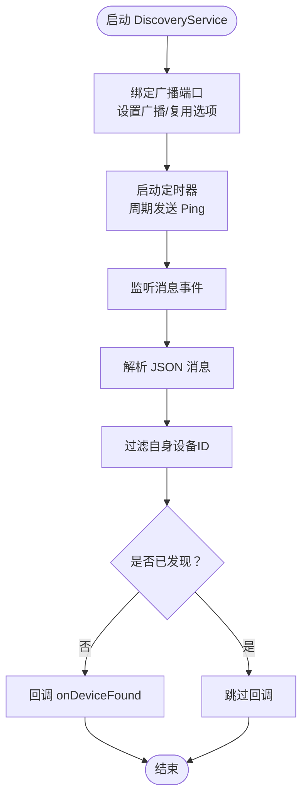
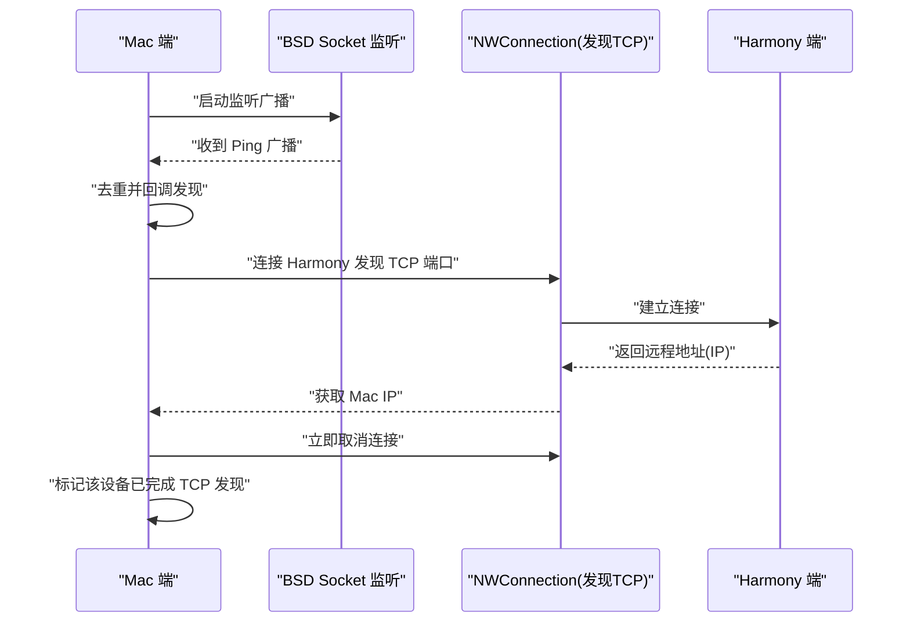
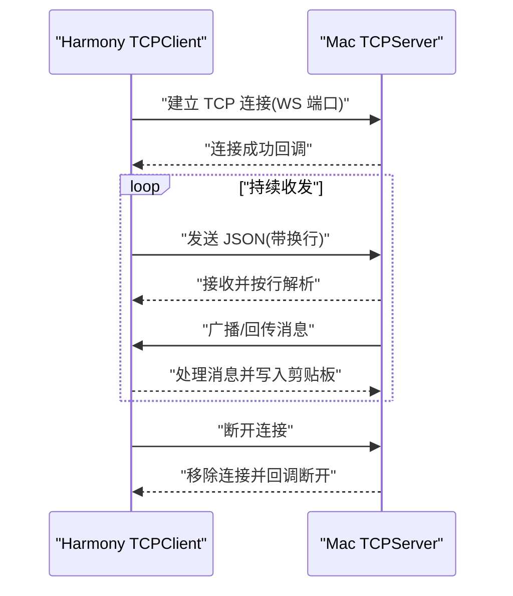
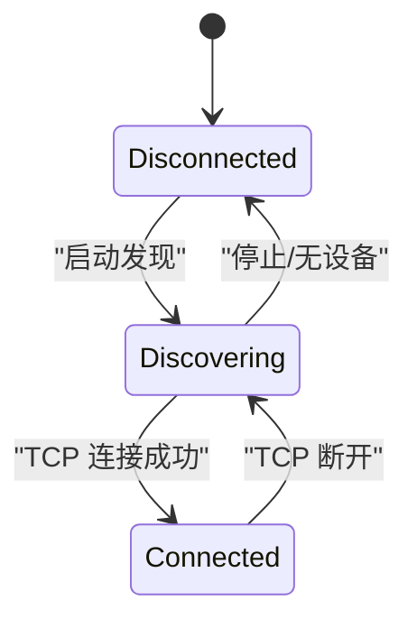
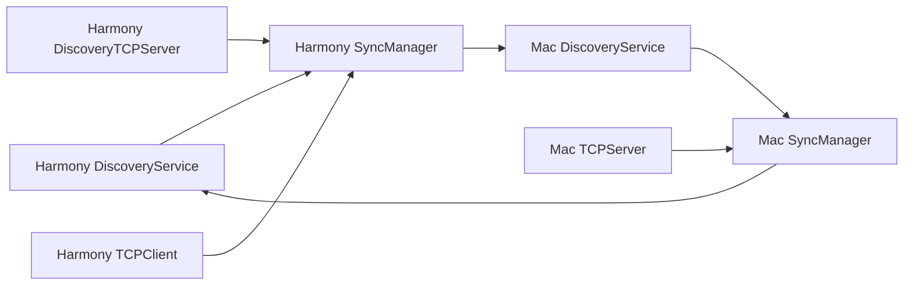

# 自动设备发现

<cite>
**本文档引用的文件**
- [DiscoveryService.ets](file://ClipboardSync/harmony/entry/src/main/ets/common/DiscoveryService.ets)
- [DiscoveryService.swift](file://ClipboardSync/mac/ClipboardSync/DiscoveryService.swift)
- [Protocol.ets](file://ClipboardSync/harmony/entry/src/main/ets/common/Protocol.ets)
- [Protocol.swift](file://ClipboardSync/mac/ClipboardSync/Protocol.swift)
- [TCPClient.ets](file://ClipboardSync/harmony/entry/src/main/ets/common/TCPClient.ets)
- [TCPServer.swift](file://ClipboardSync/mac/ClipboardSync/TCPServer.swift)
- [SyncManager.ets](file://ClipboardSync/harmony/entry/src/main/ets/model/SyncManager.ets)
- [SyncManager.swift](file://ClipboardSync/mac/ClipboardSync/SyncManager.swift)
- [DiscoveryTCPServer.ets](file://ClipboardSync/harmony/entry/src/main/ets/common/DiscoveryTCPServer.ets)
- [Index.ets](file://ClipboardSync/harmony/entry/src/main/ets/pages/Index.ets)
- [MainView.swift](file://ClipboardSync/mac/ClipboardSync/MainView.swift)
- [AppDelegate.swift](file://ClipboardSync/mac/ClipboardSync/AppDelegate.swift)
</cite>

## 目录
1. [简介](#简介)
2. [项目结构](#项目结构)
3. [核心组件](#核心组件)
4. [架构总览](#架构总览)
5. [详细组件分析](#详细组件分析)
6. [依赖关系分析](#依赖关系分析)
7. [性能考量](#性能考量)
8. [故障排查指南](#故障排查指南)
9. [结论](#结论)
10. [附录](#附录)

## 简介
本项目实现了跨平台的自动设备发现与剪贴板同步功能，支持在局域网内自动发现 Mac 端与 Harmony 端设备，并建立稳定的双向同步通道。自动发现采用 UDP 广播机制，结合 TCP 发现服务解决特定网络环境下广播不可达的问题。本文档详细说明广播包格式、发现服务实现、设备信息解析，以及 Mac 端与 Harmony 端的发现服务工作原理，包括定时广播、设备响应、连接建立流程，并提供代码示例路径以便定位具体实现细节。

## 项目结构
项目采用按平台分层的组织方式：
- Harmony 端：ArkTS 实现，包含发现服务、TCP 客户端、协议定义与 UI 页面。
- Mac 端：Swift 实现，包含发现服务、TCP 服务端、协议定义与状态栏 UI。

图表来源
- [DiscoveryService.ets:10-161](file://ClipboardSync/harmony/entry/src/main/ets/common/DiscoveryService.ets#L10-L161)
- [DiscoveryTCPServer.ets:11-80](file://ClipboardSync/harmony/entry/src/main/ets/common/DiscoveryTCPServer.ets#L11-L80)
- [TCPClient.ets:11-181](file://ClipboardSync/harmony/entry/src/main/ets/common/TCPClient.ets#L11-L181)
- [SyncManager.ets:26-301](file://ClipboardSync/harmony/entry/src/main/ets/model/SyncManager.ets#L26-L301)
- [DiscoveryService.swift:6-197](file://ClipboardSync/mac/ClipboardSync/DiscoveryService.swift#L6-L197)
- [TCPServer.swift:6-174](file://ClipboardSync/mac/ClipboardSync/TCPServer.swift#L6-L174)
- [SyncManager.swift:5-154](file://ClipboardSync/mac/ClipboardSync/SyncManager.swift#L5-L154)
- [Protocol.ets:2-27](file://ClipboardSync/harmony/entry/src/main/ets/common/Protocol.ets#L2-L27)
- [Protocol.swift:4-43](file://ClipboardSync/mac/ClipboardSync/Protocol.swift#L4-L43)
- [Index.ets:1-226](file://ClipboardSync/harmony/entry/src/main/ets/pages/Index.ets#L1-L226)
- [MainView.swift:1-209](file://ClipboardSync/mac/ClipboardSync/MainView.swift#L1-L209)
- [AppDelegate.swift:4-46](file://ClipboardSync/mac/ClipboardSync/AppDelegate.swift#L4-L46)

章节来源
- [DiscoveryService.ets:10-161](file://ClipboardSync/harmony/entry/src/main/ets/common/DiscoveryService.ets#L10-L161)
- [DiscoveryService.swift:6-197](file://ClipboardSync/mac/ClipboardSync/DiscoveryService.swift#L6-L197)
- [Protocol.ets:2-27](file://ClipboardSync/harmony/entry/src/main/ets/common/Protocol.ets#L2-L27)
- [Protocol.swift:4-43](file://ClipboardSync/mac/ClipboardSync/Protocol.swift#L4-L43)
- [Index.ets:1-226](file://ClipboardSync/harmony/entry/src/main/ets/pages/Index.ets#L1-L226)
- [MainView.swift:1-209](file://ClipboardSync/mac/ClipboardSync/MainView.swift#L1-L209)
- [AppDelegate.swift:4-46](file://ClipboardSync/mac/ClipboardSync/AppDelegate.swift#L4-L46)

## 核心组件
- 协议常量与消息结构：统一定义广播端口、WS 端口、发现 TCP 端口、广播间隔、设备 ID 等；消息体包含类型、内容、时间戳、设备 ID、可选 MIME 类型。
- Harmony 端发现服务：基于 ArkTS NetworkKit 的 UDP Socket，定时广播 Ping 消息，监听广播并回调发现结果。
- Mac 端发现服务：基于 BSD Socket 的 UDP 监听与广播，同时在收到广播后主动连接 Harmony 端的发现 TCP 端口以获取其 IP。
- TCP 客户端（Harmony）：基于 ArkTS NetworkKit 的 TCP Socket，按行帧化 JSON 消息，支持断线重连。
- TCP 服务端（Mac）：基于 Network.framework 的 NWListener/NWConnection，按行帧化 JSON 消息，维护连接池与缓冲区。
- 同步管理器：协调发现、连接与剪贴板轮询，处理去重与状态切换。

章节来源
- [Protocol.ets:2-27](file://ClipboardSync/harmony/entry/src/main/ets/common/Protocol.ets#L2-L27)
- [Protocol.swift:4-43](file://ClipboardSync/mac/ClipboardSync/Protocol.swift#L4-L43)
- [DiscoveryService.ets:10-161](file://ClipboardSync/harmony/entry/src/main/ets/common/DiscoveryService.ets#L10-L161)
- [DiscoveryService.swift:6-197](file://ClipboardSync/mac/ClipboardSync/DiscoveryService.swift#L6-L197)
- [TCPClient.ets:11-181](file://ClipboardSync/harmony/entry/src/main/ets/common/TCPClient.ets#L11-L181)
- [TCPServer.swift:6-174](file://ClipboardSync/mac/ClipboardSync/TCPServer.swift#L6-L174)
- [SyncManager.ets:26-301](file://ClipboardSync/harmony/entry/src/main/ets/model/SyncManager.ets#L26-L301)
- [SyncManager.swift:5-154](file://ClipboardSync/mac/ClipboardSync/SyncManager.swift#L5-L154)

## 架构总览
系统通过“UDP 广播 + TCP 发现”的双通道实现自动发现：
- UDP 广播：双方均定时发送 Ping 消息，接收方解析消息并进行去重，回调发现结果。
- TCP 发现：当广播不可达时，Mac 主动连接 Harmony 的发现 TCP 端口，Harmony 从连接中提取 Mac 的 IP 并回调给上层。
- 连接建立：发现完成后，Harmony 通过 TCP 客户端连接 Mac 的 WS 端口，开始双向同步。

图表来源
- [DiscoveryService.ets:25-95](file://ClipboardSync/harmony/entry/src/main/ets/common/DiscoveryService.ets#L25-L95)
- [DiscoveryService.swift:15-112](file://ClipboardSync/mac/ClipboardSync/DiscoveryService.swift#L15-L112)
- [DiscoveryTCPServer.ets:18-49](file://ClipboardSync/harmony/entry/src/main/ets/common/DiscoveryTCPServer.ets#L18-L49)
- [TCPClient.ets:30-113](file://ClipboardSync/harmony/entry/src/main/ets/common/TCPClient.ets#L30-L113)
- [TCPServer.swift:23-51](file://ClipboardSync/mac/ClipboardSync/TCPServer.swift#L23-L51)
- [SyncManager.ets:72-98](file://ClipboardSync/harmony/entry/src/main/ets/model/SyncManager.ets#L72-L98)
- [SyncManager.swift:40-53](file://ClipboardSync/mac/ClipboardSync/SyncManager.swift#L40-L53)

## 详细组件分析

### 协议与消息格式
- 端口配置：广播端口、WS 数据端口、发现 TCP 端口分别独立，避免冲突。
- 广播间隔：双方一致的定时周期，确保发现的及时性与稳定性。
- 设备 ID：随机生成的唯一标识，用于去重与识别。
- 消息结构：包含类型、内容、时间戳、设备 ID、可选 MIME 类型，便于扩展与去重。

图表来源
- [Protocol.ets:2-27](file://ClipboardSync/harmony/entry/src/main/ets/common/Protocol.ets#L2-L27)
- [Protocol.swift:4-43](file://ClipboardSync/mac/ClipboardSync/Protocol.swift#L4-L43)

章节来源
- [Protocol.ets:2-27](file://ClipboardSync/harmony/entry/src/main/ets/common/Protocol.ets#L2-L27)
- [Protocol.swift:4-43](file://ClipboardSync/mac/ClipboardSync/Protocol.swift#L4-L43)

### Harmony 端 UDP 发现服务
- 绑定与选项：绑定广播端口，启用广播与地址复用，监听错误与消息事件。
- 定时广播：立即发送一次，随后按固定间隔重复发送 Ping 消息。
- 消息解析：接收消息后解码为 JSON，校验类型与设备 ID，进行去重并回调发现结果。

图表来源
- [DiscoveryService.ets:25-95](file://ClipboardSync/harmony/entry/src/main/ets/common/DiscoveryService.ets#L25-L95)
- [DiscoveryService.ets:126-161](file://ClipboardSync/harmony/entry/src/main/ets/common/DiscoveryService.ets#L126-L161)

章节来源
- [DiscoveryService.ets:10-161](file://ClipboardSync/harmony/entry/src/main/ets/common/DiscoveryService.ets#L10-L161)

### Mac 端 UDP 发现服务与 TCP 发现连接
- BSD Socket 监听：创建 UDP Socket，绑定广播端口，循环接收数据并解析消息。
- 去重与回调：对新设备回调发现结果；对已发现设备不再重复触发 TCP 发现。
- TCP 发现连接：首次发现后主动连接 Harmony 的发现 TCP 端口，获取其 IP 后立即取消连接，避免重复触发。

图表来源
- [DiscoveryService.swift:33-100](file://ClipboardSync/mac/ClipboardSync/DiscoveryService.swift#L33-L100)
- [DiscoveryService.swift:150-180](file://ClipboardSync/mac/ClipboardSync/DiscoveryService.swift#L150-L180)
- [DiscoveryTCPServer.ets:61-78](file://ClipboardSync/harmony/entry/src/main/ets/common/DiscoveryTCPServer.ets#L61-L78)

章节来源
- [DiscoveryService.swift:6-197](file://ClipboardSync/mac/ClipboardSync/DiscoveryService.swift#L6-L197)

### TCP 客户端（Harmony）与 TCP 服务端（Mac）
- 行帧化消息：以换行符分隔 JSON 消息，支持粘包与半包处理。
- 断线重连：连接断开或错误时延迟重连，避免频繁抖动。
- 连接池与缓冲：服务端维护连接列表与每连接缓冲区，按行解析消息。

图表来源
- [TCPClient.ets:30-113](file://ClipboardSync/harmony/entry/src/main/ets/common/TCPClient.ets#L30-L113)
- [TCPServer.swift:75-148](file://ClipboardSync/mac/ClipboardSync/TCPServer.swift#L75-L148)

章节来源
- [TCPClient.ets:11-181](file://ClipboardSync/harmony/entry/src/main/ets/common/TCPClient.ets#L11-L181)
- [TCPServer.swift:6-174](file://ClipboardSync/mac/ClipboardSync/TCPServer.swift#L6-L174)

### 同步管理器（协调与状态）
- Harmony 端：启动 UDP 发现、启动发现 TCP 服务、启动剪贴板轮询；根据发现回调与连接状态切换。
- Mac 端：启动 TCP 服务端、启动发现服务、启动剪贴板监控；根据连接状态更新 UI。

图表来源
- [SyncManager.ets:72-98](file://ClipboardSync/harmony/entry/src/main/ets/model/SyncManager.ets#L72-L98)
- [SyncManager.swift:40-53](file://ClipboardSync/mac/ClipboardSync/SyncManager.swift#L40-L53)

章节来源
- [SyncManager.ets:26-301](file://ClipboardSync/harmony/entry/src/main/ets/model/SyncManager.ets#L26-L301)
- [SyncManager.swift:5-154](file://ClipboardSync/mac/ClipboardSync/SyncManager.swift#L5-L154)

## 依赖关系分析
- 端口依赖：Harmony 与 Mac 的广播端口需一致；WS 端口与发现 TCP 端口各自独立。
- 事件耦合：发现服务回调驱动 TCP 客户端连接；TCP 服务端回调驱动 UI 状态更新。
- 去重策略：双方均对设备 ID 去重，避免重复连接与回调。

图表来源
- [DiscoveryService.ets:17-17](file://ClipboardSync/harmony/entry/src/main/ets/common/DiscoveryService.ets#L17-L17)
- [DiscoveryTCPServer.ets:16-16](file://ClipboardSync/harmony/entry/src/main/ets/common/DiscoveryTCPServer.ets#L16-L16)
- [TCPClient.ets:21-24](file://ClipboardSync/harmony/entry/src/main/ets/common/TCPClient.ets#L21-L24)
- [DiscoveryService.swift:13-13](file://ClipboardSync/mac/ClipboardSync/DiscoveryService.swift#L13-L13)
- [TCPServer.swift:15-17](file://ClipboardSync/mac/ClipboardSync/TCPServer.swift#L15-L17)
- [SyncManager.ets:77-93](file://ClipboardSync/harmony/entry/src/main/ets/model/SyncManager.ets#L77-L93)
- [SyncManager.swift:57-82](file://ClipboardSync/mac/ClipboardSync/SyncManager.swift#L57-L82)

章节来源
- [SyncManager.ets:72-98](file://ClipboardSync/harmony/entry/src/main/ets/model/SyncManager.ets#L72-L98)
- [SyncManager.swift:40-53](file://ClipboardSync/mac/ClipboardSync/SyncManager.swift#L40-L53)

## 性能考量
- 广播频率：广播间隔过短会增加网络负载，过长会影响发现速度。当前配置在稳定性和资源消耗间取得平衡。
- 去重与缓存：双方均进行设备 ID 去重，减少重复连接与回调。
- TCP 行帧化：按行解析避免粘包问题，提升吞吐稳定性。
- 断线重连：延迟重连避免风暴重试，提高连接成功率。

## 故障排查指南
- 广播不可达
  - 检查防火墙与路由器策略，确保广播端口开放。
  - 验证双方广播端口一致且未被占用。
  - 查看日志中“UDP bind success”“Broadcast sent”等关键节点。
- TCP 发现失败
  - 确认 Harmony 的发现 TCP 端口已正确监听。
  - 检查 Mac 是否成功连接并获取到 IP。
  - 观察“TCP discovery connected”“TCP discovery failed”等日志。
- 连接不稳定
  - 检查断线重连逻辑与延迟参数。
  - 确认行帧化消息格式与换行符处理。
- UI 状态异常
  - 确认状态回调链路完整，避免遗漏 onStateChange 绑定。
  - 检查断开后是否正确重置发现去重列表。

章节来源
- [DiscoveryService.ets:36-38](file://ClipboardSync/harmony/entry/src/main/ets/common/DiscoveryService.ets#L36-L38)
- [DiscoveryService.swift:52-56](file://ClipboardSync/mac/ClipboardSync/DiscoveryService.swift#L52-L56)
- [TCPClient.ets:83-90](file://ClipboardSync/harmony/entry/src/main/ets/common/TCPClient.ets#L83-L90)
- [TCPServer.swift:35-44](file://ClipboardSync/mac/ClipboardSync/TCPServer.swift#L35-L44)

## 结论
本项目通过“UDP 广播 + TCP 发现”的组合方案，在不同网络环境下实现了可靠的设备发现与连接建立。协议常量统一、消息结构清晰、去重与断线重连策略完善，使得系统具备良好的稳定性与可维护性。建议在生产环境中进一步优化广播策略与错误恢复机制，以应对更复杂的网络场景。

## 附录
- 代码示例路径（用于定位实现细节）
  - Harmony UDP 发现服务启动与广播：[DiscoveryService.ets:25-95](file://ClipboardSync/harmony/entry/src/main/ets/common/DiscoveryService.ets#L25-L95)
  - Mac UDP 监听与广播发送：[DiscoveryService.swift:33-112](file://ClipboardSync/mac/ClipboardSync/DiscoveryService.swift#L33-L112)
  - Harmony 发现 TCP 服务监听与回调：[DiscoveryTCPServer.ets:18-49](file://ClipboardSync/harmony/entry/src/main/ets/common/DiscoveryTCPServer.ets#L18-L49)
  - Mac TCP 服务端监听与消息处理：[TCPServer.swift:23-148](file://ClipboardSync/mac/ClipboardSync/TCPServer.swift#L23-L148)
  - Harmony TCP 客户端连接与断线重连：[TCPClient.ets:30-113](file://ClipboardSync/harmony/entry/src/main/ets/common/TCPClient.ets#L30-L113)
  - 协议常量与消息结构：[Protocol.ets:2-27](file://ClipboardSync/harmony/entry/src/main/ets/common/Protocol.ets#L2-L27)、[Protocol.swift:4-43](file://ClipboardSync/mac/ClipboardSync/Protocol.swift#L4-L43)
  - Harmony 同步管理器状态切换与连接建立：[SyncManager.ets:72-174](file://ClipboardSync/harmony/entry/src/main/ets/model/SyncManager.ets#L72-L174)
  - Mac 同步管理器状态切换与 UI 更新：[SyncManager.swift:40-93](file://ClipboardSync/mac/ClipboardSync/SyncManager.swift#L40-L93)
  - Harmony UI 页面与状态绑定：[Index.ets:13-27](file://ClipboardSync/harmony/entry/src/main/ets/pages/Index.ets#L13-L27)
  - Mac UI 页面与状态绑定：[MainView.swift:6-21](file://ClipboardSync/mac/ClipboardSync/MainView.swift#L6-L21)
  - Mac 应用入口启动同步管理器：[AppDelegate.swift:9-10](file://ClipboardSync/mac/ClipboardSync/AppDelegate.swift#L9-L10)