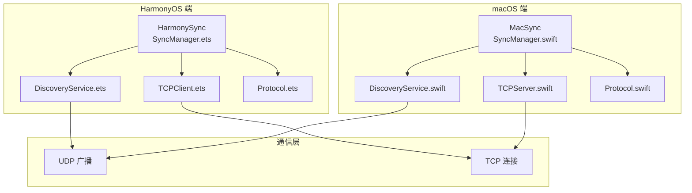
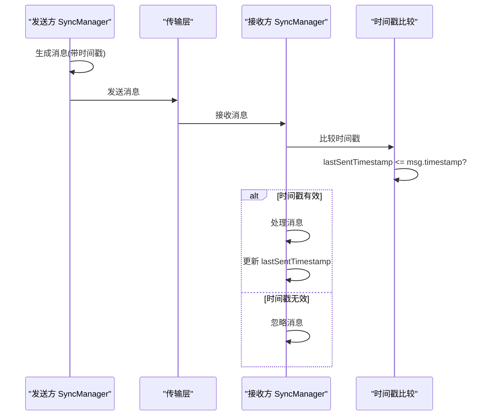
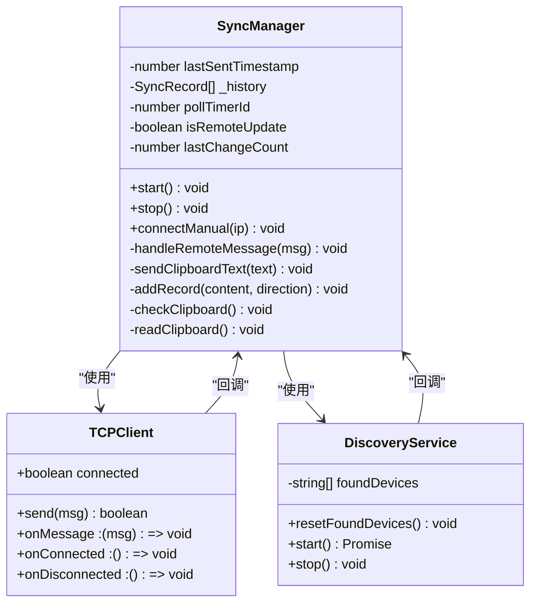
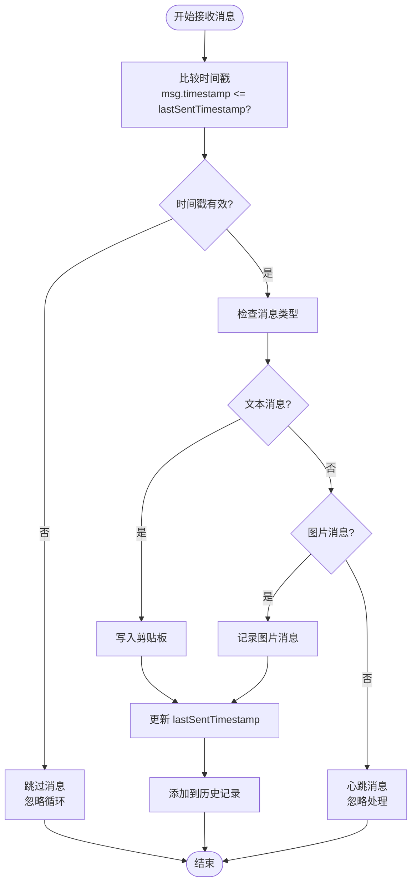
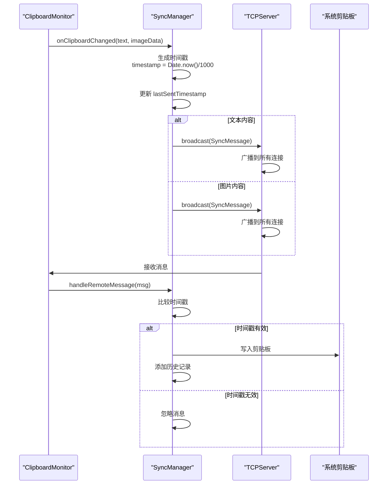
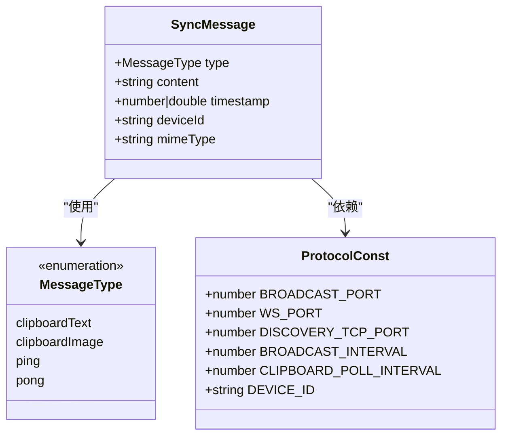
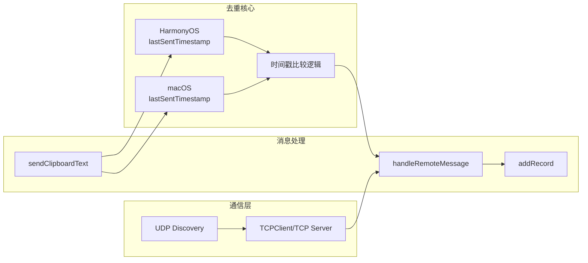

# 去重防环机制

<cite>
**本文档引用的文件**
- [SyncManager.ets](file://ClipboardSync/harmony/entry/src/main/ets/model/SyncManager.ets)
- [SyncManager.swift](file://ClipboardSync/mac/ClipboardSync/SyncManager.swift)
- [Protocol.ets](file://ClipboardSync/harmony/entry/src/main/ets/common/Protocol.ets)
- [Protocol.swift](file://ClipboardSync/mac/ClipboardSync/Protocol.swift)
- [TCPClient.ets](file://ClipboardSync/harmony/entry/src/main/ets/common/TCPClient.ets)
- [TCPServer.swift](file://ClipboardSync/mac/ClipboardSync/TCPServer.swift)
- [DiscoveryService.ets](file://ClipboardSync/harmony/entry/src/main/ets/common/DiscoveryService.ets)
- [DiscoveryService.swift](file://ClipboardSync/mac/ClipboardSync/DiscoveryService.swift)
- [DiscoveryTCPServer.ets](file://ClipboardSync/harmony/entry/src/main/ets/common/DiscoveryTCPServer.ets)
- [ClipboardMonitor.swift](file://ClipboardSync/mac/ClipboardSync/ClipboardMonitor.swift)
</cite>

## 目录
1. [简介](#简介)
2. [项目结构](#项目结构)
3. [核心组件](#核心组件)
4. [架构概览](#架构概览)
5. [详细组件分析](#详细组件分析)
6. [依赖关系分析](#依赖关系分析)
7. [性能考虑](#性能考虑)
8. [故障排除指南](#故障排除指南)
9. [结论](#结论)

## 简介

本文档深入解析 ClipboardSync 项目中的去重防环机制，重点说明时间戳字段在防止消息循环中的关键作用，以及 SyncManager 中去重状态的维护策略。该机制通过时间戳比较和消息历史记录管理，有效避免了剪贴板消息在不同设备间的无限循环传播。

## 项目结构

ClipboardSync 项目采用跨平台架构设计，同时支持 HarmonyOS 和 macOS 系统：

**图表来源**
- [SyncManager.ets:26-301](file://ClipboardSync/harmony/entry/src/main/ets/model/SyncManager.ets#L26-L301)
- [SyncManager.swift:5-154](file://ClipboardSync/mac/ClipboardSync/SyncManager.swift#L5-L154)

**章节来源**
- [SyncManager.ets:1-301](file://ClipboardSync/harmony/entry/src/main/ets/model/SyncManager.ets#L1-L301)
- [SyncManager.swift:1-154](file://ClipboardSync/mac/ClipboardSync/SyncManager.swift#L1-L154)

## 核心组件

### 时间戳去重机制

去重防环的核心在于时间戳字段的精确管理和比较逻辑：

#### HarmonyOS 端实现
- `lastSentTimestamp`: 类型为 `number`，记录最后一次发送消息的时间戳
- 时间戳精度：毫秒级转换为秒级，确保跨平台一致性
- 比较逻辑：接收消息时与 `lastSentTimestamp` 进行严格大于比较

#### macOS 端实现
- `lastSentTimestamp`: 类型为 `Double`，直接使用 `Date().timeIntervalSince1970`
- 时间戳精度：秒级浮点数，包含小数部分提高精度
- 比较逻辑：完全相同的比较逻辑，但数值类型不同

**章节来源**
- [SyncManager.ets:35-35](file://ClipboardSync/harmony/entry/src/main/ets/model/SyncManager.ets#L35-L35)
- [SyncManager.swift:16-16](file://ClipboardSync/mac/ClipboardSync/SyncManager.swift#L16-L16)

### 消息历史记录管理

两个平台都实现了消息历史记录功能，用于监控同步状态和调试：

#### 存储结构
- **HarmonyOS**: `SyncRecord[]` 数组，最多保存 50 条记录
- **macOS**: `SyncRecord[]` 数组，最多保存 50 条记录
- **字段内容**: 包含消息 ID、内容摘要、时间戳和方向信息

#### 清理机制
- 自动截断：超过 50 条记录时自动删除最旧的记录
- FIFO 原则：保持最新记录在数组前端
- 内存优化：限制历史记录数量防止内存泄漏

**章节来源**
- [SyncManager.ets:48-51](file://ClipboardSync/harmony/entry/src/main/ets/model/SyncManager.ets#L48-L51)
- [SyncManager.swift:9-9](file://ClipboardSync/mac/ClipboardSync/SyncManager.swift#L9-L9)

## 架构概览

去重防环机制在整个系统中的位置和交互关系：

**图表来源**
- [SyncManager.ets:178-181](file://ClipboardSync/harmony/entry/src/main/ets/model/SyncManager.ets#L178-L181)
- [SyncManager.swift:95-97](file://ClipboardSync/mac/ClipboardSync/SyncManager.swift#L95-L97)

## 详细组件分析

### HarmonyOS 端去重实现

#### 时间戳管理类图

**图表来源**
- [SyncManager.ets:26-301](file://ClipboardSync/harmony/entry/src/main/ets/model/SyncManager.ets#L26-L301)
- [TCPClient.ets:11-181](file://ClipboardSync/harmony/entry/src/main/ets/common/TCPClient.ets#L11-L181)
- [DiscoveryService.ets:10-161](file://ClipboardSync/harmony/entry/src/main/ets/common/DiscoveryService.ets#L10-L161)

#### 去重算法实现流程

**图表来源**
- [SyncManager.ets:178-198](file://ClipboardSync/harmony/entry/src/main/ets/model/SyncManager.ets#L178-L198)

**章节来源**
- [SyncManager.ets:178-269](file://ClipboardSync/harmony/entry/src/main/ets/model/SyncManager.ets#L178-L269)

### macOS 端去重实现

#### 时间戳去重序列图

**图表来源**
- [SyncManager.swift:117-142](file://ClipboardSync/mac/ClipboardSync/SyncManager.swift#L117-L142)
- [ClipboardMonitor.swift:50-71](file://ClipboardSync/mac/ClipboardSync/ClipboardMonitor.swift#L50-L71)

**章节来源**
- [SyncManager.swift:95-142](file://ClipboardSync/mac/ClipboardSync/SyncManager.swift#L95-L142)

### 通信协议中的时间戳设计

#### 消息结构定义

**图表来源**
- [Protocol.ets:20-26](file://ClipboardSync/harmony/entry/src/main/ets/common/Protocol.ets#L20-L26)
- [Protocol.swift:28-34](file://ClipboardSync/mac/ClipboardSync/Protocol.swift#L28-L34)

**章节来源**
- [Protocol.ets:1-27](file://ClipboardSync/harmony/entry/src/main/ets/common/Protocol.ets#L1-L27)
- [Protocol.swift:1-43](file://ClipboardSync/mac/ClipboardSync/Protocol.swift#L1-L43)

## 依赖关系分析

### 去重机制的关键依赖链

**图表来源**
- [SyncManager.ets:178-269](file://ClipboardSync/harmony/entry/src/main/ets/model/SyncManager.ets#L178-L269)
- [SyncManager.swift:95-142](file://ClipboardSync/mac/ClipboardSync/SyncManager.swift#L95-L142)

### 异常情况处理机制

#### 断线重连与去重状态维护
- **断线恢复**: TCP 连接断开后重置发现去重状态，允许重新发现同一设备
- **连接状态**: 通过状态机管理连接状态，避免重复连接
- **资源清理**: 及时清理旧连接和缓冲区，防止内存泄漏

#### 时间戳溢出防护
- **精度控制**: 两秒内重复消息会被正确识别为循环
- **类型兼容**: HarmonyOS 使用整数时间戳，macOS 使用浮点数时间戳
- **比较策略**: 严格的大于比较确保不会误判

**章节来源**
- [SyncManager.ets:154-157](file://ClipboardSync/harmony/entry/src/main/ets/model/SyncManager.ets#L154-L157)
- [TCPClient.ets:148-157](file://ClipboardSync/harmony/entry/src/main/ets/common/TCPClient.ets#L148-L157)

## 性能考虑

### 时间戳精度与性能影响

1. **精度选择**
   - HarmonyOS: 秒级精度，满足大多数场景需求
   - macOS: 浮点数精度，提供更高分辨率的时间测量

2. **内存使用优化**
   - 历史记录限制：最多 50 条记录
   - 自动清理：超出限制时自动删除最旧记录
   - 结构体设计：最小化内存占用

3. **CPU 使用效率**
   - 时间戳比较为 O(1) 操作
   - 避免不必要的消息处理
   - 及时返回减少计算开销

### 网络传输优化

- **消息格式**: JSON 序列化，轻量级传输
- **连接复用**: TCP 连接复用，减少握手开销
- **批量处理**: 剪贴板轮询减少频繁网络操作

## 故障排除指南

### 常见去重问题及解决方案

#### 问题1: 消息循环持续发生
**症状**: 消息在设备间无限循环传播
**原因分析**:
- 时间戳比较逻辑错误
- `lastSentTimestamp` 未正确更新
- 网络延迟导致时间戳比较异常

**解决步骤**:
1. 检查时间戳生成逻辑
2. 验证 `lastSentTimestamp` 更新时机
3. 调整时间戳比较阈值

#### 问题2: 正常消息被误判为重复
**症状**: 正常的剪贴板同步被忽略
**原因分析**:
- 时间戳精度不足
- 系统时间不同步
- 消息发送过于频繁

**解决步骤**:
1. 检查系统时间同步
2. 调整剪贴板轮询间隔
3. 优化时间戳生成策略

#### 问题3: 历史记录过多导致内存问题
**症状**: 应用内存使用持续增长
**原因分析**:
- 历史记录清理机制失效
- 记录数量超过限制
- 内存泄漏问题

**解决步骤**:
1. 检查历史记录截断逻辑
2. 监控内存使用情况
3. 实施内存回收机制

### 调试技巧

#### 日志分析方法
1. **时间戳跟踪**: 记录每次消息的时间戳变化
2. **状态监控**: 监控连接状态和去重标志
3. **性能指标**: 记录处理延迟和吞吐量

#### 代码调试建议
- 在关键节点添加断点
- 检查时间戳的生成和比较过程
- 验证历史记录的添加和清理逻辑

**章节来源**
- [SyncManager.ets:230-233](file://ClipboardSync/harmony/entry/src/main/ets/model/SyncManager.ets#L230-L233)
- [SyncManager.swift:112-115](file://ClipboardSync/mac/ClipboardSync/SyncManager.swift#L112-L115)

## 结论

去重防环机制通过精心设计的时间戳比较和状态管理，在保证剪贴板同步功能的同时，有效防止了消息循环传播。该机制具有以下特点：

1. **可靠性**: 基于时间戳的严格比较逻辑确保不会出现循环
2. **可维护性**: 清晰的状态管理和历史记录便于调试和监控
3. **性能**: 低开销的时间戳比较和优化的历史记录管理
4. **跨平台**: 统一的去重策略在不同平台上保持一致行为

通过深入理解这些机制，开发者可以更好地维护和扩展剪贴板同步功能，同时为类似的消息去重场景提供参考实现。