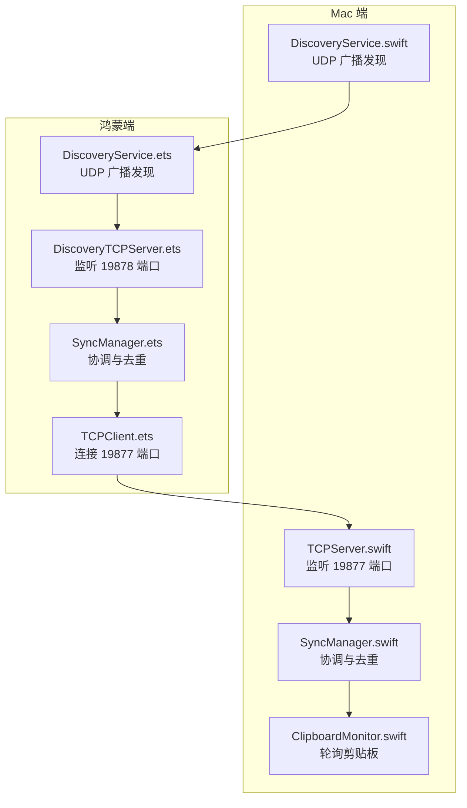
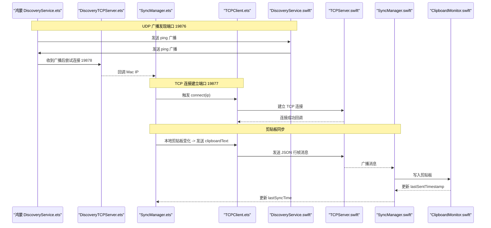
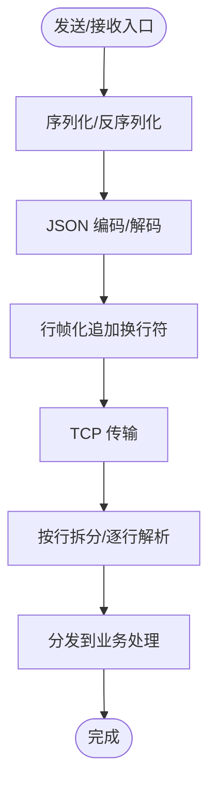
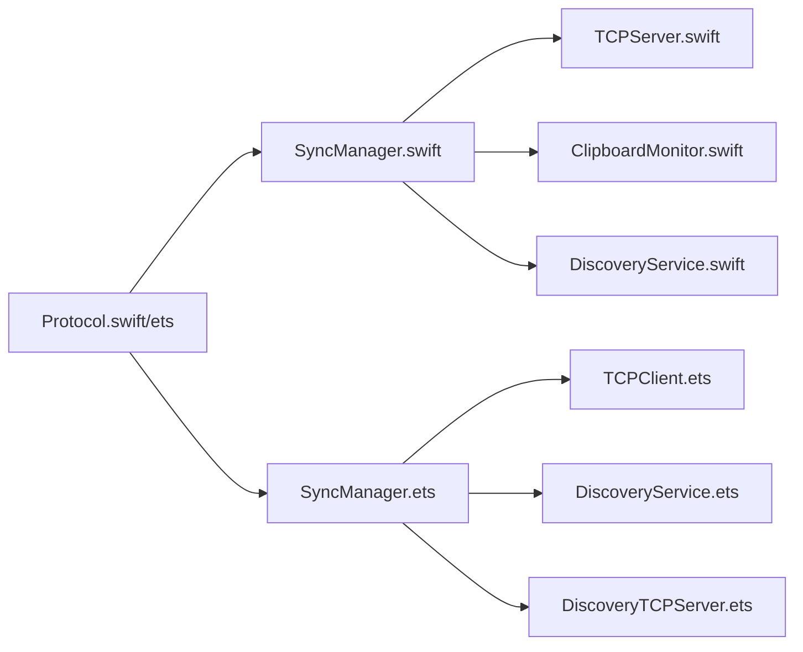

# 数据传输协议

<cite>
**本文引用的文件**
- [Protocol.swift](file://ClipboardSync/mac/ClipboardSync/Protocol.swift)
- [Protocol.ets](file://ClipboardSync/harmony/entry/src/main/ets/common/Protocol.ets)
- [TCPClient.ets](file://ClipboardSync/harmony/entry/src/main/ets/common/TCPClient.ets)
- [TCPServer.swift](file://ClipboardSync/mac/ClipboardSync/TCPServer.swift)
- [SyncManager.swift](file://ClipboardSync/mac/ClipboardSync/SyncManager.swift)
- [SyncManager.ets](file://ClipboardSync/harmony/entry/src/main/ets/model/SyncManager.ets)
- [ClipboardMonitor.swift](file://ClipboardSync/mac/ClipboardSync/ClipboardMonitor.swift)
- [DiscoveryService.swift](file://ClipboardSync/mac/ClipboardSync/DiscoveryService.swift)
- [DiscoveryService.ets](file://ClipboardSync/harmony/entry/src/main/ets/common/DiscoveryService.ets)
- [DiscoveryTCPServer.ets](file://ClipboardSync/harmony/entry/src/main/ets/common/DiscoveryTCPServer.ets)
- [PROJECT.md](file://ClipboardSync/PROJECT.md)
</cite>

## 目录
1. [简介](#简介)
2. [项目结构](#项目结构)
3. [核心组件](#核心组件)
4. [架构总览](#架构总览)
5. [详细组件分析](#详细组件分析)
6. [依赖关系分析](#依赖关系分析)
7. [性能考量](#性能考量)
8. [故障排查指南](#故障排查指南)
9. [结论](#结论)
10. [附录](#附录)

## 简介
本文件系统性阐述数据传输协议的设计与实现，重点覆盖：
- TCP 数据传输端口 19877 的使用与连接建立流程
- SyncMessage 消息结构及其字段语义
- MessageType 枚举中 clipboardText、clipboardImage、ping、pong 的使用场景
- JSON 序列化与反序列化（data/fromData）的实现细节
- 剪贴板轮询间隔 0.5 秒的设定原因与性能权衡
- 完整的消息格式示例与错误处理机制

## 项目结构
项目采用“双端分离”的架构设计：
- Mac 端（Swift + SwiftUI）：作为 TCP 服务端，负责监听 19877 端口，维护连接池，广播消息，监听剪贴板变化并进行同步。
- 鸿蒙端（ArkTS + ArkUI）：作为 TCP 客户端，主动连接 Mac 端，周期性轮询系统剪贴板，将变更通过 19877 端口发送给 Mac 端。

图表来源
- [TCPServer.swift:1-174](file://ClipboardSync/mac/ClipboardSync/TCPServer.swift#L1-L174)
- [SyncManager.swift:1-154](file://ClipboardSync/mac/ClipboardSync/SyncManager.swift#L1-L154)
- [ClipboardMonitor.swift:1-73](file://ClipboardSync/mac/ClipboardSync/ClipboardMonitor.swift#L1-L73)
- [DiscoveryService.swift:1-197](file://ClipboardSync/mac/ClipboardSync/DiscoveryService.swift#L1-L197)
- [SyncManager.ets:1-301](file://ClipboardSync/harmony/entry/src/main/ets/model/SyncManager.ets#L1-L301)
- [TCPClient.ets:1-181](file://ClipboardSync/harmony/entry/src/main/ets/common/TCPClient.ets#L1-L181)
- [DiscoveryService.ets:1-161](file://ClipboardSync/harmony/entry/src/main/ets/common/DiscoveryService.ets#L1-L161)
- [DiscoveryTCPServer.ets:1-80](file://ClipboardSync/harmony/entry/src/main/ets/common/DiscoveryTCPServer.ets#L1-L80)

章节来源
- [PROJECT.md:52-63](file://ClipboardSync/PROJECT.md#L52-L63)

## 核心组件
- 协议常量与消息结构
  - Mac 端与鸿蒙端共享协议定义，确保两端消息格式一致。
  - 协议常量包括端口、轮询间隔、设备 ID 等。
  - 消息结构包含 type、content、timestamp、deviceId、mimeType 等字段。

- TCP 传输层
  - Mac 端：TCPServer 作为服务端监听 19877 端口，按行帧化（以换行符分隔）发送/接收 JSON 消息。
  - 鸿蒙端：TCPClient 作为客户端主动连接 Mac 端，同样使用行帧化 JSON。

- 剪贴板轮询与去重
  - Mac 端 ClipboardMonitor 以 0.5 秒为间隔轮询 NSPasteboard，检测变化后通过 TCPServer 广播消息。
  - SyncManager 维护 lastSentTimestamp，接收端仅处理时间戳更大的消息，避免回环。

- 设备发现
  - UDP 广播端口 19876，双方定时发送 ping 广播包，探测彼此存在。
  - 鸿蒙端通过 DiscoveryTCPServer 监听 19878 端口，从连接中提取 Mac 的 IP 地址，随后主动连接 19877。

章节来源
- [Protocol.swift:1-43](file://ClipboardSync/mac/ClipboardSync/Protocol.swift#L1-L43)
- [Protocol.ets:1-27](file://ClipboardSync/harmony/entry/src/main/ets/common/Protocol.ets#L1-L27)
- [TCPServer.swift:1-174](file://ClipboardSync/mac/ClipboardSync/TCPServer.swift#L1-L174)
- [TCPClient.ets:1-181](file://ClipboardSync/harmony/entry/src/main/ets/common/TCPClient.ets#L1-L181)
- [SyncManager.swift:1-154](file://ClipboardSync/mac/ClipboardSync/SyncManager.swift#L1-L154)
- [SyncManager.ets:1-301](file://ClipboardSync/harmony/entry/src/main/ets/model/SyncManager.ets#L1-L301)
- [ClipboardMonitor.swift:1-73](file://ClipboardSync/mac/ClipboardSync/ClipboardMonitor.swift#L1-L73)
- [DiscoveryService.swift:1-197](file://ClipboardSync/mac/ClipboardSync/DiscoveryService.swift#L1-L197)
- [DiscoveryService.ets:1-161](file://ClipboardSync/harmony/entry/src/main/ets/common/DiscoveryService.ets#L1-L161)
- [DiscoveryTCPServer.ets:1-80](file://ClipboardSync/harmony/entry/src/main/ets/common/DiscoveryTCPServer.ets#L1-L80)

## 架构总览
下图展示了从设备发现到数据传输的完整流程，以及消息在两端之间的流转路径。

图表来源
- [DiscoveryService.ets:1-161](file://ClipboardSync/harmony/entry/src/main/ets/common/DiscoveryService.ets#L1-L161)
- [DiscoveryTCPServer.ets:1-80](file://ClipboardSync/harmony/entry/src/main/ets/common/DiscoveryTCPServer.ets#L1-L80)
- [SyncManager.ets:1-301](file://ClipboardSync/harmony/entry/src/main/ets/model/SyncManager.ets#L1-L301)
- [TCPClient.ets:1-181](file://ClipboardSync/harmony/entry/src/main/ets/common/TCPClient.ets#L1-L181)
- [DiscoveryService.swift:1-197](file://ClipboardSync/mac/ClipboardSync/DiscoveryService.swift#L1-L197)
- [TCPServer.swift:1-174](file://ClipboardSync/mac/ClipboardSync/TCPServer.swift#L1-L174)
- [SyncManager.swift:1-154](file://ClipboardSync/mac/ClipboardSync/SyncManager.swift#L1-L154)
- [ClipboardMonitor.swift:1-73](file://ClipboardSync/mac/ClipboardSync/ClipboardMonitor.swift#L1-L73)

## 详细组件分析

### TCP 数据传输端口与连接建立
- 端口分配
  - 数据传输：19877（TCP）
  - 设备发现：19876（UDP）
  - 鸿蒙端 TCP 发现：19878（TCP，仅用于获取 Mac IP）

- 连接角色
  - Mac 端：TCP 服务端，监听 19877 端口，维护连接池，广播消息。
  - 鸿蒙端：TCP 客户端，主动连接 Mac 端。

- 连接建立流程
  - 鸿蒙端 DiscoveryTCPServer 监听 19878 端口，Mac 端通过 UDP 广播触发发现，随后鸿蒙端获取 Mac IP 并连接 19877。
  - 鸿蒙端 TCPClient 建立连接后注册事件回调，开始收发消息。
  - Mac 端 TCPServer 接受连接，启动接收循环，按行帧化解析消息。

章节来源
- [PROJECT.md:54-60](file://ClipboardSync/PROJECT.md#L54-L60)
- [TCPClient.ets:30-113](file://ClipboardSync/harmony/entry/src/main/ets/common/TCPClient.ets#L30-L113)
- [TCPServer.swift:19-51](file://ClipboardSync/mac/ClipboardSync/TCPServer.swift#L19-L51)
- [DiscoveryTCPServer.ets:18-49](file://ClipboardSync/harmony/entry/src/main/ets/common/DiscoveryTCPServer.ets#L18-L49)

### SyncMessage 消息结构与字段语义
- 字段定义
  - type：消息类型，枚举值见下节。
  - content：消息内容，文本或图片的 Base64 字符串。
  - timestamp：Unix 时间戳（秒），用于去重与顺序判断。
  - deviceId：设备标识，用于区分消息来源。
  - mimeType：可选，表示内容 MIME 类型（如 text/plain、image/png）。

- 字段用途
  - 去重：接收端比较 timestamp 与 lastSentTimestamp，仅处理更大者，避免回环。
  - 内容识别：根据 type 选择写入剪贴板的处理逻辑（文本或图片）。
  - 设备溯源：deviceId 便于 UI 展示与日志追踪。

章节来源
- [Protocol.swift:28-42](file://ClipboardSync/mac/ClipboardSync/Protocol.swift#L28-L42)
- [Protocol.ets:20-26](file://ClipboardSync/harmony/entry/src/main/ets/common/Protocol.ets#L20-L26)
- [SyncManager.swift:95-115](file://ClipboardSync/mac/ClipboardSync/SyncManager.swift#L95-L115)
- [SyncManager.ets:178-198](file://ClipboardSync/harmony/entry/src/main/ets/model/SyncManager.ets#L178-L198)

### MessageType 枚举与使用场景
- clipboardText
  - 场景：文本剪贴板同步。
  - Mac 端：ClipboardMonitor 读取 NSPasteboard 文本，封装为 clipboardText 消息，广播给所有连接的客户端。
  - 鸿蒙端：收到后写入系统剪贴板，并更新 UI 历史记录。

- clipboardImage
  - 场景：图片剪贴板同步。
  - Mac 端：ClipboardMonitor 读取图片数据，转换为 PNG 后 Base64 编码，封装为 clipboardImage 消息。
  - 鸿蒙端：当前接收逻辑预留，尚未实现写入剪贴板。

- ping
  - 场景：设备发现阶段的心跳广播，表明设备在线。
  - 双端：定时发送 ping 广播，另一端收到后回调发现事件，触发 TCP 连接。

- pong
  - 场景：占位/保留，当前未使用。
  - 若未来需要心跳响应，可扩展为 pong。

章节来源
- [Protocol.swift:20-25](file://ClipboardSync/mac/ClipboardSync/Protocol.swift#L20-L25)
- [Protocol.ets:12-17](file://ClipboardSync/harmony/entry/src/main/ets/common/Protocol.ets#L12-L17)
- [SyncManager.swift:99-110](file://ClipboardSync/mac/ClipboardSync/SyncManager.swift#L99-L110)
- [SyncManager.ets:183-194](file://ClipboardSync/harmony/entry/src/main/ets/model/SyncManager.ets#L183-L194)
- [DiscoveryService.swift:114-146](file://ClipboardSync/mac/ClipboardSync/DiscoveryService.swift#L114-L146)
- [DiscoveryService.ets:97-124](file://ClipboardSync/harmony/entry/src/main/ets/common/DiscoveryService.ets#L97-L124)

### JSON 序列化与反序列化（data/fromData）
- Mac 端实现
  - data：使用 JSONEncoder 对 SyncMessage 进行编码，返回 Data。
  - fromData：使用 JSONDecoder 对 Data 进行解码，返回 SyncMessage 或 nil。
  - TCPServer 在发送前追加换行符，接收时按行拆分并逐条解码。

- 鸿蒙端实现
  - 发送：将 SyncMessage JSON 序列化为字符串并追加换行符，通过 socket 发送。
  - 接收：缓冲拼接网络字节流，按换行符拆分行，逐行 JSON 解析为 SyncMessage。

图表来源
- [Protocol.swift:35-42](file://ClipboardSync/mac/ClipboardSync/Protocol.swift#L35-L42)
- [TCPServer.swift:60-67](file://ClipboardSync/mac/ClipboardSync/TCPServer.swift#L60-L67)
- [TCPClient.ets:44-58](file://ClipboardSync/harmony/entry/src/main/ets/common/TCPClient.ets#L44-L58)
- [TCPClient.ets:115-146](file://ClipboardSync/harmony/entry/src/main/ets/common/TCPClient.ets#L115-L146)

章节来源
- [Protocol.swift:35-42](file://ClipboardSync/mac/ClipboardSync/Protocol.swift#L35-L42)
- [TCPServer.swift:60-67](file://ClipboardSync/mac/ClipboardSync/TCPServer.swift#L60-L67)
- [TCPClient.ets:44-58](file://ClipboardSync/harmony/entry/src/main/ets/common/TCPClient.ets#L44-L58)
- [TCPClient.ets:115-146](file://ClipboardSync/harmony/entry/src/main/ets/common/TCPClient.ets#L115-L146)

### 剪贴板轮询间隔与性能考虑
- 轮询间隔
  - Mac 端：0.5 秒（Swift）
  - 鸿蒙端：500 毫秒（ArkTS）
- 设计原因
  - 平衡实时性与资源消耗：过短会增加 CPU/IO 压力，过长会降低同步延迟。
  - 与去重机制配合：结合 timestamp 去重，避免频繁写入导致的持续回环。
- 性能影响
  - 轮询频率越高，CPU 占用越大；但同步延迟越低。
  - 建议在移动设备上根据电池与性能动态调整（当前实现固定 0.5 秒）。

章节来源
- [Protocol.swift:13-14](file://ClipboardSync/mac/ClipboardSync/Protocol.swift#L13-L14)
- [Protocol.ets:7-7](file://ClipboardSync/harmony/entry/src/main/ets/common/Protocol.ets#L7-L7)
- [ClipboardMonitor.swift:17-23](file://ClipboardSync/mac/ClipboardSync/ClipboardMonitor.swift#L17-L23)
- [SyncManager.ets:202-206](file://ClipboardSync/harmony/entry/src/main/ets/model/SyncManager.ets#L202-L206)

### 错误处理机制
- TCP 连接错误
  - 鸿蒙端：捕获连接与发送异常，记录错误码并触发自动重连（5 秒间隔）。
  - Mac 端：监听连接状态与接收错误，移除异常连接并继续服务其他客户端。
- UDP 发现错误
  - 双端：捕获广播与监听异常，记录错误并继续尝试。
- 去重与回环防护
  - 接收端仅处理 timestamp 更大的消息，避免写入剪贴板后再次触发回环。

章节来源
- [TCPClient.ets:83-112](file://ClipboardSync/harmony/entry/src/main/ets/common/TCPClient.ets#L83-L112)
- [TCPClient.ets:148-157](file://ClipboardSync/harmony/entry/src/main/ets/common/TCPClient.ets#L148-L157)
- [TCPServer.swift:108-127](file://ClipboardSync/mac/ClipboardSync/TCPServer.swift#L108-L127)
- [DiscoveryService.swift:125-146](file://ClipboardSync/mac/ClipboardSync/DiscoveryService.swift#L125-L146)
- [DiscoveryService.ets:36-43](file://ClipboardSync/harmony/entry/src/main/ets/common/DiscoveryService.ets#L36-L43)
- [SyncManager.swift:95-115](file://ClipboardSync/mac/ClipboardSync/SyncManager.swift#L95-L115)
- [SyncManager.ets:178-198](file://ClipboardSync/harmony/entry/src/main/ets/model/SyncManager.ets#L178-L198)

## 依赖关系分析
- 协议共享
  - Mac 端与鸿蒙端均依赖 Protocol.swift/Protocol.ets，保证消息结构一致。
- 组件耦合
  - SyncManager 作为协调器，分别依赖 TCP 传输层与剪贴板/发现模块。
  - TCP 层内部通过缓冲与行帧化处理粘包问题，降低上层复杂度。
- 外部依赖
  - Mac：Foundation、Network（NWListener/NWConnection）、AppKit（NSPasteboard）。
  - 鸿蒙：@kit.NetworkKit（socket）、@kit.BasicServicesKit（pasteboard）。

图表来源
- [Protocol.swift:1-43](file://ClipboardSync/mac/ClipboardSync/Protocol.swift#L1-L43)
- [Protocol.ets:1-27](file://ClipboardSync/harmony/entry/src/main/ets/common/Protocol.ets#L1-L27)
- [SyncManager.swift:1-154](file://ClipboardSync/mac/ClipboardSync/SyncManager.swift#L1-L154)
- [SyncManager.ets:1-301](file://ClipboardSync/harmony/entry/src/main/ets/model/SyncManager.ets#L1-L301)
- [TCPServer.swift:1-174](file://ClipboardSync/mac/ClipboardSync/TCPServer.swift#L1-L174)
- [TCPClient.ets:1-181](file://ClipboardSync/harmony/entry/src/main/ets/common/TCPClient.ets#L1-L181)
- [ClipboardMonitor.swift:1-73](file://ClipboardSync/mac/ClipboardSync/ClipboardMonitor.swift#L1-L73)
- [DiscoveryService.swift:1-197](file://ClipboardSync/mac/ClipboardSync/DiscoveryService.swift#L1-L197)
- [DiscoveryService.ets:1-161](file://ClipboardSync/harmony/entry/src/main/ets/common/DiscoveryService.ets#L1-L161)
- [DiscoveryTCPServer.ets:1-80](file://ClipboardSync/harmony/entry/src/main/ets/common/DiscoveryTCPServer.ets#L1-L80)

## 性能考量
- 轮询频率
  - 0.5 秒的轮询在实时性与资源占用之间取得平衡，适合桌面/移动设备的通用场景。
- TCP 行帧化
  - 通过换行符分隔消息，简化粘包处理，减少解析开销。
- 去重策略
  - 基于时间戳的去重有效避免回环，降低不必要的写入与 UI 更新。
- 广播与发现
  - UDP 广播周期较长（Mac 端 3 秒，鸿蒙端 3 秒），降低网络负载，提升稳定性。

[本节为通用性能讨论，不直接分析具体文件]

## 故障排查指南
- 连接失败
  - 检查端口是否被占用（19877/19878），确认防火墙放行。
  - 查看 TCPClient/Mac TCPServer 的错误回调日志，定位 BusinessError/系统错误码。
- 无法发现设备
  - 确认 UDP 广播端口 19876 是否互通，检查广播与监听是否正常。
  - 鸿蒙端需通过 19878 端口获取 Mac IP，确认 DiscoveryTCPServer 正常监听。
- 消息未到达
  - 检查行帧化是否正确（每条消息以换行符结尾）。
  - 核对 JSON 结构与字段完整性，确保 data/fromData 能正常编解码。
- 同步回环
  - 确认 lastSentTimestamp 是否正确更新，接收端是否仅处理更大时间戳的消息。

章节来源
- [TCPClient.ets:83-112](file://ClipboardSync/harmony/entry/src/main/ets/common/TCPClient.ets#L83-L112)
- [TCPServer.swift:108-127](file://ClipboardSync/mac/ClipboardSync/TCPServer.swift#L108-L127)
- [DiscoveryService.swift:125-146](file://ClipboardSync/mac/ClipboardSync/DiscoveryService.swift#L125-L146)
- [DiscoveryService.ets:36-43](file://ClipboardSync/harmony/entry/src/main/ets/common/DiscoveryService.ets#L36-L43)
- [SyncManager.swift:95-115](file://ClipboardSync/mac/ClipboardSync/SyncManager.swift#L95-L115)
- [SyncManager.ets:178-198](file://ClipboardSync/harmony/entry/src/main/ets/model/SyncManager.ets#L178-L198)

## 结论
本协议通过明确的端口分工、统一的消息结构与去重机制，实现了 Mac 与鸿蒙端之间的稳定剪贴板同步。TCP 行帧化与轮询策略在实时性与性能间取得平衡，UDP 广播发现提供了便捷的连接入口。未来可在图片同步、心跳响应、安全加密等方面进一步完善。

[本节为总结性内容，不直接分析具体文件]

## 附录

### 消息格式示例
- 文本同步（clipboardText）
  - type: clipboardText
  - content: 文本内容
  - timestamp: Unix 时间戳（秒）
  - deviceId: 设备标识
  - mimeType: text/plain

- 图片同步（clipboardImage）
  - type: clipboardImage
  - content: PNG 图片的 Base64 字符串
  - timestamp: Unix 时间戳（秒）
  - deviceId: 设备标识
  - mimeType: image/png

- 设备发现（ping）
  - type: ping
  - content: discover
  - timestamp: Unix 时间戳（秒）
  - deviceId: 设备标识
  - mimeType: null

- 心跳响应（pong）
  - type: pong
  - content: （可选）
  - timestamp: Unix 时间戳（秒）
  - deviceId: 设备标识
  - mimeType: null

章节来源
- [Protocol.swift:28-42](file://ClipboardSync/mac/ClipboardSync/Protocol.swift#L28-L42)
- [Protocol.ets:20-26](file://ClipboardSync/harmony/entry/src/main/ets/common/Protocol.ets#L20-L26)
- [SyncManager.swift:117-142](file://ClipboardSync/mac/ClipboardSync/SyncManager.swift#L117-L142)
- [SyncManager.ets:256-269](file://ClipboardSync/harmony/entry/src/main/ets/model/SyncManager.ets#L256-L269)
- [DiscoveryService.swift:114-146](file://ClipboardSync/mac/ClipboardSync/DiscoveryService.swift#L114-L146)
- [DiscoveryService.ets:97-124](file://ClipboardSync/harmony/entry/src/main/ets/common/DiscoveryService.ets#L97-L124)