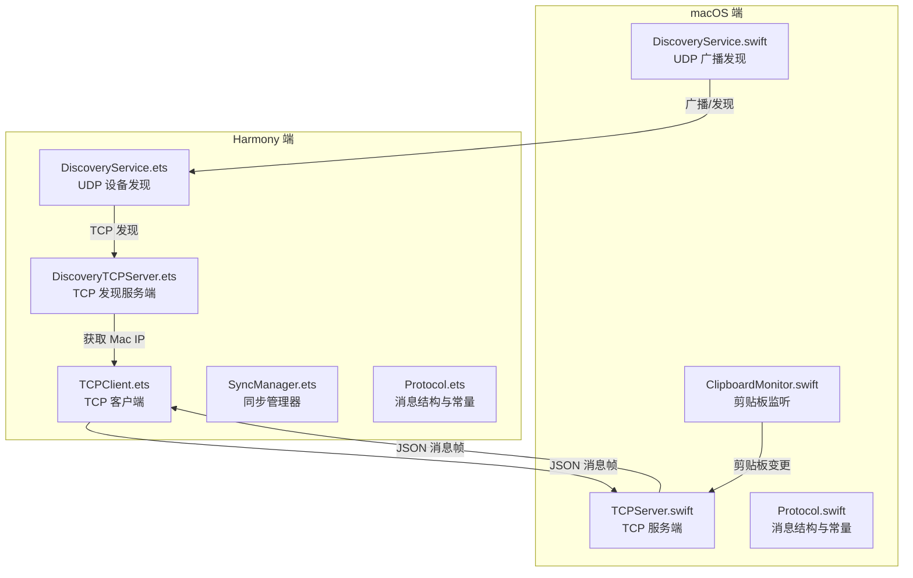
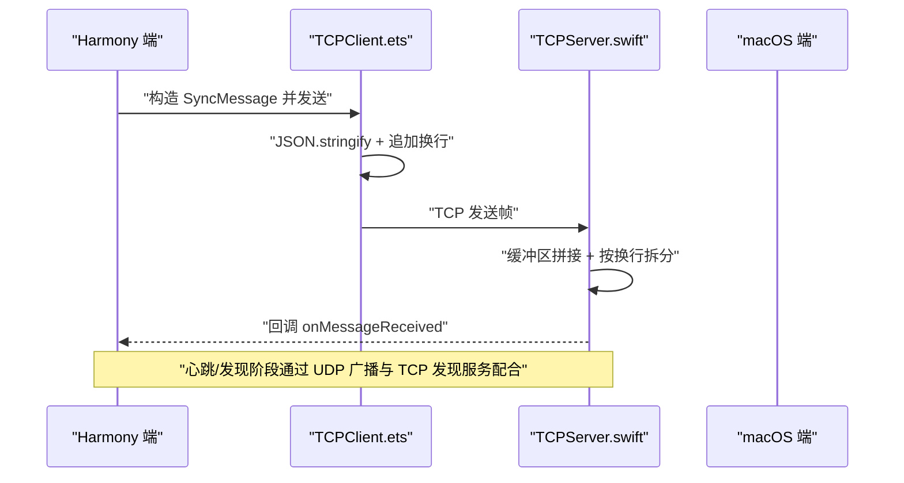
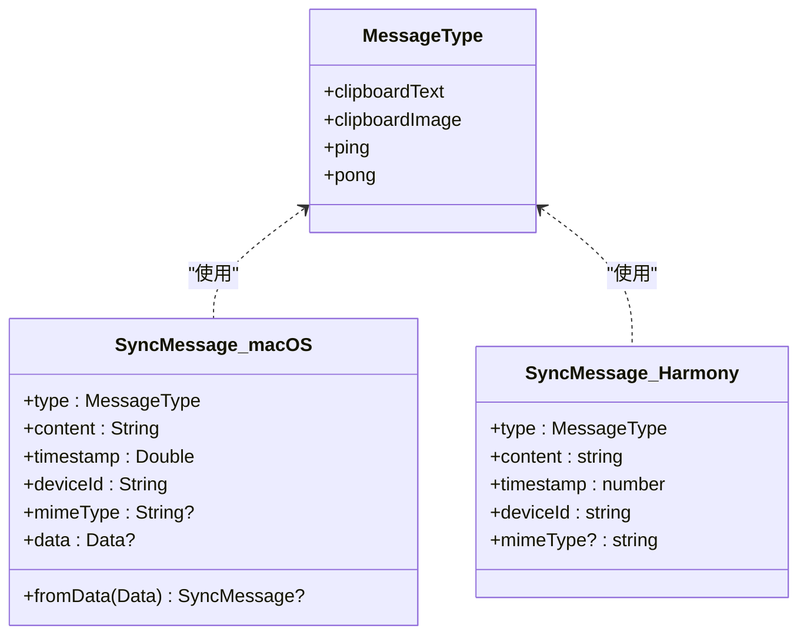
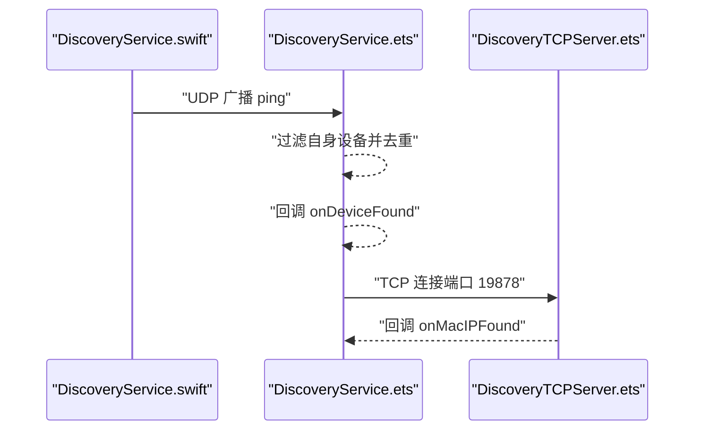
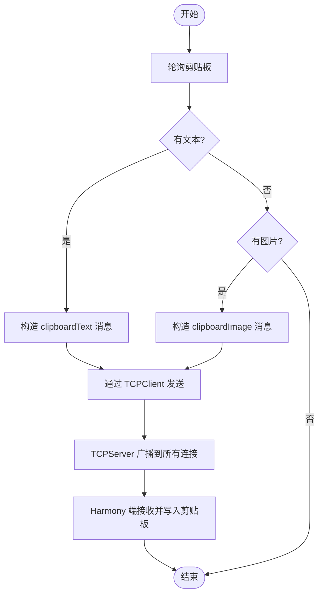
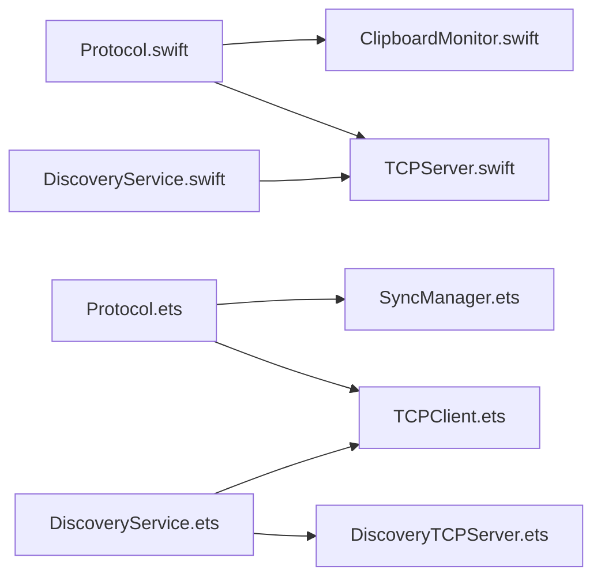

# 消息格式规范

<cite>
**本文档引用的文件**
- [Protocol.swift](file://ClipboardSync/mac/ClipboardSync/Protocol.swift)
- [SyncManager.ets](file://ClipboardSync/harmony/entry/src/main/ets/model/SyncManager.ets)
- [TCPClient.ets](file://ClipboardSync/harmony/entry/src/main/ets/common/TCPClient.ets)
- [DiscoveryService.swift](file://ClipboardSync/mac/ClipboardSync/DiscoveryService.swift)
- [TCPServer.swift](file://ClipboardSync/mac/ClipboardSync/TCPServer.swift)
- [ClipboardMonitor.swift](file://ClipboardSync/mac/ClipboardSync/ClipboardMonitor.swift)
- [Protocol.ets](file://ClipboardSync/harmony/entry/src/main/ets/common/Protocol.ets)
- [DiscoveryService.ets](file://ClipboardSync/harmony/entry/src/main/ets/common/DiscoveryService.ets)
- [DiscoveryTCPServer.ets](file://ClipboardSync/harmony/entry/src/main/ets/common/DiscoveryTCPServer.ets)
</cite>

## 目录
1. [简介](#简介)
2. [项目结构](#项目结构)
3. [核心组件](#核心组件)
4. [架构总览](#架构总览)
5. [详细组件分析](#详细组件分析)
6. [依赖关系分析](#依赖关系分析)
7. [性能考量](#性能考量)
8. [故障排查指南](#故障排查指南)
9. [结论](#结论)
10. [附录](#附录)

## 简介
本文件系统化阐述剪贴板同步消息格式规范，重点围绕 SyncMessage 结构体的字段定义与数据类型、消息类型枚举、内容存储方式、时间戳机制、设备标识与媒体类型信息；同时说明 JSON 编码格式的实现细节（Codable 协议、自定义编码器/解码器）、字段验证规则与错误处理策略，并给出文本消息、图片消息、心跳消息等典型场景的 JSON 示例路径，帮助开发者快速理解与实现跨平台通信协议。

## 项目结构
本项目采用跨平台架构：
- macOS 端：Swift 实现的 TCP 服务端、剪贴板监听、UDP 广播发现与 TCP 发现服务。
- Harmony 端：ArkTS 实现的 TCP 客户端、UDP 设备发现、TCP 发现服务端、剪贴板轮询与同步管理器。

图表来源
- [DiscoveryService.swift:1-197](file://ClipboardSync/mac/ClipboardSync/DiscoveryService.swift#L1-L197)
- [TCPServer.swift:1-174](file://ClipboardSync/mac/ClipboardSync/TCPServer.swift#L1-L174)
- [ClipboardMonitor.swift:1-73](file://ClipboardSync/mac/ClipboardSync/ClipboardMonitor.swift#L1-L73)
- [Protocol.swift:1-43](file://ClipboardSync/mac/ClipboardSync/Protocol.swift#L1-L43)
- [DiscoveryService.ets:1-161](file://ClipboardSync/harmony/entry/src/main/ets/common/DiscoveryService.ets#L1-L161)
- [DiscoveryTCPServer.ets:1-80](file://ClipboardSync/harmony/entry/src/main/ets/common/DiscoveryTCPServer.ets#L1-L80)
- [TCPClient.ets:1-181](file://ClipboardSync/harmony/entry/src/main/ets/common/TCPClient.ets#L1-L181)
- [SyncManager.ets:1-301](file://ClipboardSync/harmony/entry/src/main/ets/model/SyncManager.ets#L1-L301)
- [Protocol.ets:1-26](file://ClipboardSync/harmony/entry/src/main/ets/common/Protocol.ets#L1-L26)

章节来源
- [Protocol.swift:1-43](file://ClipboardSync/mac/ClipboardSync/Protocol.swift#L1-L43)
- [Protocol.ets:1-26](file://ClipboardSync/harmony/entry/src/main/ets/common/Protocol.ets#L1-L26)

## 核心组件
本节聚焦 SyncMessage 结构体及其相关组件，明确字段定义、数据类型、编码方式与处理流程。

- SyncMessage 结构体（macOS 端）
  - 字段定义与类型
    - type: MessageType（枚举）
    - content: String（内容主体）
    - timestamp: Double（Unix 时间戳，秒级）
    - deviceId: String（设备标识）
    - mimeType: String?（可选，媒体类型）
  - 编码方式
    - 使用 JSONEncoder/JSONDecoder 进行 Codable 序列化/反序列化
    - 提供便捷属性 data（编码后的 Data）与静态方法 fromData（解码）

- SyncMessage 接口（Harmony 端）
  - 字段定义与类型
    - type: MessageType（枚举）
    - content: string
    - timestamp: number（秒级 Unix 时间戳）
    - deviceId: string
    - mimeType?: string（可选）
  - 编码方式
    - 使用 JSON.stringify(JSON.parse) 进行消息帧封装/解析
    - 每条消息以换行符结尾，按行拆分处理

- 消息类型枚举
  - clipboardText：文本剪贴板消息
  - clipboardImage：图片剪贴板消息
  - ping：心跳/发现消息
  - pong：响应消息（当前实现中未直接使用）

- 时间戳机制
  - macOS 端：使用 Date().timeIntervalSince1970（Double）
  - Harmony 端：使用 Date.now() / 1000（number，秒级）
  - 两端均采用秒级时间戳，便于跨端一致性

- 设备标识与媒体类型
  - deviceId：macOS 端为本地主机名或随机生成；Harmony 端为固定前缀+随机数
  - mimeType：文本消息为 text/plain；图片消息为 image/png；心跳消息可为空

章节来源
- [Protocol.swift:27-42](file://ClipboardSync/mac/ClipboardSync/Protocol.swift#L27-L42)
- [Protocol.ets:19-26](file://ClipboardSync/harmony/entry/src/main/ets/common/Protocol.ets#L19-L26)
- [SyncManager.ets:256-269](file://ClipboardSync/harmony/entry/src/main/ets/model/SyncManager.ets#L256-L269)
- [TCPServer.swift:60-67](file://ClipboardSync/mac/ClipboardSync/TCPServer.swift#L60-L67)
- [TCPClient.ets:44-58](file://ClipboardSync/harmony/entry/src/main/ets/common/TCPClient.ets#L44-L58)

## 架构总览
消息在两端之间通过 TCP 传输，采用“每条消息以换行符结尾”的帧格式进行粘包处理；设备发现阶段通过 UDP 广播/监听与 TCP 发现服务配合，最终建立稳定的数据通道。

图表来源
- [TCPClient.ets:44-58](file://ClipboardSync/harmony/entry/src/main/ets/common/TCPClient.ets#L44-L58)
- [TCPServer.swift:129-148](file://ClipboardSync/mac/ClipboardSync/TCPServer.swift#L129-L148)
- [DiscoveryService.swift:104-146](file://ClipboardSync/mac/ClipboardSync/DiscoveryService.swift#L104-L146)
- [DiscoveryService.ets:97-124](file://ClipboardSync/harmony/entry/src/main/ets/common/DiscoveryService.ets#L97-L124)

## 详细组件分析

### SyncMessage 结构体与 JSON 编码
- macOS 端
  - Codable 实现：结构体直接遵循 Codable，借助 JSONEncoder/JSONDecoder 自动编码/解码
  - 编码属性 data：返回 JSON 编码后的 Data；解码静态方法 fromData：从 Data 反序列化为 SyncMessage
  - 适用场景：广播发现（ping）、剪贴板文本/图片消息、服务端广播

- Harmony 端
  - 接口定义：与 macOS 端保持一致的字段与类型
  - 编码方式：通过 JSON.stringify 构造消息字符串，追加换行符形成帧；接收端按换行拆分逐条解析
  - 适用场景：TCP 数据传输、设备发现（UDP 广播）

图表来源
- [Protocol.swift:19-42](file://ClipboardSync/mac/ClipboardSync/Protocol.swift#L19-L42)
- [Protocol.ets:11-26](file://ClipboardSync/harmony/entry/src/main/ets/common/Protocol.ets#L11-L26)

章节来源
- [Protocol.swift:27-42](file://ClipboardSync/mac/ClipboardSync/Protocol.swift#L27-L42)
- [Protocol.ets:19-26](file://ClipboardSync/harmony/entry/src/main/ets/common/Protocol.ets#L19-L26)

### 设备发现与心跳消息
- macOS 端
  - DiscoveryService.swift：周期性发送 ping 类型的 SyncMessage（content 为 discover），携带设备标识与时间戳；监听 UDP 广播，过滤自身设备，去重后回调发现事件
  - 通过 TCP 发现端口 19878，让 Harmony 端连接以获取 Mac 的 IP 地址

- Harmony 端
  - DiscoveryService.ets：UDP 广播 ping，监听广播消息，过滤自身设备并去重，回调发现事件
  - DiscoveryTCPServer.ets：监听端口 19878，从连接中获取 Mac 的 IP 地址

图表来源
- [DiscoveryService.swift:78-100](file://ClipboardSync/mac/ClipboardSync/DiscoveryService.swift#L78-L100)
- [DiscoveryService.ets:144-156](file://ClipboardSync/harmony/entry/src/main/ets/common/DiscoveryService.ets#L144-L156)
- [DiscoveryTCPServer.ets:61-78](file://ClipboardSync/harmony/entry/src/main/ets/common/DiscoveryTCPServer.ets#L61-L78)

章节来源
- [DiscoveryService.swift:104-146](file://ClipboardSync/mac/ClipboardSync/DiscoveryService.swift#L104-L146)
- [DiscoveryService.ets:97-124](file://ClipboardSync/harmony/entry/src/main/ets/common/DiscoveryService.ets#L97-L124)
- [DiscoveryTCPServer.ets:18-78](file://ClipboardSync/harmony/entry/src/main/ets/common/DiscoveryTCPServer.ets#L18-L78)

### 剪贴板同步流程
- macOS 端
  - ClipboardMonitor.swift：轮询剪贴板，优先读取文本，其次尝试读取图片并转换为 PNG Data；回调 onClipboardChanged
  - TCPServer.swift：接收消息帧，按换行拆分，反序列化为 SyncMessage；广播给所有连接的客户端

- Harmony 端
  - SyncManager.ets：轮询系统剪贴板，检测变更后构造 SyncMessage（文本或图片），通过 TCPClient 发送；接收远端消息后写入系统剪贴板

图表来源
- [ClipboardMonitor.swift:50-71](file://ClipboardSync/mac/ClipboardSync/ClipboardMonitor.swift#L50-L71)
- [TCPServer.swift:129-148](file://ClipboardSync/mac/ClipboardSync/TCPServer.swift#L129-L148)
- [TCPClient.ets:115-146](file://ClipboardSync/harmony/entry/src/main/ets/common/TCPClient.ets#L115-L146)
- [SyncManager.ets:215-252](file://ClipboardSync/harmony/entry/src/main/ets/model/SyncManager.ets#L215-L252)

章节来源
- [ClipboardMonitor.swift:1-73](file://ClipboardSync/mac/ClipboardSync/ClipboardMonitor.swift#L1-L73)
- [TCPServer.swift:1-174](file://ClipboardSync/mac/ClipboardSync/TCPServer.swift#L1-L174)
- [TCPClient.ets:1-181](file://ClipboardSync/harmony/entry/src/main/ets/common/TCPClient.ets#L1-L181)
- [SyncManager.ets:1-301](file://ClipboardSync/harmony/entry/src/main/ets/model/SyncManager.ets#L1-L301)

## 依赖关系分析
- 字段依赖
  - type 与 content：决定消息语义与承载内容
  - timestamp：用于去重与同步顺序控制
  - deviceId：用于设备识别与过滤自身广播
  - mimeType：指示 content 的媒体类型，便于接收端正确处理

- 组件耦合
  - macOS 端：TCPServer 依赖 SyncMessage 的 data 属性进行广播；ClipboardMonitor 与 SyncManager 通过回调协作
  - Harmony 端：TCPClient 依赖 SyncMessage 接口进行 JSON 序列化；SyncManager 依赖 DiscoveryService 与 DiscoveryTCPServer 完成连接建立

图表来源
- [Protocol.swift:1-43](file://ClipboardSync/mac/ClipboardSync/Protocol.swift#L1-L43)
- [Protocol.ets:1-26](file://ClipboardSync/harmony/entry/src/main/ets/common/Protocol.ets#L1-L26)
- [TCPServer.swift:1-174](file://ClipboardSync/mac/ClipboardSync/TCPServer.swift#L1-L174)
- [ClipboardMonitor.swift:1-73](file://ClipboardSync/mac/ClipboardSync/ClipboardMonitor.swift#L1-L73)
- [TCPClient.ets:1-181](file://ClipboardSync/harmony/entry/src/main/ets/common/TCPClient.ets#L1-L181)
- [SyncManager.ets:1-301](file://ClipboardSync/harmony/entry/src/main/ets/model/SyncManager.ets#L1-L301)
- [DiscoveryService.swift:1-197](file://ClipboardSync/mac/ClipboardSync/DiscoveryService.swift#L1-L197)
- [DiscoveryService.ets:1-161](file://ClipboardSync/harmony/entry/src/main/ets/common/DiscoveryService.ets#L1-L161)
- [DiscoveryTCPServer.ets:1-80](file://ClipboardSync/harmony/entry/src/main/ets/common/DiscoveryTCPServer.ets#L1-L80)

章节来源
- [Protocol.swift:1-43](file://ClipboardSync/mac/ClipboardSync/Protocol.swift#L1-L43)
- [Protocol.ets:1-26](file://ClipboardSync/harmony/entry/src/main/ets/common/Protocol.ets#L1-L26)

## 性能考量
- TCP 帧格式
  - 每条消息以换行符结尾，接收端按行拆分，避免粘包问题；缓冲区按连接对象区分，支持多客户端并发
- 轮询与去重
  - macOS 端剪贴板轮询间隔较短（0.5 秒），Harmony 端轮询间隔更短（0.5 秒），减少延迟；通过 lastSentTimestamp 与时间戳比较实现去重
- 广播与发现
  - UDP 广播间隔适中（3 秒），避免频繁网络开销；发现阶段先 UDP 广播，再通过 TCP 发现服务获取 Mac IP，降低连接复杂度

[本节为通用性能讨论，不直接分析具体文件]

## 故障排查指南
- TCP 连接失败
  - 现象：连接回调触发后很快断开，或出现错误回调
  - 处理：检查端口是否正确、防火墙设置、网络可达性；查看错误码并重连
  - 参考路径
    - [TCPClient.ets:83-90](file://ClipboardSync/harmony/entry/src/main/ets/common/TCPClient.ets#L83-L90)
    - [TCPServer.swift:81-93](file://ClipboardSync/mac/ClipboardSync/TCPServer.swift#L81-L93)

- JSON 解析失败
  - 现象：接收端解析单行消息时抛出异常
  - 处理：确认发送端每条消息以换行结尾；检查编码字符集与长度限制
  - 参考路径
    - [TCPClient.ets:135-141](file://ClipboardSync/harmony/entry/src/main/ets/common/TCPClient.ets#L135-L141)
    - [TCPServer.swift:140-147](file://ClipboardSync/mac/ClipboardSync/TCPServer.swift#L140-L147)

- 设备发现异常
  - 现象：UDP 广播未被接收或重复回调
  - 处理：确认广播端口一致、网络广播启用、去重逻辑生效；必要时重置发现设备列表
  - 参考路径
    - [DiscoveryService.ets:19-23](file://ClipboardSync/harmony/entry/src/main/ets/common/DiscoveryService.ets#L19-L23)
    - [DiscoveryService.swift:84-100](file://ClipboardSync/mac/ClipboardSync/DiscoveryService.swift#L84-L100)

- 剪贴板写入失败
  - 现象：远端消息到达但本地未写入
  - 处理：检查 isRemoteUpdate 标志位，避免回环；确认 MIME 类型与数据格式
  - 参考路径
    - [ClipboardMonitor.swift:30-48](file://ClipboardSync/mac/ClipboardSync/ClipboardMonitor.swift#L30-L48)
    - [SyncManager.ets:273-283](file://ClipboardSync/harmony/entry/src/main/ets/model/SyncManager.ets#L273-L283)

章节来源
- [TCPClient.ets:83-90](file://ClipboardSync/harmony/entry/src/main/ets/common/TCPClient.ets#L83-L90)
- [TCPServer.swift:81-93](file://ClipboardSync/mac/ClipboardSync/TCPServer.swift#L81-L93)
- [DiscoveryService.ets:19-23](file://ClipboardSync/harmony/entry/src/main/ets/common/DiscoveryService.ets#L19-L23)
- [DiscoveryService.swift:84-100](file://ClipboardSync/mac/ClipboardSync/DiscoveryService.swift#L84-L100)
- [ClipboardMonitor.swift:30-48](file://ClipboardSync/mac/ClipboardSync/ClipboardMonitor.swift#L30-L48)
- [SyncManager.ets:273-283](file://ClipboardSync/harmony/entry/src/main/ets/model/SyncManager.ets#L273-L283)

## 结论
本文档系统梳理了 SyncMessage 的字段定义、消息类型、JSON 编码与帧格式、时间戳与设备标识机制、媒体类型信息，以及跨端实现细节与错误处理策略。通过统一的帧格式与去重机制，系统实现了高效稳定的跨平台剪贴板同步能力。建议在扩展新消息类型时，严格遵循现有字段约定与编码规范，确保兼容性与可维护性。

[本节为总结性内容，不直接分析具体文件]

## 附录

### 字段验证规则与错误处理策略
- 字段验证
  - type：必须为枚举值之一（clipboardText/clipboardImage/ping/pong）
  - content：非空字符串；图片消息需为 Base64 编码的二进制数据
  - timestamp：秒级 Unix 时间戳；用于去重与顺序控制
  - deviceId：非空字符串；用于过滤自身广播与识别设备
  - mimeType：可选；文本消息为 text/plain，图片消息为 image/png

- 错误处理
  - JSON 解析失败：忽略无效行，继续处理后续行
  - TCP 发送失败：记录错误码并触发重连
  - 设备发现异常：重置发现设备列表，允许重新发现同一设备
  - 剪贴板写入异常：捕获异常并忽略，避免影响主流程

章节来源
- [Protocol.swift:27-42](file://ClipboardSync/mac/ClipboardSync/Protocol.swift#L27-L42)
- [Protocol.ets:19-26](file://ClipboardSync/harmony/entry/src/main/ets/common/Protocol.ets#L19-L26)
- [TCPClient.ets:135-141](file://ClipboardSync/harmony/entry/src/main/ets/common/TCPClient.ets#L135-L141)
- [TCPServer.swift:140-147](file://ClipboardSync/mac/ClipboardSync/TCPServer.swift#L140-L147)
- [DiscoveryService.ets:144-156](file://ClipboardSync/harmony/entry/src/main/ets/common/DiscoveryService.ets#L144-L156)
- [SyncManager.ets:178-198](file://ClipboardSync/harmony/entry/src/main/ets/model/SyncManager.ets#L178-L198)

### JSON 示例（示例路径）
以下为典型消息的 JSON 结构示例路径（不直接展示具体内容）：
- 文本消息（clipboardText）
  - macOS 端构造与发送：[SyncManager.ets:256-269](file://ClipboardSync/harmony/entry/src/main/ets/model/SyncManager.ets#L256-L269)
  - macOS 端接收与广播：[TCPServer.swift:129-148](file://ClipboardSync/mac/ClipboardSync/TCPServer.swift#L129-L148)
  - Harmony 端接收与写入：[TCPClient.ets:135-138](file://ClipboardSync/harmony/entry/src/main/ets/common/TCPClient.ets#L135-L138)

- 图片消息（clipboardImage）
  - macOS 端读取与编码：[ClipboardMonitor.swift:62-70](file://ClipboardSync/mac/ClipboardSync/ClipboardMonitor.swift#L62-L70)
  - Harmony 端发送：[SyncManager.ets:131-141](file://ClipboardSync/harmony/entry/src/main/ets/model/SyncManager.ets#L131-L141)

- 心跳消息（ping）
  - macOS 端广播：[DiscoveryService.swift:114-146](file://ClipboardSync/mac/ClipboardSync/DiscoveryService.swift#L114-L146)
  - Harmony 端广播：[DiscoveryService.ets:97-124](file://ClipboardSync/harmony/entry/src/main/ets/common/DiscoveryService.ets#L97-L124)

章节来源
- [SyncManager.ets:121-141](file://ClipboardSync/harmony/entry/src/main/ets/model/SyncManager.ets#L121-L141)
- [TCPServer.swift:129-148](file://ClipboardSync/mac/ClipboardSync/TCPServer.swift#L129-L148)
- [TCPClient.ets:135-138](file://ClipboardSync/harmony/entry/src/main/ets/common/TCPClient.ets#L135-L138)
- [DiscoveryService.swift:114-146](file://ClipboardSync/mac/ClipboardSync/DiscoveryService.swift#L114-L146)
- [DiscoveryService.ets:97-124](file://ClipboardSync/harmony/entry/src/main/ets/common/DiscoveryService.ets#L97-L124)