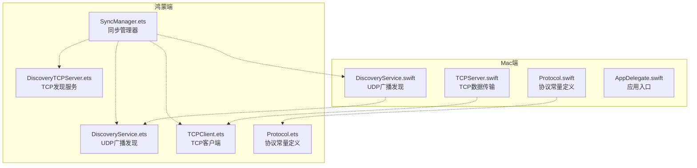
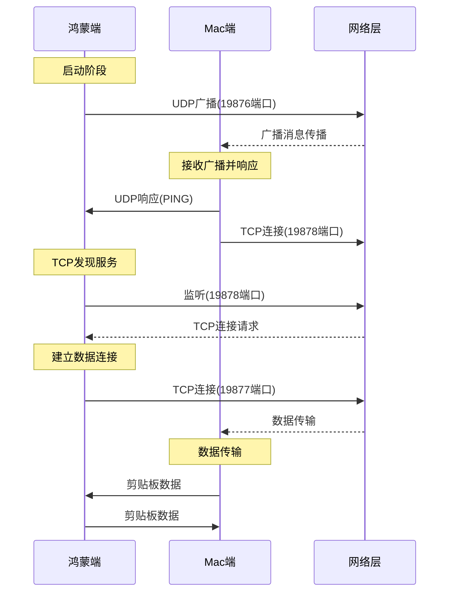
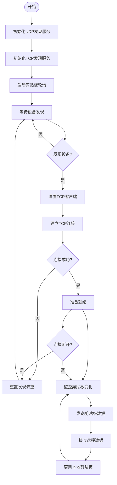
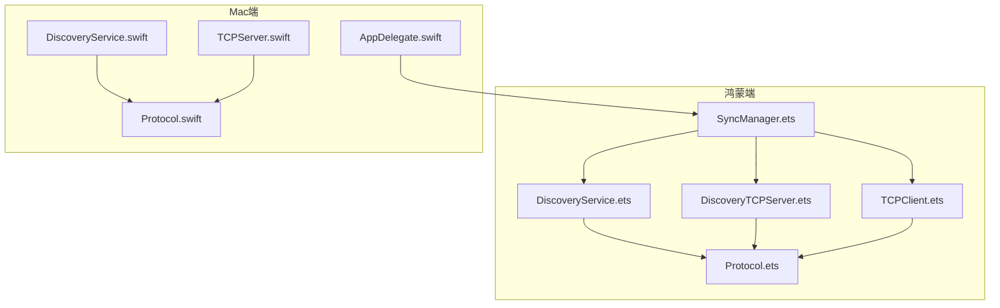

# 设备发现协议

<cite>
**本文档引用的文件**
- [DiscoveryService.swift](file://ClipboardSync/mac/ClipboardSync/DiscoveryService.swift)
- [DiscoveryService.ets](file://ClipboardSync/harmony/entry/src/main/ets/common/DiscoveryService.ets)
- [Protocol.swift](file://ClipboardSync/mac/ClipboardSync/Protocol.swift)
- [Protocol.ets](file://ClipboardSync/harmony/entry/src/main/ets/common/Protocol.ets)
- [TCPServer.swift](file://ClipboardSync/mac/ClipboardSync/TCPServer.swift)
- [DiscoveryTCPServer.ets](file://ClipboardSync/harmony/entry/src/main/ets/common/DiscoveryTCPServer.ets)
- [TCPClient.ets](file://ClipboardSync/harmony/entry/src/main/ets/common/TCPClient.ets)
- [SyncManager.ets](file://ClipboardSync/harmony/entry/src/main/ets/model/SyncManager.ets)
- [AppDelegate.swift](file://ClipboardSync/mac/ClipboardSync/AppDelegate.swift)
</cite>

## 目录
1. [简介](#简介)
2. [项目结构](#项目结构)
3. [核心组件](#核心组件)
4. [架构概览](#架构概览)
5. [详细组件分析](#详细组件分析)
6. [依赖关系分析](#依赖关系分析)
7. [性能考虑](#性能考虑)
8. [故障排除指南](#故障排除指南)
9. [结论](#结论)

## 简介

本项目实现了跨平台的设备发现协议，支持Mac和鸿蒙系统之间的剪贴板同步。该协议采用UDP广播发现机制配合TCP连接建立的方式，实现了可靠的设备发现和连接管理。

协议的核心特点：
- **UDP广播发现**：使用19876端口进行设备发现广播
- **广播间隔控制**：每3秒发送一次广播消息
- **设备标识符生成**：基于随机数生成唯一的设备ID
- **TCP发现端口**：使用19878端口解决UDP广播在某些网络环境下的限制
- **双向通信**：通过19877端口进行数据传输

## 项目结构

项目采用按平台分离的组织方式，Mac端和鸿蒙端分别实现相同的协议逻辑：



**图表来源**
- [DiscoveryService.swift:1-197](file://ClipboardSync/mac/ClipboardSync/DiscoveryService.swift#L1-L197)
- [DiscoveryService.ets:1-161](file://ClipboardSync/harmony/entry/src/main/ets/common/DiscoveryService.ets#L1-L161)
- [Protocol.swift:1-43](file://ClipboardSync/mac/ClipboardSync/Protocol.swift#L1-L43)
- [Protocol.ets:1-27](file://ClipboardSync/harmony/entry/src/main/ets/common/Protocol.ets#L1-L27)

**章节来源**
- [DiscoveryService.swift:1-197](file://ClipboardSync/mac/ClipboardSync/DiscoveryService.swift#L1-L197)
- [DiscoveryService.ets:1-161](file://ClipboardSync/harmony/entry/src/main/ets/common/DiscoveryService.ets#L1-L161)
- [Protocol.swift:1-43](file://ClipboardSync/mac/ClipboardSync/Protocol.swift#L1-L43)
- [Protocol.ets:1-27](file://ClipboardSync/harmony/entry/src/main/ets/common/Protocol.ets#L1-L27)

## 核心组件

### 协议常量定义

协议常量在两个平台保持一致，确保互操作性：

| 常量名称 | Mac端值 | 鸿蒙端值 | 用途 |
|---------|---------|----------|------|
| BROADCAST_PORT | 19876 | 19876 | UDP广播端口 |
| WS_PORT | 19877 | 19877 | TCP数据传输端口 |
| DISCOVERY_TCP_PORT | 19878 | 19878 | TCP发现端口 |
| BROADCAST_INTERVAL | 3秒 | 3000毫秒 | 广播间隔时间 |
| CLIPBOARD_POLL_INTERVAL | 0.5秒 | 500毫秒 | 剪贴板轮询间隔 |

### 设备标识符生成

**Mac端实现**：
- 使用主机本地名称作为基础标识
- 如果获取失败，生成"Mac-XXXX"格式的随机ID
- 基于系统特性生成唯一标识

**鸿蒙端实现**：
- 使用"Harmony-XXXX"格式的随机ID
- 通过Math.random()生成4位随机数
- 确保设备ID的唯一性

**章节来源**
- [Protocol.swift:15-17](file://ClipboardSync/mac/ClipboardSync/Protocol.swift#L15-L17)
- [Protocol.ets:8](file://ClipboardSync/harmony/entry/src/main/ets/common/Protocol.ets#L8)

## 架构概览

设备发现协议采用双通道架构，结合UDP广播和TCP连接的优势：



**图表来源**
- [DiscoveryService.swift:104-146](file://ClipboardSync/mac/ClipboardSync/DiscoveryService.swift#L104-L146)
- [DiscoveryService.ets:87-124](file://ClipboardSync/harmony/entry/src/main/ets/common/DiscoveryService.ets#L87-L124)
- [DiscoveryTCPServer.ets:18-49](file://ClipboardSync/harmony/entry/src/main/ets/common/DiscoveryTCPServer.ets#L18-L49)

## 详细组件分析

### UDP广播发现服务

#### 鸿蒙端实现

鸿蒙端的DiscoveryService提供了完整的UDP广播功能：

**核心功能**：
- **Socket管理**：创建和管理UDP Socket实例
- **广播定时器**：每3秒发送一次广播消息
- **消息处理**：解析接收到的广播消息
- **设备去重**：避免重复发现同一设备

**广播消息格式**：
```json
{
  "type": "ping",
  "content": "discover",
  "timestamp": 1700000000.123,
  "deviceId": "Harmony-1234"
}
```

**章节来源**
- [DiscoveryService.ets:25-70](file://ClipboardSync/harmony/entry/src/main/ets/common/DiscoveryService.ets#L25-L70)
- [DiscoveryService.ets:102-124](file://ClipboardSync/harmony/entry/src/main/ets/common/DiscoveryService.ets#L102-L124)
- [DiscoveryService.ets:126-160](file://ClipboardSync/harmony/entry/src/main/ets/common/DiscoveryService.ets#L126-L160)

#### Mac端实现

Mac端的DiscoveryService使用BSD Socket实现：

**核心功能**：
- **BSD Socket**：直接使用底层Socket API
- **异步监听**：使用GCD队列处理网络事件
- **TCP发现**：主动连接鸿蒙端的发现端口
- **设备去重**：维护发现设备集合

**章节来源**
- [DiscoveryService.swift:15-29](file://ClipboardSync/mac/ClipboardSync/DiscoveryService.swift#L15-L29)
- [DiscoveryService.swift:33-76](file://ClipboardSync/mac/ClipboardSync/DiscoveryService.swift#L33-L76)
- [DiscoveryService.swift:104-146](file://ClipboardSync/mac/ClipboardSync/DiscoveryService.swift#L104-L146)

### TCP发现端口实现

#### 鸿蒙端TCP发现服务

DiscoveryTCPServer专门用于监听Mac端的连接请求：

**核心功能**：
- **端口监听**：监听19878端口等待连接
- **连接处理**：获取连接方的IP地址
- **回调通知**：向上层提供Mac IP地址

**连接流程**：
1. Mac端主动连接19878端口
2. 服务端获取远程地址信息
3. 通过回调通知SyncManager
4. 立即关闭连接用于发现目的

**章节来源**
- [DiscoveryTCPServer.ets:18-49](file://ClipboardSync/harmony/entry/src/main/ets/common/DiscoveryTCPServer.ets#L18-L49)
- [DiscoveryTCPServer.ets:61-78](file://ClipboardSync/harmony/entry/src/main/ets/common/DiscoveryTCPServer.ets#L61-L78)

#### Mac端TCP连接

Mac端的DiscoveryService主动连接鸿蒙端：

**连接策略**：
- 对每个新发现的设备发起TCP连接
- 使用19878端口连接鸿蒙端
- 连接成功后立即取消，仅用于获取IP

**章节来源**
- [DiscoveryService.swift:150-180](file://ClipboardSync/mac/ClipboardSync/DiscoveryService.swift#L150-L180)

### 数据传输协议

#### TCP客户端实现

鸿蒙端的TCPClient负责与Mac端建立数据连接：

**核心功能**：
- **连接管理**：自动重连机制
- **消息处理**：基于换行符的消息帧处理
- **缓冲管理**：处理TCP粘包问题

**消息格式**：
每条消息以换行符结尾，使用JSON格式传输：

```json
{"type":"clipboardText","content":"Hello World","timestamp":1700000000.123,"deviceId":"Harmony-1234","mimeType":"text/plain"}
```

**章节来源**
- [TCPClient.ets:30-42](file://ClipboardSync/harmony/entry/src/main/ets/common/TCPClient.ets#L30-L42)
- [TCPClient.ets:115-146](file://ClipboardSync/harmony/entry/src/main/ets/common/TCPClient.ets#L115-L146)

#### Mac端TCP服务器

Mac端的TCPServer作为服务端监听连接：

**核心功能**：
- **连接管理**：维护多个客户端连接
- **消息处理**：解析JSON消息并分发给上层
- **缓冲处理**：处理TCP粘包和半包问题

**章节来源**
- [TCPServer.swift:23-51](file://ClipboardSync/mac/ClipboardSync/TCPServer.swift#L23-L51)
- [TCPServer.swift:108-148](file://ClipboardSync/mac/ClipboardSync/TCPServer.swift#L108-L148)

### 同步管理器

SyncManager协调整个发现和连接过程：



**图表来源**
- [SyncManager.ets:72-98](file://ClipboardSync/harmony/entry/src/main/ets/model/SyncManager.ets#L72-L98)
- [SyncManager.ets:129-174](file://ClipboardSync/harmony/entry/src/main/ets/model/SyncManager.ets#L129-L174)

**章节来源**
- [SyncManager.ets:26-108](file://ClipboardSync/harmony/entry/src/main/ets/model/SyncManager.ets#L26-L108)
- [SyncManager.ets:176-233](file://ClipboardSync/harmony/entry/src/main/ets/model/SyncManager.ets#L176-L233)

## 依赖关系分析



**图表来源**
- [SyncManager.ets:3-5](file://ClipboardSync/harmony/entry/src/main/ets/model/SyncManager.ets#L3-L5)
- [DiscoveryService.swift:1-2](file://ClipboardSync/mac/ClipboardSync/DiscoveryService.swift#L1-L2)
- [AppDelegate.swift:7](file://ClipboardSync/mac/ClipboardSync/AppDelegate.swift#L7)

### 组件耦合度分析

**低耦合设计**：
- 各组件职责明确，接口清晰
- 协议常量统一管理，避免硬编码
- 异步事件驱动，减少阻塞

**关键依赖关系**：
- SyncManager依赖所有发现和通信组件
- DiscoveryService依赖Protocol常量
- TCPClient和TCPServer形成对称的客户端-服务端模式

**章节来源**
- [SyncManager.ets:26-30](file://ClipboardSync/harmony/entry/src/main/ets/model/SyncManager.ets#L26-L30)
- [Protocol.swift:1-17](file://ClipboardSync/mac/ClipboardSync/Protocol.swift#L1-L17)
- [Protocol.ets:1-9](file://ClipboardSync/harmony/entry/src/main/ets/common/Protocol.ets#L1-L9)

## 性能考虑

### 广播频率优化

- **3秒间隔**：平衡发现速度和网络负载
- **去重机制**：避免重复发现同一设备
- **智能重连**：连接断开后自动重试

### 内存管理

- **Socket资源**：及时关闭不再使用的Socket
- **定时器清理**：停止时清理所有定时器
- **连接池管理**：合理管理TCP连接生命周期

### 网络效率

- **UDP广播**：轻量级发现机制
- **TCP连接**：可靠的数据传输
- **缓冲处理**：有效处理TCP粘包问题

## 故障排除指南

### 常见问题及解决方案

**问题1：设备无法被发现**
- 检查防火墙设置是否允许UDP 19876端口
- 确认两设备在同一网络段
- 验证广播间隔配置

**问题2：TCP连接失败**
- 检查19878端口是否被占用
- 验证网络路由是否可达
- 查看连接超时设置

**问题3：数据传输异常**
- 检查消息格式是否正确
- 验证换行符分隔符
- 确认JSON序列化正确

### 调试信息

各组件都提供了详细的日志输出：
- **发现服务**：广播发送、接收、设备发现
- **TCP服务**：连接建立、断开、错误处理
- **同步管理器**：状态变化、连接状态

**章节来源**
- [DiscoveryService.ets:36-38](file://ClipboardSync/harmony/entry/src/main/ets/common/DiscoveryService.ets#L36-L38)
- [TCPClient.ets:83-90](file://ClipboardSync/harmony/entry/src/main/ets/common/TCPClient.ets#L83-L90)
- [DiscoveryService.swift:49-56](file://ClipboardSync/mac/ClipboardSync/DiscoveryService.swift#L49-L56)

## 结论

该设备发现协议通过精心设计的双通道架构，成功实现了Mac和鸿蒙系统之间的可靠设备发现和数据传输。协议的主要优势包括：

1. **跨平台兼容性**：两端实现保持一致的协议规范
2. **可靠性保证**：UDP广播+TCP连接的双重保障
3. **性能优化**：合理的广播频率和连接管理
4. **易于扩展**：模块化设计便于功能扩展

协议的关键创新在于使用19878端口作为TCP发现通道，有效解决了某些网络环境下UDP广播不可靠的问题，确保了设备发现的稳定性。通过异步事件驱动的设计，系统能够高效处理多设备连接和数据传输需求。