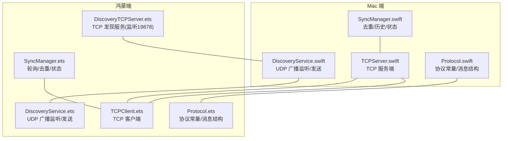
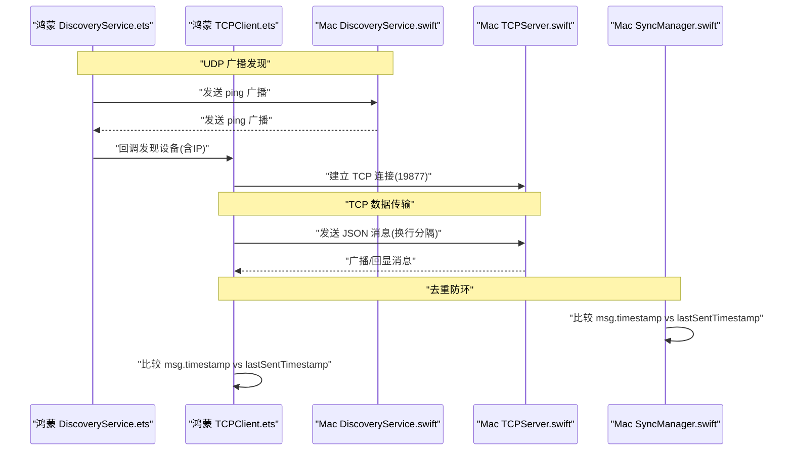
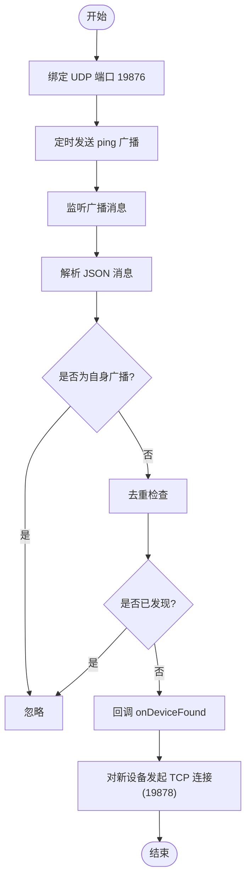
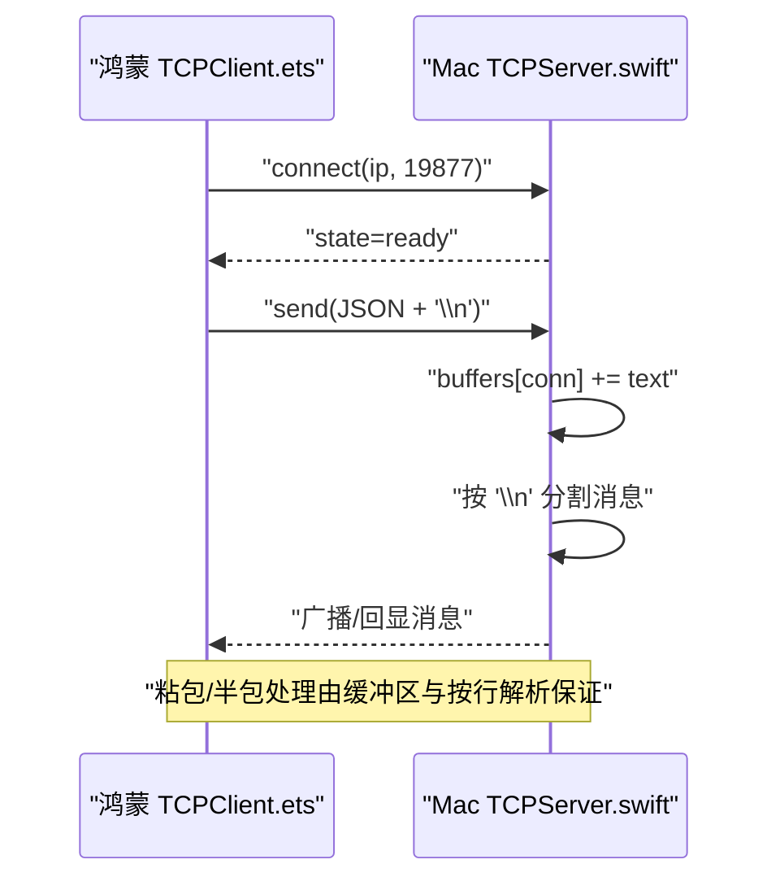
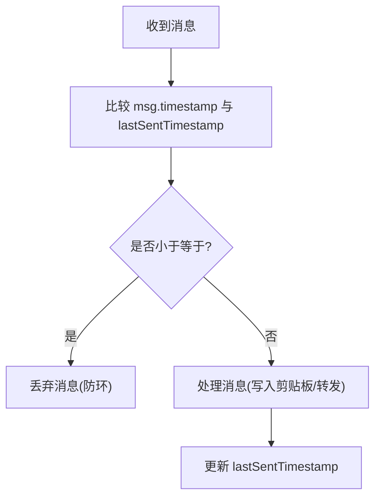
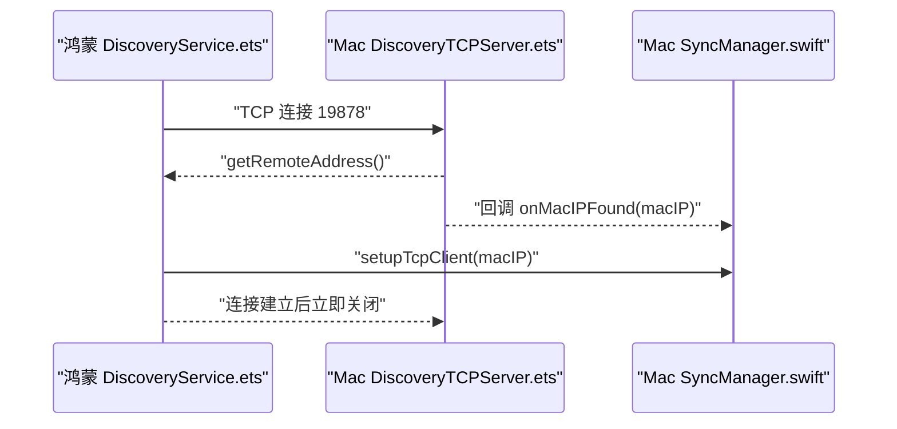
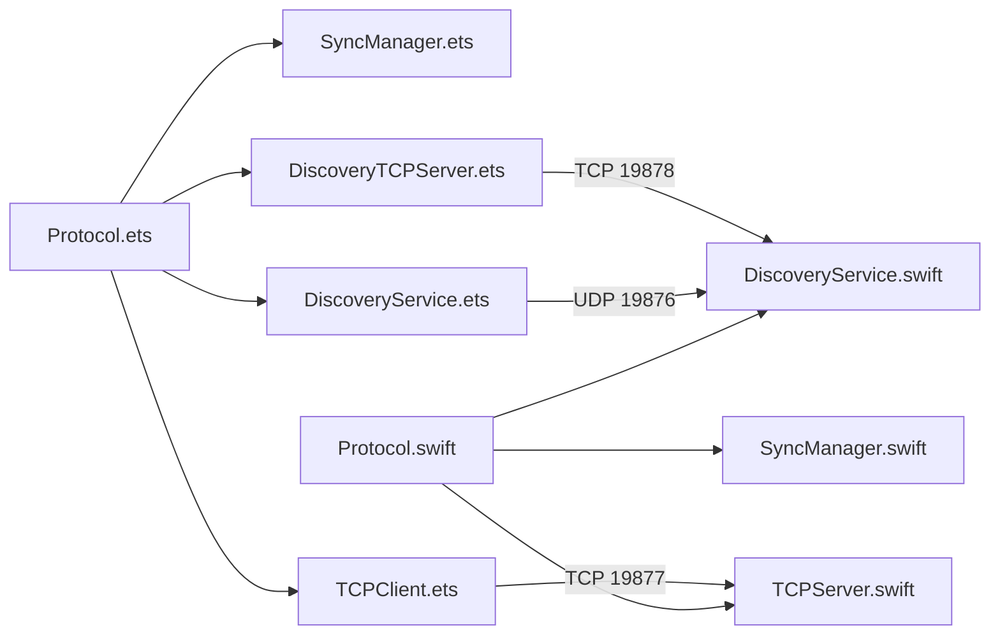
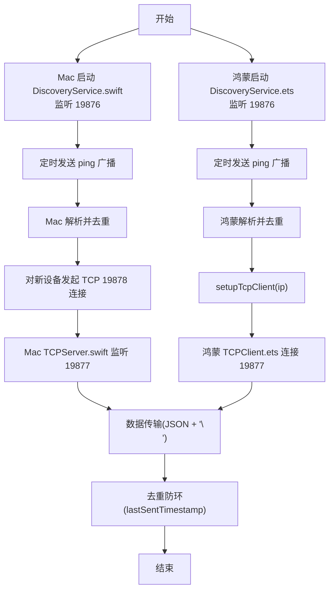

# 通信协议

<cite>
**本文引用的文件**
- [Protocol.ets](file://ClipboardSync/harmony/entry/src/main/ets/common/Protocol.ets)
- [Protocol.swift](file://ClipboardSync/mac/ClipboardSync/Protocol.swift)
- [DiscoveryService.ets](file://ClipboardSync/harmony/entry/src/main/ets/common/DiscoveryService.ets)
- [DiscoveryService.swift](file://ClipboardSync/mac/ClipboardSync/DiscoveryService.swift)
- [TCPClient.ets](file://ClipboardSync/harmony/entry/src/main/ets/common/TCPClient.ets)
- [TCPServer.swift](file://ClipboardSync/mac/ClipboardSync/TCPServer.swift)
- [DiscoveryTCPServer.ets](file://ClipboardSync/harmony/entry/src/main/ets/common/DiscoveryTCPServer.ets)
- [SyncManager.ets](file://ClipboardSync/harmony/entry/src/main/ets/model/SyncManager.ets)
- [SyncManager.swift](file://ClipboardSync/mac/ClipboardSync/SyncManager.swift)
- [PROJECT.md](file://ClipboardSync/PROJECT.md)
</cite>

## 目录
1. [简介](#简介)
2. [项目结构](#项目结构)
3. [核心组件](#核心组件)
4. [架构总览](#架构总览)
5. [详细组件分析](#详细组件分析)
6. [依赖关系分析](#依赖关系分析)
7. [性能考量](#性能考量)
8. [故障排查指南](#故障排查指南)
9. [结论](#结论)
10. [附录](#附录)

## 简介
本文件面向 ClipboardSync 项目，系统化梳理其通信协议与架构。项目采用“UDP 广播发现 + TCP 数据传输”的双层通信模式，实现 Mac 与鸿蒙设备间的剪贴板实时同步。协议定义清晰，消息结构简洁，具备去重防环能力，并提供可扩展的版本演进路径。

## 项目结构
- Mac 端（Swift + SwiftUI）：负责 TCP 服务端、UDP 广播发现、剪贴板监控与消息编解码。
- 鸿蒙端（ArkTS + ArkUI）：负责 UDP 广播发现、TCP 客户端、剪贴板轮询与消息编解码。
- 两端共享协议定义，确保消息结构一致。

图表来源
- [DiscoveryService.swift:1-197](file://ClipboardSync/mac/ClipboardSync/DiscoveryService.swift#L1-L197)
- [TCPServer.swift:1-174](file://ClipboardSync/mac/ClipboardSync/TCPServer.swift#L1-L174)
- [SyncManager.swift:1-154](file://ClipboardSync/mac/ClipboardSync/SyncManager.swift#L1-L154)
- [DiscoveryService.ets:1-161](file://ClipboardSync/harmony/entry/src/main/ets/common/DiscoveryService.ets#L1-L161)
- [DiscoveryTCPServer.ets:1-80](file://ClipboardSync/harmony/entry/src/main/ets/common/DiscoveryTCPServer.ets#L1-L80)
- [TCPClient.ets:1-181](file://ClipboardSync/harmony/entry/src/main/ets/common/TCPClient.ets#L1-L181)
- [SyncManager.ets:1-301](file://ClipboardSync/harmony/entry/src/main/ets/model/SyncManager.ets#L1-L301)
- [Protocol.swift:1-43](file://ClipboardSync/mac/ClipboardSync/Protocol.swift#L1-L43)
- [Protocol.ets:1-27](file://ClipboardSync/harmony/entry/src/main/ets/common/Protocol.ets#L1-L27)

章节来源
- [PROJECT.md:52-63](file://ClipboardSync/PROJECT.md#L52-L63)

## 核心组件
- 协议常量与消息结构
  - 端口：发现端口 19876，数据端口 19877，发现 TCP 端口 19878。
  - 设备 ID：由平台生成唯一标识。
  - 消息类型：文本、图片、心跳（ping/pong）。
  - 消息结构：type、content、timestamp、deviceId、mimeType。
- 发现与连接
  - UDP 广播：双方定时发送 ping，探测彼此在线。
  - TCP：Mac 作为服务端，鸿蒙作为客户端；Mac 通过 19878 端口被动获取 Mac 的真实 IP。
- 数据传输
  - TCP 使用换行分隔的 JSON 消息帧，服务端/客户端均具备粘包处理能力。
- 去重防环
  - 通过 timestamp 与 lastSentTimestamp 比较，避免写入剪贴板后触发监听回环。

章节来源
- [Protocol.ets:1-27](file://ClipboardSync/harmony/entry/src/main/ets/common/Protocol.ets#L1-L27)
- [Protocol.swift:1-43](file://ClipboardSync/mac/ClipboardSync/Protocol.swift#L1-L43)
- [DiscoveryService.ets:1-161](file://ClipboardSync/harmony/entry/src/main/ets/common/DiscoveryService.ets#L1-L161)
- [DiscoveryService.swift:1-197](file://ClipboardSync/mac/ClipboardSync/DiscoveryService.swift#L1-L197)
- [TCPClient.ets:1-181](file://ClipboardSync/harmony/entry/src/main/ets/common/TCPClient.ets#L1-L181)
- [TCPServer.swift:1-174](file://ClipboardSync/mac/ClipboardSync/TCPServer.swift#L1-L174)
- [DiscoveryTCPServer.ets:1-80](file://ClipboardSync/harmony/entry/src/main/ets/common/DiscoveryTCPServer.ets#L1-L80)
- [SyncManager.ets:176-198](file://ClipboardSync/harmony/entry/src/main/ets/model/SyncManager.ets#L176-L198)
- [SyncManager.swift:95-115](file://ClipboardSync/mac/ClipboardSync/SyncManager.swift#L95-L115)

## 架构总览
下图展示“发现—连接—数据传输—去重防环”的完整流程。

图表来源
- [DiscoveryService.ets:25-124](file://ClipboardSync/harmony/entry/src/main/ets/common/DiscoveryService.ets#L25-L124)
- [DiscoveryService.swift:15-120](file://ClipboardSync/mac/ClipboardSync/DiscoveryService.swift#L15-L120)
- [TCPClient.ets:30-113](file://ClipboardSync/harmony/entry/src/main/ets/common/TCPClient.ets#L30-L113)
- [TCPServer.swift:23-97](file://ClipboardSync/mac/ClipboardSync/TCPServer.swift#L23-L97)
- [SyncManager.swift:95-115](file://ClipboardSync/mac/ClipboardSync/SyncManager.swift#L95-L115)
- [SyncManager.ets:178-198](file://ClipboardSync/harmony/entry/src/main/ets/model/SyncManager.ets#L178-L198)

## 详细组件分析

### 协议常量与消息结构
- 端口定义
  - 发现端口：19876（UDP）
  - 数据端口：19877（TCP）
  - 发现 TCP 端口：19878（Mac 监听，用于从连接中获取 Mac 的真实 IP）
- 设备 ID
  - 鸿蒙端：固定前缀 + 随机数
  - Mac 端：主机名或随机数
- 消息类型
  - 文本：clipboardText
  - 图片：clipboardImage
  - 心跳：ping/pong
- 消息结构
  - type：消息类型
  - content：内容（文本或 Base64 图片）
  - timestamp：Unix 秒时间戳
  - deviceId：发送方设备 ID
  - mimeType：可选，标识内容类型（text/plain、image/png）

章节来源
- [Protocol.ets:2-26](file://ClipboardSync/harmony/entry/src/main/ets/common/Protocol.ets#L2-L26)
- [Protocol.swift:4-34](file://ClipboardSync/mac/ClipboardSync/Protocol.swift#L4-L34)

### UDP 广播发现
- 鸿蒙端
  - 定时向 255.255.255.255:19876 发送 ping 广播，携带 deviceId。
  - 监听来自其他设备的 ping，去重后回调发现结果。
- Mac 端
  - 监听 19876 端口，解析 ping 广播，过滤自身，去重后回调发现。
  - 对新设备发起 TCP 连接至 19878，以便获取 Mac 的真实 IP（解决某些网络环境下 UDP 广播不可达问题）。

图表来源
- [DiscoveryService.ets:25-161](file://ClipboardSync/harmony/entry/src/main/ets/common/DiscoveryService.ets#L25-L161)
- [DiscoveryService.swift:15-120](file://ClipboardSync/mac/ClipboardSync/DiscoveryService.swift#L15-L120)

章节来源
- [DiscoveryService.ets:1-161](file://ClipboardSync/harmony/entry/src/main/ets/common/DiscoveryService.ets#L1-L161)
- [DiscoveryService.swift:1-197](file://ClipboardSync/mac/ClipboardSync/DiscoveryService.swift#L1-L197)

### TCP 数据传输
- 连接角色
  - Mac：TCP 服务端（监听 19877）
  - 鸿蒙：TCP 客户端（主动连接）
- 消息帧格式
  - 每条消息以换行符分隔，服务端/客户端均按行解析。
  - 服务端广播给所有已连接客户端。
- 客户端行为
  - 连接成功回调、断线重连、错误处理。
  - 接收消息后按行拆分，逐条解析并回调上层。

图表来源
- [TCPClient.ets:30-146](file://ClipboardSync/harmony/entry/src/main/ets/common/TCPClient.ets#L30-L146)
- [TCPServer.swift:60-148](file://ClipboardSync/mac/ClipboardSync/TCPServer.swift#L60-L148)

章节来源
- [TCPClient.ets:1-181](file://ClipboardSync/harmony/entry/src/main/ets/common/TCPClient.ets#L1-L181)
- [TCPServer.swift:1-174](file://ClipboardSync/mac/ClipboardSync/TCPServer.swift#L1-L174)

### 去重防环机制
- 原理
  - 发送端在发送前设置 timestamp，并记录 lastSentTimestamp。
  - 接收端收到消息后，若 msg.timestamp <= lastSentTimestamp，则丢弃，避免回环。
- 实现位置
  - 鸿蒙端：SyncManager.ets 中对收到的消息进行去重判断。
  - Mac 端：SyncManager.swift 中对收到的消息进行去重判断。

图表来源
- [SyncManager.ets:178-198](file://ClipboardSync/harmony/entry/src/main/ets/model/SyncManager.ets#L178-L198)
- [SyncManager.swift:95-115](file://ClipboardSync/mac/ClipboardSync/SyncManager.swift#L95-L115)

章节来源
- [SyncManager.ets:176-198](file://ClipboardSync/harmony/entry/src/main/ets/model/SyncManager.ets#L176-L198)
- [SyncManager.swift:95-115](file://ClipboardSync/mac/ClipboardSync/SyncManager.swift#L95-L115)

### 发现 TCP 服务（端口 19878）
- 作用
  - Mac 监听 19878 端口，等待鸿蒙端连接，从连接中获取 Mac 的真实 IP。
  - 解决某些网络环境下 UDP 广播无法从 Mac 到达鸿蒙的问题。
- 流程
  - 鸿蒙 DiscoveryService 收到 Mac 广播后，对新设备发起 TCP 连接至 19878。
  - Mac DiscoveryTCPServer 接收连接，读取远端地址并回调给上层。
  - 连接建立后立即关闭，仅用于发现目的。

图表来源
- [DiscoveryService.ets:112-124](file://ClipboardSync/harmony/entry/src/main/ets/common/DiscoveryService.ets#L112-L124)
- [DiscoveryTCPServer.ets:61-78](file://ClipboardSync/harmony/entry/src/main/ets/common/DiscoveryTCPServer.ets#L61-L78)
- [DiscoveryService.swift:151-180](file://ClipboardSync/mac/ClipboardSync/DiscoveryService.swift#L151-L180)

章节来源
- [DiscoveryTCPServer.ets:1-80](file://ClipboardSync/harmony/entry/src/main/ets/common/DiscoveryTCPServer.ets#L1-L80)
- [DiscoveryService.swift:148-180](file://ClipboardSync/mac/ClipboardSync/DiscoveryService.swift#L148-L180)

### 消息示例（结构说明）
- 文本消息
  - type: clipboardText
  - content: 文本内容
  - timestamp: Unix 秒时间戳
  - deviceId: 发送方设备 ID
  - mimeType: text/plain
- 图片消息
  - type: clipboardImage
  - content: Base64 编码的 PNG 图片
  - timestamp: Unix 秒时间戳
  - deviceId: 发送方设备 ID
  - mimeType: image/png
- 心跳消息
  - type: ping 或 pong
  - content: discover 或空
  - timestamp: Unix 秒时间戳
  - deviceId: 发送方设备 ID

章节来源
- [Protocol.ets:12-26](file://ClipboardSync/harmony/entry/src/main/ets/common/Protocol.ets#L12-L26)
- [Protocol.swift:19-34](file://ClipboardSync/mac/ClipboardSync/Protocol.swift#L19-L34)
- [SyncManager.ets:256-269](file://ClipboardSync/harmony/entry/src/main/ets/model/SyncManager.ets#L256-L269)
- [SyncManager.swift:122-141](file://ClipboardSync/mac/ClipboardSync/SyncManager.swift#L122-L141)

## 依赖关系分析
- 两端共享协议定义，确保消息结构一致。
- 鸿蒙端依赖 NetworkKit 的 UDPSocket/TCPSocket，Mac 端依赖 Network/NWListener/BSD Socket。
- 去重逻辑分布在两端，避免相互依赖。

图表来源
- [Protocol.ets:1-27](file://ClipboardSync/harmony/entry/src/main/ets/common/Protocol.ets#L1-L27)
- [Protocol.swift:1-43](file://ClipboardSync/mac/ClipboardSync/Protocol.swift#L1-L43)
- [SyncManager.ets:1-301](file://ClipboardSync/harmony/entry/src/main/ets/model/SyncManager.ets#L1-L301)
- [SyncManager.swift:1-154](file://ClipboardSync/mac/ClipboardSync/SyncManager.swift#L1-L154)
- [DiscoveryService.ets:1-161](file://ClipboardSync/harmony/entry/src/main/ets/common/DiscoveryService.ets#L1-L161)
- [DiscoveryService.swift:1-197](file://ClipboardSync/mac/ClipboardSync/DiscoveryService.swift#L1-L197)
- [TCPClient.ets:1-181](file://ClipboardSync/harmony/entry/src/main/ets/common/TCPClient.ets#L1-L181)
- [TCPServer.swift:1-174](file://ClipboardSync/mac/ClipboardSync/TCPServer.swift#L1-L174)
- [DiscoveryTCPServer.ets:1-80](file://ClipboardSync/harmony/entry/src/main/ets/common/DiscoveryTCPServer.ets#L1-L80)

## 性能考量
- UDP 广播频率：两端均以固定间隔发送 ping，建议根据网络规模与设备数量调整间隔，避免过多广播风暴。
- TCP 消息帧：采用换行分隔，粘包处理通过缓冲区与按行解析实现，适合高频小消息场景。
- 去重防环：基于时间戳比较，简单高效，避免回环导致的无限循环。
- 连接稳定性：客户端具备断线重连与错误回调，建议在网络波动较大时适当延长重连间隔。

## 故障排查指南
- 鸿蒙端 TCP 连接报错
  - 现象：连接时报错或立即断开。
  - 原因：旧 socket 未完全关闭导致系统拒绝。
  - 处理：确保在创建新连接前先断开旧连接，并延迟后再连接。
- Mac 端监听 IPv6 显示误导
  - 现象：lsof 显示 IPv6，但实际可正常连接。
  - 原因：NWListener 默认监听 IPv6，但支持双栈。
  - 处理：确认防火墙与网络策略允许 IPv4/IPv6。
- UDP 广播不可达
  - 现象：Mac 端无法收到鸿蒙广播或反之。
  - 处理：使用 19878 端口的发现 TCP 连接获取真实 IP，再手动连接或自动重连。

章节来源
- [PROJECT.md:102-131](file://ClipboardSync/PROJECT.md#L102-L131)
- [TCPClient.ets:148-157](file://ClipboardSync/harmony/entry/src/main/ets/common/TCPClient.ets#L148-L157)
- [SyncManager.ets:169-174](file://ClipboardSync/harmony/entry/src/main/ets/model/SyncManager.ets#L169-L174)

## 结论
ClipboardSync 的通信协议设计简洁可靠：UDP 广播用于快速发现，TCP 用于稳定数据传输；两端共享协议定义，去重防环机制有效避免回环；通过 19878 端口的发现 TCP 连接，解决了部分网络环境下的广播可达性问题。整体架构易于扩展，为后续安全加固、多设备支持与跨网传输提供了良好基础。

## 附录

### 协议版本与兼容性
- 当前版本
  - 两端共享协议定义，消息结构与端口固定，具备强一致性。
- 兼容性策略
  - 新增字段建议使用可选属性（如 mimeType），旧版本忽略未知字段。
  - 保持端口不变，新增功能通过消息类型扩展。
- 未来扩展建议
  - 引入协议版本号字段，便于未来升级与向后兼容。
  - 增加握手阶段，交换双方支持的功能集。

章节来源
- [Protocol.ets:1-27](file://ClipboardSync/harmony/entry/src/main/ets/common/Protocol.ets#L1-L27)
- [Protocol.swift:1-43](file://ClipboardSync/mac/ClipboardSync/Protocol.swift#L1-L43)

### 通信流程图（补充）

图表来源
- [DiscoveryService.swift:15-120](file://ClipboardSync/mac/ClipboardSync/DiscoveryService.swift#L15-L120)
- [DiscoveryService.ets:25-124](file://ClipboardSync/harmony/entry/src/main/ets/common/DiscoveryService.ets#L25-L124)
- [TCPClient.ets:30-113](file://ClipboardSync/harmony/entry/src/main/ets/common/TCPClient.ets#L30-L113)
- [TCPServer.swift:23-97](file://ClipboardSync/mac/ClipboardSync/TCPServer.swift#L23-L97)
- [SyncManager.ets:129-174](file://ClipboardSync/harmony/entry/src/main/ets/model/SyncManager.ets#L129-L174)
- [SyncManager.swift:95-115](file://ClipboardSync/mac/ClipboardSync/SyncManager.swift#L95-L115)