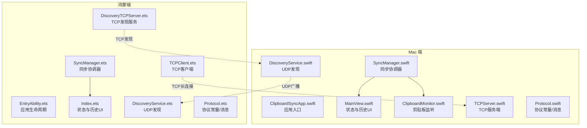
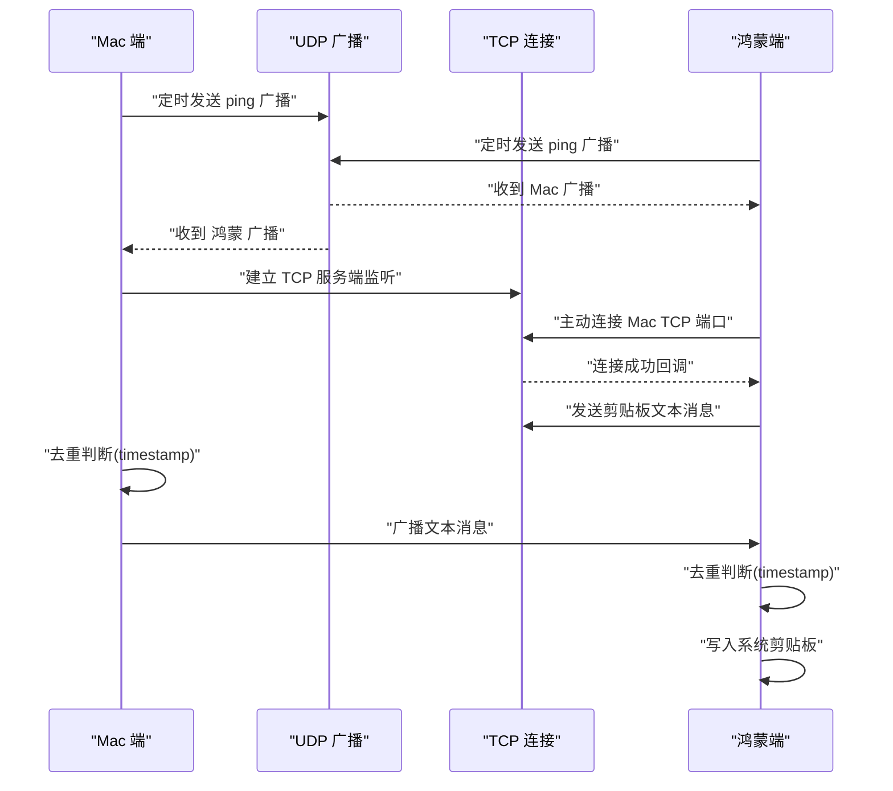
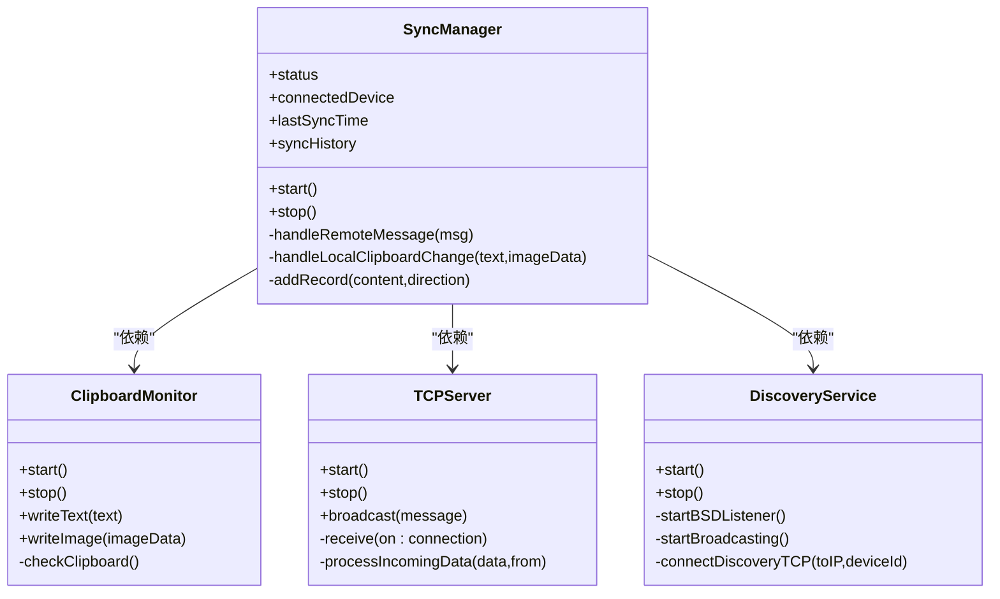
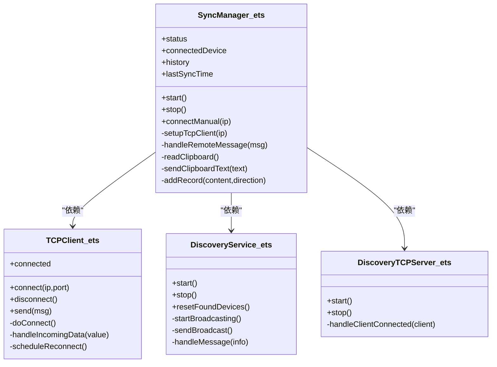
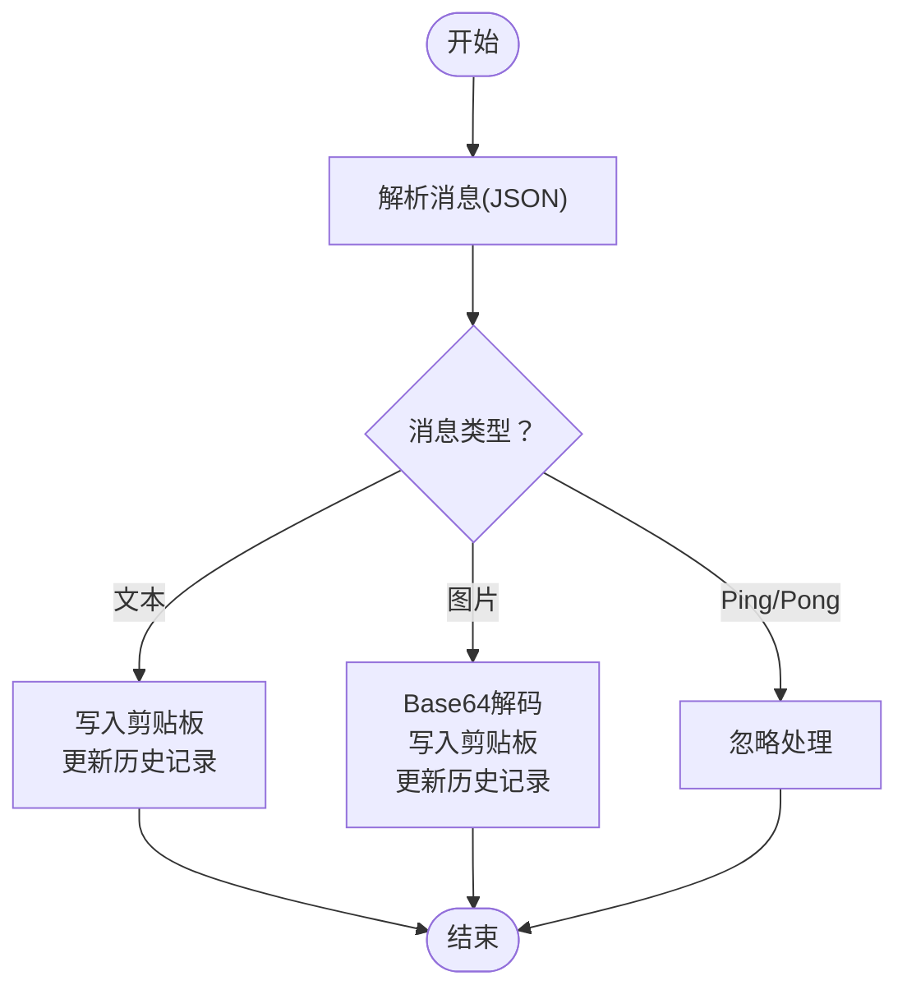
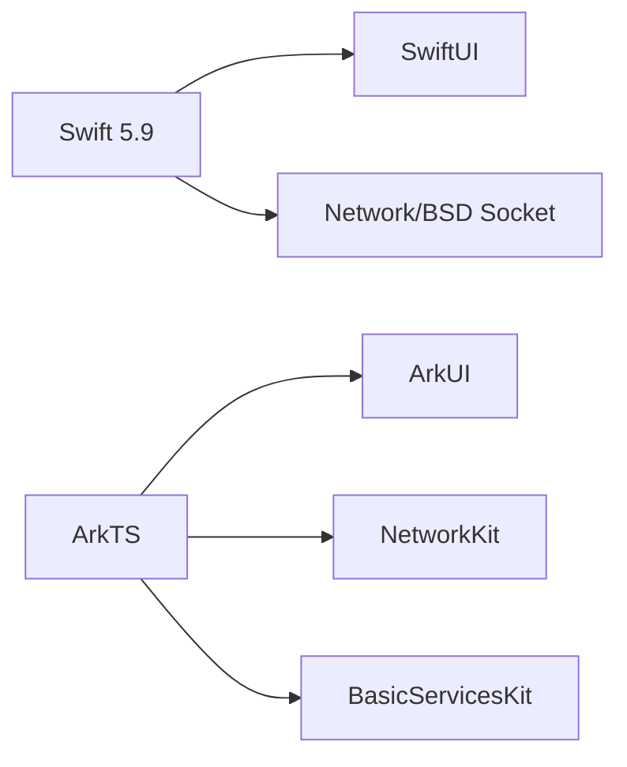

# 项目介绍

<cite>
**本文档引用的文件**
- [PROJECT.md](file://ClipboardSync/PROJECT.md)
- [ClipboardSyncApp.swift](file://ClipboardSync/mac/ClipboardSync/ClipboardSyncApp.swift)
- [SyncManager.swift](file://ClipboardSync/mac/ClipboardSync/SyncManager.swift)
- [MainView.swift](file://ClipboardSync/mac/ClipboardSync/MainView.swift)
- [ClipboardMonitor.swift](file://ClipboardSync/mac/ClipboardSync/ClipboardMonitor.swift)
- [DiscoveryService.swift](file://ClipboardSync/mac/ClipboardSync/DiscoveryService.swift)
- [TCPServer.swift](file://ClipboardSync/mac/ClipboardSync/TCPServer.swift)
- [Protocol.swift](file://ClipboardSync/mac/ClipboardSync/Protocol.swift)
- [EntryAbility.ets](file://ClipboardSync/harmony/entry/src/main/ets/entryability/EntryAbility.ets)
- [SyncManager.ets](file://ClipboardSync/harmony/entry/src/main/ets/model/SyncManager.ets)
- [Index.ets](file://ClipboardSync/harmony/entry/src/main/ets/pages/Index.ets)
- [DiscoveryService.ets](file://ClipboardSync/harmony/entry/src/main/ets/common/DiscoveryService.ets)
- [TCPClient.ets](file://ClipboardSync/harmony/entry/src/main/ets/common/TCPClient.ets)
- [DiscoveryTCPServer.ets](file://ClipboardSync/harmony/entry/src/main/ets/common/DiscoveryTCPServer.ets)
- [Protocol.ets](file://ClipboardSync/harmony/entry/src/main/ets/common/Protocol.ets)
- [Package.swift](file://ClipboardSync/mac/Package.swift)
- [build-profile.json5](file://ClipboardSync/harmony/build-profile.json5)
</cite>

## 目录
1. [引言](#引言)
2. [项目结构](#项目结构)
3. [核心组件](#核心组件)
4. [架构总览](#架构总览)
5. [详细组件分析](#详细组件分析)
6. [依赖关系分析](#依赖关系分析)
7. [性能考量](#性能考量)
8. [故障排查指南](#故障排查指南)
9. [结论](#结论)
10. [附录](#附录)

## 引言
ClipboardSync 是一个面向自用场景的跨平台局域网剪贴板同步工具，旨在实现 Mac 电脑与华为鸿蒙手机之间的实时双向同步。项目采用 Swift + SwiftUI（Mac 端）与 ArkTS + ArkUI（鸿蒙端）的技术组合，通过 UDP 广播发现设备、TCP 长连接传输消息，配合时间戳去重机制，有效避免剪贴板回环与重复写入。

项目定位为个人使用与学习验证项目，不进行商业化发布，强调简洁实用与可维护性。当前已实现文本同步与基础历史记录展示，并在持续完善图片同步、自动发现连接、后台保活等能力。

## 项目结构
项目采用“双端分离”的组织方式，分别在 mac 与 harmony 目录下提供完整的构建与运行配置：

- Mac 端（Swift + SwiftUI）
  - 应用入口与菜单栏集成
  - 剪贴板监听与同步协调
  - 设备发现与 TCP 服务端
  - UI 展示状态与历史记录

- 鸿蒙端（ArkTS + ArkUI）
  - 页面与状态管理
  - 设备发现与 TCP 客户端
  - 剪贴板轮询与消息收发
  - 协议与工具模块共享

图表来源
- [ClipboardSyncApp.swift:1-12](file://ClipboardSync/mac/ClipboardSync/ClipboardSyncApp.swift#L1-L12)
- [SyncManager.swift:1-154](file://ClipboardSync/mac/ClipboardSync/SyncManager.swift#L1-L154)
- [MainView.swift:1-209](file://ClipboardSync/mac/ClipboardSync/MainView.swift#L1-L209)
- [ClipboardMonitor.swift:1-73](file://ClipboardSync/mac/ClipboardSync/ClipboardMonitor.swift#L1-L73)
- [DiscoveryService.swift:1-197](file://ClipboardSync/mac/ClipboardSync/DiscoveryService.swift#L1-L197)
- [TCPServer.swift:1-174](file://ClipboardSync/mac/ClipboardSync/TCPServer.swift#L1-L174)
- [Protocol.swift:1-43](file://ClipboardSync/mac/ClipboardSync/Protocol.swift#L1-L43)
- [EntryAbility.ets:1-38](file://ClipboardSync/harmony/entry/src/main/ets/entryability/EntryAbility.ets#L1-L38)
- [SyncManager.ets:1-301](file://ClipboardSync/harmony/entry/src/main/ets/model/SyncManager.ets#L1-L301)
- [Index.ets:1-226](file://ClipboardSync/harmony/entry/src/main/ets/pages/Index.ets#L1-L226)
- [DiscoveryService.ets:1-161](file://ClipboardSync/harmony/entry/src/main/ets/common/DiscoveryService.ets#L1-L161)
- [TCPClient.ets:1-181](file://ClipboardSync/harmony/entry/src/main/ets/common/TCPClient.ets#L1-L181)
- [DiscoveryTCPServer.ets:1-80](file://ClipboardSync/harmony/entry/src/main/ets/common/DiscoveryTCPServer.ets#L1-L80)
- [Protocol.ets:1-27](file://ClipboardSync/harmony/entry/src/main/ets/common/Protocol.ets#L1-L27)

章节来源
- [PROJECT.md:5-50](file://ClipboardSync/PROJECT.md#L5-L50)
- [Package.swift:1-18](file://ClipboardSync/mac/Package.swift#L1-L18)
- [build-profile.json5:1-43](file://ClipboardSync/harmony/build-profile.json5#L1-L43)

## 核心组件
- Mac 端
  - 应用入口与菜单栏：通过 SwiftUI 构建状态面板与历史列表，应用以 LSUIElement 运行，无 Dock 图标。
  - 同步协调器：统一调度设备发现、TCP 服务端、剪贴板监听，维护状态与历史记录。
  - 剪贴板监听：基于 NSPasteboard 的轮询检测，支持文本与图片（PNG Base64）。
  - 设备发现与 TCP：使用 BSD Socket 监听 UDP 广播，定时发送 ping；同时作为 TCP 服务端接收连接。

- 鸿蒙端
  - 应用生命周期：EntryAbility 管理窗口与前台/后台状态。
  - 同步协调器：负责 UDP 发现、TCP 客户端连接、剪贴板轮询与消息收发。
  - 页面 UI：展示状态、手动连接与同步历史，支持断开/刷新操作。
  - 协议与网络：共享协议定义，使用 NetworkKit 的 UDPSocket/TCPSocket 实现通信。

章节来源
- [MainView.swift:1-209](file://ClipboardSync/mac/ClipboardSync/MainView.swift#L1-L209)
- [SyncManager.swift:1-154](file://ClipboardSync/mac/ClipboardSync/SyncManager.swift#L1-L154)
- [ClipboardMonitor.swift:1-73](file://ClipboardSync/mac/ClipboardSync/ClipboardMonitor.swift#L1-L73)
- [DiscoveryService.swift:1-197](file://ClipboardSync/mac/ClipboardSync/DiscoveryService.swift#L1-L197)
- [TCPServer.swift:1-174](file://ClipboardSync/mac/ClipboardSync/TCPServer.swift#L1-L174)
- [Index.ets:1-226](file://ClipboardSync/harmony/entry/src/main/ets/pages/Index.ets#L1-L226)
- [SyncManager.ets:1-301](file://ClipboardSync/harmony/entry/src/main/ets/model/SyncManager.ets#L1-L301)
- [EntryAbility.ets:1-38](file://ClipboardSync/harmony/entry/src/main/ets/entryability/EntryAbility.ets#L1-L38)

## 架构总览
系统采用“双端对等发现 + TCP 长连接”的通信模型。Mac 端作为 TCP 服务端，鸿蒙端作为 TCP 客户端；两者通过 UDP 广播进行设备发现与连接建立。消息采用 JSON + 换行分隔的帧格式，携带类型、内容、时间戳与 MIME 类型，确保去重与跨端兼容。

图表来源
- [DiscoveryService.swift:104-146](file://ClipboardSync/mac/ClipboardSync/DiscoveryService.swift#L104-L146)
- [DiscoveryService.ets:87-124](file://ClipboardSync/harmony/entry/src/main/ets/common/DiscoveryService.ets#L87-L124)
- [TCPServer.swift:23-51](file://ClipboardSync/mac/ClipboardSync/TCPServer.swift#L23-L51)
- [TCPClient.ets:30-42](file://ClipboardSync/harmony/entry/src/main/ets/common/TCPClient.ets#L30-L42)
- [SyncManager.swift:95-115](file://ClipboardSync/mac/ClipboardSync/SyncManager.swift#L95-L115)
- [SyncManager.ets:178-198](file://ClipboardSync/harmony/entry/src/main/ets/model/SyncManager.ets#L178-L198)

## 详细组件分析

### Mac 端组件分析
- 应用入口与菜单栏
  - 通过 ClipboardSyncApp.swift 注入 AppDelegate，实现菜单栏运行与设置场景。
- 同步协调器
  - 统一管理设备发现、TCP 服务端与剪贴板监听，维护状态与历史记录。
  - 去重机制：基于时间戳过滤重复消息，避免回环。
- 剪贴板监听
  - 轮询检测 changeCount，优先读取文本，其次尝试图片转换为 PNG。
- 设备发现与 TCP
  - UDP 监听与广播，定时发送 ping；TCP 服务端监听连接，按换行分隔解析消息。

图表来源
- [SyncManager.swift:1-154](file://ClipboardSync/mac/ClipboardSync/SyncManager.swift#L1-L154)
- [ClipboardMonitor.swift:1-73](file://ClipboardSync/mac/ClipboardSync/ClipboardMonitor.swift#L1-L73)
- [TCPServer.swift:1-174](file://ClipboardSync/mac/ClipboardSync/TCPServer.swift#L1-L174)
- [DiscoveryService.swift:1-197](file://ClipboardSync/mac/ClipboardSync/DiscoveryService.swift#L1-L197)

章节来源
- [ClipboardSyncApp.swift:1-12](file://ClipboardSync/mac/ClipboardSync/ClipboardSyncApp.swift#L1-L12)
- [SyncManager.swift:1-154](file://ClipboardSync/mac/ClipboardSync/SyncManager.swift#L1-L154)
- [MainView.swift:1-209](file://ClipboardSync/mac/ClipboardSync/MainView.swift#L1-L209)
- [ClipboardMonitor.swift:1-73](file://ClipboardSync/mac/ClipboardSync/ClipboardMonitor.swift#L1-L73)
- [DiscoveryService.swift:1-197](file://ClipboardSync/mac/ClipboardSync/DiscoveryService.swift#L1-L197)
- [TCPServer.swift:1-174](file://ClipboardSync/mac/ClipboardSync/TCPServer.swift#L1-L174)

### 鸿蒙端组件分析
- 应用生命周期
  - EntryAbility 管理窗口加载与前后台切换，确保 UI 正常渲染。
- 同步协调器
  - 负责 UDP 发现、TCP 客户端连接、剪贴板轮询与消息收发。
  - 去重与历史记录管理，支持手动连接与断线重连。
- 页面 UI
  - 展示状态、手动连接与同步历史，支持断开/刷新操作。
- 协议与网络
  - 共享协议定义，使用 NetworkKit 的 UDPSocket/TCPSocket 实现通信。

图表来源
- [SyncManager.ets:1-301](file://ClipboardSync/harmony/entry/src/main/ets/model/SyncManager.ets#L1-L301)
- [TCPClient.ets:1-181](file://ClipboardSync/harmony/entry/src/main/ets/common/TCPClient.ets#L1-L181)
- [DiscoveryService.ets:1-161](file://ClipboardSync/harmony/entry/src/main/ets/common/DiscoveryService.ets#L1-L161)
- [DiscoveryTCPServer.ets:1-80](file://ClipboardSync/harmony/entry/src/main/ets/common/DiscoveryTCPServer.ets#L1-L80)

章节来源
- [EntryAbility.ets:1-38](file://ClipboardSync/harmony/entry/src/main/ets/entryability/EntryAbility.ets#L1-L38)
- [SyncManager.ets:1-301](file://ClipboardSync/harmony/entry/src/main/ets/model/SyncManager.ets#L1-L301)
- [Index.ets:1-226](file://ClipboardSync/harmony/entry/src/main/ets/pages/Index.ets#L1-L226)
- [DiscoveryService.ets:1-161](file://ClipboardSync/harmony/entry/src/main/ets/common/DiscoveryService.ets#L1-L161)
- [TCPClient.ets:1-181](file://ClipboardSync/harmony/entry/src/main/ets/common/TCPClient.ets#L1-L181)
- [DiscoveryTCPServer.ets:1-80](file://ClipboardSync/harmony/entry/src/main/ets/common/DiscoveryTCPServer.ets#L1-L80)

### 通信协议与消息流程
- 协议常量
  - UDP 广播端口、TCP 数据端口、TCP 发现端口、广播间隔、轮询间隔与设备 ID。
- 消息结构
  - 包含类型、内容、时间戳、设备 ID 与 MIME 类型，采用 JSON 编解码。
- 去重机制
  - 接收端根据时间戳判断是否处理，避免写入剪贴板后触发监听回环。

图表来源
- [Protocol.swift:27-42](file://ClipboardSync/mac/ClipboardSync/Protocol.swift#L27-L42)
- [Protocol.ets:19-26](file://ClipboardSync/harmony/entry/src/main/ets/common/Protocol.ets#L19-L26)
- [SyncManager.swift:95-115](file://ClipboardSync/mac/ClipboardSync/SyncManager.swift#L95-L115)
- [SyncManager.ets:178-198](file://ClipboardSync/harmony/entry/src/main/ets/model/SyncManager.ets#L178-L198)

章节来源
- [Protocol.swift:1-43](file://ClipboardSync/mac/ClipboardSync/Protocol.swift#L1-L43)
- [Protocol.ets:1-27](file://ClipboardSync/harmony/entry/src/main/ets/common/Protocol.ets#L1-L27)

## 依赖关系分析
- 语言与框架
  - Mac：Swift 5.9 + SwiftUI + Network/BSD Socket
  - 鸿蒙：ArkTS + ArkUI + NetworkKit + BasicServicesKit
- 构建与配置
  - Mac：SPM 包管理，macOS 13+
  - 鸿蒙：DevEco Studio 6.1+，API 23（6.1.0）

图表来源
- [Package.swift:1-18](file://ClipboardSync/mac/Package.swift#L1-L18)
- [build-profile.json5:18-27](file://ClipboardSync/harmony/build-profile.json5#L18-L27)

章节来源
- [Package.swift:1-18](file://ClipboardSync/mac/Package.swift#L1-L18)
- [build-profile.json5:1-43](file://ClipboardSync/harmony/build-profile.json5#L1-L43)

## 性能考量
- 轮询策略
  - Mac 与鸿蒙均采用短周期轮询检测剪贴板变化，兼顾实时性与资源消耗。
- TCP 拆包与粘包
  - 采用换行符分隔消息，结合缓冲区拼接与逐行解析，提升稳定性。
- 去重与回环控制
  - 基于时间戳的去重机制有效避免重复写入与回环，减少无效网络流量。
- 后续优化建议
  - 图片同步：实现图片接收与写入，降低传输体积。
  - 后台保活：申请连续任务，提升后台同步可靠性。
  - 端到端加密：增强传输安全性。

## 故障排查指南
- 鸿蒙端 TCP 连接报错
  - 现象：连接状态异常或频繁断开
  - 原因：socket.close() 异步导致旧连接未完全释放
  - 处理：先断开旧连接，延迟后再创建新实例并连接
- 鸿蒙端 Socket 错误类型缺失
  - 现象：on('error') 参数类型不可用
  - 处理：改用 BusinessError 类型
- Mac 端 SDK 版本类型错误
  - 现象：构建失败
  - 处理：将版本号改为字符串格式
- Mac 端 SyncManager 启动时机
  - 现象：首次启动未自动开始
  - 处理：在 AppDelegate 中直接调用 start()

章节来源
- [SyncManager.ets:129-174](file://ClipboardSync/harmony/entry/src/main/ets/model/SyncManager.ets#L129-L174)
- [SyncManager.swift:117-142](file://ClipboardSync/mac/ClipboardSync/SyncManager.swift#L117-L142)

## 结论
ClipboardSync 以简洁稳定的架构实现了 Mac 与鸿蒙设备间的局域网剪贴板同步。通过 UDP 广播与 TCP 长连接的组合，以及完善的去重与历史记录机制，满足日常跨端高效复制粘贴的需求。项目采用 Swift + SwiftUI 与 ArkTS + ArkUI 的技术组合，既保证了开发效率，又兼顾了平台特性。未来将持续完善自动发现、图片同步、后台保活与安全加密等能力，进一步提升用户体验与可靠性。

## 附录
- 基本使用场景示例
  - Mac 端复制文本：在 Mac 上复制任意文本，鸿蒙端自动写入系统剪贴板，无需手动操作。
  - 鸿蒙端复制文本：在鸿蒙端复制任意文本，Mac 端自动写入系统剪贴板，实时可用。
  - 手动连接：当自动发现不生效时，可在鸿蒙端手动输入 Mac 的局域网 IP 地址进行连接。
  - 查看历史：两端 UI 均展示最近 50 条同步记录，便于追溯与核对。

章节来源
- [PROJECT.md:64-101](file://ClipboardSync/PROJECT.md#L64-L101)
- [MainView.swift:135-209](file://ClipboardSync/mac/ClipboardSync/MainView.swift#L135-L209)
- [Index.ets:117-185](file://ClipboardSync/harmony/entry/src/main/ets/pages/Index.ets#L117-L185)