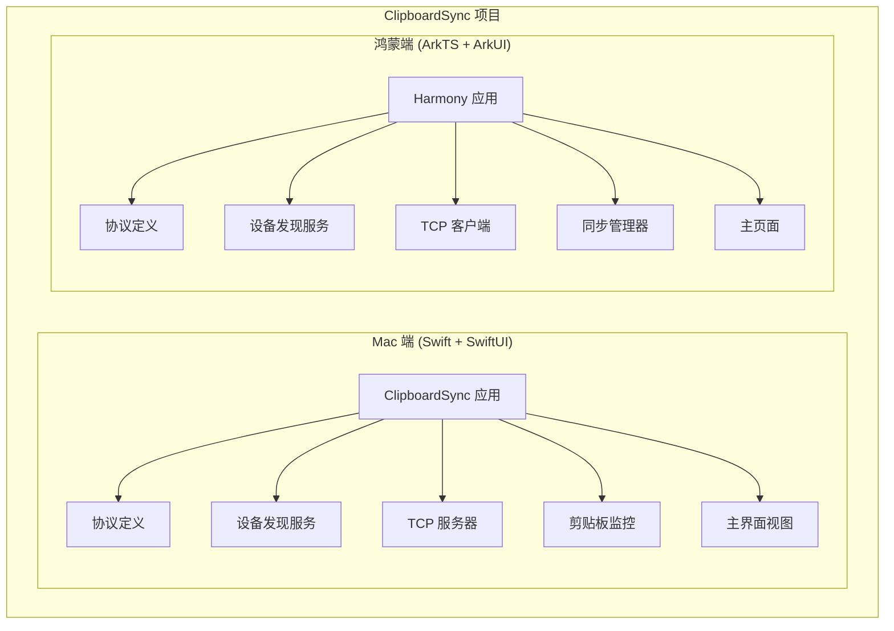
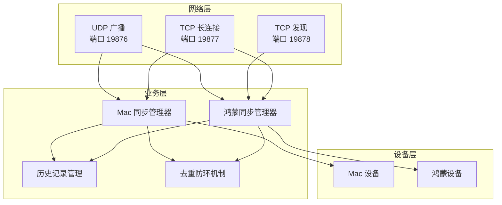
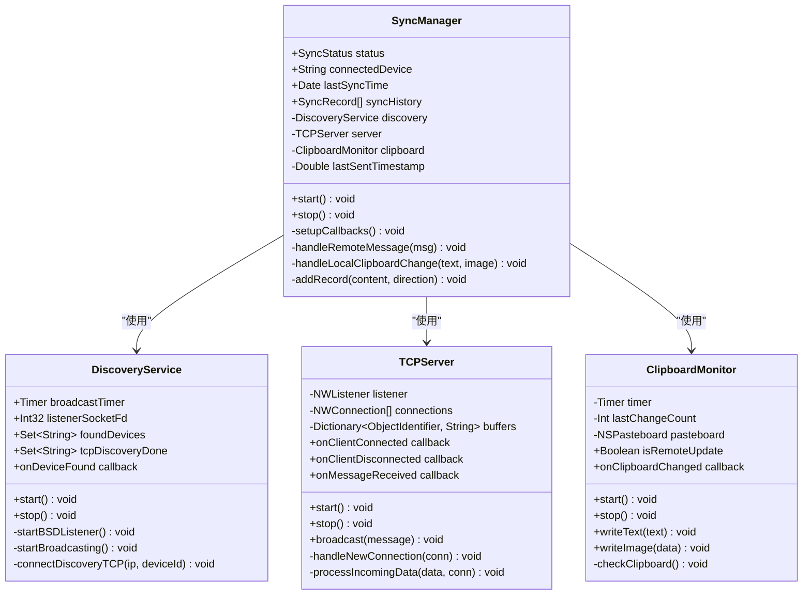
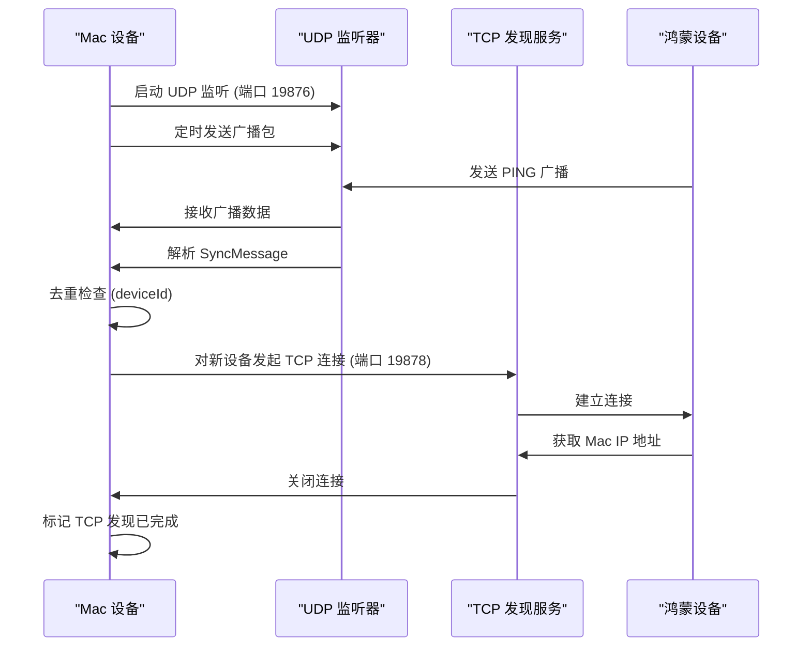
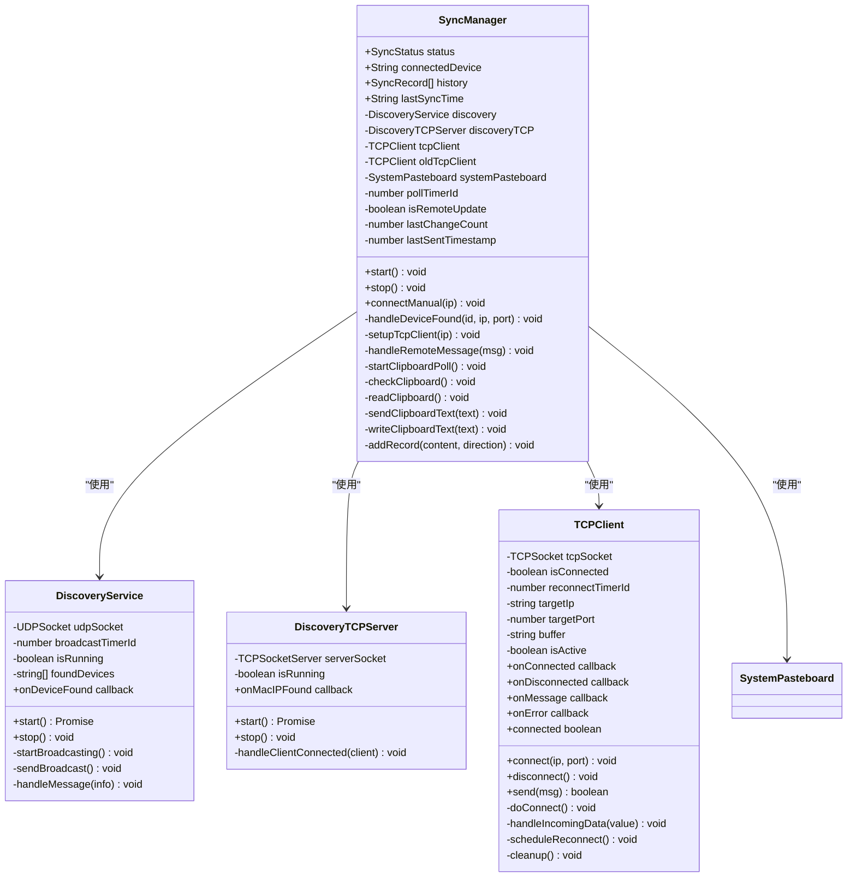
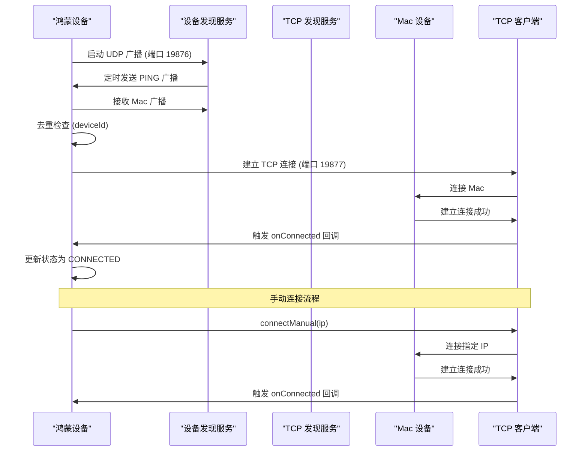
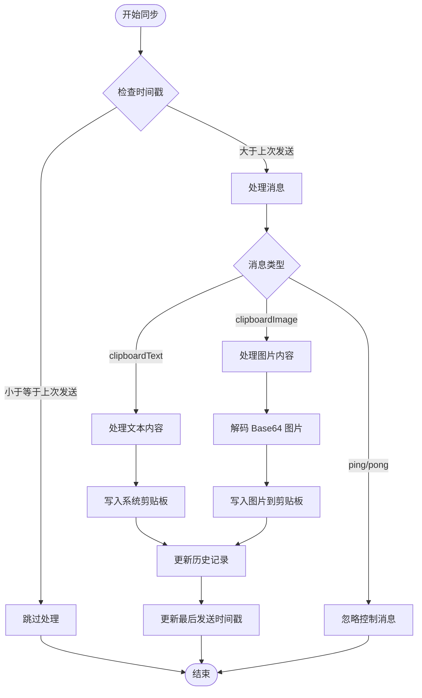
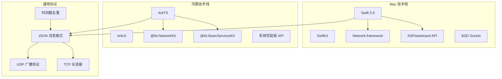

# 项目概述

<cite>
**本文档引用的文件**
- [PROJECT.md](file://ClipboardSync/PROJECT.md)
- [Package.swift](file://ClipboardSync/mac/Package.swift)
- [build-profile.json5](file://ClipboardSync/harmony/build-profile.json5)
- [Protocol.swift](file://ClipboardSync/mac/ClipboardSync/Protocol.swift)
- [Protocol.ets](file://ClipboardSync/harmony/entry/src/main/ets/common/Protocol.ets)
- [SyncManager.swift](file://ClipboardSync/mac/ClipboardSync/SyncManager.swift)
- [SyncManager.ets](file://ClipboardSync/harmony/entry/src/main/ets/model/SyncManager.ets)
- [DiscoveryService.swift](file://ClipboardSync/mac/ClipboardSync/DiscoveryService.swift)
- [DiscoveryService.ets](file://ClipboardSync/harmony/entry/src/main/ets/common/DiscoveryService.ets)
- [DiscoveryTCPServer.ets](file://ClipboardSync/harmony/entry/src/main/ets/common/DiscoveryTCPServer.ets)
- [TCPServer.swift](file://ClipboardSync/mac/ClipboardSync/TCPServer.swift)
- [TCPClient.ets](file://ClipboardSync/harmony/entry/src/main/ets/common/TCPClient.ets)
- [ClipboardMonitor.swift](file://ClipboardSync/mac/ClipboardSync/ClipboardMonitor.swift)
- [MainView.swift](file://ClipboardSync/mac/ClipboardSync/MainView.swift)
- [Index.ets](file://ClipboardSync/harmony/entry/src/main/ets/pages/Index.ets)
- [AppDelegate.swift](file://ClipboardSync/mac/ClipboardSync/AppDelegate.swift)
</cite>

## 目录
1. [简介](#简介)
2. [项目结构](#项目结构)
3. [核心组件](#核心组件)
4. [架构总览](#架构总览)
5. [详细组件分析](#详细组件分析)
6. [依赖关系分析](#依赖关系分析)
7. [性能考虑](#性能考虑)
8. [故障排除指南](#故障排除指南)
9. [结论](#结论)
10. [附录](#附录)

## 简介
ClipboardSync 是一个实现 Mac 与华为鸿蒙手机之间局域网实时剪贴板同步的跨平台项目。项目采用双端架构：Mac 端使用 Swift + SwiftUI，鸿蒙端使用 ArkTS + ArkUI。通过 UDP 广播发现设备、TCP 长连接传输数据，实现双向文本同步，并具备自动设备发现、去重防环、历史记录管理等特性。

## 项目结构
项目采用按端分离的目录组织方式，分别包含 Mac 端和鸿蒙端的完整实现：

**图表来源**
- [PROJECT.md:5-50](file://ClipboardSync/PROJECT.md#L5-L50)

项目采用模块化设计，每个组件职责清晰：
- 协议层：统一的消息格式和端口定义
- 发现层：基于 UDP 的设备发现机制
- 传输层：基于 TCP 的可靠数据传输
- 业务层：同步逻辑和 UI 展示

**章节来源**
- [PROJECT.md:5-50](file://ClipboardSync/PROJECT.md#L5-L50)

## 核心组件
项目的核心由四个主要组件构成，它们协同工作实现完整的剪贴板同步功能：

### 协议层 (Protocol)
负责定义通信协议常量、消息类型和数据结构，确保两端协议一致性。

### 发现层 (Discovery)
实现基于 UDP 的设备发现机制，通过定时广播和监听实现设备间的自动发现。

### 传输层 (TCP)
提供可靠的 TCP 连接管理，支持多客户端连接和消息帧处理。

### 业务层 (SyncManager)
协调各个模块的工作，处理业务逻辑和状态管理。

**章节来源**
- [Protocol.swift:1-43](file://ClipboardSync/mac/ClipboardSync/Protocol.swift#L1-L43)
- [Protocol.ets:1-27](file://ClipboardSync/harmony/entry/src/main/ets/common/Protocol.ets#L1-L27)
- [SyncManager.swift:1-154](file://ClipboardSync/mac/ClipboardSync/SyncManager.swift#L1-L154)
- [SyncManager.ets:1-301](file://ClipboardSync/harmony/entry/src/main/ets/model/SyncManager.ets#L1-L301)

## 架构总览
项目采用客户端-服务器架构，Mac 端作为 TCP 服务器，鸿蒙端作为 TCP 客户端。整体架构分为三层：协议层、传输层和业务层。

**图表来源**
- [PROJECT.md:52-63](file://ClipboardSync/PROJECT.md#L52-L63)
- [DiscoveryService.swift:150-180](file://ClipboardSync/mac/ClipboardSync/DiscoveryService.swift#L150-L180)
- [DiscoveryTCPServer.ets:18-49](file://ClipboardSync/harmony/entry/src/main/ets/common/DiscoveryTCPServer.ets#L18-L49)

## 详细组件分析

### Mac 端架构分析

#### 同步管理器 (SyncManager)
Mac 端的 SyncManager 是整个系统的协调中心，负责管理设备发现、TCP 连接和剪贴板监控。

**图表来源**
- [SyncManager.swift:4-93](file://ClipboardSync/mac/ClipboardSync/SyncManager.swift#L4-L93)
- [DiscoveryService.swift:6-30](file://ClipboardSync/mac/ClipboardSync/DiscoveryService.swift#L6-L30)
- [TCPServer.swift:6-21](file://ClipboardSync/mac/ClipboardSync/TCPServer.swift#L6-L21)
- [ClipboardMonitor.swift:4-14](file://ClipboardSync/mac/ClipboardSync/ClipboardMonitor.swift#L4-L14)

#### 设备发现流程 (Mac 端)
Mac 端通过 BSD Socket 实现 UDP 广播和监听，同时建立 TCP 发现连接。

**图表来源**
- [DiscoveryService.swift:33-100](file://ClipboardSync/mac/ClipboardSync/DiscoveryService.swift#L33-L100)
- [DiscoveryService.swift:150-180](file://ClipboardSync/mac/ClipboardSync/DiscoveryService.swift#L150-L180)

**章节来源**
- [SyncManager.swift:36-93](file://ClipboardSync/mac/ClipboardSync/SyncManager.swift#L36-L93)
- [DiscoveryService.swift:15-100](file://ClipboardSync/mac/ClipboardSync/DiscoveryService.swift#L15-L100)

### 鸿蒙端架构分析

#### 同步管理器 (SyncManager)
鸿蒙端的 SyncManager 实现了更复杂的连接管理逻辑，包括自动发现、手动连接和重连机制。

**图表来源**
- [SyncManager.ets:26-98](file://ClipboardSync/harmony/entry/src/main/ets/model/SyncManager.ets#L26-L98)
- [DiscoveryService.ets:10-85](file://ClipboardSync/harmony/entry/src/main/ets/common/DiscoveryService.ets#L10-L85)
- [TCPClient.ets:11-60](file://ClipboardSync/harmony/entry/src/main/ets/common/TCPClient.ets#L11-L60)
- [DiscoveryTCPServer.ets:11-49](file://ClipboardSync/harmony/entry/src/main/ets/common/DiscoveryTCPServer.ets#L11-L49)

#### TCP 连接建立流程 (鸿蒙端)
鸿蒙端通过多种方式建立与 Mac 端的 TCP 连接，包括自动发现和手动连接。

**图表来源**
- [SyncManager.ets:72-98](file://ClipboardSync/harmony/entry/src/main/ets/model/SyncManager.ets#L72-L98)
- [SyncManager.ets:129-174](file://ClipboardSync/harmony/entry/src/main/ets/model/SyncManager.ets#L129-L174)
- [TCPClient.ets:30-42](file://ClipboardSync/harmony/entry/src/main/ets/common/TCPClient.ets#L30-L42)

**章节来源**
- [SyncManager.ets:99-174](file://ClipboardSync/harmony/entry/src/main/ets/model/SyncManager.ets#L99-L174)
- [TCPClient.ets:60-113](file://ClipboardSync/harmony/entry/src/main/ets/common/TCPClient.ets#L60-L113)

### 通信协议分析

#### 消息格式和去重机制
项目采用统一的 JSON 消息格式，包含类型、内容、时间戳、设备 ID 和 MIME 类型等字段。

**图表来源**
- [SyncManager.swift:95-115](file://ClipboardSync/mac/ClipboardSync/SyncManager.swift#L95-L115)
- [SyncManager.ets:178-198](file://ClipboardSync/harmony/entry/src/main/ets/model/SyncManager.ets#L178-L198)

**章节来源**
- [Protocol.swift:28-42](file://ClipboardSync/mac/ClipboardSync/Protocol.swift#L28-L42)
- [Protocol.ets:20-26](file://ClipboardSync/harmony/entry/src/main/ets/common/Protocol.ets#L20-L26)

## 依赖关系分析

### 技术栈概览
项目采用现代跨平台技术栈，两端分别使用各自生态的最佳实践：

**图表来源**
- [PROJECT.md:154-169](file://ClipboardSync/PROJECT.md#L154-L169)

### 项目构建配置
两端都采用了现代化的构建配置方式：

**Mac 端构建配置**
- 使用 Swift Package Manager (SPM)
- 支持 macOS 13+
- 可执行目标配置

**鸿蒙端构建配置**
- 使用 DevEco Studio 6.1+
- HarmonyOS SDK API 23
- 模块化工程结构

**章节来源**
- [Package.swift:1-18](file://ClipboardSync/mac/Package.swift#L1-L18)
- [build-profile.json5:1-43](file://ClipboardSync/harmony/build-profile.json5#L1-L43)

## 性能考虑
项目在设计时充分考虑了性能和资源使用效率：

### 剪贴板轮询优化
- Mac 端使用 0.5 秒轮询间隔，平衡响应速度和 CPU 占用
- 鸿蒙端使用 500 毫秒轮询间隔，避免频繁系统调用
- 实现去重检查，避免重复处理相同内容

### 网络传输优化
- TCP 使用换行符分隔消息，简化粘包处理
- 采用缓冲区管理，支持大数据消息的可靠传输
- 实现自动重连机制，提高连接稳定性

### 内存管理
- 历史记录限制为 50 条，避免内存无限增长
- 使用弱引用避免循环引用
- 及时清理定时器和网络连接

## 故障排除指南

### 常见问题及解决方案

#### 鸿蒙端 TCP 连接问题
**问题描述**：`Operation in progress` 错误
**根本原因**：`socket.close()` 异步操作导致新连接创建时机不当
**解决方案**：在创建新连接前先断开旧连接，延迟 500ms 后再连接

#### 鸿蒙端 Socket 错误类型问题
**问题描述**：`socket.SocketErrorInfo` 不存在
**根本原因**：API 23 中缺少该类型导出
**解决方案**：使用 `BusinessError` 替代

#### Mac 端构建配置问题
**问题描述**：SDK 版本类型错误
**根本原因**：`compileSdkVersion` 必须为字符串类型
**解决方案**：使用 `"6.1.0(23)"` 而非 `23`

**章节来源**
- [PROJECT.md:102-127](file://ClipboardSync/PROJECT.md#L102-L127)

### 状态监控和诊断
项目提供了完善的诊断信息输出：
- 设备发现日志：显示发现的设备信息和连接状态
- TCP 连接日志：记录连接建立、断开和错误信息
- 同步历史：记录最近 50 条同步记录，便于问题追踪

## 结论
ClipboardSync 项目成功实现了 Mac 与鸿蒙设备间的局域网剪贴板同步，具有以下特点：

### 技术优势
- **跨平台兼容**：两端分别使用原生技术栈，充分利用平台特性
- **协议统一**：通过共享协议定义确保两端兼容性
- **去重机制**：有效防止同步回环和重复处理
- **历史记录**：提供完整的同步历史追踪能力

### 功能完整性
- 实现了双向文本同步的核心功能
- 支持自动设备发现和手动连接两种模式
- 具备基本的图片同步能力（文本为主）
- 提供直观的 UI 界面和状态指示

### 发展前景
项目目前处于可用版本，但仍有一些改进空间：
- 完善 UDP 自动发现连接功能
- 增强图片和其他媒体类型的同步支持
- 优化用户体验和后台保活机制
- 考虑安全性和扩展性需求

## 附录

### 通信端口说明
| 功能 | 协议 | 端口 | 用途 |
|------|------|------|------|
| 设备发现 | UDP | 19876 | 双端定时广播发现 |
| 数据传输 | TCP | 19877 | 正常剪贴板数据传输 |
| TCP 发现 | TCP | 19878 | Mac IP 地址发现 |

### 消息类型定义
- `clipboardText`：文本剪贴板内容
- `clipboardImage`：图片剪贴板内容（Base64 编码）
- `ping/pong`：设备心跳和控制消息

### 开发环境要求
- **Mac 端**：Xcode Command Line Tools (Swift 5.9+) + macOS 13+
- **鸿蒙端**：DevEco Studio 6.1+ + HarmonyOS SDK API 23
- **网络环境**：同一局域网内的稳定网络连接