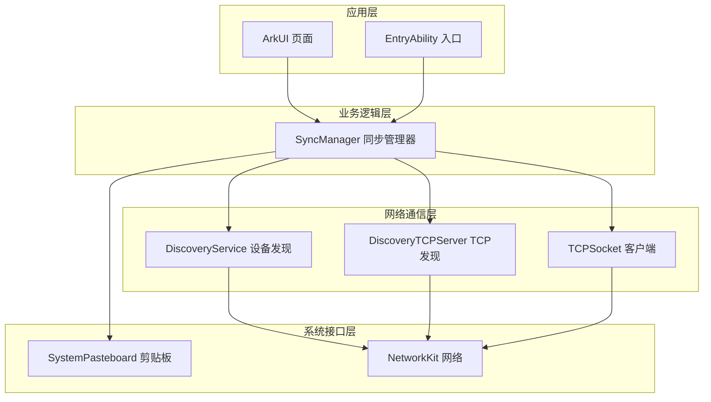
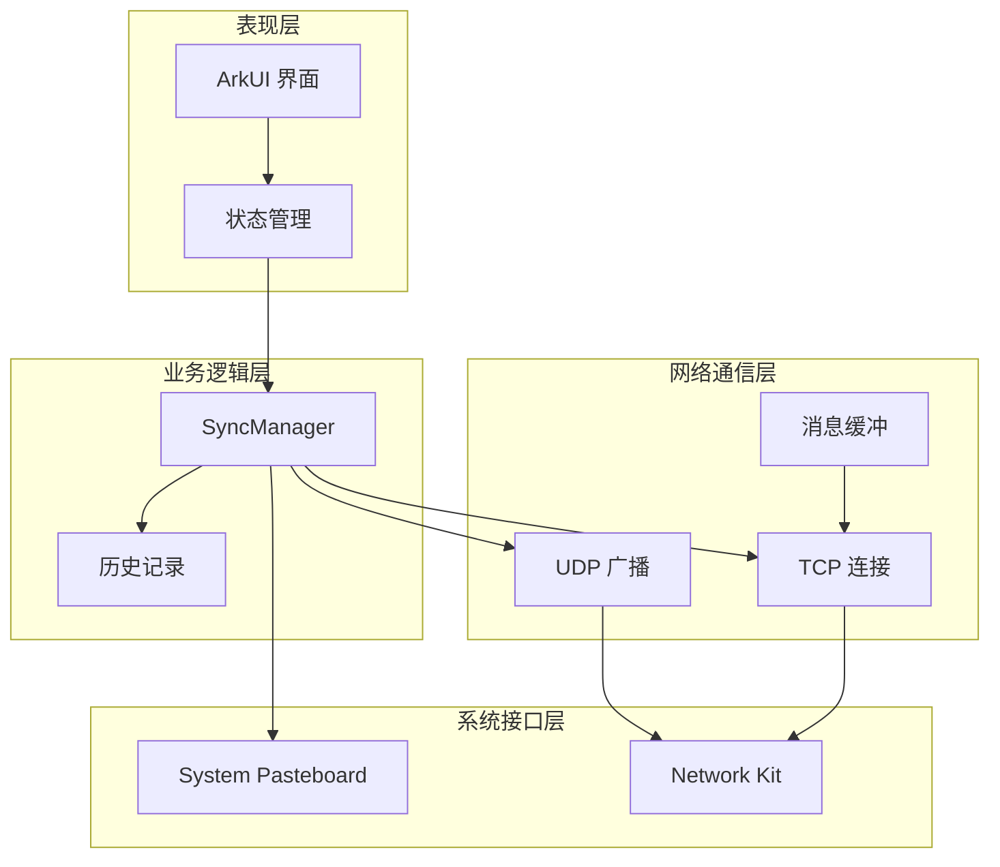
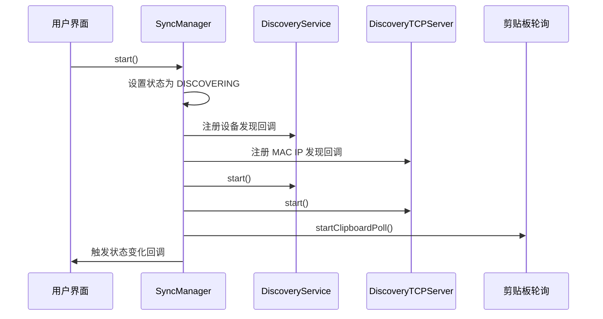
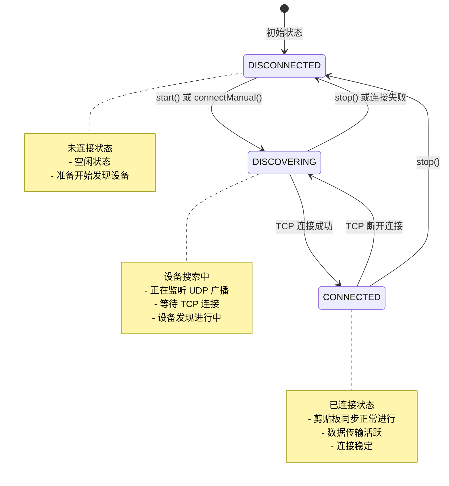
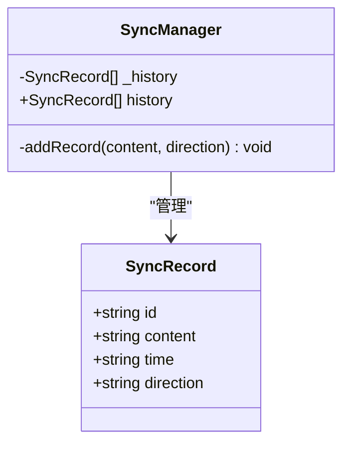
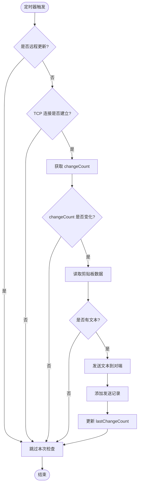
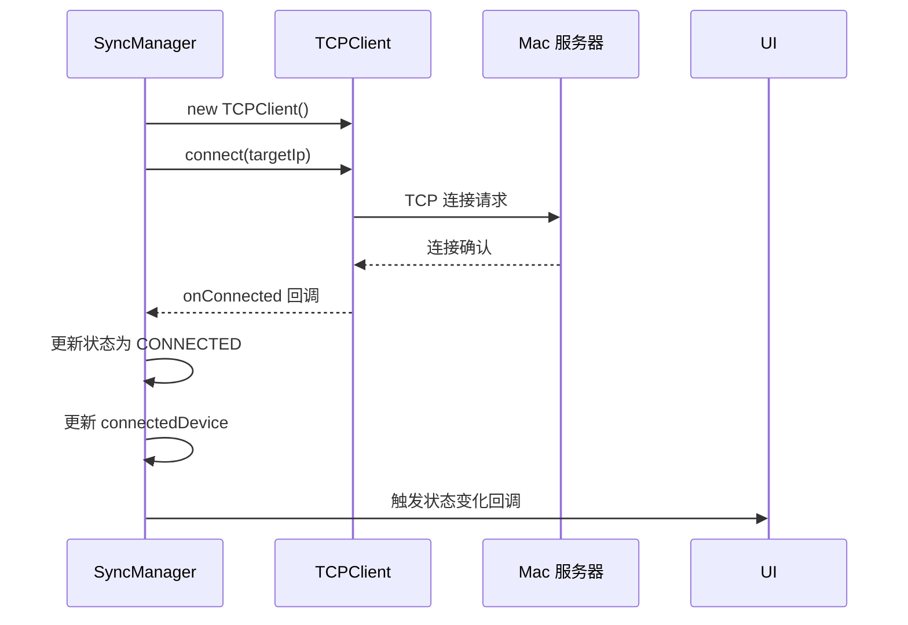
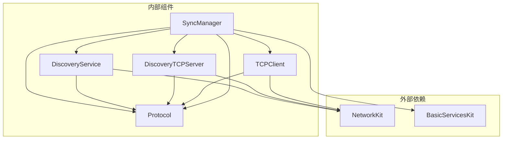

# 同步管理器详解

<cite>
**本文档引用的文件**
- [SyncManager.ets](file://ClipboardSync/harmony/entry/src/main/ets/model/SyncManager.ets)
- [DiscoveryService.ets](file://ClipboardSync/harmony/entry/src/main/ets/common/DiscoveryService.ets)
- [DiscoveryTCPServer.ets](file://ClipboardSync/harmony/entry/src/main/ets/common/DiscoveryTCPServer.ets)
- [TCPClient.ets](file://ClipboardSync/harmony/entry/src/main/ets/common/TCPClient.ets)
- [Protocol.ets](file://ClipboardSync/harmony/entry/src/main/ets/common/Protocol.ets)
- [Index.ets](file://ClipboardSync/harmony/entry/src/main/ets/pages/Index.ets)
- [EntryAbility.ets](file://ClipboardSync/harmony/entry/src/main/ets/entryability/EntryAbility.ets)
- [PROJECT.md](file://ClipboardSync/PROJECT.md)
</cite>

## 目录
1. [简介](#简介)
2. [项目结构](#项目结构)
3. [核心组件](#核心组件)
4. [架构概览](#架构概览)
5. [详细组件分析](#详细组件分析)
6. [依赖关系分析](#依赖关系分析)
7. [性能考虑](#性能考虑)
8. [故障排除指南](#故障排除指南)
9. [结论](#结论)

## 简介

ClipboardSync 是一个跨平台的剪贴板同步工具，实现了 Mac 电脑与鸿蒙手机之间的实时剪贴板数据同步。该系统采用双向同步架构，支持文本和图片内容的实时传输，并提供了完整的设备发现、连接管理和状态监控功能。

系统基于局域网通信，使用 UDP 广播进行设备发现，通过 TCP 长连接进行数据传输，确保了低延迟和高可靠性的同步体验。项目采用模块化设计，将网络通信、设备发现、剪贴板操作和 UI 管理分离，便于维护和扩展。

## 项目结构

项目采用分层架构设计，主要分为以下层次：



**图表来源**
- [SyncManager.ets:1-301](file://ClipboardSync/harmony/entry/src/main/ets/model/SyncManager.ets#L1-L301)
- [DiscoveryService.ets:1-161](file://ClipboardSync/harmony/entry/src/main/ets/common/DiscoveryService.ets#L1-L161)
- [TCPClient.ets:1-181](file://ClipboardSync/harmony/entry/src/main/ets/common/TCPClient.ets#L1-L181)

**章节来源**
- [PROJECT.md:52-59](file://ClipboardSync/PROJECT.md#L52-L59)
- [SyncManager.ets:26-301](file://ClipboardSync/harmony/entry/src/main/ets/model/SyncManager.ets#L26-L301)

## 核心组件

### SyncManager 同步管理器

SyncManager 是整个系统的中枢控制器，负责协调各个子系统的协作。它维护着完整的同步状态，包括设备发现、TCP 连接管理和剪贴板操作。

#### 核心职责
- **设备发现协调**：管理 UDP 广播和 TCP 发现服务
- **连接生命周期管理**：建立、维护和断开 TCP 连接
- **剪贴板监控**：轮询系统剪贴板变化并进行同步
- **状态管理**：维护 SyncStatus 枚举状态和连接设备信息
- **历史记录管理**：存储和展示同步历史

#### 关键属性
- `_status`: 当前同步状态（DISCONNECTED/DISCOVERING/CONNECTED）
- `_connectedDevice`: 当前连接的设备 IP 地址
- `_history`: 同步历史记录数组（最多 50 条）
- `onStateChange`: 状态变化回调函数

**章节来源**
- [SyncManager.ets:15-71](file://ClipboardSync/harmony/entry/src/main/ets/model/SyncManager.ets#L15-L71)
- [SyncManager.ets:26-60](file://ClipboardSync/harmony/entry/src/main/ets/model/SyncManager.ets#L26-L60)

### 设备发现服务

系统采用双重发现机制来确保设备连接的可靠性：

#### UDP 广播发现
- 使用 19876 端口进行广播
- 定时发送 PING 消息探测其他设备
- 实现设备去重机制，避免重复连接同一设备

#### TCP 发现服务
- 监听 19878 端口等待 Mac 端连接
- 专门解决 UDP 广播无法从 Mac 到达鸿蒙的问题
- 通过连接的远程地址获取 Mac 的真实 IP

**章节来源**
- [DiscoveryService.ets:10-161](file://ClipboardSync/harmony/entry/src/main/ets/common/DiscoveryService.ets#L10-L161)
- [DiscoveryTCPServer.ets:11-80](file://ClipboardSync/harmony/entry/src/main/ets/common/DiscoveryTCPServer.ets#L11-L80)

### TCP 客户端

TCP 客户端负责与 Mac 端建立稳定的长连接，支持自动重连机制：

#### 连接特性
- 使用 19877 端口进行数据传输
- 采用 JSON + 换行符的协议格式
- 实现粘包处理和消息边界识别
- 支持 5 秒自动重连机制

#### 错误处理
- 捕获连接超时和网络错误
- 实现优雅的连接断开和资源清理
- 提供详细的错误日志和诊断信息

**章节来源**
- [TCPClient.ets:11-181](file://ClipboardSync/harmony/entry/src/main/ets/common/TCPClient.ets#L11-L181)

### 协议定义

系统采用统一的通信协议，确保两端兼容性：

#### 协议常量
- `BROADCAST_PORT`: 19876 - UDP 广播端口
- `WS_PORT`: 19877 - TCP 数据传输端口  
- `DISCOVERY_TCP_PORT`: 19878 - TCP 发现端口
- `DEVICE_ID`: 随机生成的设备标识符

#### 消息类型
- `CLIPBOARD_TEXT`: 文本剪贴板数据
- `CLIPBOARD_IMAGE`: 图片剪贴板数据
- `PING/PONG`: 心跳和响应消息

**章节来源**
- [Protocol.ets:2-27](file://ClipboardSync/harmony/entry/src/main/ets/common/Protocol.ets#L2-L27)

## 架构概览

系统采用分层架构，各层职责明确，耦合度低：



**图表来源**
- [SyncManager.ets:72-174](file://ClipboardSync/harmony/entry/src/main/ets/model/SyncManager.ets#L72-L174)
- [Index.ets:13-27](file://ClipboardSync/harmony/entry/src/main/ets/pages/Index.ets#L13-L27)

## 详细组件分析

### SyncManager 生命周期管理

SyncManager 采用完整的生命周期管理模式，确保资源的有效管理和释放。

#### 启动流程 (start())
启动过程包含三个核心步骤：

1. **状态初始化**：设置状态为 DISCOVERING 并触发 UI 更新
2. **设备发现启动**：启动 UDP 广播和 TCP 发现服务
3. **剪贴板监控**：启动定时轮询机制



**图表来源**
- [SyncManager.ets:72-98](file://ClipboardSync/harmony/entry/src/main/ets/model/SyncManager.ets#L72-L98)

#### 停止机制 (stop())
停止过程确保所有资源得到正确释放：

1. **服务停止**：停止设备发现和 TCP 连接
2. **轮询终止**：停止剪贴板轮询定时器
3. **状态重置**：重置所有状态变量
4. **回调通知**：通知 UI 状态变化

**章节来源**
- [SyncManager.ets:100-108](file://ClipboardSync/harmony/entry/src/main/ets/model/SyncManager.ets#L100-L108)

#### 手动连接 (connectManual())
手动连接功能允许用户直接指定目标设备 IP：

```mermaid
flowchart TD
Start([用户输入 IP]) --> Validate{IP 格式验证}
Validate --> |无效| Error[显示错误提示]
Validate --> |有效| SetStatus[设置状态为 DISCOVERING]
SetStatus --> ResetDevice[清空连接设备]
ResetDevice --> SetupTCP[setupTcpClient() 调用]
SetupTCP --> Connect[建立 TCP 连接]
Connect --> Connected{连接成功?}
Connected --> |是| Success[更新状态为 CONNECTED]
Connected --> |否| Retry[触发重连机制]
Success --> End([完成])
Retry --> End
Error --> End
```

**图表来源**
- [SyncManager.ets:111-117](file://ClipboardSync/harmony/entry/src/main/ets/model/SyncManager.ets#L111-L117)

### SyncStatus 状态管理机制

SyncStatus 枚举定义了同步管理器的完整状态转换：



**图表来源**
- [SyncManager.ets:16-20](file://ClipboardSync/harmony/entry/src/main/ets/model/SyncManager.ets#L16-L20)

#### 状态转换触发条件

| 状态 | 触发条件 | 转换结果 |
|------|----------|----------|
| DISCONNECTED → DISCOVERING | start() 调用 | 启动设备发现 |
| DISCOVERING → CONNECTED | TCP 连接成功 | 建立数据传输 |
| DISCOVERING → DISCONNECTED | stop() 调用或连接失败 | 清理资源 |
| CONNECTED → DISCOVERING | TCP 断开连接 | 触发重连机制 |

**章节来源**
- [SyncManager.ets:38-56](file://ClipboardSync/harmony/entry/src/main/ets/model/SyncManager.ets#L38-L56)

### connectedDevice 连接设备信息维护

connectedDevice 属性维护当前连接的设备信息，支持多种连接场景：

#### 设备信息存储
- **IP 地址**：存储连接的 Mac 设备 IP
- **连接时间**：记录连接建立的时间点
- **状态关联**：与 SyncStatus 状态保持同步

#### 连接场景
1. **自动发现连接**：通过 UDP 广播发现设备后自动连接
2. **手动连接**：用户输入 IP 地址后建立连接
3. **重连场景**：连接断开后的自动重连

**章节来源**
- [SyncManager.ets:43-46](file://ClipboardSync/harmony/entry/src/main/ets/model/SyncManager.ets#L43-L46)

### history 同步历史记录管理

history 数组负责存储和展示同步历史记录，提供完整的审计能力：

#### 记录结构
每个 SyncRecord 包含以下字段：
- `id`: 唯一标识符（时间戳）
- `content`: 同步内容（文本截断，图片显示为 [图片]）
- `time`: 同步时间（本地时间格式）
- `direction`: 同步方向（sent/received）

#### 存储策略
- **容量限制**：最多保存 50 条记录
- **先进先出**：新记录插入到数组开头
- **自动截断**：超过限制时移除最旧记录



**图表来源**
- [SyncManager.ets:8-13](file://ClipboardSync/harmony/entry/src/main/ets/model/SyncManager.ets#L8-L13)
- [SyncManager.ets:287-299](file://ClipboardSync/harmony/entry/src/main/ets/model/SyncManager.ets#L287-L299)

**章节来源**
- [SyncManager.ets:48-51](file://ClipboardSync/harmony/entry/src/main/ets/model/SyncManager.ets#L48-L51)
- [SyncManager.ets:287-299](file://ClipboardSync/harmony/entry/src/main/ets/model/SyncManager.ets#L287-L299)

### 剪贴板操作处理

系统实现了完整的剪贴板监控和同步机制：

#### 轮询机制
- **轮询间隔**：500ms 检查一次剪贴板变化
- **变更检测**：通过 changeCount 检测内容变化
- **防重入保护**：避免远程更新触发本地监听回环

#### 数据处理流程



**图表来源**
- [SyncManager.ets:202-233](file://ClipboardSync/harmony/entry/src/main/ets/model/SyncManager.ets#L202-L233)

#### 远程消息处理
当接收到对端发送的剪贴板数据时：

1. **时间戳验证**：确保消息来自更晚的时间
2. **内容写入**：将文本写入系统剪贴板
3. **历史记录**：添加接收记录
4. **状态更新**：更新最后同步时间和 UI 状态

**章节来源**
- [SyncManager.ets:178-198](file://ClipboardSync/harmony/entry/src/main/ets/model/SyncManager.ets#L178-L198)
- [SyncManager.ets:235-252](file://ClipboardSync/harmony/entry/src/main/ets/model/SyncManager.ets#L235-L252)

### TCP 连接管理

TCP 连接管理是系统的核心功能，负责与 Mac 端建立稳定的数据传输通道：

#### 连接建立流程



**图表来源**
- [SyncManager.ets:129-174](file://ClipboardSync/harmony/entry/src/main/ets/model/SyncManager.ets#L129-L174)

#### 连接断开处理
当连接断开时：

1. **状态重置**：设置状态为 DISCOVERING
2. **设备清理**：清空 connectedDevice
3. **发现重置**：重置设备发现去重列表
4. **自动重连**：触发 TCPClient 的重连机制

**章节来源**
- [SyncManager.ets:150-157](file://ClipboardSync/harmony/entry/src/main/ets/model/SyncManager.ets#L150-L157)

### 设备发现处理

系统采用双重发现机制确保连接的可靠性：

#### UDP 广播发现
- **广播间隔**：3 秒发送一次 PING 消息
- **设备去重**：使用 foundDevices 数组避免重复连接
- **消息解析**：解析 PING 消息获取设备信息

#### TCP 发现服务
- **监听端口**：19878 端口等待 Mac 连接
- **IP 提取**：通过 getRemoteAddress 获取 Mac IP
- **回调通知**：通知 SyncManager 建立 TCP 连接

**章节来源**
- [DiscoveryService.ets:126-160](file://ClipboardSync/harmony/entry/src/main/ets/common/DiscoveryService.ets#L126-L160)
- [DiscoveryTCPServer.ets:61-78](file://ClipboardSync/harmony/entry/src/main/ets/common/DiscoveryTCPServer.ets#L61-L78)

## 依赖关系分析

系统采用清晰的依赖关系设计，各组件之间耦合度低，便于维护：



**图表来源**
- [SyncManager.ets:1-6](file://ClipboardSync/harmony/entry/src/main/ets/model/SyncManager.ets#L1-L6)
- [DiscoveryService.ets:1-4](file://ClipboardSync/harmony/entry/src/main/ets/common/DiscoveryService.ets#L1-L4)
- [TCPClient.ets:1-5](file://ClipboardSync/harmony/entry/src/main/ets/common/TCPClient.ets#L1-L5)

### 组件耦合度分析

| 组件 | 依赖组件 | 耦合类型 | 说明 |
|------|----------|----------|------|
| SyncManager | DiscoveryService | 强耦合 | 设备发现协调 |
| SyncManager | DiscoveryTCPServer | 强耦合 | TCP 发现协调 |
| SyncManager | TCPClient | 强耦合 | 连接管理 |
| SyncManager | Protocol | 弱耦合 | 协议常量使用 |
| DiscoveryService | NetworkKit | 强耦合 | 网络通信 |
| TCPClient | NetworkKit | 强耦合 | 网络通信 |
| DiscoveryService | Protocol | 强耦合 | 协议实现 |

**章节来源**
- [SyncManager.ets:27-29](file://ClipboardSync/harmony/entry/src/main/ets/model/SyncManager.ets#L27-L29)

## 性能考虑

系统在设计时充分考虑了性能优化，采用了多项优化策略：

### 资源管理优化

#### 连接池管理
- **连接复用**：每次连接都创建新的 TCPClient 实例
- **延迟清理**：使用 oldTcpClient 保留引用，等待 socket.close() 完成
- **500ms 延迟**：避免 socket.close() 异步导致的连接冲突

#### 内存管理
- **历史记录限制**：最多保存 50 条记录，防止内存泄漏
- **定时器清理**：stop() 时清理所有定时器
- **事件监听器清理**：及时移除网络事件监听器

### 网络性能优化

#### 轮询优化
- **500ms 轮询间隔**：平衡响应速度和 CPU 占用
- **变更检测**：使用 changeCount 避免不必要的数据读取
- **远程更新保护**：防止写入剪贴板触发的监听回环

#### 消息处理优化
- **缓冲区处理**：TCPClient 实现粘包处理
- **异步处理**：网络操作采用异步模式
- **错误隔离**：单个错误不影响整体系统稳定性

### UI 性能优化

#### 状态更新优化
- **批量更新**：状态变化时一次性更新所有相关状态
- **防抖处理**：避免频繁的状态回调触发
- **懒加载**：历史记录按需渲染

**章节来源**
- [SyncManager.ets:137-174](file://ClipboardSync/harmony/entry/src/main/ets/model/SyncManager.ets#L137-L174)
- [TCPClient.ets:115-146](file://ClipboardSync/harmony/entry/src/main/ets/common/TCPClient.ets#L115-L146)

## 故障排除指南

### 常见问题及解决方案

#### 1. TCP 连接失败 (2301115 Operation in progress)

**问题描述**：新连接创建时出现连接冲突错误

**根本原因**：socket.close() 是异步操作，旧 socket 还未完全关闭

**解决方案**：
- 在创建新连接前先断开旧连接
- 延迟 500ms 后再建立新连接
- 使用 oldTcpClient 保留引用等待清理完成

**章节来源**
- [PROJECT.md:104-108](file://ClipboardSync/PROJECT.md#L104-L108)

#### 2. 网络错误类型问题

**问题描述**：socket.SocketErrorInfo 类型不存在

**解决方案**：使用 BusinessError 作为错误回调参数类型

**章节来源**
- [PROJECT.md:110-114](file://ClipboardSync/PROJECT.md#L110-L114)

#### 3. 设备发现不工作

**问题描述**：UDP 广播无法正确发现 Mac 设备

**排查步骤**：
1. 检查防火墙设置
2. 验证网络连通性
3. 确认端口 19876 可用
4. 查看日志输出定位问题

**章节来源**
- [DiscoveryService.ets:25-70](file://ClipboardSync/harmony/entry/src/main/ets/common/DiscoveryService.ets#L25-L70)

### 日志诊断

系统提供了丰富的日志输出用于问题诊断：

#### 关键日志位置
- **设备发现**：DiscoveryService.start() 和 handleMessage()
- **TCP 连接**：TCPClient.doConnect() 和连接状态变化
- **剪贴板操作**：checkClipboard() 和 readClipboard()
- **同步流程**：SyncManager 各个方法的执行

#### 诊断建议
1. 启用详细日志模式
2. 观察状态变化序列
3. 检查网络连接状态
4. 验证设备 IP 地址正确性

**章节来源**
- [DiscoveryService.ets:126-160](file://ClipboardSync/harmony/entry/src/main/ets/common/DiscoveryService.ets#L126-L160)
- [TCPClient.ets:60-113](file://ClipboardSync/harmony/entry/src/main/ets/common/TCPClient.ets#L60-L113)

### 性能监控

#### 监控指标
- **连接成功率**：统计连接尝试和成功次数
- **同步延迟**：测量从源设备到目标设备的延迟
- **CPU 占用**：监控轮询和网络处理的 CPU 使用
- **内存使用**：跟踪历史记录和缓冲区内存占用

#### 优化建议
1. 调整轮询间隔适应不同设备性能
2. 优化消息大小减少网络负载
3. 实施连接池管理提高资源利用率
4. 添加缓存机制减少重复处理

## 结论

SyncManager.ets 同步管理器是一个设计精良的跨平台剪贴板同步系统，具有以下特点：

### 技术优势
- **模块化设计**：清晰的职责分离和低耦合架构
- **状态管理**：完善的 SyncStatus 枚举和状态转换机制
- **错误处理**：健壮的异常处理和自动恢复机制
- **性能优化**：多项性能优化策略确保系统高效运行

### 架构特色
- **双重发现机制**：结合 UDP 广播和 TCP 发现确保连接可靠性
- **去重防回环**：通过时间戳机制避免剪贴板同步回环
- **历史记录管理**：完整的同步历史记录和展示功能
- **生命周期管理**：完整的资源管理和清理机制

### 扩展潜力
系统为未来的功能扩展预留了良好的基础：
- 支持图片和其他媒体类型的同步
- 实现多设备连接管理
- 添加安全认证和加密传输
- 优化后台运行和保活机制

该系统展现了现代移动应用开发的最佳实践，为类似跨平台同步需求提供了优秀的参考实现。