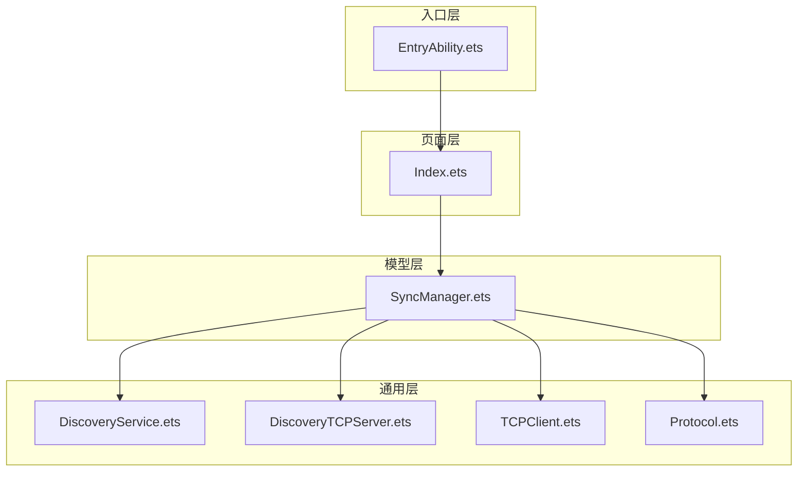
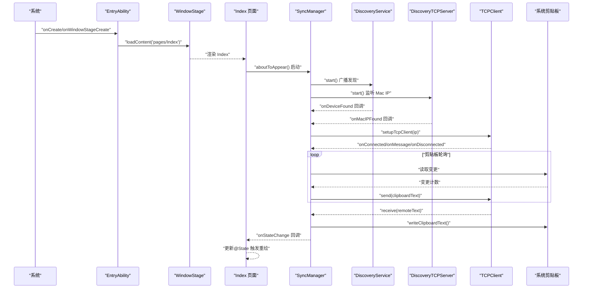
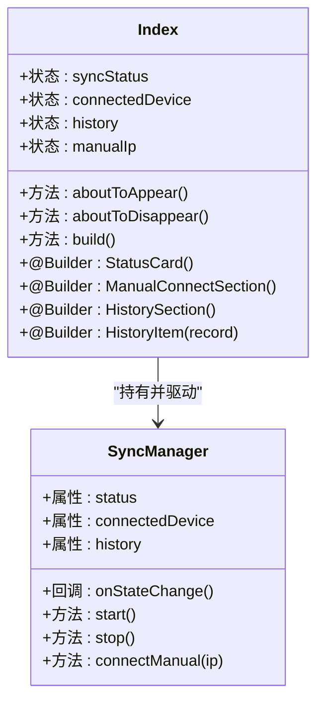
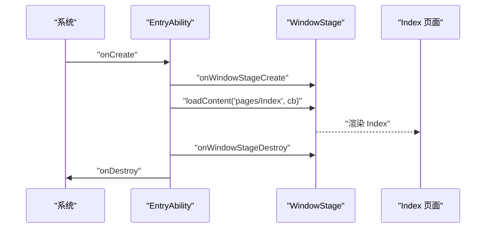
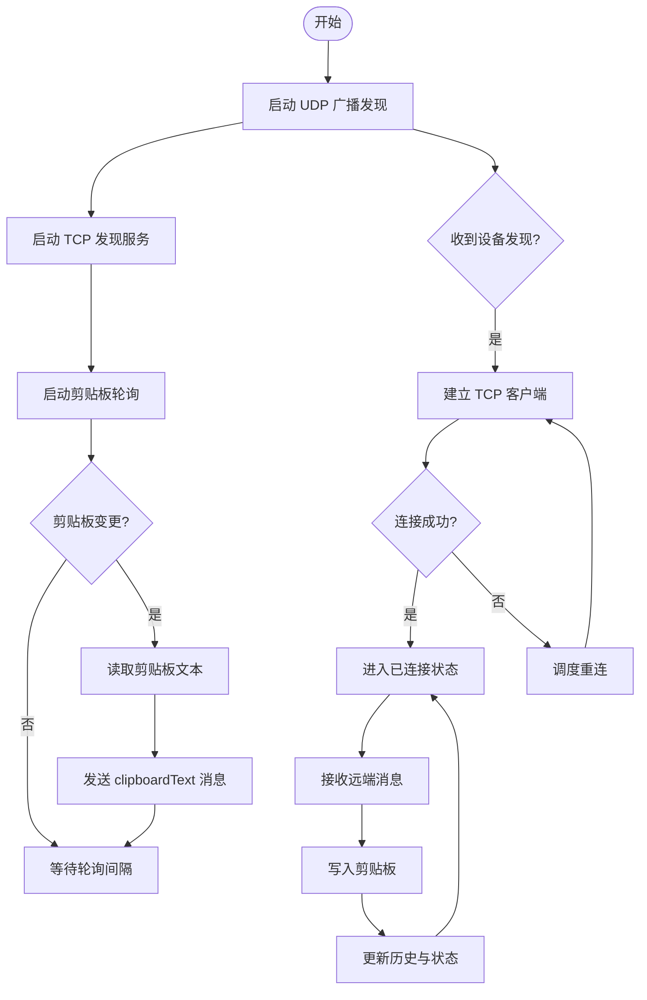
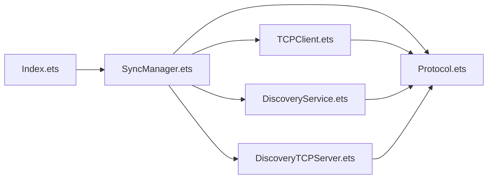

# 应用架构设计

<cite>
**本文引用的文件**
- [Index.ets](file://ClipboardSync/harmony/entry/src/main/ets/pages/Index.ets)
- [EntryAbility.ets](file://ClipboardSync/harmony/entry/src/main/ets/entryability/EntryAbility.ets)
- [SyncManager.ets](file://ClipboardSync/harmony/entry/src/main/ets/model/SyncManager.ets)
- [DiscoveryService.ets](file://ClipboardSync/harmony/entry/src/main/ets/common/DiscoveryService.ets)
- [DiscoveryTCPServer.ets](file://ClipboardSync/harmony/entry/src/main/ets/common/DiscoveryTCPServer.ets)
- [TCPClient.ets](file://ClipboardSync/harmony/entry/src/main/ets/common/TCPClient.ets)
- [Protocol.ets](file://ClipboardSync/harmony/entry/src/main/ets/common/Protocol.ets)
- [build-profile.json5](file://ClipboardSync/harmony/entry/build-profile.json5)
- [ClipboardSyncApp.swift](file://ClipboardSync/mac/ClipboardSync/ClipboardSyncApp.swift)
- [MainView.swift](file://ClipboardSync/mac/ClipboardSync/MainView.swift)
- [AppDelegate.swift](file://ClipboardSync/mac/ClipboardSync/AppDelegate.swift)
- [PROJECT.md](file://ClipboardSync/PROJECT.md)
</cite>

## 目录
1. [简介](#简介)
2. [项目结构](#项目结构)
3. [核心组件](#核心组件)
4. [架构总览](#架构总览)
5. [组件详细分析](#组件详细分析)
6. [依赖关系分析](#依赖关系分析)
7. [性能考量](#性能考量)
8. [故障排查指南](#故障排查指南)
9. [结论](#结论)
10. [附录](#附录)

## 简介
本文件面向鸿蒙端应用架构，围绕剪贴板同步场景，系统性解析 ArkTS/ArkUI 下的组件化设计与实现细节，重点覆盖：
- Index.ets 主页面组件的设计模式与生命周期
- EntryAbility 入口能力的启动流程与系统集成
- 组件化理念（@Builder、状态管理、事件处理）
- 与 Mac 端架构的对比分析与适配策略
- 组件复用、状态提升等最佳实践

## 项目结构
项目采用“模块化 + 层次化”组织方式：
- 入口层：EntryAbility 负责窗口阶段加载首页 Index
- 页面层：Index 提供导航容器与业务子组件（状态卡、手动连接、历史）
- 模型层：SyncManager 协调设备发现、TCP 连接、剪贴板轮询与消息处理
- 通用层：DiscoveryService（UDP）、DiscoveryTCPServer（TCP）、TCPClient（TCP）、Protocol（协议常量）

图表来源
- [EntryAbility.ets:1-38](file://ClipboardSync/harmony/entry/src/main/ets/entryability/EntryAbility.ets#L1-L38)
- [Index.ets:1-226](file://ClipboardSync/harmony/entry/src/main/ets/pages/Index.ets#L1-L226)
- [SyncManager.ets:1-301](file://ClipboardSync/harmony/entry/src/main/ets/model/SyncManager.ets#L1-L301)
- [DiscoveryService.ets:1-161](file://ClipboardSync/harmony/entry/src/main/ets/common/DiscoveryService.ets#L1-L161)
- [DiscoveryTCPServer.ets:1-80](file://ClipboardSync/harmony/entry/src/main/ets/common/DiscoveryTCPServer.ets#L1-L80)
- [TCPClient.ets:1-181](file://ClipboardSync/harmony/entry/src/main/ets/common/TCPClient.ets#L1-L181)
- [Protocol.ets:1-27](file://ClipboardSync/harmony/entry/src/main/ets/common/Protocol.ets#L1-L27)

章节来源
- [build-profile.json5:1-14](file://ClipboardSync/harmony/entry/build-profile.json5#L1-L14)
- [PROJECT.md:5-50](file://ClipboardSync/PROJECT.md#L5-L50)

## 核心组件
- Index.ets：@Entry + @Component 主页面，@State 管理状态，aboutToAppear/aboutToDisappear 生命周期驱动 SyncManager
- EntryAbility.ets：UIAbility 子类，负责窗口阶段加载首页
- SyncManager.ets：核心协调器，封装设备发现、TCP 连接、剪贴板轮询、消息收发与历史记录
- DiscoveryService.ets：UDP 广播发现
- DiscoveryTCPServer.ets：TCP 监听，用于 Mac IP 发现
- TCPClient.ets：TCP 客户端，JSON + 换行分隔消息
- Protocol.ets：协议常量与消息结构

章节来源
- [Index.ets:1-226](file://ClipboardSync/harmony/entry/src/main/ets/pages/Index.ets#L1-L226)
- [EntryAbility.ets:1-38](file://ClipboardSync/harmony/entry/src/main/ets/entryability/EntryAbility.ets#L1-L38)
- [SyncManager.ets:1-301](file://ClipboardSync/harmony/entry/src/main/ets/model/SyncManager.ets#L1-L301)
- [DiscoveryService.ets:1-161](file://ClipboardSync/harmony/entry/src/main/ets/common/DiscoveryService.ets#L1-L161)
- [DiscoveryTCPServer.ets:1-80](file://ClipboardSync/harmony/entry/src/main/ets/common/DiscoveryTCPServer.ets#L1-L80)
- [TCPClient.ets:1-181](file://ClipboardSync/harmony/entry/src/main/ets/common/TCPClient.ets#L1-L181)
- [Protocol.ets:1-27](file://ClipboardSync/harmony/entry/src/main/ets/common/Protocol.ets#L1-L27)

## 架构总览
下图展示从应用启动到页面渲染、设备发现、TCP 连接、剪贴板轮询与消息收发的完整链路。

图表来源
- [EntryAbility.ets:14-24](file://ClipboardSync/harmony/entry/src/main/ets/entryability/EntryAbility.ets#L14-L24)
- [Index.ets:13-27](file://ClipboardSync/harmony/entry/src/main/ets/pages/Index.ets#L13-L27)
- [SyncManager.ets:72-98](file://ClipboardSync/harmony/entry/src/main/ets/model/SyncManager.ets#L72-L98)
- [DiscoveryService.ets:25-70](file://ClipboardSync/harmony/entry/src/main/ets/common/DiscoveryService.ets#L25-L70)
- [DiscoveryTCPServer.ets:18-49](file://ClipboardSync/harmony/entry/src/main/ets/common/DiscoveryTCPServer.ets#L18-L49)
- [TCPClient.ets:30-42](file://ClipboardSync/harmony/entry/src/main/ets/common/TCPClient.ets#L30-L42)
- [SyncManager.ets:202-233](file://ClipboardSync/harmony/entry/src/main/ets/model/SyncManager.ets#L202-L233)

## 组件详细分析

### Index.ets 主页面组件设计
- 装饰器与声明
  - @Entry：标记页面入口，由系统自动加载
  - @Component：声明组件结构体，支持 @Builder 子组件
- 状态管理
  - @State 同步状态、连接设备、历史记录、手动输入 IP
  - 通过 SyncManager.onStateChange 将内部状态与 UI 绑定
- 生命周期
  - aboutToAppear：注册状态回调、启动 SyncManager
  - aboutToDisappear：停止 SyncManager，释放资源
- 组件化与数据流
  - 使用 @Builder 定义可复用子组件（状态卡、手动连接、历史）
  - 通过 props（如 record）传递数据，onClick 等事件通过回调向上冒泡
- UI 结构
  - Navigation 容器承载三段内容：状态卡、手动连接、历史列表
  - 响应式状态驱动样式与文案（如状态色、提示语）

图表来源
- [Index.ets:3-27](file://ClipboardSync/harmony/entry/src/main/ets/pages/Index.ets#L3-L27)
- [Index.ets:29-51](file://ClipboardSync/harmony/entry/src/main/ets/pages/Index.ets#L29-L51)
- [Index.ets:55-115](file://ClipboardSync/harmony/entry/src/main/ets/pages/Index.ets#L55-L115)
- [Index.ets:119-148](file://ClipboardSync/harmony/entry/src/main/ets/pages/Index.ets#L119-L148)
- [Index.ets:152-185](file://ClipboardSync/harmony/entry/src/main/ets/pages/Index.ets#L152-L185)
- [Index.ets:187-209](file://ClipboardSync/harmony/entry/src/main/ets/pages/Index.ets#L187-L209)
- [SyncManager.ets:26-60](file://ClipboardSync/harmony/entry/src/main/ets/model/SyncManager.ets#L26-L60)

章节来源
- [Index.ets:1-226](file://ClipboardSync/harmony/entry/src/main/ets/pages/Index.ets#L1-L226)

### EntryAbility.ets 入口能力
- 职责
  - 在窗口阶段加载首页 Index
  - 管理应用前后台生命周期回调
- 关键点
  - onWindowStageCreate 中通过 loadContent('pages/Index') 指定入口页面
  - 错误处理：loadContent 回调中打印错误信息
  - 生命周期：onCreate/onDestroy/onWindowStageDestroy/onForeground/onBackground

图表来源
- [EntryAbility.ets:5-37](file://ClipboardSync/harmony/entry/src/main/ets/entryability/EntryAbility.ets#L5-L37)

章节来源
- [EntryAbility.ets:1-38](file://ClipboardSync/harmony/entry/src/main/ets/entryability/EntryAbility.ets#L1-L38)

### SyncManager.ets 协调器
- 职责
  - 设备发现（UDP + TCP）
  - TCP 连接与消息收发
  - 剪贴板轮询与写入
  - 历史记录维护与状态暴露
- 关键机制
  - 状态暴露：status/connectedDevice/history/lastSyncTime getter
  - 回调：onStateChange 供 UI 订阅
  - 设备发现：DiscoveryService.onDeviceFound、DiscoveryTCPServer.onMacIPFound
  - TCP：TCPClient.onConnected/onDisconnected/onMessage/onError
  - 剪贴板：SystemPasteboard 轮询与写入
  - 去重：基于消息时间戳过滤回环

图表来源
- [SyncManager.ets:72-98](file://ClipboardSync/harmony/entry/src/main/ets/model/SyncManager.ets#L72-L98)
- [SyncManager.ets:129-174](file://ClipboardSync/harmony/entry/src/main/ets/model/SyncManager.ets#L129-L174)
- [SyncManager.ets:178-198](file://ClipboardSync/harmony/entry/src/main/ets/model/SyncManager.ets#L178-L198)
- [SyncManager.ets:202-233](file://ClipboardSync/harmony/entry/src/main/ets/model/SyncManager.ets#L202-L233)
- [SyncManager.ets:256-269](file://ClipboardSync/harmony/entry/src/main/ets/model/SyncManager.ets#L256-L269)
- [SyncManager.ets:273-283](file://ClipboardSync/harmony/entry/src/main/ets/model/SyncManager.ets#L273-L283)

章节来源
- [SyncManager.ets:1-301](file://ClipboardSync/harmony/entry/src/main/ets/model/SyncManager.ets#L1-L301)

### DiscoveryService.ets（UDP 广播发现）
- 功能
  - 定时广播 PING 消息
  - 监听广播并解析消息，去重后回调设备发现
- 关键点
  - 绑定端口、启用广播、设置复用
  - 去重列表 foundDevices，支持 resetFoundDevices 重连场景

章节来源
- [DiscoveryService.ets:1-161](file://ClipboardSync/harmony/entry/src/main/ets/common/DiscoveryService.ets#L1-L161)

### DiscoveryTCPServer.ets（TCP 发现）
- 功能
  - 监听端口等待 Mac 连接，获取远端地址作为 Mac IP
  - 回调通知 SyncManager，随后关闭连接（仅用于发现）
- 关键点
  - listen() 同时完成 bind + listen + accept
  - getRemoteAddress 异步获取客户端 IP

章节来源
- [DiscoveryTCPServer.ets:1-80](file://ClipboardSync/harmony/entry/src/main/ets/common/DiscoveryTCPServer.ets#L1-L80)

### TCPClient.ets（TCP 客户端）
- 功能
  - 连接目标 IP，发送 JSON + 换行分隔的消息
  - 接收消息按行解析，回调上层
  - 断线自动重连（5 秒间隔）
- 关键点
  - 连接超时、错误回调、缓冲区拼接
  - isActive 标记控制是否继续重连

章节来源
- [TCPClient.ets:1-181](file://ClipboardSync/harmony/entry/src/main/ets/common/TCPClient.ets#L1-L181)

### Protocol.ets（协议常量与消息结构）
- 功能
  - 定义广播端口、TCP 端口、轮询间隔、设备 ID
  - 定义消息类型与消息结构
- 关键点
  - 设备 ID 带前缀随机生成，便于识别
  - 消息结构包含类型、内容、时间戳、设备 ID、MIME

章节来源
- [Protocol.ets:1-27](file://ClipboardSync/harmony/entry/src/main/ets/common/Protocol.ets#L1-L27)

### 与 Mac 端架构对比分析
- 入口与生命周期
  - 鸿蒙：EntryAbility 管理窗口阶段与页面加载
  - Mac：ClipboardSyncApp 作为 App 入口，AppDelegate 管理菜单栏与 popover
- UI 框架
  - 鸿蒙：ArkTS + ArkUI，组件化 + 响应式状态
  - Mac：Swift + SwiftUI，视图声明式组合
- 系统集成
  - 鸿蒙：通过 WindowStage.loadContent 加载页面，生命周期回调
  - Mac：NSApplicationDelegate 控制状态栏图标与 popover，无 Dock 图标
- 数据流
  - 鸿蒙：Index 通过 @State 与 SyncManager.onStateChange 绑定，事件通过 onClick 回调
  - Mac：MainView 通过 @ObservedObject 绑定 SyncManager，按钮事件直接调用方法
- 通信架构
  - 两端一致：UDP 广播发现 + TCP 长连接 + JSON 换行分隔
  - 角色相反：Mac 为 TCP Server，鸿蒙为 TCP Client
- 适配策略
  - 鸿蒙端：Index 作为容器，子组件通过 @Builder 复用；状态提升至 SyncManager
  - Mac 端：MainView 作为容器，通过 @ObservedObject 注入状态；事件直接调用方法
  - 协议共享：两端共享 Protocol 定义，确保消息结构一致

章节来源
- [ClipboardSyncApp.swift:1-12](file://ClipboardSync/mac/ClipboardSync/ClipboardSyncApp.swift#L1-L12)
- [MainView.swift:1-209](file://ClipboardSync/mac/ClipboardSync/MainView.swift#L1-L209)
- [AppDelegate.swift:1-46](file://ClipboardSync/mac/ClipboardSync/AppDelegate.swift#L1-L46)
- [PROJECT.md:52-62](file://ClipboardSync/PROJECT.md#L52-L62)

## 依赖关系分析
- 组件耦合
  - Index 依赖 SyncManager（低耦合：通过回调解绑）
  - SyncManager 依赖 DiscoveryService、DiscoveryTCPServer、TCPClient、Protocol（高内聚：统一协调）
  - TCPClient 与 DiscoveryTCPServer 仅在 SyncManager 内部协作
- 外部依赖
  - @kit.NetworkKit：socket UDPSocket/TCPSocket/TCPSocketServer
  - @kit.BasicServicesKit：pasteboard、BusinessError
- 循环依赖
  - 无直接循环依赖，通过回调与接口解耦

图表来源
- [Index.ets:1-11](file://ClipboardSync/harmony/entry/src/main/ets/pages/Index.ets#L1-L11)
- [SyncManager.ets:1-6](file://ClipboardSync/harmony/entry/src/main/ets/model/SyncManager.ets#L1-L6)
- [TCPClient.ets:1-5](file://ClipboardSync/harmony/entry/src/main/ets/common/TCPClient.ets#L1-L5)
- [DiscoveryService.ets:1-5](file://ClipboardSync/harmony/entry/src/main/ets/common/DiscoveryService.ets#L1-L5)
- [DiscoveryTCPServer.ets:1-4](file://ClipboardSync/harmony/entry/src/main/ets/common/DiscoveryTCPServer.ets#L1-L4)
- [Protocol.ets:1-27](file://ClipboardSync/harmony/entry/src/main/ets/common/Protocol.ets#L1-L27)

章节来源
- [Index.ets:1-226](file://ClipboardSync/harmony/entry/src/main/ets/pages/Index.ets#L1-L226)
- [SyncManager.ets:1-301](file://ClipboardSync/harmony/entry/src/main/ets/model/SyncManager.ets#L1-L301)

## 性能考量
- 轮询与事件驱动
  - 剪贴板轮询间隔：500ms，兼顾实时性与性能
  - TCP 消息按行解析，避免粘包堆积
- 连接稳定性
  - 断线自动重连（5 秒），减少用户干预
  - 连接创建前延迟 500ms，规避 socket.close 异步导致的“Operation in progress”
- 资源释放
  - 生命周期 onWindowStageDestroy/onDestroy 中释放定时器与网络句柄
  - aboutToDisappear 停止 SyncManager，避免后台占用

章节来源
- [SyncManager.ets:6-9](file://ClipboardSync/harmony/entry/src/main/ets/model/SyncManager.ets#L6-L9)
- [SyncManager.ets:202-213](file://ClipboardSync/harmony/entry/src/main/ets/model/SyncManager.ets#L202-L213)
- [TCPClient.ets:148-157](file://ClipboardSync/harmony/entry/src/main/ets/common/TCPClient.ets#L148-L157)
- [SyncManager.ets:169-174](file://ClipboardSync/harmony/entry/src/main/ets/model/SyncManager.ets#L169-L174)
- [EntryAbility.ets:26-37](file://ClipboardSync/harmony/entry/src/main/ets/entryability/EntryAbility.ets#L26-L37)
- [Index.ets:25-27](file://ClipboardSync/harmony/entry/src/main/ets/pages/Index.ets#L25-L27)

## 故障排查指南
- UDP 广播无法到达 Mac 或鸿蒙端
  - 检查广播端口与协议常量一致性
  - 确认网络防火墙与路由器组播策略
- TCP 连接报错“Operation in progress”
  - 确认旧连接已完全关闭后再创建新连接
  - 检查连接延迟与重连逻辑
- socket.SocketErrorInfo 缺失
  - 使用 BusinessError 替代错误回调参数类型
- Mac 端启动未自动开始
  - 确保 AppDelegate 中在 applicationDidFinishLaunching 调用 start()

章节来源
- [PROJECT.md:102-126](file://ClipboardSync/PROJECT.md#L102-L126)
- [TCPClient.ets:30-42](file://ClipboardSync/harmony/entry/src/main/ets/common/TCPClient.ets#L30-L42)
- [SyncManager.ets:169-174](file://ClipboardSync/harmony/entry/src/main/ets/model/SyncManager.ets#L169-L174)

## 结论
该架构以 SyncManager 为核心协调器，结合 UDP 广播与 TCP 长连接实现跨端剪贴板同步。鸿蒙端通过 Index 页面与生命周期管理实现简洁稳定的 UI，配合 @Builder 子组件实现高复用与清晰职责划分。两端在入口、UI 框架与系统集成上存在差异，但共享协议与消息结构，保证互通性。建议后续完善 UDP 自动发现、图片同步与后台保活策略，持续提升用户体验与稳定性。

## 附录
- 开发环境与版本
  - DevEco Studio 6.1+，HarmonyOS SDK API 23
  - Xcode Command Line Tools Swift 5.9+
- 运行方式
  - 鸿蒙端：连接真机，编译安装运行，手动输入 Mac IP 进行连接
  - Mac 端：菜单栏图标运行，点击图标弹出状态面板

章节来源
- [build-profile.json5:1-14](file://ClipboardSync/harmony/entry/build-profile.json5#L1-L14)
- [PROJECT.md:64-98](file://ClipboardSync/PROJECT.md#L64-L98)