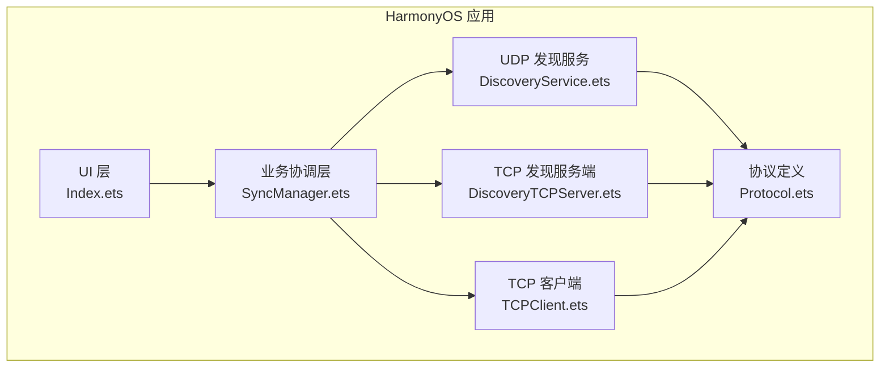
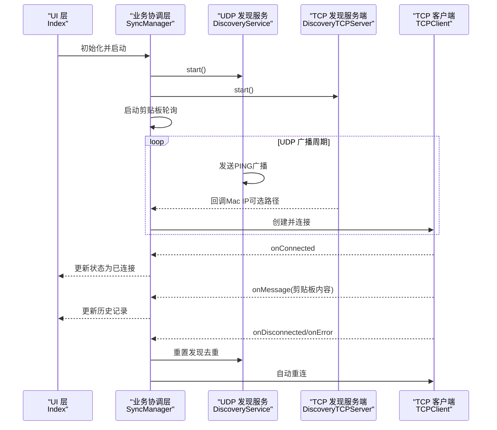
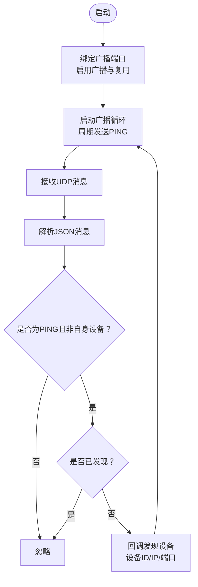
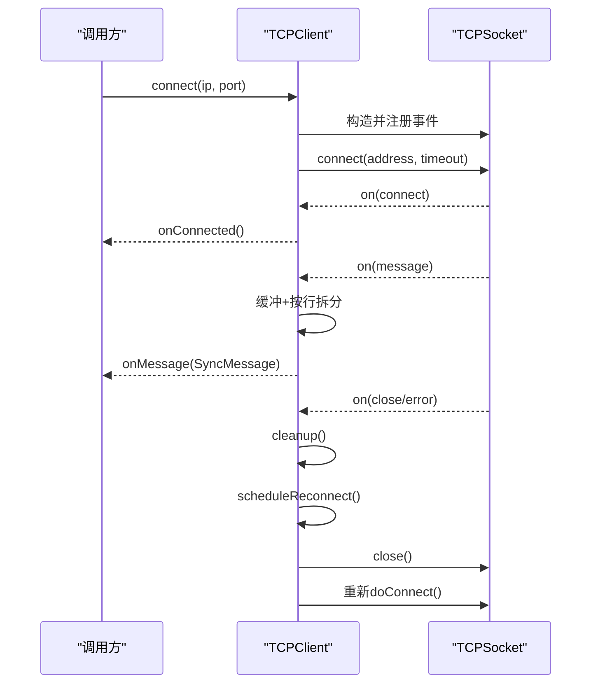
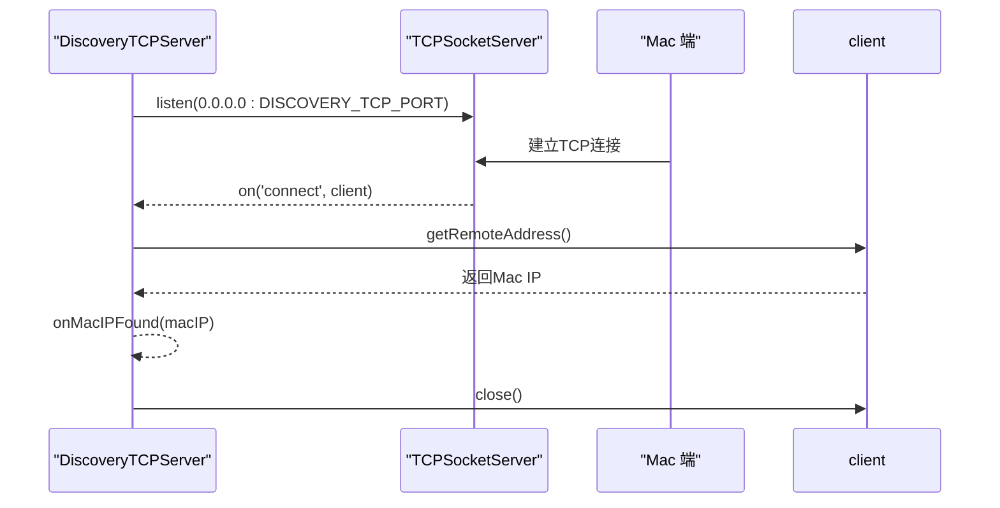
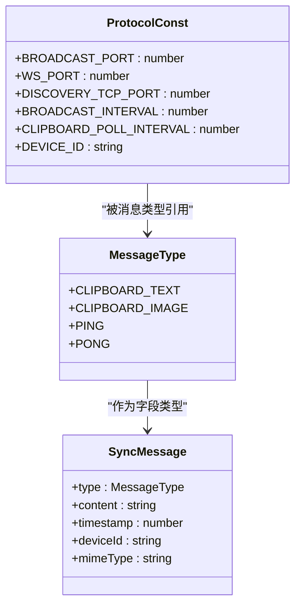
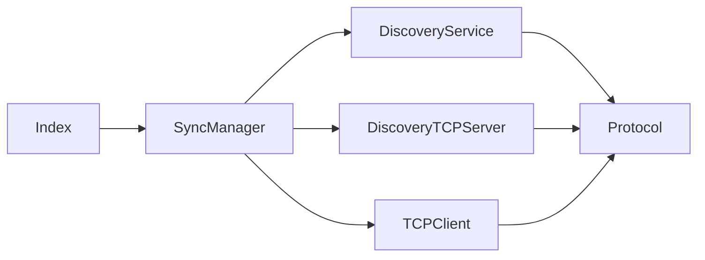

# 通信模块实现

<cite>
**本文档引用的文件**
- [DiscoveryService.ets](file://ClipboardSync/harmony/entry/src/main/ets/common/DiscoveryService.ets)
- [TCPClient.ets](file://ClipboardSync/harmony/entry/src/main/ets/common/TCPClient.ets)
- [DiscoveryTCPServer.ets](file://ClipboardSync/harmony/entry/src/main/ets/common/DiscoveryTCPServer.ets)
- [Protocol.ets](file://ClipboardSync/harmony/entry/src/main/ets/common/Protocol.ets)
- [SyncManager.ets](file://ClipboardSync/harmony/entry/src/main/ets/model/SyncManager.ets)
- [Index.ets](file://ClipboardSync/harmony/entry/src/main/ets/pages/Index.ets)
- [EntryAbility.ets](file://ClipboardSync/harmony/entry/src/main/ets/entryability/EntryAbility.ets)
</cite>

## 目录
1. [简介](#简介)
2. [项目结构](#项目结构)
3. [核心组件](#核心组件)
4. [架构总览](#架构总览)
5. [详细组件分析](#详细组件分析)
6. [依赖关系分析](#依赖关系分析)
7. [性能考虑](#性能考虑)
8. [故障排查指南](#故障排查指南)
9. [结论](#结论)
10. [附录](#附录)

## 简介
本文件为通信模块的技术文档，聚焦于以下四个核心文件：
- DiscoveryService.ets：基于UDP的设备发现服务，负责广播与监听，定位局域网内的Mac端设备。
- TCPClient.ets：TCP客户端，负责与Mac端建立持久化连接，进行文本/图片剪贴板内容的双向同步。
- DiscoveryTCPServer.ets：TCP发现服务端，解决UDP广播在某些网络环境下不可达的问题，通过TCP直连获取Mac端IP。
- Protocol.ets：通信协议定义，包括消息格式、数据类型、端口与时间戳等常量。

文档将深入解析各模块的实现细节、数据流与控制流，并提供协作关系图、最佳实践与性能优化建议。

## 项目结构
通信模块位于HarmonyOS侧的入口工程中，采用按职责分层组织：
- common：网络通信相关的核心实现（DiscoveryService、TCPClient、DiscoveryTCPServer、Protocol）
- model：业务协调层（SyncManager），负责状态管理、设备发现与TCP连接的编排
- pages：UI层（Index），展示同步状态、历史记录与手动连接入口
- entryability：应用生命周期入口（EntryAbility）

图表来源
- [Index.ets:1-226](file://ClipboardSync/harmony/entry/src/main/ets/pages/Index.ets#L1-L226)
- [SyncManager.ets:1-301](file://ClipboardSync/harmony/entry/src/main/ets/model/SyncManager.ets#L1-L301)
- [DiscoveryService.ets:1-161](file://ClipboardSync/harmony/entry/src/main/ets/common/DiscoveryService.ets#L1-L161)
- [DiscoveryTCPServer.ets:1-80](file://ClipboardSync/harmony/entry/src/main/ets/common/DiscoveryTCPServer.ets#L1-L80)
- [TCPClient.ets:1-181](file://ClipboardSync/harmony/entry/src/main/ets/common/TCPClient.ets#L1-L181)
- [Protocol.ets:1-27](file://ClipboardSync/harmony/entry/src/main/ets/common/Protocol.ets#L1-L27)

章节来源
- [Index.ets:1-226](file://ClipboardSync/harmony/entry/src/main/ets/pages/Index.ets#L1-L226)
- [SyncManager.ets:1-301](file://ClipboardSync/harmony/entry/src/main/ets/model/SyncManager.ets#L1-L301)

## 核心组件
- DiscoveryService（UDP发现）：创建UDP套接字，绑定广播端口，周期性发送PING广播，解析响应并回调发现的设备信息。
- TCPClient（TCP客户端）：构造TCP套接字，注册连接、消息、关闭、错误事件；支持自动重连；按行分隔JSON消息进行收发。
- DiscoveryTCPServer（TCP发现服务端）：监听固定端口，接受来自Mac端的TCP连接，提取远端IP并通过回调通知上层。
- Protocol（协议定义）：统一端口、时间戳、设备ID、消息类型与消息体结构，确保跨平台一致性。

章节来源
- [DiscoveryService.ets:10-161](file://ClipboardSync/harmony/entry/src/main/ets/common/DiscoveryService.ets#L10-L161)
- [TCPClient.ets:11-181](file://ClipboardSync/harmony/entry/src/main/ets/common/TCPClient.ets#L11-L181)
- [DiscoveryTCPServer.ets:11-80](file://ClipboardSync/harmony/entry/src/main/ets/common/DiscoveryTCPServer.ets#L11-L80)
- [Protocol.ets:1-27](file://ClipboardSync/harmony/entry/src/main/ets/common/Protocol.ets#L1-L27)

## 架构总览
整体工作流程：
- 应用启动后，UI层加载Index页面，初始化SyncManager并开始运行。
- SyncManager启动UDP发现服务与TCP发现服务，同时开启剪贴板轮询。
- UDP发现服务周期性广播PING，监听到Mac端响应后回调设备信息。
- TCP发现服务端监听端口，Mac端主动发起TCP连接以暴露其IP。
- SyncManager根据发现结果或手动输入的IP，创建新的TCP客户端实例并建立连接。
- 连接建立后，双方通过TCP通道以行分隔的JSON消息交换剪贴板内容。
- 断线时自动重连，保持状态与历史记录更新。

图表来源
- [SyncManager.ets:72-174](file://ClipboardSync/harmony/entry/src/main/ets/model/SyncManager.ets#L72-L174)
- [DiscoveryService.ets:25-70](file://ClipboardSync/harmony/entry/src/main/ets/common/DiscoveryService.ets#L25-L70)
- [DiscoveryTCPServer.ets:18-49](file://ClipboardSync/harmony/entry/src/main/ets/common/DiscoveryTCPServer.ets#L18-L49)
- [TCPClient.ets:30-113](file://ClipboardSync/harmony/entry/src/main/ets/common/TCPClient.ets#L30-L113)

## 详细组件分析

### DiscoveryService（UDP广播发现服务）
职责与特性：
- 创建UDP套接字并绑定到广播端口，启用广播与地址复用。
- 周期性发送PING广播，携带设备ID与时间戳。
- 监听消息事件，解析JSON消息，过滤自身设备，去重后回调发现的设备信息（设备ID、IP、端口）。
- 提供停止方法，清理定时器与事件监听，关闭套接字。

关键实现要点：
- 广播端口与间隔由协议常量统一管理，确保与Mac端一致。
- 使用TextDecoder处理ArrayBuffer到字符串的解码。
- 通过foundDevices数组实现设备去重，支持断线重连后的再次发现。

图表来源
- [DiscoveryService.ets:25-161](file://ClipboardSync/harmony/entry/src/main/ets/common/DiscoveryService.ets#L25-L161)

章节来源
- [DiscoveryService.ets:10-161](file://ClipboardSync/harmony/entry/src/main/ets/common/DiscoveryService.ets#L10-L161)
- [Protocol.ets:2-9](file://ClipboardSync/harmony/entry/src/main/ets/common/Protocol.ets#L2-L9)

### TCPClient（TCP客户端连接逻辑）
职责与特性：
- 构造TCP套接字，注册connect/message/close/error事件。
- 支持主动连接与断线自动重连（5秒间隔）。
- 发送时在消息末尾追加换行符，接收时按行拆分并逐行解析JSON。
- 提供连接状态查询、发送接口与资源清理方法。

关键实现要点：
- 连接超时设置为10秒，错误时触发重连调度。
- 接收缓冲区使用字符串拼接，逐行处理，避免粘包问题。
- 重连前清理旧定时器，关闭旧socket，避免资源泄漏。

图表来源
- [TCPClient.ets:30-181](file://ClipboardSync/harmony/entry/src/main/ets/common/TCPClient.ets#L30-L181)

章节来源
- [TCPClient.ets:11-181](file://ClipboardSync/harmony/entry/src/main/ets/common/TCPClient.ets#L11-L181)

### DiscoveryTCPServer（TCP发现服务端）
职责与特性：
- 监听固定端口，等待Mac端主动发起TCP连接。
- 通过getRemoteAddress获取远端IP，回调通知上层。
- 连接仅用于发现目的，获取IP后立即关闭连接。

关键实现要点：
- listen()同时完成bind与listen，无需单独bind。
- 注册connect与error事件，错误时记录日志并继续监听。

图表来源
- [DiscoveryTCPServer.ets:18-78](file://ClipboardSync/harmony/entry/src/main/ets/common/DiscoveryTCPServer.ets#L18-L78)

章节来源
- [DiscoveryTCPServer.ets:11-80](file://ClipboardSync/harmony/entry/src/main/ets/common/DiscoveryTCPServer.ets#L11-L80)

### Protocol（通信协议定义）
职责与特性：
- 定义端口常量：广播端口、WebSocket/TCP端口、发现TCP端口。
- 定义消息类型枚举：剪贴板文本、剪贴板图片、心跳PING/PONG。
- 定义消息体结构：type/content/timestamp/deviceId/mimeType。
- 定义设备ID生成策略与轮询间隔等常量。

图表来源
- [Protocol.ets:2-27](file://ClipboardSync/harmony/entry/src/main/ets/common/Protocol.ets#L2-L27)

章节来源
- [Protocol.ets:1-27](file://ClipboardSync/harmony/entry/src/main/ets/common/Protocol.ets#L1-L27)

## 依赖关系分析
- SyncManager协调DiscoveryService、DiscoveryTCPServer与TCPClient，负责状态机、历史记录与剪贴板轮询。
- DiscoveryService与DiscoveryTCPServer均依赖Protocol.ets中的端口与设备ID常量。
- TCPClient依赖Protocol.ets中的端口与消息结构。
- UI层（Index）通过SyncManager暴露的状态与历史进行渲染。

图表来源
- [SyncManager.ets:26-301](file://ClipboardSync/harmony/entry/src/main/ets/model/SyncManager.ets#L26-L301)
- [DiscoveryService.ets:1-5](file://ClipboardSync/harmony/entry/src/main/ets/common/DiscoveryService.ets#L1-L5)
- [DiscoveryTCPServer.ets:1-4](file://ClipboardSync/harmony/entry/src/main/ets/common/DiscoveryTCPServer.ets#L1-L4)
- [TCPClient.ets:1-5](file://ClipboardSync/harmony/entry/src/main/ets/common/TCPClient.ets#L1-L5)
- [Index.ets:1-12](file://ClipboardSync/harmony/entry/src/main/ets/pages/Index.ets#L1-L12)

章节来源
- [SyncManager.ets:1-301](file://ClipboardSync/harmony/entry/src/main/ets/model/SyncManager.ets#L1-L301)
- [Index.ets:1-226](file://ClipboardSync/harmony/entry/src/main/ets/pages/Index.ets#L1-L226)

## 性能考虑
- 广播频率与轮询间隔：广播间隔与剪贴板轮询间隔均为毫秒级，建议在网络负载较高时适当增大间隔，降低CPU与带宽占用。
- 消息大小与序列化：消息以JSON字符串形式传输，建议对大文本进行压缩或分片传输，避免单帧过大导致阻塞。
- 连接稳定性：TCP客户端具备自动重连机制，但频繁断线可能影响用户体验，建议在网络质量差的场景下增加退避策略与最大重试次数。
- 资源回收：确保在停止或切换连接时及时清理定时器与事件监听，避免内存泄漏。
- 文本解码：接收端使用TextDecoder处理ArrayBuffer，注意编码一致性，避免乱码。

## 故障排查指南
常见问题与定位思路：
- UDP广播无法到达Mac端：检查广播端口与地址配置是否与Mac端一致；确认防火墙与路由器策略；必要时启用DiscoveryTCPServer作为替代路径。
- TCP连接失败：检查目标IP与端口；查看连接超时与错误回调；确认服务端是否正常监听。
- 消息解析失败：检查消息是否以换行符结尾；确认JSON格式正确；关注缓冲区拼接与行分割逻辑。
- 自动重连无效：确认isActive标志位与定时器清理逻辑；检查错误回调是否触发重连调度。
- 状态不更新：确认UI层onStateChange回调是否正确绑定；检查SyncManager状态变更逻辑。

章节来源
- [DiscoveryService.ets:36-43](file://ClipboardSync/harmony/entry/src/main/ets/common/DiscoveryService.ets#L36-L43)
- [TCPClient.ets:83-90](file://ClipboardSync/harmony/entry/src/main/ets/common/TCPClient.ets#L83-L90)
- [DiscoveryTCPServer.ets:42-44](file://ClipboardSync/harmony/entry/src/main/ets/common/DiscoveryTCPServer.ets#L42-L44)
- [SyncManager.ets:143-167](file://ClipboardSync/harmony/entry/src/main/ets/model/SyncManager.ets#L143-L167)

## 结论
该通信模块通过UDP广播与TCP直连相结合的方式，实现了跨平台的设备发现与稳定连接。Protocol.ets提供了统一的消息格式与端口约定，SyncManager负责状态编排与业务流程，UI层提供直观的操作入口。整体设计清晰、职责分离明确，具备良好的扩展性与可维护性。

## 附录
- 端口与常量参考：广播端口、TCP端口、发现TCP端口、广播间隔、轮询间隔、设备ID生成策略。
- 消息类型与结构：文本、图片、心跳PING/PONG，以及消息体字段定义。
- UI交互：状态卡片、手动连接、同步历史展示。

章节来源
- [Protocol.ets:2-27](file://ClipboardSync/harmony/entry/src/main/ets/common/Protocol.ets#L2-L27)
- [Index.ets:55-226](file://ClipboardSync/harmony/entry/src/main/ets/pages/Index.ets#L55-L226)
- [EntryAbility.ets:1-38](file://ClipboardSync/harmony/entry/src/main/ets/entryability/EntryAbility.ets#L1-L38)