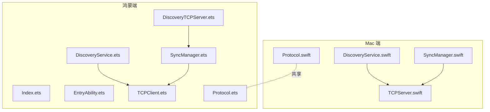
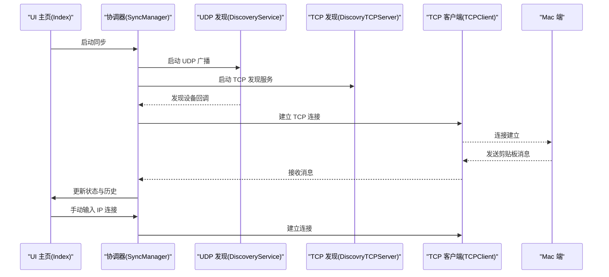
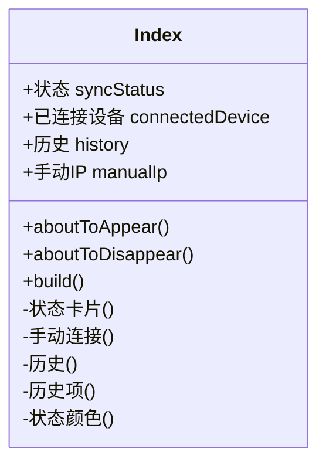
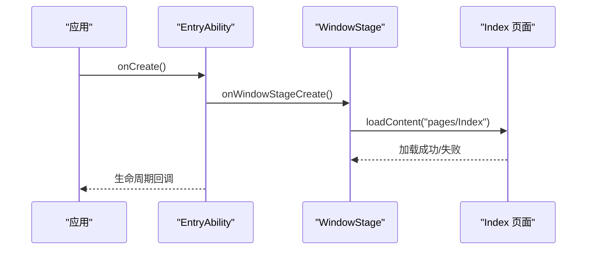
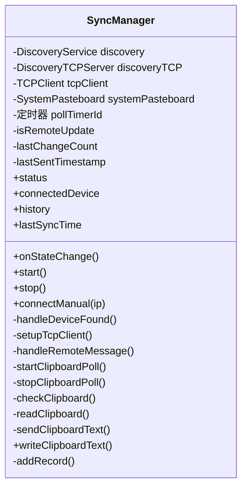
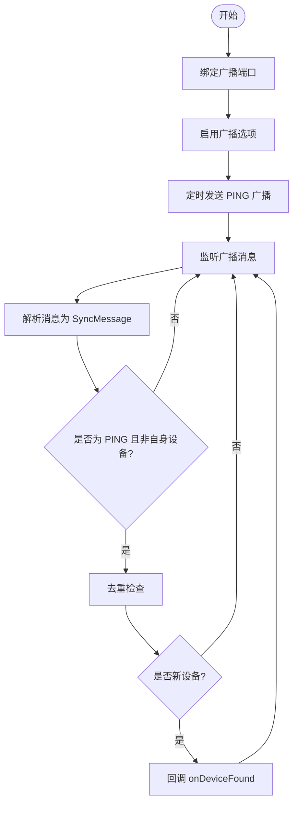
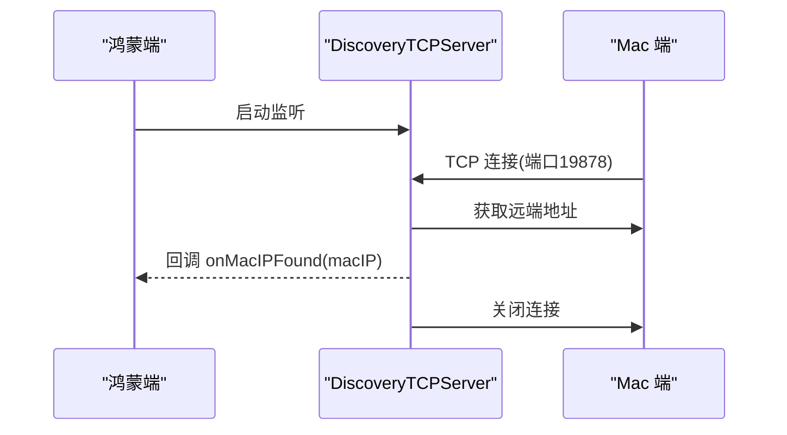
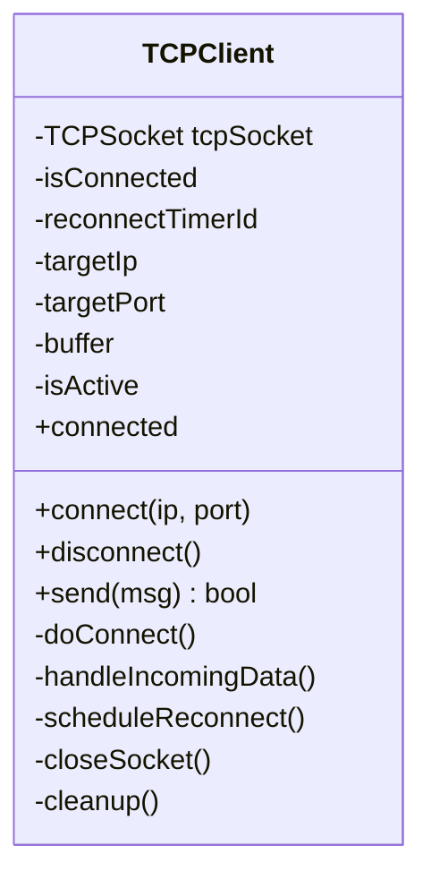
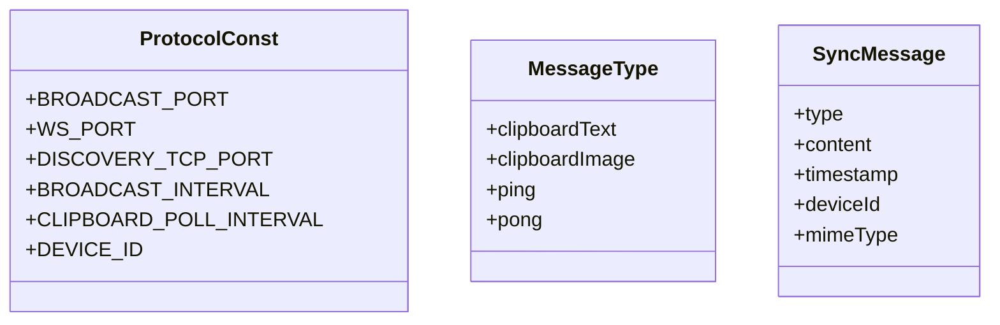
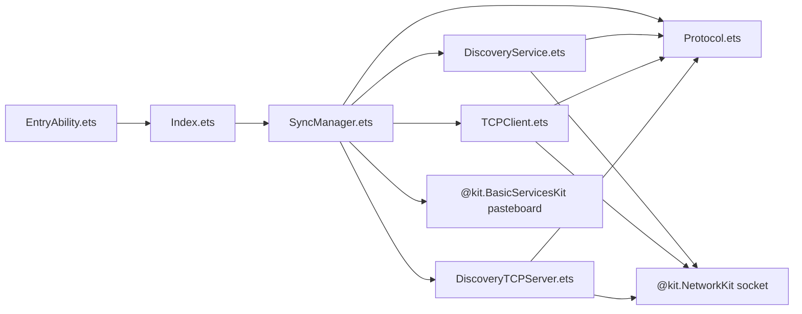

# 鸿蒙端应用详解

<cite>
**本文档引用的文件**
- [Index.ets](file://ClipboardSync/harmony/entry/src/main/ets/pages/Index.ets)
- [EntryAbility.ets](file://ClipboardSync/harmony/entry/src/main/ets/entryability/EntryAbility.ets)
- [SyncManager.ets](file://ClipboardSync/harmony/entry/src/main/ets/model/SyncManager.ets)
- [DiscoveryService.ets](file://ClipboardSync/harmony/entry/src/main/ets/common/DiscoveryService.ets)
- [DiscoveryTCPServer.ets](file://ClipboardSync/harmony/entry/src/main/ets/common/DiscoveryTCPServer.ets)
- [Protocol.ets](file://ClipboardSync/harmony/entry/src/main/ets/common/Protocol.ets)
- [TCPClient.ets](file://ClipboardSync/harmony/entry/src/main/ets/common/TCPClient.ets)
- [module.json5](file://ClipboardSync/harmony/entry/src/main/module.json5)
- [app.json5](file://ClipboardSync/harmony/AppScope/app.json5)
- [PROJECT.md](file://ClipboardSync/PROJECT.md)
- [Protocol.swift](file://ClipboardSync/mac/ClipboardSync/Protocol.swift)
- [SyncManager.swift](file://ClipboardSync/mac/ClipboardSync/SyncManager.swift)
- [DiscoveryService.swift](file://ClipboardSync/mac/ClipboardSync/DiscoveryService.swift)
- [TCPServer.swift](file://ClipboardSync/mac/ClipboardSync/TCPServer.swift)
</cite>

## 目录
1. [简介](#简介)
2. [项目结构](#项目结构)
3. [核心组件](#核心组件)
4. [架构总览](#架构总览)
5. [详细组件分析](#详细组件分析)
6. [依赖关系分析](#依赖关系分析)
7. [性能考虑](#性能考虑)
8. [故障排查指南](#故障排查指南)
9. [结论](#结论)
10. [附录](#附录)

## 简介
本项目实现了 Mac 与鸿蒙手机之间的局域网剪贴板实时同步。鸿蒙端采用 ArkTS + ArkUI 构建，通过 UDP 广播进行设备发现，通过 TCP 长连接进行文本同步，并具备手动连接与自动发现两种模式。两端共享通信协议定义，确保消息格式与端口一致。

## 项目结构
- Mac 端（Swift + SwiftUI）：负责 TCP 服务端、UDP 广播发现、剪贴板监控与消息转发
- 鸿蒙端（ArkTS + ArkUI）：负责 UI 展示、设备发现、TCP 客户端连接、剪贴板轮询与消息处理
- 两端共享协议定义，保证通信一致性

**图表来源**
- [SyncManager.swift:1-154](file://ClipboardSync/mac/ClipboardSync/SyncManager.swift#L1-L154)
- [DiscoveryService.swift:1-197](file://ClipboardSync/mac/ClipboardSync/DiscoveryService.swift#L1-L197)
- [TCPServer.swift:1-174](file://ClipboardSync/mac/ClipboardSync/TCPServer.swift#L1-L174)
- [Index.ets:1-226](file://ClipboardSync/harmony/entry/src/main/ets/pages/Index.ets#L1-L226)
- [EntryAbility.ets:1-38](file://ClipboardSync/harmony/entry/src/main/ets/entryability/EntryAbility.ets#L1-L38)
- [SyncManager.ets:1-301](file://ClipboardSync/harmony/entry/src/main/ets/model/SyncManager.ets#L1-L301)
- [DiscoveryService.ets:1-161](file://ClipboardSync/harmony/entry/src/main/ets/common/DiscoveryService.ets#L1-L161)
- [TCPClient.ets:1-181](file://ClipboardSync/harmony/entry/src/main/ets/common/TCPClient.ets#L1-L181)
- [DiscoveryTCPServer.ets:1-80](file://ClipboardSync/harmony/entry/src/main/ets/common/DiscoveryTCPServer.ets#L1-L80)
- [Protocol.ets:1-27](file://ClipboardSync/harmony/entry/src/main/ets/common/Protocol.ets#L1-L27)
- [Protocol.swift:1-43](file://ClipboardSync/mac/ClipboardSync/Protocol.swift#L1-L43)

**章节来源**
- [PROJECT.md:1-170](file://ClipboardSync/PROJECT.md#L1-L170)

## 核心组件
- UI 主页组件：负责展示连接状态、手动连接输入框、同步历史列表
- 入口能力：负责窗口阶段加载主页内容
- 协调器：统一管理设备发现、TCP 连接、剪贴板轮询与消息处理
- 发现服务：基于 UDP 广播进行设备发现
- TCP 客户端：建立与 Mac 端的长连接，处理消息收发
- 协议定义：统一消息格式、端口与版本常量

**章节来源**
- [Index.ets:1-226](file://ClipboardSync/harmony/entry/src/main/ets/pages/Index.ets#L1-L226)
- [EntryAbility.ets:1-38](file://ClipboardSync/harmony/entry/src/main/ets/entryability/EntryAbility.ets#L1-L38)
- [SyncManager.ets:1-301](file://ClipboardSync/harmony/entry/src/main/ets/model/SyncManager.ets#L1-L301)
- [DiscoveryService.ets:1-161](file://ClipboardSync/harmony/entry/src/main/ets/common/DiscoveryService.ets#L1-L161)
- [TCPClient.ets:1-181](file://ClipboardSync/harmony/entry/src/main/ets/common/TCPClient.ets#L1-L181)
- [Protocol.ets:1-27](file://ClipboardSync/harmony/entry/src/main/ets/common/Protocol.ets#L1-L27)

## 架构总览
系统采用“UDP 发现 + TCP 传输”的双层架构。Mac 端作为 TCP 服务端，鸿蒙端作为 TCP 客户端。双方通过共享协议定义保持消息格式与端口一致。

**图表来源**
- [Index.ets:1-226](file://ClipboardSync/harmony/entry/src/main/ets/pages/Index.ets#L1-L226)
- [SyncManager.ets:1-301](file://ClipboardSync/harmony/entry/src/main/ets/model/SyncManager.ets#L1-L301)
- [DiscoveryService.ets:1-161](file://ClipboardSync/harmony/entry/src/main/ets/common/DiscoveryService.ets#L1-L161)
- [DiscoveryTCPServer.ets:1-80](file://ClipboardSync/harmony/entry/src/main/ets/common/DiscoveryTCPServer.ets#L1-L80)
- [TCPClient.ets:1-181](file://ClipboardSync/harmony/entry/src/main/ets/common/TCPClient.ets#L1-L181)

## 详细组件分析

### UI 主页组件（Index.ets）
- 负责渲染连接状态卡片、手动连接区域与同步历史列表
- 订阅协调器的状态变化回调，自动刷新界面
- 提供手动连接入口，支持输入 Mac IP 地址进行连接

**图表来源**
- [Index.ets:1-226](file://ClipboardSync/harmony/entry/src/main/ets/pages/Index.ets#L1-L226)

**章节来源**
- [Index.ets:1-226](file://ClipboardSync/harmony/entry/src/main/ets/pages/Index.ets#L1-L226)

### 入口能力（EntryAbility.ets）
- 负责应用生命周期中的窗口阶段创建与内容加载
- 将主页内容加载到窗口阶段，处理加载失败的情况

**图表来源**
- [EntryAbility.ets:1-38](file://ClipboardSync/harmony/entry/src/main/ets/entryability/EntryAbility.ets#L1-L38)

**章节来源**
- [EntryAbility.ets:1-38](file://ClipboardSync/harmony/entry/src/main/ets/entryability/EntryAbility.ets#L1-L38)

### 协调器（SyncManager.ets）
- 统一管理设备发现、TCP 连接、剪贴板轮询与消息处理
- 维护状态（未连接/搜索中/已连接）、连接设备、同步历史与诊断日志
- 处理远端消息，写入系统剪贴板，并记录同步历史

**图表来源**
- [SyncManager.ets:1-301](file://ClipboardSync/harmony/entry/src/main/ets/model/SyncManager.ets#L1-L301)

**章节来源**
- [SyncManager.ets:1-301](file://ClipboardSync/harmony/entry/src/main/ets/model/SyncManager.ets#L1-L301)

### UDP 发现服务（DiscoveryService.ets）
- 基于 UDPSocket 进行广播与监听
- 定时发送 PING 广播，解析远端广播消息，去重后回调发现设备
- 提供重置已发现设备列表的能力，支持断线重连场景

**图表来源**
- [DiscoveryService.ets:1-161](file://ClipboardSync/harmony/entry/src/main/ets/common/DiscoveryService.ets#L1-L161)

**章节来源**
- [DiscoveryService.ets:1-161](file://ClipboardSync/harmony/entry/src/main/ets/common/DiscoveryService.ets#L1-L161)

### TCP 发现服务端（DiscoveryTCPServer.ets）
- 监听端口用于 Mac 端连接，从连接中获取 Mac 的 IP 地址
- 仅用于发现，不承载数据传输，连接建立后立即关闭

**图表来源**
- [DiscoveryTCPServer.ets:1-80](file://ClipboardSync/harmony/entry/src/main/ets/common/DiscoveryTCPServer.ets#L1-L80)

**章节来源**
- [DiscoveryTCPServer.ets:1-80](file://ClipboardSync/harmony/entry/src/main/ets/common/DiscoveryTCPServer.ets#L1-L80)

### TCP 客户端（TCPClient.ets）
- 建立与 Mac 端的 TCP 连接，使用换行符分隔 JSON 消息
- 处理连接、断开、错误事件，支持自动重连
- 提供发送与接收消息接口，内部处理缓冲与粘包

**图表来源**
- [TCPClient.ets:1-181](file://ClipboardSync/harmony/entry/src/main/ets/common/TCPClient.ets#L1-L181)

**章节来源**
- [TCPClient.ets:1-181](file://ClipboardSync/harmony/entry/src/main/ets/common/TCPClient.ets#L1-L181)

### 协议定义（Protocol.ets）
- 定义广播端口、数据传输端口、发现 TCP 端口、广播间隔、剪贴板轮询间隔与设备 ID
- 定义消息类型与消息结构，确保两端一致

**图表来源**
- [Protocol.ets:1-27](file://ClipboardSync/harmony/entry/src/main/ets/common/Protocol.ets#L1-L27)

**章节来源**
- [Protocol.ets:1-27](file://ClipboardSync/harmony/entry/src/main/ets/common/Protocol.ets#L1-L27)

## 依赖关系分析
- 鸿蒙端模块配置声明网络权限（INTERNET、GET_WIFI_INFO），确保网络通信可用
- 协调器依赖发现服务、TCP 客户端与系统剪贴板
- 发现服务与 TCP 客户端分别依赖网络套接字与业务错误类型
- 协议定义在两端共享，确保消息格式一致

**图表来源**
- [module.json5:1-39](file://ClipboardSync/harmony/entry/src/main/module.json5#L1-L39)
- [SyncManager.ets:1-301](file://ClipboardSync/harmony/entry/src/main/ets/model/SyncManager.ets#L1-L301)
- [DiscoveryService.ets:1-161](file://ClipboardSync/harmony/entry/src/main/ets/common/DiscoveryService.ets#L1-L161)
- [TCPClient.ets:1-181](file://ClipboardSync/harmony/entry/src/main/ets/common/TCPClient.ets#L1-L181)
- [DiscoveryTCPServer.ets:1-80](file://ClipboardSync/harmony/entry/src/main/ets/common/DiscoveryTCPServer.ets#L1-L80)
- [Protocol.ets:1-27](file://ClipboardSync/harmony/entry/src/main/ets/common/Protocol.ets#L1-L27)

**章节来源**
- [module.json5:1-39](file://ClipboardSync/harmony/entry/src/main/module.json5#L1-L39)
- [app.json5:1-10](file://ClipboardSync/harmony/AppScope/app.json5#L1-L10)

## 性能考虑
- 轮询间隔：剪贴板轮询间隔为 500ms，避免过于频繁导致资源消耗
- 广播间隔：UDP 广播间隔为 3 秒，平衡发现灵敏度与网络负载
- 粘包处理：TCP 客户端按换行符分隔消息，减少内存占用与解析开销
- 断线重连：连接断开后延迟 5 秒重连，避免频繁重试
- 去重机制：通过时间戳判断避免回环，减少无效同步

[本节为通用性能建议，不直接分析具体文件]

## 故障排查指南
- TCP 连接失败（Operation in progress）：旧 socket 异步关闭导致新连接被系统拒绝。解决方案：在创建新连接前先断开旧连接，并延迟 500ms 再连接
- 错误类型不匹配：NetworkKit 的 socket 模块未导出 SocketErrorInfo，应使用 BusinessError 作为错误回调参数类型
- Mac 端构建配置：SDK 版本必须为字符串类型（如 "6.1.0(23)"），而非数字
- Mac 端启动时机：应在应用启动时调用 SyncManager.start()，而非等待 UI 出现
- Mac 端监听地址：NWListener 默认监听 IPv6，实际不影响连接，可通过 lsof 观察

**章节来源**
- [PROJECT.md:102-131](file://ClipboardSync/PROJECT.md#L102-L131)

## 结论
本项目通过清晰的模块划分与共享协议定义，在鸿蒙端实现了稳定的剪贴板同步能力。UI 层简洁直观，协调器承担核心逻辑，网络层采用 UDP 发现与 TCP 传输的组合，兼顾易用性与可靠性。未来可进一步完善自动发现、图片同步与后台保活等功能。

[本节为总结性内容，不直接分析具体文件]

## 附录

### 与 Mac 端的对应关系
- 协议常量：两端广播端口、数据传输端口、发现 TCP 端口、轮询间隔与设备 ID 保持一致
- 消息结构：两端共享协议定义，消息字段与类型完全一致
- 连接角色：Mac 端为 TCP 服务端，鸿蒙端为 TCP 客户端
- 去重机制：两端均使用时间戳去重，避免回环

**章节来源**
- [Protocol.swift:1-43](file://ClipboardSync/mac/ClipboardSync/Protocol.swift#L1-L43)
- [SyncManager.swift:1-154](file://ClipboardSync/mac/ClipboardSync/SyncManager.swift#L1-L154)
- [DiscoveryService.swift:1-197](file://ClipboardSync/mac/ClipboardSync/DiscoveryService.swift#L1-L197)
- [TCPServer.swift:1-174](file://ClipboardSync/mac/ClipboardSync/TCPServer.swift#L1-L174)
- [Protocol.ets:1-27](file://ClipboardSync/harmony/entry/src/main/ets/common/Protocol.ets#L1-L27)

### 开发调试技巧
- 使用日志输出关键流程（发现、连接、断开、错误、消息收发）
- 在 UI 中展示诊断日志与状态变化，便于快速定位问题
- 对比两端日志，确认消息格式与端口一致
- 使用网络抓包工具验证 UDP 广播与 TCP 消息传输

[本节为通用调试建议，不直接分析具体文件]